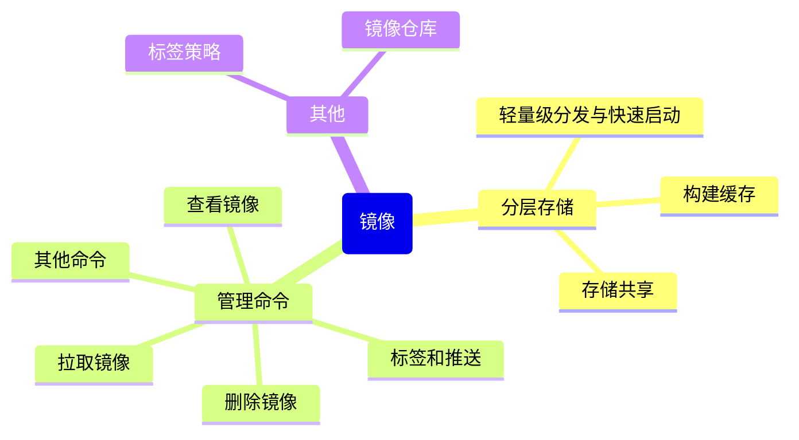

# 第3章：镜像管理：拉取、构建、推送

## 引言：镜像是容器的"灵魂模板"

如果你用过面向对象编程，那理解 Docker 镜像就毫无压力：

```python
# 镜像 = 类（Class）
class WebApp:
    """
    这个类定义了一切，但你不能直接用它
    你需要实例化（创建容器）才能运行
    """
    os = "Alpine Linux"
    runtime = "Python 3.11"
    framework = "Flask 2.3"
    code = "./app"
    
    def start(self):
        flask.run(host='0.0.0.0', port=5000)

# 容器 = 实例（Object）
app1 = WebApp()   # 容器1
app2 = WebApp()   # 容器2（同一个镜像，独立的实例）
```

镜像是只读的"模板"，容器是从模板创建出来的"运行实例"。本章我们专注于镜像本身的管理。

## 3.1 镜像的分层存储原理（UnionFS）

这是理解 Docker 的关键知识点。Docker 镜像不是一个大文件，而是由多层（Layers）叠加而成的，就像一个多层蛋糕：

```text
┌─────────────────────────────┐
│ Layer 5: 你的应用代码 (可写层只在容器运行时存在) │
├─────────────────────────────┤
│ Layer 4: npm install 安装的依赖    │  ← 只读
├─────────────────────────────┤
│ Layer 3: 复制 package.json         │  ← 只读
├─────────────────────────────┤
│ Layer 2: 设置工作目录 /app         │  ← 只读
├─────────────────────────────┤
│ Layer 1: Node.js 18 Alpine 基础镜像│  ← 只读
└─────────────────────────────┘
```

### 哪些指令会创建新层？

* 严格来说，只有三个指令会在文件系统上产生变化，从而创建新层：
* `RUN`：执行命令并提交结果。
* `COPY`：将构建上下文中的文件复制到镜像。
* `ADD`：与 `COPY` 类似，但能自动解压 tar 文件和从 URL 下载。

其他指令（如 `CMD`、`EXPOSE`、`ENV`、`WORKDIR`、`ENTRYPOINT` 等）只修改镜像的元数据，不产生新的文件系统层，因此不会增加层数。

### 用“蛋糕”模型展示

回到上图的蛋糕图，每多一条 COPY 或 RUN，就会多一层：

```dockerfile
FROM node:18-alpine          # Layer 1 (基础层)
WORKDIR /app                 # 不产生层，仅设置元数据
COPY package*.json ./        # Layer 2 (只读层)
RUN npm install              # Layer 3 (只读层)
COPY . .                     # Layer 4 (只读层)
```

构建后就是这样的四层只读镜像（加上运行时的容器可写层）。

### 与Git命令相似处

```javascript
// 类比：Git 的提交历史
// 每一层就像一次 Git commit，只记录变更（diff）

const layers = [
  { id: 'layer1', diff: '+ Alpine Linux 基础系统',     size: '5MB' },
  { id: 'layer2', diff: '+ Node.js 运行时',             size: '50MB' },
  { id: 'layer3', diff: '+ COPY package.json',          size: '1KB' },
  { id: 'layer4', diff: '+ RUN npm install',            size: '120MB' },
  { id: 'layer5', diff: '+ COPY . /app',                size: '2MB' },
];

// 多个镜像可以共享相同的底层
// 比如你有 10 个 Node.js 应用，它们共享 Layer 1 和 Layer 2
// 这样 10 个镜像总共占用的空间远小于 10 × (5 + 50 + 120) MB
```

### 与Git的根本区别

#### Git 是增量修改的历史链

* 每次 commit 记录的是相对于上一次 commit 的变更（diff）。
* 历史是一条线性的 commit 链，你可以回溯任意版本。
* 一个 Git 仓库通过不断追加 commit 来演进，旧 commit 永远是历史的一部分。

#### Docker 是独立完整的分层快照

* 每次构建生成一个独立的完整文件系统快照（通过共享层节省空间）。
* 镜像之间没有像 Git 那样的父子链接关系——新镜像不知道旧镜像的存在。
* 构建过程不是追加历史，而是根据 Dockerfile 指令重新生成层（可能复用缓存层），最终组合成一个新镜像。

**分层的好处**：

1. **共享存储**：10 个基于 `node:18-alpine` 的镜像只存一份基础层
2. **快速构建**：没变化的层直接用缓存，不用重新构建
3. **高效传输**：推送镜像时只上传变化的层

> [!TIP] 提示
> 理解分层存储后，你就明白为什么 Dockerfile 中要把"不常变化的指令放前面，经常变化的放后面"——这样可以最大化利用缓存，加速构建。

## 3.2 docker image 命令全家福

```bash
# ========== 查看镜像 ==========

# 列出本地所有镜像
docker image ls
# 等同于 docker images
# REPOSITORY   TAG          IMAGE ID       CREATED       SIZE
# nginx        latest       605c77e624dd   2 weeks ago   141MB
# node         18-alpine    abc123         3 days ago    180MB
# python       3.11-slim    def456         5 days ago    125MB

# 查看镜像的详细信息（JSON 格式）
docker image inspect nginx
# 输出镜像的所有元数据：创建时间、层信息、环境变量、入口命令等

# 查看镜像的构建历史（每一层做了什么）
docker image history nginx
# IMAGE          CREATED       SIZE    COMMENT
# 605c77e624dd   2 weeks ago   141MB   
# <missing>      2 weeks ago   1.4MB   /bin/sh -c #(nop) CMD [...]
# <missing>      2 weeks ago   0B      /bin/sh -c #(nop) EXPOSE 80
# ...

# ========== 拉取镜像 ==========

# 从 Docker Hub 拉取镜像
docker pull nginx:latest        # 默认 tag 是 latest
docker pull nginx:1.25-alpine   # 指定版本和变体
docker pull node:18             # 拉取 Node.js 18

# 从其他 Registry 拉取
docker pull registry.cn-hangzhou.aliyuncs.com/myproject/myapp:v1.0

# ========== 删除镜像 ==========

# 删除指定镜像
docker image rm nginx:latest
# 等同于 docker rmi nginx:latest

# 注意：如果有容器正在使用这个镜像，无法删除
# 需要先停止并删除相关容器

# 删除所有未被使用的镜像（dangling images）
docker image prune
# WARNING! This will remove all dangling images.
# Are you sure you want to continue? [y/N]: y

# 删除所有未被任何容器使用的镜像（更彻底）
docker image prune -a

# ========== 标签和推送 ==========

# 给镜像打标签（tag）
docker image tag myapp:latest registry.example.com/myapp:v1.0.0
# 格式：docker tag <源镜像:标签> <目标镜像:标签>
# 注：打标签并不会创建新的镜像，只是给同一个镜像ID，打不同的标签；虽然通过docker image ls可以查看

# 推送镜像到仓库
docker push registry.example.com/myapp:v1.0.0

# ========== 其他实用命令 ==========

# 查看镜像占用的磁盘空间
docker system df
# TYPE         TOTAL    ACTIVE   SIZE      RECLAIMABLE
# Images       5        2        1.2GB     600MB (50%)
# Containers   3        1        50MB      20MB (40%)
# ...

# 清理所有未使用的资源（镜像、容器、网络、缓存）
docker system prune
# 加 -a 清理所有未使用的镜像
# 加 --volumes 同时清理未使用的卷
```

## 3.3 Docker Hub 与其他 Registry

**Docker Hub** 是最常用的公共镜像仓库，就像 npm 的 npmjs.com 或 Python 的 PyPI：

```bash
# Docker Hub 的镜像地址格式
# [用户名/]镜像名[:标签]

# 官方镜像（没有用户名前缀）
docker pull nginx          # library/nginx:latest
docker pull python:3.11    # library/python:3.11

# 用户/组织的镜像
docker pull myuser/myapp:v1

# 登录 Docker Hub
docker login
# Username: your-username
# Password: ******
# Login Succeeded
```

**配置阿里云镜像加速器**（国内用户必备）：

```bash
# 编辑 Docker 配置文件
# Linux: /etc/docker/daemon.json
# Docker Desktop: Settings → Docker Engine → 编辑 JSON

# 添加镜像加速器配置
cat > /etc/docker/daemon.json << 'EOF'
{
  "registry-mirrors": [
    "https://你的专属地址.mirror.aliyuncs.com"
  ]
}
EOF

# 获取你的专属加速地址：
# 登录 https://cr.console.aliyun.com/
# 进入"镜像加速器"页面，复制你的专属地址
# 编辑完成后点击 Apply 保存按钮，等待Docker重启并应用配置的镜像加速器。
# 或重启 Docker 使配置生效
sudo systemctl daemon-reload
sudo systemctl restart docker
```

**其他常用 Registry**：

```bash
# GitHub Container Registry (ghcr.io)
docker pull ghcr.io/username/myapp:latest
docker login ghcr.io  # 用 GitHub Personal Access Token 登录

# 阿里云容器镜像服务
docker pull registry.cn-hangzhou.aliyuncs.com/namespace/image:tag
docker login registry.cn-hangzhou.aliyuncs.com

# 自建私有 Registry
docker run -d -p 5000:5000 --name registry registry:2
docker tag myapp:latest localhost:5000/myapp:latest
docker push localhost:5000/myapp:latest
```

## 3.4 镜像标签策略

**语义化版本标签**（推荐）：

```bash
# 好的标签策略
myapp:1.0.0          # 完整语义化版本
myapp:1.0            # 主版本.次版本
myapp:1              # 只到主版本
myapp:latest         # 最新稳定版（指向最新的稳定版本号）
myapp:1.0.0-alpine   # 带变体标识

# 不好的标签策略
myapp:latest         # 只依赖 latest（不可追溯）
myapp:new            # 含义模糊
myapp:v2             # 缺乏具体版本信息
```

**`latest` 标签的陷阱**：

```bash
# 危险操作！你不知道 latest 指向哪个版本
docker pull myapp:latest

# 今天 latest 可能是 1.2.0，明天可能就是 2.0.0（带 breaking changes）
# 生产环境中拉取 latest 就像在生产中 npm install 不锁版本一样危险

# 正确做法：始终指定明确的版本
docker pull myapp:1.2.0
```

```javascript
// 类比 npm 的版本管理
// package.json 中的版本号
{
  "dependencies": {
    "express": "^4.18.0",    // ✅ 指定版本范围
    "lodash": "latest"       // ❌ 不要这样做！
  }
}
// Docker 镜像标签也是一样的道理
```

> **Warning:** 在生产环境中**永远不要**使用 `:latest` 标签。当你需要回滚时，你不知道"上一个版本"是什么。使用语义化版本号或 Git commit SHA 作为标签。

> [!TIP] 提示
> 一个好的 CI/CD 实践是同时打两个标签：一个是语义化版本（如 `myapp:1.2.3`），一个是 Git commit SHA（如 `myapp:sha-a1b2c3d`）。前者方便人类阅读，后者方便精确追溯。

## 本章小结



* Docker 镜像是分层存储的，每层是一个只读的文件系统变更
* 分层机制实现了存储共享、构建缓存和轻量级分发与快速启动，大幅提升了效率
* `docker image` 系列命令管理镜像的增删查改
* 国内用户务必配置镜像加速器
* 生产环境使用语义化版本标签，远离 `:latest`

## 练习

1. 运行 `docker image history node:18-alpine`，观察它的分层结构
2. 配置阿里云镜像加速器，然后拉取 `python:3.11-slim`，对比配置前后的拉取速度
3. 给一个本地镜像打上三个不同的标签（语义化版本、简短版本、commit SHA 风格）
4. 运行 `docker system df` 查看你的 Docker 磁盘使用情况，然后用 `docker image prune` 清理

---
