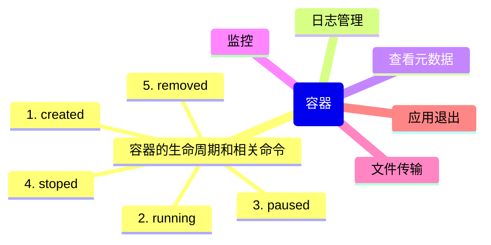

# 第4章：容器生命周期管理

## 引言：容器的一生

如果把容器比作一个人，那它的一生大概是这样的：

```bash
出生（create）→ 活跃工作（running）→ 午休（paused）→ 退休（stopped）→ 火化（removed）
```

Docker 容器有自己的状态机，理解这个状态机是管理好容器的前提。

## 4.1 容器状态机

```bash
                    docker run
    ┌──────┐  ──────────────→  ┌─────────┐
    │Created│                   │ Running  │
    └──────┘  ←──────────────  └────┬─────┘
               docker create        │
                                    │
                          ┌─────────┼─────────┐
                          │         │         │
                    docker pause    │    docker stop/kill
                          │         │         │
                          ▼         │         ▼
                    ┌─────────┐     │   ┌─────────┐
                    │ Paused  │     │   │ Stopped  │
                    └────┬────┘     │   └────┬────┘
                         │          │        │
                   docker unpause   │   docker start
                         │          │        │
                         └──────────→        │
                                    │        │
                                    └────────┘
                                    
                    docker rm（从 Stopped 状态删除）
                         ↓
                    ┌─────────┐
                    │ Removed │
                    └─────────┘
```

## 4.2 docker container 命令详解

### 创建和运行

```bash
# docker run = docker create + docker start（一步到位）
docker run -d --name my-app nginx
# 创建并立即启动

# docker create = 只创建不启动
docker create --name my-app nginx
# 返回容器 ID，但容器没有运行
docker start my-app
# 现在才开始运行

# 为什么有时候要分两步？
# 场景：你想先创建容器、检查配置，确认无误后再启动
```

### 停止和重启

```bash
# 停止容器（发送 SIGTERM，等待 10 秒后发 SIGKILL）
docker stop my-app

# 强制停止（直接发 SIGKILL，类似拔电源）
docker kill my-app

# 重启容器
docker restart my-app

# 暂停容器（冻结所有进程，类似"暂停游戏"）
docker pause my-app

# 恢复容器（"继续游戏"）
docker unpause my-app
```

`stop` vs `kill` 的区别，用代码来理解：

```javascript
// docker stop ≈ 优雅退出
process.on('SIGTERM', () => {
  console.log('收到停止信号，正在清理...');
  closeDatabaseConnection();    // 关闭数据库连接
  finishCurrentRequests();      // 处理完当前请求
  flushLogs();                  // 刷新日志
  process.exit(0);              // 干净退出
});

// docker kill ≈ 强制退出
// 就像直接 process.exit(1) 或者拔电源
// 数据库连接没关闭、请求处理到一半、日志丢失……
```

> **Warning:** 生产环境中尽量避免使用 `docker kill`。你的应用应该正确处理 `SIGTERM` 信号，实现优雅退出。如果 `docker stop` 超时后自动 `kill` 了你的容器，说明你的应用没有正确处理退出逻辑。

### 在运行中的容器内执行命令

```bash
# 进入容器的 shell（最常用的调试方式）
docker exec -it my-app /bin/bash
# 如果容器没有 bash（比如 Alpine 镜像），用 sh
docker exec -it my-app sh

# 在容器内执行单条命令
docker exec my-app ls /app
docker exec my-app cat /etc/os-release

# 以指定用户执行
docker exec -u root my-app cat /etc/shadow

# attach：连接到容器的标准输入/输出（和 exec 不同，attach 是附加到主进程）
docker attach my-app
# 注意：Ctrl+C 会导致容器停止！
# 用 Ctrl+P 然后 Ctrl+Q 来 detach（不断开容器）
```

`exec` vs `attach` 的区别：

```javascript
// docker exec ≈ 打开一个新的 SSH 会话
// 它创建一个新进程，不影响容器的主进程
const newSession = ssh.connect('container');
newSession.exec('bash');  // 独立的 shell 会话

// docker attach ≈ 回到已经打开的 SSH 会话
// 它连接到容器的主进程（PID 1）
const mainProcess = container.getMainProcess();
mainProcess.attachStdin(stdout);  // 你看到的就是主进程的输出
```

### 删除容器

```bash
# 删除已停止的容器
docker rm my-app

# 强制删除正在运行的容器（危险操作！）
docker rm -f my-app

# 删除容器及其关联的匿名卷
docker rm -v my-app

# 删除所有已停止的容器
docker container prune
# 或者
docker rm $(docker ps -aq -f status=exited)

# 删除所有容器（包括运行中的，慎用！）
docker rm -f $(docker ps -aq)
```

## 4.3 docker logs 与日志管理

```bash
# 查看容器日志
docker logs my-app
# 输出容器内应用的所有 stdout/stderr

# 实时跟踪日志（类似 tail -f）
docker logs -f my-app

# 只看最后 20 行
docker logs --tail 20 my-app

# 显示时间戳
docker logs -t my-app

# 查看某个时间点之后的日志
docker logs --since "2024-01-01T00:00:00" my-app
docker logs --since 30m my-app   # 最近 30 分钟
```

**日志驱动（Log Driver）**：

```bash
# Docker 默认使用 json-file 日志驱动
# 日志存储在：/var/lib/docker/containers/<container-id>/<container-id>-json.log

# 配置日志轮转，避免日志撑爆磁盘
# 在 docker run 时指定：
docker run -d \
  --log-driver json-file \
  --log-opt max-size=10m \
  --log-opt max-file=3 \
  my-app

# 或者全局配置（/etc/docker/daemon.json）：
{
  "log-driver": "json-file",
  "log-opts": {
    "max-size": "10m",
    "max-file": "3"
  }
}
```

> **Tip:** 在生产环境中，务必配置日志轮转（`max-size` 和 `max-file`）。没有日志轮转的容器就像一个永远在写入但从不归档的日志文件——早晚撑爆你的磁盘。

## 4.4 docker inspect：容器X光片

```bash
# 查看容器的所有元数据
docker inspect my-app
# 输出一个巨大的 JSON 对象，包含：
# - Id: 容器完整 ID
# - State: 运行状态、PID、启动时间
# - Image: 使用的镜像
# - NetworkSettings: IP 地址、端口映射
# - Mounts: 挂载的卷
# - Config: 环境变量、入口命令

# 用 --format（Go template）提取特定信息
docker inspect --format='{{.State.Status}}' my-app
# running

docker inspect --format='{{.NetworkSettings.IPAddress}}' my-app
# 172.17.0.2

docker inspect --format='{{json .Config.Env}}' my-app
# ["NODE_ENV=production","PATH=/usr/local/..."]
```

## 4.5 docker stats：实时监控

```bash
# 查看所有运行中容器的资源使用
docker stats
# CONTAINER ID  NAME      CPU %   MEM USAGE/LIMIT   MEM %   NET I/O         BLOCK I/O
# a1b2c3d4      my-api    0.50%   120MiB / 512MiB   23.4%   1.2kB / 650B   0B / 0B
# e5f6g7h8      my-db     1.20%   256MiB / 1GiB     25.0%   5.6MB / 3.2MB  4.1MB / 0B

# 监控特定容器
docker stats my-app

# 非交互模式（输出一次就退出，适合脚本使用）
docker stats --no-stream my-app
```

## 4.6 docker cp：容器内外文件传输

```bash
# 从宿主机复制到容器
docker cp ./local-file.txt my-app:/app/file.txt

# 从容器复制到宿主机
docker cp my-app:/app/logs/error.log ./error.log

# 复制整个目录
docker cp ./src my-app:/app/src
docker cp my-app:/app/data ./backup-data
```

```bash
# 实际调试场景：
# 1. 容器里的应用报错了，把日志拷出来分析
docker cp my-app:/app/logs/ ./logs-backup/

# 2. 需要修改容器里的配置文件来调试
docker cp my-app:/etc/nginx/nginx.conf ./nginx.conf
# 编辑 nginx.conf...
docker cp ./nginx.conf my-app:/etc/nginx/nginx.conf
docker restart my-app
```

> **Tip:** `docker cp` 适合临时调试。如果你经常需要在容器内外同步文件，应该使用 Bind Mount（第7章会详细讲）。

## 4.7 容器的优雅停止与信号处理

这是一个经常被忽略但非常重要的话题。当你的应用运行在容器中时，它是 PID 1（容器内的第一个进程）。在 Linux 中，PID 1 有特殊职责——它需要处理系统信号。

```javascript
// Node.js 应用的优雅退出实现
const server = app.listen(3000, () => {
  console.log('Server is running on port 3000');
});

// 优雅退出处理
function gracefulShutdown(signal) {
  console.log(`Received ${signal}. Shutting down gracefully...`);
  
  // 停止接收新请求
  server.close(() => {
    console.log('HTTP server closed');
    
    // 关闭数据库连接
    db.disconnect()
      .then(() => {
        console.log('Database connection closed');
        process.exit(0);
      })
      .catch((err) => {
        console.error('Error during shutdown:', err);
        process.exit(1);
      });
  });
  
  // 超时强制退出
  setTimeout(() => {
    console.error('Forced shutdown after timeout');
    process.exit(1);
  }, 9000); // 9秒，比 Docker 默认的 10 秒超时短
}

process.on('SIGTERM', () => gracefulShutdown('SIGTERM'));
process.on('SIGINT', () => gracefulShutdown('SIGINT'));
```

```python
# Python Flask 应用的优雅退出
import signal
import sys

def graceful_shutdown(signum, frame):
    print(f"Received signal {signum}, shutting down...")
    # 关闭数据库连接
    db.session.close()
    # 清理临时文件
    cleanup_temp_files()
    sys.exit(0)

signal.signal(signal.SIGTERM, graceful_shutdown)
signal.signal(signal.SIGINT, graceful_shutdown)
```

**信号传递流程图**：

```bash
docker stop my-app
      │
      ▼
 发送 SIGTERM 给容器的 PID 1
      │
      ▼
 应用收到 SIGTERM，开始优雅退出
（关闭连接、处理完请求、刷新日志）
      │
      ├── 如果在超时时间内退出 → 容器停止 ✅
      │
      └── 如果超时（默认10秒）→ 发送 SIGKILL 强制杀死 💀
```

> **Warning:** 如果你的容器入口命令是 shell 脚本（如 `sh -c "node app.js"`），SIGTERM 会被 shell 接收而不是你的应用！因为 shell 是 PID 1。解决方案：使用 `exec` 形式而不是 shell 形式，或者在 Dockerfile 中使用 `ENTRYPOINT` 而不是 `CMD`（第5章会详细讲）。

## 本章小结



- 容器有完整的生命周期：created → running → paused → stopped → removed
- `docker stop`（优雅退出）优于 `docker kill`（强制杀死）
- 应用必须正确处理 SIGTERM 信号，实现优雅退出
- `docker logs`、`docker inspect`、`docker stats` 是日常排查问题的三大神器
- `docker exec` 可以在运行中的容器内执行命令，是调试利器

## 练习

1. 创建一个 Nginx 容器，经历完整的生命周期：create → start → pause → unpause → stop → rm
2. 在运行中的 Nginx 容器内执行 `docker exec`，修改默认的 index.html，观察变化
3. 用 `docker stats` 观察你的容器资源使用情况
4. 写一个 Node.js 应用，实现 SIGTERM 优雅退出，打包成容器运行，用 `docker stop` 测试

---
