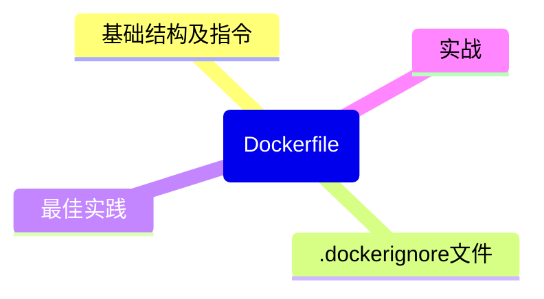

# 第5章：Dockerfile完全指南

## 引言：Dockerfile 是镜像的"源代码"

如果你把 Docker 镜像想象成一个编译好的程序，那 Dockerfile 就是它的源代码。

```bash
Dockerfile（源代码）  →  docker build（编译）  →  Image（可执行文件）  →  docker run（运行）  →  Container（进程）
```

就像你写 JavaScript 用 `.js` 文件，写 Python 用 `.py` 文件一样，写 Docker 镜像用 `Dockerfile`。

## 5.1 Dockerfile 基础结构

一个最简单的 Dockerfile：

```dockerfile
# 这是我的第一个 Dockerfile
# 每一行就是一条指令，构建时生成一个镜像层

# 第1步：选择一个基础镜像（必须有！）
FROM node:18-alpine

# 第2步：设置工作目录
WORKDIR /app

# 第3步：复制依赖文件
COPY package*.json ./

# 第4步：安装依赖
RUN npm install

# 第5步：复制应用代码
COPY . .

# 第6步：声明端口
EXPOSE 3000

# 第7步：定义启动命令
CMD ["node", "server.js"]
```

## 5.2 每条指令详解

### FROM —— 选择基础镜像

```dockerfile
# 基于 Node.js 18 Alpine
FROM node:18-alpine

# 基于 Python 3.11 slim
FROM python:3.11-slim

# 基于 Ubuntu 22.04
FROM ubuntu:22.04

# 从零开始（什么都不带，适合编译好的静态二进制文件）
FROM scratch

# 命名一个构建阶段（多阶段构建时会用到）
FROM node:18-alpine AS builder
```

> [!TIP] 提示
> 优先使用 `-alpine` 或 `-slim` 变体的镜像。`node:18` 约 1GB，`node:18-alpine` 只有约 180MB。更小的镜像 = 更快的拉取速度 + 更少的安全漏洞。

### RUN —— 执行命令

```dockerfile
# 在构建过程中执行命令（安装软件、编译代码等）

# 安装系统依赖
RUN apt-get update && apt-get install -y \
    curl \
    git \
    && rm -rf /var/lib/apt/lists/*
# ↑ 清理 apt 缓存，减小镜像体积

# 安装 Python 依赖
RUN pip install --no-cache-dir -r requirements.txt
# ↑ --no-cache-dir 不缓存 pip 下载，减小体积

# 每条 RUN 都会创建一个新的层
# 好的做法：合并多条命令到一条 RUN
RUN apt-get update && apt-get install -y curl git \
    && npm install -g typescript \
    && rm -rf /var/lib/apt/lists/*
# ✅ 一个层搞定

# 不好的做法（会创建多个层）
RUN apt-get update          # Layer 1
RUN apt-get install -y curl  # Layer 2
RUN apt-get install -y git   # Layer 3
# ❌ 三层，而且中间层的缓存文件也被保留了
```

### COPY —— 复制文件

```dockerfile
# 从构建上下文（你的项目目录）复制文件到镜像

# 复制单个文件
COPY package.json /app/package.json

# 复制整个目录
COPY . /app

# 复制时保持目录结构
COPY src/ /app/src/

# 从之前的构建阶段复制（多阶段构建）
COPY --from=builder /app/dist /app/dist

# 使用通配符
COPY *.json /app/
```

### ADD —— 增强版复制

```dockerfile
# ADD 能做 COPY 的所有事情，还能：
# 1. 自动解压 tar 文件
ADD archive.tar.gz /app/   # 自动解压到 /app/

# 2. 从 URL 下载文件（不推荐，用 RUN curl 替代更好）
ADD https://example.com/file.tar.gz /app/

# 大多数情况用 COPY，只有需要自动解压 tar 时才用 ADD
```

**COPY vs ADD 的选择原则**：

```
需要复制本地文件？          → COPY ✅
需要复制目录？              → COPY ✅
需要自动解压 tar.gz？      → ADD ✅
需要从 URL 下载？          → RUN curl/wget ✅（不用 ADD）
其他所有情况               → COPY ✅
```

### WORKDIR —— 设置工作目录

```dockerfile
# 设置后续指令的工作目录（类似 cd）
WORKDIR /app

# 如果目录不存在，会自动创建
# 后续的 RUN、COPY、CMD 等都在这个目录下执行
COPY . .        # 等于 COPY . /app/
RUN npm install # 在 /app 下执行

# 可以设置多次（每次基于上一次的目录）
WORKDIR /app
WORKDIR src     # 现在是 /app/src
```

### ENV —— 设置环境变量

```dockerfile
# 设置环境变量（构建时和运行时都有效）
ENV NODE_ENV=production
ENV APP_PORT=3000

# 一次设置多个
ENV NODE_ENV=production APP_PORT=3000 LOG_LEVEL=info

# 在后续指令中可以直接引用
RUN echo "Running in $NODE_ENV mode"
```

### ARG —— 构建时变量

```dockerfile
# ARG 只在构建时有效，运行时不可用
ARG NODE_VERSION=18
FROM node:${NODE_VERSION}-alpine

ARG BUILD_DATE
ARG VERSION=1.0.0

# 把构建时的 ARG 转为运行时的 ENV
ENV APP_VERSION=${VERSION}

# 构建时传入
# docker build --build-arg NODE_VERSION=20 --build-arg VERSION=2.0.0 -t myapp .
```

`ENV` vs `ARG` 的区别：

```javascript
// ARG = 编译时常量（构建完就消失了）
const BUILD_TIME_CONFIG = {
  nodeVersion: '18',    // 只在构建过程中可用
  buildDate: '2024-01-01'
};

// ENV = 运行时环境变量（容器运行后还在）
process.env.NODE_ENV    // 'production' - 运行时可用
process.env.APP_PORT    // '3000' - 运行时可用
```

### EXPOSE —— 声明端口

```dockerfile
# 声明容器运行时监听的端口（只是文档说明，不会实际映射）
EXPOSE 3000
EXPOSE 8080 8443

# 实际端口映射在 docker run 时通过 -p 参数指定
# docker run -p 3000:3000 myapp
```

> [!TIP] 提示
> `EXPOSE` 更像是一种"接口文档"。它告诉使用者"这个容器会监听这些端口"，但不会自动做任何端口映射。即使不写 `EXPOSE`，只要应用监听了对应端口，用 `-p` 一样能映射。不过建议还是写上，方便别人理解你的镜像。

### CMD —— 容器启动时的默认命令

```dockerfile
# 方式一：exec 格式（推荐！）
CMD ["node", "server.js"]

# 方式二：shell 格式
CMD node server.js

# 区别很重要！
# exec 格式：直接执行 node，node 是 PID 1
# shell 格式：先启动 /bin/sh -c，然后 sh 再启动 node
#            sh 是 PID 1，node 是 sh 的子进程
#            → 信号传递有问题！（第4章讲过）
```

### ENTRYPOINT —— 容器启动时的入口命令

```dockerfile
# ENTRYPOINT 定义了容器的"主命令"，不会被 docker run 后面的参数覆盖

# exec 格式（推荐）
ENTRYPOINT ["node"]
CMD ["server.js"]
# docker run myapp → 执行 node server.js
# docker run myapp worker.js → 执行 node worker.js（CMD 被覆盖）

# 常见用法：用 ENTRYPOINT 设置脚本
COPY entrypoint.sh /entrypoint.sh
RUN chmod +x /entrypoint.sh
ENTRYPOINT ["/entrypoint.sh"]
CMD ["node", "server.js"]
```

## 5.3 CMD vs ENTRYPOINT 的区别（经典面试题）

这是 Docker 面试必问的题目，用一张表讲清楚：

| 场景 | ENTRYPOINT | CMD | docker run 行为 |
|------|-----------|-----|-----------------|
| 只有 CMD | 无 | `["node", "app.js"]` | `docker run myapp` → `node app.js` |
| | | | `docker run myapp python` → `python`（完全覆盖） |
| 只有 ENTRYPOINT | `["node"]` | 无 | `docker run myapp` → `node`（报错，没参数） |
| | | | `docker run myapp app.js` → `node app.js`（追加参数） |
| 两者都有 | `["node"]` | `["app.js"]` | `docker run myapp` → `node app.js` |
| | | | `docker run myapp worker.js` → `node worker.js` |

```javascript
// 用 JavaScript 来理解
function startContainer(entrypoint, cmd, userArgs) {
  if (userArgs.length > 0) {
    if (entrypoint) {
      // 有 ENTRYPOINT：用户参数替换 CMD，追加到 ENTRYPOINT 后面
      return [...entrypoint, ...userArgs];
    } else {
      // 只有 CMD：用户参数完全替换 CMD
      return userArgs;
    }
  } else {
    // 没有用户参数：ENTRYPOINT + CMD
    return [...(entrypoint || []), ...(cmd || [])];
  }
}

// 示例
startContainer(['node'], ['app.js'], []);           // → ['node', 'app.js']
startContainer(['node'], ['app.js'], ['worker.js']); // → ['node', 'worker.js']
startContainer(null, ['node', 'app.js'], ['python']); // → ['python']
```

**最佳实践**：

- 如果你的容器总是运行同一个程序 → 用 `CMD`
- 如果你的容器是一个可执行工具 → 用 `ENTRYPOINT + CMD`
- 两者结合使用时，`ENTRYPOINT` 定义程序，`CMD` 定义默认参数

## 5.4 .dockerignore 文件

就像 `.gitignore` 告诉 Git 哪些文件不要提交，`.dockerignore` 告诉 Docker 哪些文件不要发送到构建上下文：

```dockerignore
# .dockerignore 示例

# 版本控制
.git
.gitignore

# 依赖目录（容器内会重新安装）
node_modules
__pycache__
*.pyc
.venv

# IDE 和编辑器
.vscode
.idea
*.swp
*.swo

# 环境变量（绝对不要打包进镜像！）
.env
.env.*

# 文档和测试
README.md
docs/
tests/
coverage/

# Docker 相关文件（不需要递归包含）
Dockerfile
docker-compose*.yml
.dockerignore

# 构建产物
dist/
build/
*.log
```

> [!WARNING] 注意
> 忘记写 `.dockerignore` 是新手最常犯的错误之一。不把 `node_modules` 排除在外的话，Docker 会把你本地的 `node_modules`（可能是 macOS 上编译的二进制）复制到 Linux 容器里，然后各种诡异报错。更糟糕的是，`.env` 文件里的密码和密钥也会被打包进镜像！

## 5.5 最佳实践

### 减少层数

```dockerfile
# ❌ 不好的写法：每条指令一个层
RUN apt-get update
RUN apt-get install -y curl
RUN apt-get install -y git
RUN apt-get install -y vim
RUN rm -rf /var/lib/apt/lists/*
# 5 层，而且前 3 层的 apt 缓存没被清理

# ✅ 好的写法：合并相关命令
RUN apt-get update && apt-get install -y \
    curl \
    git \
    vim \
    && rm -rf /var/lib/apt/lists/*
# 1 层，而且缓存也被清理了
```

### 排序指令利用缓存

```dockerfile
# ❌ 缓存利用差：任何文件变动都会导致 npm install 重新执行
FROM node:18-alpine
WORKDIR /app
COPY . .                    # 任何文件变化都会使这一层缓存失效
RUN npm install             # 每次都重新安装，慢死！
CMD ["node", "server.js"]

# ✅ 缓存利用好：只有 package.json 变化时才重新安装
FROM node:18-alpine
WORKDIR /app
COPY package*.json ./       # 只有依赖文件变化才使缓存失效
RUN npm install             # 大部分时候走缓存，秒过！
COPY . .                    # 代码变化不影响上面的层
CMD ["node", "server.js"]
```

### 最小化镜像体积

```dockerfile
# 1. 使用 alpine/slim 基础镜像
FROM node:18-alpine    # ~180MB vs node:18 ~1GB

# 2. 安装时不要缓存
RUN apk add --no-cache curl

# 3. 安装生产依赖 only
RUN npm ci --only=production    # npm ci 比 npm install 更快、更可靠

# 4. 使用 .dockerignore 排除不必要的文件

# 5. 多阶段构建（第6章详讲）
```

## 5.6 实战：Node.js Express 应用的 Dockerfile

```dockerfile
# ========== Node.js Express Dockerfile ==========

# 使用 Node.js 18 Alpine 作为基础镜像
# Alpine 是超轻量的 Linux 发行版，只有 ~5MB
FROM node:18-alpine

# 创建非 root 用户（安全最佳实践）
# 默认容器以 root 运行，这有安全风险
RUN addgroup -g 1001 -S appgroup && \
    adduser -S appuser -u 1001 -G appgroup

# 设置工作目录
WORKDIR /app

# 先复制依赖文件（利用构建缓存）
COPY package*.json ./

# 安装生产依赖
# npm ci 比 npm install 更适合 CI/CD 和 Docker：
#   1. 更快（不需要解析 package.json）
#   2. 更可靠（严格按照 package-lock.json 安装）
#   3. 如果没有 lock 文件会报错（这正是你想要的）
RUN npm ci --only=production && \
    npm cache clean --force

# 复制应用代码
COPY . .

# 切换为非 root 用户
USER appuser

# 声明应用监听的端口
EXPOSE 3000

# 设置 Node.js 环境变量
ENV NODE_ENV=production

# 定义健康检查（第6章会详细讲）
HEALTHCHECK --interval=30s --timeout=3s --start-period=5s --retries=3 \
  CMD wget --no-verbose --tries=1 --spider http://localhost:3000/health || exit 1

# 使用 exec 格式定义启动命令
CMD ["node", "server.js"]
```

构建和运行：

```bash
# 构建镜像
docker build -t my-express-app:1.0.0 .

# 运行容器
docker run -d -p 3000:3000 --name my-app my-express-app:1.0.0

# 查看日志
docker logs -f my-app
```

## 5.7 实战：Python Flask 应用的 Dockerfile

```dockerfile
# ========== Python Flask Dockerfile ==========

# 使用 Python 3.11 slim 基础镜像
FROM python:3.11-slim

# 设置环境变量
# PYTHONUNBUFFERED=1 确保 Python 输出不被缓冲（对日志很重要）
# PYTHONDONTWRITEBYTECODE=1 不生成 .pyc 文件
ENV PYTHONUNBUFFERED=1 \
    PYTHONDONTWRITEBYTECODE=1 \
    FLASK_APP=app.py \
    FLASK_ENV=production

# 安装系统依赖（如果你的项目需要编译型 Python 包）
RUN apt-get update && apt-get install -y --no-install-recommends \
    gcc \
    libpq-dev \
    && rm -rf /var/lib/apt/lists/*

# 设置工作目录
WORKDIR /app

# 先复制依赖文件
COPY requirements.txt .

# 安装 Python 依赖
# --no-cache-dir 不缓存 pip 下载
RUN pip install --no-cache-dir -r requirements.txt

# 清理编译工具（如果不需要的话）
RUN apt-get purge -y gcc && apt-get autoremove -y

# 复制应用代码
COPY . .

# 创建非 root 用户
RUN useradd --create-home appuser && chown -R appuser:appuser /app
USER appuser

# 声明端口
EXPOSE 5000

# 健康检查
HEALTHCHECK --interval=30s --timeout=3s --start-period=5s --retries=3 \
  CMD python -c "import urllib.request; urllib.request.urlopen('http://localhost:5000/health')" || exit 1

# 使用 gunicorn（生产级 WSGI 服务器）而不是 Flask 内置开发服务器
CMD ["gunicorn", "--bind", "0.0.0.0:5000", "--workers", "4", "app:app"]
```

构建和运行：

```bash
# 构建镜像
docker build -t my-flask-app:1.0.0 .

# 运行容器
docker run -d -p 5000:5000 --name my-flask my-flask-app:1.0.0

# 传入环境变量覆盖
docker run -d -p 5000:5000 \
  -e FLASK_ENV=development \
  -e DATABASE_URL=postgres://localhost/mydb \
  my-flask-app:1.0.0
```

> [!TIP] 提示
> Python 项目在生产环境中不要用 Flask 内置的开发服务器（`flask run`），它不是为生产设计的。使用 gunicorn、uwsgi 等专业 WSGI 服务器。Node.js 这边也一样，确保你的 Express/Koa 应用用了 pm2 或 cluster 模式来利用多核 CPU。

## 本章小结



- Dockerfile 是镜像的"源代码"，每条指令生成一个层
- 核心指令：FROM（基础镜像）、RUN（执行命令）、COPY（复制文件）、CMD（启动命令）、ENTRYPOINT（入口点）
- CMD 可被覆盖，ENTRYPOINT 不可被覆盖（参数会追加）——面试高频题
- 最佳实践：用 `.dockerignore`、合并 RUN 减少层数、先 COPY 依赖文件再 COPY 代码以利用缓存
- 生产环境用 alpine/slim 镜像、非 root 用户、生产级服务器

## 练习

1. 为一个简单的 Express 应用编写 Dockerfile，构建并运行
2. 故意在 Dockerfile 中写一个语法错误，观察构建失败的错误信息
3. 对比 `COPY . .` 在 `RUN npm install` 之前和之后的构建速度差异
4. 编写一个包含 `.dockerignore` 的项目，对比有无 `.dockerignore` 时的构建上下文大小

---
