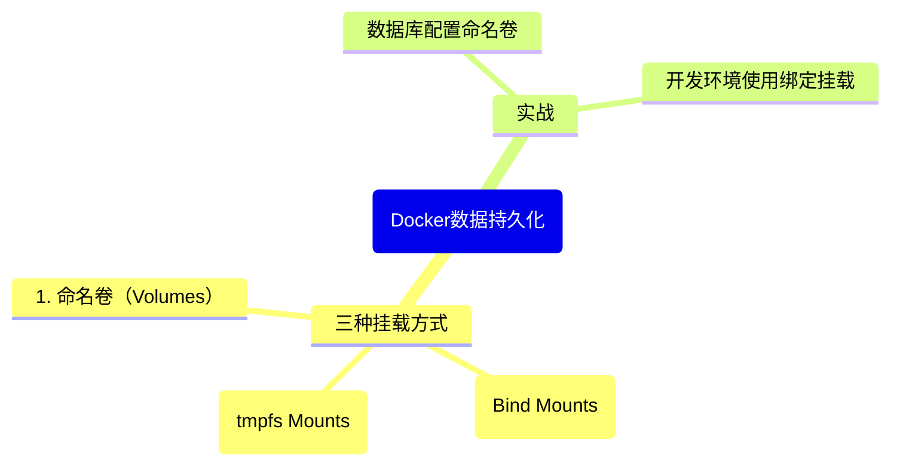

# 第7章：Docker数据持久化

## 引言：容器的"失忆症"

Docker 容器有一个"致命缺点"——它们天生就是"健忘"的。

```javascript
// 容器的文件系统就像内存中的变量
let userData = { name: "张三", age: 25 };  // 程序运行时数据在这里

// 当程序退出（容器停止）
process.exit();
// userData 消失了！什么都没有了！
// 容器停止后，所有文件系统的修改都会丢失
```

想象一下：你在容器里跑了个 MySQL 数据库，辛辛苦苦导入了 100 万条数据。然后容器重启了——所有数据，灰飞烟灭。

这就是为什么我们需要数据持久化。

## 7.1 Docker 的三种挂载方式

```bash
┌─────────────────────────────────────────────────────┐
│                    宿主机（Host）                     │
│                                                      │
│  ┌────────────────┐   ┌──────────────────────┐      │
│  │ /var/lib/docker│   │ /home/user/project    │      │
│  │ /volumes/      │   │                        │      │
│  │ ┌──────────┐   │   │ src/                   │      │
│  │ │ my-data  │   │   │ package.json           │      │
│  │ │ (Volume) │   │   │ .env                   │      │
│  │ └──────────┘   │   └──────────┬─────────────┘      │
│  └───────┬────────┘              │                    │
│          │                       │                    │
│          │     ┌─────────────────┘                    │
│          │     │                                      │
│  ┌───────▼─────▼─────────────────────────────────┐   │
│  │              容器                               │   │
│  │                                                 │   │
│  │  /var/lib/mysql ← Volume（Docker 管理的存储）   │   │
│  │  /app             ← Bind Mount（宿主机目录）    │   │
│  │  /tmp/cache       ← tmpfs（内存中的临时存储）    │   │
│  └─────────────────────────────────────────────────┘   │
└─────────────────────────────────────────────────────┘
```

## 7.2 Volumes（命名卷）

Volumes 是 Docker 官方推荐的持久化方式，数据由 Docker 管理，存储在 Docker 专用的目录下。

```bash
# ========== 创建卷 ==========
docker volume create my-data
# my-data

# ========== 查看所有卷 ==========
docker volume ls
# DRIVER    VOLUME NAME
# local     my-data

# ========== 查看卷的详细信息 ==========
docker volume inspect my-data
# [
#   {
#     "Driver": "local",
#     "Mountpoint": "/var/lib/docker/volumes/my-data/_data",  ← 实际存储位置
#     "Name": "my-data",
#     ...
#   }
# ]

# ========== 使用卷 ==========
# 方式一：在 docker run 中指定
docker run -d \
  --name my-db \
  -v my-data:/var/lib/mysql \
  mysql:8

# 方式二：在 Dockerfile 中声明（只是声明，不会自动创建卷）
# VOLUME /var/lib/mysql

# ========== 删除卷 ==========
# 注意：删除卷会永久丢失数据！
docker volume rm my-data

# ========== 清理未使用的卷 ==========
docker volume prune
# WARNING! This will remove all local volumes not used by at least one container.
```

**Volume 的特性**：

```javascript
// Volume 就像一个"外部硬盘"
const volume = {
  managed_by: 'Docker',           // Docker 管理，不需要操心路径
  portable: true,                 // 可以在容器之间迁移
  lifecycle: '独立于容器',         // 容器删除了，卷还在
  performance: '最佳',             // 直接写入宿主机文件系统
  backup: 'docker run --rm -v my-data:/backup alpine tar czf /backup/backup.tar.gz /data',
};
```

## 7.3 Bind Mounts（绑定挂载）

Bind Mounts 直接把宿主机的目录挂载到容器中，两边实时同步：

```bash
# 将宿主机的 /home/user/project 目录挂载到容器的 /app
docker run -d \
  --name dev-server \
  -v /home/user/project:/app \
  -p 3000:3000 \
  node:18-alpine sh -c "cd /app && npm run dev"

# 现在你在宿主机修改代码，容器内立刻就能看到变化！
# 这对开发环境来说简直太棒了
```

```bash
# 只读挂载（容器不能修改宿主机的文件）
docker run -d \
  -v /home/user/config:/app/config:ro \
  my-app

# 使用 $PWD 获取当前目录（更方便）
docker run -d \
  -v $(pwd):/app \
  -v $(pwd)/.env:/app/.env:ro \
  my-app
```

**Bind Mount 的特性**：

```javascript
const bindMount = {
  managed_by: '你（开发者）',      // 你完全控制文件位置和内容
  portable: false,                  // 路径和宿主机绑定，换机器可能不一样
  lifecycle: '跟着宿主机走',        // 宿主机目录在就在
  performance: '稍差于 Volume',     // 多了一层间接访问
  use_case: '开发环境、配置文件',
  warning: '容器可以直接修改宿主机的文件，注意安全！',
};
```

## 7.4 tmpfs Mounts（临时文件系统）

tmpfs 挂载在内存中，速度极快，但容器停止就消失：

```bash
# 创建 tmpfs 挂载
docker run -d \
  --name my-app \
  --tmpfs /tmp/cache:rw,size=100m \
  my-app

# 适合存放：
# - 临时缓存文件
# - 敏感数据（不应该写入磁盘）
# - 需要极快读写速度的临时文件
```

```bash
# 在 docker-compose.yml 中配置 tmpfs
# services:
#   app:
#     tmpfs:
#       - /tmp/cache:size=100m
```

## 7.5 三种方式的对比

| 特性 | Volume | Bind Mount | tmpfs |
|------|--------|------------|-------|
| 存储位置 | Docker 管理的目录 | 宿主机任意目录 | 内存 |
| 持久性 | 容器删除后仍在 | 容器删除后仍在 | 容器停止就消失 |
| 性能 | 优秀 | 良好 | 极快（但容量有限） |
| 可移植性 | 好（Docker 管理路径） | 差（依赖宿主机路径） | 不适用 |
| 共享数据 | 多个容器可共享 | 多个容器可共享 | 不可以 |
| 典型场景 | 数据库存储、用户上传文件 | 开发环境、配置文件 | 临时缓存、密钥 |
| 推荐度 | 生产环境首选 | 开发环境首选 | 特殊场景使用 |

选择决策树：

```bash
需要持久化数据？
├── 是 → 数据需要跨主机共享？
│        ├── 是 → 使用网络存储（NFS、云存储）
│        └── 否 → 开发环境还是生产环境？
│                 ├── 开发 → Bind Mount（实时同步代码）
│                 └── 生产 → Volume（Docker 管理，更可靠）
└── 否 → 是否需要极快的临时存储？
         ├── 是 → tmpfs
         └── 否 → 不需要挂载，用容器默认文件系统
```

## 7.6 实战：为数据库容器配置持久化存储

数据库是最需要持久化的服务——你总不想重启一下就丢数据吧。

```bash
# ========== MySQL 持久化 ==========

# 创建命名卷
docker volume create mysql-data

# 启动 MySQL 容器
docker run -d \
  --name my-mysql \
  -e MYSQL_ROOT_PASSWORD=my-secret-pw \
  -e MYSQL_DATABASE=myapp \
  -v mysql-data:/var/lib/mysql \
  -p 3306:3306 \
  mysql:8

# 验证数据持久化
# 1. 连接 MySQL，插入一些数据
docker exec -it my-mysql mysql -uroot -pmy-secret-pw
# mysql> USE myapp;
# mysql> CREATE TABLE users (id INT AUTO_INCREMENT PRIMARY KEY, name VARCHAR(50));
# mysql> INSERT INTO users (name) VALUES ('张三'), ('李四');
# mysql> SELECT * FROM users;
# mysql> exit;

# 2. 删除容器（注意：不要加 -v，否则卷也会被删除）
docker rm -f my-mysql

# 3. 用同一个卷重新启动
docker run -d \
  --name my-mysql \
  -e MYSQL_ROOT_PASSWORD=my-secret-pw \
  -v mysql-data:/var/lib/mysql \
  -p 3306:3306 \
  mysql:8

# 4. 再次连接，数据还在！
docker exec -it my-mysql mysql -uroot -pmy-secret-pw
# mysql> USE myapp;
# mysql> SELECT * FROM users;
# +----+------+
# | id | name |
# +----+------+
# |  1 | 张三 |
# |  2 | 李四 |
# +----+------+
```

```bash
# ========== PostgreSQL 持久化 ==========

docker volume create pg-data

docker run -d \
  --name my-postgres \
  -e POSTGRES_USER=myapp \
  -e POSTGRES_PASSWORD=my-secret-pw \
  -e POSTGRES_DB=myapp \
  -v pg-data:/var/lib/postgresql/data \
  -p 5432:5432 \
  postgres:16

# ========== MongoDB 持久化 ==========

docker volume create mongo-data

docker run -d \
  --name my-mongo \
  -e MONGO_INITDB_ROOT_USERNAME=admin \
  -e MONGO_INITDB_ROOT_PASSWORD=my-secret-pw \
  -v mongo-data:/data/db \
  -p 27017:27017 \
  mongo:7
```

> **Warning:** 删除容器时如果加了 `-v` 参数（`docker rm -v`），关联的匿名卷也会被删除！这是新手最常导致数据丢失的操作。建议始终使用命名卷而不是匿名卷，这样即使误操作也能及时发现。

## 7.7 实战：开发环境使用 Bind Mounts 实现热更新

在开发环境中，我们希望修改代码后容器能自动重启或热更新——Bind Mounts 完美适配这个需求。

### Node.js Express 开发环境

```bash
# 启动开发容器
docker run -d \
  --name dev-api \
  -v $(pwd):/app \
  -v /app/node_modules \
  -p 3000:3000 \
  -e NODE_ENV=development \
  node:18-alpine sh -c "cd /app && npm install && npm run dev"
```

等一下，这里有个 `-v /app/node_modules` 是什么意思？这是一个"匿名卷"技巧：

```javascript
// 解释一下这个巧妙的设计
const mounts = [
  {
    type: 'bind mount',
    host: '$(pwd)',           // 宿主机项目目录
    container: '/app',        // 映射到容器 /app
    purpose: '代码实时同步'
  },
  {
    type: 'anonymous volume',
    container: '/app/node_modules',  // 覆盖上面的 bind mount
    purpose: '保护容器内的 node_modules 不被宿主机的覆盖'
    // 因为 macOS/Windows 的 node_modules 和 Linux 的可能不兼容
    // 这个匿名卷让容器用自己的 node_modules
  }
];
```

配合 nodemon 实现热更新（package.json 中）：

```json
{
  "scripts": {
    "dev": "nodemon server.js"
  },
  "devDependencies": {
    "nodemon": "^3.0.0"
  }
}
```

现在你在宿主机用 VS Code 写代码，保存文件，容器里的 nodemon 检测到变化自动重启——完美的开发体验！

### Python Flask 开发环境

```bash
# 启动 Flask 开发容器
docker run -d \
  --name dev-flask \
  -v $(pwd):/app \
  -p 5000:5000 \
  -e FLASK_ENV=development \
  -e FLASK_DEBUG=1 \
  python:3.11-slim sh -c "cd /app && pip install -r requirements.txt && flask run --host=0.0.0.0"

# Flask 在 DEBUG 模式下自带热重载
# 修改代码保存后，Flask 自动重新加载
```

> **Tip:** 在开发环境中，你也可以把数据库的卷也映射出来，方便查看和调试：
>
> ```bash
> docker run -d \
>   --name dev-db \
>   -v $(pwd)/docker-data/mysql:/var/lib/mysql \
>   -e MYSQL_ROOT_PASSWORD=dev-password \
>   -p 3306:3306 \
>   mysql:8
> ```
>
> 这样数据库文件就在你项目目录下的 `docker-data/mysql` 里，随时可以备份或清理。
> **Warning:** 开发环境的 Bind Mount 绝对不能直接用在生产环境！生产环境应该使用 Volume 并且做好备份策略。另外，Bind Mount 在 macOS 和 Windows 上通过虚拟机实现，性能比 Linux 原生差不少——这就是为什么在 Mac 上开发时 `npm install` 有时候特别慢的原因之一。

## 本章小结



- 容器文件系统是临时的，容器停止后数据丢失——必须做持久化
- **Volume**（命名卷）：Docker 管理，生产环境首选
- **Bind Mount**（绑定挂载）：宿主机目录映射，开发环境首选
- **tmpfs**：内存中的临时存储，适合缓存和敏感临时数据
- 数据库务必使用 Volume，开发环境推荐 Bind Mount + nodemon/flask debug
- 永远不要在 `docker rm` 时不小心加 `-v` 删掉了宝贵的数据卷

## 练习

1. 创建一个 MySQL 容器，使用命名卷存储数据，插入数据后删除容器，重新创建验证数据还在
2. 用 Bind Mount 为一个 Node.js 项目搭建开发环境，实现代码修改后容器自动重启
3. 对比 Volume 和 Bind Mount 的磁盘 I/O 性能（可以用 `dd` 命令测试写入速度）
4. 列出你当前项目中使用的所有 Docker 卷（`docker volume ls`），分析哪些是匿名卷，考虑将它们改为命名卷

---

*Part 1 完。接下来进入 Part 2：Docker Compose 与多容器应用。*
