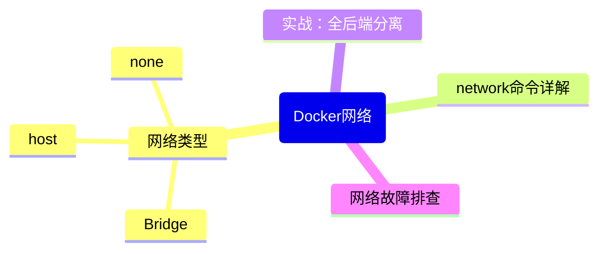

# 第8章：Docker网络详解 —— 让容器们互相"聊天"

## 引言：容器的社交网络

想象一下，你刚入职一家新公司，每个容器就是一位新同事。如果大家都被关在各自的小黑屋里（隔离环境），没有任何通讯工具，那前后端怎么联调？数据库怎么连接？这就好比让前端工程师用漂流瓶给后端发 API 请求——浪漫但不靠谱。

Docker 网络就是给容器们搭建的"企业微信"。它让容器之间能够互相发现、互相通信，甚至还能搞"权限隔离"——某些容器只能跟特定容器说话，就像你不想让实习生直接访问生产数据库一样。

在这一章里，我们会从 Docker 的网络模型讲起，带你搞懂 bridge、host、none 这些默认网络，然后深入自定义网络的最佳实践，最后实战搭建一个前后端分离应用的网络隔离方案。

---

## 8.1 Docker 网络模型概览

Docker 的网络架构基于 **Network Namespace**（网络命名空间）这个 Linux 内核特性。每启动一个容器，Docker 就会为它创建一个独立的网络命名空间——就像给每个容器分配了一间独立的"网络办公室"，有自己的网卡、IP 地址、路由表和防火墙规则。

这就好比你写代码时的模块化思想：每个模块有自己的作用域，模块之间通过接口（网络）通信，而不是直接访问内部变量。

```bash
┌──────────────────────────────────────────────────┐
│                   Docker Host                     │
│                                                   │
│  ┌─────────────┐    ┌─────────────┐              │
│  │ Container A │    │ Container B │              │
│  │  ┌───────┐  │    │  ┌───────┐  │              │
│  │  │ eth0  │  │    │  │ eth0  │  │              │
│  │  │172.17 │  │    │  │172.17 │  │              │
│  │  │ .0.2  │  │    │  │ .0.3  │  │              │
│  │  └───┬───┘  │    │  └───┬───┘  │              │
│  └──────┼──────┘    └──────┼──────┘              │
│         │                  │                      │
│  ┌──────┴──────────────────┴──────┐              │
│  │      Virtual Bridge (br0)      │              │
│  │         172.17.0.1             │              │
│  └──────────────┬─────────────────┘              │
│                 │                                 │
│          ┌──────┴──────┐                         │
│          │  NAT (iptables) │                     │
│          └──────┬──────┘                         │
│                 │                                 │
│          ┌──────┴──────┐                         │
│          │  Host eth0  │                         │
│          └─────────────┘                         │
└──────────────────────────────────────────────────┘
```

Docker 提供了三种开箱即用的默认网络：

| 网络类型 | 类比 | 特点 |
| --------- | ------ | ------ |
| **bridge** | 公司内网 | 默认网络，容器通过虚拟网桥通信 |
| **host** | 共享办公桌 | 容器直接使用宿主机网络 |
| **none** | 小黑屋 | 容器没有网络连接 |

---

## 8.2 默认网络详解

### 8.2.1 Bridge 网络 -- 默认模式，住公寓

Bridge 网络是 Docker 的默认网络模式，也是你用得最多的模式。每次你 `docker run` 一个容器但不指定 `--network` 参数时，Docker 就会自动把它挂到默认的 `bridge` 网络上。

```bash
# 查看默认网络列表
docker network ls
# 输出类似：
# NETWORK ID     NAME      DRIVER    SCOPE
# a1b2c3d4e5f6   bridge    bridge    local
# f6e5d4c3b2a1   host      host      local
# 1a2b3c4d5e6f   none      null      local

# 查看 bridge 网络的详细信息
docker network inspect bridge
```

Bridge 网络的工作原理：Docker 会在宿主机上创建一个虚拟网桥（`docker0`），相当于一个"虚拟交换机"。每个容器启动时，Docker 会创建一对虚拟网卡（veth pair），一端插在容器的网络命名空间里，另一端插在 `docker0` 网桥上。

每个容器分配一个私有 IP（比如 172.17.0.2），通过 NAT 访问外部网络。就像住公寓——每间房有自己的门牌号（容器 IP），但共用一个小区大门（宿主机 IP）出去。同一座桥上的容器可以直接互通，外面想访问进来则需要端口映射（-p）。

```bash
# 在默认 bridge 网络中运行两个容器
docker run -d --name web1 nginx:alpine
docker run -d --name web2 nginx:alpine

# 从 web1 ping web2 的 IP 地址（可以通）
docker exec web1 ping -c 3 <web2的IP>

# 但是！在默认 bridge 网络中，不能通过容器名解析（这是个坑！）
docker exec web1 ping -c 3 web2
# 输出：ping: bad address 'web2'
```

> [!TIP] 提示
> 默认 bridge 网络有一个重大缺陷：不支持容器名 DNS 解析。如果你需要容器之间通过名字互相访问（谁不想用 `http://my-container:3000` 而要用 `http://172.17.0.3:3000` 呢？），请使用**自定义桥接网络**。这也是为什么我们说默认 bridge 网络只适合临时测试，不适合生产环境。默认 bridge 之于自定义 bridge，就像临时工棚之于正式办公楼——不是工棚不能住人，是故意不给你装修好，让你搬去正式的地方。

### 8.2.2 Host 网络 -- “合租，共用一切”

加 --network host 启动容器时，容器直接使用宿主机的网络栈——没有独立的 IP，没有端口隔离，容器里的 80 端口就是宿主主机上的 80 端口。性能最好（少了 NAT 开销），但端口冲突要自己管。就像合租一套房，大家共用同一个地址、同一个门，谁占了哪个房间自己协商。

```bash
# 使用 host 网络模式运行容器
docker run -d --name web-host --network host nginx:alpine

# 此时容器直接使用宿主机的 80 端口
# 访问 http://localhost 就能看到 Nginx 欢迎页面
# 不需要 -p 端口映射！
```

这就像你和同事共享一张办公桌——方便是方便，但容易产生端口冲突（想象两个容器都想用 80 端口的场景，就像两个人同时抢一把椅子）。

> **Warning:** Host 网络模式在 macOS 和 Windows 的 Docker Desktop 上**不可用**（因为 Docker Desktop 本身运行在一个 Linux 虚拟机里）。此外，host 模式会暴露所有宿主机端口，安全风险较高，不建议在生产环境随意使用。

### 8.2.3 None 网络 -- "完全断网"

容器只有一个 loopback 接口（127.0.0.1），没有任何外部网络能力。适用于纯计算任务或者你想手动配置网络的场景。就像把一台电脑扔进法拉第笼，只跟自己说话。

```bash
# 创建一个"与世隔绝"的容器
docker run -d --name isolated --network none alpine sleep 3600

# 进入容器看看网络状态
docker exec isolated ip addr
# 只有 lo 接口，没有 eth0

# 尝试 ping 外网
docker exec isolated ping -c 1 8.8.8.8
# 输出：Network is unreachable
```

什么时候会用到？比如你需要运行一个纯计算的批处理任务，它只需要读取挂载的数据、处理、然后写出结果——完全不需要网络。这就像一个"只读数据分析师"，只接触本地数据，不能上网摸鱼。

---

## 8.3 自定义桥接网络（推荐做法） -- “自建别墅区”

如果说默认 bridge 是"公租房"——Docker 给你安排好了，推门就住进去，邻居是谁你也不知道，那自定义 bridge 就是自建别墅小区。

你来规划这个小区：拉围墙（创建网络）、决定哪些住户能进来（明确指定 --network）、小区内部还配了一个物业前台（内置 DNS），你要找谁，报个名字前台直接告诉你门牌号：

```bash
# 创建自定义桥接网络
docker network create --driver bridge my-app-network
# 等价于简写：
docker network create my-app-network

# 创建网络时指定子网和网关
docker network create \
  --driver bridge \
  --subnet 192.168.100.0/24 \
  --gateway 192.168.100.1 \
  my-custom-network

# 在自定义网络中运行容器
docker run -d --name api-server --network my-app-network node:18-alpine
docker run -d --name frontend --network my-app-network nginx:alpine

# 现在可以通过容器名互相访问了！
docker exec frontend ping -c 3 api-server
# 输出：PING api-server (192.168.x.x): 56 data bytes
# 成功了！容器名自动解析为 IP 地址
```

自定义桥接网络 vs 默认 bridge 网络的关键区别：

| 特性 | 默认 bridge | 自定义 bridge |
| ------ | ------------ | -------------- |
| DNS 解析 | 不支持（只能用 IP） | 支持（容器名即主机名） |
| 网络隔离 | 所有容器共享 | 按网络隔离 |
| 自动连接 | 所有容器自动加入 | 需要显式加入 |
| 容器停止后 | IP 可能变化 | 容器重启后 DNS 自动更新 |
| 推荐场景 | 临时测试 | 生产环境 |

> [!TIP] 提示
> 养成好习惯：永远使用自定义桥接网络。就像你写代码不会把所有变量都声明为全局变量一样，容器的网络也应该有明确的作用域。

---

## 8.4 网络驱动类型对比

Docker 支持多种网络驱动，适用于不同场景：

### Bridge（桥接）

最常用的驱动，适合单机上的容器间通信。上面已经详细讲解。

### Overlay（覆盖网络）

用于多主机/集群场景（Docker Swarm 或 Kubernetes）。它让分布在不同物理机上的容器感觉自己在同一个网络里——就像分布式系统中的 RPC 框架，屏蔽了底层的网络复杂性。

```bash
# 需要在 Swarm Manager 节点上操作
docker network create --driver overlay --attachable my-overlay-net

# 在 Swarm 服务中使用
docker service create \
  --name web \
  --network my-overlay-net \
  --replicas 3 \
  nginx:alpine
```

### Macvlan

给每个容器分配一个独立的 MAC 地址，让容器像物理设备一样直接接入物理网络。适合需要让容器拥有独立 IP 并且能被局域网其他设备直接访问的场景。

```bash
# 创建 macvlan 网络
docker network create \
  --driver macvlan \
  --subnet 192.168.1.0/24 \
  --gateway 192.168.1.1 \
  -o parent=eth0 \
  my-macvlan-net
```

### IPvlan

类似 Macvlan，但不分配独立 MAC 地址（共享宿主机 MAC），适合对 MAC 地址数量有限制的网络环境（比如某些云服务器）。

```bash
# 创建 ipvlan 网络
docker network create \
  --driver ipvlan \
  --subnet 192.168.1.0/24 \
  -o parent=eth0 \
  my-ipvlan-net
```

| 驱动 | 适用场景 | 容器有独立IP | 跨主机 |
| ------ | --------- | ------------ | -------- |
| bridge | 单机多容器 | 虚拟IP | 否 |
| overlay | Swarm集群 | 虚拟IP | 是 |
| macvlan | 接入物理网络 | 独立MAC+IP | 否 |
| ipvlan | MAC受限环境 | 共享MAC | 否 |

---

## 8.5 docker network 命令详解

把 `docker network` 想象成你管理公司网络的"网管工具箱"：

```bash
# 创建网络（创建一个新的"会议室"）
docker network create my-network

# 列出所有网络（查看公司有哪些"会议室"）
docker network ls

# 查看网络详情（看看这个"会议室"里都有谁、什么配置）
docker network inspect my-network

# 将运行中的容器加入网络（邀请某人进入会议室）
docker network connect my-network my-container

# 将容器从网络中移除（请某人离开会议室）
docker network disconnect my-network my-container

# 删除网络（拆除一个不再使用的"会议室"）
docker network rm my-network

# 清理所有未被使用的网络（大扫除！清理所有空闲"会议室"）
docker network prune
```

来看一个完整的操作示例：

```bash
# 1. 创建一个应用专属网络
docker network create --driver bridge app-net

# 2. 启动后端 API 服务并加入网络
docker run -d \
  --name api \
  --network app-net \
  -e DATABASE_URL=postgres://db:5432/myapp \
  my-api:latest

# 3. 启动数据库并加入同一网络
docker run -d \
  --name db \
  --network app-net \
  -e POSTGRES_PASSWORD=secret \
  postgres:15-alpine

# 4. 查看网络中的容器列表
docker network inspect app-net
# 你会看到 api 和 db 两个容器，以及它们各自的 IP 地址

# 5. 如果之前启动的容器没有加入网络，可以后续加入
docker run -d --name cache redis:7-alpine
docker network connect app-net cache

# 6. 验证连通性
docker exec api ping -c 2 db      # API -> 数据库
docker exec api ping -c 2 cache   # API -> 缓存

# 7. 清理不再使用的网络
docker network disconnect app-net cache
docker network rm app-net
```

> [!TIP] 提示
> `docker network prune` 会清理所有未被任何容器使用的网络。执行前会弹出确认提示，加上 `-f` 参数可以跳过确认。定期清理无用网络是个好习惯，就像定期清理不再使用的 Git 分支一样。

---

## 8.6 容器间通信：通过容器名 DNS 解析

Docker 的自定义网络内置了一个 DNS 服务器，地址是 `127.0.0.11`（Docker 的嵌入式 DNS）。当你在自定义网络中用容器名访问另一个容器时，Docker DNS 会自动将容器名解析为对应的 IP 地址。

```bash
# 创建网络
docker network create demo-net

# 启动 Node.js API 服务
docker run -d \
  --name node-api \
  --network demo-net \
  -e REDIS_HOST=redis-cache \
  node:18-alpine \
  sh -c "while true; do echo 'API running...'; sleep 5; done"

# 启动 Redis 缓存
docker run -d \
  --name redis-cache \
  --network demo-net \
  redis:7-alpine

# 在 API 容器中，可以直接用 redis-cache 作为主机名
docker exec node-api sh -c "nslookup redis-cache 127.0.0.11"
# 输出：redis-cache 解析为 redis-cache 容器的 IP 地址
```

在代码中使用容器名通信（Node.js 示例）：

```javascript
// config.js - 数据库连接配置
// 在 Docker 网络中，用容器名替代 IP 地址
const config = {
  // 当 redis 容器名为 'redis-cache' 且在同一网络时
  redis: {
    host: process.env.REDIS_HOST || 'redis-cache',  // 容器名！
    port: 6379
  },
  // 当 postgres 容器名为 'db' 且在同一网络时
  database: {
    host: process.env.DB_HOST || 'db',  // 容器名！
    port: 5432,
    database: 'myapp'
  }
};

module.exports = config;
```

> **Warning:** DNS 解析只在**自定义网络**中生效。默认 bridge 网络不支持容器名解析。这也是我们反复强调要用自定义网络的原因之一。如果你发现容器之间 ping 容器名失败，第一步就是检查它们是否在自定义网络中。

---

## 8.7 实战：搭建前后端分离应用的网络隔离

现在来做一个真实的场景：搭建一个前后端分离的应用，要求：

- **前端网络**（frontend-net）：前端容器和 API 网关可以通信
- **后端网络**（backend-net）：API 网关和后端服务、数据库、缓存可以通信
- **数据库不暴露给前端**：前端无法直接访问数据库

```bash
                    ┌─────────────────────┐
                    │   frontend-net       │
                    │                      │
  用户 ---> [ Nginx 前端 ] ---> [ API Gateway ]
                    │                      │
                    └──────────┬───────────┘
                               │
                    ┌──────────┴───────────┐
                    │   backend-net         │
                    │                       │
                    ├──> [ Node.js API ]    │
                    ├──> [ PostgreSQL ]     │
                    └──> [ Redis ]          │
                    └───────────────────────┘
```

```bash
# ========== 第一步：创建两个隔离网络 ==========
docker network create frontend-net
docker network create backend-net

# ========== 第二步：启动后端服务（只接入 backend-net）==========

# PostgreSQL 数据库
docker run -d \
  --name postgres \
  --network backend-net \
  -e POSTGRES_DB=myapp \
  -e POSTGRES_USER=admin \
  -e POSTGRES_PASSWORD=supersecret \
  postgres:15-alpine

# Redis 缓存
docker run -d \
  --name redis \
  --network backend-net \
  redis:7-alpine

# Node.js API 服务
docker run -d \
  --name api \
  --network backend-net \
  -e DB_HOST=postgres \
  -e REDIS_HOST=redis \
  node:18-alpine \
  sh -c "echo 'API connected to postgres and redis' && sleep 3600"

# ========== 第三步：启动 API Gateway（同时接入两个网络）==========
docker run -d \
  --name api-gateway \
  --network frontend-net \
  nginx:alpine

# 将 API Gateway 也加入后端网络（双网卡）
docker network connect backend-net api-gateway

# ========== 第四步：启动前端（只接入 frontend-net）==========
docker run -d \
  --name frontend \
  --network frontend-net \
  nginx:alpine

# ========== 验证网络隔离 ==========

# 前端可以访问 API Gateway
docker exec frontend ping -c 2 api-gateway
# 成功！

# 前端无法直接访问数据库
docker exec frontend ping -c 2 postgres
# 失败！ping: bad address 'postgres'（不在同一网络，DNS 无法解析）

# API Gateway 可以访问 API 服务
docker exec api-gateway ping -c 2 api
# 成功！

# API 服务可以访问数据库
docker exec api ping -c 2 postgres
# 成功！
```

> [!TIP] 提示
> 这种"双网络隔离"模式是微服务架构中非常常见的做法。API Gateway 充当"门卫"角色，同时连接前端和后端网络，而前端和数据库之间完全隔离。就像公司里，前台接待员能接触访客和内部员工，但访客不能直接闯进服务器机房。

```bash
# ========== 清理 ==========
docker stop frontend api-gateway api redis postgres
docker rm frontend api-gateway api redis postgres
docker network rm frontend-net backend-net
```

---

## 8.8 网络故障排查技巧

容器网络出问题？别慌，按照以下"排查清单"一步步来：

```bash
# 1. 确认容器是否在正确的网络中
docker inspect <container_name> --format '{{json .NetworkSettings.Networks}}'

# 2. 查看网络的详细信息（有哪些容器、子网配置等）
docker network inspect <network_name>

# 3. 测试 DNS 解析
docker exec <container_name> nslookup <target_container_name>

# 4. 测试网络连通性
docker exec <container_name> ping -c 3 <target_ip_or_name>

# 5. 查看容器的 IP 地址
docker inspect -f '{{range .NetworkSettings.Networks}}{{.IPAddress}}{{end}}' <container_name>

# 6. 查看端口映射是否正确
docker port <container_name>

# 7. 从宿主机测试端口连通性
curl -v http://localhost:<port>

# 8. 检查 iptables 规则（高级，排查端口映射问题）
sudo iptables -t nat -L -n
```

常见网络问题及解决方案：

| 问题 | 原因 | 解决方案 |
| ------ | ------ | --------- |
| 容器名无法解析 | 使用了默认 bridge 网络 | 切换到自定义桥接网络 |
| Connection refused | 服务未启动或端口不对 | `docker logs` 检查服务状态 |
| Connection timeout | 容器不在同一网络 | `docker network connect` 加入同一网络 |
| 端口被占用 | 宿主机端口冲突 | 更换 `-p` 映射的宿主机端口 |
| 容器间延迟很高 | 跨主机通信 | 检查 overlay 网络配置或考虑 host 网络 |

> **Warning:** 如果你在 Docker Desktop（macOS/Windows）上遇到容器网络不通的问题，先检查 Docker Desktop 的资源限制（Settings -> Resources）。有时候 Docker Desktop 的虚拟机会出现网络栈异常，重启 Docker Desktop 通常能解决。

---

## 本章小结



- Docker 网络基于 Linux Network Namespace 实现容器间的网络隔离
- 默认 bridge 网络不支持 DNS 解析，生产环境请使用自定义桥接网络
- 自定义网络支持容器名 DNS 解析，是容器间通信的最佳实践
- `docker network` 系列命令是管理网络的利器
- 多网络隔离模式可以实现安全的前后端分离架构
- 遇到网络问题，按照"检查网络 -> 检查DNS -> 测试连通性"的顺序排查

## 练习

1. **基础练习**：创建两个自定义网络 `net-a` 和 `net-b`，分别在两个网络中启动容器，验证跨网络的容器无法通信。
2. **进阶练习**：搭建一个包含 Nginx（反向代理）、Node.js API、PostgreSQL 的三层架构，要求 Nginx 和 API 在 `frontend` 网络，API 和 PostgreSQL 在 `backend` 网络，确保 Nginx 无法直接访问 PostgreSQL。
3. **挑战练习**：使用 `docker network inspect` 编写一个 shell 脚本，自动列出指定网络中所有容器的名称和 IP 地址。

---
