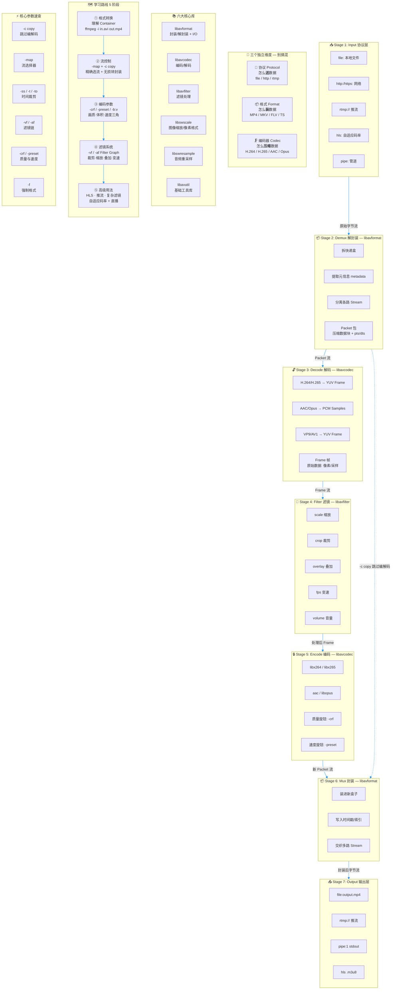

# FFmpeg 完全教程

> 从零开始，掌握视频处理的万能工具箱

---

## 目录

### Part 1: 从零认识 FFmpeg（基础概念篇）

- [第1章：FFmpeg 是什么](./ch01.md)
- [第2章：安装与环境配置](./ch02.md)
- [第3章：命令行基础——FFmpeg 的语法](./ch03.md)
- [第4章：多媒体基础——视频是怎么存起来的](./ch04.md)
- [第5章：编解码器——压缩的魔法](./ch05.md)
- [第6章：容器格式——文件的"包装盒"](./ch06.md)

### Part 2: 日常操作（常用命令篇）

- [第7章：格式转码——万能转换器](./ch07.md)
- [第8章：提取与合并——音视频手术刀](./ch08.md)
- [第9章：视频剪辑——不用PR也能剪](./ch09.md)
- [第10章：视频缩放与裁剪——画面变形记](./ch10.md)
- [第11章：水印与字幕——给视频加标签](./ch11.md)
- [第12章：截图与GIF——视频的另一面](./ch12.md)

### Part 3: 进阶魔法（滤镜与特效篇）

- [第13章：滤镜系统入门](./ch13.md)
- [第14章：视频滤镜——画面调色盘](./ch14.md)
- [第15章：音频滤镜——声音整形师](./ch15.md)
- [第16章：叠加与合成——画中画与分屏](./ch16.md)
- [第17章：高级视频效果](./ch17.md)
- [第18章：复杂滤镜链实战](./ch18.md)

### Part 4: 实战出击（流媒体与进阶篇）

- [第19章：流媒体协议基础](./ch19.md)
- [第20章：RTMP 推流实战](./ch20.md)
- [第21章：直播录制与回放](./ch21.md)
- [第22章：HLS 切片与点播服务](./ch22.md)
- [第23章：性能优化与硬件加速](./ch23.md)
- [第24章：脚本集成与命令速查表](./ch24.md)
- [第25章：FFmpeg 高频命令速查库](./ch25.md)

---

## 心智模型

### 一、核心模型：媒体处理管道

层级

```text
容器层 (AVFormatContext)
    ├── AVStream  (流描述)
    │       │
    │       └── 关联多个 AVPacket (压缩数据)
    │                    │
    │                    └── 解码 → AVFrame (原始数据)
    │                                │
    │                                └── 编码 → 新 AVPacket (压缩数据)
    │                                                │
    │                                                └── 写入输出 AVStream
```

AVStream 定义了“流”的规格，AVPacket 是流中压缩数据的载体，AVFrame 是压缩数据解码后的原始形态；它们通过“解封装→解码→处理→编码→封装”这条管道相互转换。

FFmpeg 最核心的工作方式可以抽象成一条管道：

```text
输入文件/URL
      │
      ▼
┌──────────────┐
│  解封装 demux │   libavformat
└──────────────┘
      │  输出：AVPacket（压缩数据包）
      ▼
┌──────────────┐
│  解码 decode  │   libavcodec
└──────────────┘
      │  输出：AVFrame（原始音视频帧）
      ▼
┌──────────────┐
│  滤镜 filter  │   libavfilter
└──────────────┘
      │  输出：处理后的 AVFrame
      ▼
┌──────────────┐
│  编码 encode  │   libavcodec
└──────────────┘
      │  输出：AVPacket（压缩数据包）
      ▼
┌──────────────┐
│  封装 mux     │   libavformat
└──────────────┘
      │
      ▼
输出文件/URL
```

这个管道可以概括为：

> Input → Demux(解封装) → Decode(解码) → Filter(滤镜) → Encode(编码) → Mux(封装) → Output

其中：

1. 解封装 demux：把容器格式拆开，例如 MP4、MKV、FLV。

2. 解码 decode：把压缩的视频/音频数据还原成原始帧或原始音频样本。

3. 滤镜 filter：对原始帧进行处理，例如缩放、裁剪、加水印、音量调整。

4. 编码 encode：把处理后的原始帧重新压缩，例如 H.264、AAC。

5. 封装 mux：把压缩后的流重新写入容器，例如 MP4、MKV。

### 二、管道的几个重要变体

并不是所有操作都要走完整条管道。

#### 1. 流复制模式：-c copy

例如：

```bash
ffmpeg -i input.mp4 -c copy output.mkv
```

此时管道变为：

```text
解封装 → 直接复制 AVPacket → 封装
```

不经过解码、滤镜、编码，因此速度非常快，适合转封装、提取流、截取片段等。

#### 2. 只解码，不编码

例如播放、截图、分析：

```text
解封装 → 解码 → 输出原始帧/图像
```

#### 3. 只处理某一种流

例如只转码视频，音频直接复制：

```bash
ffmpeg -i input.mp4 -c:v libx264 -c:a copy output.mp4
```

视频走完整管道，音频走复制管道。

### 三、命令行结构模型

FFmpeg 命令行可以抽象成：

```text
ffmpeg [全局选项] [输入选项] -i 输入文件 [流映射选项] [输出选项] 输出文件
```

更直观地看：

```text
全局选项
   │
   ├── 输入1：-i input1.mp4
   ├── 输入2：-i input2.mp4
   │
   ├── 流选择：-map 0:v -map 1:a
   ├── 编解码器：-c:v libx264 -c:a aac
   ├── 滤镜：-filter:v scale=1280:720
   ├── 输出参数：-f mp4 -movflags +faststart
   │
   ▼
输出文件
```

示例：

```bash
ffmpeg -i input.mp4 -c:v libx264 -c:a aac -filter:v scale=1280:720 output.mp4
```

对应管道：

```text
input.mp4
  → 解封装
  → 视频流解码
  → scale 滤镜
  → libx264 编码
  → 封装到 output.mp4
```

### 四、核心对象模型

FFmpeg 内部有几个核心概念，理解它们能帮助你理解命令行和 API。

|层次|概念|对应C结构体|说明|
|----|----|----|----|
|文件/容器|输入/输出上下文|`AVFormatContext`|表示一个媒体文件或网络流|
|流|媒体流|`AVStream`|文件里的一条视频流、音频流或字幕流|
|压缩数据包|数据包|`AVPacket`|压缩后的数据单元，属于某个流|
|原始帧|帧|`AVFrame`|解码后的图像、音频样本|
|编解码器|编解码上下文|`AVCodecContext`/`AVCodec`|描述编码参数和算法|
|滤镜图|滤镜链|`AVFilterGraph`|描述多个滤镜如何连接|

可以简单记忆为：

> [!TIP] 技巧
> 文件包含多个流，流由多个包组成，包解码后变成帧，帧经过滤镜处理后重新编码成包，包再封装成文件。

### 五、库分层模型

FFmpeg 不是一个单一程序，而是一套库的集合。命令行工具只是这些库的调用者。

```text
┌──────────────────────────────────────────────┐
│         ffmpeg / ffprobe / ffplay             │
│              命令行工具层                      │
└──────────────────────────────────────────────┘
                     │
                     ▼
┌───────────────┬───────────────┬───────────────┐
│ libavformat   │ libavcodec    │ libavfilter   │
│ 封装/解封装   │ 编解码        │ 滤镜          │
└───────────────┴───────────────┴───────────────┘
                     │
          ┌──────────┴──────────┐
          ▼                     ▼
┌──────────────────┐   ┌──────────────────┐
│ libswscale       │   │ libswresample    │
│ 图像缩放/像素格式 │   │ 音频重采样/声道  │
└──────────────────┘   └──────────────────┘
                     │
                     ▼
┌──────────────────────────────────────────────┐
│              libavutil                        │
│    通用工具：时间、日志、缓冲区、数学运算等    │
└──────────────────────────────────────────────┘
```

1. libavformat：负责容器格式，比如 MP4、MKV、FLV。

2. libavcodec：负责编解码器，比如 H.264、HEVC、AAC、MP3。

3. libavfilter：负责滤镜，比如 scale、crop、overlay。

4. libswscale：图像缩放和像素格式转换。

5. libswresample：音频重采样、声道布局转换、采样格式转换。

6. libavutil：所有库共用的基础工具。

### 六、时间模型

- 音视频处理中时间非常重要。FFmpeg 使用 time_base 和 PTS/DTS 来管理时间。

- 每个流有自己的 time_base，例如 1/25 表示一个时间单位是 1/25 秒。

- PTS：显示时间戳，表示这一帧什么时候显示。

- DTS：解码时间戳，表示这一帧什么时候解码。

- 对于没有 B 帧的视频，通常 PTS == DTS。

- 有 B 帧时，DTS <= PTS。

时间戳的真实秒数：

```text
时间秒数 = PTS × time_base
```

例如 PTS = 100，time_base = 1/25，则时间点 = 4 秒。

`ffprobe` 可以查看这些信息：

```bash
ffprobe -show_streams -show_packets input.mp4
```

### 七、建议学习路径：用这个模型去学

1. 先玩命令
用 `ffmpeg -i input.mp4 output.avi` 感受转封装。
用 `ffmpeg -i input.mp4 -c:v libx264 output.mp4` 感受转码。

2. 理解两个核心区别

封装 vs 编码

包 `AVPacket` vs 帧 `AVFrame`

1. 掌握流映射
`-map` 用来选择哪些流进入输出，这是复杂命令的基础。

2. 学习常用滤镜
`scale`、`crop`、`overlay`、`trim`、`setpts`、`volume`。

3. 用 `ffprobe` 分析文件
把输出结果和上面的对象模型对应起来：

- `Format` 对应容器

- `Stream` 对应流

- `Packet` 对应压缩包

- `Frame` 对应原始帧

如果做开发，再深入库 API
从 `libavformat`、`libavcodec` 开始，理解 `AVFormatContext` → `AVStream` → `AVPacket` → `AVFrame` 的调用过程。

这个模型可以概括为：

1. 一条管道：解封装 → 解码 → 滤镜 → 编码 → 封装
2. 两种数据：压缩包 AVPacket 与原始帧 AVFrame
3. 四类对象：文件、流、包、帧
4. 六层库：工具层、封装层、编解码层、滤镜层、图像/音频处理层、基础工具层

模型里还区分了三个容易混淆的概念——协议（怎么送数据）、格式（怎么装数据）、编码器（怎么压缩数据），这是很多人学 FFmpeg 时绕不清楚的地方。同一个 MP4 盒子可以装不同的编码器组合，它们是独立的维度。

交互图里你可以点击流水线的每个阶段看详细说明，参数速查表按学习优先级分了级，学习路线从格式转换一路到 HLS 推流，逐步覆盖整条流水线。


