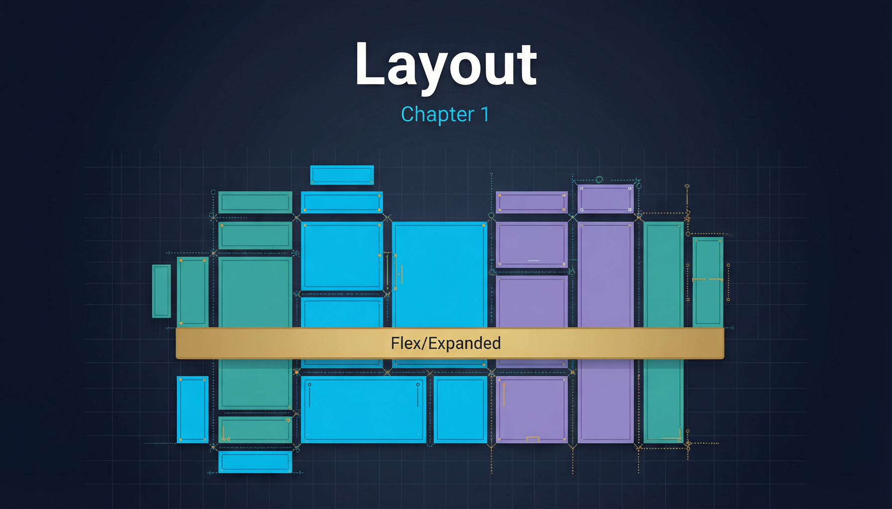

# 第一章：布局类 Widget



布局是 Flutter 渲染系统的核心环节。Flutter 的布局协议基于 **Box Constraints** 模型：父 Widget 向子 Widget 传递约束（`BoxConstraints`，包含 minWidth/maxWidth/minHeight/maxHeight），子 Widget 在约束范围内确定自身尺寸，再由父 Widget 决定子 Widget 的偏移位置。理解这一协议，是掌握所有布局 Widget 的前提。

## 1.1 Container — 全能容器

`Container` 是 Flutter 中最常用的 Widget 之一，但它本身并不做任何渲染。它是一个**组合糖（Composition Sugar）**，内部将多个单功能 Widget 按特定顺序组装在一起。

```dart
import 'package:flutter/material.dart';

void main() => runApp(const MyApp());

class MyApp extends StatelessWidget {
  const MyApp({super.key});

  @override
  Widget build(BuildContext context) {
    return MaterialApp(
      home: Scaffold(
        appBar: AppBar(title: const Text('Container 示例')),
        body: Center(
          child: Container(
            // 外边距
            margin: const EdgeInsets.all(16.0),
            // 内边距
            padding: const EdgeInsets.symmetric(horizontal: 24, vertical: 12),
            // 装饰（背景、边框、圆角、阴影）
            decoration: BoxDecoration(
              color: Colors.blue.shade50,
              borderRadius: BorderRadius.circular(12),
              border: Border.all(color: Colors.blue, width: 2),
              boxShadow: [
                BoxShadow(
                  color: Colors.blue.withOpacity(0.3),
                  blurRadius: 8,
                  offset: const Offset(0, 4),
                ),
              ],
            ),
            // 约束
            constraints: const BoxConstraints(minWidth: 200, maxWidth: 300),
            // 变换（旋转 5 度）
            transform: Matrix4.identity()..rotateZ(0.05),
            // 子项对齐
            alignment: Alignment.center,
            // 裁剪行为
            clipBehavior: Clip.antiAlias,
            child: const Text(
              'Container 组合糖',
              style: TextStyle(fontSize: 18, fontWeight: FontWeight.bold),
            ),
          ),
        ),
      ),
    );
  }
}
```

### 原理解析

`Container` 的 `build` 方法本质上按以下顺序嵌套 Widget：

```
Container
 └─ Transform          // 如果设置了 transform
     └─ DecoratedBox   // 如果设置了 decoration / foregroundDecoration
         └─ Padding    // 如果设置了 padding
             └─ ConstrainedBox  // 如果设置了 constraints
                 └─ Align       // 如果设置了 alignment
                     └─ child
```

这个嵌套顺序至关重要。例如，`padding` 在 `decoration` 内部，意味着装饰会覆盖 padding 区域（即背景色会延伸到 padding 区域）。而 `margin` 并不是通过 `Padding` 实现的，它通过在 `Container` 外层再包一个 `Padding` 来实现。

**关键设计哲学**：Container 自身没有对应的 `RenderObject`。它在 Widget 树中展开为多个单功能 Widget，每个 Widget 各自拥有一个轻量 `RenderObject`（如 `RenderPadding`、`RenderDecoratedBox`）。这体现了 Flutter 的核心设计原则——**组合优于继承**。你完全可以不用 Container，直接手动组合这些单功能 Widget，Container 只是提供了 API 层面的便利。

**clipBehavior** 参数控制 `DecoratedBox` 的裁剪行为。当设置了圆角装饰但子项内容超出圆角范围时，需要设为 `Clip.antiAlias` 才能看到裁剪效果。注意：裁剪是有性能开销的，因为需要创建额外的 `Layer`。

---

## 1.2 Row / Column / Flex — 线性布局三兄弟

`Row`（水平排列）和 `Column`（垂直排列）都是 `Flex` 的子类，共享同一套布局算法。它们的区别仅在于 `direction` 参数：`Row` 设为 `Axis.horizontal`，`Column` 设为 `Axis.vertical`。

```dart
import 'package:flutter/material.dart';

void main() => runApp(const MyApp());

class MyApp extends StatelessWidget {
  const MyApp({super.key});

  @override
  Widget build(BuildContext context) {
    return MaterialApp(
      home: Scaffold(
        appBar: AppBar(title: const Text('Row / Column 布局')),
        body: Padding(
          padding: const EdgeInsets.all(16.0),
          child: Column(
            // 主轴对齐（垂直方向）
            mainAxisAlignment: MainAxisAlignment.start,
            // 交叉轴对齐（水平方向）
            crossAxisAlignment: CrossAxisAlignment.stretch,
            // 主轴尺寸模式
            mainAxisSize: MainAxisSize.max,
            children: [
              // 顶部信息行
              Row(
                mainAxisAlignment: MainAxisAlignment.spaceBetween,
                children: [
                  const CircleAvatar(child: Icon(Icons.person)),
                  Expanded(
                    flex: 2,
                    child: Padding(
                      padding: const EdgeInsets.symmetric(horizontal: 12),
                      child: Column(
                        crossAxisAlignment: CrossAxisAlignment.start,
                        children: const [
                          Text('张三', style: TextStyle(fontSize: 18, fontWeight: FontWeight.bold)),
                          Text('Flutter 开发工程师', style: TextStyle(color: Colors.grey)),
                        ],
                      ),
                    ),
                  ),
                  // Spacer 的实现就是 Expanded + SizedBox
                  const Spacer(flex: 1),
                  const Icon(Icons.more_vert),
                ],
              ),
              const SizedBox(height: 16),
              // Flexible vs Expanded 对比
              Row(
                children: [
                  // Expanded = Flexible(flex: 1, fit: FlexFit.tight)
                  // 强制占满分配的空间
                  Expanded(
                    flex: 2,
                    child: Container(height: 60, color: Colors.red, child: const Center(child: Text('Expanded flex:2'))),
                  ),
                  const SizedBox(width: 8),
                  // Flexible(fit: FlexFit.loose) 可以不占满
                  Flexible(
                    flex: 1,
                    fit: FlexFit.loose,
                    child: Container(height: 60, color: Colors.green, child: const Center(child: Text('Flexible'))),
                  ),
                  const SizedBox(width: 8),
                  Expanded(
                    flex: 1,
                    child: Container(height: 60, color: Colors.blue, child: const Center(child: Text('flex:1'))),
                  ),
                ],
              ),
              const SizedBox(height: 16),
              // textBaseline 示例
              Row(
                crossAxisAlignment: CrossAxisAlignment.baseline,
                textBaseline: TextBaseline.alphabetic,
                children: const [
                  Text('大字体', style: TextStyle(fontSize: 32)),
                  SizedBox(width: 8),
                  Text('小字体', style: TextStyle(fontSize: 14)),
                ],
              ),
            ],
          ),
        ),
      ),
    );
  }
}
```

### 原理解析

**Flex 的统一布局算法**分两个阶段：

1. **弹性空间分配**：首先遍历所有子项，将子项分为"弹性"（`Flexible`/`Expanded`）和"非弹性"两类。非弹性子项以 **unbounded 主轴约束**（minWidth=0, maxWidth=∞）进行布局，获取它们的实际尺寸。剩余空间按 `flex` 比例分配给弹性子项。

2. **交叉轴约束**：`crossAxisAlignment` 决定子项在交叉轴的对齐。`CrossAxisAlignment.stretch` 会让子项的交叉轴约束变为 tight（强制拉伸填满）。

**MainAxisSize.min vs max** 是常见陷阱的根源：

- `max`（默认）：Flex 占据父约束允许的最大空间。
- `min`：Flex 的尺寸等于所有子项尺寸之和。

在 `Row` 中嵌套 `Expanded` 时，如果 `Row` 处于 unbounded 宽度约束下（例如在另一个 `Row` 中没用 `Expanded` 包裹），就会抛出 "hasSize but layout was not performed" 异常。这是因为 `Expanded` 需要有限的可用空间才能计算比例。

**Spacer 的实现**极其简洁，源码大致为：

```dart
class Spacer extends StatelessWidget {
  const Spacer({super.key, this.flex = 1});
  final int flex;
  
  @override
  Widget build(BuildContext context) {
    return Expanded(flex: flex, child: const SizedBox.shrink());
  }
}
```

本质就是 `Expanded` 包裹一个零尺寸的 `SizedBox`，占据弹性空间但不渲染任何内容。

---

## 1.3 Stack / Positioned / IndexedStack

`Stack` 实现了层叠布局——子项可以互相重叠。`Positioned` 用于精确定位子项在 Stack 中的位置。

```dart
import 'package:flutter/material.dart';

void main() => runApp(const MyApp());

class MyApp extends StatelessWidget {
  const MyApp({super.key});

  @override
  Widget build(BuildContext context) {
    return MaterialApp(
      home: Scaffold(
        appBar: AppBar(title: const Text('Stack / Positioned / IndexedStack')),
        body: Padding(
          padding: const EdgeInsets.all(16.0),
          child: Column(
            children: [
              // Stack + Positioned 示例
              SizedBox(
                height: 250,
                child: Stack(
                  // 非定位子项的对齐方式
                  alignment: Alignment.center,
                  // 非定位子项如何决定 Stack 尺寸
                  fit: StackFit.loose,
                  // 裁剪行为
                  clipBehavior: Clip.antiAlias,
                  children: [
                    // 非定位子项：居中的蓝色方块
                    Container(width: 200, height: 200, color: Colors.blue.withOpacity(0.3)),
                    // 定位子项：右上角红色标记
                    Positioned(
                      top: 0,
                      right: 0,
                      child: Container(
                        padding: const EdgeInsets.all(8),
                        decoration: const BoxDecoration(
                          color: Colors.red,
                          shape: BoxShape.circle,
                        ),
                        child: const Text('99+', style: TextStyle(color: Colors.white, fontSize: 12)),
                      ),
                    ),
                    // 定位子项：底部渐变遮罩
                    Positioned(
                      bottom: 0,
                      left: 0,
                      right: 0,
                      height: 60,
                      child: DecoratedBox(
                        decoration: BoxDecoration(
                          gradient: LinearGradient(
                            begin: Alignment.topCenter,
                            end: Alignment.bottomCenter,
                            colors: [Colors.transparent, Colors.black.withOpacity(0.6)],
                          ),
                        ),
                      ),
                    ),
                    // 非定位子项：居中文本
                    const Text('Stack 示例', style: TextStyle(fontSize: 20, color: Colors.white, fontWeight: FontWeight.bold)),
                  ],
                ),
              ),
              const SizedBox(height: 24),
              // IndexedStack 示例
              const IndexedStackDemo(),
            ],
          ),
        ),
      ),
    );
  }
}

class IndexedStackDemo extends StatefulWidget {
  const IndexedStackDemo({super.key});

  @override
  State<IndexedStackDemo> createState() => _IndexedStackDemoState();
}

class _IndexedStackDemoState extends State<IndexedStackDemo> {
  int _index = 0;

  @override
  Widget build(BuildContext context) {
    return Column(
      children: [
        IndexedStack(
          index: _index,
          sizing: StackFit.passthrough,
          children: [
            // 所有子项都会被布局和保持状态，但只显示 index 对应的那一个
            _buildPage('页面 A', Colors.red),
            _buildPage('页面 B', Colors.green),
            _buildPage('页面 C', Colors.blue),
          ],
        ),
        const SizedBox(height: 12),
        Row(
          mainAxisAlignment: MainAxisAlignment.center,
          children: List.generate(3, (i) {
            return Padding(
              padding: const EdgeInsets.symmetric(horizontal: 4),
              child: ElevatedButton(
                onPressed: () => setState(() => _index = i),
                style: ElevatedButton.styleFrom(
                  backgroundColor: _index == i ? Colors.deepPurple : Colors.grey.shade300,
                ),
                child: Text('Tab ${String.fromCharCode(65 + i)}'),
              ),
            );
          }),
        ),
      ],
    );
  }

  Widget _buildPage(String title, Color color) {
    return Container(
      height: 120,
      alignment: Alignment.center,
      decoration: BoxDecoration(
        color: color.withOpacity(0.2),
        borderRadius: BorderRadius.circular(8),
      ),
      child: Text(title, style: TextStyle(fontSize: 24, color: color)),
    );
  }
}
```

### 原理解析

**Stack 的布局流程**：

1. **先布局非定位子项**（non-positioned children）。非定位子项以 loose 约束布局，Stack 的初步尺寸取所有非定位子项的最大宽高。如果没有非定位子项，Stack 尺寸由 `fit` 和父约束决定。

2. **再布局定位子项**（Positioned）。`Positioned` 的六个参数（top/right/bottom/left/width/height）生成 tight 或 loose 约束。例如指定 `left: 0, right: 0` 等价于 tight 水平约束等于 Stack 宽度。

**Positioned 的约束推导**：六个参数不会同时生效，有优先级关系。如果同时指定了 `left`、`right`、`width` 中的三个，`width` 优先；如果指定了两个，子项约束由它们确定；如果只指定一个，子项保持自身固有尺寸。

**IndexedStack 的实现原理**：IndexedStack 继承 Stack，在 `RenderStack` 的基础上重写了 `paint` 方法——只绘制 `index` 对应的子项。但所有子项都会经历完整的 layout 过程并保留在 Element 树中，这就是为什么切换 Tab 时状态不会丢失（类似于 `Offstage` 的效果）。这在底部导航栏场景中极为常用。

---

## 1.4 Wrap — 流式布局

`Wrap` 与 `Row` 相似，但当子项超出主轴范围时会自动换行（或换列），形成"流式布局"效果，常用于标签（Tags）展示。

```dart
import 'package:flutter/material.dart';

void main() => runApp(const MyApp());

class MyApp extends StatelessWidget {
  const MyApp({super.key});

  @override
  Widget build(BuildContext context) {
    return MaterialApp(
      home: Scaffold(
        appBar: AppBar(title: const Text('Wrap 流式布局')),
        body: Padding(
          padding: const EdgeInsets.all(16.0),
          child: Column(
            crossAxisAlignment: CrossAxisAlignment.start,
            children: [
              const Text('技能标签', style: TextStyle(fontSize: 18, fontWeight: FontWeight.bold)),
              const SizedBox(height: 12),
              Wrap(
                // 主轴方向
                direction: Axis.horizontal,
                // 主轴对齐
                alignment: WrapAlignment.start,
                // 交叉轴对齐（同一 run 内）
                crossAxisAlignment: WrapCrossAlignment.center,
                // 各 run 之间的间距
                runSpacing: 8.0,
                // 同一 run 内子项间距
                spacing: 8.0,
                // run 的整体对齐
                runAlignment: WrapAlignment.start,
                // 文本方向
                textDirection: TextDirection.ltr,
                // 垂直方向（换行方向）
                verticalDirection: VerticalDirection.down,
                children: [
                  _buildTag('Flutter'),
                  _buildTag('Dart'),
                  _buildTag('TypeScript'),
                  _buildTag('React Native'),
                  _buildTag('Kotlin Multiplatform'),
                  _buildTag('SwiftUI'),
                  _buildTag('Rust'),
                  _buildTag('WebAssembly'),
                ],
              ),
              const SizedBox(height: 24),
              const Text('垂直 Wrap', style: TextStyle(fontSize: 18, fontWeight: FontWeight.bold)),
              const SizedBox(height: 12),
              SizedBox(
                height: 300,
                child: Wrap(
                  direction: Axis.vertical,
                  spacing: 8,
                  runSpacing: 8,
                  children: List.generate(20, (i) => _buildTag('Item $i')),
                ),
              ),
            ],
          ),
        ),
      ),
    );
  }

  Widget _buildTag(String label) {
    return Container(
      padding: const EdgeInsets.symmetric(horizontal: 12, vertical: 6),
      decoration: BoxDecoration(
        color: Colors.deepPurple.shade50,
        borderRadius: BorderRadius.circular(20),
        border: Border.all(color: Colors.deepPurple.shade200),
      ),
      child: Text(label, style: const TextStyle(color: Colors.deepPurple)),
    );
  }
}
```

### 原理解析

Wrap 的布局算法将所有子项分成多个 **run**（行或列）。对于水平方向的 Wrap：

1. 沿主轴依次放置子项，累加宽度。
2. 当累积宽度超出 maxWidth 约束时，将当前子项放入新的 run。
3. 每个 run 内部按 `spacing` 间隔，run 之间按 `runSpacing` 间隔。
4. `alignment` 控制每个 run 内部的对齐，`runAlignment` 控制所有 run 作为整体在交叉轴的对齐。

与 `Row` 的关键区别：Row 在单行空间不够时会抛出 overflow 错误（黄色条纹），而 Wrap 会自动换行。这是因为 Row 给子项传递的是 unbounded 宽度约束，子项可以无限宽——最终由父 Widget 裁剪；而 Wrap 会根据自身约束主动分割子项。

---

## 1.5 Align / Center / FractionalOffset

`Align` 控制子项在父空间中的对齐位置。`Center` 是 `Align(alignment: Alignment.center)` 的快捷方式。

```dart
import 'package:flutter/material.dart';

void main() => runApp(const MyApp());

class MyApp extends StatelessWidget {
  const MyApp({super.key});

  @override
  Widget build(BuildContext context) {
    return MaterialApp(
      home: Scaffold(
        appBar: AppBar(title: const Text('Align / Center')),
        body: Padding(
          padding: const EdgeInsets.all(16.0),
          child: Column(
            children: [
              // Alignment 坐标系演示
              Container(
                height: 200,
                decoration: BoxDecoration(border: Border.all(color: Colors.grey)),
                child: Stack(
                  children: [
                    Align(alignment: Alignment.topLeft, child: _dot('TL')),
                    Align(alignment: Alignment.topCenter, child: _dot('TC')),
                    Align(alignment: Alignment.topRight, child: _dot('TR')),
                    Align(alignment: Alignment.centerLeft, child: _dot('CL')),
                    Align(alignment: Alignment.center, child: _dot('C')),
                    Align(alignment: Alignment.centerRight, child: _dot('CR')),
                    Align(alignment: Alignment.bottomLeft, child: _dot('BL')),
                    Align(alignment: Alignment.bottomCenter, child: _dot('BC')),
                    Align(alignment: Alignment.bottomRight, child: _dot('BR')),
                    // 自定义位置 (0.5, -0.5) 表示右上方 3/4 处
                    Align(
                      alignment: const Alignment(0.5, -0.5),
                      child: _dot('自定义'),
                    ),
                  ],
                ),
              ),
              const SizedBox(height: 16),
              // widthFactor / heightFactor
              Container(
                color: Colors.amber.shade100,
                child: Align(
                  alignment: Alignment.centerRight,
                  // widthFactor = 2 表示 Align 宽度 = 子项宽度 × 2
                  widthFactor: 2.0,
                  heightFactor: 2.0,
                  child: Container(
                    width: 60,
                    height: 60,
                    color: Colors.deepOrange,
                    child: const Center(child: Text('factor', style: TextStyle(color: Colors.white, fontSize: 10))),
                  ),
                ),
              ),
              const SizedBox(height: 8),
              const Text('Center 等价于 Align(alignment: Alignment.center)',
                  style: TextStyle(color: Colors.grey)),
            ],
          ),
        ),
      ),
    );
  }

  Widget _dot(String label) {
    return Column(
      mainAxisSize: MainAxisSize.min,
      children: [
        Container(width: 8, height: 8, decoration: const BoxDecoration(color: Colors.red, shape: BoxShape.circle)),
        Text(label, style: const TextStyle(fontSize: 9)),
      ],
    );
  }
}
```

### 原理解析

**Alignment 坐标系**：`Alignment(x, y)` 中，x 和 y 的取值范围是 -1.0 到 1.0，其中 (-1, -1) 是左上角，(1, 1) 是右下角，(0, 0) 是中心。实际上 Alignment 可以取任意值，超出 [-1, 1] 范围时子项会被放置在父边界之外。

**偏移计算公式**（`RenderPositionedBox` 的 layout 源码）：

```
childOffset.dx = (parentWidth - childWidth) * ((alignment.x + 1) / 2)
childOffset.dy = (parentHeight - childHeight) * ((alignment.y + 1) / 2)
```

**widthFactor / heightFactor**：当设置后，Align 自身的尺寸不再扩展到父约束最大值，而是等于 `子项尺寸 × factor`。这在构建气泡提示、badge 等需要紧贴子项尺寸的场景中很有用。

**Center** 的源码实现只有一行：`const Center({Key? key, double? widthFactor, double? heightFactor, Widget? child}) : super(key: key, alignment: Alignment.center, widthFactor: widthFactor, heightFactor: heightFactor, child: child);`

---

## 1.6 Padding / SizedBox / ConstrainedBox / UnconstrainedBox

这组 Widget 是布局系统的基础构件，理解它们就是理解 Flutter 约束传递的本质。

```dart
import 'package:flutter/material.dart';

void main() => runApp(const MyApp());

class MyApp extends StatelessWidget {
  const MyApp({super.key});

  @override
  Widget build(BuildContext context) {
    return MaterialApp(
      home: Scaffold(
        appBar: AppBar(title: const Text('约束类 Widget')),
        body: SingleChildScrollView(
          padding: const EdgeInsets.all(16),
          child: Column(
            crossAxisAlignment: CrossAxisAlignment.start,
            children: [
              // Padding：EdgeInsets 四种构造
              const Text('Padding', style: TextStyle(fontSize: 16, fontWeight: FontWeight.bold)),
              const SizedBox(height: 8),
              Container(
                color: Colors.blue.shade50,
                child: Padding(
                  // EdgeInsets.all(16) — 四边相同
                  // EdgeInsets.symmetric(horizontal: 16, vertical: 8) — 水平/垂直
                  // EdgeInsets.fromLTRB(8, 4, 16, 12) — 分别指定
                  // EdgeInsets.only(left: 8, top: 4) — 仅指定某些边
                  padding: const EdgeInsets.symmetric(horizontal: 16, vertical: 8),
                  child: Container(color: Colors.blue, child: const Text('有内边距', style: TextStyle(color: Colors.white))),
                ),
              ),
              const SizedBox(height: 24),

              // SizedBox 作为间距和固定容器
              const Text('SizedBox', style: TextStyle(fontSize: 16, fontWeight: FontWeight.bold)),
              const SizedBox(height: 8),
              // 作为间距
              Row(children: [
                Container(width: 50, height: 50, color: Colors.red),
                const SizedBox(width: 20), // 20px 水平间距
                Container(width: 50, height: 50, color: Colors.green),
                const SizedBox(width: 20),
                Container(width: 50, height: 50, color: Colors.blue),
              ]),
              const SizedBox(height: 8),
              // 作为固定尺寸容器
              const SizedBox(
                width: 200,
                height: 60,
                child: ColoredBox(color: Colors.orange, child: Center(child: Text('固定 200×60'))),
              ),
              // SizedBox.expand() 等价于 double.infinity
              const SizedBox(height: 8),
              SizedBox(
                height: 80,
                child: SizedBox.expand(
                  child: ColoredBox(color: Colors.teal.withOpacity(0.3), child: const Center(child: Text('SizedBox.expand'))),
                ),
              ),
              const SizedBox(height: 24),

              // ConstrainedBox
              const Text('ConstrainedBox', style: TextStyle(fontSize: 16, fontWeight: FontWeight.bold)),
              const SizedBox(height: 8),
              ConstrainedBox(
                // additionalConstraints 与父约束取交集
                constraints: const BoxConstraints(minHeight: 80, maxWidth: 300),
                child: Container(
                  color: Colors.purple.shade100,
                  child: const Center(child: Text('最小高度 80, 最大宽度 300')),
                ),
              ),
              const SizedBox(height: 24),

              // UnconstrainedBox
              const Text('UnconstrainedBox', style: TextStyle(fontSize: 16, fontWeight: FontWeight.bold)),
              const SizedBox(height: 8),
              Container(
                height: 60,
                color: Colors.grey.shade200,
                child: UnconstrainedBox(
                  // 子项不受父 Widget 约束，可以使用自身固有尺寸
                  // 但超出部分会溢出（被裁剪或显示 overflow）
                  child: Container(
                    width: 200,
                    height: 100, // 比父高度 60 大，会溢出
                    color: Colors.deepOrange,
                    child: const Center(child: Text('超出父高度')),
                  ),
                ),
              ),
            ],
          ),
        ),
      ),
    );
  }
}
```

### 原理解析

**BoxConstraints 的本质**：Flutter 中所有布局约束都由四个值描述——`minWidth`、`maxWidth`、`minHeight`、`maxHeight`。约束传递的核心原则是：

- **tight 约束**：min == max，子项尺寸被完全确定，无法自由选择。
- **loose 约束**：min = 0，max = 某个值，子项可在范围内自由决定尺寸。
- **unbounded 约束**：max = infinity，子项可以任意大。

**ConstrainedBox 的约束合并规则**：`additionalConstraints` 与父约束取**交集**。具体规则是：

```dart
BoxConstraints enforce(BoxConstraints constraints) {
  return BoxConstraints(
    minWidth: minWidth.clamp(constraints.minWidth, constraints.maxWidth),
    maxWidth: maxWidth.clamp(constraints.minWidth, constraints.maxWidth),
    minHeight: minHeight.clamp(constraints.minHeight, constraints.maxHeight),
    maxHeight: maxHeight.clamp(constraints.minHeight, constraints.maxHeight),
  );
}
```

这意味着如果父约束是 `maxWidth: 200`，而你设了 `ConstrainedBox(constraints: BoxConstraints(minWidth: 300))`，最终 minWidth 会被 clamp 到 200，子项实际 maxWidth 和 minWidth 都是 200。

**UnconstrainedBox** 在内部将传给子项的约束设为完全 unconstrained（min=0, max=∞），但自身尺寸仍然遵循父约束。如果子项超出，会产生 overflow 警告（调试模式下出现黄黑条纹）。它的典型用途是让子项完全按自身固有尺寸渲染。

---

## 1.7 FittedBox / AspectRatio / FractionallySizedBox

这三个 Widget 都在 layout 阶段以不同方式调整子项的约束和尺寸。

```dart
import 'package:flutter/material.dart';

void main() => runApp(const MyApp());

class MyApp extends StatelessWidget {
  const MyApp({super.key});

  @override
  Widget build(BuildContext context) {
    return MaterialApp(
      home: Scaffold(
        appBar: AppBar(title: const Text('FittedBox / AspectRatio / FractionallySizedBox')),
        body: SingleChildScrollView(
          padding: const EdgeInsets.all(16),
          child: Column(
            crossAxisAlignment: CrossAxisAlignment.start,
            children: [
              // FittedBox 演示
              const Text('FittedBox — BoxFit 对比', style: TextStyle(fontSize: 16, fontWeight: FontWeight.bold)),
              const SizedBox(height: 8),
              Wrap(
                spacing: 12,
                runSpacing: 12,
                children: BoxFit.values.map((fit) {
                  return Column(
                    mainAxisSize: MainAxisSize.min,
                    children: [
                      Container(
                        width: 120,
                        height: 80,
                        decoration: BoxDecoration(border: Border.all(color: Colors.grey)),
                        child: FittedBox(
                          fit: fit,
                          child: Container(
                            width: 100,
                            height: 50,
                            color: Colors.indigo,
                            child: const Center(
                              child: Text('100×50', style: TextStyle(color: Colors.white, fontSize: 12)),
                            ),
                          ),
                        ),
                      ),
                      const SizedBox(height: 4),
                      Text(fit.name, style: const TextStyle(fontSize: 10)),
                    ],
                  );
                }).toList(),
              ),
              const SizedBox(height: 24),

              // AspectRatio 演示
              const Text('AspectRatio', style: TextStyle(fontSize: 16, fontWeight: FontWeight.bold)),
              const SizedBox(height: 8),
              Row(
                children: [
                  Expanded(
                    child: AspectRatio(
                      aspectRatio: 16 / 9,
                      child: Container(color: Colors.teal, child: const Center(child: Text('16:9', style: TextStyle(color: Colors.white)))),
                    ),
                  ),
                  const SizedBox(width: 12),
                  Expanded(
                    child: AspectRatio(
                      aspectRatio: 4 / 3,
                      child: Container(color: Colors.amber, child: const Center(child: Text('4:3'))),
                    ),
                  ),
                  const SizedBox(width: 12),
                  Expanded(
                    child: AspectRatio(
                      aspectRatio: 1,
                      child: Container(color: Colors.pink, child: const Center(child: Text('1:1', style: TextStyle(color: Colors.white)))),
                    ),
                  ),
                ],
              ),
              const SizedBox(height: 24),

              // FractionallySizedBox 演示
              const Text('FractionallySizedBox', style: TextStyle(fontSize: 16, fontWeight: FontWeight.bold)),
              const SizedBox(height: 8),
              Container(
                height: 200,
                decoration: BoxDecoration(border: Border.all(color: Colors.grey)),
                child: FractionallySizedBox(
                  alignment: Alignment.center,
                  // 宽度 = 父宽度 × 0.7
                  widthFactor: 0.7,
                  // 高度 = 父高度 × 0.5
                  heightFactor: 0.5,
                  child: Container(
                    color: Colors.deepPurple,
                    child: const Center(child: Text('70% × 50%', style: TextStyle(color: Colors.white))),
                  ),
                ),
              ),
            ],
          ),
        ),
      ),
    );
  }
}
```

### 原理解析

**FittedBox** 的 `RenderFittedBox` 在 layout 阶段做了两件关键事情：

1. 以 unconstrained 约束布局子项，获取子项固有尺寸。
2. 根据 `BoxFit` 枚举计算缩放比例和偏移，生成一个 `Matrix4` 变换矩阵，通过 `Transform` 层应用到子项的 paint 阶段。

`BoxFit` 的计算逻辑：

- `contain`：等比缩放使子项完全可见（取 min 缩放比）。
- `cover`：等比缩放使子项填满容器（取 max 缩放比），超出部分被裁剪。
- `fill`：非等比拉伸填满。
- `fitWidth` / `fitHeight`：按宽度/高度等比缩放。
- `none`：不缩放。
- `scaleDown`：只在子项大于容器时缩小，不放大。

**AspectRatio** 的布局策略（`RenderAspectRatio`）：先尝试从父约束中推导一个满足 `aspectRatio` 的尺寸。具体逻辑是在父约束的 min/max 范围内，寻找满足 `width/height == aspectRatio` 的最大尺寸。如果父约束无法满足该比例（例如父约束是 tight 的且比例不匹配），则 fallback 到尽可能接近的比例。

**FractionallySizedBox** 将父约束按 factor 缩小后传递给子项。`widthFactor: 0.7` 意味着子项的 maxWidth = 父 maxWidth × 0.7。如果 factor 为 null，则该轴不做缩放。

---

## 1.8 LayoutBuilder — 约束感知布局

`LayoutBuilder` 允许你根据父 Widget 传递下来的约束动态决定子 Widget 的结构，是实现响应式布局的核心工具。

```dart
import 'package:flutter/material.dart';

void main() => runApp(const MyApp());

class MyApp extends StatelessWidget {
  const MyApp({super.key});

  @override
  Widget build(BuildContext context) {
    return MaterialApp(
      home: Scaffold(
        appBar: AppBar(title: const Text('LayoutBuilder 响应式布局')),
        body: LayoutBuilder(
          builder: (context, constraints) {
            // constraints 是父 Widget 传递的 BoxConstraints
            if (constraints.maxWidth > 600) {
              // 宽屏：两列布局
              return _buildWideLayout(constraints);
            } else if (constraints.maxWidth > 400) {
              // 中等屏幕
              return _buildMediumLayout(constraints);
            } else {
              // 窄屏：单列布局
              return _buildNarrowLayout(constraints);
            }
          },
        ),
      ),
    );
  }

  Widget _buildWideLayout(BoxConstraints constraints) {
    return Padding(
      padding: const EdgeInsets.all(16),
      child: Column(
        crossAxisAlignment: CrossAxisAlignment.start,
        children: [
          Text('宽屏模式 (${constraints.maxWidth.toStringAsFixed(0)}px)',
              style: const TextStyle(fontSize: 18, fontWeight: FontWeight.bold)),
          const SizedBox(height: 12),
          Row(
            children: [
              Expanded(child: _card('左侧面板', Colors.blue)),
              const SizedBox(width: 16),
              Expanded(child: _card('右侧面板', Colors.green)),
            ],
          ),
        ],
      ),
    );
  }

  Widget _buildMediumLayout(BoxConstraints constraints) {
    return Padding(
      padding: const EdgeInsets.all(16),
      child: Column(
        crossAxisAlignment: CrossAxisAlignment.start,
        children: [
          Text('中等屏幕 (${constraints.maxWidth.toStringAsFixed(0)}px)',
              style: const TextStyle(fontSize: 18, fontWeight: FontWeight.bold)),
          const SizedBox(height: 12),
          _card('内容区域', Colors.orange),
        ],
      ),
    );
  }

  Widget _buildNarrowLayout(BoxConstraints constraints) {
    return Padding(
      padding: const EdgeInsets.all(16),
      child: Column(
        crossAxisAlignment: CrossAxisAlignment.start,
        children: [
          Text('窄屏模式 (${constraints.maxWidth.toStringAsFixed(0)}px)',
              style: const TextStyle(fontSize: 18, fontWeight: FontWeight.bold)),
          const SizedBox(height: 12),
          _card('紧凑布局', Colors.purple),
        ],
      ),
    );
  }

  Widget _card(String title, Color color) {
    return Container(
      height: 200,
      alignment: Alignment.center,
      decoration: BoxDecoration(
        color: color.withOpacity(0.2),
        borderRadius: BorderRadius.circular(12),
        border: Border.all(color: color),
      ),
      child: Text(title, style: TextStyle(fontSize: 16, color: color)),
    );
  }
}
```

### 原理解析

**LayoutBuilder 的执行时机**与 `Builder` 不同。`Builder` 在 build 阶段执行，而 `LayoutBuilder` 的 builder 回调在 **layout 阶段** 执行。这是因为 `LayoutBuilder` 内部使用了 `RenderLayoutBuilder`（一个自定义 RenderObject），它在 `performLayout` 时才调用 builder 回调。

这意味着 LayoutBuilder 能拿到**精确的父约束**——不是屏幕尺寸，而是父 Widget 经过层层约束计算后最终传递下来的 `BoxConstraints`。

**与 MediaQuery 的区别**：

- `MediaQuery.of(context).size` 返回的是**屏幕物理尺寸**（或窗口尺寸），不会因为父 Widget 的约束而改变。
- `LayoutBuilder` 返回的是父 Widget 给予的**约束范围**。例如一个 300px 宽的容器内的 LayoutBuilder，即使屏幕宽 1000px，拿到的 maxWidth 也是 300。

**SliverLayoutBuilder** 是 LayoutBuilder 的 Sliver 版本，可以在 CustomScrollView 中使用，根据滚动位置动态调整布局。

---

## 1.9 其他布局 Widget 速览

```dart
import 'package:flutter/material.dart';

void main() => runApp(const MyApp());

class MyApp extends StatelessWidget {
  const MyApp({super.key});

  @override
  Widget build(BuildContext context) {
    return MaterialApp(
      home: Scaffold(
        appBar: AppBar(title: const Text('其他布局 Widget')),
        body: SingleChildScrollView(
          padding: const EdgeInsets.all(16),
          child: Column(
            crossAxisAlignment: CrossAxisAlignment.start,
            children: [
              // OverflowBox
              const Text('OverflowBox', style: TextStyle(fontSize: 16, fontWeight: FontWeight.bold)),
              const SizedBox(height: 8),
              Container(
                height: 60,
                color: Colors.grey.shade200,
                child: OverflowBox(
                  // 子项可以超出父边界，但不贡献超出的尺寸
                  maxWidth: 400,
                  child: Container(
                    width: 400,
                    height: 60,
                    color: Colors.red.withOpacity(0.5),
                    child: const Center(child: Text('子项宽度 400 超出父宽度')),
                  ),
                ),
              ),
              const SizedBox(height: 24),

              // IntrinsicHeight
              const Text('IntrinsicHeight', style: TextStyle(fontSize: 16, fontWeight: FontWeight.bold)),
              const SizedBox(height: 8),
              IntrinsicHeight(
                child: Row(
                  children: [
                    // 没有 IntrinsicHeight，Container 无法知道兄弟的高度
                    Container(width: 60, height: 80, color: Colors.blue),
                    const SizedBox(width: 8),
                    // 这个子项高度未知，IntrinsicHeight 让它与最高子项等高
                    Expanded(
                      child: Container(color: Colors.green, child: const Center(child: Text('等高'))),
                    ),
                  ],
                ),
              ),
              const SizedBox(height: 24),

              // CustomMultiChildLayout
              const Text('CustomMultiChildLayout', style: TextStyle(fontSize: 16, fontWeight: FontWeight.bold)),
              const SizedBox(height: 8),
              SizedBox(
                height: 200,
                child: CustomMultiChildLayout(
                  delegate: _DiagonalLayout(),
                  children: [
                    LayoutId(id: 1, child: _circle(Colors.red, 'A')),
                    LayoutId(id: 2, child: _circle(Colors.green, 'B')),
                    LayoutId(id: 3, child: _circle(Colors.blue, 'C')),
                    LayoutId(id: 4, child: _circle(Colors.orange, 'D')),
                  ],
                ),
              ),
              const SizedBox(height: 24),

              // Table
              const Text('Table', style: TextStyle(fontSize: 16, fontWeight: FontWeight.bold)),
              const SizedBox(height: 8),
              Table(
                border: TableBorder.all(color: Colors.grey),
                columnWidths: const {
                  0: FixedColumnWidth(80),
                  1: FlexColumnWidth(),
                  2: FixedColumnWidth(60),
                },
                defaultVerticalAlignment: TableCellVerticalAlignment.middle,
                children: const [
                  TableRow(children: [
                    Padding(padding: EdgeInsets.all(8), child: Text('姓名', style: TextStyle(fontWeight: FontWeight.bold))),
                    Padding(padding: EdgeInsets.all(8), child: Text('角色', style: TextStyle(fontWeight: FontWeight.bold))),
                    Padding(padding: EdgeInsets.all(8), child: Text('年龄', style: TextStyle(fontWeight: FontWeight.bold))),
                  ]),
                  TableRow(children: [
                    Padding(padding: EdgeInsets.all(8), child: Text('张三')),
                    Padding(padding: EdgeInsets.all(8), child: Text('Flutter 工程师')),
                    Padding(padding: EdgeInsets.all(8), child: Text('28')),
                  ]),
                  TableRow(children: [
                    Padding(padding: EdgeInsets.all(8), child: Text('李四')),
                    Padding(padding: EdgeInsets.all(8), child: Text('后端开发')),
                    Padding(padding: EdgeInsets.all(8), child: Text('32')),
                  ]),
                ],
              ),
            ],
          ),
        ),
      ),
    );
  }

  Widget _circle(Color color, String label) {
    return Container(
      width: 50,
      height: 50,
      decoration: BoxDecoration(color: color, shape: BoxShape.circle),
      alignment: Alignment.center,
      child: Text(label, style: const TextStyle(color: Colors.white, fontWeight: FontWeight.bold)),
    );
  }
}

// 自定义布局：沿对角线排列
class _DiagonalLayout extends MultiChildLayoutDelegate {
  @override
  void performLayout(Size size) {
    final count = childCount; // 通过 LayoutId 注册的子项数
    if (count == 0) return;
    final stepX = size.width / count;
    final stepY = size.height / count;
    for (int i = 1; i <= count; i++) {
      if (hasChild(i)) {
        layoutChild(i, BoxConstraints.loose(size));
        positionChild(i, Offset(stepX * (i - 1), stepY * (i - 1)));
      }
    }
  }

  @override
  bool shouldRelayout(covariant MultiChildLayoutDelegate oldDelegate) => false;
}
```

### 速览说明

- **Baseline**：按文本基线对齐子项，适用于不同字号文字的底部对齐。
- **OverflowBox**：允许子项超出自身边界，但自身尺寸不受子项溢出影响。
- **IntrinsicHeight / IntrinsicWidth**：强制子项的交叉轴尺寸与最大子项一致。代价是额外的布局遍历（intrinsics 计算），在大列表中应谨慎使用。
- **CustomMultiChildLayout + LayoutId**：提供完全自定义的多子项布局能力。通过 `LayoutId` 给每个子项分配 ID，在 `MultiChildLayoutDelegate` 中按 ID 分别 layout 和 position。
- **Table**：表格布局，支持固定列宽和弹性列宽。对于大量数据展示，建议使用 `DataTable` 或直接使用 `GridView`。

---
