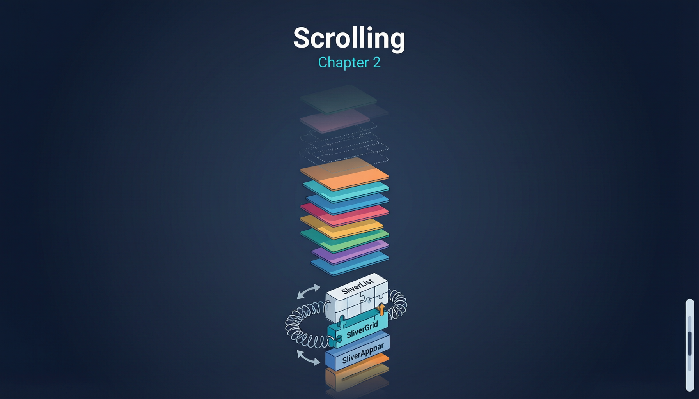

# 第二章：滚动类 Widget



Flutter 的滚动系统由三层组成：**Scrollable**（处理手势和滚动状态）、**Viewport**（可视窗口，裁剪可见区域）、**Sliver**（实际的列表/网格内容渲染）。几乎所有滚动 Widget 都是这三层的不同组合。

## 2.1 SingleChildScrollView

适用于内容量不大、不需要懒加载的滚动场景。

```dart
import 'package:flutter/material.dart';

void main() => runApp(const MyApp());

class MyApp extends StatelessWidget {
  const MyApp({super.key});

  @override
  Widget build(BuildContext context) {
    return MaterialApp(
      home: Scaffold(
        appBar: AppBar(title: const Text('SingleChildScrollView')),
        body: SingleChildScrollView(
          // 滚动方向
          scrollDirection: Axis.vertical,
          // 是否反向滚动
          reverse: false,
          // 内边距（在可滚动区域内部）
          padding: const EdgeInsets.all(16),
          // 滚动物理效果
          physics: const BouncingScrollPhysics(),
          // 滚动控制器
          controller: ScrollController(),
          // 子项
          child: Column(
            crossAxisAlignment: CrossAxisAlignment.stretch,
            children: List.generate(
              30,
              (i) => Container(
                margin: const EdgeInsets.symmetric(vertical: 4),
                padding: const EdgeInsets.all(16),
                decoration: BoxDecoration(
                  color: Colors.primaries[i % Colors.primaries.length].withOpacity(0.15),
                  borderRadius: BorderRadius.circular(8),
                ),
                child: Text('Item $i', style: const TextStyle(fontSize: 16)),
              ),
            ),
          ),
        ),
      ),
    );
  }
}
```

### 原理解析

`SingleChildScrollView` 的内部结构：

```
SingleChildScrollView
 └─ Scrollable
     └─ Viewport
         └─ _SingleChildViewport (不是 Sliver!)
             └─ child
```

注意它**不使用 Sliver**。子项以 unconstrained 约束布局（沿滚动方向），然后 Viewport 根据滚动偏移决定可视区域。这意味着所有子项都会一次性创建和布局——没有懒加载。

**与 ListView 的选择**：

- 子项少（< 几十个）且结构固定 → `SingleChildScrollView`
- 子项多或结构动态 → `ListView.builder`（有懒加载和元素回收）
- 简单地将 `SingleChildScrollView` 里的 `Column` 换成 `ListView` 是不可行的，因为两者约束模型不同。

---

## 2.2 ListView / ListView.builder / ListView.separated

`ListView` 是 Flutter 最常用的滚动 Widget，其核心优势在于**惰性创建**和**元素回收**。

```dart
import 'package:flutter/material.dart';

void main() => runApp(const MyApp());

class MyApp extends StatelessWidget {
  const MyApp({super.key});

  @override
  Widget build(BuildContext context) {
    return MaterialApp(
      home: Scaffold(
        appBar: AppBar(title: const Text('ListView 三种构造')),
        body: ListViewDemo(),
      ),
    );
  }
}

class ListViewDemo extends StatefulWidget {
  const ListViewDemo({super.key});

  @override
  State<ListViewDemo> createState() => _ListViewDemoState();
}

class _ListViewDemoState extends State<ListViewDemo> {
  final _controller = ScrollController();

  @override
  void initState() {
    super.initState();
    // 监听滚动位置
    _controller.addListener(() {
      if (_controller.position.pixels >= _controller.position.maxScrollExtent - 100) {
        // 触底加载更多
        debugPrint('触发加载更多');
      }
    });
  }

  @override
  void dispose() {
    _controller.dispose();
    super.dispose();
  }

  @override
  Widget build(BuildContext context) {
    return DefaultTabController(
      length: 3,
      child: Column(
        children: [
          const TabBar(tabs: [
            Tab(text: 'ListView'),
            Tab(text: 'builder'),
            Tab(text: 'separated'),
          ]),
          Expanded(
            child: TabBarView(
              children: [
                // ListView 默认构造 — 一次性创建所有子项（慎用大量数据）
                ListView(
                  padding: const EdgeInsets.all(8),
                  children: List.generate(
                    20,
                    (i) => ListTile(
                      leading: CircleAvatar(child: Text('$i')),
                      title: Text('Item $i'),
                      subtitle: Text('使用默认构造函数创建'),
                    ),
                  ),
                ),
                // ListView.builder — 惰性创建，按需构建
                ListView.builder(
                  controller: _controller,
                  // itemExtent 提供固定高度，优化滚动性能
                  itemExtent: 72.0,
                  // 预加载区域（像素）
                  cacheExtent: 250.0,
                  // 是否添加 KeepAlive
                  addAutomaticKeepAlives: true,
                  // 是否添加 RepaintBoundary
                  addRepaintBoundaries: true,
                  itemCount: 1000,
                  itemBuilder: (context, index) {
                    return ListTile(
                      leading: CircleAvatar(
                        backgroundColor: Colors.primaries[index % Colors.primaries.length],
                        child: Text('$index'),
                      ),
                      title: Text('Item $index'),
                      subtitle: const Text('惰性创建'),
                      trailing: const Icon(Icons.chevron_right),
                    );
                  },
                ),
                // ListView.separated — 在 itemBuilder 之间插入 separator
                ListView.separated(
                  padding: const EdgeInsets.all(8),
                  itemCount: 50,
                  itemBuilder: (context, index) {
                    return Container(
                      padding: const EdgeInsets.all(12),
                      decoration: BoxDecoration(
                        color: Colors.blue.shade50,
                        borderRadius: BorderRadius.circular(8),
                      ),
                      child: ListTile(
                        leading: const Icon(Icons.article),
                        title: Text('文章 #$index'),
                      ),
                    );
                  },
                  separatorBuilder: (context, index) {
                    return index % 5 == 4
                        ? const Padding(
                            padding: EdgeInsets.symmetric(vertical: 8),
                            child: Center(child: Text('—— 分割线 ——', style: TextStyle(color: Colors.grey))),
                          )
                        : const SizedBox(height: 4);
                  },
                ),
              ],
            ),
          ),
        ],
      ),
    );
  }
}
```

### 原理解析

**ListView = Scrollable + Viewport + SliverList**。`ListView.builder` 内部创建一个 `SliverChildBuilderDelegate`，而 `ListView` 默认构造使用 `SliverChildListDelegate`。

**元素回收（Element Recycling）**：SliverList 的 `RenderSliverList` 在 `performLayout` 中只布局可见区域内的子项。当子项滚出可视区域时，其 Element 和 RenderObject 被放入回收池。新子项进入可视区域时，优先从回收池中取 Element 进行复用（调用 `updateChild`），避免重新 inflate Widget。

关键参数解析：

- `itemExtent`：如果设置，框架不需要测量每个子项的高度，可以直接通过 `index × itemExtent` 计算位置，显著提升性能。
- `addAutomaticKeepAlives`：为每个子项包裹 `AutomaticKeepAlive`，在 TabView 等场景中保持子项状态。
- `addRepaintBoundaries`：为每个子项添加 `RepaintBoundary`，隔离重绘范围。对于简单子项可以关闭以减少 Layer 开销。
- `cacheExtent`：视口外预渲染的像素范围，默认 250px。增大此值可以减少快速滚动时的白屏，但增加内存。

**KeepAlive 机制**：当一个子项标记为 keepAlive 时，即使它滚出了可视区域，其 Element 也不会被回收。`AutomaticKeepAliveClientMixin` 让子项通过 `wantKeepAlive` getter 自主决定是否保持活跃。

---

## 2.3 GridView 系列

```dart
import 'package:flutter/material.dart';

void main() => runApp(const MyApp());

class MyApp extends StatelessWidget {
  const MyApp({super.key});

  @override
  Widget build(BuildContext context) {
    return MaterialApp(
      home: Scaffold(
        appBar: AppBar(title: const Text('GridView 系列')),
        body: DefaultTabController(
          length: 3,
          child: Column(
            children: [
              const TabBar(tabs: [
                Tab(text: 'count'),
                Tab(text: 'extent'),
                Tab(text: 'builder'),
              ]),
              Expanded(
                child: TabBarView(
                  children: [
                    // GridView.count — 固定列数
                    GridView.count(
                      padding: const EdgeInsets.all(8),
                      crossAxisCount: 3,         // 3 列
                      mainAxisSpacing: 8,        // 主轴间距
                      crossAxisSpacing: 8,       // 交叉轴间距
                      childAspectRatio: 1.0,     // 宽高比 1:1
                      children: List.generate(
                        30,
                        (i) => _gridItem(i),
                      ),
                    ),
                    // GridView.extent — 按最大宽度自动计算列数
                    GridView.extent(
                      padding: const EdgeInsets.all(8),
                      maxCrossAxisExtent: 120,   // 每个 item 最大宽度 120px
                      mainAxisSpacing: 8,
                      crossAxisSpacing: 8,
                      childAspectRatio: 0.8,     // 略高于宽
                      children: List.generate(
                        30,
                        (i) => _gridItem(i),
                      ),
                    ),
                    // GridView.builder — 惰性创建
                    GridView.builder(
                      padding: const EdgeInsets.all(8),
                      gridDelegate: const SliverGridDelegateWithFixedCrossAxisCount(
                        crossAxisCount: 2,
                        mainAxisSpacing: 12,
                        crossAxisSpacing: 12,
                        childAspectRatio: 3 / 2,
                      ),
                      itemCount: 100,
                      itemBuilder: (context, index) {
                        return Card(
                          elevation: 2,
                          child: Column(
                            mainAxisAlignment: MainAxisAlignment.center,
                            children: [
                              Icon(
                                Icons.widgets,
                                size: 40,
                                color: Colors.primaries[index % Colors.primaries.length],
                              ),
                              const SizedBox(height: 8),
                              Text('Item $index', style: const TextStyle(fontSize: 14)),
                            ],
                          ),
                        );
                      },
                    ),
                  ],
                ),
              ),
            ],
          ),
        ),
      ),
    );
  }

  Widget _gridItem(int index) {
    final color = Colors.primaries[index % Colors.primaries.length];
    return Container(
      decoration: BoxDecoration(
        color: color.withOpacity(0.2),
        borderRadius: BorderRadius.circular(8),
        border: Border.all(color: color),
      ),
      child: Center(
        child: Text('$index', style: TextStyle(fontSize: 20, color: color, fontWeight: FontWeight.bold)),
      ),
    );
  }
}
```

### 原理解析

`GridView` 内部使用 `SliverGrid`。两种 delegate 的核心区别：

- **SliverGridDelegateWithFixedCrossAxisCount**：固定列数 N，每列宽度 = (viewport 宽度 - (N-1) × crossAxisSpacing) / N。
- **SliverGridDelegateWithMaxCrossAxisExtent**：给定最大宽度，自动计算列数 N = ceil(viewportWidth / maxCrossAxisExtent)，然后按固定列数逻辑布局。

`childAspectRatio` 决定每个 item 的高度 = item 宽度 / aspectRatio。这是**固定比例约束**，子项无法自由决定自身高度。

---

## 2.4 CustomScrollView + Sliver 系列

`CustomScrollView` 是 Flutter 滚动系统的终极形态——它是 Sliver 的宿主容器，允许你在同一个滚动视图中混合不同类型的滚动内容。

```dart
import 'package:flutter/material.dart';

void main() => runApp(const MyApp());

class MyApp extends StatelessWidget {
  const MyApp({super.key});

  @override
  Widget build(BuildContext context) {
    return MaterialApp(
      home: const CustomScrollViewDemo(),
    );
  }
}

class CustomScrollViewDemo extends StatelessWidget {
  const CustomScrollViewDemo({super.key});

  @override
  Widget build(BuildContext context) {
    return Scaffold(
      body: CustomScrollView(
        // 滚动控制器
        controller: ScrollController(),
        // 物理效果
        physics: const BouncingScrollPhysics(),
        slivers: [
          // SliverAppBar — 可折叠的应用栏
          SliverAppBar(
            expandedHeight: 200,
            floating: false,   // 向下滚动时是否立即出现
            pinned: true,      // 是否固定在顶部（折叠到 toolbar 高度后停住）
            snap: false,       // 是否吸附（配合 floating 使用）
            flexibleSpace: FlexibleSpaceBar(
              title: const Text('CustomScrollView'),
              background: Container(
                decoration: BoxDecoration(
                  gradient: LinearGradient(
                    begin: Alignment.topLeft,
                    end: Alignment.bottomRight,
                    colors: [Colors.deepPurple, Colors.indigo],
                  ),
                ),
              ),
            ),
          ),

          // SliverPadding — 给 Sliver 添加内边距
          SliverPadding(
            padding: const EdgeInsets.all(16),
            sliver: SliverToBoxAdapter(
              // 将普通 Widget 包装为 Sliver
              child: Container(
                padding: const EdgeInsets.all(16),
                decoration: BoxDecoration(
                  color: Colors.amber.shade50,
                  borderRadius: BorderRadius.circular(12),
                ),
                child: const Text(
                  'SliverToBoxAdapter 将任意 Widget 包装为 Sliver。'
                  'CustomScrollView 的子项必须全部是 Sliver，'
                  '普通 Widget 需要通过此适配器转换。',
                  style: TextStyle(fontSize: 14),
                ),
              ),
            ),
          ),

          // SliverList — 等效 ListView
          const SliverPadding(
            padding: EdgeInsets.symmetric(horizontal: 16),
            sliver: SliverToBoxAdapter(
              child: Text('SliverList', style: TextStyle(fontSize: 18, fontWeight: FontWeight.bold)),
            ),
          ),
          SliverList(
            delegate: SliverChildBuilderDelegate(
              (context, index) {
                return ListTile(
                  leading: CircleAvatar(child: Text('$index')),
                  title: Text('List Item $index'),
                  subtitle: const Text('来自 SliverList'),
                );
              },
              childCount: 10,
            ),
          ),

          // SliverFixedExtentList — 固定高度的列表（性能更优）
          const SliverPadding(
            padding: EdgeInsets.fromLTRB(16, 16, 16, 8),
            sliver: SliverToBoxAdapter(
              child: Text('SliverFixedExtentList', style: TextStyle(fontSize: 18, fontWeight: FontWeight.bold)),
            ),
          ),
          SliverFixedExtentList(
            itemExtent: 60,
            delegate: SliverChildBuilderDelegate(
              (context, index) {
                return Container(
                  margin: const EdgeInsets.symmetric(horizontal: 16, vertical: 2),
                  color: Colors.teal.shade50,
                  alignment: Alignment.centerLeft,
                  child: Padding(
                    padding: const EdgeInsets.symmetric(horizontal: 12),
                    child: Text('固定高度 Item $index'),
                  ),
                );
              },
              childCount: 5,
            ),
          ),

          // SliverGrid — 等效 GridView
          const SliverPadding(
            padding: EdgeInsets.fromLTRB(16, 16, 16, 8),
            sliver: SliverToBoxAdapter(
              child: Text('SliverGrid', style: TextStyle(fontSize: 18, fontWeight: FontWeight.bold)),
            ),
          ),
          SliverPadding(
            padding: const EdgeInsets.symmetric(horizontal: 16),
            sliver: SliverGrid(
              gridDelegate: const SliverGridDelegateWithFixedCrossAxisCount(
                crossAxisCount: 3,
                mainAxisSpacing: 8,
                crossAxisSpacing: 8,
              ),
              delegate: SliverChildBuilderDelegate(
                (context, index) {
                  return Container(
                    decoration: BoxDecoration(
                      color: Colors.primaries[index % Colors.primaries.length].withOpacity(0.2),
                      borderRadius: BorderRadius.circular(8),
                    ),
                    child: Center(child: Text('G$index')),
                  );
                },
                childCount: 9,
              ),
            ),
          ),

          // SliverFillRemaining — 填充剩余空间
          SliverFillRemaining(
            hasScrollBody: false,
            child: Container(
              alignment: Alignment.center,
              color: Colors.grey.shade100,
              child: const Text('SliverFillRemaining\n填充剩余空间', textAlign: TextAlign.center),
            ),
          ),
        ],
      ),
    );
  }
}
```

### 原理解析

**RenderSliver 的布局协议**与 RenderBox 完全不同。Sliver 不使用 BoxConstraints，而是使用 **SliverConstraints**，包含：

- `scrollOffset`：当前 sliver 的滚动偏移
- `remainingPaintExtent`：剩余的可绘制空间
- `overlap`：与前一个 sliver 的重叠量（用于 SliverAppBar 的 pinned 效果）
- `crossAxisExtent`：交叉轴可用空间
- `viewportMainAxisExtent`：视口的主轴总尺寸

Sliver 的输出是 **SliverGeometry**，包含：

- `scrollExtent`：此 sliver 的总滚动范围（全部内容的总高度）
- `paintExtent`：此 sliver 实际绘制的像素范围
- `maxPaintExtent`：最大绘制范围
- `maxScrollObstructionExtent`：最大滚动阻碍范围（用于 pinned SliverAppBar 影响 ScrollController.offset 计算）
- `hasVisualOverflow`：是否有视觉溢出（需要裁剪）

**为什么 Sliver 比嵌套 ScrollView 更高效？** 当你在 Column 中嵌套两个 ListView 时，每个 ListView 都是独立的 Scrollable，各自维护独立的滚动状态、物理模拟和 Viewport。而 CustomScrollView 中的多个 Sliver 共享同一个 Scrollable 和 Viewport，滚动是统一的，性能开销线性增长而非乘法增长。

**NestedScrollView** 解决的是"外层和内层滚动不联动"的问题。它通过 `NestedScrollView` 的 coordinator 将内外层的 `ScrollPosition` 统一管理。典型场景是：SliverAppBar + TabBarView，每个 Tab 内部是一个独立的列表。

---

## 2.5 ScrollController / ScrollPhysics

```dart
import 'package:flutter/material.dart';

void main() => runApp(const MyApp());

class MyApp extends StatelessWidget {
  const MyApp({super.key});

  @override
  Widget build(BuildContext context) {
    return MaterialApp(
      home: const ScrollControllerDemo(),
    );
  }
}

class ScrollControllerDemo extends StatefulWidget {
  const ScrollControllerDemo({super.key});

  @override
  State<ScrollControllerDemo> createState() => _ScrollControllerDemoState();
}

class _ScrollControllerDemoState extends State<ScrollControllerDemo> {
  final _controller = ScrollController();
  double _offset = 0;
  bool _showBackToTop = false;

  @override
  void initState() {
    super.initState();
    _controller.addListener(() {
      setState(() {
        _offset = _controller.offset;
        _showBackToTop = _controller.offset > 300;
      });
    });
  }

  @override
  void dispose() {
    _controller.dispose();
    super.dispose();
  }

  void _scrollToTop() {
    _controller.animateTo(
      0,
      duration: const Duration(milliseconds: 500),
      curve: Curves.easeOutCubic,
    );
  }

  @override
  Widget build(BuildContext context) {
    return Scaffold(
      appBar: AppBar(title: Text('Scroll: ${_offset.toStringAsFixed(0)}px')),
      body: NotificationListener<ScrollNotification>(
        onNotification: (notification) {
          // 滚动开始
          if (notification is ScrollStartNotification) {
            debugPrint('滚动开始');
          }
          // 滚动中
          if (notification is ScrollUpdateNotification) {
            debugPrint('滚动更新: ${notification.metrics.pixels}');
          }
          // 滚动结束
          if (notification is ScrollEndNotification) {
            debugPrint('滚动结束');
          }
          // 过度滚动（到达边界）
          if (notification is OverscrollNotification) {
            debugPrint('过度滚动: ${notification.overscroll}');
          }
          return false; // false = 不消费通知
        },
        child: ListView.builder(
          controller: _controller,
          // 物理效果：iOS 弹性回弹
          physics: const BouncingScrollPhysics(),
          // 也可以用 ClampingScrollPhysics (Android 默认，到达边界有微光效果)
          // 或 NeverScrollableScrollPhysics (禁止用户滚动)
          // 或 AlwaysScrollableScrollPhysics (即使内容不够长也可滚动)
          itemCount: 100,
          itemBuilder: (context, index) {
            return ListTile(
              leading: CircleAvatar(child: Text('$index')),
              title: Text('Item $index'),
              subtitle: Text('滚动到此处偏移约 ${index * 56}'),
            );
          },
        ),
      ),
      floatingActionButton: _showBackToTop
          ? FloatingActionButton(
              onPressed: _scrollToTop,
              child: const Icon(Icons.arrow_upward),
            )
          : null,
    );
  }
}
```

### 原理解析

**ScrollController** 持有 `ScrollPosition` 列表（通常只有一个）。`ScrollPosition` 是真正管理滚动状态的对象，存储了 `pixels`（当前偏移）、`maxScrollExtent`（最大可滚动距离）等。

`animateTo` 的实现：创建一个 `Simulation`（通常是 `ScrollSimulation`），通过 `AnimationController` 驱动，每帧调用 `ScrollPosition.applyBoundaryConditions` 和 `ScrollPosition.setPixels` 更新偏移。

**ScrollPhysics** 定义了滚动的物理行为：

- `BouncingScrollPhysics`：iOS 风格，超过边界后弹性回弹。内部的 `BouncingScrollSimulation` 使用弹簧物理模型。
- `ClampingScrollPhysics`：Android 风格，到达边界后停止，显示 OverscrollGlow。
- `NeverScrollableScrollPhysics`：禁止用户手势滚动（但仍可通过 ScrollController 编程式滚动）。
- `AlwaysScrollableScrollPhysics`：即使内容总高度小于视口高度也允许滚动。

**NotificationListener\<ScrollNotification\>** 基于 Flutter 的 Notification 冒泡机制。ScrollNotification 从 Scrollable 向上冒泡，任何祖先都可以通过 NotificationListener 拦截。`RefreshIndicator` 就是这样实现的。

---

## 2.6 RefreshIndicator

```dart
import 'package:flutter/material.dart';

void main() => runApp(const MyApp());

class MyApp extends StatelessWidget {
  const MyApp({super.key});

  @override
  Widget build(BuildContext context) {
    return MaterialApp(
      home: const RefreshIndicatorDemo(),
    );
  }
}

class RefreshIndicatorDemo extends StatefulWidget {
  const RefreshIndicatorDemo({super.key});

  @override
  State<RefreshIndicatorDemo> createState() => _RefreshIndicatorDemoState();
}

class _RefreshIndicatorDemoState extends State<RefreshIndicatorDemo> {
  List<String> _items = List.generate(20, (i) => 'Item $i');

  Future<void> _onRefresh() async {
    // 模拟网络请求
    await Future.delayed(const Duration(seconds: 2));
    setState(() {
      // 在最前面插入 5 条新数据
      final newItems = List.generate(5, (i) => '新 Item ${DateTime.now().second}-$i');
      _items = [...newItems, ..._items];
    });
  }

  @override
  Widget build(BuildContext context) {
    return Scaffold(
      appBar: AppBar(title: const Text('RefreshIndicator 下拉刷新')),
      body: RefreshIndicator(
        onRefresh: _onRefresh,
        // 刷新指示器颜色
        color: Colors.deepPurple,
        // 指示器出现位置（距顶部的偏移）
        displacement: 40.0,
        // 触发下拉的阈值
        triggerMode: RefreshIndicatorTriggerMode.onEdge,
        child: ListView.builder(
          // 即使列表项不足以滚动，也允许下拉刷新
          physics: const AlwaysScrollableScrollPhysics(),
          itemCount: _items.length,
          itemBuilder: (context, index) {
            return ListTile(
              leading: const Icon(Icons.inbox),
              title: Text(_items[index]),
            );
          },
        ),
      ),
    );
  }
}
```

### 原理解析

`RefreshIndicator` 的核心实现：

1. 包裹子项在一个 `NotificationListener<ScrollNotification>` 中。
2. 监听 `OverscrollNotification`（当列表已到顶部但用户继续下拉时触发）。
3. 根据下拉距离决定是否显示刷新指示器。
4. 达到阈值后调用 `onRefresh` 回调，显示旋转动画直到 Future 完成。

刷新指示器的绘制使用 `CustomPaint`，在滚动列表之上绘制一个圆形进度指示器。`displacement` 参数控制指示器距顶部的初始偏移。

**自定义下拉刷新**：如果需要更复杂的 UI（例如美团外卖的自定义刷新动画），可以使用 `RefreshIndicator` 的 `notificationPredicate` 自定义触发条件，或直接基于 `NotificationListener` + `AnimatedBuilder` 自行实现。

---

## 2.7 ReorderableListView

```dart
import 'package:flutter/material.dart';

void main() => runApp(const MyApp());

class MyApp extends StatelessWidget {
  const MyApp({super.key});

  @override
  Widget build(BuildContext context) {
    return MaterialApp(
      home: const ReorderableListDemo(),
    );
  }
}

class ReorderableListDemo extends StatefulWidget {
  const ReorderableListDemo({super.key});

  @override
  State<ReorderableListDemo> createState() => _ReorderableListDemoState();
}

class _ReorderableListDemoState extends State<ReorderableListDemo> {
  List<String> _items = List.generate(15, (i) => '任务 $i');

  @override
  Widget build(BuildContext context) {
    return Scaffold(
      appBar: AppBar(title: const Text('ReorderableListView')),
      body: ReorderableListView.builder(
        padding: const EdgeInsets.all(8),
        // 长按拖拽（默认 true）
        buildDefaultDragHandles: true,
        // 代理装饰器：拖拽时的视觉反馈
        proxyDecorator: (child, index, animation) {
          return AnimatedBuilder(
            animation: animation,
            builder: (context, child) {
              final animValue = Curves.easeInOut.transform(animation.value);
              return Transform.scale(
                scale: 1.0 + 0.05 * animValue,
                child: Material(
                  elevation: 4 * animValue,
                  borderRadius: BorderRadius.circular(8),
                  child: child,
                ),
              );
            },
            child: child,
          );
        },
        itemCount: _items.length,
        itemBuilder: (context, index) {
          // 必须有 key
          return Card(
            key: ValueKey(_items[index]),
            margin: const EdgeInsets.symmetric(vertical: 4),
            child: ListTile(
              leading: const Icon(Icons.drag_handle),
              title: Text(_items[index]),
              trailing: const Icon(Icons.reorder),
            ),
          );
        },
        onReorder: (oldIndex, newIndex) {
          setState(() {
            if (oldIndex < newIndex) {
              newIndex -= 1;
            }
            final item = _items.removeAt(oldIndex);
            _items.insert(newIndex, item);
          });
        },
      ),
    );
  }
}
```

### 原理解析

`ReorderableListView` 的拖拽实现：

1. 每个 item 通过 `LongPressDraggable`（或 `Draggable`）获得拖拽能力。
2. 拖拽时，创建一个 **Overlay entry** 显示拖拽反馈（`proxyDecorator` 修饰的 Widget）。
3. 原始 item 位置保留一个占位空间。
4. 拖拽过程中，通过计算拖拽位置与其他 item 的相对位置，触发 `onReorder` 回调。
5. 释放时，执行动画将占位空间过渡到新位置。

注意：`newIndex` 的计算规则是——如果向下拖拽，`newIndex` 需要减 1，因为原始位置的移除会导致后续索引偏移。

---

## 2.8 Scrollbar

```dart
import 'package:flutter/material.dart';

void main() => runApp(const MyApp());

class MyApp extends StatelessWidget {
  const MyApp({super.key});

  @override
  Widget build(BuildContext context) {
    return MaterialApp(
      home: const ScrollbarDemo(),
    );
  }
}

class ScrollbarDemo extends StatelessWidget {
  const ScrollbarDemo({super.key});

  @override
  Widget build(BuildContext context) {
    final controller = ScrollController();
    return Scaffold(
      appBar: AppBar(title: const Text('Scrollbar')),
      body: Scrollbar(
        controller: controller,
        // 滑块厚度
        thickness: 8.0,
        // 滑块圆角
        radius: const Radius.circular(4),
        // 始终显示滑块（否则只在滚动时显示）
        thumbVisibility: true,
        // 是否可交互（拖拽滑块）
        interactive: true,
        child: ListView.builder(
          controller: controller,
          itemCount: 200,
          itemBuilder: (context, index) {
            return ListTile(
              title: Text('Item $index'),
              subtitle: LinearProgressIndicator(
                value: index / 200,
                backgroundColor: Colors.grey.shade200,
              ),
            );
          },
        ),
      ),
    );
  }
}
```

### 原理解析

`Scrollbar` 内部使用 `NotificationListener<ScrollNotification>` 监听滚动事件，根据 `ScrollMetrics`（包含 minScrollExtent、maxScrollExtent、pixels、viewportDimension）计算滑块的位置和大小。

滑块长度 = `viewportDimension / maxScrollExtent × trackLength`（近似）。滑块位置 = `pixels / maxScrollExtent × (trackLength - thumbLength)`。

`RawScrollbar` 是更底层的版本，`Scrollbar`（Material 风格）和 `CupertinoScrollbar` 都是基于它的封装。

---
