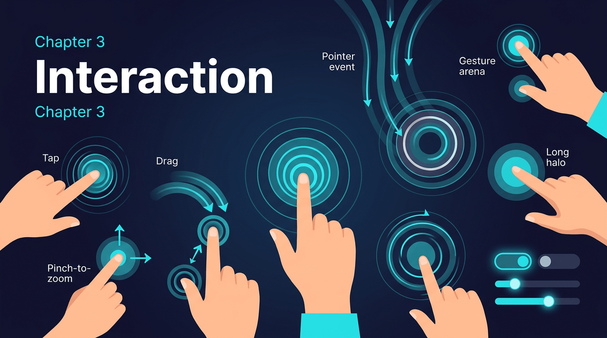

# 第三章：交互类 Widget



交互系统建立在 Flutter 的**手势识别管线（Gesture Pipeline）**之上：原始指针事件 → 手势识别器 → 手势竞技场 → 手势回调。理解这条管线是掌握交互 Widget 的关键。

## 3.1 GestureDetector

`GestureDetector` 是 Flutter 手势系统的高层抽象，它将多种手势识别器打包在一起。

```dart
import 'package:flutter/material.dart';

void main() => runApp(const MyApp());

class MyApp extends StatelessWidget {
  const MyApp({super.key});

  @override
  Widget build(BuildContext context) {
    return MaterialApp(
      home: const GestureDetectorDemo(),
    );
  }
}

class GestureDetectorDemo extends StatefulWidget {
  const GestureDetectorDemo({super.key});

  @override
  State<GestureDetectorDemo> createState() => _GestureDetectorDemoState();
}

class _GestureDetectorDemoState extends State<GestureDetectorDemo> {
  String _status = '等待交互...';
  Offset _position = Offset.zero;
  double _scale = 1.0;
  double _rotation = 0.0;

  @override
  Widget build(BuildContext context) {
    return Scaffold(
      appBar: AppBar(title: const Text('GestureDetector')),
      body: Column(
        children: [
          // 状态显示
          Container(
            padding: const EdgeInsets.all(16),
            color: Colors.grey.shade100,
            child: Center(child: Text(_status, style: const TextStyle(fontSize: 16))),
          ),
          const SizedBox(height: 16),
          // 手势交互区域
          Expanded(
            child: Center(
              child: GestureDetector(
                // 点击
                onTap: () => setState(() => _status = '单击'),
                onTapDown: (details) => setState(() => _status = '按下: ${details.globalPosition}'),
                onTapUp: (details) => setState(() => _status = '抬起'),
                onTapCancel: () => setState(() => _status = '取消点击'),
                // 双击
                onDoubleTap: () => setState(() => _status = '双击'),
                // 长按
                onLongPress: () => setState(() => _status = '长按'),
                onLongPressStart: (details) => setState(() => _status = '长按开始: ${details.globalPosition}'),
                onLongPressEnd: (details) => setState(() => _status = '长按结束'),
                // 拖拽 (Pan)
                onPanStart: (details) => setState(() => _status = '拖拽开始'),
                onPanUpdate: (details) {
                  setState(() {
                    _position += details.delta;
                    _status = '拖拽: delta=${details.delta}';
                  });
                },
                onPanEnd: (details) => setState(() => _status = '拖拽结束: velocity=${details.velocity}'),
                // 缩放 (Scale) — 不能与 Pan 同时使用
                // onScaleStart: (details) => setState(() => _status = '缩放开始'),
                // onScaleUpdate: (details) {
                //   setState(() {
                //     _scale = details.scale;
                //     _rotation = details.rotation;
                //     _status = '缩放: scale=${_scale.toStringAsFixed(2)}, rotation=${_rotation.toStringAsFixed(2)}';
                //   });
                // },
                // 命中行为
                behavior: HitTestBehavior.opaque,
                child: Transform(
                  transform: Matrix4.identity()
                    ..translate(_position.dx, _position.dy)
                    ..scale(_scale)
                    ..rotateZ(_rotation),
                  child: Container(
                    width: 150,
                    height: 150,
                    decoration: BoxDecoration(
                      color: Colors.deepPurple,
                      borderRadius: BorderRadius.circular(16),
                      boxShadow: [
                        BoxShadow(color: Colors.deepPurple.withOpacity(0.4), blurRadius: 12, offset: const Offset(0, 6)),
                      ],
                    ),
                    child: const Center(
                      child: Text('点击/拖拽我', style: TextStyle(color: Colors.white, fontSize: 16)),
                    ),
                  ),
                ),
              ),
            ),
          ),
        ],
      ),
    );
  }
}
```

### 原理解析

**手势竞技场（Gesture Arena）** 是 Flutter 手势冲突解决的核心机制。当多个 GestureRecognizer 竞争同一个指针事件序列时，它们各自注册到 GestureArenaManager。竞技场根据优先级和时序决定胜出者：

1. 当一个新的 PointerDownEvent 到达时，所有感兴趣的 GestureRecognizer 通过 `addPointer` 方法注册为竞争者。
2. 在后续事件中，每个识别器根据事件模式自行判断——如果模式不匹配就主动退出竞技场（`resolve(GestureDisposition.rejected)`）。
3. 当只剩一个竞争者时，它胜出并触发对应的手势回调。
4. 如果到达 PointerUpEvent 仍有多个竞争者，最后注册的那个胜出（"延迟决断"策略）。

**Pan vs Scale 的互斥**：`onPanUpdate` 和 `onScaleUpdate` 不能同时设置，因为它们在竞技场中是互斥的识别器。Scale 识别器包含了 Pan 的能力（单指拖动时也能触发 Scale 回调，scale=1.0）。

**HitTestBehavior**：

- `deferToChild`（默认）：只有子项区域响应 hit test。
- `opaque`：整个 GestureDetector 区域都响应，即使子项是透明的。
- `translucent`：自身和子项都参与 hit test，事件会穿透到后面的 Widget。

**GestureDetector vs Listener**：GestureDetector 基于语义化的手势（tap、pan、scale），经过竞技场解决冲突；Listener 提供原始指针事件，不经过竞技场，适合需要精细控制的场景。

---

## 3.2 InkWell / InkResponse

`InkWell` 提供 Material Design 的水波纹效果，是构建可点击项的首选。

```dart
import 'package:flutter/material.dart';

void main() => runApp(const MyApp());

class MyApp extends StatelessWidget {
  const MyApp({super.key});

  @override
  Widget build(BuildContext context) {
    return MaterialApp(
      home: const InkWellDemo(),
    );
  }
}

class InkWellDemo extends StatelessWidget {
  const InkWellDemo({super.key});

  @override
  Widget build(BuildContext context) {
    return Scaffold(
      appBar: AppBar(title: const Text('InkWell 水波纹')),
      body: ListView(
        padding: const EdgeInsets.all(16),
        children: [
          // 标准用法
          const Text('标准用法', style: TextStyle(fontWeight: FontWeight.bold)),
          const SizedBox(height: 8),
          Material(
            color: Colors.white,
            child: InkWell(
              onTap: () => debugPrint('clicked'),
              splashColor: Colors.blue.withOpacity(0.3),
              highlightColor: Colors.blue.withOpacity(0.1),
              borderRadius: BorderRadius.circular(8),
              child: const Padding(
                padding: EdgeInsets.all(16),
                child: Text('点击产生水波纹'),
              ),
            ),
          ),
          const SizedBox(height: 16),

          // 常见陷阱：没有 Material 祖先
          const Text('常见陷阱与解决方案', style: TextStyle(fontWeight: FontWeight.bold)),
          const SizedBox(height: 8),
          Container(
            // 注意：如果祖先没有 Material，水波纹不可见
            // 解决方案：用 Ink 包裹
            decoration: BoxDecoration(
              color: Colors.orange.shade50,
              borderRadius: BorderRadius.circular(8),
            ),
            child: Ink(
              // Ink 创建了一个 Material 层
              decoration: BoxDecoration(
                color: Colors.orange.shade50,
                borderRadius: BorderRadius.circular(8),
              ),
              child: InkWell(
                onTap: () {},
                borderRadius: BorderRadius.circular(8),
                child: const Padding(
                  padding: EdgeInsets.all(16),
                  child: Text('用 Ink 包裹解决水波纹不可见问题'),
                ),
              ),
            ),
          ),
          const SizedBox(height: 16),

          // 自定义形状
          const Text('自定义形状', style: TextStyle(fontWeight: FontWeight.bold)),
          const SizedBox(height: 8),
          Material(
            color: Colors.white,
            child: InkWell(
              onTap: () {},
              customBorder: const CircleBorder(),
              splashColor: Colors.red.withOpacity(0.3),
              child: const Padding(
                padding: EdgeInsets.all(24),
                child: Row(
                  children: [
                    Icon(Icons.favorite, color: Colors.red),
                    SizedBox(width: 12),
                    Text('圆形水波纹'),
                  ],
                ),
              ),
            ),
          ),
          const SizedBox(height: 16),

          // InkResponse vs InkWell
          const Text('InkResponse vs InkWell', style: TextStyle(fontWeight: FontWeight.bold)),
          const SizedBox(height: 8),
          InkResponse(
            onTap: () {},
            splashColor: Colors.green.withOpacity(0.3),
            // InkResponse 不要求子项铺满
            containedInkWell: false,
            highlightShape: BoxShape.circle,
            child: const Padding(
              padding: EdgeInsets.all(8),
              child: Text('InkResponse — 更灵活的波纹'),
            ),
          ),
        ],
      ),
    );
  }
}
```

### 原理解析

**水波纹的实现机制**：当用户点击 InkWell 时，它创建一个 `InkFeature`（具体是 `_InkSplash` 或 `_InkRipple`），该 InkFeature 被注册到最近的 `Material` Widget 的 `_InkFeatures` 状态中。

关键点：水波纹**不是绘制在 InkWell 自身的 Canvas 上，而是绘制在 Material 的 Canvas 上**。这就是为什么 InkWell 需要一个 Material 祖先——如果没有 Material，InkFeature 无处注册，水波纹就不可见。

`Ink` Widget 实际上是一个 `Material(type: MaterialType.canvas)` 的精简版，它为 InkWell 提供了一个绘制层。

**常见陷阱**：当你在 Container（设置了 BoxDecoration 背景色）上直接使用 InkWell 时，水波纹会被 Container 的背景色覆盖——因为 Container 的 DecoratedBox 在 Material 的绘制层之上。解决方案是用 `Ink` 替换 `Container` 来设置装饰。

**InkResponse vs InkWell**：

- `InkWell`：水波纹铺满整个矩形区域，子项约束为 tight。
- `InkResponse`：水波纹可以限制为圆形，子项约束为 loose，更灵活。
- `InkWell` 是 `InkResponse` 的子类，设了 `containedInkWell: true` 和 `highlightShape: BoxShape.rectangle`。

---

## 3.3 Listener

```dart
import 'package:flutter/material.dart';

void main() => runApp(const MyApp());

class MyApp extends StatelessWidget {
  const MyApp({super.key});

  @override
  Widget build(BuildContext context) {
    return MaterialApp(
      home: const ListenerDemo(),
    );
  }
}

class ListenerDemo extends StatefulWidget {
  const ListenerDemo({super.key});

  @override
  State<ListenerDemo> createState() => _ListenerDemoState();
}

class _ListenerDemoState extends State<ListenerDemo> {
  final List<String> _events = [];

  void _addEvent(String event) {
    setState(() {
      _events.insert(0, '${DateTime.now().toString().substring(11, 23)} $event');
      if (_events.length > 20) _events.removeLast();
    });
  }

  @override
  Widget build(BuildContext context) {
    return Scaffold(
      appBar: AppBar(title: const Text('Listener 原始指针事件')),
      body: Column(
        children: [
          Expanded(
            flex: 1,
            child: Container(
              margin: const EdgeInsets.all(16),
              decoration: BoxDecoration(
                color: Colors.deepPurple.shade50,
                borderRadius: BorderRadius.circular(12),
                border: Border.all(color: Colors.deepPurple),
              ),
              child: Listener(
                // behavior 控制命中区域
                behavior: HitTestBehavior.opaque,
                onPointerDown: (event) {
                  _addEvent('Down: (${event.localPosition.dx.toStringAsFixed(0)}, ${event.localPosition.dy.toStringAsFixed(0)}) pressure=${event.pressure.toStringAsFixed(2)}');
                },
                onPointerMove: (event) {
                  _addEvent('Move: delta=(${event.delta.dx.toStringAsFixed(1)}, ${event.delta.dy.toStringAsFixed(1)})');
                },
                onPointerUp: (event) {
                  _addEvent('Up');
                },
                onPointerCancel: (event) {
                  _addEvent('Cancel');
                },
                // 悬停事件（鼠标/触控板）
                onPointerHover: (event) {
                  // 高频触发，谨慎 setState
                },
                // 信号事件（鼠标滚轮等）
                onPointerSignal: (event) {
                  if (event is PointerScrollEvent) {
                    _addEvent('Scroll: ${event.scrollDelta}');
                  }
                },
                child: const Center(
                  child: Text('触摸/拖动此区域', style: TextStyle(fontSize: 18, color: Colors.deepPurple)),
                ),
              ),
            ),
          ),
          Expanded(
            flex: 1,
            child: ListView.builder(
              itemCount: _events.length,
              itemBuilder: (context, index) {
                return Padding(
                  padding: const EdgeInsets.symmetric(horizontal: 16, vertical: 2),
                  child: Text(_events[index], style: const TextStyle(fontSize: 12, fontFamily: 'monospace')),
                );
              },
            ),
          ),
        ],
      ),
    );
  }
}
```

### 原理解析

`Listener` 直接在 Widget 树的 RenderObject 层（`RenderPointerListener`）注册原始指针事件。与 `GestureDetector` 的核心区别：

| 特性 | Listener | GestureDetector |
|------|---------|----------------|
| 事件层级 | 原始指针事件 (PointerEvent) | 语义化手势 (Gesture) |
| 手势竞技场 | 不参与 | 参与，解决冲突 |
| 事件类型 | Down/Move/Up/Cancel/Hover/Signal | Tap/Pan/Scale/LongPress |
| 多指支持 | 每个指针独立事件 | 合并为统一手势 |
| 适用场景 | 需要精细控制 | 常见交互模式 |

**PointerEvent 的属性**包括：`position`（全局坐标）、`localPosition`（局部坐标）、`delta`（移动增量）、`pressure`（压力值，支持压感笔）、`size`（接触面积）等。这些信息在 GestureDetector 的语义化回调中会丢失。

---

## 3.4 MouseRegion

```dart
import 'package:flutter/material.dart';

void main() => runApp(const MyApp());

class MyApp extends StatelessWidget {
  const MyApp({super.key});

  @override
  Widget build(BuildContext context) {
    return MaterialApp(
      home: const MouseRegionDemo(),
    );
  }
}

class MouseRegionDemo extends StatefulWidget {
  const MouseRegionDemo({super.key});

  @override
  State<MouseRegionDemo> createState() => _MouseRegionDemoState();
}

class _MouseRegionDemoState extends State<MouseRegionDemo> {
  bool _isHovering = false;
  Offset _mousePosition = Offset.zero;

  @override
  Widget build(BuildContext context) {
    return Scaffold(
      appBar: AppBar(title: const Text('MouseRegion')),
      body: Center(
        child: MouseRegion(
          // 鼠标进入
          onEnter: (event) {
            setState(() => _isHovering = true);
          },
          // 鼠标离开
          onExit: (event) {
            setState(() => _isHovering = false);
          },
          // 鼠标移动
          onHover: (event) {
            setState(() => _mousePosition = event.localPosition);
          },
          // 鼠标光标样式
          cursor: _isHovering ? SystemMouseCursors.click : SystemMouseCursors.basic,
          // 不透明：即使子项区域外也触发 hover
          opaque: true,
          child: AnimatedContainer(
            duration: const Duration(milliseconds: 200),
            width: 300,
            height: 200,
            decoration: BoxDecoration(
              color: _isHovering ? Colors.deepPurple : Colors.grey.shade200,
              borderRadius: BorderRadius.circular(16),
              boxShadow: _isHovering
                  ? [BoxShadow(color: Colors.deepPurple.withOpacity(0.4), blurRadius: 20)]
                  : [],
            ),
            child: Center(
              child: Column(
                mainAxisAlignment: MainAxisAlignment.center,
                children: [
                  Text(
                    _isHovering ? '鼠标在此区域内' : '将鼠标悬停到这里',
                    style: TextStyle(color: _isHovering ? Colors.white : Colors.black54, fontSize: 16),
                  ),
                  const SizedBox(height: 8),
                  Text(
                    '位置: (${_mousePosition.dx.toStringAsFixed(0)}, ${_mousePosition.dy.toStringAsFixed(0)})',
                    style: TextStyle(color: _isHovering ? Colors.white70 : Colors.black38, fontSize: 12),
                  ),
                ],
              ),
            ),
          ),
        ),
      ),
    );
  }
}
```

### 原理解析

`MouseRegion` 仅影响**鼠标和触控板**设备，不影响触摸屏。它通过 `RenderMouseRegion` 在 hit test 阶段注册鼠标事件监听。

`SystemMouseCursors` 提供了一系列系统预定义的光标样式：`click`（手指）、`text`（文本选择）、`move`（移动）、`grab`（抓取）等。这些光标由操作系统渲染，不消耗 Flutter 的渲染资源。

---

## 3.5 Draggable / DragTarget / LongPressDraggable

```dart
import 'package:flutter/material.dart';

void main() => runApp(const MyApp());

class MyApp extends StatelessWidget {
  const MyApp({super.key});

  @override
  Widget build(BuildContext context) {
    return MaterialApp(
      home: const DraggableDemo(),
    );
  }
}

class DraggableDemo extends StatefulWidget {
  const DraggableDemo({super.key});

  @override
  State<DraggableDemo> createState() => _DraggableDemoState();
}

class _DraggableDemoState extends State<DraggableDemo> {
  final List<String> _todoItems = ['任务 A', '任务 B', '任务 C'];
  final List<String> _doneItems = [];

  @override
  Widget build(BuildContext context) {
    return Scaffold(
      appBar: AppBar(title: const Text('Draggable / DragTarget')),
      body: Row(
        children: [
          // 待办列表
          Expanded(
            child: Column(
              crossAxisAlignment: CrossAxisAlignment.stretch,
              children: [
                Container(
                  padding: const EdgeInsets.all(12),
                  color: Colors.blue.shade50,
                  child: const Text('待办', style: TextStyle(fontSize: 18, fontWeight: FontWeight.bold)),
                ),
                Expanded(
                  child: ListView.builder(
                    itemCount: _todoItems.length,
                    itemBuilder: (context, index) {
                      return Draggable<String>(
                        // 传递的数据
                        data: _todoItems[index],
                        // 拖拽时的反馈 Widget（跟随手指）
                        feedback: Material(
                          elevation: 4,
                          child: Container(
                            padding: const EdgeInsets.all(12),
                            color: Colors.blue.shade100,
                            child: Text(_todoItems[index], style: const TextStyle(fontSize: 16)),
                          ),
                        ),
                        // 拖拽中原位置的 Widget
                        childWhenDragging: Container(
                          padding: const EdgeInsets.all(12),
                          color: Colors.grey.shade200,
                          child: Text(_todoItems[index], style: const TextStyle(color: Colors.grey)),
                        ),
                        onDragStarted: () => debugPrint('开始拖拽: ${_todoItems[index]}'),
                        onDragEnd: (details) => debugPrint('拖拽结束'),
                        // 原始 Widget
                        child: Container(
                          padding: const EdgeInsets.all(12),
                          margin: const EdgeInsets.all(4),
                          decoration: BoxDecoration(
                            color: Colors.white,
                            borderRadius: BorderRadius.circular(8),
                            border: Border.all(color: Colors.blue.shade200),
                          ),
                          child: Text(_todoItems[index]),
                        ),
                      );
                    },
                  ),
                ),
              ],
            ),
          ),
          // 已完成列表 — DragTarget
          Expanded(
            child: DragTarget<String>(
              // 判断是否接受拖入的数据
              onWillAccept: (data) => data != null && !_doneItems.contains(data),
              // 数据被接受时的回调
              onAccept: (data) {
                setState(() {
                  _todoItems.remove(data);
                  _doneItems.add(data);
                });
              },
              // 不接受时
              onLeave: (data) => debugPrint('离开目标区域'),
              builder: (context, candidateData, rejectedData) {
                return Column(
                  crossAxisAlignment: CrossAxisAlignment.stretch,
                  children: [
                    Container(
                      padding: const EdgeInsets.all(12),
                      color: candidateData.isNotEmpty ? Colors.green.shade100 : Colors.green.shade50,
                      child: Text(
                        '已完成 ${candidateData.isNotEmpty ? "(可释放)" : ""}',
                        style: const TextStyle(fontSize: 18, fontWeight: FontWeight.bold),
                      ),
                    ),
                    Expanded(
                      child: ListView.builder(
                        itemCount: _doneItems.length,
                        itemBuilder: (context, index) {
                          return Container(
                            padding: const EdgeInsets.all(12),
                            margin: const EdgeInsets.all(4),
                            decoration: BoxDecoration(
                              color: Colors.green.shade50,
                              borderRadius: BorderRadius.circular(8),
                            ),
                            child: Row(
                              children: [
                                const Icon(Icons.check_circle, color: Colors.green, size: 20),
                                const SizedBox(width: 8),
                                Text(_doneItems[index]),
                              ],
                            ),
                          );
                        },
                      ),
                    ),
                  ],
                );
              },
            ),
          ),
        ],
      ),
    );
  }
}
```

### 原理解析

**Draggable 的实现机制**：

1. `Draggable` 内部使用 `MultiDragGestureRecognizer` 检测拖拽手势。
2. 拖拽开始时，创建一个 **OverlayEntry** 显示 `feedback` Widget，该 OverlayEntry 的位置跟随指针移动。
3. 原始位置的子项被替换为 `childWhenDragging`。
4. 拖拽过程中，系统持续进行 hit test，查找 `DragTarget`。

**DragTarget 的数据传递**：DragTarget 不是通过 InheritedWidget 传递数据（这里需要纠正一个常见误解）。实际上，Draggable 和 DragTarget 通过 **_DragAvatar** 对象交互：DragAvatar 在每一帧通过 hit test 检查当前位置下是否有 DragTarget 的 RenderObject，如果有就调用 `onWillAccept` 和 `onMove`，释放时调用 `onAccept`。

**LongPressDraggable** 是 Draggable 的变体，需要长按才能触发拖拽，适用于列表项既需要点击又需要拖拽的场景。

---

## 3.6 Dismissible

```dart
import 'package:flutter/material.dart';

void main() => runApp(const MyApp());

class MyApp extends StatelessWidget {
  const MyApp({super.key});

  @override
  Widget build(BuildContext context) {
    return MaterialApp(
      home: const DismissibleDemo(),
    );
  }
}

class DismissibleDemo extends StatefulWidget {
  const DismissibleDemo({super.key});

  @override
  State<DismissibleDemo> createState() => _DismissibleDemoState();
}

class _DismissibleDemoState extends State<DismissibleDemo> {
  final List<String> _items = List.generate(15, (i) => '消息 $i');

  @override
  Widget build(BuildContext context) {
    return Scaffold(
      appBar: AppBar(title: const Text('Dismissible 滑动删除')),
      body: ListView.builder(
        itemCount: _items.length,
        itemBuilder: (context, index) {
          final item = _items[index];
          return Dismissible(
            // 必须有唯一的 key
            key: ValueKey(item),
            // 滑动方向
            direction: DismissDirection.horizontal,
            // 向右滑动的背景（通常表示"已读"）
            background: Container(
              alignment: Alignment.centerLeft,
              padding: const EdgeInsets.symmetric(horizontal: 20),
              color: Colors.green,
              child: const Icon(Icons.check, color: Colors.white),
            ),
            // 向左滑动的背景（通常表示"删除"）
            secondaryBackground: Container(
              alignment: Alignment.centerRight,
              padding: const EdgeInsets.symmetric(horizontal: 20),
              color: Colors.red,
              child: const Icon(Icons.delete, color: Colors.white),
            ),
            // 确认弹窗
            confirmDismiss: (direction) async {
              if (direction == DismissDirection.endToStart) {
                return await showDialog<bool>(
                  context: context,
                  builder: (context) => AlertDialog(
                    title: const Text('确认删除'),
                    content: Text('确定要删除 $item 吗？'),
                    actions: [
                      TextButton(onPressed: () => Navigator.of(context).pop(false), child: const Text('取消')),
                      TextButton(onPressed: () => Navigator.of(context).pop(true), child: const Text('删除')),
                    ],
                  ),
                );
              }
              return true; // 向右滑直接执行
            },
            // 滑动完成回调
            onDismissed: (direction) {
              setState(() {
                _items.removeAt(index);
              });
              ScaffoldMessenger.of(context).showSnackBar(
                SnackBar(
                  content: Text(
                    direction == DismissDirection.startToEnd ? '$item 已标记为已读' : '$item 已删除',
                  ),
                ),
              );
            },
            // 滑动阈值（达到此比例才触发 dismiss）
            dismissThresholds: const {
              DismissDirection.startToEnd: 0.3,
              DismissDirection.endToStart: 0.5,
            },
            child: ListTile(
              leading: const Icon(Icons.message),
              title: Text(item),
              subtitle: const Text('左滑删除 / 右滑已读'),
            ),
          );
        },
      ),
    );
  }
}
```

### 原理解析

`Dismissible` 的内部实现：

1. 使用 `GestureDetector` 检测水平/垂直方向的 Pan 手势。
2. 拖拽过程中，通过 `SlideTransition` 或 `Transform.translate` 平移子项，同时露出 `background` 或 `secondaryBackground`。
3. 释放时，检查偏移量是否超过 `dismissThresholds` 设定的阈值。
4. 超过阈值 → 执行 dismiss 动画（子项滑出屏幕并缩小高度），然后调用 `onDismissed`。
5. 未超过 → 执行回弹动画恢复原位。

`confirmDismiss` 返回 `Future<bool>`，允许异步确认。这在需要弹出确认对话框时非常有用。

**高度动画**：dismiss 后，Dismissible 会执行一个高度从当前值到 0 的动画（通过 `SizeTransition`），使后续列表项平滑上移。这通过 `ResizeDuration`（默认 300ms）控制。

---

## 3.7 AbsorbPointer / IgnorePointer

```dart
import 'package:flutter/material.dart';

void main() => runApp(const MyApp());

class MyApp extends StatelessWidget {
  const MyApp({super.key});

  @override
  Widget build(BuildContext context) {
    return MaterialApp(
      home: const PointerBlockDemo(),
    );
  }
}

class PointerBlockDemo extends StatefulWidget {
  const PointerBlockDemo({super.key});

  @override
  State<PointerBlockDemo> createState() => _PointerBlockDemoState();
}

class _PointerBlockDemoState extends State<PointerBlockDemo> {
  bool _absorbing = false;
  bool _ignoring = false;
  String _log = '等待交互...';

  @override
  Widget build(BuildContext context) {
    return Scaffold(
      appBar: AppBar(title: const Text('AbsorbPointer / IgnorePointer')),
      body: Padding(
        padding: const EdgeInsets.all(16),
        child: Column(
          crossAxisAlignment: CrossAxisAlignment.stretch,
          children: [
            // 控制面板
            Row(
              children: [
                Switch(value: _absorbing, onChanged: (v) => setState(() => _absorbing = v)),
                const Text('AbsorbPointer'),
                const SizedBox(width: 24),
                Switch(value: _ignoring, onChanged: (v) => setState(() => _ignoring = v)),
                const Text('IgnorePointer'),
              ],
            ),
            const SizedBox(height: 16),

            // AbsorbPointer 演示
            const Text('AbsorbPointer', style: TextStyle(fontWeight: FontWeight.bold)),
            const SizedBox(height: 4),
            AbsorbPointer(
              absorbing: _absorbing,
              child: ElevatedButton(
                onPressed: () => setState(() => _log = 'AbsorbPointer 按钮被点击'),
                child: const Text('按钮（AbsorbPointer 包裹）'),
              ),
            ),
            const SizedBox(height: 4),
            Text(_absorbing ? '状态：自身可命中，子项不可点击' : '状态：正常', style: const TextStyle(fontSize: 12, color: Colors.grey)),
            const SizedBox(height: 16),

            // IgnorePointer 演示
            const Text('IgnorePointer', style: TextStyle(fontWeight: FontWeight.bold)),
            const SizedBox(height: 4),
            IgnorePointer(
              ignoring: _ignoring,
              child: ElevatedButton(
                onPressed: () => setState(() => _log = 'IgnorePointer 按钮被点击'),
                child: const Text('按钮（IgnorePointer 包裹）'),
              ),
            ),
            const SizedBox(height: 4),
            Text(_ignoring ? '状态：自身和子项都不可命中（事件穿透）' : '状态：正常', style: const TextStyle(fontSize: 12, color: Colors.grey)),
            const SizedBox(height: 16),

            // 日志
            Container(
              padding: const EdgeInsets.all(12),
              color: Colors.grey.shade100,
              child: Text(_log, style: const TextStyle(fontFamily: 'monospace')),
            ),
          ],
        ),
      ),
    );
  }
}
```

### 原理解析

两者的区别在于 **hit test 行为**：

- **AbsorbPointer**（`RenderAbsorbPointer`）：`absorbing: true` 时，自身参与 hit test（返回 true），但子项不参与。效果是 AbsorbPointer 自身会"吃掉"所有触摸事件，后面的 Widget 也收不到。

- **IgnorePointer**（`RenderIgnorePointer`）：`ignoring: true` 时，自身和子项都从 hit test 中移除。效果是事件**穿透**到更下层的 Widget。

在 hit test 的源码实现中：

```
// AbsorbPointer
bool hitTestChildren(...) => absorbing ? false : child.hitTest(...);
bool hitTestSelf(...) => absorbing ? true : false;

// IgnorePointer
bool hitTestChildren(...) => ignoring ? false : child.hitTest(...);
bool hitTestSelf(...) => ignoring ? false : true; // 注意这里
```

典型场景：

- `AbsorbPointer`：加载中禁止所有交互（loading overlay 下按钮不响应但 overlay 本身阻止穿透）。
- `IgnorePointer`：禁用某个按钮但允许下层接收事件，或在地图上放置装饰性覆盖层。

---

## 3.8 FocusNode / Focus / FocusScope

```dart
import 'package:flutter/material.dart';

void main() => runApp(const MyApp());

class MyApp extends StatelessWidget {
  const MyApp({super.key});

  @override
  Widget build(BuildContext context) {
    return MaterialApp(
      home: const FocusDemo(),
    );
  }
}

class FocusDemo extends StatefulWidget {
  const FocusDemo({super.key});

  @override
  State<FocusDemo> createState() => _FocusDemoState();
}

class _FocusDemoState extends State<FocusDemo> {
  // 创建 FocusNode
  final _nameFocusNode = FocusNode(debugLabel: '姓名');
  final _emailFocusNode = FocusNode(debugLabel: '邮箱');
  final _passwordFocusNode = FocusNode(debugLabel: '密码');

  // FocusScopeNode 用于管理一组焦点
  late final FocusScopeNode _formScopeNode;

  @override
  void initState() {
    super.initState();
    _formScopeNode = FocusScopeNode(debugLabel: '表单');

    // 监听焦点变化
    _nameFocusNode.addListener(() {
      debugPrint('姓名焦点: ${_nameFocusNode.hasFocus}');
    });
  }

  @override
  void dispose() {
    _nameFocusNode.dispose();
    _emailFocusNode.dispose();
    _passwordFocusNode.dispose();
    _formScopeNode.dispose();
    super.dispose();
  }

  void _nextField() {
    if (_nameFocusNode.hasFocus) {
      _emailFocusNode.requestFocus();
    } else if (_emailFocusNode.hasFocus) {
      _passwordFocusNode.requestFocus();
    } else {
      _formScopeNode.unfocus(); // 收起键盘
    }
  }

  @override
  Widget build(BuildContext context) {
    return Scaffold(
      appBar: AppBar(title: const Text('Focus 焦点管理')),
      body: FocusScope(
        node: _formScopeNode,
        child: Padding(
          padding: const EdgeInsets.all(16),
          child: Column(
            crossAxisAlignment: CrossAxisAlignment.stretch,
            children: [
              // 使用 Focus Widget 包裹
              Focus(
                focusNode: _nameFocusNode,
                onFocusChange: (hasFocus) {
                  setState(() {});
                },
                child: TextField(
                  focusNode: _nameFocusNode,
                  // autofocus: true, // 自动获取焦点
                  textInputAction: TextInputAction.next,
                  onSubmitted: (_) => _nextField(),
                  decoration: InputDecoration(
                    labelText: '姓名',
                    border: const OutlineInputBorder(),
                    // 焦点状态的视觉反馈
                    fillColor: _nameFocusNode.hasFocus ? Colors.blue.shade50 : null,
                    filled: true,
                  ),
                ),
              ),
              const SizedBox(height: 12),
              Focus(
                focusNode: _emailFocusNode,
                child: TextField(
                  focusNode: _emailFocusNode,
                  textInputAction: TextInputAction.next,
                  onSubmitted: (_) => _nextField(),
                  decoration: InputDecoration(
                    labelText: '邮箱',
                    border: const OutlineInputBorder(),
                    fillColor: _emailFocusNode.hasFocus ? Colors.blue.shade50 : null,
                    filled: true,
                  ),
                ),
              ),
              const SizedBox(height: 12),
              Focus(
                focusNode: _passwordFocusNode,
                child: TextField(
                  focusNode: _passwordFocusNode,
                  textInputAction: TextInputAction.done,
                  onSubmitted: (_) => _nextField(),
                  obscureText: true,
                  decoration: InputDecoration(
                    labelText: '密码',
                    border: const OutlineInputBorder(),
                    fillColor: _passwordFocusNode.hasFocus ? Colors.blue.shade50 : null,
                    filled: true,
                  ),
                ),
              ),
              const SizedBox(height: 16),
              ElevatedButton(
                onPressed: _nextField,
                child: const Text('下一个字段'),
              ),
              const SizedBox(height: 8),
              TextButton(
                onPressed: () => _formScopeNode.unfocus(),
                child: const Text('取消所有焦点（收起键盘）'),
              ),
            ],
          ),
        ),
      ),
    );
  }
}
```

### 原理解析

**Focus Tree** 是一棵独立于 Widget Tree 的树结构。每个 `Focus` / `FocusScope` Widget 在 Focus Tree 中创建对应的 `FocusNode` / `FocusScopeNode`。

焦点管理的层级：

```
FocusManager.instance.rootFocusNode (全局根)
 └─ FocusScopeNode (app 级别)
     └─ FocusScopeNode (表单级别)
         ├─ FocusNode (姓名输入框)
         ├─ FocusNode (邮箱输入框)
         └─ FocusNode (密码输入框)
```

**FocusScopeNode** 创建一个焦点作用域。同一作用域内同时只有一个 FocusNode 可以拥有焦点。调用 `requestFocus()` 会先取消当前焦点再设置新焦点。调用 `unfocus()` 取消作用域内所有焦点。

`Focus` Widget 是一个包装器，它将 FocusNode 的生命周期与 Widget 绑定——Widget 创建时 attach，销毁时 dispose。`FocusScope` 类似，但创建的是 `FocusScopeNode`。

焦点变化会触发 `FocusNode` 的 listeners，这是实现焦点驱动 UI 更新的基础。

---

## 3.9 RawKeyboardListener / KeyboardListener / Shortcuts + Actions

```dart
import 'package:flutter/material.dart';
import 'package:flutter/services.dart';

void main() => runApp(const MyApp());

class MyApp extends StatelessWidget {
  const MyApp({super.key});

  @override
  Widget build(BuildContext context) {
    return MaterialApp(
      home: const KeyboardDemo(),
    );
  }
}

class KeyboardDemo extends StatefulWidget {
  const KeyboardDemo({super.key});

  @override
  State<KeyboardDemo> createState() => _KeyboardDemoState();
}

class _KeyboardDemoState extends State<KeyboardDemo> {
  final _focusNode = FocusNode();
  final List<String> _events = [];

  // 定义 Intent
  final _deleteIntent = const _DeleteIntent();
  final _copyIntent = const _CopyIntent();
  final _saveIntent = const _SaveIntent();

  void _addEvent(String event) {
    setState(() {
      _events.insert(0, event);
      if (_events.length > 20) _events.removeLast();
    });
  }

  @override
  void dispose() {
    _focusNode.dispose();
    super.dispose();
  }

  @override
  Widget build(BuildContext context) {
    return Scaffold(
      appBar: AppBar(title: const Text('键盘事件处理')),
      body: Column(
        children: [
          // Shortcuts + Actions 方式（推荐）
          Shortcuts(
            shortcuts: <ShortcutActivator, Intent>{
              // 快捷键映射
              const SingleActivator(LogicalKeyboardKey.delete): _deleteIntent,
              const SingleActivator(LogicalKeyboardKey.keyC, control: true): _copyIntent,
              const SingleActivator(LogicalKeyboardKey.keyS, control: true): _saveIntent,
            },
            child: Actions(
              actions: <Type, Action<Intent>>{
                _DeleteIntent: CallbackAction<_DeleteIntent>(
                  onInvoke: (intent) {
                    _addEvent('执行删除操作');
                    return null;
                  },
                ),
                _CopyIntent: CallbackAction<_CopyIntent>(
                  onInvoke: (intent) {
                    _addEvent('执行复制操作');
                    return null;
                  },
                ),
                _SaveIntent: CallbackAction<_SaveIntent>(
                  onInvoke: (intent) {
                    _addEvent('执行保存操作');
                    return null;
                  },
                ),
              },
              child: Focus(
                autofocus: true,
                child: Container(
                  margin: const EdgeInsets.all(16),
                  padding: const EdgeInsets.all(16),
                  decoration: BoxDecoration(
                    color: Colors.indigo.shade50,
                    borderRadius: BorderRadius.circular(8),
                  ),
                  child: const Column(
                    children: [
                      Text('Shortcuts + Actions（推荐方式）', style: TextStyle(fontWeight: FontWeight.bold)),
                      SizedBox(height: 8),
                      Text('Delete → 删除', style: TextStyle(fontFamily: 'monospace')),
                      Text('Ctrl+C → 复制', style: TextStyle(fontFamily: 'monospace')),
                      Text('Ctrl+S → 保存', style: TextStyle(fontFamily: 'monospace')),
                    ],
                  ),
                ),
              ),
            ),
          ),
          const Divider(),
          // 使用 RawKeyboardListener 方式（更底层）
          RawKeyboardListener(
            focusNode: _focusNode,
            autofocus: false,
            onKey: (event) {
              if (event is RawKeyDownEvent) {
                _addEvent('KeyDown: ${event.logicalKey.keyLabel}');
                // 检测组合键
                if (event.isControlPressed && event.logicalKey == LogicalKeyboardKey.keyA) {
                  _addEvent('Ctrl+A 全选');
                }
              }
              if (event is RawKeyUpEvent) {
                _addEvent('KeyUp: ${event.logicalKey.keyLabel}');
              }
            },
            child: Padding(
              padding: const EdgeInsets.symmetric(horizontal: 16),
              child: ElevatedButton(
                onPressed: () => _focusNode.requestFocus(),
                child: Text(_focusNode.hasFocus ? '已聚焦 — 按任意键' : '点击聚焦'),
              ),
            ),
          ),
          const SizedBox(height: 12),
          // 事件日志
          Expanded(
            child: ListView.builder(
              padding: const EdgeInsets.symmetric(horizontal: 16),
              itemCount: _events.length,
              itemBuilder: (context, index) {
                return Padding(
                  padding: const EdgeInsets.symmetric(vertical: 2),
                  child: Text(_events[index], style: const TextStyle(fontSize: 12, fontFamily: 'monospace')),
                );
              },
            ),
          ),
        ],
      ),
    );
  }
}

// 自定义 Intent 类
class _DeleteIntent extends Intent {
  const _DeleteIntent();
}

class _CopyIntent extends Intent {
  const _CopyIntent();
}

class _SaveIntent extends Intent {
  const _SaveIntent();
}
```

### 原理解析

**键盘事件处理管线**：

```
硬件键盘输入
 → Flutter Engine 捕获
 → PlatformDispatcher.onKeyData
 → HardwareKeyboard (全局硬件键盘状态)
 → FocusManager 将事件路由到当前 focused 的 FocusNode
 → FocusNode 上的 RawKeyEvent 监听器
 → Shortcuts Widget 匹配快捷键
 → Actions Widget 执行对应的 Action
```

**Shortcuts + Actions 的组合模式**是 Material 组件处理键盘的标准方式：

1. **Shortcuts**：将快捷键组合（`ShortcutActivator`）映射到 `Intent`。
2. **Actions**：将 `Intent` 映射到具体的执行逻辑（`Action`）。

这种分离的好处：

- **解耦**：快捷键定义和执行逻辑分离，可以独立修改。
- **继承**：Actions 支持 Widget 树向上查找，子 Widget 可以覆盖父 Widget 的 Action。
- **语义化**：Intent 描述了"做什么"而非"怎么做"，可以被多种方式触发（键盘、菜单、手势）。

`SingleActivator` 是单个按键+修饰键的组合，`LogicalKeySet` 是一组按键的集合。Flutter 还提供了 `CharacterActivator` 用于基于字符的匹配（支持输入法组合字符）。

**RawKeyboardListener** 是更底层的方式，直接接收 `RawKeyEvent`。它在简单的场景中足够用，但不支持 Intent/Action 的语义化分层。在新版 Flutter 中推荐使用 `KeyboardListener`（`RawKeyboardListener` 的替代品），或直接使用 `Focus` 的 `onKeyEvent` / `onKeyStroke` 回调。

---
