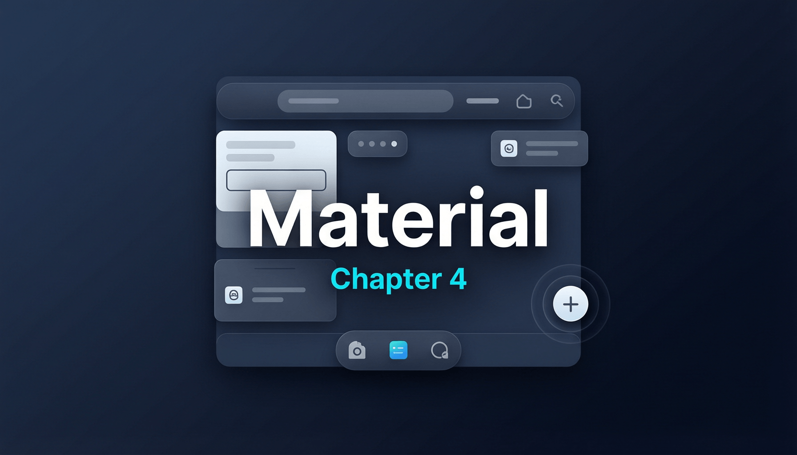

# 第四章：Material 组件



Material Design 是 Google 推出的设计语言体系，Flutter 对其提供了原生级别的支持。本章深入讲解 Material 组件库中最核心的 Widget，不仅告诉你"怎么用"，更要剖析"为什么这样设计"。

## 4.1 Scaffold — 页面骨架

### 简要说明

`Scaffold` 是 Material Design 页面的标准骨架，提供了 `appBar`、`body`、`floatingActionButton`、`drawer`、`bottomNavigationBar`、`bottomSheet`、`persistentFooterButtons` 等标准布局槽位。几乎所有 Material 页面都以 `Scaffold` 为根容器。

### 完整代码示例

```dart
import 'package:flutter/material.dart';

void main() => runApp(const ScaffoldDemoApp());

class ScaffoldDemoApp extends StatelessWidget {
  const ScaffoldDemoApp({super.key});

  @override
  Widget build(BuildContext context) {
    return MaterialApp(
      title: 'Scaffold Demo',
      theme: ThemeData(
        colorSchemeSeed: Colors.blue,
        useMaterial3: true,
      ),
      home: const ScaffoldDemoPage(),
    );
  }
}

class ScaffoldDemoPage extends StatefulWidget {
  const ScaffoldDemoPage({super.key});

  @override
  State<ScaffoldDemoPage> createState() => _ScaffoldDemoPageState();
}

class _ScaffoldDemoPageState extends State<ScaffoldDemoPage> {
  int _currentIndex = 0;
  final GlobalKey<ScaffoldState> _scaffoldKey = GlobalKey<ScaffoldState>();

  @override
  Widget build(BuildContext context) {
    return Scaffold(
      key: _scaffoldKey,
      appBar: AppBar(
        title: const Text('Scaffold 演示'),
        leading: IconButton(
          icon: const Icon(Icons.menu),
          onPressed: () => _scaffoldKey.currentState?.openDrawer(),
        ),
      ),
      body: Center(
        child: Text(
          '页面 ${_currentIndex + 1}',
          style: Theme.of(context).textTheme.headlineMedium,
        ),
      ),
      drawer: Drawer(
        child: ListView(
          children: [
            const DrawerHeader(child: Text('菜单')),
            ListTile(
              title: const Text('设置'),
              onTap: () => Navigator.pop(context),
            ),
          ],
        ),
      ),
      floatingActionButton: FloatingActionButton(
        onPressed: () {
          ScaffoldMessenger.of(context).showSnackBar(
            const SnackBar(content: Text('这是一个 SnackBar')),
          );
        },
        child: const Icon(Icons.add),
      ),
      floatingActionButtonLocation: FloatingActionButtonLocation.endFloat,
      bottomNavigationBar: BottomNavigationBar(
        currentIndex: _currentIndex,
        items: const [
          BottomNavigationBarItem(icon: Icon(Icons.home), label: '首页'),
          BottomNavigationBarItem(icon: Icon(Icons.search), label: '搜索'),
          BottomNavigationBarItem(icon: Icon(Icons.person), label: '我的'),
        ],
        onTap: (index) => setState(() => _currentIndex = index),
      ),
      persistentFooterButtons: [
        TextButton(onPressed: () {}, child: const Text('Footer 1')),
        TextButton(onPressed: () {}, child: const Text('Footer 2')),
      ],
      resizeToAvoidBottomInset: true,
    );
  }
}
```

### 原理解析

**Scaffold 的布局算法**：`Scaffold` 内部使用自定义的 `_ScaffoldLayout`（一个 `MultiChildLayoutDelegate`）来完成布局。它的核心逻辑是 **按 z-order 从底到顶依次放置各部件**：

1. **body** 最先布局，占据 Scaffold 的最大可用空间
2. **AppBar** 布局在顶部，body 的上边界会向下偏移以避开 AppBar
3. **BottomNavigationBar** 布局在底部，body 的下边界向上偏移
4. **FloatingActionButton** 根据 `floatingActionButtonLocation` 确定位置，它浮在 body 之上
5. **Drawer / EndDrawer** 使用独立的动画层叠在最上方
6. **SnackBar / MaterialBanner** 通过 `ScaffoldMessenger` 管理，在 BottomNavigationBar 上方滑入

**body 如何避开 AppBar 和 BottomNavBar**：`_ScaffoldLayout` 在布局 body 时，先确定 AppBar 的高度（通过 `PreferredSizeWidget.preferredSize`）和 BottomNavigationBar 的高度，然后用 `BoxConstraints` 约束 body 的可用空间：`bodyHeight = scaffoldHeight - appBarHeight - bottomNavBarHeight - persistentFooterHeight`。如果 `resizeToAvoidBottomInset` 为 true，键盘弹出时还会额外减去 `MediaQuery.viewInsets.bottom`。

**ScaffoldMessenger**：`ScaffoldMessenger` 是一个 `InheritedWidget`，它在 Widget 树中维护一个 SnackBar/MaterialBanner 队列。通过 `ScaffoldMessenger.of(context)` 向上查找最近的 `ScaffoldMessengerState`，然后调用 `showSnackBar()` 将 SnackBar 入队。`ScaffoldMessengerState` 内部使用 `_ScaffoldFeatureController` 来管理每个 SnackBar 的生命周期（显示、超时、关闭动画）。

**ScaffoldState** 暴露了多个方法：`openDrawer()`、`openEndDrawer()`、`showBottomSheet()` 等。通过 `GlobalKey<ScaffoldState>` 可以直接操作 Scaffold 而不依赖 context 查找。

**ScaffoldGeometry**：通过 `Scaffold.geometryOf(context)` 可以获取当前 Scaffold 的几何信息（如 FAB 的位置、BottomSheet 的高度），这是一个 `Listenable`，在布局变化时通知依赖者。`FloatingActionButton` 的 `NotchedShape` 就依赖此信息来计算 notch 位置。

---

## 4.2 AppBar / SliverAppBar

### 简要说明

`AppBar` 是 Material Design 页面顶部的工具栏，`SliverAppBar` 是其可滚动版本，支持随列表滚动展开/折叠效果。

### 完整代码示例

```dart
import 'package:flutter/material.dart';

void main() => runApp(const AppBarDemoApp());

class AppBarDemoApp extends StatelessWidget {
  const AppBarDemoApp({super.key});

  @override
  Widget build(BuildContext context) {
    return MaterialApp(
      title: 'AppBar Demo',
      theme: ThemeData(useMaterial3: true, colorSchemeSeed: Colors.teal),
      home: const SliverAppBarDemo(),
    );
  }
}

// 普通 AppBar 示例
class AppBarDemo extends StatelessWidget {
  const AppBarDemo({super.key});

  @override
  Widget build(BuildContext context) {
    return Scaffold(
      appBar: AppBar(
        leading: const Icon(Icons.arrow_back),
        automaticallyImplyLeading: true,
        title: const Text('AppBar 演示'),
        actions: [
          IconButton(icon: const Icon(Icons.search), onPressed: () {}),
          IconButton(icon: const Icon(Icons.more_vert), onPressed: () {}),
        ],
        bottom: const TabBar(
          tabs: [Tab(text: 'Tab 1'), Tab(text: 'Tab 2')],
        ),
        elevation: 4,
        toolbarHeight: 56,
        flexibleSpace: Container(
          decoration: const BoxDecoration(
            gradient: LinearGradient(
              colors: [Colors.teal, Colors.blue],
            ),
          ),
        ),
      ),
      body: const TabBarView(
        children: [
          Center(child: Text('Tab 1 内容')),
          Center(child: Text('Tab 2 内容')),
        ],
      ),
    );
  }
}

// SliverAppBar 示例
class SliverAppBarDemo extends StatelessWidget {
  const SliverAppBarDemo({super.key});

  @override
  Widget build(BuildContext context) {
    return Scaffold(
      body: CustomScrollView(
        slivers: [
          SliverAppBar(
            expandedHeight: 200,
            collapsedHeight: kToolbarHeight,
            pinned: true,
            floating: false,
            snap: false,
            stretch: true,
            flexibleSpace: FlexibleSpaceBar(
              title: const Text('SliverAppBar'),
              background: Image.network(
                'https://picsum.photos/400/200',
                fit: BoxFit.cover,
              ),
              titlePadding: const EdgeInsetsDirectional.only(start: 16, bottom: 16),
            ),
          ),
          SliverList(
            delegate: SliverChildBuilderDelegate(
              (context, index) => ListTile(
                leading: CircleAvatar(child: Text('${index + 1}')),
                title: Text('列表项 $index'),
              ),
              childCount: 30,
            ),
          ),
        ],
      ),
    );
  }
}
```

### 原理解析

**PreferredSizeWidget 协议**：`AppBar` 实现了 `PreferredSizeWidget` 接口，这个接口只有一个属性 `preferredSize`。`Scaffold` 在布局时通过此属性确定 AppBar 占据的高度。如果你自定义 AppBar，必须实现这个接口，否则 Scaffold 不知道如何为它分配空间。

**AppBar 内部结构**：`AppBar` 内部使用 `NavigationToolbar` 来排列 `leading`、`title`（middle）、`actions` 三个区域。`title` 默认居中（Material 3）或靠左（iOS 风格由 `centerTitle` 控制）。`automaticallyImplyLeading` 为 true 时，如果当前路由可以返回（`ModalRoute.canPop`），会自动添加返回按钮作为 `leading`。

**SliverAppBar 的滚动机制**：`SliverAppBar` 是 `SliverPersistentHeader` 的封装。它的核心逻辑在 `_SliverAppBarState` 内部的 `_SliverAppBarDelegate` 中：

- **pinned = true**：AppBar 在滚动到最小尺寸后固定在顶部
- **floating = true**：用户向上滚动（即使整体向下滚）时 AppBar 立即出现
- **snap = true**（需要 floating=true）：AppBar 要么完全展开要么完全折叠，不会停在中间
- **stretch = true**：在 overscroll 时 AppBar 可以拉伸超过 expandedHeight

尺寸变化的数学逻辑：`_SliverAppBarDelegate` 实现了 `SliverPersistentHeaderDelegate`，在 `build` 方法中根据 `shrinkOffset`（已经滚过的像素）和 `overlapsContent` 计算当前高度：`currentHeight = max(minExtent, maxExtent - shrinkOffset)`。其中 `minExtent` 通常是 `collapsedHeight`（默认 `kToolbarHeight` = 56），`maxExtent` 是 `expandedHeight`。

**FlexibleSpaceBar 的标题缩放**：`FlexibleSpaceBar` 内部通过 `FlexibleSpaceBarSettings`（一个 InheritedWidget）获取当前展开比例 `toolbarOpacity` 和 `titleOpacity`，据此对标题进行缩放和平移动画。展开时标题在左下角大字显示，折叠时缩小并移到 toolbar 的 title 位置。

---

## 4.3 BottomNavigationBar / BottomAppBar / NavigationBar (Material 3)

### 简要说明

底部导航栏有三种实现：传统的 `BottomNavigationBar`、支持 FAB notch 的 `BottomAppBar`、以及 Material 3 标准的 `NavigationBar`。

### 完整代码示例

```dart
import 'package:flutter/material.dart';

void main() => runApp(const BottomNavDemoApp());

class BottomNavDemoApp extends StatelessWidget {
  const BottomNavDemoApp({super.key});

  @override
  Widget build(BuildContext context) {
    return MaterialApp(
      title: 'Bottom Navigation Demo',
      theme: ThemeData(useMaterial3: true, colorSchemeSeed: Colors.indigo),
      home: const NavigationBarDemo(),
    );
  }
}

// BottomNavigationBar 示例
class BottomNavBarDemo extends StatefulWidget {
  const BottomNavBarDemo({super.key});

  @override
  State<BottomNavBarDemo> createState() => _BottomNavBarDemoState();
}

class _BottomNavBarDemoState extends State<BottomNavBarDemo> {
  int _index = 0;

  @override
  Widget build(BuildContext context) {
    return Scaffold(
      appBar: AppBar(title: const Text('BottomNavigationBar')),
      body: Center(child: Text('当前页: $_index')),
      bottomNavigationBar: BottomNavigationBar(
        type: BottomNavigationBarType.shifting, // fixed 或 shifting
        currentIndex: _index,
        onTap: (i) => setState(() => _index = i),
        items: const [
          BottomNavigationBarItem(
            icon: Icon(Icons.home),
            label: '首页',
            backgroundColor: Colors.indigo,
          ),
          BottomNavigationBarItem(
            icon: Icon(Icons.search),
            label: '搜索',
            backgroundColor: Colors.teal,
          ),
          BottomNavigationBarItem(
            icon: Icon(Icons.person),
            label: '我的',
            backgroundColor: Colors.orange,
          ),
        ],
      ),
    );
  }
}

// BottomAppBar + Notch 示例
class BottomAppBarDemo extends StatelessWidget {
  const BottomAppBarDemo({super.key});

  @override
  Widget build(BuildContext context) {
    return Scaffold(
      appBar: AppBar(title: const Text('BottomAppBar with Notch')),
      body: const Center(child: Text('带有 Notch 的 BottomAppBar')),
      floatingActionButton: FloatingActionButton(
        onPressed: () {},
        child: const Icon(Icons.add),
      ),
      floatingActionButtonLocation: FloatingActionButtonLocation.centerDocked,
      bottomNavigationBar: BottomAppBar(
        shape: const CircularNotchedRectangle(),
        notchMargin: 8.0,
        child: Row(
          mainAxisAlignment: MainAxisAlignment.spaceAround,
          children: [
            IconButton(icon: const Icon(Icons.home), onPressed: () {}),
            const SizedBox(width: 48), // 为 FAB 留空
            IconButton(icon: const Icon(Icons.search), onPressed: () {}),
          ],
        ),
      ),
    );
  }
}

// Material 3 NavigationBar 示例
class NavigationBarDemo extends StatefulWidget {
  const NavigationBarDemo({super.key});

  @override
  State<NavigationBarDemo> createState() => _NavigationBarDemoState();
}

class _NavigationBarDemoState extends State<NavigationBarDemo> {
  int _index = 0;

  @override
  Widget build(BuildContext context) {
    return Scaffold(
      appBar: AppBar(title: const Text('Material 3 NavigationBar')),
      body: Center(child: Text('当前页: $_index')),
      bottomNavigationBar: NavigationBar(
        selectedIndex: _index,
        labelBehavior: NavigationDestinationLabelBehavior.alwaysShow,
        onDestinationSelected: (i) => setState(() => _index = i),
        destinations: const [
          NavigationDestination(icon: Icon(Icons.home_outlined), selectedIcon: Icon(Icons.home), label: '首页'),
          NavigationDestination(icon: Icon(Icons.search), label: '搜索'),
          NavigationDestination(icon: Icon(Icons.person_outline), selectedIcon: Icon(Icons.person), label: '我的'),
        ],
      ),
    );
  }
}
```

### 原理解析

**BottomNavigationBar 的两种类型**：

- **fixed**：所有 item 均分底部宽度，始终显示 label
- **shifting**：选中的 item 占更多空间，未选中的 item 可能隐藏 label。切换时带有颜色渐变动画。shifting 模式下每个 item 的 `backgroundColor` 会作为整个底部栏的背景色

**NotchedShape 的几何计算**：`BottomAppBar` 的 `shape` 参数接受 `NotchedShape` 抽象类。`CircularNotchedRectangle` 实现了 `getOuterPath` 方法，其核心逻辑是：

```
// 简化版逻辑
Path getOuterPath(Rect host, Rect? guest) {
  // guest 就是 FAB 的矩形区域
  // 计算 FAB 与 BottomAppBar 的交点
  // 使用二次贝塞尔曲线绘制 notch 弧形
  final double notchRadius = guest.width / 2.0 + notchMargin;
  // 从左到右绘制 path，遇到 FAB 区域时向下凹进
}
```

`ScaffoldGeometry` 提供了 FAB 的位置信息，`BottomAppBar` 通过 `Scaffold.geometryOf(context)` 获取 FAB 的 `Rect`，传给 `NotchedShape` 进行路径计算。

**NavigationBar (Material 3)** 与 `BottomNavigationBar` 的关键区别：Material 3 版本使用 pill-shaped indicator 标记选中项，支持 `selectedIcon` 与 `icon` 切换，动画更加流畅。内部使用 `_IndicatorInkWell` 来绘制选中态的 indicator 背景。

---

## 4.4 Drawer / DrawerHeader / UserAccountsDrawerHeader

### 简要说明

`Drawer` 是从屏幕边缘滑出的侧边导航面板，配合 `Scaffold` 使用。

### 完整代码示例

```dart
import 'package:flutter/material.dart';

void main() => runApp(const DrawerDemoApp());

class DrawerDemoApp extends StatelessWidget {
  const DrawerDemoApp({super.key});

  @override
  Widget build(BuildContext context) {
    return MaterialApp(
      title: 'Drawer Demo',
      theme: ThemeData(useMaterial3: true),
      home: const DrawerDemoPage(),
    );
  }
}

class DrawerDemoPage extends StatelessWidget {
  const DrawerDemoPage({super.key});

  @override
  Widget build(BuildContext context) {
    return Scaffold(
      appBar: AppBar(title: const Text('Drawer 演示')),
      drawer: Drawer(
        child: ListView(
          padding: EdgeInsets.zero,
          children: [
            UserAccountsDrawerHeader(
              decoration: const BoxDecoration(
                gradient: LinearGradient(colors: [Colors.blue, Colors.purple]),
              ),
              accountName: const Text('张三'),
              accountEmail: const Text('zhangsan@example.com'),
              currentAccountPicture: const CircleAvatar(
                backgroundImage: NetworkImage('https://picsum.photos/80'),
              ),
              otherAccountsPictures: [
                CircleAvatar(
                  backgroundColor: Colors.grey,
                  child: const Text('李'),
                ),
              ],
              onDetailsPressed: () {},
            ),
            ListTile(
              leading: const Icon(Icons.home),
              title: const Text('首页'),
              onTap: () => Navigator.pop(context),
            ),
            ListTile(
              leading: const Icon(Icons.settings),
              title: const Text('设置'),
              onTap: () => Navigator.pop(context),
            ),
            const Divider(),
            ListTile(
              leading: const Icon(Icons.logout),
              title: const Text('退出登录'),
              onTap: () => Navigator.pop(context),
            ),
          ],
        ),
      ),
      endDrawer: Drawer(
        child: Center(
          child: ElevatedButton(
            onPressed: () => Navigator.pop(context),
            child: const Text('这是 endDrawer'),
          ),
        ),
      ),
      body: const Center(child: Text('从左侧或右侧滑出 Drawer')),
    );
  }
}
```

### 原理解析

**DrawerController 的作用**：`Scaffold` 并不直接管理 Drawer 的动画，而是将 Drawer 包裹在 `DrawerController` 中。`DrawerController` 是一个 `StatefulWidget`，内部持有 `AnimationController` 来控制 Drawer 的滑入/滑出动画。

**动画机制**：Drawer 使用一个从 0 到 1 的动画值。0 表示完全隐藏，1 表示完全展开。动画使用 `Curves.easeOut` 曲线。在过渡过程中：

1. Drawer 的宽度从 0 过渡到 `min(screenWidth - 56, 304)`（Material 规范的最大宽度）
2. scrim（半透明遮罩层）的 opacity 从 0 过渡到约 0.6
3. 拖拽手势支持：用户可以在屏幕边缘拖拽来手动控制 Drawer 的打开程度

**Drawer 的 z-order**：Drawer 渲染在 Scaffold 的最上层（高于 AppBar 和 FAB），这是通过 `_ScaffoldLayout` 中的 z-index 排序实现的。当 Drawer 打开时，点击 scrim 区域会调用 `Navigator.pop(context)` 来关闭 Drawer。

**DrawerHeader** 只是一个固定高度（160 + 8 padding）的容器，提供 Material Design 标准的 header 样式。`UserAccountsDrawerHeader` 在此基础上增加了账户信息的标准布局。

---

## 4.5 Card — 卡片容器

### 简要说明

`Card` 是 Material Design 中用于承载内容块的圆角矩形容器，提供阴影（elevation）和表面色调。

### 完整代码示例

```dart
import 'package:flutter/material.dart';

void main() => runApp(const CardDemoApp());

class CardDemoApp extends StatelessWidget {
  const CardDemoApp({super.key});

  @override
  Widget build(BuildContext context) {
    return MaterialApp(
      title: 'Card Demo',
      theme: ThemeData(useMaterial3: true, colorSchemeSeed: Colors.green),
      home: const CardDemoPage(),
    );
  }
}

class CardDemoPage extends StatelessWidget {
  const CardDemoPage({super.key});

  @override
  Widget build(BuildContext context) {
    return Scaffold(
      appBar: AppBar(title: const Text('Card 演示')),
      body: ListView(
        padding: const EdgeInsets.all(16),
        children: [
          // 基础 Card
          Card(
            elevation: 4,
            shadowColor: Colors.black26,
            surfaceTintColor: Colors.green,
            shape: RoundedRectangleBorder(
              borderRadius: BorderRadius.circular(12),
            ),
            clipBehavior: Clip.antiAlias,
            child: Column(
              crossAxisAlignment: CrossAxisAlignment.start,
              children: [
                Image.network(
                  'https://picsum.photos/400/200',
                  height: 200,
                  width: double.infinity,
                  fit: BoxFit.cover,
                ),
                const Padding(
                  padding: EdgeInsets.all(16),
                  child: Column(
                    crossAxisAlignment: CrossAxisAlignment.start,
                    children: [
                      Text('基础 Card', style: TextStyle(fontSize: 18, fontWeight: FontWeight.bold)),
                      SizedBox(height: 8),
                      Text('Card 提供 elevation 阴影和 surfaceTintColor 表面色调。'),
                    ],
                  ),
                ),
              ],
            ),
          ),
          const SizedBox(height: 16),
          // Elevated Card (Material 3)
          Card.filled(
            color: Theme.of(context).colorScheme.secondaryContainer,
            child: const Padding(
              padding: EdgeInsets.all(16),
              child: Column(
                crossAxisAlignment: CrossAxisAlignment.start,
                children: [
                  Text('Card.filled', style: TextStyle(fontSize: 18, fontWeight: FontWeight.bold)),
                  SizedBox(height: 8),
                  Text('填充色 Card，使用 secondaryContainer 色。'),
                ],
              ),
            ),
          ),
          const SizedBox(height: 16),
          Card.outlined(
            child: const Padding(
              padding: EdgeInsets.all(16),
              child: Column(
                crossAxisAlignment: CrossAxisAlignment.start,
                children: [
                  Text('Card.outlined', style: TextStyle(fontSize: 18, fontWeight: FontWeight.bold)),
                  SizedBox(height: 8),
                  Text('描边 Card，无阴影，使用 outline 色描边。'),
                ],
              ),
            ),
          ),
        ],
      ),
    );
  }
}
```

### 原理解析

**Card = Material + 默认样式**：`Card` 的实现极其简洁——它本质上是对 `Material` Widget 的一层封装：

```dart
// Flutter 源码简化版
class Card extends StatelessWidget {
  Widget build(BuildContext context) {
    final CardTheme cardTheme = CardTheme.of(context);
    return Material(
      type: MaterialType.card,
      color: color ?? cardTheme.color ?? theme.cardColor,
      elevation: elevation ?? cardTheme.elevation ?? 1.0,
      shadowColor: shadowColor ?? cardTheme.shadowColor,
      surfaceTintColor: surfaceTintColor ?? cardTheme.surfaceTintColor,
      shape: shape ?? cardTheme.shape ?? RoundedRectangleBorder(...),
      clipBehavior: clipBehavior ?? cardTheme.clipBehavior ?? Clip.none,
      child: Semantics(container: true, child: child),
    );
  }
}
```

**Material Widget 的 elevation 阴影实现**：`Material` Widget 根据 `type` 和 `elevation` 选择不同的底层渲染方式：

- **MaterialType.card / canvas / circle**：使用 `PhysicalModel`（或 `PhysicalShape`，如果 shape 不是简单的矩形/圆形）。`PhysicalModel` 是一个 `RenderObjectWidget`，对应的 `RenderPhysicalModel` 在绘制阶段使用 Skia 的 `drawShadow` 来渲染真实的物理阴影
- **elevation 动画**：当 elevation 变化时，`Material` 使用 `_MaterialInterior` 来实现阴影的平滑过渡动画（默认 200ms）

**surfaceTintColor**（Material 3 新增）：当 `surfaceTintColor` 不为 null 且 elevation > 0 时，Material 会在表面叠加一层半透明的 tint 颜色。elevation 越高，tint 的 opacity 越大。这是 Material 3 用颜色深度来表示层级高度的设计哲学。

---

## 4.6 ListTile / CheckboxListTile / RadioListTile / SwitchListTile

### 简要说明

`ListTile` 是列表项的标准布局组件，提供 `leading`、`title`、`subtitle`、`trailing` 四个槽位。三个变体 Widget 在此基础上集成了对应控件。

### 完整代码示例

```dart
import 'package:flutter/material.dart';

void main() => runApp(const ListTileDemoApp());

class ListTileDemoApp extends StatelessWidget {
  const ListTileDemoApp({super.key});

  @override
  Widget build(BuildContext context) {
    return MaterialApp(
      title: 'ListTile Demo',
      theme: ThemeData(useMaterial3: true),
      home: const ListTileDemoPage(),
    );
  }
}

class ListTileDemoPage extends StatefulWidget {
  const ListTileDemoPage({super.key});

  @override
  State<ListTileDemoPage> createState() => _ListTileDemoPageState();
}

class _ListTileDemoPageState extends State<ListTileDemoPage> {
  bool _checkboxValue = false;
  String _radioValue = 'A';
  bool _switchValue = false;

  @override
  Widget build(BuildContext context) {
    return Scaffold(
      appBar: AppBar(title: const Text('ListTile 系列')),
      body: ListView(
        children: [
          // 基础 ListTile
          ListTile(
            leading: const Icon(Icons.inbox),
            title: const Text('收件箱'),
            subtitle: const Text('3 封未读邮件'),
            trailing: const Text('12:30'),
            dense: false,
            enabled: true,
            selected: false,
            contentPadding: const EdgeInsets.symmetric(horizontal: 16),
            onTap: () {},
            onLongPress: () {},
          ),
          const Divider(),

          // CheckboxListTile
          CheckboxListTile(
            value: _checkboxValue,
            onChanged: (v) => setState(() => _checkboxValue = v ?? false),
            title: const Text('CheckboxListTile'),
            subtitle: const Text('可带复选框的列表项'),
            secondary: const Icon(Icons.check_box),
            controlAffinity: ListTileControlAffinity.trailing,
          ),

          // RadioListTile
          RadioListTile<String>(
            value: 'A',
            groupValue: _radioValue,
            onChanged: (v) => setState(() => _radioValue = v ?? 'A'),
            title: const Text('选项 A'),
            secondary: const Icon(Icons.looks_one),
          ),
          RadioListTile<String>(
            value: 'B',
            groupValue: _radioValue,
            onChanged: (v) => setState(() => _radioValue = v ?? 'A'),
            title: const Text('选项 B'),
            secondary: const Icon(Icons.looks_two),
          ),

          // SwitchListTile
          SwitchListTile(
            value: _switchValue,
            onChanged: (v) => setState(() => _switchValue = v),
            title: const Text('SwitchListTile'),
            subtitle: const Text('通知开关'),
            secondary: const Icon(Icons.notifications),
          ),
        ],
      ),
    );
  }
}
```

### 原理解析

**ListTile 的布局算法**：`ListTile` 内部使用 `_RenderListTile`（自定义 `RenderBox`）进行布局：

1. **leading / trailing**：固定宽度区域，默认 40px（Material 3 为 40px），如果内容超出则 clip
2. **title / subtitle**：中间弹性区域，占据剩余空间，垂直居中或顶部对齐
3. **最小高度**：单行 ListTile 最小高度 56px，双行（含 subtitle）最小 72px，三行最小 88px
4. **水平间距**：leading 和 title 之间固定 16px 间距

布局顺序是先确定 leading/trailing 的尺寸，再用剩余宽度布局 title 和 subtitle。

**ListTileTheme**：通过 `ListTileTheme` 可以统一配置所有后代 ListTile 的样式（dense、selectedColor、iconColor 等）。`ListTile` 在 build 时通过 `ListTileTheme.of(context)` 获取主题数据，未设置的参数会 fallback 到主题值。

**MergeSemantics**：`ListTile` 用 `MergeSemantics` 包裹整个组件。这使得辅助功能（如 TalkBack/VoiceOver）将整个 ListTile 读作一个语义单元，而不是分别朗读 leading、title、trailing。这对无障碍访问至关重要。

**CheckboxListTile / RadioListTile / SwitchListTile**：这三个变体 Widget 的实现方式是在 `ListTile` 的基础上，将对应控件（Checkbox/Radio/Switch）放在 `trailing`（或 `leading`，由 `controlAffinity` 决定）位置。它们都用 `MergeSemantics` 包裹，确保辅助功能将整行读作"一个带有复选框的选项"。

---

## 4.7 Button 系列

### 简要说明

Flutter Material 提供了五种主要按钮：`ElevatedButton`（高起按钮）、`TextButton`（文本按钮）、`OutlinedButton`（描边按钮）、`IconButton`（图标按钮）、`FloatingActionButton`（浮动操作按钮）。

### 完整代码示例

```dart
import 'package:flutter/material.dart';

void main() => runApp(const ButtonDemoApp());

class ButtonDemoApp extends StatelessWidget {
  const ButtonDemoApp({super.key});

  @override
  Widget build(BuildContext context) {
    return MaterialApp(
      title: 'Button Demo',
      theme: ThemeData(useMaterial3: true, colorSchemeSeed: Colors.purple),
      home: const ButtonDemoPage(),
    );
  }
}

class ButtonDemoPage extends StatelessWidget {
  const ButtonDemoPage({super.key});

  @override
  Widget build(BuildContext context) {
    return Scaffold(
      appBar: AppBar(title: const Text('Button 系列')),
      body: ListView(
        padding: const EdgeInsets.all(16),
        children: [
          // ElevatedButton
          ElevatedButton(
            onPressed: () {},
            style: ElevatedButton.styleFrom(
              foregroundColor: Colors.white,
              backgroundColor: Colors.purple,
              elevation: 8,
              shadowColor: Colors.purpleAccent,
              padding: const EdgeInsets.symmetric(horizontal: 32, vertical: 16),
              shape: RoundedRectangleBorder(
                borderRadius: BorderRadius.circular(12),
              ),
              textStyle: const TextStyle(fontSize: 16, fontWeight: FontWeight.bold),
            ),
            child: const Text('ElevatedButton'),
          ),
          const SizedBox(height: 12),

          // TextButton
          TextButton(
            onPressed: () {},
            style: TextButton.styleFrom(
              foregroundColor: Colors.purple,
              padding: const EdgeInsets.all(16),
            ),
            child: const Text('TextButton'),
          ),
          const SizedBox(height: 12),

          // OutlinedButton
          OutlinedButton(
            onPressed: () {},
            style: OutlinedButton.styleFrom(
              foregroundColor: Colors.purple,
              side: const BorderSide(color: Colors.purple, width: 2),
              shape: RoundedRectangleBorder(
                borderRadius: BorderRadius.circular(8),
              ),
            ),
            child: const Text('OutlinedButton'),
          ),
          const SizedBox(height: 12),

          // IconButton
          Row(
            mainAxisAlignment: MainAxisAlignment.center,
            children: [
              IconButton(
                onPressed: () {},
                icon: const Icon(Icons.favorite),
                color: Colors.red,
                iconSize: 32,
                splashRadius: 28,
                tooltip: '喜欢',
              ),
              const SizedBox(width: 16),
              IconButton.filled(
                onPressed: () {},
                icon: const Icon(Icons.add),
              ),
              const SizedBox(width: 16),
              IconButton.filledTonal(
                onPressed: () {},
                icon: const Icon(Icons.edit),
              ),
              const SizedBox(width: 6),
              IconButton.outlined(
                onPressed: () {},
                icon: const Icon(Icons.share),
              ),
            ],
          ),
          const SizedBox(height: 12),

          // ButtonStyle 统一配置示例
          Row(
            mainAxisAlignment: MainAxisAlignment.spaceEvenly,
            children: [
              ElevatedButton.icon(
                onPressed: () {},
                icon: const Icon(Icons.send),
                label: const Text('发送'),
              ),
              TextButton.icon(
                onPressed: () {},
                icon: const Icon(Icons.cancel),
                label: const Text('取消'),
              ),
            ],
          ),
          const SizedBox(height: 12),

          // 禁用状态
          ElevatedButton(
            onPressed: null, // null 表示禁用
            child: const Text('Disabled Button'),
          ),
        ],
      ),
      floatingActionButton: Column(
        mainAxisSize: MainAxisSize.min,
        children: [
          FloatingActionButton.small(
            heroTag: 'fab1',
            onPressed: () {},
            child: const Icon(Icons.add),
          ),
          const SizedBox(height: 8),
          FloatingActionButton(
            heroTag: 'fab2',
            onPressed: () {},
            child: const Icon(Icons.edit),
          ),
          const SizedBox(height: 8),
          FloatingActionButton.extended(
            heroTag: 'fab3',
            onPressed: () {},
            icon: const Icon(Icons.navigation),
            label: const Text('导航'),
          ),
          const SizedBox(height: 8),
          FloatingActionButton.large(
            heroTag: 'fab4',
            onPressed: () {},
            child: const Icon(Icons.camera_alt),
          ),
        ],
      ),
    );
  }
}
```

### 原理解析

**ButtonStyleButton — 统一基类**：`ElevatedButton`、`TextButton`、`OutlinedButton` 都继承自 `ButtonStyleButton`。这个抽象基类封装了按钮的核心行为：

1. **状态计算**：根据 `onPressed` 是否为 null 判断 enabled/disabled，内部通过 `MaterialStateController` 追踪 hovered、focused、pressed 状态
2. **样式合并**：`ButtonStyleButton` 将 Widget 传入的 `style`、`ThemeData` 中的全局样式、和按钮类型的默认样式三者合并（Widget > Theme > Default）
3. **渲染**：底层使用 `Material` Widget 来渲染背景、阴影和 ink splash

**MaterialStateProperty（现 WidgetStateProperty）**：这是按钮样式系统的精髓。它允许你为不同状态指定不同的值：

```dart
ButtonStyle(
  backgroundColor: WidgetStateProperty.resolveWith((states) {
    if (states.contains(WidgetState.pressed)) return Colors.blue;
    if (states.contains(WidgetState.hovered)) return Colors.blue.withOpacity(0.8);
    if (states.contains(WidgetState.disabled)) return Colors.grey;
    return Colors.blue;
  }),
)
```

`styleFrom` 是一个便捷方法，它将简单参数（如 `backgroundColor`、`foregroundColor`）自动转换为 `WidgetStateProperty`。

**InkWell 的 splash 效果**：按钮的涟漪效果由 `InkWell` 实现。`InkWell` 在 `Material` 的表面上绘制 ink splash 动画。这就是为什么按钮需要 `Material` 作为祖先——splash 是画在最近的 `Material` 表面上的。如果按钮背景被不透明 Widget 遮挡，splash 可能不可见。

**FloatingActionButton** 独立于 `ButtonStyleButton` 体系。它使用 `RawMaterialButton` 或直接构建 `Material` + `InkWell`，因为 FAB 需要特殊的尺寸和动画行为（如 extended 形态的展开/折叠）。

---

## 4.8 TextField / TextFormField

### 简要说明

`TextField` 是文本输入组件，`TextFormField` 是其在 `Form` 表单中的封装版本，额外支持验证器（validator）。

### 完整代码示例

```dart
import 'package:flutter/material.dart';
import 'package:flutter/services.dart';

void main() => runApp(const TextFieldDemoApp());

class TextFieldDemoApp extends StatelessWidget {
  const TextFieldDemoApp({super.key});

  @override
  Widget build(BuildContext context) {
    return MaterialApp(
      title: 'TextField Demo',
      theme: ThemeData(useMaterial3: true, colorSchemeSeed: Colors.deepPurple),
      home: const TextFieldDemoPage(),
    );
  }
}

class TextFieldDemoPage extends StatefulWidget {
  const TextFieldDemoPage({super.key});

  @override
  State<TextFieldDemoPage> createState() => _TextFieldDemoPageState();
}

class _TextFieldDemoPageState extends State<TextFieldDemoPage> {
  final _formKey = GlobalKey<FormState>();
  final _nameController = TextEditingController();
  final _passwordController = TextEditingController();
  final _emailFocusNode = FocusNode();
  bool _obscurePassword = true;

  @override
  void dispose() {
    _nameController.dispose();
    _passwordController.dispose();
    _emailFocusNode.dispose();
    super.dispose();
  }

  @override
  Widget build(BuildContext context) {
    return Scaffold(
      appBar: AppBar(title: const Text('TextField 演示')),
      body: Form(
        key: _formKey,
        autovalidateMode: AutovalidateMode.onUserInteraction,
        child: ListView(
          padding: const EdgeInsets.all(16),
          children: [
            // 基础 TextField
            TextField(
              controller: _nameController,
              decoration: const InputDecoration(
                labelText: '用户名',
                hintText: '请输入用户名',
                prefixIcon: Icon(Icons.person),
                border: OutlineInputBorder(),
                filled: true,
              ),
              textInputAction: TextInputAction.next,
              onSubmitted: (_) => _emailFocusNode.requestFocus(),
            ),
            const SizedBox(height: 16),

            // 密码输入
            TextField(
              controller: _passwordController,
              obscureText: _obscurePassword,
              decoration: InputDecoration(
                labelText: '密码',
                prefixIcon: const Icon(Icons.lock),
                border: const OutlineInputBorder(),
                suffixIcon: IconButton(
                  icon: Icon(
                    _obscurePassword ? Icons.visibility_off : Icons.visibility,
                  ),
                  onPressed: () => setState(() => _obscurePassword = !_obscurePassword),
                ),
              ),
              maxLength: 20,
            ),
            const SizedBox(height: 16),

            // TextFormField + 验证
            TextFormField(
              focusNode: _emailFocusNode,
              decoration: const InputDecoration(
                labelText: '邮箱',
                hintText: 'example@email.com',
                prefixIcon: Icon(Icons.email),
                border: OutlineInputBorder(),
                helperText: '我们不会分享你的邮箱',
              ),
              keyboardType: TextInputType.emailAddress,
              validator: (value) {
                if (value == null || value.isEmpty) return '邮箱不能为空';
                if (!value.contains('@')) return '请输入有效的邮箱地址';
                return null;
              },
              inputFormatters: [
                FilteringTextInputFormatter.deny(RegExp(r'\s')),
              ],
            ),
            const SizedBox(height: 16),

            // 数字输入
            TextFormField(
              decoration: const InputDecoration(
                labelText: '年龄',
                border: OutlineInputBorder(),
              ),
              keyboardType: TextInputType.number,
              inputFormatters: [
                FilteringTextInputFormatter.digitsOnly,
                LengthLimitingTextInputFormatter(3),
              ],
              validator: (value) {
                if (value != null && value.isNotEmpty) {
                  final age = int.tryParse(value);
                  if (age != null && (age < 0 || age > 150)) return '年龄不合法';
                }
                return null;
              },
            ),
            const SizedBox(height: 24),

            // 多行文本
            TextField(
              maxLines: 4,
              minLines: 2,
              maxLength: 200,
              decoration: const InputDecoration(
                labelText: '自我介绍',
                alignLabelWithHint: true,
                border: OutlineInputBorder(),
              ),
            ),
            const SizedBox(height: 24),

            Row(
              mainAxisAlignment: MainAxisAlignment.spaceEvenly,
              children: [
                ElevatedButton(
                  onPressed: () {
                    if (_formKey.currentState!.validate()) {
                      ScaffoldMessenger.of(context).showSnackBar(
                        const SnackBar(content: Text('表单验证通过！')),
                      );
                    }
                  },
                  child: const Text('提交'),
                ),
                TextButton(
                  onPressed: () => _formKey.currentState?.reset(),
                  child: const Text('重置'),
                ),
              ],
            ),
          ],
        ),
      ),
    );
  }
}
```

### 原理解析

**EditableText — 核心 Widget**：`TextField` 的核心是 `EditableText`，这是一个非常复杂的 `StatefulWidget`（源码超过 3000 行），负责：

1. **文本渲染**：使用 `RenderEditable`（一个 RenderBox），处理文本的绘制、选择高亮、光标显示
2. **文本编辑**：维护 `TextEditingValue`（包含 text、selection、composing），处理所有输入事件
3. **输入法交互**：通过 `TextInput` 通道与平台输入法通信

**TextInput 通道协议**：Flutter 使用 Platform Channel 与原生输入法交互。核心流程：

1. `EditableText` 调用 `TextInput.attach()` 建立连接，返回 `TextInputConnection`
2. 用户输入时，原生端通过 `TextInputClient.updateEditingState()` 回传新的 `TextEditingValue`
3. Flutter 端收到后更新 `TextEditingController.value`，触发 rebuild
4. `composing` 区间表示输入法正在组合的文本（如中文拼音输入中的候选文字）

**InputDecoration 的结构**：`InputDecoration` 定义了一个复杂的装饰布局：

```
[icon] [prefix] [label/hint] [suffix] [error/helper]
       └────── border 区域 ──────┘
```

`InputDecorator`（`TextField` 的外层装饰器）使用 `_RenderDecoration`（自定义 RenderBox）布局这些元素。`OutlineInputBorder` 和 `UnderlineInputBorder` 的区别在于绘制方式：前者在四周绘制边框并在 label 处切出缺口，后者只在底部绘制下划线。

**FocusNode 管理焦点**：每个 `TextField` 内部都有一个 `FocusNode`（可以外部传入）。`FocusNode` 构成一棵焦点树，与 Widget 树平行。通过 `focusNode.requestFocus()` 可以程序化地移动焦点。`textInputAction: TextInputAction.next` 配合 `onSubmitted` 可以实现"下一步"跳转。

**Form + TextFormField 的验证机制**：`Form` 是一个 `StatefulWidget`，其 `FormState` 维护一个 `_fields` 集合。每个 `FormField`（`TextFormField` 继承自它）在 `initState` 时向最近的 `Form` 注册自己。调用 `FormState.validate()` 时，遍历所有注册的 `FormField`，调用各自的 `validator`。如果任何一个返回非 null 字符串，验证失败并显示错误信息。

---

## 4.9 Checkbox / Radio / Switch / Slider

### 简要说明

这四个是 Material Design 中的选择/切换控件，都是**受控组件**（Controlled Component），状态由父 Widget 管理。

### 完整代码示例

```dart
import 'package:flutter/material.dart';

void main() => runApp(const ControlsDemoApp());

class ControlsDemoApp extends StatelessWidget {
  const ControlsDemoApp({super.key});

  @override
  Widget build(BuildContext context) {
    return MaterialApp(
      title: 'Controls Demo',
      theme: ThemeData(useMaterial3: true, colorSchemeSeed: Colors.amber),
      home: const ControlsDemoPage(),
    );
  }
}

class ControlsDemoPage extends StatefulWidget {
  const ControlsDemoPage({super.key});

  @override
  State<ControlsDemoPage> createState() => _ControlsDemoPageState();
}

class _ControlsDemoPageState extends State<ControlsDemoPage> {
  bool _checked = false;
  bool? _triState = false; // tri-state checkbox
  String _radioValue = 'Flutter';
  bool _switchValue = true;
  double _sliderValue = 0.5;

  @override
  Widget build(BuildContext context) {
    return Scaffold(
      appBar: AppBar(title: const Text('选择/切换控件')),
      body: ListView(
        padding: const EdgeInsets.all(16),
        children: [
          // Checkbox
          Row(
            children: [
              Checkbox(
                value: _checked,
                onChanged: (v) => setState(() => _checked = v ?? false),
                activeColor: Colors.amber,
              ),
              const Text('两态 Checkbox'),
            ],
          ),
          Row(
            children: [
              Checkbox(
                value: _triState,
                tristate: true,
                onChanged: (v) => setState(() => _triState = v),
              ),
              const Text('三态 Checkbox (null/false/true)'),
            ],
          ),
          const Divider(),

          // Radio
          const Text('Radio Group:', style: TextStyle(fontWeight: FontWeight.bold)),
          for (final option in ['Flutter', 'React Native', 'SwiftUI'])
            Row(
              children: [
                Radio<String>(
                  value: option,
                  groupValue: _radioValue,
                  onChanged: (v) => setState(() => _radioValue = v ?? 'Flutter'),
                ),
                Text(option),
              ],
            ),
          const Divider(),

          // Switch
          Row(
            children: [
              Switch(
                value: _switchValue,
                onChanged: (v) => setState(() => _switchValue = v),
                activeTrackColor: Colors.amber.shade200,
                thumbIcon: WidgetStateProperty.resolveWith((states) {
                  return states.contains(WidgetState.selected)
                      ? const Icon(Icons.check, size: 18)
                      : const Icon(Icons.close, size: 18);
                }),
              ),
              const SizedBox(width: 12),
              Text(_switchValue ? '已开启' : '已关闭'),
            ],
          ),
          const Divider(),

          // Slider
          const Text('连续 Slider:'),
          Slider(
            value: _sliderValue,
            min: 0,
            max: 1,
            onChanged: (v) => setState(() => _sliderValue = v),
            onChangeStart: (v) => debugPrint('开始: $v'),
            onChangeEnd: (v) => debugPrint('结束: $v'),
          ),
          Text('当前值: ${_sliderValue.toStringAsFixed(2)}'),

          const SizedBox(height: 16),
          const Text('离散 Slider (5 个刻度):'),
          Slider(
            value: (_sliderValue * 5).roundToDouble() / 5,
            min: 0,
            max: 1,
            divisions: 5,
            label: '${((_sliderValue * 5).roundToDouble() / 5 * 100).toInt()}%',
            onChanged: (v) => setState(() => _sliderValue = v),
          ),
        ],
      ),
    );
  }
}
```

### 原理解析

**受控组件模式**：这四个 Widget 都是受控组件——它们不持有自己的状态，而是通过 `value` + `onChanged` 与父 Widget 通信。这是 Flutter 的设计哲学：**状态提升（Lifting State Up）**。父 Widget 持有状态，子 Widget 仅反映状态并通知变化。

这个模式的优点：

1. **单一数据源**：状态只存在于一处，避免同步问题
2. **可预测性**：每次 rebuild 的结果完全由 props 决定
3. **可测试性**：无需与 Widget 内部状态交互

**Radio 的 groupValue 机制**：`Radio` 的选中判断逻辑是 `value == groupValue`。这意味着一组 Radio 共享同一个 `groupValue` 状态变量。当某个 Radio 的 `onChanged` 被触发时，父 Widget 更新 `groupValue` 为该 Radio 的 `value`，所有 Radio 重新 build，只有匹配的变为选中状态。

**MaterialStateProperty 在样式定制中的作用**：以 `Switch.thumbIcon` 为例，它接受一个 `WidgetStateProperty<Icon?>`。在渲染时，Switch 收集当前的状态集合（pressed/hovered/selected/disabled），然后通过 `resolve(states)` 获取对应的值。这使得一个属性可以表达多种状态下的不同表现，而不需要为每种状态创建独立的 Widget。

**Slider 的内部实现**：`Slider` 内部使用 `_RenderSlider`（自定义 RenderBox），它处理：

1. **轨道绘制**：active track（选中部分）和 inactive track（未选部分）
2. **滑块（thumb）**：圆形，带可选的 value indicator（tooltip 样式的 label）
3. **手势处理**：水平拖拽更新 value，支持 divisions 时的离散吸附
4. **divisions 吸附**：当 `divisions` 不为 null 时，value 会被 snap 到最近的刻度：`snappedValue = (value * divisions).round() / divisions`

---

## 4.10 PopupMenuButton / DropdownButton / MenuAnchor

### 简要说明

弹出式菜单的三种实现：`PopupMenuButton`（经典弹出菜单）、`DropdownButton`（下拉选择）、`MenuAnchor`（Material 3 级联菜单）。

### 完整代码示例

```dart
import 'package:flutter/material.dart';

void main() => runApp(const MenuDemoApp());

class MenuDemoApp extends StatelessWidget {
  const MenuDemoApp({super.key});

  @override
  Widget build(BuildContext context) {
    return MaterialApp(
      title: 'Menu Demo',
      theme: ThemeData(useMaterial3: true, colorSchemeSeed: Colors.orange),
      home: const MenuDemoPage(),
    );
  }
}

class MenuDemoPage extends StatefulWidget {
  const MenuDemoPage({super.key});

  @override
  State<MenuDemoPage> createState() => _MenuDemoPageState();
}

class _MenuDemoPageState extends State<MenuDemoPage> {
  String _selectedFruit = 'Apple';
  String _lastPopupSelection = '';

  @override
  Widget build(BuildContext context) {
    return Scaffold(
      appBar: AppBar(
        title: const Text('菜单演示'),
        actions: [
          // PopupMenuButton
          PopupMenuButton<String>(
            initialValue: 'Copy',
            onSelected: (value) {
              setState(() => _lastPopupSelection = value);
            },
            offset: const Offset(0, 48),
            itemBuilder: (context) => [
              const PopupMenuItem(value: 'Copy', child: ListTile(
                leading: Icon(Icons.copy), title: Text('复制'), dense: true,
              )),
              const PopupMenuItem(value: 'Cut', child: ListTile(
                leading: Icon(Icons.content_cut), title: Text('剪切'), dense: true,
              )),
              const PopupMenuItem(value: 'Paste', child: ListTile(
                leading: Icon(Icons.paste), title: Text('粘贴'), dense: true,
              )),
              const PopupMenuDivider(),
              const PopupMenuItem(value: 'SelectAll', child: ListTile(
                leading: Icon(Icons.select_all), title: Text('全选'), dense: true,
              )),
            ],
          ),
        ],
      ),
      body: ListView(
        padding: const EdgeInsets.all(16),
        children: [
          if (_lastPopupSelection.isNotEmpty)
            Card(
              child: Padding(
                padding: const EdgeInsets.all(16),
                child: Text('PopupMenu 选中: $_lastPopupSelection'),
              ),
            ),
          const SizedBox(height: 16),

          // DropdownButton
          const Text('DropdownButton:', style: TextStyle(fontWeight: FontWeight.bold)),
          const SizedBox(height: 8),
          DropdownButton<String>(
            value: _selectedFruit,
            hint: const Text('选择水果'),
            isExpanded: true,
            dropdownColor: Colors.orange.shade50,
            menuMaxHeight: 300,
            items: ['Apple', 'Banana', 'Cherry', 'Durian', 'Elderberry'].map((fruit) {
              return DropdownMenuItem(
                value: fruit,
                child: Text(fruit),
              );
            }).toList(),
            onChanged: (value) => setState(() => _selectedFruit = value!),
          ),
          const SizedBox(height: 24),

          // MenuAnchor (Material 3)
          const Text('MenuAnchor (Material 3):', style: TextStyle(fontWeight: FontWeight.bold)),
          const SizedBox(height: 8),
          MenuAnchor(
            menuChildren: [
              MenuItemButton(
                leadingIcon: const Icon(Icons.file_open),
                child: const Text('打开文件'),
                onPressed: () {},
              ),
              MenuItemButton(
                leadingIcon: const Icon(Icons.save),
                child: const Text('保存'),
                onPressed: () {},
              ),
              const Divider(),
              SubmenuButton(
                leadingIcon: const Icon(Icons.share),
                menuChildren: [
                  MenuItemButton(child: const Text('微信'), onPressed: () {}),
                  MenuItemButton(child: const Text('QQ'), onPressed: () {}),
                  MenuItemButton(child: const Text('邮件'), onPressed: () {}),
                ],
                child: const Text('分享到'),
              ),
            ],
            builder: (context, controller, child) {
              return FilledButton.icon(
                onPressed: () {
                  if (controller.isOpen) {
                    controller.close();
                  } else {
                    controller.open();
                  }
                },
                icon: const Icon(Icons.menu),
                label: const Text('打开级联菜单'),
              );
            },
          ),
        ],
      ),
    );
  }
}
```

### 原理解析

**PopupMenuButton 的弹出机制**：当点击 `PopupMenuButton` 时，它调用 `showMenu()`，这个函数内部通过 `Navigator.push` 一个 `_PopupMenuRoute`。`_PopupMenuRoute` 是一个 `PopupRoute`，它的特点：

1. **不覆盖整个屏幕**：`_PopupMenuRoute` 的 `barrierColor` 是半透明的，`opaque` 为 false
2. **精确定位**：菜单的位置通过 `PopupMenuButton` 的 `RenderBox.localToGlobal()` 获取按钮位置，然后计算菜单应出现的位置
3. **渲染在 Overlay 中**：`PopupRoute` 使用 `Navigator` 的 `Overlay` 来渲染，所以菜单浮在所有页面之上
4. **点击外部关闭**：`barrierDismissible` 为 true，点击半透明遮罩会 pop 这个 route

**DropdownButton 的区别**：`DropdownButton` 也使用类似的 `_DropdownRoute`，但有几个关键不同：

1. 下拉菜单的宽度默认与 DropdownButton 一致
2. 下拉菜单会尝试在按钮下方展开，如果空间不足则在上方展开
3. 选中项会自动滚动到与 DropdownButton 对齐的位置

**MenuAnchor (Material 3)**：与前两者不同，`MenuAnchor` 不使用 Navigator/Route 机制。它使用 `OverlayPortal`（Flutter 3.10+）来渲染菜单。这带来几个优势：

1. **级联支持**：子菜单（`SubmenuButton`）也是 `MenuAnchor`，可以嵌套形成级联菜单
2. **更灵活**：不依赖 Navigator，不会出现在路由栈中
3. **键盘导航**：内置方向键导航和快捷键支持

---

## 4.11 Chip 系列

### 简要说明

Chip 是紧凑的信息展示组件，有五种变体：`Chip`（基础）、`InputChip`（输入标签）、`ChoiceChip`（单选标签）、`FilterChip`（过滤标签）、`ActionChip`（动作标签）。

### 完整代码示例

```dart
import 'package:flutter/material.dart';

void main() => runApp(const ChipDemoApp());

class ChipDemoApp extends StatelessWidget {
  const ChipDemoApp({super.key});

  @override
  Widget build(BuildContext context) {
    return MaterialApp(
      title: 'Chip Demo',
      theme: ThemeData(useMaterial3: true, colorSchemeSeed: Colors.cyan),
      home: const ChipDemoPage(),
    );
  }
}

class ChipDemoPage extends StatefulWidget {
  const ChipDemoPage({super.key});

  @override
  State<ChipDemoPage> createState() => _ChipDemoPageState();
}

class _ChipDemoPageState extends State<ChipDemoPage> {
  final List<String> _tags = ['Flutter', 'Dart', 'Firebase', 'Go', 'Rust'];
  int _selectedChoice = 0;
  final Set<String> _filters = {'Flutter'};

  @override
  Widget build(BuildContext context) {
    return Scaffold(
      appBar: AppBar(title: const Text('Chip 系列')),
      body: ListView(
        padding: const EdgeInsets.all(16),
        children: [
          // 基础 Chip
          const Text('基础 Chip:', style: TextStyle(fontWeight: FontWeight.bold)),
          Wrap(
            spacing: 8,
            runSpacing: 4,
            children: [
              const Chip(label: Text('基础标签')),
              Chip(
                avatar: const CircleAvatar(child: Text('A')),
                label: const Text('带头像'),
              ),
              Chip(
                label: const Text('可删除'),
                deleteIcon: const Icon(Icons.close),
                onDeleted: () {},
              ),
              Chip(
                label: const Text('自定义颜色'),
                backgroundColor: Colors.cyan.shade100,
                side: const BorderSide(color: Colors.cyan),
              ),
            ],
          ),
          const SizedBox(height: 24),

          // InputChip — 可输入的标签
          const Text('InputChip:', style: TextStyle(fontWeight: FontWeight.bold)),
          Wrap(
            spacing: 8,
            runSpacing: 4,
            children: _tags.map((tag) => InputChip(
              label: Text(tag),
              selected: _filters.contains(tag),
              onSelected: (selected) {
                setState(() {
                  selected ? _filters.add(tag) : _filters.remove(tag);
                });
              },
              onDeleted: () => setState(() => _tags.remove(tag)),
            )).toList(),
          ),
          const SizedBox(height: 24),

          // ChoiceChip — 单选
          const Text('ChoiceChip:', style: TextStyle(fontWeight: FontWeight.bold)),
          Wrap(
            spacing: 8,
            children: ['小', '中', '大', '特大'].asMap().entries.map((entry) {
              return ChoiceChip(
                label: Text(entry.value),
                selected: _selectedChoice == entry.key,
                onSelected: (selected) {
                  if (selected) setState(() => _selectedChoice = entry.key);
                },
              );
            }).toList(),
          ),
          const SizedBox(height: 24),

          // FilterChip — 多选过滤
          const Text('FilterChip:', style: TextStyle(fontWeight: FontWeight.bold)),
          Wrap(
            spacing: 8,
            children: ['iOS', 'Android', 'Web', 'Desktop'].map((platform) {
              return FilterChip(
                label: Text(platform),
                selected: _filters.contains(platform),
                onSelected: (selected) {
                  setState(() {
                    selected ? _filters.add(platform) : _filters.remove(platform);
                  });
                },
              );
            }).toList(),
          ),
          const SizedBox(height: 24),

          // ActionChip
          const Text('ActionChip:', style: TextStyle(fontWeight: FontWeight.bold)),
          Wrap(
            spacing: 8,
            children: [
              ActionChip(
                avatar: const Icon(Icons.alarm),
                label: const Text('设置闹钟'),
                onPressed: () {},
              ),
              ActionChip(
                avatar: const Icon(Icons.directions),
                label: const Text('导航'),
                onPressed: () {},
              ),
            ],
          ),
        ],
      ),
    );
  }
}
```

### 原理解析

**RawChip — 统一基类**：所有 Chip 变体最终都委托给 `RawChip`。`RawChip` 是一个功能完整的 Chip 实现，支持所有交互（select、delete、press）和视觉属性。各变体的区别仅在于**默认参数**：

- `Chip`：不可选，可删除
- `InputChip`：可选，可删除，用于表示用户输入的标签
- `ChoiceChip`：可选，不可删除，用于单选场景（默认使用 `selectedColor`）
- `FilterChip`：可选，不可删除，用于多选过滤（默认带 check icon）
- `ActionChip`：不可选，不可删除，类似按钮（默认使用 `backgroundColor`）

**ChipTheme**：`ChipTheme` 是 `InheritedWidget`，为所有后代 Chip 提供统一样式。`RawChip` 在 build 时合并 `ChipTheme.of(context)` 与自身参数。

**Chip 的布局**：`RawChip` 内部使用 `_RenderChip`（自定义 RenderBox）。布局逻辑是水平排列 `avatar`（可选）+ `label` + `deleteIcon`（可选），外层是带圆角的背景（使用 `ShapeDecoration`），整体高度固定为 32px（Material 3）。

---

## 4.12 Divider / VerticalDivider / ListTile.divideTiles

### 简要说明

分割线组件，用于在视觉上分隔内容区域。

### 完整代码示例

```dart
import 'package:flutter/material.dart';

void main() => runApp(const DividerDemoApp());

class DividerDemoApp extends StatelessWidget {
  const DividerDemoApp({super.key});

  @override
  Widget build(BuildContext context) {
    return MaterialApp(
      title: 'Divider Demo',
      theme: ThemeData(useMaterial3: true),
      home: const DividerDemoPage(),
    );
  }
}

class DividerDemoPage extends StatelessWidget {
  const DividerDemoPage({super.key});

  @override
  Widget build(BuildContext context) {
    return Scaffold(
      appBar: AppBar(title: const Text('Divider 演示')),
      body: Column(
        children: [
          Expanded(
            child: ListView(
              children: [
                const ListTile(title: Text('列表项 1')),
                const Divider(height: 1, thickness: 1, indent: 16, endIndent: 16),
                const ListTile(title: Text('列表项 2')),
                const Divider(height: 1, thickness: 1, indent: 16, endIndent: 16),
                const ListTile(title: Text('列表项 3')),
                const SizedBox(height: 16),

                // 自定义 Divider
                const Padding(
                  padding: EdgeInsets.symmetric(horizontal: 16),
                  child: Divider(
                    height: 32,
                    thickness: 2,
                    color: Colors.blue,
                  ),
                ),

                // ListTile.divideTiles 用法
                ...ListTile.divideTiles(
                  context: context,
                  tiles: [
                    const ListTile(title: Text('divideTiles 1')),
                    const ListTile(title: Text('divideTiles 2')),
                    const ListTile(title: Text('divideTiles 3')),
                  ],
                ),
              ],
            ),
          ),

          // VerticalDivider 示例
          SizedBox(
            height: 60,
            child: Row(
              mainAxisAlignment: MainAxisAlignment.center,
              children: [
                const Text('左侧内容'),
                const VerticalDivider(
                  width: 20,
                  thickness: 2,
                  indent: 10,
                  endIndent: 10,
                  color: Colors.grey,
                ),
                const Text('右侧内容'),
              ],
            ),
          ),
        ],
      ),
    );
  }
}
```

### 原理解析

**Divider 的实现**：`Divider` 的实现非常直接——它使用 `Container` + `BoxDecoration` 绘制一条水平线：

```dart
// 简化版源码
Widget build(BuildContext context) {
  return SizedBox(
    height: height, // 总高度（含上下间距）
    child: Center(
      child: Container(
        height: thickness,
        decoration: BoxDecoration(
          border: Border(
            bottom: BorderSide(color: color, width: thickness),
          ),
        ),
      ),
    ),
  );
}
```

注意 `height` 和 `thickness` 的区别：`height` 是 Divider 占据的总高度（包括透明间距），`thickness` 是线条本身的粗细。`indent` 和 `endIndent` 控制左右缩进。

**VerticalDivider** 是 `Divider` 的垂直版本，使用 `Border` 的 `left` 边来绘制垂直线。

**ListTile.divideTiles**：这是一个静态工具方法，它遍历给定的 Widget 列表，在相邻元素之间插入 Divider。实现方式是在每两个 ListTile 之间插入一个 `Divider`，并调整 ListTile 的 bottom padding 以容纳分割线。

---

## 4.13 DataTable / PaginatedDataTable

### 简要说明

`DataTable` 提供 Material Design 标准的数据表格，`PaginatedDataTable` 在此基础上增加分页功能。

### 完整代码示例

```dart
import 'package:flutter/material.dart';

void main() => runApp(const DataTableDemoApp());

class DataTableDemoApp extends StatelessWidget {
  const DataTableDemoApp({super.key});

  @override
  Widget build(BuildContext context) {
    return MaterialApp(
      title: 'DataTable Demo',
      theme: ThemeData(useMaterial3: true, colorSchemeSeed: Colors.blueGrey),
      home: const DataTableDemoPage(),
    );
  }
}

class _UserData {
  final String name;
  final int age;
  final String role;
  bool selected;

  _UserData(this.name, this.age, this.role, {this.selected = false});
}

class DataTableDemoPage extends StatefulWidget {
  const DataTableDemoPage({super.key});

  @override
  State<DataTableDemoPage> createState() => _DataTableDemoPageState();
}

class _DataTableDemoPageState extends State<DataTableDemoPage> {
  int? _sortColumnIndex;
  bool _sortAscending = true;

  final List<_UserData> _users = [
    _UserData('张三', 28, '开发者'),
    _UserData('李四', 35, '设计师'),
    _UserData('王五', 22, '实习生'),
    _UserData('赵六', 40, '产品经理'),
    _UserData('孙七', 30, '测试'),
  ];

  void _sort<T>(Comparable<T> Function(_UserData u) getField, int columnIndex, bool ascending) {
    _users.sort((a, b) {
      final aValue = getField(a);
      final bValue = getField(b);
      return ascending ? Comparable.compare(aValue, bValue) : Comparable.compare(bValue, aValue);
    });
    setState(() {
      _sortColumnIndex = columnIndex;
      _sortAscending = ascending;
    });
  }

  @override
  Widget build(BuildContext context) {
    return Scaffold(
      appBar: AppBar(title: const Text('DataTable 演示')),
      body: SingleChildScrollView(
        scrollDirection: Axis.horizontal,
        child: DataTable(
          sortColumnIndex: _sortColumnIndex,
          sortAscending: _sortAscending,
          columns: [
            DataColumn(
              label: const Text('姓名'),
              onSort: (columnIndex, ascending) =>
                  _sort((u) => u.name, columnIndex, ascending),
            ),
            DataColumn(
              label: const Text('年龄'),
              numeric: true,
              onSort: (columnIndex, ascending) =>
                  _sort((u) => u.age, columnIndex, ascending),
            ),
            DataColumn(
              label: const Text('角色'),
              onSort: (columnIndex, ascending) =>
                  _sort((u) => u.role, columnIndex, ascending),
            ),
          ],
          rows: _users.map((user) {
            return DataRow(
              selected: user.selected,
              onSelectChanged: (selected) {
                setState(() => user.selected = selected ?? false);
              },
              cells: [
                DataCell(Text(user.name)),
                DataCell(Text('${user.age}')),
                DataCell(Text(user.role)),
              ],
            );
          }).toList(),
        ),
      ),
    );
  }
}
```

### 原理解析

**DataTable 使用 Table Widget 布局**：`DataTable` 内部构建一个 `Table` Widget（不是 `SliverTable`）。`Table` 使用 `TableLayout` 算法，根据列宽分配策略（`TableColumnWidth`）为每列分配宽度。`DataTable` 的列宽策略：

1. 第一列（含选择 checkbox 列）使用 `IntrinsicColumnWidth`
2. 其余列也使用 `IntrinsicColumnWidth`，即根据内容自适应
3. `numeric: true` 的列使用右对齐

**DataCell 的交互**：`DataCell` 可以包含任何 Widget。如果 cell 中的 Widget 有 onTap 处理，DataCell 不会拦截手势。`DataCell.editPlaceholder` 可以表示编辑占位符。

**PaginatedDataTable**：在 `DataTable` 外层包装了分页控件（页码、每页行数选择器）。它使用 `DataTableSource` 作为数据源，这是一个抽象类，需要实现 `getRow(index)` 和 `rowCount`。分页时只渲染当前页的行，对于大数据集更友好。

---

## 4.14 Stepper

### 简要说明

`Stepper` 是一个步骤引导组件，支持垂直和水平两种布局。

### 完整代码示例

```dart
import 'package:flutter/material.dart';

void main() => runApp(const StepperDemoApp());

class StepperDemoApp extends StatelessWidget {
  const StepperDemoApp({super.key});

  @override
  Widget build(BuildContext context) {
    return MaterialApp(
      title: 'Stepper Demo',
      theme: ThemeData(useMaterial3: true, colorSchemeSeed: Colors.deepOrange),
      home: const StepperDemoPage(),
    );
  }
}

class StepperDemoPage extends StatefulWidget {
  const StepperDemoPage({super.key});

  @override
  State<StepperDemoPage> createState() => _StepperDemoPageState();
}

class _StepperDemoPageState extends State<StepperDemoPage> {
  int _currentStep = 0;

  @override
  Widget build(BuildContext context) {
    return Scaffold(
      appBar: AppBar(title: const Text('Stepper 演示')),
      body: Stepper(
        currentStep: _currentStep,
        type: StepperType.vertical,
        onStepContinue: () {
          if (_currentStep < 2) {
            setState(() => _currentStep++);
          }
        },
        onStepCancel: () {
          if (_currentStep > 0) {
            setState(() => _currentStep--);
          }
        },
        onStepTapped: (step) => setState(() => _currentStep = step),
        controlsBuilder: (context, details) {
          return Padding(
            padding: const EdgeInsets.only(top: 16),
            child: Row(
              children: [
                FilledButton(
                  onPressed: details.onStepContinue,
                  child: Text(_currentStep == 2 ? '完成' : '下一步'),
                ),
                const SizedBox(width: 8),
                TextButton(
                  onPressed: details.onStepCancel,
                  child: const Text('上一步'),
                ),
              ],
            ),
          );
        },
        steps: [
          Step(
            title: const Text('填写信息'),
            content: const TextField(
              decoration: InputDecoration(
                labelText: '姓名',
                border: OutlineInputBorder(),
              ),
            ),
            isActive: _currentStep >= 0,
            state: _currentStep > 0 ? StepState.complete : StepState.indexed,
          ),
          Step(
            title: const Text('确认信息'),
            content: const Text('请确认填写的信息是否正确。'),
            isActive: _currentStep >= 1,
            state: _currentStep > 1 ? StepState.complete : StepState.indexed,
          ),
          Step(
            title: const Text('提交'),
            content: const Text('点击完成提交。'),
            isActive: _currentStep >= 2,
            state: StepState.indexed,
          ),
        ],
      ),
    );
  }
}
```

### 原理解析

**布局策略**：`Stepper` 内部根据 `type` 参数选择不同的布局方式：

- **StepperType.vertical**：使用 `Column` 垂直排列步骤，每个步骤包含 step header（圆形编号 + title）+ content 区域
- **StepperType.horizontal**：使用 `Row` 水平排列步骤 header，content 在下方统一显示

**Step 状态**：`StepState` 枚举控制圆形编号的显示：

- `indexed`：显示步骤数字
- `editing`：显示编辑图标
- `complete`：显示勾选图标
- `disabled`：数字变灰
- `error`：显示感叹号

**controlsBuilder**：这个回调允许你完全自定义底部控制按钮。它接收 `ControlsDetails`（包含 `onStepContinue` 和 `onStepCancel` 回调），返回自定义 Widget。这遵循了 Flutter 的"约定优于配置"原则：提供合理的默认值，同时允许深度定制。

---

## 4.15 ExpansionTile / ExpansionPanelList

### 简要说明

展开/折叠组件：`ExpansionTile` 用于列表中的展开项，`ExpansionPanelList` 用于卡片式的展开面板。

### 完整代码示例

```dart
import 'package:flutter/material.dart';

void main() => runApp(const ExpansionDemoApp());

class ExpansionDemoApp extends StatelessWidget {
  const ExpansionDemoApp({super.key});

  @override
  Widget build(BuildContext context) {
    return MaterialApp(
      title: 'Expansion Demo',
      theme: ThemeData(useMaterial3: true, colorSchemeSeed: Colors.indigo),
      home: const ExpansionDemoPage(),
    );
  }
}

class ExpansionDemoPage extends StatefulWidget {
  const ExpansionDemoPage({super.key});

  @override
  State<ExpansionDemoPage> createState() => _ExpansionDemoPageState();
}

class _ExpansionDemoPageState extends State<ExpansionDemoPage> {
  final List<bool> _panelExpanded = [true, false, false];

  @override
  Widget build(BuildContext context) {
    return Scaffold(
      appBar: AppBar(title: const Text('展开/折叠 演示')),
      body: ListView(
        children: [
          const Padding(
            padding: EdgeInsets.all(16),
            child: Text('ExpansionTile:', style: TextStyle(fontSize: 20, fontWeight: FontWeight.bold)),
          ),
          ExpansionTile(
            leading: const Icon(Icons.info),
            title: const Text('什么是 Flutter?'),
            subtitle: const Text('点击展开了解详情'),
            initiallyExpanded: false,
            onExpansionChanged: (expanded) {
              debugPrint('展开状态: $expanded');
            },
            children: const [
              Padding(
                padding: EdgeInsets.all(16),
                child: Text(
                  'Flutter 是 Google 开发的 UI 框架，使用 Dart 语言，'
                  '可以从单一代码库构建移动端、Web 端和桌面端应用。',
                ),
              ),
            ],
          ),
          ExpansionTile(
            leading: const Icon(Icons.help),
            title: const Text('为什么选择 Flutter?'),
            children: const [
              Padding(
                padding: EdgeInsets.all(16),
                child: Text(
                  '1. 跨平台 2. 高性能 3. 热重载 4. 丰富的 Widget 库 5. 活跃的社区',
                ),
              ),
            ],
          ),
          const Divider(),

          const Padding(
            padding: EdgeInsets.all(16),
            child: Text('ExpansionPanelList:', style: TextStyle(fontSize: 20, fontWeight: FontWeight.bold)),
          ),
          ExpansionPanelList(
            elevation: 2,
            expansionCallback: (panelIndex, isExpanded) {
              setState(() {
                _panelExpanded[panelIndex] = !isExpanded;
              });
            },
            children: [
              ExpansionPanel(
                headerBuilder: (context, isExpanded) {
                  return const ListTile(
                    title: Text('第一章：入门'),
                    subtitle: Text('环境搭建与第一个应用'),
                  );
                },
                body: const Padding(
                  padding: EdgeInsets.all(16),
                  child: Text('安装 Flutter SDK → 创建项目 → 运行第一个应用'),
                ),
                isExpanded: _panelExpanded[0],
              ),
              ExpansionPanel(
                headerBuilder: (context, isExpanded) {
                  return const ListTile(
                    title: Text('第二章：Widget'),
                    subtitle: Text('Widget 基础与布局'),
                  );
                },
                body: const Padding(
                  padding: EdgeInsets.all(16),
                  child: Text('StatelessWidget → StatefulWidget → 布局 Widget → 约束与尺寸'),
                ),
                isExpanded: _panelExpanded[1],
              ),
              ExpansionPanel(
                canTapOnHeader: true,
                headerBuilder: (context, isExpanded) {
                  return const ListTile(
                    title: Text('第三章：状态管理'),
                  );
                },
                body: const Padding(
                  padding: EdgeInsets.all(16),
                  child: Text('setState → Provider → Riverpod → Bloc'),
                ),
                isExpanded: _panelExpanded[2],
              ),
            ],
          ),
        ],
      ),
    );
  }
}
```

### 原理解析

**ExpansionTile 的动画实现**：`ExpansionTile` 内部使用 `AnimatedCrossFade` 来切换展开/折叠状态，结合 `SizeTransition` 来实现高度变化动画。核心逻辑：

1. 维护一个 `AnimationController`（默认 200ms）
2. 展开时，children 的高度从 0 过渡到实际高度（通过 `SizeTransition` 的 `sizeFactor` 动画）
3. trailing icon 的旋转（默认从向下箭头转为向上箭头）使用 `RotationTransition`

**ExpansionPanelList 的差异**：`ExpansionPanelList` 与 `ExpansionTile` 的关键区别是：

1. **互斥展开**：默认情况下（不设置 `animationDuration`），可以同时展开多个面板。使用 `ExpansionPanelList.radio` 可以实现互斥展开（同时只有一个面板展开）
2. **Material 外观**：每个面板有独立的 elevation 和圆角
3. **展开图标位置**：固定使用 chevron 图标，位置可通过 `expandIconColor` 等属性配置

**SizeTransition vs AnimatedCrossFade**：`SizeTransition` 通过 clip 实现高度动画，不改变 child 的布局尺寸（child 仍然占据完整高度，只是被 clip 了）。`AnimatedCrossFade` 则同时做两个 child 之间的渐变和尺寸过渡。`ExpansionTile` 结合了两者：高度使用 `SizeTransition`，trailing icon 使用 `RotationTransition`。

---

## 4.16 ProgressIndicator 系列

### 简要说明

进度指示器包括环形（`CircularProgressIndicator`）、线性（`LinearProgressIndicator`）和刷新（`RefreshProgressIndicator`）三种。

### 完整代码示例

```dart
import 'package:flutter/material.dart';

void main() => runApp(const ProgressDemoApp());

class ProgressDemoApp extends StatelessWidget {
  const ProgressDemoApp({super.key});

  @override
  Widget build(BuildContext context) {
    return MaterialApp(
      title: 'Progress Demo',
      theme: ThemeData(useMaterial3: true, colorSchemeSeed: Colors.red),
      home: const ProgressDemoPage(),
    );
  }
}

class ProgressDemoPage extends StatefulWidget {
  const ProgressDemoPage({super.key});

  @override
  State<ProgressDemoPage> createState() => _ProgressDemoPageState();
}

class _ProgressDemoPageState extends State<ProgressDemoPage>
    with SingleTickerProviderStateMixin {
  double _progress = 0.0;

  @override
  void initState() {
    super.initState();
    // 模拟进度更新
    Future.delayed(const Duration(milliseconds: 500), _simulateProgress);
  }

  void _simulateProgress() {
    if (!mounted) return;
    setState(() {
      _progress += 0.05;
      if (_progress > 1.0) _progress = 0.0;
    });
    Future.delayed(const Duration(milliseconds: 200), _simulateProgress);
  }

  @override
  Widget build(BuildContext context) {
    return Scaffold(
      appBar: AppBar(title: const Text('ProgressIndicator 演示')),
      body: ListView(
        padding: const EdgeInsets.all(24),
        children: [
          // 不确定进度 — 环形
          const Text('不确定进度 (Circular):'),
          const SizedBox(height: 16),
          const Center(
            child: SizedBox(
              width: 48,
              height: 48,
              child: CircularProgressIndicator(
                strokeWidth: 4,
                color: Colors.red,
              ),
            ),
          ),
          const SizedBox(height: 32),

          // 确定进度 — 环形
          const Text('确定进度 (Circular):'),
          const SizedBox(height: 16),
          Center(
            child: SizedBox(
              width: 64,
              height: 64,
              child: Stack(
                alignment: Alignment.center,
                children: [
                  SizedBox(
                    width: 64,
                    height: 64,
                    child: CircularProgressIndicator(
                      value: _progress,
                      strokeWidth: 6,
                      backgroundColor: Colors.grey.shade200,
                    ),
                  ),
                  Text('${(_progress * 100).toInt()}%'),
                ],
              ),
            ),
          ),
          const SizedBox(height: 32),

          // 不确定进度 — 线性
          const Text('不确定进度 (Linear):'),
          const SizedBox(height: 8),
          const LinearProgressIndicator(
            minHeight: 6,
            backgroundColor: Colors.grey,
          ),
          const SizedBox(height: 24),

          // 确定进度 — 线性
          const Text('确定进度 (Linear):'),
          const SizedBox(height: 8),
          LinearProgressIndicator(
            value: _progress,
            minHeight: 8,
            backgroundColor: Colors.grey.shade200,
          ),
          Slider(
            value: _progress,
            onChanged: (v) => setState(() => _progress = v),
          ),
        ],
      ),
    );
  }
}
```

### 原理解析

**不确定进度的动画驱动**：当 `value` 为 null 时，`CircularProgressIndicator` 和 `LinearProgressIndicator` 内部使用 `AnimationController` 进行无限循环动画：

- **CircularProgressIndicator**：使用 `_kIndeterminateCircularDuration` = 1333 * 2222 微秒（约 5 秒的一个完整循环）的动画。动画分为多个阶段，每个阶段改变弧线的起始角度和扫过角度，产生"追逐"效果。具体的角度变化由 `_kCircularIndeterminateTickInterval` 和复杂的三角函数计算得出
- **LinearProgressIndicator**：使用两条不同速度的动画线（"primary"和"secondary"），它们从左侧滑到右侧，速度不同，产生 Material Design 标准的波浪效果

**确定进度**：当 `value` 不为 null 时（0.0 到 1.0 之间），指示器不创建动画控制器，直接根据 `value` 绘制静态弧线或进度条。这是一个重要的性能优化——不需要动画时就不启动 `Ticker`。

**RefreshProgressIndicator**：用于下拉刷新场景。它的动画包含两个阶段：下拉时弧线逐渐增长（跟随手指），松手后进入无限旋转。它继承自 `CircularProgressIndicator`，但增加了更复杂的动画逻辑。

**为什么使用 AnimationController 而不是 CSS-like 动画？** Flutter 的动画系统基于 `AnimationController` + `Ticker`。`Ticker` 绑定到 `SchedulerBinding`，每帧回调一次。当 Widget 不在屏幕上时（如被 `Offstage` 隐藏），`Ticker` 会自动停止，避免不必要的 CPU 消耗。这种设计比 CSS 动画更可控，可以随时暂停、反转、跳转到特定进度。

---
