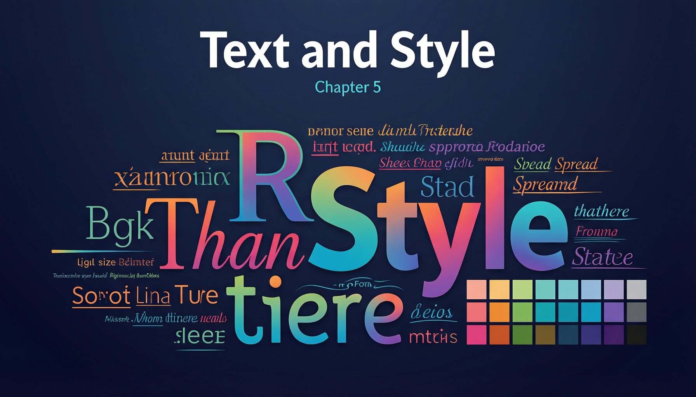

# 第五章：文本与样式类 Widget



## 5.1 Text — 文本渲染核心

`Text` 是 Flutter 中最基础也最重要的 Widget 之一。它负责将字符串渲染到屏幕上，几乎所有涉及文字显示的界面都离不开它。

**核心参数一览：**

| 参数 | 类型 | 说明 |
|------|------|------|
| `data` | `String?` | 要显示的文本内容 |
| `style` | `TextStyle?` | 文本样式 |
| `textAlign` | `TextAlign?` | 对齐方式 |
| `textDirection` | `TextDirection?` | 文本方向（LTR/RTL） |
| `softWrap` | `bool?` | 是否软换行 |
| `overflow` | `TextOverflow?` | 溢出处理 |
| `maxLines` | `int?` | 最大行数 |
| `textScaler` | `TextScaler?` | 文本缩放比 |
| `strutStyle` | `StrutStyle?` | 行高骨架 |

**完整示例：**

```dart
import 'package:flutter/material.dart';

void main() => runApp(const TextDemoApp());

class TextDemoApp extends StatelessWidget {
  const TextDemoApp({super.key});

  @override
  Widget build(BuildContext context) {
    return MaterialApp(
      title: 'Text Demo',
      home: Scaffold(
        appBar: AppBar(title: const Text('Text Widget 全参数演示')),
        body: SingleChildScrollView(
          padding: const EdgeInsets.all(16),
          child: Column(
            crossAxisAlignment: CrossAxisAlignment.start,
            children: [
              // 基础样式
              const Text(
                '基础文本：Hello Flutter!',
                style: TextStyle(
                  fontSize: 24,
                  fontWeight: FontWeight.bold,
                  color: Colors.blue,
                ),
              ),
              const SizedBox(height: 16),

              // 全参数 TextStyle
              const Text(
                '精细排版文本',
                style: TextStyle(
                  fontSize: 20,
                  fontWeight: FontWeight.w500,
                  fontStyle: FontStyle.italic,
                  letterSpacing: 2.0,
                  wordSpacing: 4.0,
                  height: 1.5,
                  color: Colors.black87,
                  backgroundColor: Colors.yellow,
                  decoration: TextDecoration.underline,
                  shadows: [
                    Shadow(
                      offset: Offset(1, 1),
                      blurRadius: 2,
                      color: Colors.grey,
                    ),
                  ],
                ),
              ),
              const SizedBox(height: 16),

              // 溢出处理
              const SizedBox(
                width: 200,
                child: Text(
                  '这是一段很长的文本用来演示 TextOverflow.ellipsis 效果',
                  overflow: TextOverflow.ellipsis,
                  maxLines: 1,
                  style: TextStyle(fontSize: 16),
                ),
              ),
              const SizedBox(height: 8),

              const SizedBox(
                width: 200,
                child: Text(
                  '这段文本用来演示 TextOverflow.fade 的渐隐效果',
                  overflow: TextOverflow.fade,
                  maxLines: 1,
                  softWrap: false,
                  style: TextStyle(fontSize: 16),
                ),
              ),
              const SizedBox(height: 8),

              const SizedBox(
                width: 200,
                child: Text(
                  'clip 裁剪效果clip 裁剪效果clip 裁剪效果',
                  overflow: TextOverflow.clip,
                  maxLines: 1,
                  softWrap: false,
                  style: TextStyle(fontSize: 16),
                ),
              ),
              const SizedBox(height: 16),

              // StrutStyle 演示
              const Text(
                '使用 StrutStyle 统一行高',
                style: TextStyle(fontSize: 16),
                strutStyle: StrutStyle(
                  fontSize: 16,
                  height: 2.0,
                  leading: 4,
                  forceStrutHeight: true,
                ),
              ),
              const SizedBox(height: 16),

              // textScaler 演示
              Text(
                '缩放 1.5 倍的文本',
                style: const TextStyle(fontSize: 16),
                textScaler: const TextScaler.linear(1.5),
              ),
            ],
          ),
        ),
      ),
    );
  }
}
```

**原理解析：**

Text 的渲染链路是 Flutter 文本系统的精华所在。当你在代码中写 `Text('Hello')` 时，Flutter 内部经历了一个多层委托的过程：

1. **Widget 层：** `Text` 在 `build()` 方法中创建一个 `RichText` Widget。即使你只用纯文本，Flutter 也统一用 `RichText` 处理——`Text` 不过是 `RichText` 的便利封装。`Text` 同时会查找 `DefaultTextStyle`（通过 `InheritedWidget`）来合并样式。

2. **Element 层：** `RichText` 创建 `RenderObjectElement`，其 `mount` 过程会实例化 `RenderParagraph`。

3. **RenderObject 层：** `RenderParagraph` 持有 `TextPainter`，在 `performLayout()` 时调用 `TextPainter.layout(minWidth, maxWidth)` 完成文本排版。`TextPainter` 内部调用 `dart:ui` 的 `ParagraphBuilder`，将 `TextSpan` 树构建为原生的 `Paragraph` 对象。

4. **引擎层：** Skia/Impeller 引擎通过 `Canvas.drawParagraph()` 将排版结果绘制到 GPU 表面。

**文本布局流程的关键细节：**

```
Constraints (minWidth, maxWidth)
    ↓
TextPainter.setPlainText() / setText()
    ↓
TextPainter.layout(minWidth, maxWidth)
    ↓
Paragraph.layout(ParagraphConstraints(width: maxWidth))
    ↓
确定 didExceedMaxLines、size
    ↓
RenderParagraph.size = (actual width, actual height)
```

`maxWidth` 来自父 Widget 传入的 `BoxConstraints`。当 `maxWidth` 为 `double.infinity` 时，文本会尝试在一行内显示全部内容；当有约束限制时，文本根据 `softWrap` 决定是否换行。

**性能考量：**

- `Text` 默认 **不是** RepaintBoundary。如果文本频繁更新（如计时器），建议在外部包裹 `RepaintBoundary`，避免每次重绘都牵连兄弟节点。
- Flutter 的文本缓存发生在 `TextPainter` 层面——只要文本内容和样式不变，`Paragraph` 对象会被复用。
- `TextOverflow.fade` 比 `TextOverflow.ellipsis` 开销稍大，因为 fade 需要额外的 shader 渐变遮罩。

---

## 5.2 RichText / Text.rich — 富文本

`RichText` 允许在一段文本中使用多种样式，甚至嵌入 Widget。`Text.rich()` 构造器本质上是对 `RichText` 的便利封装。

**完整示例：**

```dart
import 'package:flutter/gestures.dart';
import 'package:flutter/material.dart';

void main() => runApp(const RichTextDemoApp());

class RichTextDemoApp extends StatelessWidget {
  const RichTextDemoApp({super.key});

  @override
  Widget build(BuildContext context) {
    return MaterialApp(
      title: 'RichText Demo',
      home: Scaffold(
        appBar: AppBar(title: const Text('RichText & Text.rich')),
        body: SingleChildScrollView(
          padding: const EdgeInsets.all(16),
          child: Column(
            crossAxisAlignment: CrossAxisAlignment.start,
            children: [
              // Text.rich 用法
              Text.rich(
                TextSpan(
                  text: '普通文本 ',
                  style: const TextStyle(fontSize: 16, color: Colors.black),
                  children: [
                    const TextSpan(
                      text: '加粗红色',
                      style: TextStyle(
                        fontWeight: FontWeight.bold,
                        color: Colors.red,
                      ),
                    ),
                    const TextSpan(text: ' ，'),
                    TextSpan(
                      text: '可点击链接',
                      style: const TextStyle(
                        color: Colors.blue,
                        decoration: TextDecoration.underline,
                      ),
                      recognizer: TapGestureRecognizer()
                        ..onTap = () {
                          debugPrint('链接被点击');
                        },
                      mouseCursor: SystemMouseCursors.click,
                    ),
                    const TextSpan(text: ' ，'),
                    const TextSpan(
                      text: '斜体绿色',
                      style: TextStyle(
                        fontStyle: FontStyle.italic,
                        color: Colors.green,
                        fontSize: 20,
                      ),
                    ),
                  ],
                ),
              ),
              const SizedBox(height: 24),

              // WidgetSpan: 嵌入 Widget
              Text.rich(
                TextSpan(
                  children: [
                    const TextSpan(
                      text: '文本中嵌入 Widget：',
                      style: TextStyle(fontSize: 16),
                    ),
                    WidgetSpan(
                      alignment: PlaceholderAlignment.middle,
                      child: Container(
                        width: 60,
                        height: 24,
                        decoration: BoxDecoration(
                          color: Colors.orange,
                          borderRadius: BorderRadius.circular(4),
                        ),
                        alignment: Alignment.center,
                        child: const Text(
                          '标签',
                          style: TextStyle(fontSize: 12, color: Colors.white),
                        ),
                      ),
                    ),
                    const TextSpan(
                      text: ' 以及一个图标 ',
                      style: TextStyle(fontSize: 16),
                    ),
                    const WidgetSpan(
                      alignment: PlaceholderAlignment.middle,
                      child: Icon(Icons.favorite, color: Colors.red, size: 20),
                    ),
                    const TextSpan(
                      text: '！',
                      style: TextStyle(fontSize: 16),
                    ),
                  ],
                ),
              ),
            ],
          ),
        ),
      ),
    );
  }
}
```

**原理解析：**

`RichText` 直接操作 `RenderParagraph`，跳过了 `Text` 的中间层。核心流程是：

1. **TextSpan 树扁平化：** `RenderParagraph` 在构建 `Paragraph` 对象时，递归遍历 `TextSpan` 树。每个叶子节点（有 `text` 的 `TextSpan`）通过 `ParagraphBuilder.pushStyle()` + `addText()` + `pop()` 被序列化进 `ParagraphBuilder`。

2. **WidgetSpan 特殊处理：** `WidgetSpan` 不参与文本排版，而是作为占位符（placeholder）。Flutter 为其分配一个 Unicode PUA（Private Use Area）字符 `0xFFFC`，在排版时预留空间，然后通过 `RenderObject` 树的父子关系将嵌入的 Widget 定位到正确位置。这就是为什么你可以在文本流中嵌入任意 Widget。

3. **样式继承：** `TextSpan` 的样式是层叠的——子 `TextSpan` 如果没有指定某个属性，会继承父级的对应属性。这种设计模仿了 HTML/CSS 的样式继承模型。

4. **手势识别：** `TextSpan.recognizer` 利用 `RenderParagraph` 的 `hitTest` 机制。`RenderParagraph` 内部维护一个 `TextBox` 区域映射表，当触摸事件落在某个 `TextSpan` 对应的区域时，触发对应的 `GestureRecognizer`。

**`Text.rich` vs `RichText` 的关键区别：**

- `Text.rich` 会自动合并 `DefaultTextStyle`，而 `RichText` 不会——使用 `RichText` 时你需要手动指定所有样式。
- `Text.rich` 支持 `textAlign`、`maxLines`、`overflow` 等顶层参数，内部自动转换为 `RichText` 的对应参数。

---

## 5.3 SelectableText — 可选中文本

`SelectableText` 让文本可以被长按选中、复制，是阅读类 App 的刚需。

**完整示例：**

```dart
import 'package:flutter/material.dart';

void main() => runApp(const SelectableTextDemoApp());

class SelectableTextDemoApp extends StatelessWidget {
  const SelectableTextDemoApp({super.key});

  @override
  Widget build(BuildContext context) {
    return MaterialApp(
      title: 'SelectableText Demo',
      home: Scaffold(
        appBar: AppBar(title: const Text('SelectableText 演示')),
        body: SingleChildScrollView(
          padding: const EdgeInsets.all(16),
          child: Column(
            crossAxisAlignment: CrossAxisAlignment.start,
            children: [
              const SelectableText(
                '这段文本可以被长按选中并复制。试试在手机上长按这段文字，'
                '你会看到系统的文本选择工具栏。',
                style: TextStyle(fontSize: 16, height: 1.6),
                cursorColor: Colors.blue,
                cursorWidth: 2.0,
                cursorHeight: 20.0,
                showCursor: true,
                enableInteractiveSelection: true,
                toolbarOptions: ToolbarOptions(
                  copy: true,
                  selectAll: true,
                ),
              ),
              const Divider(height: 32),

              // SelectableText.rich
              SelectableText.rich(
                TextSpan(
                  children: [
                    const TextSpan(
                      text: '富文本也可以选中：',
                      style: TextStyle(fontWeight: FontWeight.bold),
                    ),
                    const TextSpan(
                      text: '红色部分',
                      style: TextStyle(color: Colors.red),
                    ),
                    const TextSpan(text: ' 和 '),
                    const TextSpan(
                      text: '蓝色部分',
                      style: TextStyle(color: Colors.blue),
                    ),
                    const TextSpan(text: ' 都可以被选中。'),
                  ],
                ),
                style: const TextStyle(fontSize: 16, height: 1.6),
              ),
              const Divider(height: 32),

              // onTap 回调
              SelectableText(
                '点击这段文本会触发 onTap 回调',
                onTap: () {
                  debugPrint('SelectableText 被点击');
                },
                style: const TextStyle(fontSize: 16, color: Colors.teal),
              ),
            ],
          ),
        ),
      ),
    );
  }
}
```

**原理解析：**

`SelectableText` 和 `Text` 的核心区别在于渲染器不同：

- **Text** → `RichText` → `RenderParagraph`：纯绘制，无交互能力。
- **SelectableText** → `_SelectableTextContainerDelegate` → `RenderEditable`：这是与 `TextField` 共享的渲染器。

`RenderEditable` 是一个功能完备的文本编辑器渲染器，它支持：

- 文本选择（selection handles）
- 光标绘制
- 手势识别（双击选中单词、长按选中段落、三击全选）
- 剪贴板交互
- 系统工具栏（toolbar）

`SelectableText` 通过设置 `readOnly = true` 来禁用输入，但保留了全部选择和交互能力。这就是为什么 `SelectableText` 比 `Text` 开销更大——它引入了完整的文本编辑基础设施。

**与 Text 的选择策略：**

| 场景 | 推荐 Widget |
|------|-------------|
| 纯展示文本 | `Text` |
| 需要复制/选中 | `SelectableText` |
| 需要编辑输入 | `TextField` |

---

## 5.4 DefaultTextStyle / DefaultTextStyle.merge

`DefaultTextStyle` 通过 `InheritedWidget` 机制为整棵子树提供默认的文本样式。

**完整示例：**

```dart
import 'package:flutter/material.dart';

void main() => runApp(const DefaultTextStyleDemoApp());

class DefaultTextStyleDemoApp extends StatelessWidget {
  const DefaultTextStyleDemoApp({super.key});

  @override
  Widget build(BuildContext context) {
    return MaterialApp(
      title: 'DefaultTextStyle Demo',
      home: Scaffold(
        appBar: AppBar(title: const Text('DefaultTextStyle 演示')),
        body: Padding(
          padding: const EdgeInsets.all(16),
          child: Column(
            crossAxisAlignment: CrossAxisAlignment.start,
            children: [
              const Text('使用 MaterialApp 默认样式'),
              const SizedBox(height: 16),

              // 覆盖默认样式
              DefaultTextStyle(
                style: const TextStyle(
                  fontSize: 20,
                  color: Colors.deepPurple,
                  fontWeight: FontWeight.w600,
                ),
                child: Column(
                  crossAxisAlignment: CrossAxisAlignment.start,
                  children: const [
                    Text('继承深紫色样式'),
                    Text('我也继承深紫色样式'),
                    Text(
                      '但我有自己的颜色',
                      style: TextStyle(color: Colors.orange),
                    ),
                  ],
                ),
              ),
              const SizedBox(height: 16),

              // merge 模式：与上层 DefaultTextStyle 合并
              DefaultTextStyle.merge(
                style: const TextStyle(
                  fontStyle: FontStyle.italic,
                  color: Colors.teal,
                ),
                child: const Column(
                  crossAxisAlignment: CrossAxisAlignment.start,
                  children: [
                    Text('merge 模式：斜体 + 青色（字号继承上层）'),
                  ],
                ),
              ),
            ],
          ),
        ),
      ),
    );
  }
}
```

**原理解析：**

`DefaultTextStyle` 继承自 `InheritedWidget`。当 `Text` Widget 执行 `build()` 时：

```dart
// Text.build() 内部简化逻辑：
final DefaultTextStyle defaultTextStyle = DefaultTextStyle.of(context);
TextStyle? effectiveTextStyle = style;
if (style == null || style.inherit) {
  effectiveTextStyle = defaultTextStyle.style.merge(style);
}
```

**`inherit` 字段是 `TextStyle` 的一个精妙设计：**

- `inherit = true`（默认）：当前 `TextStyle` 会与 `DefaultTextStyle` 合并——只覆盖显式设置的属性，未设置的属性从默认样式继承。
- `inherit = false`：完全忽略 `DefaultTextStyle`，使用当前 `TextStyle` 作为绝对样式。

`DefaultTextStyle.merge()` 构造器的作用是在当前已有的 `DefaultTextStyle` 基础上叠加新属性，而不是完全替换。它本质上是：

```dart
DefaultTextStyle(
  style: DefaultTextStyle.of(context).style.merge(style),
  child: child,
)
```

这种层叠继承的设计使得 Flutter 的文本样式系统非常灵活——你可以在 Widget 树的任意层级设置默认样式，子树自动继承，同时允许局部覆盖。

---

## 5.5 Theme / ThemeData

`Theme` 是 Flutter Material 设计系统的核心，它通过 `InheritedTheme` 为整棵 Widget 树提供统一的设计语言。

**完整示例：**

```dart
import 'package:flutter/material.dart';

void main() => runApp(const ThemeDemoApp());

class ThemeDemoApp extends StatelessWidget {
  const ThemeDemoApp({super.key});

  @override
  Widget build(BuildContext context) {
    return MaterialApp(
      title: 'Theme Demo',
      // 全局主题
      theme: ThemeData(
        useMaterial3: true,
        colorScheme: ColorScheme.fromSeed(
          seedColor: Colors.indigo,
          brightness: Brightness.light,
        ),
        textTheme: const TextTheme(
          headlineMedium: TextStyle(
            fontSize: 28,
            fontWeight: FontWeight.bold,
          ),
          bodyLarge: TextStyle(fontSize: 16, height: 1.5),
        ),
        elevatedButtonTheme: ElevatedButtonThemeData(
          style: ElevatedButton.styleFrom(
            padding: const EdgeInsets.symmetric(horizontal: 24, vertical: 12),
          ),
        ),
      ),
      home: const ThemeDemoPage(),
    );
  }
}

class ThemeDemoPage extends StatelessWidget {
  const ThemeDemoPage({super.key});

  @override
  Widget build(BuildContext context) {
    // 通过 Theme.of(context) 获取当前主题
    final colorScheme = Theme.of(context).colorScheme;
    final textTheme = Theme.of(context).textTheme;

    return Scaffold(
      appBar: AppBar(title: const Text('Theme & ThemeData')),
      body: SingleChildScrollView(
        padding: const EdgeInsets.all(16),
        child: Column(
          crossAxisAlignment: CrossAxisAlignment.start,
          children: [
            // 使用 textTheme
            Text('headlineMedium', style: textTheme.headlineMedium),
            Text('bodyLarge', style: textTheme.bodyLarge),
            const SizedBox(height: 16),

            // 使用 colorScheme
            Wrap(
              spacing: 8,
              runSpacing: 8,
              children: [
                _ColorChip('primary', colorScheme.primary, colorScheme.onPrimary),
                _ColorChip('secondary', colorScheme.secondary, colorScheme.onSecondary),
                _ColorChip('tertiary', colorScheme.tertiary, colorScheme.onTertiary),
                _ColorChip('error', colorScheme.error, colorScheme.onError),
                _ColorChip('surface', colorScheme.surface, colorScheme.onSurface),
              ],
            ),
            const SizedBox(height: 24),

            // 局部覆盖 Theme
            Theme(
              data: Theme.of(context).copyWith(
                colorScheme: ColorScheme.fromSeed(
                  seedColor: Colors.orange,
                ),
              ),
              child: Column(
                crossAxisAlignment: CrossAxisAlignment.start,
                children: [
                  const Text('局部 Theme（orange seed）：'),
                  const SizedBox(height: 8),
                  ElevatedButton(
                    onPressed: () {},
                    child: const Text('Orange 主题按钮'),
                  ),
                  const SizedBox(height: 8),
                  FilledButton(
                    onPressed: () {},
                    child: const Text('Orange Filled 按钮'),
                  ),
                ],
              ),
            ),
          ],
        ),
      ),
    );
  }
}

class _ColorChip extends StatelessWidget {
  final String label;
  final Color color;
  final Color onColor;
  const _ColorChip(this.label, this.color, this.onColor);

  @override
  Widget build(BuildContext context) {
    return Container(
      padding: const EdgeInsets.symmetric(horizontal: 12, vertical: 8),
      decoration: BoxDecoration(
        color: color,
        borderRadius: BorderRadius.circular(8),
      ),
      child: Text(label, style: TextStyle(color: onColor, fontSize: 12)),
    );
  }
}
```

**原理解析：**

`Theme` 继承自 `InheritedTheme`（`InheritedWidget` 的子类），其查找机制是 Flutter 中最核心的依赖注入模式：

```dart
// Theme.of() 的实现本质：
static ThemeData of(BuildContext context) {
  final _InheritedTheme? inheritedTheme =
      context.dependOnInheritedWidgetOfExactType<_InheritedTheme>();
  // ... 向上查找最近的 Theme
  return inheritedTheme?.theme.data ?? fallbackTheme;
}
```

**`InheritedTheme` 与普通 `InheritedWidget` 的区别：**

`InheritedTheme` 提供了一个 `wrap()` 方法，使得在异步回调或新路由中也能正确传递主题。当 `Navigator.push` 创建新路由时，新路由的 Widget 树默认不在旧路由的 `InheritedWidget` 子树中。`InheritedTheme` 通过 `wrap()` 确保主题能"跨越"路由边界。

**ColorScheme 的设计哲学：**

Material 3 的 `ColorScheme` 采用"语义色"体系——每个颜色都有明确的用途：

- `primary` / `onPrimary`：主要品牌色及其上的前景色
- `secondary` / `onSecondary`：次要强调色
- `tertiary` / `onTertiary`：第三强调色，用于视觉平衡
- `surface` / `onSurface`：表面色（卡片、对话框等）及其前景色
- `error` / `onError`：错误状态色

`fromSeed()` 方法基于 Material 3 的 HCT（Hue, Chroma, Tone）色彩系统，从一个种子色自动生成完整的协调配色方案。这体现了 Material 3 "让设计师定义一颗种子，系统生成整片花园"的理念。

---

## 5.6 MediaQuery

`MediaQuery` 提供设备屏幕的物理信息——尺寸、像素密度、安全区域、系统亮度等。

**完整示例：**

```dart
import 'package:flutter/material.dart';

void main() => runApp(const MediaQueryDemoApp());

class MediaQueryDemoApp extends StatelessWidget {
  const MediaQueryDemoApp({super.key});

  @override
  Widget build(BuildContext context) {
    return MaterialApp(
      title: 'MediaQuery Demo',
      home: Scaffold(
        appBar: AppBar(title: const Text('MediaQuery 演示')),
        body: Builder( // 使用 Builder 确保能获取到 MaterialApp 的 MediaQuery
          builder: (context) {
            final mq = MediaQuery.of(context);
            return SingleChildScrollView(
              padding: EdgeInsets.only(
                left: 16,
                right: 16,
                top: 16,
                bottom: mq.padding.bottom + 16, // 避开底部安全区
              ),
              child: Column(
                crossAxisAlignment: CrossAxisAlignment.start,
                children: [
                  _InfoCard(
                    title: '屏幕信息',
                    items: [
                      'size: ${mq.size.width} × ${mq.size.height}',
                      'devicePixelRatio: ${mq.devicePixelRatio}',
                      'orientation: ${mq.orientation}',
                      'platformBrightness: ${mq.platformBrightness}',
                    ],
                  ),
                  const SizedBox(height: 12),
                  _InfoCard(
                    title: '安全区域 &  insets',
                    items: [
                      'padding (top): ${mq.padding.top}',
                      'padding (bottom): ${mq.padding.bottom}',
                      'viewInsets (bottom): ${mq.viewInsets.bottom}',
                      'viewPadding (top): ${mq.viewPadding.top}',
                    ],
                  ),
                  const SizedBox(height: 12),
                  _InfoCard(
                    title: '文本缩放',
                    items: [
                      'textScaler: ${mq.textScaler}',
                    ],
                  ),
                  const SizedBox(height: 24),

                  // removePadding 演示
                  const Text('MediaQuery.removePadding 演示：'),
                  const SizedBox(height: 8),
                  MediaQuery.removePadding(
                    context: context,
                    removeTop: true,
                    child: Container(
                      height: 60,
                      color: Colors.blue.withValues(alpha: 0.2),
                      alignment: Alignment.center,
                      child: const Text('顶部 padding 已被移除'),
                    ),
                  ),
                ],
              ),
            );
          },
        ),
      ),
    );
  }
}

class _InfoCard extends StatelessWidget {
  final String title;
  final List<String> items;
  const _InfoCard({required this.title, required this.items});

  @override
  Widget build(BuildContext context) {
    return Card(
      child: Padding(
        padding: const EdgeInsets.all(12),
        child: Column(
          crossAxisAlignment: CrossAxisAlignment.start,
          children: [
            Text(title, style: Theme.of(context).textTheme.titleMedium),
            const SizedBox(height: 8),
            ...items.map((item) => Padding(
              padding: const EdgeInsets.only(bottom: 4),
              child: Text(item, style: const TextStyle(fontSize: 13)),
            )),
          ],
        ),
      ),
    );
  }
}
```

**原理解析：**

`MediaQuery` 同样是 `InheritedWidget`。它的特殊之处在于数据的来源和更新时机：

1. **数据注入：** `WidgetsApp`（`MaterialApp` 的底层）内部使用 `_MediaQueryFromWindowSize` Widget，它监听 `SchedulerBinding` 的窗口事件（`didChangeMetrics`），在窗口尺寸、padding 等变化时重建 `MediaQueryData`。

2. **更新传播：** 当 `MediaQueryData` 变化时，所有通过 `MediaQuery.of(context)` 注册的 Widget 都会被标记为需要重建。这就是为什么旋转屏幕时整个界面会重新布局。

3. **性能陷阱：** `MediaQuery.of(context)` 会对整个 `MediaQueryData` 对象建立依赖。这意味着当任何属性（比如 `viewInsets` 因键盘弹出而变化）改变时，即使你只关心 `size`，你的 Widget 也会重建。解决方案：

```dart
// 只依赖 size，其他属性变化不会触发重建
final size = MediaQuery.sizeOf(context);
// 只依赖 padding
final padding = MediaQuery.paddingOf(context);
// 只依赖 textScaler
final textScaler = MediaQuery.textScalerOf(context);
```

**与 LayoutBuilder 的区分：**

- `MediaQuery` 提供的是**屏幕级**的物理信息（安全区域、像素密度等）。
- `LayoutBuilder` 提供的是**父 Widget 分配给当前 Widget 的约束**（`BoxConstraints`）。
- 如果你只需要知道"我的父级给了我多大空间"，用 `LayoutBuilder`；如果需要知道"屏幕有多大、安全区在哪"，用 `MediaQuery`。

---

## 5.7 DecoratedBox / BoxDecoration

`DecoratedBox` 在子 Widget 的上方或下方绘制装饰（背景、边框、阴影、渐变等）。`Container` 的 `decoration` 参数最终就是委托给 `DecoratedBox`。

**完整示例：**

```dart
import 'package:flutter/material.dart';

void main() => runApp(const DecoratedBoxDemoApp());

class DecoratedBoxDemoApp extends StatelessWidget {
  const DecoratedBoxDemoApp({super.key});

  @override
  Widget build(BuildContext context) {
    return MaterialApp(
      title: 'DecoratedBox Demo',
      home: Scaffold(
        appBar: AppBar(title: const Text('DecoratedBox & BoxDecoration')),
        body: SingleChildScrollView(
          padding: const EdgeInsets.all(16),
          child: Column(
            children: [
              // 基础：圆角 + 阴影
              DecoratedBox(
                decoration: BoxDecoration(
                  color: Colors.white,
                  borderRadius: BorderRadius.circular(12),
                  boxShadow: [
                    BoxShadow(
                      color: Colors.black.withValues(alpha: 0.1),
                      blurRadius: 10,
                      offset: const Offset(0, 4),
                      spreadRadius: 0,
                    ),
                  ],
                ),
                child: const SizedBox(
                  width: double.infinity,
                  height: 80,
                  child: Center(child: Text('圆角卡片 + 阴影')),
                ),
              ),
              const SizedBox(height: 24),

              // 渐变背景
              DecoratedBox(
                decoration: BoxDecoration(
                  gradient: const LinearGradient(
                    colors: [Colors.blue, Colors.purple],
                    begin: Alignment.topLeft,
                    end: Alignment.bottomRight,
                  ),
                  borderRadius: BorderRadius.circular(16),
                ),
                child: const SizedBox(
                  width: double.infinity,
                  height: 80,
                  child: Center(
                    child: Text(
                      '线性渐变',
                      style: TextStyle(color: Colors.white, fontSize: 18),
                    ),
                  ),
                ),
              ),
              const SizedBox(height: 24),

              // 径向渐变
              DecoratedBox(
                decoration: const BoxDecoration(
                  gradient: RadialGradient(
                    colors: [Colors.yellow, Colors.red, Colors.black],
                    stops: [0.0, 0.5, 1.0],
                    center: Alignment.center,
                    radius: 0.8,
                  ),
                  shape: BoxShape.circle,
                ),
                child: const SizedBox(width: 120, height: 120),
              ),
              const SizedBox(height: 24),

              // 扫掠渐变
              DecoratedBox(
                decoration: const BoxDecoration(
                  gradient: SweepGradient(
                    colors: [
                      Colors.red, Colors.orange, Colors.yellow,
                      Colors.green, Colors.blue, Colors.purple, Colors.red,
                    ],
                  ),
                  shape: BoxShape.circle,
                ),
                child: const SizedBox(width: 120, height: 120),
              ),
              const SizedBox(height: 24),

              // 边框
              DecoratedBox(
                decoration: BoxDecoration(
                  border: Border.all(color: Colors.teal, width: 2),
                  borderRadius: BorderRadius.circular(8),
                ),
                child: const SizedBox(
                  width: double.infinity,
                  height: 60,
                  child: Center(child: Text('带边框')),
                ),
              ),
              const SizedBox(height: 24),

              // 背景图片
              DecoratedBox(
                decoration: BoxDecoration(
                  image: const DecorationImage(
                    image: NetworkImage(
                      'https://picsum.photos/400/200',
                    ),
                    fit: BoxFit.cover,
                    opacity: 0.6,
                  ),
                  borderRadius: BorderRadius.circular(12),
                ),
                child: const SizedBox(
                  width: double.infinity,
                  height: 120,
                  child: Center(
                    child: Text(
                      '背景图片叠加',
                      style: TextStyle(
                        color: Colors.white,
                        fontSize: 20,
                        fontWeight: FontWeight.bold,
                        shadows: [Shadow(blurRadius: 4, color: Colors.black)],
                      ),
                    ),
                  ),
                ),
              ),
            ],
          ),
        ),
      ),
    );
  }
}
```

**原理解析：**

`DecoratedBox` 的渲染过程是 `BoxDecoration.createBoxPainter()` → `BoxPainter.paint()`。绘制顺序严格遵循以下层次：

```
1. BoxShadow（调用 Canvas.drawShadow 或手动绘制偏移的模糊路径）
2. 背景层（color / gradient / image，按顺序叠加）
3. Border（在最上层绘制，覆盖在背景之上）
```

**关键性能考量——`saveLayer` 开销：**

当同时使用 `borderRadius` + `boxShadow`（或某些 `blendMode`）时，`BoxPainter` 不得不调用 `Canvas.saveLayer()` 创建一个离屏渲染层。`saveLayer` 会分配一块独立的 GPU 纹理，在其上完成绘制后再合成回主画布。这有两个代价：

- 额外的 GPU 内存分配
- 额外的纹理合成操作

**优化策略：**

- 如果只需要圆角裁剪，使用 `ClipRRect` 而不是 `BoxDecoration` 的 `borderRadius`。
- 如果阴影不需要跟随圆角形状，考虑用简单的矩形阴影。
- 在滚动列表中大量使用圆角+阴影时，给每个 item 添加 `RepaintBoundary`。

**`BoxShape.circle` vs `BoxShape.rectangle`：**

- `circle`：使用 `Canvas.drawCircle()` 绘制，`borderRadius` 参数被忽略。
- `rectangle`：使用 `RRect`（圆角矩形）绘制，可以指定 `borderRadius`。

---

## 5.8 Opacity / AnimatedOpacity / Visibility

这三个 Widget 都涉及"隐藏"子 Widget，但语义和行为截然不同。

**完整示例：**

```dart
import 'package:flutter/material.dart';

void main() => runApp(const VisibilityDemoApp());

class VisibilityDemoApp extends StatefulWidget {
  const VisibilityDemoApp({super.key});

  @override
  State<VisibilityDemoApp> createState() => _VisibilityDemoAppState();
}

class _VisibilityDemoAppState extends State<VisibilityDemoApp> {
  bool _visible = true;
  double _opacity = 1.0;

  @override
  Widget build(BuildContext context) {
    return MaterialApp(
      title: 'Opacity & Visibility Demo',
      home: Scaffold(
        appBar: AppBar(title: const Text('Opacity / Visibility / Offstage')),
        body: SingleChildScrollView(
          padding: const EdgeInsets.all(16),
          child: Column(
            crossAxisAlignment: CrossAxisAlignment.start,
            children: [
              // Opacity
              const Text('Opacity (opacity=$_opacity)：'),
              const SizedBox(height: 8),
              Opacity(
                opacity: _opacity,
                child: Container(
                  width: double.infinity,
                  height: 60,
                  color: Colors.blue,
                  alignment: Alignment.center,
                  child: const Text('Opacity 子项',
                      style: TextStyle(color: Colors.white)),
                ),
              ),
              Slider(
                value: _opacity,
                onChanged: (v) => setState(() => _opacity = v),
              ),
              const SizedBox(height: 16),

              // AnimatedOpacity
              const Text('AnimatedOpacity：'),
              const SizedBox(height: 8),
              AnimatedOpacity(
                opacity: _visible ? 1.0 : 0.0,
                duration: const Duration(milliseconds: 500),
                child: Container(
                  width: double.infinity,
                  height: 60,
                  color: Colors.green,
                  alignment: Alignment.center,
                  child: const Text('AnimatedOpacity 子项',
                      style: TextStyle(color: Colors.white)),
                ),
              ),
              const SizedBox(height: 16),

              // Visibility
              const Text('Visibility (visible=$_visible)：'),
              const SizedBox(height: 8),
              Visibility(
                visible: _visible,
                maintainSize: true,
                maintainAnimation: true,
                maintainState: true,
                child: Container(
                  width: double.infinity,
                  height: 60,
                  color: Colors.orange,
                  alignment: Alignment.center,
                  child: const Text('Visibility 子项',
                      style: TextStyle(color: Colors.white)),
                ),
              ),
              const SizedBox(height: 8),

              // Offstage
              const Text('Offstage (offstage=${'!_visible'})：'),
              const SizedBox(height: 8),
              Offstage(
                offstage: !_visible,
                child: Container(
                  width: double.infinity,
                  height: 60,
                  color: Colors.purple,
                  alignment: Alignment.center,
                  child: const Text('Offstage 子项',
                      style: TextStyle(color: Colors.white)),
                ),
              ),
              const SizedBox(height: 24),

              Center(
                child: ElevatedButton(
                  onPressed: () => setState(() => _visible = !_visible),
                  child: Text(_visible ? '隐藏' : '显示'),
                ),
              ),
            ],
          ),
        ),
      ),
    );
  }
}
```

**三者对比：**

| 特性 | Opacity | Visibility | Offstage |
|------|---------|------------|----------|
| 是否布局 | 是 | 可控 | 是 |
| 是否绘制 | 是（opacity=0 也绘制） | 可控 | 否 |
| 是否响应事件 | 是 | 可控 | 否 |
| 触发动画 | 无 | 可控 | 无 |
| 性能 | 较差（saveLayer） | 好 | 好 |

**原理解析：**

- **Opacity** 使用 `RenderOpacity`，其 `paint()` 方法调用 `context.pushOpacity()` → `Canvas.saveLayer()` + `Paint.color = Color.fromRGBO(0,0,0,opacity)` → 绘制子项 → `Canvas.restore()`。即使 `opacity = 0`，子项依然被完整绘制到离屏纹理上，只是最终合成时不可见。这是最大的性能陷阱。

- **Visibility** 是一个纯逻辑 Widget，它根据 `visible` 和各种 `maintain*` 参数决定子项的存在形式。当 `visible = false` 且所有 `maintain*` 为 `false` 时，子项被替换为 `SizedBox.shrink()`，完全不参与布局和绘制。

- **Offstage** 使用 `RenderOffstage`，它在 `performLayout()` 时正常布局子项（确定尺寸），但在 `paint()` 时跳过绘制。典型用途：在 Stack 中使用 Offstage 的子项来测量其尺寸而不显示。

**最佳实践：** 如果需要淡入淡出效果，使用 `AnimatedOpacity` 而不是手动控制 `Opacity`。`AnimatedOpacity` 内部做了优化，当 opacity 达到 0 时会自动停止绘制。

---
