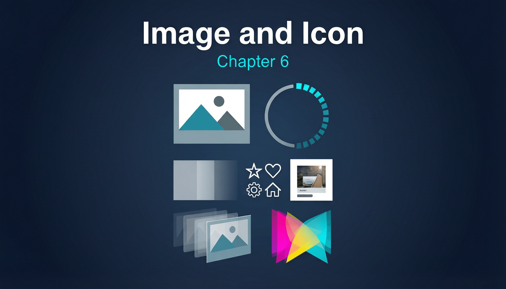

# 第六章：图片与图标



## 6.1 Image — 图片加载

`Image` 是 Flutter 中加载和显示图片的标准 Widget，支持多种数据源。

**完整示例：**

```dart
import 'package:flutter/material.dart';

void main() => runApp(const ImageDemoApp());

class ImageDemoApp extends StatelessWidget {
  const ImageDemoApp({super.key});

  @override
  Widget build(BuildContext context) {
    return MaterialApp(
      title: 'Image Demo',
      home: Scaffold(
        appBar: AppBar(title: const Text('Image Widget 全功能演示')),
        body: SingleChildScrollView(
          padding: const EdgeInsets.all(16),
          child: Column(
            crossAxisAlignment: CrossAxisAlignment.start,
            children: [
              // 网络图片 + BoxFit
              const Text('BoxFit.cover：', style: TextStyle(fontWeight: FontWeight.bold)),
              const SizedBox(height: 8),
              ClipRRect(
                borderRadius: BorderRadius.circular(8),
                child: Image.network(
                  'https://picsum.photos/400/300',
                  width: 300,
                  height: 200,
                  fit: BoxFit.cover,
                  loadingBuilder: (context, child, loadingProgress) {
                    if (loadingProgress == null) return child;
                    return Container(
                      width: 300,
                      height: 200,
                      alignment: Alignment.center,
                      child: CircularProgressIndicator(
                        value: loadingProgress.expectedTotalBytes != null
                            ? loadingProgress.cumulativeBytesLoaded /
                                loadingProgress.expectedTotalBytes!
                            : null,
                      ),
                    );
                  },
                  errorBuilder: (context, error, stackTrace) {
                    return Container(
                      width: 300,
                      height: 200,
                      color: Colors.grey[200],
                      child: const Icon(Icons.broken_image, size: 48),
                    );
                  },
                ),
              ),
              const SizedBox(height: 16),

              // BoxFit 对比
              const Text('BoxFit 对比：', style: TextStyle(fontWeight: FontWeight.bold)),
              const SizedBox(height: 8),
              Wrap(
                spacing: 8,
                runSpacing: 8,
                children: [
                  for (final fit in BoxFit.values)
                    Column(
                      children: [
                        Container(
                          width: 100,
                          height: 80,
                          decoration: BoxDecoration(
                            border: Border.all(color: Colors.grey),
                          ),
                          child: Image.network(
                            'https://picsum.photos/200/200',
                            fit: fit,
                            width: 100,
                            height: 80,
                          ),
                        ),
                        Text(fit.name, style: const TextStyle(fontSize: 10)),
                      ],
                    ),
                ],
              ),
              const SizedBox(height: 16),

              // color + colorBlendMode
              const Text('colorBlendMode：', style: TextStyle(fontWeight: FontWeight.bold)),
              const SizedBox(height: 8),
              Image.network(
                'https://picsum.photos/300/200',
                width: 300,
                height: 150,
                fit: BoxFit.cover,
                color: Colors.blue.withValues(alpha: 0.5),
                colorBlendMode: BlendMode.srcATop,
              ),
              const SizedBox(height: 16),

              // 降采样优化
              const Text(
                'cacheWidth/cacheHeight 降采样：',
                style: TextStyle(fontWeight: FontWeight.bold),
              ),
              const SizedBox(height: 8),
              Image.network(
                'https://picsum.photos/2000/2000',
                width: 100,
                height: 100,
                cacheWidth: 200, // 只解码 200px 宽，节省内存
                cacheHeight: 200,
              ),
            ],
          ),
        ),
      ),
    );
  }
}
```

**原理解析：**

`Image` Widget 的图片加载流程是 Flutter 中涉及异步操作最复杂的 Widget 之一：

```
Image Widget
    ↓ build()
_RawImageState
    ↓ 获取 ImageProvider
ImageProvider.resolve(ImageConfiguration)
    ↓ 查找 ImageCache
ImageCache（内存缓存，按 key 查找）
    ↓ 命中 / 未命中
ImageStreamCompleter
    ↓ 加载 & 解码
ui.ImmutableBuffer.fromUint8List()
    ↓
ui.instantiateImageCodec()
    ↓
ui.FrameInfo → ui.Image
    ↓
RawImage (RenderImage) → paintImage()
    ↓
Canvas.drawImage() / Canvas.drawImageRect()
```

**ImageProvider 体系：**

`ImageProvider` 是一个抽象类，定义了"如何获取图片的编码数据"。核心子类：

- `AssetImage`：从 `AssetBundle` 加载，key 包含 `name` + `AssetBundle` + `scale`。
- `NetworkImage`：从 URL 加载，内部使用 `HttpClient`，key 是 URL + scale。
- `FileImage`：从本地文件加载，key 是文件路径 + 修改时间。
- `MemoryImage`：从 `Uint8List` 加载。

**ImageCache 的三级策略：**

- `maximumSize`（默认 1000 张）：超出时按 LRU 淘汰。
- `maximumSizeBytes`（默认 100MB）：按解码后的内存占用计算。
- `evict()` / `clear()`：手动清除缓存。

**性能优化——降采样：**

一张 4000x3000 的图片解码后占用约 48MB 内存（4000 × 3000 × 4 bytes）。如果只显示 100x100，通过设置 `cacheWidth` / `cacheHeight` 参数，Flutter 会在解码阶段就只解码目标尺寸的数据，大幅减少内存占用：

```dart
Image.network(
  'https://example.com/huge-image.jpg',
  width: 100,
  height: 100,
  cacheWidth: 200, // 考虑 devicePixelRatio
  cacheHeight: 200,
)
```

**预加载：**

```dart
// 在 initState 或路由前预加载
await precacheImage(
  const NetworkImage('https://example.com/image.jpg'),
  context,
);
```

---

## 6.2 FadeInImage

`FadeInImage` 在网络图片加载期间显示占位图，加载完成后淡入切换。

**完整示例：**

```dart
import 'package:flutter/material.dart';

void main() => runApp(const FadeInImageDemoApp());

class FadeInImageDemoApp extends StatelessWidget {
  const FadeInImageDemoApp({super.key});

  @override
  Widget build(BuildContext context) {
    return MaterialApp(
      title: 'FadeInImage Demo',
      home: Scaffold(
        appBar: AppBar(title: const Text('FadeInImage')),
        body: SingleChildScrollView(
          padding: const EdgeInsets.all(16),
          child: Column(
            crossAxisAlignment: CrossAxisAlignment.start,
            children: [
              const Text('FadeInImage.network：'),
              const SizedBox(height: 8),
              FadeInImage(
                placeholder: const AssetImage('assets/placeholder.png'),
                image: const NetworkImage('https://picsum.photos/600/400'),
                fadeInDuration: const Duration(milliseconds: 500),
                fadeOutDuration: const Duration(milliseconds: 200),
                fadeInCurve: Curves.easeIn,
                fadeOutCurve: Curves.easeOut,
                width: double.infinity,
                height: 250,
                fit: BoxFit.cover,
                imageErrorBuilder: (context, error, stackTrace) {
                  return Container(
                    height: 250,
                    color: Colors.grey[200],
                    child: const Center(child: Icon(Icons.error)),
                  );
                },
              ),
              const SizedBox(height: 24),

              // 使用内存占位图（无需 asset 文件）
              const Text('使用透明占位图：'),
              const SizedBox(height: 8),
              FadeInImage.memoryNetwork(
                // 1x1 透明 PNG 的字节
                placeholder: kTransparentImage,
                image: 'https://picsum.photos/600/401',
                fadeInDuration: const Duration(milliseconds: 600),
                width: double.infinity,
                height: 250,
                fit: BoxFit.cover,
              ),
            ],
          ),
        ),
      ),
    );
  }
}

// 1x1 透明 PNG
const kTransparentImage = [
  0x89, 0x50, 0x4E, 0x47, 0x0D, 0x0A, 0x1A, 0x0A, 0x00, 0x00, 0x00, 0x0D,
  0x49, 0x48, 0x44, 0x52, 0x00, 0x00, 0x00, 0x01, 0x00, 0x00, 0x00, 0x01,
  0x08, 0x06, 0x00, 0x00, 0x00, 0x1F, 0x15, 0xC4, 0x89, 0x00, 0x00, 0x00,
  0x0A, 0x49, 0x44, 0x41, 0x54, 0x78, 0x9C, 0x62, 0x00, 0x00, 0x00, 0x02,
  0x00, 0x01, 0xE5, 0x27, 0xDE, 0xFC, 0x00, 0x00, 0x00, 0x00, 0x49, 0x45,
  0x4E, 0x44, 0xAE, 0x42, 0x60, 0x82,
];
```

**原理解析：**

`FadeInImage` 内部维护两个 `Image` Widget（placeholder 和 target），通过 `AnimatedSwitcher` 实现交叉淡入淡出。状态机如下：

```
[显示 placeholder]
      ↓ image 加载完成
[fadeOut placeholder + fadeIn target]  (同时交叉)
      ↓ fadeOut 完成
[仅显示 target]
```

实际内部实现使用 `_ImageCrossFadeState`，通过两个 `AnimationController` 分别控制 placeholder 的淡出和 target 的淡入。当 `fadeOutDuration` 为 `Duration.zero` 时，跳过淡出直接淡入。

**与 `cached_network_image` 的对比：**

- `FadeInImage` 不提供磁盘缓存，每次启动都重新下载。
- `cached_network_image` 的 `CachedNetworkImage` 提供磁盘+内存双层缓存、渐进式 JPEG 加载、错误重试等高级功能。
- 生产环境中，推荐使用 `cached_network_image` 替代 `FadeInImage`。

---

## 6.3 Icon / ImageIcon

`Icon` 用字体渲染图标，`ImageIcon` 用图片作为图标。

**完整示例：**

```dart
import 'package:flutter/material.dart';

void main() => runApp(const IconDemoApp());

class IconDemoApp extends StatelessWidget {
  const IconDemoApp({super.key});

  @override
  Widget build(BuildContext context) {
    return MaterialApp(
      title: 'Icon Demo',
      home: Scaffold(
        appBar: AppBar(title: const Text('Icon & ImageIcon')),
        body: SingleChildScrollView(
          padding: const EdgeInsets.all(16),
          child: Column(
            crossAxisAlignment: CrossAxisAlignment.start,
            children: [
              // Material Icons
              const Text('Material Icons：', style: TextStyle(fontWeight: FontWeight.bold)),
              const SizedBox(height: 8),
              Wrap(
                spacing: 16,
                runSpacing: 16,
                children: const [
                  Icon(Icons.home, size: 32, color: Colors.blue),
                  Icon(Icons.favorite, size: 32, color: Colors.red),
                  Icon(Icons.star, size: 32, color: Colors.amber),
                  Icon(Icons.settings, size: 32, color: Colors.grey),
                  Icon(Icons.notifications_active, size: 32, color: Colors.orange),
                ],
              ),
              const SizedBox(height: 24),

              // 自定义大小和颜色
              const Text('自定义样式：', style: TextStyle(fontWeight: FontWeight.bold)),
              const SizedBox(height: 8),
              const Row(
                mainAxisAlignment: MainAxisAlignment.spaceEvenly,
                children: [
                  Icon(Icons.rocket_launch, size: 48, color: Colors.deepPurple),
                  Icon(Icons.rocket_launch, size: 64, color: Colors.teal),
                  Icon(Icons.rocket_launch, size: 80, color: Colors.redAccent),
                ],
              ),
              const SizedBox(height: 24),

              // ImageIcon
              const Text('ImageIcon：', style: TextStyle(fontWeight: FontWeight.bold)),
              const SizedBox(height: 8),
              const Row(
                mainAxisAlignment: MainAxisAlignment.spaceEvenly,
                children: [
                  ImageIcon(
                    NetworkImage('https://picsum.photos/48/48'),
                    size: 48,
                    color: Colors.blue,
                  ),
                  ImageIcon(
                    NetworkImage('https://picsum.photos/48/49'),
                    size: 48,
                    color: Colors.red,
                  ),
                ],
              ),
              const SizedBox(height: 24),

              // IconData 详解
              const Text('IconData 内部结构：',
                  style: TextStyle(fontWeight: FontWeight.bold)),
              const SizedBox(height: 8),
              Row(
                mainAxisAlignment: MainAxisAlignment.spaceEvenly,
                children: [
                  // 使用 IconData 直接指定 codePoint
                  Icon(
                    IconData(0xe88a, fontFamily: 'MaterialIcons'),
                    size: 48,
                    color: Colors.green,
                  ),
                  // 等价于：
                  const Icon(Icons.accessibility, size: 48, color: Colors.green),
                ],
              ),
            ],
          ),
        ),
      ),
    );
  }
}
```

**原理解析：**

`Icon` 的渲染原理可能出乎你的意料——它**本质上是一个 Text Widget**：

```dart
// Icon.build() 的核心逻辑：
Widget build(BuildContext context) {
  return RichText(
    text: TextSpan(
      text: String.fromCharCode(icon.codePoint),
      style: TextStyle(
        inherit: false,
        color: iconColor,
        fontSize: iconSize,
        fontFamily: icon.fontFamily,
        package: icon.fontPackage,
      ),
    ),
  );
}
```

也就是说，Material Icons 是一套特殊字体（`MaterialIcons-Regular.otf`），每个图标对应一个 Unicode 码位。`Icon(Icons.home)` 等价于在 `MaterialIcons` 字体中渲染 `codePoint = 0xe88a` 这个字符。

**IconData 的四个关键字段：**

- `codePoint`：图标在字体文件中的 Unicode 码位。
- `fontFamily`：字体族名（如 `'MaterialIcons'`）。
- `fontPackage`：如果字体来自 package，需指定包名。
- `matchTextDirection`：是否根据 `TextDirection` 镜像图标（如箭头图标在 RTL 模式下应翻转）。

**自定义 Icon Font：**

1. 在 [fluttericon.com](http://fluttericon.com) 或类似工具生成 `.ttf` 和 Dart 类文件。
2. 在 `pubspec.yaml` 中注册字体：

```yaml
flutter:
  fonts:
    - family: MyIcons
      fonts:
        - asset: fonts/MyIcons.ttf
```

1. 使用：

```dart
Icon(IconData(0xe900, fontFamily: 'MyIcons'), size: 24);
```

---

## 6.4 RawImage

`RawImage` 是图片渲染的最底层 Widget，接收一个已解码的 `ui.Image` 对象直接绘制。

**完整示例：**

```dart
import 'dart:typed_data';
import 'dart:ui' as ui;
import 'package:flutter/material.dart';

void main() => runApp(const RawImageDemoApp());

class RawImageDemoApp extends StatefulWidget {
  const RawImageDemoApp({super.key});

  @override
  State<RawImageDemoApp> createState() => _RawImageDemoAppState();
}

class _RawImageDemoAppState extends State<RawImageDemoApp> {
  ui.Image? _image;

  @override
  void initState() {
    super.initState();
    _createGradientImage();
  }

  // 程序化创建一个渐变图片
  Future<void> _createGradientImage() async {
    final recorder = ui.PictureRecorder();
    final canvas = Canvas(recorder);
    final paint = Paint()
      ..shader = const ui.Gradient.linear(
        Offset.zero,
        const Offset(200, 200),
        [Colors.blue, Colors.purple, Colors.pink],
      );
    canvas.drawRect(const Rect.fromLTWH(0, 0, 200, 200), paint);

    // 画一个圆
    canvas.drawCircle(
      const Offset(100, 100),
      40,
      Paint()..color = Colors.white.withValues(alpha: 0.8),
    );

    final picture = recorder.endRecording();
    final img = await picture.toImage(200, 200);
    setState(() => _image = img);
  }

  @override
  Widget build(BuildContext context) {
    return MaterialApp(
      title: 'RawImage Demo',
      home: Scaffold(
        appBar: AppBar(title: const Text('RawImage')),
        body: Center(
          child: Column(
            mainAxisAlignment: MainAxisAlignment.center,
            children: [
              if (_image != null)
                RawImage(
                  image: _image,
                  width: 200,
                  height: 200,
                  scale: 1.0,
                  filterQuality: FilterQuality.high,
                  isAntiAlias: true,
                )
              else
                const CircularProgressIndicator(),
              const SizedBox(height: 24),
              const Text(
                '上述图片由 Canvas 程序化生成\n然后通过 RawImage 渲染',
                textAlign: TextAlign.center,
                style: TextStyle(fontSize: 14, color: Colors.grey),
              ),
            ],
          ),
        ),
      ),
    );
  }
}
```

**原理解析：**

`RawImage` 对应 `RenderImage`，它直接调用 `paintImage()` 函数将 `ui.Image` 绘制到 `Canvas` 上。`paintImage()` 内部根据 `fit`、`alignment` 等参数计算源矩形和目标矩形，最终调用：

```dart
canvas.drawImageRect(image, sourceRect, destinationRect, paint);
```

**`RawImage` 在 Widget 树中的位置：**

```
Image (高层 API)
  └→ RawImage (低层 API)
       └→ RenderImage → paintImage() → Canvas.drawImageRect()

FadeInImage
  └→ AnimatedSwitcher
       └→ Image → RawImage
```

通常不直接使用 `RawImage`，除非你需要显示程序化生成的 `ui.Image`（如截图、Canvas 绘制结果、相机预览帧）。

---
