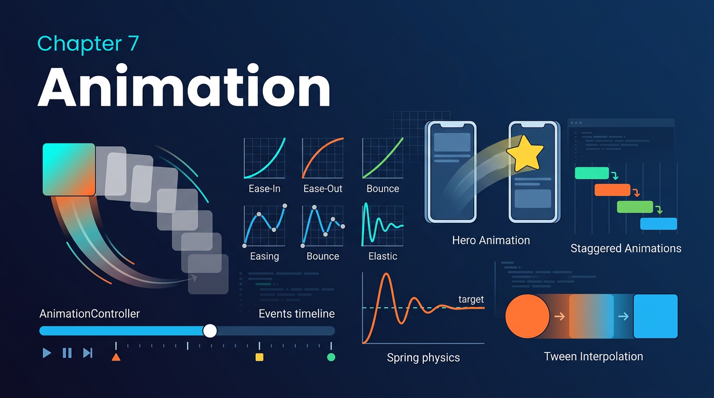

# 第七章：动画类 Widget



## 7.1 隐式动画 Widget 全家族

隐式动画是 Flutter 动画系统中最"声明式"的部分：**你只需要设置目标值，Widget 自动处理从当前值到目标值的过渡动画。** 不需要 `AnimationController`，不需要手动管理生命周期。

### AnimatedContainer

`AnimatedContainer` 继承 `Container` 的全部参数，任何参数变化都会触发动画。

```dart
import 'package:flutter/material.dart';

void main() => runApp(const AnimatedContainerDemo());

class AnimatedContainerDemo extends StatefulWidget {
  const AnimatedContainerDemo({super.key});
  @override
  State<AnimatedContainerDemo> createState() => _AnimatedContainerDemoState();
}

class _AnimatedContainerDemoState extends State<AnimatedContainerDemo> {
  bool _expanded = false;

  @override
  Widget build(BuildContext context) {
    return MaterialApp(
      home: Scaffold(
        appBar: AppBar(title: const Text('AnimatedContainer')),
        body: Center(
          child: GestureDetector(
            onTap: () => setState(() => _expanded = !_expanded),
            child: AnimatedContainer(
              duration: const Duration(milliseconds: 400),
              curve: Curves.easeInOut,
              width: _expanded ? 300 : 100,
              height: _expanded ? 300 : 100,
              decoration: BoxDecoration(
                color: _expanded ? Colors.teal : Colors.blue,
                borderRadius: _expanded
                    ? BorderRadius.circular(50)
                    : BorderRadius.circular(8),
                boxShadow: _expanded
                    ? [
                        BoxShadow(
                          color: Colors.black26,
                          blurRadius: 20,
                          offset: const Offset(0, 10),
                        ),
                      ]
                    : [],
              ),
              alignment: Alignment.center,
              child: AnimatedDefaultTextStyle(
                duration: const Duration(milliseconds: 400),
                style: TextStyle(
                  color: Colors.white,
                  fontSize: _expanded ? 24 : 14,
                  fontWeight: FontWeight.bold,
                ),
                child: Text(_expanded ? '展开' : '点击'),
              ),
            ),
          ),
        ),
      ),
    );
  }
}
```

**原理解析：**

`AnimatedContainer` 继承自 `ImplicitlyAnimatedWidget`。其内部实现的核心机制：

1. 继承自 `ImplicitlyAnimatedWidgetState`，持有 `AnimationController`。
2. 在 `didUpdateWidget()` 中，比较新旧 Widget 的每个属性（`width`、`height`、`color` 等），如果不等，调用 `controller.forward()` 启动动画。
3. 每个可动画属性对应一个 `Tween`（如 `ColorTween`、`BoxDecorationTween`），在动画过程中通过 `Tween.lerp()` 插值。

这就是"声明式动画"的精髓——开发者只描述"我要变成什么样"，框架负责"如何平滑地变过去"。

### AnimatedPadding / AnimatedAlign / AnimatedPositioned

```dart
import 'package:flutter/material.dart';

void main() => runApp(const AnimatedLayoutDemo());

class AnimatedLayoutDemo extends StatefulWidget {
  const AnimatedLayoutDemo({super.key});
  @override
  State<AnimatedLayoutDemo> createState() => _AnimatedLayoutDemoState();
}

class _AnimatedLayoutDemoState extends State<AnimatedLayoutDemo> {
  AlignmentGeometry _alignment = Alignment.topLeft;
  EdgeInsets _padding = const EdgeInsets.all(16);
  bool _positioned = false;

  @override
  Widget build(BuildContext context) {
    return MaterialApp(
      home: Scaffold(
        appBar: AppBar(title: const Text('Animated Layout Widgets')),
        body: Column(
          children: [
            // AnimatedPadding
            Expanded(
              child: AnimatedPadding(
                duration: const Duration(milliseconds: 500),
                curve: Curves.easeInOut,
                padding: _padding,
                child: Container(color: Colors.blue, width: double.infinity),
              ),
            ),

            // AnimatedAlign
            SizedBox(
              height: 150,
              width: double.infinity,
              child: AnimatedAlign(
                duration: const Duration(milliseconds: 500),
                alignment: _alignment,
                child: const FlutterLogo(size: 50),
              ),
            ),

            // AnimatedPositioned（必须在 Stack 中）
            SizedBox(
              height: 150,
              width: double.infinity,
              child: Stack(
                children: [
                  AnimatedPositioned(
                    duration: const Duration(milliseconds: 500),
                    curve: Curves.bounceOut,
                    left: _positioned ? 200 : 20,
                    top: _positioned ? 80 : 20,
                    child: Container(
                      width: 60,
                      height: 60,
                      decoration: const BoxDecoration(
                        color: Colors.red,
                        shape: BoxShape.circle,
                      ),
                    ),
                  ),
                ],
              ),
            ),

            Padding(
              padding: const EdgeInsets.all(16),
              child: Wrap(
                spacing: 12,
                children: [
                  ElevatedButton(
                    onPressed: () => setState(() =>
                        _padding = _padding == const EdgeInsets.all(16)
                            ? const EdgeInsets.all(60)
                            : const EdgeInsets.all(16)),
                    child: const Text('Toggle Padding'),
                  ),
                  ElevatedButton(
                    onPressed: () => setState(() =>
                        _alignment = _alignment == Alignment.topLeft
                            ? Alignment.bottomRight
                            : Alignment.topLeft),
                    child: const Text('Toggle Align'),
                  ),
                  ElevatedButton(
                    onPressed: () =>
                        setState(() => _positioned = !_positioned),
                    child: const Text('Toggle Positioned'),
                  ),
                ],
              ),
            ),
          ],
        ),
      ),
    );
  }
}
```

**原理解析：**

这三个 Widget 的内部机制完全相同：都继承自 `ImplicitlyAnimatedWidget`，在 `didUpdateWidget` 时检测目标属性变化，通过 `AnimationController` + `Tween` 驱动过渡。

- **AnimatedPadding**：动画化 `EdgeInsets`，使用 `EdgeInsetsTween`。
- **AnimatedAlign**：动画化 `AlignmentGeometry`，使用 `AlignmentTween`。
- **AnimatedPositioned**：动画化 `left`/`top`/`right`/`bottom`/`width`/`height`，每帧更新 `Positioned` 的参数。注意：`AnimatedPositioned` **必须** 作为 `Stack` 的直接子 Widget。

### AnimatedOpacity / AnimatedScale / AnimatedRotation / AnimatedSlide / AnimatedSize

```dart
import 'package:flutter/material.dart';

void main() => runApp(const AnimatedTransformDemo());

class AnimatedTransformDemo extends StatefulWidget {
  const AnimatedTransformDemo({super.key});
  @override
  State<AnimatedTransformDemo> createState() => _AnimatedTransformDemoState();
}

class _AnimatedTransformDemoState extends State<AnimatedTransformDemo> {
  bool _active = false;

  @override
  Widget build(BuildContext context) {
    return MaterialApp(
      home: Scaffold(
        appBar: AppBar(title: const Text('Animated Transform Widgets')),
        body: Center(
          child: Column(
            mainAxisAlignment: MainAxisAlignment.center,
            children: [
              Row(
                mainAxisAlignment: MainAxisAlignment.spaceEvenly,
                children: [
                  // AnimatedOpacity
                  Column(
                    children: [
                      AnimatedOpacity(
                        duration: const Duration(milliseconds: 500),
                        opacity: _active ? 1.0 : 0.2,
                        child: _DemoBox(color: Colors.blue, label: 'Opacity'),
                      ),
                      const Text('Opacity'),
                    ],
                  ),

                  // AnimatedScale
                  Column(
                    children: [
                      AnimatedScale(
                        duration: const Duration(milliseconds: 500),
                        scale: _active ? 1.5 : 1.0,
                        child: _DemoBox(color: Colors.green, label: 'Scale'),
                      ),
                      const Text('Scale'),
                    ],
                  ),
                ],
              ),
              const SizedBox(height: 24),

              Row(
                mainAxisAlignment: MainAxisAlignment.spaceEvenly,
                children: [
                  // AnimatedRotation
                  Column(
                    children: [
                      AnimatedRotation(
                        duration: const Duration(milliseconds: 500),
                        turns: _active ? 0.5 : 0.0,
                        child: _DemoBox(color: Colors.orange, label: 'Rotate'),
                      ),
                      const Text('Rotation'),
                    ],
                  ),

                  // AnimatedSlide
                  Column(
                    children: [
                      AnimatedSlide(
                        duration: const Duration(milliseconds: 500),
                        offset: _active
                            ? const Offset(1.0, 0.0)
                            : Offset.zero,
                        child: _DemoBox(color: Colors.purple, label: 'Slide'),
                      ),
                      const Text('Slide'),
                    ],
                  ),
                ],
              ),
              const SizedBox(height: 24),

              // AnimatedSize
              AnimatedSize(
                duration: const Duration(milliseconds: 500),
                curve: Curves.easeInOut,
                child: Container(
                  width: _active ? 300 : 100,
                  height: _active ? 100 : 50,
                  color: Colors.teal,
                  alignment: Alignment.center,
                  child: const Text('AnimatedSize',
                      style: TextStyle(color: Colors.white)),
                ),
              ),
              const SizedBox(height: 24),

              ElevatedButton(
                onPressed: () => setState(() => _active = !_active),
                child: Text(_active ? 'Reset' : 'Animate'),
              ),
            ],
          ),
        ),
      ),
    );
  }
}

class _DemoBox extends StatelessWidget {
  final Color color;
  final String label;
  const _DemoBox({required this.color, required this.label});

  @override
  Widget build(BuildContext context) {
    return Container(
      width: 60,
      height: 60,
      decoration: BoxDecoration(
        color: color,
        borderRadius: BorderRadius.circular(8),
      ),
      alignment: Alignment.center,
      child: Text(label,
          style: const TextStyle(color: Colors.white, fontSize: 10)),
    );
  }
}
```

**关键性能差异：**

| Widget | 触发 Relayout | 触发 Repaint | 性能 |
|--------|---------------|--------------|------|
| AnimatedOpacity | 否 | 是 | 中等（saveLayer） |
| AnimatedScale | 否 | 否（transform） | 好 |
| AnimatedRotation | 否 | 否（transform） | 好 |
| AnimatedSlide | 否 | 否（transform） | 好 |
| AnimatedSize | **是** | 是 | 较差 |

`AnimatedScale`、`AnimatedRotation`、`AnimatedSlide` 使用 `Transform`（GPU 矩阵变换），**不触发重新布局**——这是它们性能优于 `AnimatedContainer` 的根本原因。`AnimatedSize` 则需要子 Widget 重新 layout，开销最大。

### TweenAnimationBuilder

`TweenAnimationBuilder` 是最通用的隐式动画——任何可以用 `Tween` 描述的类型都可以动画化。

```dart
import 'package:flutter/material.dart';

void main() => runApp(const TweenAnimationDemo());

class TweenAnimationDemo extends StatefulWidget {
  const TweenAnimationDemo({super.key});
  @override
  State<TweenAnimationDemo> createState() => _TweenAnimationDemoState();
}

class _TweenAnimationDemoState extends State<TweenAnimationDemo> {
  double _targetValue = 0.0;

  @override
  Widget build(BuildContext context) {
    return MaterialApp(
      home: Scaffold(
        appBar: AppBar(title: const Text('TweenAnimationBuilder')),
        body: Center(
          child: Column(
            mainAxisAlignment: MainAxisAlignment.center,
            children: [
              // 动画化一个 double 值
              TweenAnimationBuilder<double>(
                tween: Tween(begin: 0.0, end: _targetValue),
                duration: const Duration(milliseconds: 800),
                curve: Curves.easeOutBack,
                builder: (context, value, child) {
                  return Transform.scale(
                    scale: 1.0 + value,
                    child: Transform.rotate(
                      angle: value * 3.14159,
                      child: child,
                    ),
                  );
                },
                child: Container(
                  width: 80,
                  height: 80,
                  decoration: BoxDecoration(
                    color: Colors.deepPurple,
                    borderRadius: BorderRadius.circular(16),
                  ),
                  child: const Icon(Icons.star, color: Colors.amber, size: 40),
                ),
              ),
              const SizedBox(height: 32),

              // 动画化 Color
              TweenAnimationBuilder<Color?>(
                tween: ColorTween(
                  begin: Colors.blue,
                  end: _targetValue > 0 ? Colors.red : Colors.blue,
                ),
                duration: const Duration(milliseconds: 800),
                builder: (context, color, child) {
                  return Container(
                    width: 120,
                    height: 60,
                    decoration: BoxDecoration(
                      color: color,
                      borderRadius: BorderRadius.circular(12),
                    ),
                    alignment: Alignment.center,
                    child: child,
                  );
                },
                child: const Text('ColorTween',
                    style: TextStyle(color: Colors.white)),
              ),
              const SizedBox(height: 32),

              ElevatedButton(
                onPressed: () => setState(() =>
                    _targetValue = _targetValue > 0 ? 0.0 : 1.0),
                child: const Text('Toggle Animation'),
              ),
            ],
          ),
        ),
      ),
    );
  }
}
```

**原理解析：**

`TweenAnimationBuilder` 内部维护 `AnimationController` 和 `Animation`。当 `tween` 的 `end` 值变化时：

1. `didUpdateWidget` 检测到 `tween.end` 变化。
2. 更新内部 `Animation`（`tween.animate(controller)`）。
3. 调用 `controller.forward(from: 0)` 重新播放动画。
4. 每帧通过 `listener` 触发 `setState`，将当前动画值传给 `builder`。

**`child` 参数的优化作用：** `builder` 的 `child` 参数是**不随动画变化的 Widget**，它在整个动画过程中只创建一次。将静态内容放在 `child` 中，可以避免每帧重建。

### AnimatedSwitcher

```dart
import 'package:flutter/material.dart';

void main() => runApp(const AnimatedSwitcherDemo());

class AnimatedSwitcherDemo extends StatefulWidget {
  const AnimatedSwitcherDemo({super.key});
  @override
  State<AnimatedSwitcherDemo> createState() => _AnimatedSwitcherDemoState();
}

class _AnimatedSwitcherDemoState extends State<AnimatedSwitcherDemo> {
  int _count = 0;

  @override
  Widget build(BuildContext context) {
    return MaterialApp(
      home: Scaffold(
        appBar: AppBar(title: const Text('AnimatedSwitcher')),
        body: Center(
          child: Column(
            mainAxisAlignment: MainAxisAlignment.center,
            children: [
              // 默认 FadeTransition
              AnimatedSwitcher(
                duration: const Duration(milliseconds: 400),
                child: Text(
                  '$_count',
                  key: ValueKey(_count),
                  style: const TextStyle(fontSize: 64, fontWeight: FontWeight.bold),
                ),
              ),
              const SizedBox(height: 32),

              // 自定义 transitionBuilder: 缩放 + 淡入淡出
              AnimatedSwitcher(
                duration: const Duration(milliseconds: 500),
                transitionBuilder: (child, animation) {
                  return ScaleTransition(
                    scale: animation,
                    child: FadeTransition(
                      opacity: animation,
                      child: child,
                    ),
                  );
                },
                child: Container(
                  key: ValueKey(_count),
                  width: 120,
                  height: 120,
                  decoration: BoxDecoration(
                    color: Colors.primaries[_count % Colors.primaries.length],
                    shape: BoxShape.circle,
                  ),
                  alignment: Alignment.center,
                  child: Text(
                    '$_count',
                    style: const TextStyle(color: Colors.white, fontSize: 32),
                  ),
                ),
              ),
              const SizedBox(height: 32),

              ElevatedButton(
                onPressed: () => setState(() => _count++),
                child: const Text('Next'),
              ),
            ],
          ),
        ),
      ),
    );
  }
}
```

**原理解析：**

`AnimatedSwitcher` 的核心机制：

1. **检测变化：** 通过 `child.key`（或 Widget 运行时类型）判断 child 是否变化。如果 key 相同，不触发动画。
2. **双轨动画：** 旧 child 执行退出动画（`reverseDuration`），新 child 执行进入动画（`duration`），两者可以有不同的时长和曲线。
3. **Stack 叠加：** 默认使用 `Stack` 将新旧 child 叠加显示。`layoutBuilder` 参数可以自定义布局方式。

**关键设计哲学：** `AnimatedSwitcher` 不关心新旧 child 的内容——它只负责过渡效果。这使得它可以用于任何场景：数字变化、图标切换、页面内容替换。

### AnimatedCrossFade

```dart
import 'package:flutter/material.dart';

void main() => runApp(const AnimatedCrossFadeDemo());

class AnimatedCrossFadeDemo extends StatefulWidget {
  const AnimatedCrossFadeDemo({super.key});
  @override
  State<AnimatedCrossFadeDemo> createState() => _AnimatedCrossFadeDemoState();
}

class _AnimatedCrossFadeDemoState extends State<AnimatedCrossFadeDemo> {
  bool _showFirst = true;

  @override
  Widget build(BuildContext context) {
    return MaterialApp(
      home: Scaffold(
        appBar: AppBar(title: const Text('AnimatedCrossFade')),
        body: Center(
          child: Column(
            mainAxisAlignment: MainAxisAlignment.center,
            children: [
              AnimatedCrossFade(
                firstChild: Container(
                  width: 200,
                  height: 100,
                  color: Colors.blue,
                  alignment: Alignment.center,
                  child: const Text('First',
                      style: TextStyle(color: Colors.white, fontSize: 24)),
                ),
                secondChild: Container(
                  width: 200,
                  height: 200,
                  color: Colors.red,
                  alignment: Alignment.center,
                  child: const Text('Second',
                      style: TextStyle(color: Colors.white, fontSize: 24)),
                ),
                crossFadeState: _showFirst
                    ? CrossFadeState.showFirst
                    : CrossFadeState.showSecond,
                duration: const Duration(milliseconds: 600),
                firstCurve: Curves.easeIn,
                secondCurve: Curves.easeOut,
                sizeCurve: Curves.easeInOut,
              ),
              const SizedBox(height: 24),
              ElevatedButton(
                onPressed: () => setState(() => _showFirst = !_showFirst),
                child: const Text('Toggle'),
              ),
            ],
          ),
        ),
      ),
    );
  }
}
```

**原理解析：**

`AnimatedCrossFade` 与 `AnimatedSwitcher` 的关键区别：

- `AnimatedCrossFade` 专为**两个**子项的交叉淡入淡出设计，API 更简单（`crossFadeState`）。
- 内部使用两个 `FadeTransition`（一个淡出，一个淡入）+ 一个 `SizeTransition` 动画化高度变化。
- `sizeCurve` 单独控制尺寸过渡的曲线，可以与淡入淡出曲线不同。

### AnimatedDefaultTextStyle

```dart
// 已在 AnimatedContainer 示例中展示，此处给出独立示例
import 'package:flutter/material.dart';

void main() => runApp(const AnimatedDefaultTextStyleDemo());

class AnimatedDefaultTextStyleDemo extends StatefulWidget {
  const AnimatedDefaultTextStyleDemo({super.key});
  @override
  State<AnimatedDefaultTextStyleDemo> createState() =>
      _AnimatedDefaultTextStyleDemoState();
}

class _AnimatedDefaultTextStyleDemoState
    extends State<AnimatedDefaultTextStyleDemo> {
  bool _large = false;

  @override
  Widget build(BuildContext context) {
    return MaterialApp(
      home: Scaffold(
        appBar: AppBar(title: const Text('AnimatedDefaultTextStyle')),
        body: Center(
          child: Column(
            mainAxisAlignment: MainAxisAlignment.center,
            children: [
              AnimatedDefaultTextStyle(
                duration: const Duration(milliseconds: 500),
                curve: Curves.easeInOut,
                style: TextStyle(
                  fontSize: _large ? 32 : 16,
                  color: _large ? Colors.red : Colors.blue,
                  fontWeight:
                      _large ? FontWeight.w900 : FontWeight.w400,
                ),
                child: const Column(
                  children: [
                    Text('第一行文本'),
                    Text('第二行文本'),
                    Text('第三行文本'),
                  ],
                ),
              ),
              const SizedBox(height: 24),
              ElevatedButton(
                onPressed: () => setState(() => _large = !_large),
                child: const Text('Toggle Style'),
              ),
            ],
          ),
        ),
      ),
    );
  }
}
```

**原理解析：**

`AnimatedDefaultTextStyle` 通过 `TextStyle.lerp()` 在两个 `TextStyle` 之间插值。`TextStyle.lerp()` 对每个属性分别做线性插值：`fontSize`、`letterSpacing`、`height` 使用 `lerpDouble`，`color` 使用 `Color.lerp`，`fontWeight` 使用 `FontWeight.lerp`。这使得文本样式的过渡非常平滑自然。

---

## 7.2 显式动画基础架构

显式动画给予开发者对动画的完全控制权——你可以精确控制动画的启动、暂停、反转、重复，可以将同一个 controller 绑定到多个属性上，可以创建复杂的交错动画。代价是需要手动管理生命周期。

### AnimationController

```dart
import 'package:flutter/material.dart';

void main() => runApp(const AnimationControllerDemo());

class AnimationControllerDemo extends StatefulWidget {
  const AnimationControllerDemo({super.key});
  @override
  State<AnimationControllerDemo> createState() =>
      _AnimationControllerDemoState();
}

class _AnimationControllerDemoState extends State<AnimationControllerDemo>
    with SingleTickerProviderStateMixin {
  late final AnimationController _controller;
  late final Animation<double> _scaleAnimation;
  late final Animation<double> _opacityAnimation;
  late final Animation<Color?> _colorAnimation;

  @override
  void initState() {
    super.initState();
    _controller = AnimationController(
      duration: const Duration(milliseconds: 1500),
      vsync: this,
    );

    // 使用 Tween 映射到不同范围
    _scaleAnimation = Tween<double>(begin: 0.5, end: 1.5).animate(
      CurvedAnimation(parent: _controller, curve: Curves.easeInOut),
    );

    _opacityAnimation = Tween<double>(begin: 0.2, end: 1.0).animate(
      CurvedAnimation(
        parent: _controller,
        curve: const Interval(0.0, 0.5), // 只在前半段动画
      ),
    );

    _colorAnimation = ColorTween(
      begin: Colors.blue,
      end: Colors.red,
    ).animate(_controller);

    // 监听状态变化
    _controller.addStatusListener((status) {
      debugPrint('Animation status: $status');
    });
  }

  @override
  void dispose() {
    _controller.dispose();
    super.dispose();
  }

  @override
  Widget build(BuildContext context) {
    return MaterialApp(
      home: Scaffold(
        appBar: AppBar(title: const Text('AnimationController')),
        body: Center(
          child: Column(
            mainAxisAlignment: MainAxisAlignment.center,
            children: [
              AnimatedBuilder(
                animation: _controller,
                builder: (context, child) {
                  return Transform.scale(
                    scale: _scaleAnimation.value,
                    child: Opacity(
                      opacity: _opacityAnimation.value,
                      child: Container(
                        width: 100,
                        height: 100,
                        decoration: BoxDecoration(
                          color: _colorAnimation.value,
                          borderRadius: BorderRadius.circular(16),
                        ),
                      ),
                    ),
                  );
                },
              ),
              const SizedBox(height: 16),

              // 进度显示
              AnimatedBuilder(
                animation: _controller,
                builder: (context, _) => Text(
                  'value: ${_controller.value.toStringAsFixed(2)}  '
                  'status: ${_controller.status.name}',
                  style: const TextStyle(fontSize: 14),
                ),
              ),
              const SizedBox(height: 24),

              Wrap(
                spacing: 8,
                children: [
                  ElevatedButton(
                    onPressed: () => _controller.forward(),
                    child: const Text('forward'),
                  ),
                  ElevatedButton(
                    onPressed: () => _controller.reverse(),
                    child: const Text('reverse'),
                  ),
                  ElevatedButton(
                    onPressed: () => _controller.repeat(reverse: true),
                    child: const Text('repeat'),
                  ),
                  ElevatedButton(
                    onPressed: () => _controller.stop(),
                    child: const Text('stop'),
                  ),
                  ElevatedButton(
                    onPressed: () => _controller.reset(),
                    child: const Text('reset'),
                  ),
                  ElevatedButton(
                    onPressed: () => _controller.animateTo(0.5),
                    child: const Text('to 0.5'),
                  ),
                ],
              ),
            ],
          ),
        ),
      ),
    );
  }
}
```

**原理解析：**

`AnimationController` 是 Flutter 显式动画的心脏。它的内部运行机制：

1. **Ticker 驱动：** `AnimationController` 创建一个 `Ticker`，`Ticker` 注册到 `SchedulerBinding` 的帧回调中（`addPersistentFrameCallback`）。每一帧（约 16.67ms @60fps），`Ticker` 回调被触发。

2. **值更新：** 每次 Ticker 回调时，`AnimationController` 计算经过的时间占总 duration 的比例，得到 `value`（0.0 ~ 1.0），然后通知所有 listener。

3. **vsync 的意义：** `TickerProvider`（`SingleTickerProviderStateMixin` / `TickerProviderStateMixin`）提供 vsync 信号。当 Widget 不在屏幕上（如被路由覆盖、App 切后台）时，`TickerProvider` 会暂停 Ticker，避免无意义的 CPU/GPU 消耗。这就是"vsync"的含义——与屏幕刷新同步，不在屏幕外浪费资源。

4. **`SingleTickerProviderStateMixin` vs `TickerProviderStateMixin`：**
   - 前者只提供一个 `Ticker`（即一个 `AnimationController`）。
   - 后者可以提供多个 `Ticker`（多个 `AnimationController`）。

### Animation / Tween / Animatable

```dart
import 'package:flutter/material.dart';

void main() => runApp(const TweenChainDemo());

class TweenChainDemo extends StatefulWidget {
  const TweenChainDemo({super.key});
  @override
  State<TweenChainDemo> createState() => _TweenChainDemoState();
}

class _TweenChainDemoState extends State<TweenChainDemo>
    with SingleTickerProviderStateMixin {
  late final AnimationController _controller;
  late final Animation<double> _multiTweenAnimation;
  late final Animation<double> _chainedAnimation;

  @override
  void initState() {
    super.initState();
    _controller = AnimationController(
      duration: const Duration(seconds: 3),
      vsync: this,
    );

    // TweenSequence: 在不同区间使用不同的 Tween
    _multiTweenAnimation = TweenSequence<double>([
      TweenSequenceItem(
        tween: Tween(begin: 0.0, end: 100.0),
        weight: 1, // 占总时间的 1/3
      ),
      TweenSequenceItem(
        tween: Tween(begin: 100.0, end: 50.0),
        weight: 1,
      ),
      TweenSequenceItem(
        tween: Tween(begin: 50.0, end: 200.0),
        weight: 1,
      ),
    ]).animate(_controller);

    // chain: 串联 Curve 和 Tween
    _chainedAnimation = Tween<double>(begin: 0.0, end: 1.0)
        .chain(CurveTween(curve: Curves.bounceOut))
        .animate(_controller);
  }

  @override
  void dispose() {
    _controller.dispose();
    super.dispose();
  }

  @override
  Widget build(BuildContext context) {
    return MaterialApp(
      home: Scaffold(
        appBar: AppBar(title: const Text('Tween & Animatable')),
        body: Center(
          child: Column(
            mainAxisAlignment: MainAxisAlignment.center,
            children: [
              // TweenSequence 演示
              AnimatedBuilder(
                animation: _controller,
                builder: (context, _) {
                  return Container(
                    margin: EdgeInsets.only(
                        left: _multiTweenAnimation.value),
                    width: 40,
                    height: 40,
                    color: Colors.blue,
                  );
                },
              ),
              const SizedBox(height: 8),
              const Text('TweenSequence: 0→100→50→200'),
              const SizedBox(height: 24),

              // chain 演示
              AnimatedBuilder(
                animation: _controller,
                builder: (context, _) {
                  return Container(
                    margin: EdgeInsets.only(
                        left: _chainedAnimation.value * 250),
                    width: 40,
                    height: 40,
                    color: Colors.red,
                  );
                },
              ),
              const SizedBox(height: 8),
              const Text('chain: bounceOut 曲线'),
              const SizedBox(height: 32),

              ElevatedButton(
                onPressed: () => _controller.repeat(reverse: true),
                child: const Text('Play'),
              ),
            ],
          ),
        ),
      ),
    );
  }
}
```

**原理解析：**

Flutter 动画系统的三个核心抽象：

1. **`Animation<T>`**：值随时间变化的抽象。核心属性是 `value` 和 `status`。它不关心"什么在动画"，只负责提供当前值。

2. **`Animatable<T>`**：一个函数——将 `double`（0~1）映射到 `T`。`Tween<T>` 是 `Animatable<T>` 的最常见实现。

3. **`CurvedAnimation`**：将线性的 controller value 通过 `Curve` 映射为非线性的动画曲线。

**链式组合的精妙设计：**

```dart
Tween(begin: 0, end: 100)          // Animatable<double>
  .chain(CurveTween(curve: ...))   // Animatable<double>
  .animate(controller)             // Animation<double>
```

`chain()` 返回 `Animatable` 的组合——先应用 Curve 映射，再应用 Tween 映射。`animate()` 将这个组合绑定到 controller 上，产生最终的 `Animation` 对象。这种函数组合的设计使得动画的构建非常灵活且可复用。

### AnimatedBuilder / AnimatedWidget

```dart
import 'package:flutter/material.dart';

void main() => runApp(const AnimatedBuilderDemo());

class AnimatedBuilderDemo extends StatefulWidget {
  const AnimatedBuilderDemo({super.key});
  @override
  State<AnimatedBuilderDemo> createState() => _AnimatedBuilderDemoState();
}

class _AnimatedBuilderDemoState extends State<AnimatedBuilderDemo>
    with SingleTickerProviderStateMixin {
  late final AnimationController _controller;
  late final Animation<double> _animation;

  @override
  void initState() {
    super.initState();
    _controller = AnimationController(
      duration: const Duration(seconds: 2),
      vsync: this,
    )..repeat(reverse: true);

    _animation = CurvedAnimation(
      parent: _controller,
      curve: Curves.easeInOut,
    );
  }

  @override
  void dispose() {
    _controller.dispose();
    super.dispose();
  }

  @override
  Widget build(BuildContext context) {
    return MaterialApp(
      home: Scaffold(
        appBar: AppBar(title: const Text('AnimatedBuilder vs AnimatedWidget')),
        body: Center(
          child: Column(
            mainAxisAlignment: MainAxisAlignment.center,
            children: [
              // AnimatedBuilder: child 不随动画重建
              AnimatedBuilder(
                animation: _animation,
                child: Container(
                  width: 80,
                  height: 80,
                  color: Colors.blue,
                  child: const Center(
                    child: Text('child', style: TextStyle(color: Colors.white)),
                  ),
                ),
                builder: (context, child) {
                  // child 参数就是上面的 Container，不会每帧重建
                  return Transform.rotate(
                    angle: _animation.value * 2 * 3.14159,
                    child: child,
                  );
                },
              ),
              const SizedBox(height: 32),

              // AnimatedWidget: 自定义 Widget
              _PulsingBox(animation: _animation),
            ],
          ),
        ),
      ),
    );
  }
}

// 自定义 AnimatedWidget
class _PulsingBox extends AnimatedWidget {
  const _PulsingBox({required Animation<double> animation})
      : super(listenable: animation);

  @override
  Widget build(BuildContext context) {
    final animation = listenable as Animation<double>;
    return Container(
      width: 80 + animation.value * 40,
      height: 80 + animation.value * 40,
      decoration: BoxDecoration(
        color: Color.lerp(Colors.green, Colors.red, animation.value),
        borderRadius: BorderRadius.circular(12 + animation.value * 20),
      ),
    );
  }
}
```

**两者的选择策略：**

- **AnimatedBuilder**：适用于动画只影响 Widget 的某个变换（transform、opacity 等），通过 `child` 参数避免静态内容重建。
- **AnimatedWidget**：适用于需要封装为独立可复用 Widget 的场景。每次动画值变化都会触发 `build`，所以应该确保 `build` 方法足够轻量。

---

## 7.3 Transition Widget 系列

Transition Widget 是预制的 `AnimatedWidget`，每个都封装了一种特定属性的动画过渡。

```dart
import 'package:flutter/material.dart';

void main() => runApp(const TransitionWidgetsDemo());

class TransitionWidgetsDemo extends StatefulWidget {
  const TransitionWidgetsDemo({super.key});
  @override
  State<TransitionWidgetsDemo> createState() => _TransitionWidgetsDemoState();
}

class _TransitionWidgetsDemoState extends State<TransitionWidgetsDemo>
    with TickerProviderStateMixin {
  late final AnimationController _controller;
  late final Animation<double> _animation;
  late final Animation<Offset> _slideAnimation;
  late final Animation<RelativeRect> _rectAnimation;
  late final Animation<Decoration> _decorationAnimation;
  late final Animation<AlignmentGeometry> _alignAnimation;

  @override
  void initState() {
    super.initState();
    _controller = AnimationController(
      duration: const Duration(seconds: 2),
      vsync: this,
    )..repeat(reverse: true);

    _animation = CurvedAnimation(
      parent: _controller,
      curve: Curves.easeInOut,
    );

    _slideAnimation = Tween<Offset>(
      begin: Offset.zero,
      end: const Offset(1.0, 0.0),
    ).animate(_animation);

    _rectAnimation = RelativeRectTween(
      begin: const RelativeRect.fromLTRB(10, 10, 200, 200),
      end: const RelativeRect.fromLTRB(150, 80, 10, 10),
    ).animate(_animation);

    _decorationAnimation = DecorationTween(
      begin: BoxDecoration(
        color: Colors.blue,
        borderRadius: BorderRadius.circular(8),
      ),
      end: BoxDecoration(
        color: Colors.red,
        borderRadius: BorderRadius.circular(50),
        boxShadow: [
          BoxShadow(
            color: Colors.black26,
            blurRadius: 20,
            offset: const Offset(0, 10),
          ),
        ],
      ),
    ).animate(_animation);

    _alignAnimation = AlignmentTween(
      begin: Alignment.topLeft,
      end: Alignment.bottomRight,
    ).animate(_animation);
  }

  @override
  void dispose() {
    _controller.dispose();
    super.dispose();
  }

  @override
  Widget build(BuildContext context) {
    return MaterialApp(
      home: Scaffold(
        appBar: AppBar(title: const Text('Transition Widgets')),
        body: SingleChildScrollView(
          padding: const EdgeInsets.all(16),
          child: Column(
            children: [
              // FadeTransition
              _Label('FadeTransition'),
              FadeTransition(
                opacity: _animation,
                child: Container(
                  width: 100, height: 60,
                  color: Colors.blue,
                  alignment: Alignment.center,
                  child: const Text('Fade', style: TextStyle(color: Colors.white)),
                ),
              ),
              const SizedBox(height: 16),

              // ScaleTransition
              _Label('ScaleTransition'),
              ScaleTransition(
                scale: _animation,
                child: Container(
                  width: 80, height: 80,
                  color: Colors.green,
                  alignment: Alignment.center,
                  child: const Text('Scale', style: TextStyle(color: Colors.white)),
                ),
              ),
              const SizedBox(height: 16),

              // RotationTransition
              _Label('RotationTransition'),
              RotationTransition(
                turns: _animation,
                child: Container(
                  width: 80, height: 80,
                  color: Colors.orange,
                  alignment: Alignment.center,
                  child: const Text('Rotate', style: TextStyle(color: Colors.white)),
                ),
              ),
              const SizedBox(height: 16),

              // SlideTransition
              _Label('SlideTransition'),
              SizedBox(
                height: 60,
                child: SlideTransition(
                  position: _slideAnimation,
                  child: Container(
                    width: 80, height: 60,
                    color: Colors.purple,
                    alignment: Alignment.center,
                    child: const Text('Slide', style: TextStyle(color: Colors.white)),
                  ),
                ),
              ),
              const SizedBox(height: 16),

              // SizeTransition
              _Label('SizeTransition'),
              SizeTransition(
                sizeFactor: _animation,
                axis: Axis.horizontal,
                child: Container(
                  width: 200, height: 60,
                  color: Colors.teal,
                  alignment: Alignment.center,
                  child: const Text('Size', style: TextStyle(color: Colors.white)),
                ),
              ),
              const SizedBox(height: 16),

              // DecoratedBoxTransition
              _Label('DecoratedBoxTransition'),
              DecoratedBoxTransition(
                decoration: _decorationAnimation,
                child: const SizedBox(
                  width: 100, height: 100,
                  child: Center(
                    child: Text('Decor', style: TextStyle(color: Colors.white)),
                  ),
                ),
              ),
              const SizedBox(height: 16),

              // AlignTransition
              _Label('AlignTransition'),
              SizedBox(
                height: 120,
                width: double.infinity,
                child: Container(
                  color: Colors.grey[200],
                  child: AlignTransition(
                    alignment: _alignAnimation,
                    child: Container(
                      width: 50, height: 50,
                      color: Colors.deepPurple,
                    ),
                  ),
                ),
              ),
              const SizedBox(height: 16),

              // PositionedTransition (必须在 Stack 中)
              _Label('PositionedTransition'),
              SizedBox(
                height: 150,
                width: double.infinity,
                child: Stack(
                  children: [
                    PositionedTransition(
                      rect: _rectAnimation,
                      child: Container(
                        color: Colors.amber,
                        alignment: Alignment.center,
                        child: const Text('Positioned'),
                      ),
                    ),
                  ],
                ),
              ),
              const SizedBox(height: 16),

              // DefaultTextStyleTransition
              _Label('DefaultTextStyleTransition'),
              DefaultTextStyleTransition(
                style: TextStyleTween(
                  begin: const TextStyle(fontSize: 14, color: Colors.black),
                  end: const TextStyle(fontSize: 28, color: Colors.red),
                ).animate(_animation),
                child: const Text('TextStyle 动画'),
              ),
            ],
          ),
        ),
      ),
    );
  }
}

class _Label extends StatelessWidget {
  final String text;
  const _Label(this.text);
  @override
  Widget build(BuildContext context) {
    return Padding(
      padding: const EdgeInsets.only(bottom: 4),
      child: Text(text, style: const TextStyle(fontWeight: FontWeight.bold)),
    );
  }
}
```

**各 Transition Widget 的渲染原理总结：**

| Widget | 内部实现 | 触发 Relayout |
|--------|----------|---------------|
| `FadeTransition` | `Opacity` → `RenderOpacity` | 否 |
| `ScaleTransition` | `Transform.scale` → `RenderTransform` | 否 |
| `RotationTransition` | `Transform.rotate` → `RenderTransform` | 否 |
| `SlideTransition` | `FractionalTranslation` → `RenderFractionalTranslation` | 否 |
| `SizeTransition` | `Align` + `ClipRect` | **是** |
| `PositionedTransition` | `Positioned` (Stack 子项) | **是** |
| `DecoratedBoxTransition` | `DecoratedBox` → `RenderDecoratedBox` | 可能 |
| `AlignTransition` | `Align` → `RenderPositionedBox` | **是** |
| `DefaultTextStyleTransition` | 重建 `DefaultTextStyle` | 是 |

**设计哲学：** Transition Widget 的存在是为了让常见动画模式不需要手动写 `AnimatedBuilder`。它们是经过优化的、预制的 `AnimatedWidget`，在引擎层面做了特定的优化（如 `Transform` 类使用 GPU 矩阵运算，不触发 CPU 端的布局重算）。

---

## 7.4 Hero — 共享元素动画

`Hero` 实现页面切换时的"共享元素"过渡动画——同一个元素在源页面和目标页面之间平滑飞行。

```dart
import 'package:flutter/material.dart';

void main() => runApp(const HeroDemoApp());

class HeroDemoApp extends StatelessWidget {
  const HeroDemoApp({super.key});

  @override
  Widget build(BuildContext context) {
    return MaterialApp(
      title: 'Hero Demo',
      home: const HeroListPage(),
    );
  }
}

class HeroListPage extends StatelessWidget {
  const HeroListPage({super.key});

  @override
  Widget build(BuildContext context) {
    return Scaffold(
      appBar: AppBar(title: const Text('Hero - 列表页')),
      body: ListView.builder(
        padding: const EdgeInsets.all(16),
        itemCount: 5,
        itemBuilder: (context, index) {
          final tag = 'hero-$index';
          final color = Colors.primaries[index % Colors.primaries.length];
          return Card(
            margin: const EdgeInsets.only(bottom: 12),
            child: ListTile(
              leading: Hero(
                tag: tag,
                child: Container(
                  width: 50,
                  height: 50,
                  decoration: BoxDecoration(
                    color: color,
                    borderRadius: BorderRadius.circular(8),
                  ),
                ),
              ),
              title: Text('Item $index'),
              subtitle: const Text('点击进入详情页查看 Hero 动画'),
              onTap: () {
                Navigator.push(
                  context,
                  MaterialPageRoute(
                    builder: (_) => HeroDetailPage(tag: tag, color: color),
                  ),
                );
              },
            ),
          );
        },
      ),
    );
  }
}

class HeroDetailPage extends StatelessWidget {
  final String tag;
  final Color color;

  const HeroDetailPage({super.key, required this.tag, required this.color});

  @override
  Widget build(BuildContext context) {
    return Scaffold(
      appBar: AppBar(title: const Text('Hero - 详情页')),
      body: Center(
        child: Hero(
          tag: tag,
          child: Container(
            width: 200,
            height: 200,
            decoration: BoxDecoration(
              color: color,
              borderRadius: BorderRadius.circular(24),
              boxShadow: [
                BoxShadow(
                  color: color.withValues(alpha: 0.3),
                  blurRadius: 20,
                  offset: const Offset(0, 10),
                ),
              ],
            ),
            alignment: Alignment.center,
            child: const Text(
              'Hero!',
              style: TextStyle(
                color: Colors.white,
                fontSize: 32,
                fontWeight: FontWeight.bold,
              ),
            ),
          ),
        ),
      ),
    );
  }
}
```

**原理解析：**

Hero 的实现是 Flutter 框架中最精妙的协调机制之一：

1. **标记阶段：** 源页面和目标页面的 `Hero` Widget 通过相同的 `tag` 配对。每个 `Hero` 内部持有 `GlobalKey`。

2. **飞行阶段：** 当 `Navigator.push/pop` 触发路由转场时，`HeroController`（一个 `NavigatorObserver`）检测到共享 tag 的 Hero 对。它：
   - 获取源 Hero 在屏幕上的矩形位置（通过 `RenderBox.localToGlobal`）
   - 获取目标 Hero 的预期矩形位置
   - 创建一个 `_HeroFlight` 对象

3. **Overlay 绘制：** `_HeroFlight` 在 `Overlay` 上插入一个飞行 Widget，该 Widget 从源位置动画到目标位置。同时，源和目标页面的原始 Hero 被设置为不可见（`Opacity(opacity: 0)`）。

4. **flightShuttleBuilder：** 可以自定义飞行过程中的 Widget 外观——比如飞行中显示不同于源/目标的样式。

5. **createRectTween：** 可以自定义飞行路径（默认为线性插值，可以改为弧线）。

**设计哲学：** Hero 完美体现了声明式 UI 的哲学——开发者只需要在两个页面标记相同 tag 的 Hero，框架自动协调所有的动画细节。你不需要计算位置、不需要管理 Overlay、不需要处理时序。

---

## 7.5 AnimatedList / AnimatedGrid（隐式列表动画）

`AnimatedList` 和 `AnimatedGrid` 在插入/删除项目时自动执行动画。

```dart
import 'package:flutter/material.dart';

void main() => runApp(const AnimatedListDemo());

class AnimatedListDemo extends StatefulWidget {
  const AnimatedListDemo({super.key});
  @override
  State<AnimatedListDemo> createState() => _AnimatedListDemoState();
}

class _AnimatedListDemoState extends State<AnimatedListDemo> {
  final GlobalKey<AnimatedListState> _listKey = GlobalKey<AnimatedListState>();
  final List<String> _items = ['Item 1', 'Item 2', 'Item 3'];
  int _nextItem = 4;

  void _insertItem() {
    final index = _items.length;
    _items.insert(index, 'Item $_nextItem');
    _listKey.currentState!.insertItem(
      index,
      duration: const Duration(milliseconds: 400),
    );
    _nextItem++;
  }

  void _removeItem() {
    if (_items.isEmpty) return;
    final index = _items.length - 1;
    final removedItem = _items.removeAt(index);
    _listKey.currentState!.removeItem(
      index,
      (context, animation) {
        return SizeTransition(
          sizeFactor: animation,
          child: FadeTransition(
            opacity: animation,
            child: _buildItem(removedItem, Colors.red),
          ),
        );
      },
      duration: const Duration(milliseconds: 400),
    );
  }

  Widget _buildItem(String item, Color color) {
    return Card(
      margin: const EdgeInsets.symmetric(horizontal: 16, vertical: 4),
      color: color.withValues(alpha: 0.1),
      child: ListTile(
        title: Text(item),
        leading: CircleAvatar(
          backgroundColor: color,
          child: const Icon(Icons.star, color: Colors.white, size: 16),
        ),
      ),
    );
  }

  @override
  Widget build(BuildContext context) {
    return MaterialApp(
      home: Scaffold(
        appBar: AppBar(
          title: const Text('AnimatedList'),
          actions: [
            IconButton(icon: const Icon(Icons.add), onPressed: _insertItem),
            IconButton(icon: const Icon(Icons.remove), onPressed: _removeItem),
          ],
        ),
        body: AnimatedList(
          key: _listKey,
          initialItemCount: _items.length,
          itemBuilder: (context, index, animation) {
            return SizeTransition(
              sizeFactor: animation,
              child: FadeTransition(
                opacity: animation,
                child: _buildItem(_items[index],
                    Colors.primaries[index % Colors.primaries.length]),
              ),
            );
          },
        ),
      ),
    );
  }
}
```

**原理解析：**

`AnimatedList` 的核心是 `AnimatedListState`，它内部维护一个 `Map<int, _ActiveItem>` 来追踪每个正在动画的项目：

1. **`insertItem(index)`：** 在 `index` 位置插入一个新项目。框架为新项目创建一个 `_ActiveItem`，其 `controller` 从 0 动画到 1。`itemBuilder` 接收到这个 `animation`，用于驱动进入动画（如 `SizeTransition`）。

2. **`removeItem(index, builder)`：** 移除 `index` 位置的项目。框架为该位置创建一个退出动画的 `_ActiveItem`，`builder` 参数用于构建退出动画的 Widget。动画完成后，`_ActiveItem` 被清除。

3. **`AnimatedGrid`** 是 `AnimatedList` 的网格版——使用 `SliverGridDelegate` 将项目排列成网格，但动画机制完全相同。

---

## 7.6 StaggeredAnimation（交错动画）

交错动画让多个动画在同一 controller 驱动下，在不同的时间区间执行，创造出依次展开的视觉效果。

```dart
import 'package:flutter/material.dart';

void main() => runApp(const StaggeredDemo());

class StaggeredDemo extends StatefulWidget {
  const StaggeredDemo({super.key});
  @override
  State<StaggeredDemo> createState() => _StaggeredDemoState();
}

class _StaggeredDemoState extends State<StaggeredDemo>
    with SingleTickerProviderStateMixin {
  late final AnimationController _controller;

  // 每个子动画在不同的时间区间
  late final Animation<double> _opacity;
  late final Animation<Offset> _slide;
  late final Animation<double> _scale;
  late final Animation<double> _rotation;
  late final Animation<double> _borderRadius;

  @override
  void initState() {
    super.initState();
    _controller = AnimationController(
      duration: const Duration(milliseconds: 2000),
      vsync: this,
    );

    // 使用 Interval 将 controller 的时间分段
    _opacity = Tween<double>(begin: 0.0, end: 1.0).animate(
      CurvedAnimation(
        parent: _controller,
        curve: const Interval(0.0, 0.3, curve: Curves.easeIn),
      ),
    );

    _slide = Tween<Offset>(
      begin: const Offset(0, 0.5),
      end: Offset.zero,
    ).animate(
      CurvedAnimation(
        parent: _controller,
        curve: const Interval(0.1, 0.4, curve: Curves.easeOutCubic),
      ),
    );

    _scale = Tween<double>(begin: 0.8, end: 1.0).animate(
      CurvedAnimation(
        parent: _controller,
        curve: const Interval(0.2, 0.5, curve: Curves.easeOutBack),
      ),
    );

    _rotation = Tween<double>(begin: -0.1, end: 0.0).animate(
      CurvedAnimation(
        parent: _controller,
        curve: const Interval(0.3, 0.6, curve: Curves.easeOut),
      ),
    );

    _borderRadius = Tween<double>(begin: 50.0, end: 16.0).animate(
      CurvedAnimation(
        parent: _controller,
        curve: const Interval(0.5, 1.0, curve: Curves.easeInOut),
      ),
    );
  }

  @override
  void dispose() {
    _controller.dispose();
    super.dispose();
  }

  @override
  Widget build(BuildContext context) {
    return MaterialApp(
      home: Scaffold(
        appBar: AppBar(title: const Text('Staggered Animation')),
        body: Center(
          child: AnimatedBuilder(
            animation: _controller,
            builder: (context, _) {
              return Opacity(
                opacity: _opacity.value,
                child: SlideTransition(
                  position: _slide,
                  child: Transform.scale(
                    scale: _scale.value,
                    child: Transform.rotate(
                      angle: _rotation.value,
                      child: Container(
                        width: 200,
                        height: 200,
                        decoration: BoxDecoration(
                          gradient: const LinearGradient(
                            colors: [Colors.blue, Colors.purple],
                          ),
                          borderRadius:
                              BorderRadius.circular(_borderRadius.value),
                          boxShadow: [
                            BoxShadow(
                              color: Colors.blue.withValues(alpha: 0.3),
                              blurRadius: 20,
                              offset: const Offset(0, 10),
                            ),
                          ],
                        ),
                        alignment: Alignment.center,
                        child: const Text(
                          '交错动画',
                          style: TextStyle(
                            color: Colors.white,
                            fontSize: 24,
                            fontWeight: FontWeight.bold,
                          ),
                        ),
                      ),
                    ),
                  ),
                ),
              );
            },
          ),
        ),
        floatingActionButton: FloatingActionButton(
          onPressed: () {
            if (_controller.isCompleted) {
              _controller.reverse();
            } else if (_controller.isDismissed) {
              _controller.forward();
            } else {
              _controller.reset();
              _controller.forward();
            }
          },
          child: const Icon(Icons.play_arrow),
        ),
      ),
    );
  }
}
```

**原理解析：**

交错动画的核心是 `Interval`——它是 `Curve` 的子类：

```dart
class Interval extends Curve {
  final double begin;
  final double end;
  final Curve curve;

  double transform(double t) {
    // 将 [0, 1] 映射到 [begin, end] 区间
    if (t < begin) return 0.0;
    if (t > end) return 1.0;
    return curve.transform((t - begin) / (end - begin));
  }
}
```

当 controller 的 value 从 0 变化到 1 时：

- `Interval(0.0, 0.3)` 的子动画在 controller 的前 30% 时间内完成全部动画。
- `Interval(0.5, 1.0)` 的子动画在 controller 的后 50% 时间内执行。

这种设计的优雅之处在于：**所有子动画共享同一个 `AnimationController`**，但通过不同的 `Interval` 实现时间上的偏移。这比为每个动画创建独立 controller 要高效得多——只有一个 Ticker，一次帧回调，所有子动画同步更新。

---

## 动画系统的设计哲学总结

Flutter 的动画系统体现了三个核心设计原则：

**1. 声明式 vs 命令式的权衡**

- **隐式动画**（`AnimatedContainer`、`AnimatedOpacity` 等）是纯声明式的：你描述目标状态，框架处理过渡。适合简单的属性变化。
- **显式动画**（`AnimationController` + Transition Widget）是半命令式的：你声明"用什么动画"，但手动控制"何时播放"。适合复杂的编排场景。
- 这种分层设计让简单的事情简单做，复杂的事情可能做。

**2. 性能优先的 Transform 策略**

Flutter 刻意将 `AnimatedScale`、`AnimatedRotation`、`AnimatedSlide` 设计为使用 `Transform`（GPU 矩阵变换），而不是改变布局参数。这意味着这些动画：

- 不触发 `performLayout`（CPU 密集）
- 只在 `paint` 阶段应用变换矩阵（GPU 高效）
- 可以被合成层优化（`RepaintBoundary` 将其提升为独立 Layer）

**3. 组合优于继承**

`Animatable.chain()`、`TweenSequence`、`CurvedAnimation` 等机制展示了函数组合的设计哲学——小的、单一的动画变换通过链式组合构建出复杂效果。每个组件都可以独立测试和复用，这比继承层次结构更灵活、更可维护。

---
