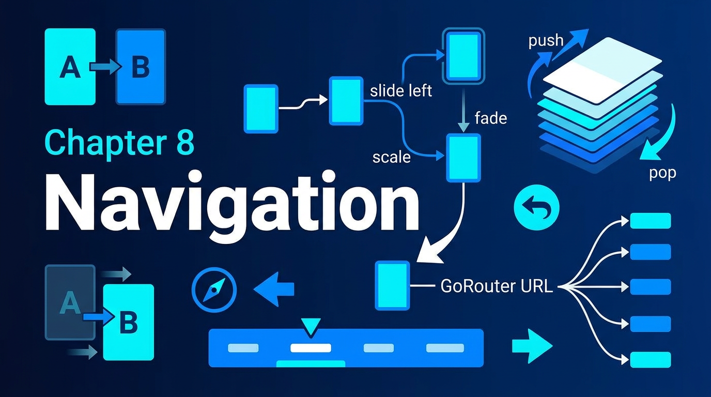

# 第八章：导航与路由



导航是移动应用的核心骨架。Flutter 提供了一套以 `Navigator` 为中心的路由体系，从命令式的 `push/pop`（Navigator 1.0）到声明式的 `Router`（Navigator 2.0），再到社区标准的 `GoRouter`，形成了完整的路由解决方案。本章将从底层原理出发，逐层剖析这些 Widget 的设计与实现。

## 8.1 Navigator — 路由栈管理

`Navigator` 是 Flutter 路由体系的基石。它管理一个路由栈（route stack），通过入栈（push）和出栈（pop）操作实现页面间的跳转。

**完整示例：**

```dart
import 'package:flutter/material.dart';

void main() => runApp(const NavigatorDemoApp());

class NavigatorDemoApp extends StatelessWidget {
  const NavigatorDemoApp({super.key});

  @override
  Widget build(BuildContext context) {
    return MaterialApp(
      title: 'Navigator Demo',
      initialRoute: '/',
      routes: {
        '/': (context) => const HomePage(),
        '/second': (context) => const SecondPage(),
        '/third': (context) => const ThirdPage(),
      },
    );
  }
}

class HomePage extends StatelessWidget {
  const HomePage({super.key});

  @override
  Widget build(BuildContext context) {
    return Scaffold(
      appBar: AppBar(title: const Text('首页')),
      body: Center(
        child: Column(
          mainAxisAlignment: MainAxisAlignment.center,
          children: [
            ElevatedButton(
              onPressed: () => Navigator.of(context).pushNamed('/second'),
              child: const Text('pushNamed → 第二页'),
            ),
            const SizedBox(height: 16),
            ElevatedButton(
              onPressed: () => Navigator.of(context).push(
                MaterialPageRoute(builder: (_) => const SecondPage()),
              ),
              child: const Text('push(MaterialPageRoute) → 第二页'),
            ),
            const SizedBox(height: 16),
            ElevatedButton(
              onPressed: () => Navigator.of(context).push(
                PageRouteBuilder(
                  pageBuilder: (_, animation, __) => const SecondPage(),
                  transitionsBuilder: (_, animation, __, child) {
                    return FadeTransition(opacity: animation, child: child);
                  },
                  transitionDuration: const Duration(milliseconds: 500),
                ),
              ),
              child: const Text('PageRouteBuilder(淡入) → 第二页'),
            ),
          ],
        ),
      ),
    );
  }
}

class SecondPage extends StatelessWidget {
  const SecondPage({super.key});

  @override
  Widget build(BuildContext context) {
    return Scaffold(
      appBar: AppBar(title: const Text('第二页')),
      body: Center(
        child: Column(
          mainAxisAlignment: MainAxisAlignment.center,
          children: [
            ElevatedButton(
              onPressed: () => Navigator.of(context).pushReplacementNamed('/third'),
              child: const Text('pushReplacement → 第三页(替换当前)'),
            ),
            const SizedBox(height: 16),
            ElevatedButton(
              onPressed: () => Navigator.of(context).pushNamedAndRemoveUntil(
                '/third',
                (route) => false, // 移除所有之前的路由
              ),
              child: const Text('pushNamedAndRemoveUntil → 第三页'),
            ),
            const SizedBox(height: 16),
            ElevatedButton(
              onPressed: () => Navigator.of(context).pop(),
              child: const Text('pop 返回首页'),
            ),
          ],
        ),
      ),
    );
  }
}

class ThirdPage extends StatelessWidget {
  const ThirdPage({super.key});

  @override
  Widget build(BuildContext context) {
    return Scaffold(
      appBar: AppBar(title: const Text('第三页')),
      body: Center(
        child: ElevatedButton(
          onPressed: () => Navigator.of(context).popUntil((route) => route.isFirst),
          child: const Text('popUntil → 回到首页'),
        ),
      ),
    );
  }
}
```

**原理解析：**

`Navigator` 本质上是一个 `StatefulWidget`，其 `State`（`NavigatorState`）内部维护了一个 `List<_RouteEntry>` 作为路由栈。每次 `push` 操作时，新路由被追加到栈顶，并触发进入动画（由 `Route.createAnimation()` 驱动）；`pop` 操作则移除栈顶路由并执行退出动画。

关键设计：`Navigator` 的渲染依赖 `Overlay` Widget。每个 `Route` 对应一个或多个 `OverlayEntry`，这些 entry 按照栈顺序层叠在 `Overlay` 中。这意味着路由切换实际上是在同一个 `Overlay` 中增删 `OverlayEntry`，而不是替换整个页面。这种设计允许 Dialog、BottomSheet 等浮动组件也作为独立的 `OverlayEntry` 插入，与路由栈共存。

`MaterialPageRoute` 和 `CupertinoPageRoute` 的区别在于转场动画：

- **MaterialPageRoute**：在 Android 上采用从底部滑入 + 渐显效果，返回时反向；在 iOS 上行为与 `CupertinoPageRoute` 一致
- **CupertinoPageRoute**：始终采用 iOS 风格的从右侧滑入，并带有视差效果（前一页向左移动约 1/3 宽度）

`PageRouteBuilder` 则提供了完全自定义转场动画的能力。`pageBuilder` 构建页面内容，`transitionsBuilder` 接收一个 `Animation<double>`（值从 0.0 到 1.0），开发者可以组合 `FadeTransition`、`SlideTransition`、`ScaleTransition` 等实现任意转场效果。

**Navigator 2.0（声明式路由）** 引入了 `pages` 和 `onPopPage` 参数，将路由栈变为由应用状态驱动的声明式列表。`Router` Widget 配合 `RouteInformationParser` 和 `RouterDelegate`，使深链接（deep linking）和浏览器 URL 同步成为可能。

## 8.2 TabBar / TabBarView / TabController

`TabBar` 和 `TabBarView` 是 Material Design 中标签页导航的标准实现，通过 `TabController` 实现同步联动。

**完整示例：**

```dart
import 'package:flutter/material.dart';

void main() => runApp(const TabDemoApp());

class TabDemoApp extends StatelessWidget {
  const TabDemoApp({super.key});

  @override
  Widget build(BuildContext context) {
    return MaterialApp(
      title: 'TabBar Demo',
      home: const TabDemoPage(),
    );
  }
}

class TabDemoPage extends StatefulWidget {
  const TabDemoPage({super.key});

  @override
  State<TabDemoPage> createState() => _TabDemoPageState();
}

class _TabDemoPageState extends State<TabDemoPage>
    with SingleTickerProviderStateMixin {
  late final TabController _tabController;

  @override
  void initState() {
    super.initState();
    _tabController = TabController(
      length: 3,
      initialIndex: 0,
      vsync: this,
    );
    _tabController.addListener(() {
      if (!_tabController.indexIsChanging) {
        debugPrint('Tab changed to: ${_tabController.index}');
      }
    });
  }

  @override
  void dispose() {
    _tabController.dispose();
    super.dispose();
  }

  @override
  Widget build(BuildContext context) {
    return Scaffold(
      appBar: AppBar(
        title: const Text('TabBar Demo'),
        bottom: TabBar(
          controller: _tabController,
          isScrollable: false,
          labelColor: Colors.white,
          unselectedLabelColor: Colors.white70,
          indicatorColor: Colors.amber,
          indicatorWeight: 3.0,
          indicatorSize: TabBarIndicatorSize.label,
          tabs: const [
            Tab(
              icon: Icon(Icons.home),
              text: '首页',
            ),
            Tab(
              icon: Icon(Icons.search),
              text: '搜索',
            ),
            Tab(
              icon: Icon(Icons.person),
              text: '我的',
            ),
          ],
        ),
      ),
      body: TabBarView(
        controller: _tabController,
        physics: const BouncingScrollPhysics(),
        children: const [
          Center(child: Text('首页内容', style: TextStyle(fontSize: 24))),
          Center(child: Text('搜索内容', style: TextStyle(fontSize: 24))),
          Center(child: Text('我的内容', style: TextStyle(fontSize: 24))),
        ],
      ),
    );
  }
}
```

**简化用法（DefaultTabController）：**

```dart
import 'package:flutter/material.dart';

void main() => runApp(const DefaultTabControllerDemo());

class DefaultTabControllerDemo extends StatelessWidget {
  const DefaultTabControllerDemo({super.key});

  @override
  Widget build(BuildContext context) {
    return MaterialApp(
      home: DefaultTabController(
        length: 3,
        child: Scaffold(
          appBar: AppBar(
            title: const Text('DefaultTabController'),
            bottom: const TabBar(
              tabs: [
                Tab(text: 'Tab 1'),
                Tab(text: 'Tab 2'),
                Tab(text: 'Tab 3'),
              ],
            ),
          ),
          body: const TabBarView(
            children: [
              Center(child: Text('Page 1')),
              Center(child: Text('Page 2')),
              Center(child: Text('Page 3')),
            ],
          ),
        ),
      ),
    );
  }
}
```

**原理解析：**

`TabController` 继承自 `ChangeNotifier`，是整个 Tab 系统的协调中枢。它维护 `index`（当前索引）和 `previousIndex`（前一索引），并通过 `animation` 属性（一个 `Animation<double>`）暴露连续的滑动进度值。

`TabBar` 的指示器绘制由内部类 `_IndicatorPainter` 负责。该 Painter 监听 `TabController` 的动画值，在每一帧重新计算指示器的位置和宽度。当 `indicatorSize` 设为 `TabBarIndicatorSize.label` 时，指示器宽度等于标签文字宽度；设为 `TabBarIndicatorSize.tab` 时则等于整个 Tab 的宽度。

`TabBarView` 内部使用 `PageView` 实现水平滑动。当用户手指拖动时，`PageView` 的 `ScrollController` 将滚动偏移同步给 `TabController` 的 `offset` 属性，进而驱动 `TabBar` 的指示器平滑移动。这种设计保证了即使手指在 `TabBarView` 上滑动（而非点击 `TabBar`），指示器也能实时跟随。

`DefaultTabController` 通过 `InheritedWidget`（`_TabControllerScope`）将 `TabController` 注入 Widget 树，使得 `TabBar` 和 `TabBarView` 可以通过 `TabController.of(context)` 自动获取，无需手动传递。

## 8.3 PageView / PageController

`PageView` 提供水平或垂直的全屏翻页视图，是实现引导页、图片轮播、卡片滑动的核心 Widget。

**完整示例：**

```dart
import 'package:flutter/material.dart';

void main() => runApp(const PageViewDemoApp());

class PageViewDemoApp extends StatelessWidget {
  const PageViewDemoApp({super.key});

  @override
  Widget build(BuildContext context) {
    return MaterialApp(
      title: 'PageView Demo',
      home: const PageViewDemoPage(),
    );
  }
}

class PageViewDemoPage extends StatefulWidget {
  const PageViewDemoPage({super.key});

  @override
  State<PageViewDemoPage> createState() => _PageViewDemoPageState();
}

class _PageViewDemoPageState extends State<PageViewDemoPage> {
  late final PageController _pageController;
  int _currentPage = 0;

  final List<Color> _colors = [
    Colors.blue,
    Colors.green,
    Colors.orange,
    Colors.purple,
    Colors.red,
  ];

  @override
  void initState() {
    super.initState();
    _pageController = PageController(
      initialPage: 0,
      viewportFraction: 0.85, // Carousel 效果
      keepPage: true,
    );
  }

  @override
  void dispose() {
    _pageController.dispose();
    super.dispose();
  }

  @override
  Widget build(BuildContext context) {
    return Scaffold(
      appBar: AppBar(
        title: Text('PageView Demo — Page $_currentPage'),
      ),
      body: Column(
        children: [
          const SizedBox(height: 20),
          SizedBox(
            height: 300,
            child: PageView.builder(
              controller: _pageController,
              scrollDirection: Axis.horizontal,
              itemCount: _colors.length,
              pageSnapping: true,
              onPageChanged: (index) {
                setState(() => _currentPage = index);
              },
              itemBuilder: (context, index) {
                return Container(
                  margin: const EdgeInsets.symmetric(horizontal: 8),
                  decoration: BoxDecoration(
                    color: _colors[index],
                    borderRadius: BorderRadius.circular(16),
                  ),
                  child: Center(
                    child: Text(
                      'Page ${index + 1}',
                      style: const TextStyle(
                        fontSize: 32,
                        color: Colors.white,
                        fontWeight: FontWeight.bold,
                      ),
                    ),
                  ),
                );
              },
            ),
          ),
          const SizedBox(height: 24),
          Row(
            mainAxisAlignment: MainAxisAlignment.center,
            children: List.generate(_colors.length, (index) {
              return AnimatedContainer(
                duration: const Duration(milliseconds: 200),
                margin: const EdgeInsets.symmetric(horizontal: 4),
                width: _currentPage == index ? 24 : 8,
                height: 8,
                decoration: BoxDecoration(
                  color: _currentPage == index
                      ? Colors.blue
                      : Colors.grey.shade300,
                  borderRadius: BorderRadius.circular(4),
                ),
              );
            }),
          ),
          const SizedBox(height: 24),
          Row(
            mainAxisAlignment: MainAxisAlignment.center,
            children: [
              ElevatedButton(
                onPressed: () => _pageController.previousPage(
                  duration: const Duration(milliseconds: 300),
                  curve: Curves.easeInOut,
                ),
                child: const Text('上一页'),
              ),
              const SizedBox(width: 16),
              ElevatedButton(
                onPressed: () => _pageController.nextPage(
                  duration: const Duration(milliseconds: 300),
                  curve: Curves.easeInOut,
                ),
                child: const Text('下一页'),
              ),
            ],
          ),
        ],
      ),
    );
  }
}
```

**原理解析：**

`PageView` 底层是一个 `Scrollable` Widget，配合 `PageScrollPhysics` 实现吸附效果。`PageScrollPhysics` 继承自 `ScrollPhysics`，重写了 `applyPhysicsToUserOffset` 和 `createBallisticSimulation` 方法，使得每次滑动手势结束后，页面自动对齐到最近的整页位置。

`PageController` 继承自 `ScrollController`，增加了 `page` 属性（当前浮点页码）和 `viewportFraction` 参数。`viewportFraction` 控制每页占据视口的比例（0.0~1.0），小于 1.0 时相邻页面会部分可见，形成 Carousel/轮播效果。

`PageView.builder` 采用懒加载构建模式（类似 `ListView.builder`），只有视口范围内的页面会被实例化。`PageView.custom` 则接受自定义的 `SliverChildDelegate`，提供最精细的控制。

`allowImplicitScrolling` 设为 `true` 时，当前页的相邻页面也会被提前构建，这在需要预加载图片的场景中非常有用。

## 8.4 BottomNavigationBar 与页面切换

`BottomNavigationBar` 配合 `IndexedStack` 或 `PageView` 是底部 Tab 导航的经典模式。关键挑战在于状态保持。

**完整示例：**

```dart
import 'package:flutter/material.dart';

void main() => runApp(const BottomNavDemoApp());

class BottomNavDemoApp extends StatelessWidget {
  const BottomNavDemoApp({super.key});

  @override
  Widget build(BuildContext context) {
    return MaterialApp(
      title: 'BottomNav Demo',
      home: const BottomNavPage(),
    );
  }
}

class BottomNavPage extends StatefulWidget {
  const BottomNavPage({super.key});

  @override
  State<BottomNavPage> createState() => _BottomNavPageState();
}

class _BottomNavPageState extends State<BottomNavPage> {
  int _currentIndex = 0;
  late final PageController _pageController;

  @override
  void initState() {
    super.initState();
    _pageController = PageController();
  }

  @override
  void dispose() {
    _pageController.dispose();
    super.dispose();
  }

  @override
  Widget build(BuildContext context) {
    return Scaffold(
      body: IndexedStack(
        index: _currentIndex,
        children: const [
          _CounterPage(title: '首页', color: Colors.blue),
          _CounterPage(title: '发现', color: Colors.green),
          _CounterPage(title: '消息', color: Colors.orange),
          _CounterPage(title: '我的', color: Colors.purple),
        ],
      ),
      bottomNavigationBar: BottomNavigationBar(
        currentIndex: _currentIndex,
        type: BottomNavigationBarType.fixed,
        selectedItemColor: Colors.blue,
        unselectedItemColor: Colors.grey,
        onTap: (index) {
          setState(() => _currentIndex = index);
        },
        items: const [
          BottomNavigationBarItem(icon: Icon(Icons.home), label: '首页'),
          BottomNavigationBarItem(icon: Icon(Icons.explore), label: '发现'),
          BottomNavigationBarItem(icon: Icon(Icons.message), label: '消息'),
          BottomNavigationBarItem(icon: Icon(Icons.person), label: '我的'),
        ],
      ),
    );
  }
}

/// 带计数器的子页面，用于演示状态保持
class _CounterPage extends StatefulWidget {
  final String title;
  final Color color;

  const _CounterPage({required this.title, required this.color});

  @override
  State<_CounterPage> createState() => _CounterPageState();
}

class _CounterPageState extends State<_CounterPage>
    with AutomaticKeepAliveClientMixin {
  int _counter = 0;

  @override
  bool get wantKeepAlive => true;

  @override
  Widget build(BuildContext context) {
    super.build(context); // AutomaticKeepAliveClientMixin 要求
    return Container(
      color: widget.color.withOpacity(0.1),
      child: Center(
        child: Column(
          mainAxisAlignment: MainAxisAlignment.center,
          children: [
            Text(widget.title,
                style: TextStyle(fontSize: 28, color: widget.color)),
            const SizedBox(height: 16),
            Text('计数: $_counter', style: const TextStyle(fontSize: 20)),
            const SizedBox(height: 16),
            ElevatedButton(
              onPressed: () => setState(() => _counter++),
              child: const Text('+1'),
            ),
          ],
        ),
      ),
    );
  }
}
```

**状态保持方案对比：**

| 方案 | 原理 | 适用场景 |
|------|------|----------|
| `IndexedStack` | 同时构建所有子页面，通过 `Stack` 的显示/隐藏切换 | 页面数少（3-5 个），内存可接受 |
| `PageView` + `AutomaticKeepAliveClientMixin` | 按需构建，通过 KeepAlive 机制保持已访问页面的状态 | 页面数多，或需要滑动切换 |
| 无状态保持 | 每次切换都重建 | 页面不需要保持状态 |

`IndexedStack` 直接继承自 `Stack`，通过 `_renderObject.index` 控制哪个子组件可见。所有子组件在 `IndexedStack` 首次构建时即被实例化并保持在 Element 树中，因此状态天然保持。

`AutomaticKeepAliveClientMixin` 则是 `PageView` / `ListView` 等懒加载容器中的状态保持方案。子 Widget 通过 `wantKeepAlive => true` 向父级 `Sliver` 发送 `KeepAlive` 通知，阻止父级在子 Widget 滚出视口时回收其 Element 和 State。

## 8.5 GoRouter（声明式路由）

`GoRouter` 是目前 Flutter 社区最广泛使用的声明式路由库，基于 Navigator 2.0 API 构建，将 URL 路径映射到 Widget 树。

**完整示例（需要添加 `go_router` 依赖）：**

```dart
import 'package:flutter/material.dart';
import 'package:go_router/go_router.dart';

void main() => runApp(const GoRouterDemoApp());

final GoRouter _router = GoRouter(
  initialLocation: '/',
  debugLogDiagnostics: true,
  redirect: (context, state) {
    // 全局重定向逻辑，例如：未登录跳转到登录页
    final isLoggedIn = true; // 替换为实际登录状态
    final isLoginPage = state.matchedLocation == '/login';
    if (!isLoggedIn && !isLoginPage) return '/login';
    if (isLoggedIn && isLoginPage) return '/';
    return null;
  },
  routes: [
    GoRoute(
      path: '/',
      builder: (context, state) => const HomeScreen(),
      routes: [
        GoRoute(
          path: 'detail/:id',
          builder: (context, state) {
            final id = state.pathParameters['id']!;
            return DetailScreen(id: id);
          },
        ),
        GoRoute(
          path: 'settings',
          pageBuilder: (context, state) => CustomTransitionPage(
            key: state.pageKey,
            child: const SettingsScreen(),
            transitionsBuilder: (context, animation, _, child) {
              return FadeTransition(opacity: animation, child: child);
            },
          ),
        ),
      ],
    ),
    GoRoute(
      path: '/login',
      builder: (context, state) => const LoginScreen(),
    ),
    ShellRoute(
      builder: (context, state, child) => ScaffoldWithNavBar(child: child),
      routes: [
        GoRoute(
          path: '/shop',
          builder: (context, state) => const ShopScreen(),
        ),
        GoRoute(
          path: '/cart',
          builder: (context, state) => const CartScreen(),
        ),
        GoRoute(
          path: '/profile',
          builder: (context, state) => const ProfileScreen(),
        ),
      ],
    ),
  ],
);

class GoRouterDemoApp extends StatelessWidget {
  const GoRouterDemoApp({super.key});

  @override
  Widget build(BuildContext context) {
    return MaterialApp.router(
      title: 'GoRouter Demo',
      routerConfig: _router,
    );
  }
}

class HomeScreen extends StatelessWidget {
  const HomeScreen({super.key});

  @override
  Widget build(BuildContext context) {
    return Scaffold(
      appBar: AppBar(title: const Text('首页')),
      body: Center(
        child: Column(
          mainAxisAlignment: MainAxisAlignment.center,
          children: [
            ElevatedButton(
              onPressed: () => context.push('/detail/42'),
              child: const Text('push → 详情页(ID=42)'),
            ),
            const SizedBox(height: 12),
            ElevatedButton(
              onPressed: () => context.go('/settings'),
              child: const Text('go → 设置页'),
            ),
            const SizedBox(height: 12),
            ElevatedButton(
              onPressed: () => context.go('/shop'),
              child: const Text('go → 商店(ShellRoute)'),
            ),
          ],
        ),
      ),
    );
  }
}

class DetailScreen extends StatelessWidget {
  final String id;
  const DetailScreen({super.key, required this.id});

  @override
  Widget build(BuildContext context) {
    return Scaffold(
      appBar: AppBar(title: Text('详情 #$id')),
      body: Center(
        child: Column(
          mainAxisAlignment: MainAxisAlignment.center,
          children: [
            Text('商品 ID: $id', style: const TextStyle(fontSize: 24)),
            const SizedBox(height: 16),
            ElevatedButton(
              onPressed: () => context.pop(),
              child: const Text('返回'),
            ),
          ],
        ),
      ),
    );
  }
}

class SettingsScreen extends StatelessWidget {
  const SettingsScreen({super.key});

  @override
  Widget build(BuildContext context) {
    return Scaffold(
      appBar: AppBar(title: const Text('设置')),
      body: const Center(child: Text('设置页面内容')),
    );
  }
}

class LoginScreen extends StatelessWidget {
  const LoginScreen({super.key});

  @override
  Widget build(BuildContext context) {
    return Scaffold(
      body: Center(
        child: ElevatedButton(
          onPressed: () => context.go('/'),
          child: const Text('登录并跳转首页'),
        ),
      ),
    );
  }
}

class ScaffoldWithNavBar extends StatelessWidget {
  final Widget child;
  const ScaffoldWithNavBar({super.key, required this.child});

  @override
  Widget build(BuildContext context) {
    return Scaffold(
      body: child,
      bottomNavigationBar: BottomNavigationBar(
        currentIndex: _currentIndex(context),
        onTap: (index) {
          switch (index) {
            case 0:
              context.go('/shop');
              break;
            case 1:
              context.go('/cart');
              break;
            case 2:
              context.go('/profile');
              break;
          }
        },
        items: const [
          BottomNavigationBarItem(icon: Icon(Icons.store), label: '商店'),
          BottomNavigationBarItem(icon: Icon(Icons.shopping_cart), label: '购物车'),
          BottomNavigationBarItem(icon: Icon(Icons.person), label: '我的'),
        ],
      ),
    );
  }

  int _currentIndex(BuildContext context) {
    final location = GoRouterState.of(context).matchedLocation;
    if (location.startsWith('/shop')) return 0;
    if (location.startsWith('/cart')) return 1;
    if (location.startsWith('/profile')) return 2;
    return 0;
  }
}

class ShopScreen extends StatelessWidget {
  const ShopScreen({super.key});
  @override
  Widget build(BuildContext context) {
    return const Center(child: Text('商店', style: TextStyle(fontSize: 28)));
  }
}

class CartScreen extends StatelessWidget {
  const CartScreen({super.key});
  @override
  Widget build(BuildContext context) {
    return const Center(child: Text('购物车', style: TextStyle(fontSize: 28)));
  }
}

class ProfileScreen extends StatelessWidget {
  const ProfileScreen({super.key});
  @override
  Widget build(BuildContext context) {
    return const Center(child: Text('我的', style: TextStyle(fontSize: 28)));
  }
}
```

**原理解析：**

`GoRouter` 建立在 Navigator 2.0 的三大支柱之上：

1. **`RouteInformationParser`**：将平台传入的 URL（`RouteInformation`）解析为应用内部的路由配置对象
2. **`RouterDelegate`**：将路由配置对象转换为 Widget 树，管理 `Navigator` 的 `pages` 列表
3. **`Router`**：顶层 Widget，监听 URL 变化并协调上述两者

`GoRouter` 内部实现了 `GoRouterDelegate`（继承 `RouterDelegate`）和 `GoRouteInformationParser`。当 URL 变化时（用户操作或系统返回按钮），`GoRouteInformationParser.parse()` 将 URL 与路由表进行模式匹配，生成 `RouteMatchList`；`GoRouterDelegate` 根据匹配结果构建 `Page` 列表传给 `Navigator`。

`context.go()` 与 `context.push()` 的本质区别：

- `go()` 是 **替换整个路由栈**，类似 Web 浏览器的 `location.replace()`，栈中只保留目标路由
- `push()` 是在 **当前栈顶追加** 新路由，类似 `history.pushState()`

`ShellRoute` 实现嵌套导航：它创建一个共享的外壳 Widget（通常是带底部导航栏的 `Scaffold`），其子路由渲染在外壳的 `child` 位置。`StatefulShellRoute` 进一步支持保持每个分支的独立导航栈。

与 Navigator 1.0 的范式区别：Navigator 1.0 是命令式（`push`/`pop` 直接操作栈），路由状态隐式存储在 Navigator 内部；GoRouter 是声明式（URL → Widget 映射），路由状态完全由 URL 决定，可序列化、可恢复、支持深链接。

---
