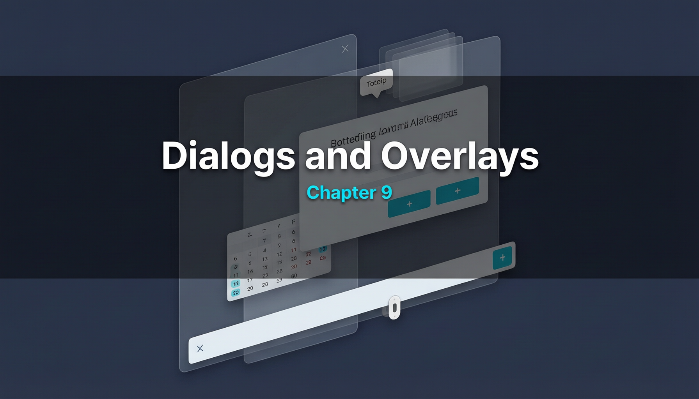

# 第九章：对话框与浮层



对话框和浮层是 UI 中用于临时展示信息或收集用户输入的覆盖式组件。Flutter 通过 Navigator + Overlay 机制实现这些功能。

---

## 9.1 AlertDialog / SimpleDialog / Dialog

### 简要说明

`AlertDialog` 是标准警告对话框，`SimpleDialog` 用于展示简单选项列表，`Dialog` 是它们的基类容器。

### 完整代码示例

```dart
import 'package:flutter/material.dart';

void main() => runApp(const DialogDemoApp());

class DialogDemoApp extends StatelessWidget {
  const DialogDemoApp({super.key});

  @override
  Widget build(BuildContext context) {
    return MaterialApp(
      title: 'Dialog Demo',
      theme: ThemeData(useMaterial3: true, colorSchemeSeed: Colors.deepPurple),
      home: const DialogDemoPage(),
    );
  }
}

class DialogDemoPage extends StatelessWidget {
  const DialogDemoPage({super.key});

  @override
  Widget build(BuildContext context) {
    return Scaffold(
      appBar: AppBar(title: const Text('Dialog 演示')),
      body: Center(
        child: Column(
          mainAxisAlignment: MainAxisAlignment.center,
          children: [
            // AlertDialog
            ElevatedButton(
              onPressed: () => _showAlertDialog(context),
              child: const Text('显示 AlertDialog'),
            ),
            const SizedBox(height: 16),

            // SimpleDialog
            ElevatedButton(
              onPressed: () => _showSimpleDialog(context),
              child: const Text('显示 SimpleDialog'),
            ),
            const SizedBox(height: 16),

            // 自定义 Dialog
            ElevatedButton(
              onPressed: () => _showCustomDialog(context),
              child: const Text('显示自定义 Dialog'),
            ),
            const SizedBox(height: 16),

            // showGeneralDialog
            ElevatedButton(
              onPressed: () => _showGeneralDialog(context),
              child: const Text('showGeneralDialog'),
            ),
          ],
        ),
      ),
    );
  }

  void _showAlertDialog(BuildContext context) {
    showDialog<String>(
      context: context,
      builder: (context) => AlertDialog(
        title: const Text('删除确认'),
        content: const Text('确定要删除这个项目吗？此操作不可撤销。'),
        shape: RoundedRectangleBorder(borderRadius: BorderRadius.circular(16)),
        actions: [
          TextButton(
            onPressed: () => Navigator.pop(context, 'cancel'),
            child: const Text('取消'),
          ),
          FilledButton(
            onPressed: () => Navigator.pop(context, 'delete'),
            style: FilledButton.styleFrom(backgroundColor: Colors.red),
            child: const Text('删除'),
          ),
        ],
      ),
    ).then((value) {
      if (value != null) {
        debugPrint('用户选择: $value');
      }
    });
  }

  void _showSimpleDialog(BuildContext context) {
    showDialog<String>(
      context: context,
      builder: (context) => SimpleDialog(
        title: const Text('选择语言'),
        children: [
          SimpleDialogOption(
            onPressed: () => Navigator.pop(context, 'Dart'),
            child: const Text('Dart'),
          ),
          SimpleDialogOption(
            onPressed: () => Navigator.pop(context, 'Kotlin'),
            child: const Text('Kotlin'),
          ),
          SimpleDialogOption(
            onPressed: () => Navigator.pop(context, 'Swift'),
            child: const Text('Swift'),
          ),
        ],
      ),
    ).then((value) {
      if (value != null) {
        ScaffoldMessenger.of(context).showSnackBar(
          SnackBar(content: Text('选择了: $value')),
        );
      }
    });
  }

  void _showCustomDialog(BuildContext context) {
    showDialog(
      context: context,
      builder: (context) => Dialog(
        shape: RoundedRectangleBorder(borderRadius: BorderRadius.circular(20)),
        child: Padding(
          padding: const EdgeInsets.all(24),
          child: Column(
            mainAxisSize: MainAxisSize.min,
            children: [
              const Icon(Icons.star, size: 48, color: Colors.amber),
              const SizedBox(height: 16),
              const Text('评分', style: TextStyle(fontSize: 20, fontWeight: FontWeight.bold)),
              const SizedBox(height: 8),
              const Text('请为本次体验评分'),
              const SizedBox(height: 16),
              Row(
                mainAxisAlignment: MainAxisAlignment.center,
                children: List.generate(5, (index) => const Icon(Icons.star_border, size: 36)),
              ),
              const SizedBox(height: 16),
              FilledButton(
                onPressed: () => Navigator.pop(context),
                child: const Text('提交'),
              ),
            ],
          ),
        ),
      ),
    );
  }

  void _showGeneralDialog(BuildContext context) {
    showGeneralDialog(
      context: context,
      barrierDismissible: true,
      barrierLabel: 'Dismiss',
      barrierColor: Colors.black54,
      transitionDuration: const Duration(milliseconds: 300),
      pageBuilder: (context, anim1, anim2) {
        return Center(
          child: Material(
            color: Colors.transparent,
            child: Container(
              width: 300,
              padding: const EdgeInsets.all(24),
              decoration: BoxDecoration(
                color: Theme.of(context).colorScheme.surface,
                borderRadius: BorderRadius.circular(16),
              ),
              child: Column(
                mainAxisSize: MainAxisSize.min,
                children: [
                  const Text('showGeneralDialog', style: TextStyle(fontSize: 18, fontWeight: FontWeight.bold)),
                  const SizedBox(height: 12),
                  const Text('这是完全自定义的对话框，可以控制所有动画和样式。'),
                  const SizedBox(height: 16),
                  ElevatedButton(
                    onPressed: () => Navigator.pop(context),
                    child: const Text('关闭'),
                  ),
                ],
              ),
            ),
          ),
        );
      },
      transitionBuilder: (context, anim1, anim2, child) {
        return ScaleTransition(
          scale: CurvedAnimation(parent: anim1, curve: Curves.easeOut),
          child: child,
        );
      },
    );
  }
}
```

### 原理解析

**Dialog 通过 Navigator.push 实现**：`showDialog` 的核心实现是 `Navigator.push` 一个 `DialogRoute`（继承自 `PopupRoute`）。这意味着：

1. **Dialog 是一个路由**：它会出现在 Navigator 的路由栈顶部
2. **返回数据**：`Navigator.pop(context, result)` 可以将结果返回给调用方。`showDialog` 返回 `Future<T?>` 来接收这个结果
3. **barrier（遮罩）**：`DialogRoute` 的 `barrierColor` 产生半透明背景，`barrierDismissible` 控制点击遮罩是否关闭

**Dialog 的渲染结构**：

```
Navigator
  └── Overlay
       └── _Theatre (barrier + dialog content)
            ├── ModalBarrier (半透明遮罩)
            └── Dialog Widget
                 └── AnimatedBuilder (入场动画)
                      └── Material (elevation + shape)
                           └── content
```

**showGeneralDialog vs showDialog**：

- `showDialog` 是 `showGeneralDialog` 的便捷封装，自动提供了 Material Design 的默认样式和动画（淡入淡出）
- `showGeneralDialog` 允许完全控制：自定义 `barrierColor`、`transitionDuration`、`transitionBuilder`（入场/出场动画）。适合需要非标准动画的场景

**PageTransitionsTheme**：`DialogRoute` 默认的转场动画受 `PageTransitionsTheme` 影响。在 Android 上默认是 `FadeUpwardsPageTransitionsBuilder`（淡入 + 微微上移），在 iOS 上是 `CupertinoPageTransitionsBuilder`。Dialog 使用专门的 `_DialogTransition` 而非页面转场动画。

---

## 9.2 BottomSheet

### 简要说明

`showModalBottomSheet` 显示模态底部面板，`showBottomSheet` 显示持久底部面板，`DraggableScrollableSheet` 提供可拖拽调整的底部面板。

### 完整代码示例

```dart
import 'package:flutter/material.dart';

void main() => runApp(const BottomSheetDemoApp());

class BottomSheetDemoApp extends StatelessWidget {
  const BottomSheetDemoApp({super.key});

  @override
  Widget build(BuildContext context) {
    return MaterialApp(
      title: 'BottomSheet Demo',
      theme: ThemeData(useMaterial3: true, colorSchemeSeed: Colors.green),
      home: const BottomSheetDemoPage(),
    );
  }
}

class BottomSheetDemoPage extends StatelessWidget {
  const BottomSheetDemoPage({super.key});

  @override
  Widget build(BuildContext context) {
    return Scaffold(
      appBar: AppBar(title: const Text('BottomSheet 演示')),
      body: Center(
        child: Column(
          mainAxisAlignment: MainAxisAlignment.center,
          children: [
            ElevatedButton(
              onPressed: () => _showModalBottomSheet(context),
              child: const Text('Modal BottomSheet'),
            ),
            const SizedBox(height: 16),
            ElevatedButton(
              onPressed: () => _showDraggableSheet(context),
              child: const Text('DraggableScrollableSheet'),
            ),
          ],
        ),
      ),
    );
  }

  void _showModalBottomSheet(BuildContext context) {
    showModalBottomSheet(
      context: context,
      isScrollControlled: true,
      shape: const RoundedRectangleBorder(
        borderRadius: BorderRadius.vertical(top: Radius.circular(20)),
      ),
      backgroundColor: Theme.of(context).colorScheme.surface,
      builder: (context) {
        return DraggableScrollableSheet(
          initialChildSize: 0.5,
          minChildSize: 0.25,
          maxChildSize: 0.9,
          expand: false,
          builder: (context, scrollController) {
            return Column(
              children: [
                // 拖拽把手
                Center(
                  child: Container(
                    margin: const EdgeInsets.symmetric(vertical: 8),
                    width: 40,
                    height: 4,
                    decoration: BoxDecoration(
                      color: Colors.grey.shade400,
                      borderRadius: BorderRadius.circular(2),
                    ),
                  ),
                ),
                const Padding(
                  padding: EdgeInsets.all(16),
                  child: Text('选择操作', style: TextStyle(fontSize: 18, fontWeight: FontWeight.bold)),
                ),
                Expanded(
                  child: ListView.builder(
                    controller: scrollController,
                    itemCount: 20,
                    itemBuilder: (context, index) {
                      return ListTile(
                        leading: CircleAvatar(child: Text('${index + 1}')),
                        title: Text('选项 ${index + 1}'),
                        onTap: () {
                          Navigator.pop(context, index);
                        },
                      );
                    },
                  ),
                ),
              ],
            );
          },
        );
      },
    ).then((value) {
      if (value != null) {
        ScaffoldMessenger.of(context).showSnackBar(
          SnackBar(content: Text('选择了选项 ${value + 1}')),
        );
      }
    });
  }

  void _showDraggableSheet(BuildContext context) {
    showModalBottomSheet(
      context: context,
      isScrollControlled: true,
      backgroundColor: Colors.transparent,
      builder: (context) {
        return DraggableScrollableSheet(
          initialChildSize: 0.4,
          minChildSize: 0.2,
          maxChildSize: 0.8,
          builder: (context, scrollController) {
            return Container(
              decoration: const BoxDecoration(
                color: Colors.white,
                borderRadius: BorderRadius.vertical(top: Radius.circular(20)),
              ),
              child: ListView.builder(
                controller: scrollController,
                itemCount: 30,
                itemBuilder: (context, index) => ListTile(
                  title: Text('项目 $index'),
                  leading: const Icon(Icons.star),
                ),
              ),
            );
          },
        );
      },
    );
  }
}
```

### 原理解析

**showModalBottomSheet 的实现**：与 `showDialog` 类似，`showModalBottomSheet` 通过 `Navigator.push` 一个 `_ModalBottomSheetRoute`。这个路由：

1. 使用底部到顶部的 slide 动画（而非 Dialog 的 fade 动画）
2. 支持手势向下拖拽关闭（`_ModalBottomSheetRoute` 内部使用 `GestureDetector` 监听垂直拖拽）
3. `isScrollControlled: true` 允许 BottomSheet 占据整个屏幕高度（否则默认最多占屏幕的 9/16）

**DraggableScrollableSheet 的工作原理**：`DraggableScrollableSheet` 内部使用 `DraggableScrollableController` 管理当前的尺寸比例（`size`，范围 0~1，相对于父容器的比例）。核心机制：

1. **尺寸变化**：拖拽时，手指的垂直位移转换为 `size` 的变化。`size` 被约束在 `minChildSize` 和 `maxChildSize` 之间
2. **与滚动协调**：`DraggableScrollableSheet` 提供 `scrollController` 给子列表。当列表滚动到顶部（`scrollOffset == 0`）且用户继续向下拖拽时，手势被 Sheet 接管，开始缩小 Sheet 尺寸
3. **Notification 协调**：内部通过 `ScrollNotification` 监听列表的滚动状态，判断是否应该转交手势控制权

**Persistent BottomSheet vs Modal BottomSheet**：

- **Modal**（`showModalBottomSheet`）：推入路由栈，有 barrier，阻断底层交互
- **Persistent**（`showBottomSheet` 或 `Scaffold.bottomSheet`）：不推入路由，无 barrier，底层仍可交互。持久 BottomSheet 常驻底部，适合音乐播放器控制栏等场景

---

## 9.3 SnackBar / MaterialBanner

### 简要说明

`SnackBar` 是底部临时消息提示，`MaterialBanner` 是顶部横幅消息。它们都由 `ScaffoldMessenger` 管理。

### 完整代码示例

```dart
import 'package:flutter/material.dart';

void main() => runApp(const SnackBarDemoApp());

class SnackBarDemoApp extends StatelessWidget {
  const SnackBarDemoApp({super.key});

  @override
  Widget build(BuildContext context) {
    return MaterialApp(
      title: 'SnackBar Demo',
      theme: ThemeData(useMaterial3: true, colorSchemeSeed: Colors.teal),
      home: const SnackBarDemoPage(),
    );
  }
}

class SnackBarDemoPage extends StatelessWidget {
  const SnackBarDemoPage({super.key});

  @override
  Widget build(BuildContext context) {
    return Scaffold(
      appBar: AppBar(title: const Text('SnackBar / MaterialBanner')),
      body: Center(
        child: Column(
          mainAxisAlignment: MainAxisAlignment.center,
          children: [
            ElevatedButton(
              onPressed: () {
                ScaffoldMessenger.of(context).showSnackBar(
                  const SnackBar(
                    content: Text('这是一个 fixed SnackBar'),
                    behavior: SnackBarBehavior.fixed,
                    duration: Duration(seconds: 3),
                  ),
                );
              },
              child: const Text('Fixed SnackBar'),
            ),
            const SizedBox(height: 12),

            ElevatedButton(
              onPressed: () {
                ScaffoldMessenger.of(context).showSnackBar(
                  SnackBar(
                    content: const Text('已删除 1 条记录'),
                    behavior: SnackBarBehavior.floating,
                    shape: RoundedRectangleBorder(
                      borderRadius: BorderRadius.circular(10),
                    ),
                    action: SnackBarAction(
                      label: '撤销',
                      onPressed: () {
                        debugPrint('撤销操作');
                      },
                    ),
                  ),
                );
              },
              child: const Text('Floating SnackBar + Action'),
            ),
            const SizedBox(height: 12),

            ElevatedButton(
              onPressed: () {
                ScaffoldMessenger.of(context).showMaterialBanner(
                  MaterialBanner(
                    content: const Text('网络连接不可用'),
                    leading: const Icon(Icons.wifi_off, color: Colors.red),
                    backgroundColor: Colors.orange.shade50,
                    actions: [
                      TextButton(
                        onPressed: () {
                          ScaffoldMessenger.of(context).hideCurrentMaterialBanner();
                        },
                        child: const Text('关闭'),
                      ),
                      TextButton(
                        onPressed: () {},
                        child: const Text('重试'),
                      ),
                    ],
                  ),
                );
              },
              child: const Text('MaterialBanner'),
            ),
            const SizedBox(height: 12),

            ElevatedButton(
              onPressed: () {
                // 连续发送多个 SnackBar，展示队列行为
                for (int i = 1; i <= 3; i++) {
                  ScaffoldMessenger.of(context).showSnackBar(
                    SnackBar(
                      content: Text('消息队列 #$i'),
                      duration: const Duration(seconds: 2),
                    ),
                  );
                }
              },
              child: const Text('连续发送 3 个 SnackBar'),
            ),
          ],
        ),
      ),
    );
  }
}
```

### 原理解析

**ScaffoldMessenger 是 InheritedWidget**：`ScaffoldMessenger` 在 Widget 树中作为 `InheritedWidget` 存在（实际是 `ScaffoldMessenger` + `ScaffoldMessengerState`）。通过 `ScaffoldMessenger.of(context)` 向上查找最近的 `ScaffoldMessengerState`。

**SnackBar 队列机制**：`ScaffoldMessengerState` 内部维护一个 `_snackBarQueue`（`Queue<ScaffoldFeatureController<SnackBar, SnackBarClosedReason>>`）。当调用 `showSnackBar` 时：

1. 新的 SnackBar 入队
2. 如果当前没有正在显示的 SnackBar，立即出队并显示
3. 如果当前有 SnackBar 正在显示，先播放退出动画，然后显示下一个
4. 每个 SnackBar 显示 `duration` 时间后自动退出

**ScaffoldFeatureController**：`showSnackBar` 返回 `ScaffoldFeatureController<SnackBar, SnackBarClosedReason>`。这个 controller 允许你：

- `controller.close()`：提前关闭 SnackBar
- `controller.closed`：Future，在 SnackBar 关闭时完成，并附带 `SnackBarClosedReason`（dismiss、hide、remove、action 等）

**Fixed vs Floating**：

- `SnackBarBehavior.fixed`：SnackBar 与底部齐平，嵌入在 BottomNavigationBar 上方
- `SnackBarBehavior.floating`：SnackBar 作为浮动卡片显示在底部上方，有圆角和 margin

**MaterialBanner** 与 SnackBar 的管理方式类似，但显示在页面顶部（AppBar 下方），适合持续性的警告信息。

---

## 9.4 Tooltip

### 简要说明

`Tooltip` 为 Widget 提供长按/悬停时的文字提示。

### 完整代码示例

```dart
import 'package:flutter/material.dart';

void main() => runApp(const TooltipDemoApp());

class TooltipDemoApp extends StatelessWidget {
  const TooltipDemoApp({super.key});

  @override
  Widget build(BuildContext context) {
    return MaterialApp(
      title: 'Tooltip Demo',
      theme: ThemeData(
        useMaterial3: true,
        tooltipTheme: TooltipThemeData(
          decoration: BoxDecoration(
            color: Colors.black87,
            borderRadius: BorderRadius.circular(8),
          ),
          textStyle: const TextStyle(color: Colors.white, fontSize: 14),
          waitDuration: const Duration(milliseconds: 500),
          showDuration: const Duration(seconds: 3),
        ),
      ),
      home: const TooltipDemoPage(),
    );
  }
}

class TooltipDemoPage extends StatelessWidget {
  const TooltipDemoPage({super.key});

  @override
  Widget build(BuildContext context) {
    return Scaffold(
      appBar: AppBar(title: const Text('Tooltip 演示')),
      body: Center(
        child: Column(
          mainAxisAlignment: MainAxisAlignment.center,
          children: [
            // 基础 Tooltip
            Tooltip(
              message: '这是一个普通提示',
              child: ElevatedButton(
                onPressed: () {},
                child: const Text('长按我'),
              ),
            ),
            const SizedBox(height: 24),

            // RichText Tooltip
            Tooltip(
              richMessage: const TextSpan(
                children: [
                  TextSpan(text: '粗体提示', style: TextStyle(fontWeight: FontWeight.bold)),
                  TextSpan(text: ' — 支持富文本'),
                ],
              ),
              child: const Icon(Icons.info, size: 48),
            ),
            const SizedBox(height: 24),

            // 自定义样式
            Tooltip(
              message: '自定义位置的 Tooltip',
              preferBelow: false,
              height: 40,
              padding: const EdgeInsets.symmetric(horizontal: 16, vertical: 8),
              decoration: BoxDecoration(
                color: Colors.deepPurple,
                borderRadius: BorderRadius.circular(12),
                boxShadow: [
                  BoxShadow(
                    color: Colors.deepPurple.withOpacity(0.3),
                    blurRadius: 8,
                  ),
                ],
              ),
              child: Container(
                padding: const EdgeInsets.all(16),
                color: Colors.deepPurple.shade50,
                child: const Text('Tooltip 显示在上方'),
              ),
            ),
            const SizedBox(height: 24),

            // IconButton 自带 Tooltip
            IconButton(
              icon: const Icon(Icons.delete),
              tooltip: '删除项目',
              onPressed: () {},
            ),
          ],
        ),
      ),
    );
  }
}
```

### 原理解析

**Tooltip 的 OverlayEntry 机制**：`Tooltip` 不使用 Navigator/Route，而是直接操作 `Overlay`：

1. `Tooltip` 内部使用 `GestureDetector` 监听 `onLongPress`（移动端）和 `onHover`（桌面端）
2. 触发时，创建一个 `OverlayEntry`，包含 Tooltip 的内容和定位信息
3. 通过 `Overlay.of(context).insert(entry)` 将 Tooltip 插入到最近的 `Overlay`（通常是 Navigator 的 Overlay）
4. 使用 `CustomSingleChildLayout` + `_TooltipPositionDelegate` 定位 Tooltip，根据 `preferBelow` 决定显示在目标上方还是下方

**触发时机**：

- **移动端**：`onLongPress` 触发显示（约 500ms 长按）
- **桌面端/Web**：`onMouseHover` 在 `waitDuration` 后触发显示
- **键盘聚焦**：`onFocus` 也可以触发

**TooltipTheme** 通过 `InheritedWidget` 为所有后代 Tooltip 提供统一配置。注意 `waitDuration`（悬停后多久显示）和 `showDuration`（显示多久后自动隐藏）的区别。

---

## 9.5 Overlay / OverlayEntry / OverlayPortal

### 简要说明

`Overlay` 是 Flutter 中最底层的浮层机制。`Navigator` 本身就是一个 `Overlay`。`OverlayEntry` 是其中的层，`OverlayPortal` 是 Flutter 3.10 引入的更安全的替代方案。

### 完整代码示例

```dart
import 'package:flutter/material.dart';

void main() => runApp(const OverlayDemoApp());

class OverlayDemoApp extends StatelessWidget {
  const OverlayDemoApp({super.key});

  @override
  Widget build(BuildContext context) {
    return MaterialApp(
      title: 'Overlay Demo',
      theme: ThemeData(useMaterial3: true, colorSchemeSeed: Colors.pink),
      home: const OverlayDemoPage(),
    );
  }
}

class OverlayDemoPage extends StatefulWidget {
  const OverlayDemoPage({super.key});

  @override
  State<OverlayDemoPage> createState() => _OverlayDemoPageState();
}

class _OverlayDemoPageState extends State<OverlayDemoPage> {
  OverlayEntry? _overlayEntry;
  final LayerLink _layerLink = LayerLink();
  late final OverlayPortalController _portalController;
  bool _showPortal = false;

  @override
  void initState() {
    super.initState();
    _portalController = OverlayPortalController();
  }

  @override
  void dispose() {
    _overlayEntry?.remove();
    super.dispose();
  }

  void _showOverlay() {
    if (_overlayEntry != null) {
      _overlayEntry!.remove();
      _overlayEntry = null;
      return;
    }

    _overlayEntry = OverlayEntry(
      builder: (context) {
        return Positioned.fill(
          child: GestureDetector(
            onTap: () {
              _overlayEntry?.remove();
              _overlayEntry = null;
            },
            child: Container(
              color: Colors.black54,
              child: Center(
                child: Material(
                  elevation: 8,
                  borderRadius: BorderRadius.circular(16),
                  child: Container(
                    width: 250,
                    padding: const EdgeInsets.all(24),
                    child: Column(
                      mainAxisSize: MainAxisSize.min,
                      children: [
                        const Icon(Icons.check_circle, size: 48, color: Colors.green),
                        const SizedBox(height: 16),
                        const Text('Overlay Entry', style: TextStyle(fontSize: 18, fontWeight: FontWeight.bold)),
                        const SizedBox(height: 8),
                        const Text('这是通过 Overlay.of(context).insert() 直接添加的浮层。'),
                        const SizedBox(height: 16),
                        ElevatedButton(
                          onPressed: () {
                            _overlayEntry?.remove();
                            _overlayEntry = null;
                          },
                          child: const Text('关闭'),
                        ),
                      ],
                    ),
                  ),
                ),
              ),
            ),
          ),
        );
      },
    );

    Overlay.of(context).insert(_overlayEntry!);
  }

  @override
  Widget build(BuildContext context) {
    return Scaffold(
      appBar: AppBar(title: const Text('Overlay 演示')),
      body: Center(
        child: Column(
          mainAxisAlignment: MainAxisAlignment.center,
          children: [
            // OverlayEntry 方式
            ElevatedButton(
              onPressed: _showOverlay,
              child: const Text('OverlayEntry 浮层'),
            ),
            const SizedBox(height: 24),

            // OverlayPortal 方式 (Flutter 3.10+)
            OverlayPortal(
              controller: _portalController,
              overlayChildBuilder: (context) {
                return Positioned.fill(
                  child: CompositedTransformFollower(
                    link: _layerLink,
                    targetAnchor: Alignment.bottomCenter,
                    followerAnchor: Alignment.topCenter,
                    offset: const Offset(0, 8),
                    child: Material(
                      elevation: 4,
                      borderRadius: BorderRadius.circular(8),
                      child: Container(
                        width: 200,
                        padding: const EdgeInsets.all(16),
                        child: Column(
                          mainAxisSize: MainAxisSize.min,
                          children: [
                            const Text('OverlayPortal'),
                            const SizedBox(height: 8),
                            TextButton(
                              onPressed: () => _portalController.hide(),
                              child: const Text('关闭'),
                            ),
                          ],
                        ),
                      ),
                    ),
                  ),
                );
              },
              child: CompositedTransformTarget(
                link: _layerLink,
                child: ElevatedButton(
                  onPressed: () {
                    if (_showPortal) {
                      _portalController.hide();
                    } else {
                      _portalController.show();
                    }
                    _showPortal = !_showPortal;
                  },
                  child: const Text('OverlayPortal 浮层'),
                ),
              ),
            ),
          ],
        ),
      ),
    );
  }
}
```

### 原理解析

**Overlay 本质是一个 Stack**：`Overlay` 内部使用 `_Theatre`（一个自定义的 `MultiChildRenderObjectWidget`），其布局行为类似 `Stack`——所有 `OverlayEntry` 叠放在一起，后来的在上面。`Overlay` 的 RenderObject 是 `RenderTheatre`，它允许"跳过"某些层的布局/绘制（当 `entry.opaque` 为 true 时，其下层不需要绘制）。

**Navigator 就是 Overlay**：`Navigator` 的 build 方法返回一个 `Overlay` Widget。每个路由（Route）对应一个或多个 `OverlayEntry`。当你 `Navigator.push` 一个新页面时，实际上是向这个 Overlay 中插入新的 `OverlayEntry`。

**OverlayEntry 的属性**：

- `opaque`：如果为 true，表示这个 entry 完全不透明，其下方的 entry 不需要绘制（性能优化）
- `maintainState`：如果为 false，当 entry 不可见时（被上层 opaque entry 遮挡），不保持其状态（节省内存）

**OverlayPortal（Flutter 3.10+）**：`OverlayPortal` 是对 `OverlayEntry` 的高层封装，解决了几个痛点：

1. **生命周期安全**：`OverlayEntry` 需要手动 `remove()`，容易遗忘导致内存泄漏。`OverlayPortal` 在 Widget 销毁时自动清理
2. **定位便利**：配合 `CompositedTransformTarget` + `CompositedTransformFollower`（基于 `LayerLink`），可以轻松将浮层锚定到目标 Widget 的位置
3. **声明式控制**：通过 `OverlayPortalController` 的 `show()` / `hide()` 方法控制，而非手动操作 Overlay

**Positioned.fill / Positioned.directional**：在 Overlay 中，`OverlayEntry` 的 builder 返回的 Widget 默认不占据全屏幕——你需要用 `Positioned.fill` 来让它撑满整个 Overlay。`Positioned.directional` 则支持根据文本方向（LTR/RTL）定位。

---

## 9.6 PopupMenuButton 的弹出机制（Overlay 视角）

### 简要说明

本节从 Overlay 的角度重新审视 `PopupMenuButton` 的弹出机制，并与 Dialog、BottomSheet 进行对比。

### 完整代码示例

```dart
import 'package:flutter/material.dart';

void main() => runApp(const PopupMechanismApp());

class PopupMechanismApp extends StatelessWidget {
  const PopupMechanismApp({super.key});

  @override
  Widget build(BuildContext context) {
    return MaterialApp(
      title: 'Popup Mechanism',
      theme: ThemeData(useMaterial3: true, colorSchemeSeed: Colors.brown),
      home: const PopupMechanismPage(),
    );
  }
}

class PopupMechanismPage extends StatelessWidget {
  const PopupMechanismPage({super.key});

  @override
  Widget build(BuildContext context) {
    return Scaffold(
      appBar: AppBar(
        title: const Text('弹出机制对比'),
        actions: [
          PopupMenuButton<String>(
            itemBuilder: (context) => [
              const PopupMenuItem(value: 'a', child: Text('选项 A')),
              const PopupMenuItem(value: 'b', child: Text('选项 B')),
              const PopupMenuItem(value: 'c', child: Text('选项 C')),
            ],
            onSelected: (value) {
              ScaffoldMessenger.of(context).showSnackBar(
                SnackBar(content: Text('Popup 选中: $value')),
              );
            },
          ),
        ],
      ),
      body: ListView(
        padding: const EdgeInsets.all(16),
        children: [
          const Card(
            child: Padding(
              padding: EdgeInsets.all(16),
              child: Column(
                crossAxisAlignment: CrossAxisAlignment.start,
                children: [
                  Text('弹出方式对比表', style: TextStyle(fontSize: 18, fontWeight: FontWeight.bold)),
                  SizedBox(height: 12),
                  Text('Dialog → Navigator.push (DialogRoute)'),
                  Text('  • 独立路由，在路由栈中'),
                  Text('  • 有 barrier (半透明遮罩)'),
                  Text('  • 支持返回数据'),
                  SizedBox(height: 8),
                  Text('BottomSheet → Navigator.push (_ModalBottomSheetRoute)'),
                  Text('  • 独立路由，在路由栈中'),
                  Text('  • 有 barrier + 手势拖拽关闭'),
                  Text('  • 底部滑入动画'),
                  SizedBox(height: 8),
                  Text('PopupMenu → Navigator.push (_PopupMenuRoute)'),
                  Text('  • 独立路由，在路由栈中'),
                  Text('  • 精确定位于触发按钮附近'),
                  Text('  • 有 barrier (点击外部关闭)'),
                  SizedBox(height: 8),
                  Text('Tooltip → Overlay.insert (OverlayEntry)'),
                  Text('  • 不是路由，不在路由栈中'),
                  Text('  • 无 barrier'),
                  Text('  • 直接操作 Overlay'),
                  SizedBox(height: 8),
                  Text('MenuAnchor → OverlayPortal'),
                  Text('  • 不是路由'),
                  Text('  • 使用 OverlayPortal + LayerLink 定位'),
                  Text('  • 支持级联子菜单'),
                ],
              ),
            ),
          ),
          const SizedBox(height: 16),

          // 自定义弹出菜单演示
          Builder(
            builder: (context) {
              return Center(
                child: ElevatedButton(
                  onPressed: () {
                    // 手动使用 Overlay 模拟 PopupMenu
                    final overlay = Overlay.of(context);
                    final renderBox = context.findRenderObject() as RenderBox;
                    final offset = renderBox.localToGlobal(Offset.zero);

                    late OverlayEntry entry;
                    entry = OverlayEntry(
                      builder: (context) {
                        return Positioned(
                          left: offset.dx,
                          top: offset.dy + renderBox.size.height + 4,
                          child: Material(
                            elevation: 8,
                            borderRadius: BorderRadius.circular(8),
                            child: SizedBox(
                              width: renderBox.size.width,
                              child: Column(
                                mainAxisSize: MainAxisSize.min,
                                children: [
                                  ListTile(
                                    title: const Text('自定义项 1'),
                                    dense: true,
                                    onTap: () => entry.remove(),
                                  ),
                                  ListTile(
                                    title: const Text('自定义项 2'),
                                    dense: true,
                                    onTap: () => entry.remove(),
                                  ),
                                ],
                              ),
                            ),
                          ),
                        );
                      },
                    );
                    overlay.insert(entry);

                    // 点击外部关闭
                    Future.delayed(const Duration(milliseconds: 100), () {
                      WidgetsBinding.instance.addPostFrameCallback((_) {
                        // 简化处理：5秒后自动移除
                        Future.delayed(const Duration(seconds: 5), () {
                          if (entry.mounted) entry.remove();
                        });
                      });
                    });
                  },
                  child: const Text('自定义 Overlay 弹出菜单'),
                ),
              );
            },
          ),
        ],
      ),
    );
  }
}
```

### 原理解析

**_PopupMenuRoute 的实现**：`showMenu()` 函数创建一个 `_PopupMenuRoute`，它是 `PopupRoute<T>` 的子类。关键实现细节：

1. **位置计算**：`_PopupMenuRoute` 在 `buildPage` 中通过传入的 `position`（一个 `RelativeRect`）确定菜单的精确位置。`position` 由 `PopupMenuButton` 通过 `RenderBox.localToGlobal()` 获取按钮的屏幕坐标后计算得出

2. **菜单尺寸**：菜单的宽度默认不超过触发按钮的宽度，但可以通过 `constraints` 参数控制。菜单的高度根据 item 数量自适应，如果超出屏幕则用 `Scrollbar` + `ListView` 滚动

3. **动画**：`_PopupMenuRoute` 使用 `FadeTransition`（opacity 从 0 到 1），时长约 200ms。与 Dialog 的 fade + slight upward 不同，PopupMenu 的动画更简洁

4. **Barrier**：`barrierColor` 为 `Colors.transparent`（虽然存在 barrier 用于拦截手势，但视觉上是透明的——你不会看到半透明遮罩）

**三种弹出方式的 Overlay 层级对比**：

```
Overlay (Navigator 内置)
├── [底层] 当前页面的 OverlayEntry
├── [中层] 弹出内容的 OverlayEntry
│   ├── Dialog → DialogRoute 的 entry（有 barrier + content）
│   ├── BottomSheet → _ModalBottomSheetRoute 的 entry
│   ├── PopupMenu → _PopupMenuRoute 的 entry
│   └── Tooltip → 直接 OverlayEntry（无 route）
└── [顶层] 其他可能的 overlay
```

**为什么 Tooltip 不用 Route？** Tooltip 需要极低的延迟和极轻的开销。创建 Route 涉及路由栈操作、动画设置、barrier 管理等开销，对于一个简单的提示文字来说太重了。直接使用 OverlayEntry 更高效。

**为什么 MenuAnchor 用 OverlayPortal 而非 Route？** MenuAnchor 需要支持级联子菜单——当鼠标移到一个 `SubmenuButton` 上时，需要在其旁边再弹出子菜单。如果用 Route，每级子菜单都会在路由栈中推入一个条目，导致：

1. 路由栈膨胀
2. 关闭时需要逐个 pop
3. 难以实现"鼠标移出区域自动关闭"的交互

使用 `OverlayPortal` 可以完全在 Widget 树中管理菜单层级，通过 `onHover` + `OverlayPortalController` 实现灵活的开关控制。

---

**全文总结**

Material 组件的设计哲学可以归纳为几个核心原则：

1. **Widget 组合优于继承**：`Card` 是 `Material` + 默认样式，`TextFormField` 是 `TextField` + `FormField`，每种组件都是更小粒度的 Widget 的组合
2. **受控组件模式**：Checkbox、Radio、Switch 等不持有状态，通过 `value` + `onChanged` 与父 Widget 通信，确保单一数据源
3. **Theme 层级化**：几乎所有组件都有对应的 Theme（CardTheme、ListTileTheme、ChipTheme 等），通过 InheritedWidget 向下传递，实现样式统一管理
4. **弹出机制统一**：Dialog、BottomSheet、PopupMenu 都基于 Navigator.push Route；Tooltip 直接操作 Overlay；MenuAnchor 使用 OverlayPortal。选择哪种方式取决于是否需要路由栈管理和 barrier 交互
5. **RenderObject 定制化**：复杂布局需求的组件（ListTile、AppBar、Slider 等）都实现了自定义 RenderBox，而不是用 Row/Column 嵌套——这获得了更好的性能和更精确的布局控制

---

## 9.7 showDatePicker / showDateRangePicker

### 简要说明

`showDatePicker` 弹出 Material Design 风格的日期选择器，`showDateRangePicker` 弹出日期范围选择器。两者都返回 `Future`，分别携带 `DateTime?` 和 `DateTimeRange?`。

### 完整代码示例

```dart
import 'package:flutter/material.dart';

void main() => runApp(const DatePickerDemoApp());

class DatePickerDemoApp extends StatelessWidget {
  const DatePickerDemoApp({super.key});

  @override
  Widget build(BuildContext context) {
    return MaterialApp(
      title: 'DatePicker Demo',
      theme: ThemeData(useMaterial3: true, colorSchemeSeed: Colors.indigo),
      home: const DatePickerDemoPage(),
    );
  }
}

class DatePickerDemoPage extends StatefulWidget {
  const DatePickerDemoPage({super.key});

  @override
  State<DatePickerDemoPage> createState() => _DatePickerDemoPageState();
}

class _DatePickerDemoPageState extends State<DatePickerDemoPage> {
  DateTime? _selectedDate;
  DateTimeRange? _selectedRange;

  @override
  Widget build(BuildContext context) {
    return Scaffold(
      appBar: AppBar(title: const Text('DatePicker / DateRangePicker')),
      body: Padding(
        padding: const EdgeInsets.all(24),
        child: Column(
          crossAxisAlignment: CrossAxisAlignment.start,
          children: [
            // 基础日期选择
            Card(
              child: ListTile(
                leading: const Icon(Icons.calendar_today),
                title: Text(
                  _selectedDate == null
                      ? '选择日期'
                      : '${_selectedDate!.year}-${_selectedDate!.month.toString().padLeft(2, '0')}-${_selectedDate!.day.toString().padLeft(2, '0')}',
                ),
                trailing: const Icon(Icons.arrow_forward_ios, size: 16),
                onTap: () => _pickDate(context),
              ),
            ),
            const SizedBox(height: 16),

            // 日期范围选择
            Card(
              child: ListTile(
                leading: const Icon(Icons.date_range),
                title: Text(
                  _selectedRange == null
                      ? '选择日期范围'
                      : '${_selectedRange!.start.month}/${_selectedRange!.start.day} → ${_selectedRange!.end.month}/${_selectedRange!.end.day}',
                ),
                subtitle: _selectedRange != null
                    ? Text('共 ${_selectedRange!.duration.inDays + 1} 天')
                    : null,
                trailing: const Icon(Icons.arrow_forward_ios, size: 16),
                onTap: () => _pickDateRange(context),
              ),
            ),
            const SizedBox(height: 16),

            // 带约束的日期选择
            ElevatedButton.icon(
              onPressed: () => _pickDateWithConstraints(context),
              icon: const Icon(Icons.event_busy),
              label: const Text('限制范围的日期选择（仅未来30天）'),
            ),
            const SizedBox(height: 16),

            // 自定义样式的日期选择
            ElevatedButton.icon(
              onPressed: () => _pickDateCustomStyle(context),
              icon: const Icon(Icons.palette),
              label: const Text('自定义样式 DatePicker'),
            ),
          ],
        ),
      ),
    );
  }

  Future<void> _pickDate(BuildContext context) async {
    final DateTime? picked = await showDatePicker(
      context: context,
      initialDate: _selectedDate ?? DateTime.now(),
      firstDate: DateTime(2020),
      lastDate: DateTime(2030),
      helpText: '请选择日期',
      cancelText: '取消',
      confirmText: '确定',
      fieldLabelText: '输入日期',
      fieldHintText: 'YYYY-MM-DD',
      initialEntryMode: DatePickerEntryMode.calendar,
      // selectableDayPredicate 可以禁用特定日期
      selectableDayPredicate: (DateTime date) {
        // 禁用周日
        return date.weekday != DateTime.sunday;
      },
    );
    if (picked != null && picked != _selectedDate) {
      setState(() => _selectedDate = picked);
    }
  }

  Future<void> _pickDateRange(BuildContext context) async {
    final DateTimeRange? picked = await showDateRangePicker(
      context: context,
      firstDate: DateTime(2024),
      lastDate: DateTime(2026),
      initialDateRange: _selectedRange ??
          DateTimeRange(
            start: DateTime.now(),
            end: DateTime.now().add(const Duration(days: 7)),
          ),
      helpText: '选择日期范围',
      cancelText: '取消',
      confirmText: '确定',
      saveText: '保存',
      fieldStartLabelText: '开始日期',
      fieldEndLabelText: '结束日期',
      builder: (context, child) {
        return Theme(
          data: Theme.of(context).copyWith(
            colorScheme: const ColorScheme.light(
              primary: Colors.deepPurple,
              onPrimary: Colors.white,
              surface: Colors.white,
            ),
          ),
          child: child!,
        );
      },
    );
    if (picked != null) {
      setState(() => _selectedRange = picked);
    }
  }

  Future<void> _pickDateWithConstraints(BuildContext context) async {
    final now = DateTime.now();
    final DateTime? picked = await showDatePicker(
      context: context,
      initialDate: now,
      firstDate: now,
      lastDate: now.add(const Duration(days: 30)),
      helpText: '仅可选择未来30天',
    );
    if (picked != null) {
      setState(() => _selectedDate = picked);
      if (mounted) {
        ScaffoldMessenger.of(context).showSnackBar(
          SnackBar(content: Text('选择了: ${picked.month}/${picked.day}')),
        );
      }
    }
  }

  Future<void> _pickDateCustomStyle(BuildContext context) async {
    final DateTime? picked = await showDatePicker(
      context: context,
      initialDate: DateTime.now(),
      firstDate: DateTime(2024),
      lastDate: DateTime(2026),
      builder: (context, child) {
        return Theme(
          data: ThemeData.light().copyWith(
            colorScheme: const ColorScheme.light(
              primary: Colors.teal,
              onPrimary: Colors.white,
              onSurface: Colors.black87,
            ),
            dialogBackgroundColor: Colors.teal.shade50,
            textButtonTheme: TextButtonThemeData(
              style: TextButton.styleFrom(foregroundColor: Colors.teal),
            ),
          ),
          child: child!,
        );
      },
    );
    if (picked != null) {
      setState(() => _selectedDate = picked);
    }
  }
}
```

### 原理解析

**showDatePicker 的路由实现**：`showDatePicker` 与 `showDialog` 一样，底层通过 `Navigator.push` 一个 `_DialogRoute<DateTime?>` 实现。对话框的 Widget 树结构是 `Dialog` → `_DatePickerDialog`，后者是一个 `StatefulWidget`，内部维护了日历视图的状态。

**日历视图的渲染**：日期选择器的日历部分使用了自定义的 `DayPicker` / `MonthPicker`（在 Material 3 中重构为 `_CalendarView`），核心是一个 `GridView` 布局，每行 7 列对应周一到周日。每个日期格子通过 `selectableDayPredicate` 判断是否可选，不可选的日期以灰色文字显示且不响应点击。

**输入模式切换**：`DatePickerEntryMode` 控制初始显示模式：

- `calendar`：默认日历视图
- `input`：文本输入模式（用户手动输入日期字符串）
- `calendarOnly`：仅日历，不显示切换按钮
- `inputOnly`：仅输入，不显示切换按钮

内部通过 `_entryMode` 状态在两种模式间切换，使用 `AnimatedSwitcher` 做过渡动画。

**日期范围选择器的双日历布局**：`showDateRangePicker` 在大屏幕上默认显示并排的两个月份日历（通过 `MediaQuery` 的宽度判断），小屏幕上则显示单月切换。选择流程是：先点击起始日期，再点击结束日期，高亮区域表示选中范围。内部使用 `_DateRangePickerCalendar` 的自定义 `CustomPainter` 绘制选中范围的背景色。

**builder 参数自定义主题**：`builder` 回调接收对话框的 Widget 树，允许你用 `Theme` Widget 包裹来覆盖默认样式。这是自定义 DatePicker 外观的标准方式——直接修改 `ColorScheme` 中的 `primary`（选中日期背景色）和 `onPrimary`（选中日期文字色）即可。

**国际化**：日期格式和月份名称由 `MaterialLocalizations` 提供。如果需要非英文的月份名和星期缩写，需在 `MaterialApp` 中配置 `localizationsDelegates`（如 `GlobalMaterialLocalizations.delegate`）和 `supportedLocales`。

---

## 9.8 showTimePicker

### 简要说明

`showTimePicker` 弹出 Material Design 风格的时间选择器，支持表盘模式和输入模式，返回 `Future<TimeOfDay?>`。

### 完整代码示例

```dart
import 'package:flutter/material.dart';

void main() => runApp(const TimePickerDemoApp());

class TimePickerDemoApp extends StatelessWidget {
  const TimePickerDemoApp({super.key});

  @override
  Widget build(BuildContext context) {
    return MaterialApp(
      title: 'TimePicker Demo',
      theme: ThemeData(useMaterial3: true, colorSchemeSeed: Colors.orange),
      home: const TimePickerDemoPage(),
    );
  }
}

class TimePickerDemoPage extends StatefulWidget {
  const TimePickerDemoPage({super.key});

  @override
  State<TimePickerDemoPage> createState() => _TimePickerDemoPageState();
}

class _TimePickerDemoPageState extends State<TimePickerDemoPage> {
  TimeOfDay? _selectedTime;

  @override
  Widget build(BuildContext context) {
    return Scaffold(
      appBar: AppBar(title: const Text('TimePicker 演示')),
      body: Center(
        child: Column(
          mainAxisAlignment: MainAxisAlignment.center,
          children: [
            // 当前选择的时间
            Text(
              _selectedTime == null
                  ? '未选择时间'
                  : '${_selectedTime!.hour.toString().padLeft(2, '0')}:${_selectedTime!.minute.toString().padLeft(2, '0')}',
              style: Theme.of(context).textTheme.headlineLarge,
            ),
            const SizedBox(height: 32),

            // 默认表盘模式
            ElevatedButton.icon(
              onPressed: () => _pickTime(context),
              icon: const Icon(Icons.access_time),
              label: const Text('选择时间（表盘模式）'),
            ),
            const SizedBox(height: 16),

            // 输入模式
            ElevatedButton.icon(
              onPressed: () => _pickTimeInput(context),
              icon: const Icon(Icons.keyboard),
              label: const Text('选择时间（输入模式）'),
            ),
            const SizedBox(height: 16),

            // 自定义样式
            ElevatedButton.icon(
              onPressed: () => _pickTimeCustom(context),
              icon: const Icon(Icons.palette),
              label: const Text('自定义样式 TimePicker'),
            ),
          ],
        ),
      ),
    );
  }

  Future<void> _pickTime(BuildContext context) async {
    final TimeOfDay? picked = await showTimePicker(
      context: context,
      initialTime: _selectedTime ?? TimeOfDay.now(),
      helpText: '选择闹钟时间',
      cancelText: '取消',
      confirmText: '确定',
      hourLabelText: '时',
      minuteLabelText: '分',
      initialEntryMode: EntryMode.dial,
      // builder 可以自定义样式
      builder: (context, child) {
        return MediaQuery(
          // 强制使用 24 小时制
          data: MediaQuery.of(context).copyWith(alwaysUse24HourFormat: true),
          child: child!,
        );
      },
    );
    if (picked != null) {
      setState(() => _selectedTime = picked);
    }
  }

  Future<void> _pickTimeInput(BuildContext context) async {
    final TimeOfDay? picked = await showTimePicker(
      context: context,
      initialTime: _selectedTime ?? TimeOfDay.now(),
      initialEntryMode: EntryMode.input,
      helpText: '手动输入时间',
      errorInvalidText: '请输入有效时间',
      fieldLabelText: '时间',
      fieldHintText: 'HH:MM',
    );
    if (picked != null) {
      setState(() => _selectedTime = picked);
    }
  }

  Future<void> _pickTimeCustom(BuildContext context) async {
    final TimeOfDay? picked = await showTimePicker(
      context: context,
      initialTime: _selectedTime ?? TimeOfDay.now(),
      builder: (context, child) {
        return Theme(
          data: ThemeData.dark().copyWith(
            colorScheme: const ColorScheme.dark(
              primary: Colors.amber,
              onPrimary: Colors.black,
              surface: Color(0xFF2D2D2D),
              onSurface: Colors.white,
            ),
          ),
          child: MediaQuery(
            data: MediaQuery.of(context).copyWith(alwaysUse24HourFormat: true),
            child: child!,
          ),
        );
      },
    );
    if (picked != null) {
      setState(() => _selectedTime = picked);
    }
  }
}
```

### 原理解析

**表盘视图的渲染**：时间选择器的表盘使用自定义 `CustomPainter`（`_DialPainter`）绘制。它根据当前选中的小时/分钟计算指针角度，绘制刻度、数字和指针。用户拖拽表盘时，`GestureDetector.onPanUpdate` 将手指位置转换为角度，再映射到对应的时间值。

**小时 vs 分钟选择**：表盘有两个"圈"——内圈显示 13-24（或 PM），外圈显示 1-12（或 AM）。用户点击内圈区域时自动切换到内圈数字。选择完小时后自动切换到分钟选择视图，使用 `AnimatedSwitcher` 过渡。

**EntryMode 切换**：

- `EntryMode.dial`：默认表盘模式
- `EntryMode.input`：文本输入模式（两个 TextField 分别输入小时和分钟）
- `EntryMode.dialOnly` / `EntryMode.inputOnly`：禁用模式切换按钮

**24 小时制控制**：时间选择器默认根据 `MediaQuery.alwaysUse24HourFormat` 决定显示 12 小时制还是 24 小时制。可以通过 `builder` 参数注入一个修改了 `alwaysUse24HourFormat` 的 `MediaQuery` 来强制使用特定制式。这比在系统设置中修改更方便——特别是在国际化应用中，不同地区对时间格式有不同习惯。

**TimeOfDay**：这是 Flutter 定义的值类型，只有 `hour`（0-23）和 `minute`（0-59）两个字段。它实现了 `Comparable` 但没有实现比较运算符，需要比较时应使用 `hour * 60 + minute` 转换为分钟数。`TimeOfDay.format(context)` 可以根据当前 locale 格式化输出。

---

### 9.9 AboutDialog / showLicensePage

### 简要说明

`AboutDialog` 显示应用信息（版本号、版权信息等），`showLicensePage` 显示所有开源许可证。两者通常在应用的"关于"页面使用。

### 完整代码示例

```dart
import 'package:flutter/material.dart';

void main() => runApp(const AboutDialogDemoApp());

class AboutDialogDemoApp extends StatelessWidget {
  const AboutDialogDemoApp({super.key});

  @override
  Widget build(BuildContext context) {
    return MaterialApp(
      title: 'AboutDialog Demo',
      theme: ThemeData(useMaterial3: true, colorSchemeSeed: Colors.blue),
      debugShowCheckedModeBanner: false,
      home: const AboutDialogDemoPage(),
    );
  }
}

class AboutDialogDemoPage extends StatelessWidget {
  const AboutDialogDemoPage({super.key});

  @override
  Widget build(BuildContext context) {
    return Scaffold(
      appBar: AppBar(
        title: const Text('AboutDialog / LicensePage'),
        actions: [
          // 通常在 AppBar 的 overflow 菜单中
          PopupMenuButton<String>(
            onSelected: (value) {
              switch (value) {
                case 'about':
                  _showAbout(context);
                  break;
                case 'license':
                  _showLicense(context);
                  break;
              }
            },
            itemBuilder: (context) => [
              const PopupMenuItem(value: 'about', child: Text('关于')),
              const PopupMenuItem(value: 'license', child: Text('开源许可证')),
            ],
          ),
        ],
      ),
      body: Center(
        child: Column(
          mainAxisAlignment: MainAxisAlignment.center,
          children: [
            ElevatedButton(
              onPressed: () => _showAbout(context),
              child: const Text('显示 AboutDialog'),
            ),
            const SizedBox(height: 16),
            ElevatedButton(
              onPressed: () => _showLicense(context),
              child: const Text('显示 LicensePage'),
            ),
            const SizedBox(height: 16),
            // 自定义 AboutListTile（通常放在 Drawer 或设置页面）
            SizedBox(
              width: 300,
              child: AboutListTile(
                icon: const Icon(Icons.info_outline),
                applicationName: 'Flutter Demo',
                applicationVersion: '1.0.0+1',
                applicationIcon: const FlutterLogo(size: 48),
                applicationLegalese: '© 2026 Your Company',
                aboutBoxChildren: [
                  const SizedBox(height: 16),
                  const Text('这是一个演示 AboutDialog 的示例应用。'),
                  TextButton(
                    onPressed: () {},
                    child: const Text('访问官网'),
                  ),
                ],
              ),
            ),
          ],
        ),
      ),
    );
  }

  void _showAbout(BuildContext context) {
    showAboutDialog(
      context: context,
      applicationName: 'Flutter Widget 手册',
      applicationVersion: '2.0.0',
      applicationIcon: const FlutterLogo(size: 64),
      applicationLegalese: '© 2026 Flutter Community',
      children: [
        const SizedBox(height: 24),
        const Text('本手册涵盖 Flutter 全部常用 Widget 的详细解析。'),
        const SizedBox(height: 8),
        Row(
          mainAxisAlignment: MainAxisAlignment.center,
          children: [
            const Icon(Icons.star, color: Colors.amber, size: 16),
            const SizedBox(width: 4),
            Text(
              '4.9',
              style: Theme.of(context).textTheme.bodyMedium,
            ),
            const SizedBox(width: 16),
            const Icon(Icons.download, size: 16),
            const SizedBox(width: 4),
            Text(
              '100K+',
              style: Theme.of(context).textTheme.bodyMedium,
            ),
          ],
        ),
      ],
    );
  }

  void _showLicense(context) {
    showLicensePage(
      context: context,
      applicationName: 'Flutter Widget 手册',
      applicationVersion: '2.0.0',
      applicationIcon: const FlutterLogo(size: 64),
      applicationLegalese: '© 2026 Flutter Community',
    );
  }
}
```

### 原理解析

**AboutDialog 的构成**：`showAboutDialog` 本质上就是 `showDialog` + `AboutDialog` Widget。`AboutDialog` 内部是一个简单的 `Column` 布局，从上到下依次排列 `applicationIcon`、`applicationName` + `applicationVersion`、`applicationLegalese`、以及 `children`（自定义 Widget 列表）。

**LicensePage 的许可证加载**：`showLicensePage` push 一个全屏路由，显示 `LicensePage` Widget。`LicensePage` 的核心是 `LicensePage._loadLicenses()`，它调用 `LicenseRegistry.licenses`——一个 `Stream<LicenseEntry>`。Flutter 框架会自动注册所有使用的开源包的许可证（通过编译时生成的 `LicenseRegistry`）。

**LicenseEntry 解析**：每个 `LicenseEntry` 包含 `packages`（涉及的包名列表）和 `paragraphs`（许可证正文段落列表）。`LicensePage` 按包名分组显示，每个包可以展开查看完整的许可证文本。内部使用 `_MasterDetailFlow` 实现主从视图（大屏上左侧列表、右侧详情）。

**AboutListTile**：这是一个封装好的 `ListTile`，点击时自动调用 `showAboutDialog`。适合放在 Drawer 或设置页面中。它的参数与 `showAboutDialog` 完全一致。

**版本号获取**：实际项目中，版本号通常从 `package_info_plus` 包获取（读取 pubspec.yaml 中的 version 字段），而不是硬编码。

---

## 9.10 showSearch / SearchDelegate

### 简要说明

`showSearch` 提供一套完整的搜索 UI 框架，包括搜索栏、建议列表和搜索结果页面。通过继承 `SearchDelegate<T>` 实现自定义搜索逻辑。

### 完整代码示例

```dart
import 'package:flutter/material.dart';

void main() => runApp(const SearchDemoApp());

class SearchDemoApp extends StatelessWidget {
  const SearchDemoApp({super.key});

  @override
  Widget build(BuildContext context) {
    return MaterialApp(
      title: 'Search Demo',
      theme: ThemeData(useMaterial3: true, colorSchemeSeed: Colors.cyan),
      home: const SearchDemoPage(),
    );
  }
}

// 模拟数据源
const _allWidgets = [
  'Container', 'Row', 'Column', 'Stack', 'Wrap',
  'ListView', 'GridView', 'CustomScrollView',
  'Text', 'RichText', 'Image', 'Icon',
  'GestureDetector', 'InkWell', 'Listener',
  'AnimatedContainer', 'AnimatedOpacity', 'Hero',
  'Navigator', 'TabBar', 'PageView',
  'AlertDialog', 'BottomSheet', 'SnackBar',
  'TextField', 'Checkbox', 'Radio', 'Switch',
  'ElevatedButton', 'TextButton', 'IconButton',
  'Card', 'ListTile', 'Chip', 'Divider',
  'Drawer', 'AppBar', 'FloatingActionButton',
  'FutureBuilder', 'StreamBuilder',
  'CustomPaint', 'ClipRRect', 'BackdropFilter',
];

class SearchDemoPage extends StatelessWidget {
  const SearchDemoPage({super.key});

  @override
  Widget build(BuildContext context) {
    return Scaffold(
      appBar: AppBar(
        title: const Text('showSearch 演示'),
        actions: [
          IconButton(
            icon: const Icon(Icons.search),
            onPressed: () async {
              final result = await showSearch<String>(
                context: context,
                delegate: WidgetSearchDelegate(),
                query: '', // 初始搜索词
              );
              if (result != null && context.mounted) {
                ScaffoldMessenger.of(context).showSnackBar(
                  SnackBar(content: Text('选择了: $result')),
                );
              }
            },
          ),
        ],
      ),
      body: ListView.builder(
        itemCount: _allWidgets.length,
        itemBuilder: (context, index) {
          return ListTile(
            leading: const Icon(Icons.widgets),
            title: Text(_allWidgets[index]),
          );
        },
      ),
    );
  }
}

class WidgetSearchDelegate extends SearchDelegate<String> {
  @override
  String get searchFieldLabel => '搜索 Widget...';

  @override
  TextStyle? get searchFieldStyle => const TextStyle(fontSize: 18);

  // AppBar 左侧的图标（默认是返回箭头）
  // 可以通过重写来改变

  // AppBar 右侧的操作按钮
  @override
  List<Widget> buildActions(BuildContext context) {
    return [
      if (query.isNotEmpty)
        IconButton(
          icon: const Icon(Icons.clear),
          onPressed: () => query = '',
        ),
    ];
  }

  // AppBar 左侧的按钮
  @override
  Widget buildLeading(BuildContext context) {
    return IconButton(
      icon: const Icon(Icons.arrow_back),
      onPressed: () => close(context, ''),
    );
  }

  // 搜索结果页面
  @override
  Widget buildResults(BuildContext context) {
    final results = _allWidgets
        .where((w) => w.toLowerCase().contains(query.toLowerCase()))
        .toList();

    if (results.isEmpty) {
      return Center(
        child: Column(
          mainAxisAlignment: MainAxisAlignment.center,
          children: [
            const Icon(Icons.search_off, size: 64, color: Colors.grey),
            const SizedBox(height: 16),
            Text('未找到 "$query"'),
          ],
        ),
      );
    }

    return ListView.builder(
      itemCount: results.length,
      itemBuilder: (context, index) {
        return ListTile(
          leading: const Icon(Icons.widgets, color: Colors.cyan),
          title: Text(results[index]),
          subtitle: Text('匹配关键词: $query'),
          onTap: () => close(context, results[index]),
        );
      },
    );
  }

  // 搜索建议页面（输入时实时显示）
  @override
  Widget buildSuggestions(BuildContext context) {
    final suggestions = query.isEmpty
        ? _allWidgets.take(10).toList() // 默认推荐
        : _allWidgets
            .where((w) => w.toLowerCase().contains(query.toLowerCase()))
            .take(5)
            .toList();

    return ListView.builder(
      itemCount: suggestions.length,
      itemBuilder: (context, index) {
        return ListTile(
          leading: Icon(
            query.isEmpty ? Icons.history : Icons.search,
            color: Colors.grey,
          ),
          title: RichText(
            text: TextSpan(
              style: DefaultTextStyle.of(context).style,
              children: _buildHighlightSpans(suggestions[index], query),
            ),
          ),
          onTap: () {
            query = suggestions[index];
            showResults(context); // 切换到 buildResults
          },
        );
      },
    );
  }

  // 高亮匹配文本
  List<TextSpan> _buildHighlightSpans(String text, String query) {
    if (query.isEmpty) return [TextSpan(text: text)];

    final lower = text.toLowerCase();
    final queryLower = query.toLowerCase();
    final index = lower.indexOf(queryLower);

    if (index < 0) return [TextSpan(text: text)];

    return [
      TextSpan(text: text.substring(0, index)),
      TextSpan(
        text: text.substring(index, index + query.length),
        style: const TextStyle(
          fontWeight: FontWeight.bold,
          color: Colors.cyan,
        ),
      ),
      TextSpan(text: text.substring(index + query.length)),
    ];
  }
}
```

### 原理解析

**showSearch 的路由实现**：`showSearch` 内部调用 `Navigator.push` 一个 `_SearchPageRoute`。这个路由包含一个 `_SearchPage` Widget，它使用 `Scaffold` + `AppBar` 构建搜索界面。`AppBar` 的 `title` 是一个 `TextField`（搜索框），`leading` 和 `actions` 由 `SearchDelegate` 的 `buildLeading` 和 `buildActions` 提供。

**SearchDelegate 的状态机**：`SearchDelegate<T>` 是一个抽象类，定义了四个核心方法：

- `buildLeading`：左侧按钮（通常是返回箭头）
- `buildActions`：右侧按钮（通常是清除和提交）
- `buildSuggestions`：搜索建议列表（输入时实时调用）
- `buildResults`：搜索结果列表（提交搜索或点击"搜索"键盘按钮时调用）

内部状态流转：`query` 变化时 → 调用 `buildSuggestions` 显示建议 → 用户点击建议项或按键盘搜索键 → 调用 `buildResults` 显示结果 → 用户选择结果 → 调用 `close(context, result)` pop 路由并返回数据。

**query 属性**：`query` 是一个 `String` 类型的 getter/setter。设置 `query` 会触发内部 `notifyListeners()`（`SearchDelegate` 继承自 `ChangeNotifier`），导致 `_SearchPage` rebuild，进而重新调用 `buildSuggestions` 或 `buildResults`。

**close 方法**：`close(context, result)` 调用 `Navigator.pop(context, result)`，关闭搜索页面并将结果返回给 `showSearch` 的调用方。这与 `showDialog` 返回数据的模式完全一致。

**searchFieldLabel / searchFieldStyle**：这两个 getter 控制搜索框的 placeholder 文字和样式。Flutter 框架会将它们传递给 AppBar 内部的 `TextField`。

**性能考量**：`buildSuggestions` 在每次 `query` 变化时调用，如果搜索逻辑较重（如网络请求），应在 `SearchDelegate` 内部做防抖（debounce）处理——例如使用 `Timer` 延迟执行搜索，或在 `StreamController` + `StreamTransformer` 中做防抖。

---

## 9.11 ModalBarrier / showModalBarrier

### 简要说明

`ModalBarrier` 是 Flutter 中所有模态对话框的"遮罩层"基类。它负责拦截用户交互事件并显示半透明背景。`showModalBarrier` 是一个便捷函数，直接显示一个全屏遮罩。

### 完整代码示例

```dart
import 'package:flutter/material.dart';

void main() => runApp(const ModalBarrierDemoApp());

class ModalBarrierDemoApp extends StatelessWidget {
  const ModalBarrierDemoApp({super.key});

  @override
  Widget build(BuildContext context) {
    return MaterialApp(
      title: 'ModalBarrier Demo',
      theme: ThemeData(useMaterial3: true, colorSchemeSeed: Colors.red),
      home: const ModalBarrierDemoPage(),
    );
  }
}

class ModalBarrierDemoPage extends StatefulWidget {
  const ModalBarrierDemoPage({super.key});

  @override
  State<ModalBarrierDemoPage> createState() => _ModalBarrierDemoPageState();
}

class _ModalBarrierDemoPageState extends State<ModalBarrierDemoPage> {
  OverlayEntry? _customOverlay;

  @override
  void dispose() {
    _customOverlay?.remove();
    super.dispose();
  }

  @override
  Widget build(BuildContext context) {
    return Scaffold(
      appBar: AppBar(title: const Text('ModalBarrier 演示')),
      body: Center(
        child: Column(
          mainAxisAlignment: MainAxisAlignment.center,
          children: [
            // 演示 1：使用标准 Dialog（内部有 ModalBarrier）
            ElevatedButton(
              onPressed: () => _showStandardDialog(context),
              child: const Text('标准 Dialog（内置 Barrier）'),
            ),
            const SizedBox(height: 16),

            // 演示 2：自定义 Overlay + 手动 ModalBarrier
            ElevatedButton(
              onPressed: () => _showCustomWithBarrier(context),
              child: const Text('自定义浮层 + 手动 Barrier'),
            ),
            const SizedBox(height: 16),

            // 演示 3：不可关闭的 Barrier（加载遮罩）
            ElevatedButton(
              onPressed: () => _showLoadingBarrier(context),
              child: const Text('Loading 遮罩（不可点击穿透）'),
            ),
            const SizedBox(height: 16),

            // 演示 4：自定义 Barrier 颜色
            ElevatedButton(
              onPressed: () => _showColoredBarrier(context),
              child: const Text('自定义 Barrier 颜色'),
            ),
            const SizedBox(height: 32),

            // 说明
            const Padding(
              padding: EdgeInsets.symmetric(horizontal: 32),
              child: Card(
                child: Padding(
                  padding: EdgeInsets.all(16),
                  child: Column(
                    crossAxisAlignment: CrossAxisAlignment.start,
                    children: [
                      Text('ModalBarrier 属性说明',
                          style: TextStyle(fontWeight: FontWeight.bold)),
                      SizedBox(height: 8),
                      Text('• color: 遮罩颜色（Colors.transparent 则不可见但仍拦截事件）'),
                      Text('• dismissible: 点击遮罩是否关闭'),
                      Text('• semanticsLabel: 无障碍标签'),
                      Text('• barrierAlwaysAllowInteraction: 是否始终允许交互'),
                    ],
                  ),
                ),
              ),
            ),
          ],
        ),
      ),
    );
  }

  void _showStandardDialog(BuildContext context) {
    showDialog(
      context: context,
      barrierColor: Colors.black45, // 自定义 barrier 颜色
      builder: (context) => const AlertDialog(
        title: Text('标准 Dialog'),
        content: Text('这个 Dialog 使用内置的 ModalBarrier。\n点击外部半透明区域可以关闭。'),
      ),
    );
  }

  void _showCustomWithBarrier(BuildContext context) {
    // 手动创建一个包含 ModalBarrier 的 OverlayEntry
    _customOverlay = OverlayEntry(
      builder: (context) {
        return Stack(
          children: [
            // 手动放置 ModalBarrier
            ModalBarrier(
              color: Colors.black54,
              dismissible: true,
              onDismiss: () {
                _customOverlay?.remove();
                _customOverlay = null;
              },
            ),
            // 浮层内容
            Center(
              child: Material(
                elevation: 8,
                borderRadius: BorderRadius.circular(16),
                child: Container(
                  width: 280,
                  padding: const EdgeInsets.all(24),
                  child: Column(
                    mainAxisSize: MainAxisSize.min,
                    children: [
                      const Icon(Icons.layers, size: 48, color: Colors.deepPurple),
                      const SizedBox(height: 16),
                      const Text(
                        '手动 ModalBarrier',
                        style: TextStyle(fontSize: 18, fontWeight: FontWeight.bold),
                      ),
                      const SizedBox(height: 8),
                      const Text(
                        '这个浮层手动使用了 ModalBarrier Widget。\nModalBarrier 拦截了背后的所有点击事件。',
                        textAlign: TextAlign.center,
                      ),
                      const SizedBox(height: 16),
                      FilledButton(
                        onPressed: () {
                          _customOverlay?.remove();
                          _customOverlay = null;
                        },
                        child: const Text('关闭'),
                      ),
                    ],
                  ),
                ),
              ),
            ),
          ],
        );
      },
    );

    Overlay.of(context).insert(_customOverlay!);
  }

  void _showLoadingBarrier(BuildContext context) {
    showDialog(
      context: context,
      barrierDismissible: false, // 不可点击外部关闭
      barrierColor: Colors.black38,
      builder: (context) {
        // 3秒后自动关闭
        Future.delayed(const Duration(seconds: 3), () {
          if (context.mounted) Navigator.pop(context);
        });

        return const PopScope(
          canPop: false, // 禁止返回键关闭
          child: Center(
            child: Card(
              child: Padding(
                padding: EdgeInsets.all(32),
                child: Column(
                  mainAxisSize: MainAxisSize.min,
                  children: [
                    CircularProgressIndicator(),
                    SizedBox(height: 16),
                    Text('加载中...', style: TextStyle(fontSize: 16)),
                  ],
                ),
              ),
            ),
          ),
        );
      },
    );
  }

  void _showColoredBarrier(BuildContext context) {
    showGeneralDialog(
      context: context,
      barrierDismissible: true,
      barrierLabel: 'Close',
      barrierColor: Colors.deepPurple.withOpacity(0.6), // 紫色遮罩
      transitionDuration: const Duration(milliseconds: 400),
      pageBuilder: (context, _, __) {
        return Center(
          child: Material(
            color: Colors.transparent,
            child: Container(
              width: 250,
              padding: const EdgeInsets.all(24),
              decoration: BoxDecoration(
                color: Colors.white,
                borderRadius: BorderRadius.circular(20),
              ),
              child: Column(
                mainAxisSize: MainAxisSize.min,
                children: [
                  const Icon(Icons.color_lens, size: 48, color: Colors.deepPurple),
                  const SizedBox(height: 12),
                  const Text('自定义 Barrier 颜色', style: TextStyle(fontSize: 16)),
                  const SizedBox(height: 8),
                  const Text('遮罩使用了深紫色而非默认的黑色。', textAlign: TextAlign.center),
                  const SizedBox(height: 16),
                  ElevatedButton(
                    onPressed: () => Navigator.pop(context),
                    child: const Text('关闭'),
                  ),
                ],
              ),
            ),
          ),
        );
      },
      transitionBuilder: (context, anim, _, child) {
        return ScaleTransition(
          scale: CurvedAnimation(parent: anim, curve: Curves.elasticOut),
          child: child,
        );
      },
    );
  }
}
```

### 原理解析

**ModalBarrier 的本质**：`ModalBarrier` 是一个 `RenderObjectWidget`，其对应的 `RenderModalBarrier` 在 hit test 阶段拦截所有点击事件。它的关键属性：

- `color`：遮罩的颜色。即使设为 `Colors.transparent`，`ModalBarrier` 仍然会拦截事件（事件拦截与颜色无关，只与 `dismissible` 有关）
- `dismissible`：是否允许通过点击遮罩关闭。设为 `false` 时，点击遮罩无任何反应（事件被吞掉，不传递给下层）
- `onDismiss`：当 `dismissible` 为 `true` 且用户点击遮罩时的回调

**ModalBarrier 与 Route 的关系**：每个 `PopupRoute`（`DialogRoute`、`_ModalBottomSheetRoute`、`_PopupMenuRoute` 等）内部都包含一个 `ModalBarrier`。`barrierColor` 和 `barrierDismissible` 参数最终都传递给了这个 `ModalBarrier`。

**在 Overlay 中手动使用 ModalBarrier**：当你直接使用 `OverlayEntry` 创建浮层时，没有 Route 为你自动生成 Barrier。这时你需要手动在 `OverlayEntry` 的 Widget 树中放置一个 `ModalBarrier`。典型做法是将 `ModalBarrier` 和浮层内容放在一个 `Stack` 中，`ModalBarrier` 在底层拦截事件，浮层内容在上层显示。

**AnimatedModalBarrier**：这是 `ModalBarrier` 的动画版本，允许 `color` 从透明渐变到目标颜色（或反向）。`DialogRoute` 实际使用的是 `AnimatedModalBarrier`，配合入场动画实现遮罩的淡入效果。

**PopScope（WillPopScope 的替代）**：Flutter 3.12 引入了 `PopScope` 替代已废弃的 `WillPopScope`。`PopScope` 的 `canPop` 参数控制是否允许系统返回手势/按钮关闭当前路由。设为 `false` 时，用户只能通过 Widget 内部的按钮关闭——常用于"加载中"等不可中断的场景。

---

## 9.12 对话框与浮层设计总结

在掌握了所有具体的 Widget 之后，有必要从架构层面理解 Flutter 的浮层设计哲学。

**三大弹出机制**

Flutter 中的浮层实现可以归纳为三种机制，选择哪种取决于你的需求：

| 机制 | 底层实现 | 路由栈 | Barrier | 典型场景 |
|------|---------|--------|---------|---------|
| Navigator.push Route | DialogRoute / PopupRoute | 入栈 | 自动 | Dialog、BottomSheet、PopupMenu、DatePicker |
| Overlay.insert Entry | OverlayEntry | 不入栈 | 手动 | Tooltip、自定义浮层、引导提示 |
| OverlayPortal | OverlayPortal + LayerLink | 不入栈 | 手动 | MenuAnchor、锚定弹出框 |

**选择指南**

需要返回数据（如用户选择的日期、确认/取消） → 使用 Route 方式（`showDialog`、`showDatePicker` 等），通过 `Navigator.pop(context, result)` 传回结果。

不需要返回数据，只是展示信息（如 Tooltip、引导气泡） → 使用 `OverlayEntry` 或 `OverlayPortal`，开销更低，不需要路由栈管理。

需要精确锚定到某个 Widget 的位置（如右键菜单、下拉建议） → 使用 `OverlayPortal` + `CompositedTransformTarget/Follower`，利用 `LayerLink` 实现精确定位。

**生命周期管理对比**

Route 方式的生命周期由 Navigator 管理：push 时创建，pop 时销毁，无需手动清理。

OverlayEntry 方式需要手动管理：创建时 `Overlay.of(context).insert(entry)`，销毁时必须 `entry.remove()`。如果在 `StatefulWidget` 中使用，务必在 `dispose()` 中清理，否则 Widget 销毁后 OverlayEntry 仍然留在 Overlay 中，导致内存泄漏和渲染错误。

OverlayPortal 方式介于两者之间：Widget 销毁时自动清理 `OverlayPortal` 创建的 entry，但如果显式调用 `controller.show()` 后忘记 `hide()`，仍然可能在页面切换时出现异常。

**动画控制层次**

- `showDialog`：默认淡入淡出，可通过 `showGeneralDialog` 的 `transitionBuilder` 自定义
- `showModalBottomSheet`：底部滑入，可通过 `transitionAnimationController` 自定义
- `showGeneralDialog`：完全自定义——barrier 颜色、动画时长、转场动画
- `OverlayEntry`：完全手动，用 `AnimatedBuilder` 或 `TweenAnimationBuilder` 自行实现动画

**性能注意事项**

每次弹出 Dialog/BottomSheet 时，都会触发 Navigator 的 rebuild（因为路由栈变化了）。如果页面有大量复杂 Widget，考虑使用 `RepaintBoundary` 包裹不相关的区域，避免不必要的重绘。

`OverlayEntry` 中避免使用 `Positioned.fill` 包裹 `GestureDetector` 作为最外层——这会拦截所有触摸事件，包括你不想拦截的区域。应该让 Barrier 只覆盖需要拦截的区域，或者使用 `HitTestBehavior.translucent` 精细控制。
