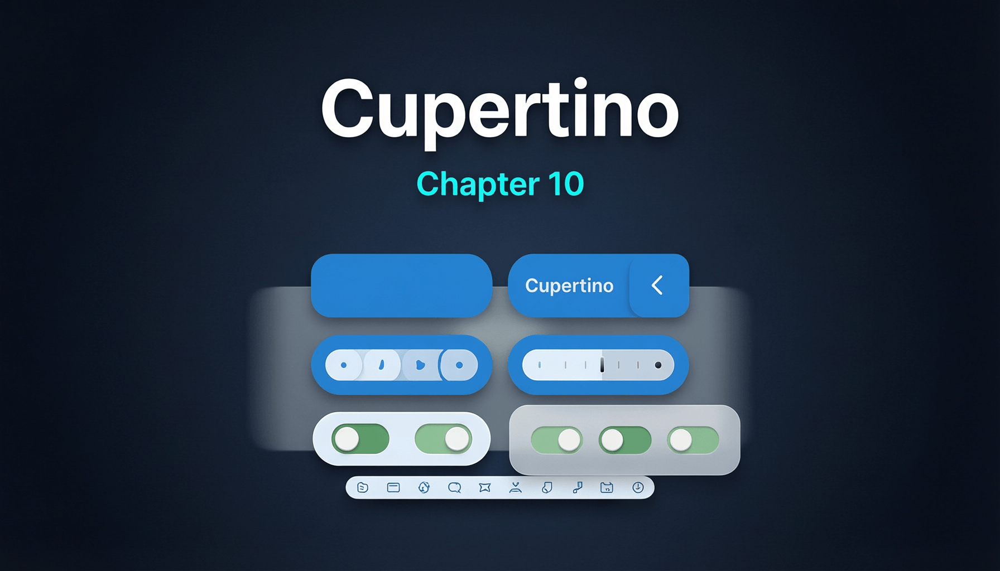

# 第十章：Cupertino (iOS 风格) 组件



Flutter 提供了两套平行的 UI 库：Material（Android 风格）和 Cupertino（iOS 风格）。Cupertino 系列 Widget 使开发者能够构建原生感的 iOS 应用。两套库共享底层的 `widgets` 层，但在视觉表现和交互模式上有显著差异。

## 10.1 CupertinoApp / CupertinoPageScaffold / CupertinoTabScaffold

**完整示例：**

```dart
import 'package:flutter/cupertino.dart';

void main() => runApp(const CupertinoDemoApp());

class CupertinoDemoApp extends StatelessWidget {
  const CupertinoDemoApp({super.key});

  @override
  Widget build(BuildContext context) {
    return CupertinoApp(
      title: 'Cupertino Demo',
      theme: const CupertinoThemeData(
        primaryColor: CupertinoColors.systemBlue,
        brightness: Brightness.light,
      ),
      localizationsDelegates: const [
        DefaultCupertinoLocalizations.delegate,
      ],
      home: CupertinoTabScaffold(
        tabBar: CupertinoTabBar(
          items: const [
            BottomNavigationBarItem(
              icon: Icon(CupertinoIcons.home),
              label: '首页',
            ),
            BottomNavigationBarItem(
              icon: Icon(CupertinoIcons.search),
              label: '搜索',
            ),
            BottomNavigationBarItem(
              icon: Icon(CupertinoIcons.profile_circled),
              label: '我的',
            ),
          ],
        ),
        tabBuilder: (context, index) {
          switch (index) {
            case 0:
              return const _HomeTab();
            case 1:
              return const _SearchTab();
            case 2:
              return const _ProfileTab();
            default:
              return const _HomeTab();
          }
        },
      ),
    );
  }
}

class _HomeTab extends StatelessWidget {
  const _HomeTab();

  @override
  Widget build(BuildContext context) {
    return CupertinoPageScaffold(
      navigationBar: const CupertinoNavigationBar(
        middle: Text('首页'),
      ),
      child: Center(
        child: Column(
          mainAxisAlignment: MainAxisAlignment.center,
          children: [
            CupertinoButton.filled(
              onPressed: () {
                Navigator.of(context).push(
                  CupertinoPageRoute(
                    builder: (_) => const DetailPage(),
                  ),
                );
              },
              child: const Text('跳转详情页'),
            ),
          ],
        ),
      ),
    );
  }
}

class DetailPage extends StatelessWidget {
  const DetailPage({super.key});

  @override
  Widget build(BuildContext context) {
    return CupertinoPageScaffold(
      navigationBar: const CupertinoNavigationBar(
        middle: Text('详情'),
        previousPageTitle: '首页',
      ),
      child: const Center(
        child: Text('详情页面内容'),
      ),
    );
  }
}

class _SearchTab extends StatelessWidget {
  const _SearchTab();

  @override
  Widget build(BuildContext context) {
    return CupertinoPageScaffold(
      navigationBar: const CupertinoNavigationBar(
        middle: Text('搜索'),
      ),
      child: const Center(child: Text('搜索页')),
    );
  }
}

class _ProfileTab extends StatelessWidget {
  const _ProfileTab();

  @override
  Widget build(BuildContext context) {
    return CupertinoPageScaffold(
      navigationBar: const CupertinoNavigationBar(
        middle: Text('我的'),
      ),
      child: const Center(child: Text('我的页面')),
    );
  }
}
```

**原理解析：**

`CupertinoApp` 和 `MaterialApp` 在内部共享同一个 `WidgetsApp`（位于 `widgets` 层），区别仅在于默认主题配置和平台行为。`CupertinoApp` 使用 `CupertinoThemeData` 作为默认主题，`CupertinoPageTransitionsTheme` 控制 iOS 风格的页面转场。

`CupertinoTabScaffold` 为每个 Tab 创建独立的 `Navigator`（通过 `CupertinoTabView`），这意味着每个 Tab 拥有自己的路由栈。这与 Android 的 `BottomNavigationBar`（通常共享单个 Navigator）形成鲜明对比，符合 iOS 的人机交互指南（HIG）要求。

## 10.2 CupertinoNavigationBar / CupertinoSliverNavigationBar

**完整示例：**

```dart
import 'package:flutter/cupertino.dart';

void main() => runApp(const NavBarDemoApp());

class NavBarDemoApp extends StatelessWidget {
  const NavBarDemoApp({super.key});

  @override
  Widget build(BuildContext context) {
    return CupertinoApp(
      home: CupertinoPageScaffold(
        navigationBar: CupertinoNavigationBar(
          leading: GestureDetector(
            onTap: () {},
            child: const Row(
              mainAxisSize: MainAxisSize.min,
              children: [
                Icon(CupertinoIcons.back, size: 20),
                Text('返回'),
              ],
            ),
          ),
          middle: const Text('标准导航栏'),
          trailing: const Icon(CupertinoIcons.add),
          automaticallyImplyLeading: false,
          automaticallyImplyMiddle: false,
        ),
        child: CustomScrollView(
          slivers: [
            const CupertinoSliverNavigationBar(
              largeTitle: Text('大标题模式'),
              previousPageTitle: '上一页',
            ),
            SliverList(
              delegate: SliverChildBuilderDelegate(
                (context, index) => Container(
                  padding: const EdgeInsets.all(16),
                  decoration: const BoxDecoration(
                    border: Border(
                      bottom: BorderSide(color: CupertinoColors.separator),
                    ),
                  ),
                  child: Text('列表项 ${index + 1}'),
                ),
                childCount: 30,
              ),
            ),
          ],
        ),
      ),
    );
  }
}
```

**原理解析：**

`CupertinoSliverNavigationBar` 实现了 iOS 11+ 的大标题（Large Title）效果。其内部维护两个子导航栏：一个固定高度的小标题栏和一个可折叠的大标题区域。当用户在 `CustomScrollView` 中向上滑动时，大标题区域通过 `SliverPersistentHeaderDelegate` 的 `shrinkOffset` 参数逐渐缩小并过渡为标准导航栏。

`automaticallyImplyLeading` 为 `true` 时，导航栏自动检测当前是否在子页面中（通过 `Navigator` 的路由栈深度），如果是，自动显示带返回箭头的按钮，并显示 `previousPageTitle`（上一页标题）。这是 iOS 导航的核心交互模式。

`automaticallyImplyMiddle` 为 `true` 时，如果 `Route` 有标题（通过 `RouteSettings.name` 或 `CupertinoPageRoute.title`），导航栏自动将其设为中间标题。

## 10.3 CupertinoButton / CupertinoDialogAction

**完整示例：**

```dart
import 'package:flutter/cupertino.dart';

void main() => runApp(const ButtonDemoApp());

class ButtonDemoApp extends StatelessWidget {
  const ButtonDemoApp({super.key});

  @override
  Widget build(BuildContext context) {
    return CupertinoApp(
      home: CupertinoPageScaffold(
        navigationBar: const CupertinoNavigationBar(middle: Text('Button Demo')),
        child: Center(
          child: Column(
            mainAxisAlignment: MainAxisAlignment.center,
            children: [
              CupertinoButton(
                color: CupertinoColors.systemBlue,
                borderRadius: BorderRadius.circular(8),
                minSize: 44,
                padding: const EdgeInsets.symmetric(horizontal: 24, vertical: 12),
                pressedOpacity: 0.4,
                onPressed: () {},
                child: const Text('Filled Button'),
              ),
              const SizedBox(height: 16),
              CupertinoButton(
                onPressed: () {},
                child: const Text('Plain Button'),
              ),
              const SizedBox(height: 16),
              const CupertinoButton(
                onPressed: null, // disabled
                child: Text('Disabled'),
              ),
              const SizedBox(height: 24),
              CupertinoButton(
                onPressed: () {
                  showCupertinoDialog(
                    context: context,
                    builder: (context) => CupertinoAlertDialog(
                      title: const Text('确认删除'),
                      content: const Text('此操作不可撤销，确定要继续吗？'),
                      actions: [
                        CupertinoDialogAction(
                          isDefaultAction: true,
                          onPressed: () => Navigator.of(context).pop(),
                          child: const Text('取消'),
                        ),
                        CupertinoDialogAction(
                          isDestructiveAction: true,
                          onPressed: () => Navigator.of(context).pop(),
                          child: const Text('删除'),
                        ),
                      ],
                    ),
                  );
                },
                child: const Text('显示 Dialog'),
              ),
            ],
          ),
        ),
      ),
    );
  }
}
```

**原理解析：**

`CupertinoButton` 的按压效果实现与 `MaterialButton` 截然不同。Material 使用 `InkWell` + `Material` 实现水波纹效果（通过 `InkResponse` 在 `Material` 的 canvas 上绘制扩散的圆形）；而 Cupertino 使用 `AnimatedOpacity`，在按下时将整个按钮的透明度降低到 `pressedOpacity`（默认 0.1），松开时恢复。这种实现更简洁，且完美契合 iOS 的设计语言。

`CupertinoDialogAction` 的 `isDestructiveAction` 会将文字颜色设为红色（`CupertinoColors.destructiveRed`），`isDefaultAction` 则将文字加粗（`FontWeight.w600`），这些都是 iOS HIG 规定的语义样式。

## 10.4 CupertinoTextField

**完整示例：**

```dart
import 'package:flutter/cupertino.dart';

void main() => runApp(const TextFieldDemoApp());

class TextFieldDemoApp extends StatefulWidget {
  const TextFieldDemoApp({super.key});

  @override
  State<TextFieldDemoApp> createState() => _TextFieldDemoAppState();
}

class _TextFieldDemoAppState extends State<TextFieldDemoApp> {
  final _controller = TextEditingController();

  @override
  void dispose() {
    _controller.dispose();
    super.dispose();
  }

  @override
  Widget build(BuildContext context) {
    return CupertinoApp(
      home: CupertinoPageScaffold(
        navigationBar: const CupertinoNavigationBar(middle: Text('TextField')),
        child: Padding(
          padding: const EdgeInsets.all(24),
          child: Column(
            mainAxisAlignment: MainAxisAlignment.center,
            children: [
              CupertinoTextField(
                placeholder: '请输入用户名',
                prefix: const Padding(
                  padding: EdgeInsets.only(left: 8),
                  child: Icon(CupertinoIcons.person),
                ),
                clearButtonMode: OverlayVisibilityMode.editing,
                padding: const EdgeInsets.all(12),
                decoration: BoxDecoration(
                  color: CupertinoColors.tertiarySystemFill,
                  borderRadius: BorderRadius.circular(8),
                ),
              ),
              const SizedBox(height: 20),
              CupertinoTextField(
                controller: _controller,
                placeholder: '请输入密码',
                obscureText: true,
                suffix: const Padding(
                  padding: EdgeInsets.only(right: 8),
                  child: Icon(CupertinoIcons.eye),
                ),
                clearButtonMode: OverlayVisibilityMode.always,
                padding: const EdgeInsets.all(12),
                decoration: BoxDecoration(
                  border: Border.all(color: CupertinoColors.systemGrey4),
                  borderRadius: BorderRadius.circular(8),
                ),
                onChanged: (value) {
                  debugPrint('Input: $value');
                },
              ),
              const SizedBox(height: 20),
              const CupertinoTextField.borderless(
                placeholder: '无边框模式',
                padding: EdgeInsets.all(12),
              ),
            ],
          ),
        ),
      ),
    );
  }
}
```

**原理解析：**

`CupertinoTextField` 和 Material 的 `TextField` 底层都使用 `EditableText` Widget。`EditableText` 是一个无装饰的文本编辑核心组件，负责文本输入、光标绘制、选区管理和键盘交互。`CupertinoTextField` 和 `TextField` 分别在 `EditableText` 外层添加各自的装饰（边框、前缀、后缀、清除按钮等）。

`clearButtonMode` 使用 `OverlayVisibilityMode` 枚举控制清除按钮的显示时机：`never`、`editing`（编辑中显示）、`notEditing`（非编辑时显示）、`always`。清除按钮通过 `AnimatedOpacity` + `AnimatedSize` 实现平滑的出现/消失过渡。

## 10.5 CupertinoPicker / CupertinoDatePicker / CupertinoTimerPicker

**完整示例：**

```dart
import 'package:flutter/cupertino.dart';

void main() => runApp(const PickerDemoApp());

class PickerDemoApp extends StatefulWidget {
  const PickerDemoApp({super.key});

  @override
  State<PickerDemoApp> createState() => _PickerDemoAppState();
}

class _PickerDemoAppState extends State<PickerDemoApp> {
  DateTime _selectedDate = DateTime.now();
  int _selectedFruit = 0;

  final List<String> _fruits = ['苹果', '香蕉', '橙子', '葡萄', '西瓜', '芒果'];

  @override
  Widget build(BuildContext context) {
    return CupertinoApp(
      home: CupertinoPageScaffold(
        navigationBar: const CupertinoNavigationBar(middle: Text('Picker Demo')),
        child: Center(
          child: Column(
            mainAxisAlignment: MainAxisAlignment.center,
            children: [
              ElevatedButton(
                onPressed: () => _showPicker(context),
                child: Text('当前水果: ${_fruits[_selectedFruit]}'),
              ),
              const SizedBox(height: 16),
              ElevatedButton(
                onPressed: () => _showDatePicker(context),
                child: Text('日期: ${_selectedDate.toString().split(' ')[0]}'),
              ),
            ],
          ),
        ),
      ),
    );
  }

  void _showPicker(BuildContext context) {
    showCupertinoModalPopup(
      context: context,
      builder: (_) => SizedBox(
        height: 250,
        child: CupertinoPicker(
          itemExtent: 40,
          scrollController: FixedExtentScrollController(initialItem: _selectedFruit),
          onSelectedItemChanged: (index) {
            setState(() => _selectedFruit = index);
          },
          children: _fruits.map((fruit) => Center(child: Text(fruit))).toList(),
        ),
      ),
    );
  }

  void _showDatePicker(BuildContext context) {
    showCupertinoModalPopup(
      context: context,
      builder: (_) => SizedBox(
        height: 250,
        child: CupertinoDatePicker(
          mode: CupertinoDatePickerMode.date,
          initialDateTime: _selectedDate,
          onDateTimeChanged: (date) {
            setState(() => _selectedDate = date);
          },
        ),
      ),
    );
  }
}
```

**原理解析：**

`CupertinoPicker` 的核心是一个特殊的 `ScrollView`，使用 `FixedExtentScrollPhysics` 确保每次滑动结束后精确对齐到一个 `itemExtent`（固定行高）。`FixedExtentScrollController` 提供 `selectedItem` 属性直接读取当前选中项索引。

Picker 的视觉效果（上下边缘的渐隐效果）由 `CupertinoPickerScrollViewport` 实现，它对超出中心区域的子项应用了透视变换和透明度衰减。`CupertinoPicker` 外层通常包裹一个 `magnifier`（放大镜效果），在 iOS 14+ 中默认启用。

`CupertinoDatePicker` 内部由多个并排的 `CupertinoPicker` 组成（日期选择器有三列：年/月/日，时间选择器有两列：时/分），通过 `CupertinoDatePickerMode` 控制显示哪些列。

## 10.6 CupertinoActionSheet / CupertinoAlertDialog

**完整示例：**

```dart
import 'package:flutter/cupertino.dart';

void main() => runApp(const SheetDemoApp());

class SheetDemoApp extends StatelessWidget {
  const SheetDemoApp({super.key});

  @override
  Widget build(BuildContext context) {
    return CupertinoApp(
      home: CupertinoPageScaffold(
        navigationBar: const CupertinoNavigationBar(middle: Text('ActionSheet')),
        child: Center(
          child: Column(
            mainAxisAlignment: MainAxisAlignment.center,
            children: [
              CupertinoButton.filled(
                onPressed: () => _showActionSheet(context),
                child: const Text('显示 ActionSheet'),
              ),
              const SizedBox(height: 16),
              CupertinoButton.filled(
                onPressed: () => _showAlertDialog(context),
                child: const Text('显示 AlertDialog'),
              ),
            ],
          ),
        ),
      ),
    );
  }

  void _showActionSheet(BuildContext context) {
    showCupertinoModalPopup(
      context: context,
      builder: (_) => CupertinoActionSheet(
        title: const Text('选择操作'),
        message: const Text('请选择你要执行的操作'),
        actions: [
          CupertinoActionSheetAction(
            onPressed: () => Navigator.of(context).pop(),
            child: const Text('拍照'),
          ),
          CupertinoActionSheetAction(
            onPressed: () => Navigator.of(context).pop(),
            child: const Text('从相册选择'),
          ),
          CupertinoActionSheetAction(
            isDestructiveAction: true,
            onPressed: () => Navigator.of(context).pop(),
            child: const Text('删除照片'),
          ),
        ],
        cancelButton: CupertinoActionSheetAction(
          isDefaultAction: true,
          onPressed: () => Navigator.of(context).pop(),
          child: const Text('取消'),
        ),
      ),
    );
  }

  void _showAlertDialog(BuildContext context) {
    showCupertinoDialog(
      context: context,
      builder: (_) => CupertinoAlertDialog(
        title: const Text('网络错误'),
        content: const Text('无法连接到服务器，请检查网络设置后重试。'),
        actions: [
          CupertinoDialogAction(
            isDefaultAction: true,
            onPressed: () => Navigator.of(context).pop(),
            child: const Text('确定'),
          ),
        ],
      ),
    );
  }
}
```

**原理解析：**

`showCupertinoModalPopup` 创建一个 `CupertinoModalPopupRoute`，该路由使用从底部滑入的转场动画（`SlideTransition`），并带有半透明黑色遮罩。遮罩的点击事件会触发路由的 `pop`。

`CupertinoActionSheet` 的布局结构是 iOS 标准的三段式：标题区（title + message）、操作列表（actions）、取消按钮（cancelButton，独立于 actions 之外，中间有间距分隔）。整个 ActionSheet 使用 `ClipRRect` 实现圆角，背景使用 `CupertinoDynamicColor` 支持深色模式适配。

`showCupertinoDialog` 使用 `CupertinoDialogRoute`，弹出时采用淡入动画（不同于 Material Dialog 的缩放动画），`barrierDismissible` 默认为 `true`。

## 10.7 CupertinoSwitch / CupertinoSlider / CupertinoActivityIndicator

**完整示例：**

```dart
import 'package:flutter/cupertino.dart';

void main() => runApp(const CupertinoControlsDemo());

class CupertinoControlsDemo extends StatefulWidget {
  const CupertinoControlsDemo({super.key});

  @override
  State<CupertinoControlsDemo> createState() => _CupertinoControlsDemoState();
}

class _CupertinoControlsDemoState extends State<CupertinoControlsDemo> {
  bool _switchValue = true;
  double _sliderValue = 0.5;

  @override
  Widget build(BuildContext context) {
    return CupertinoApp(
      home: CupertinoPageScaffold(
        navigationBar: const CupertinoNavigationBar(middle: Text('Controls')),
        child: Center(
          child: Column(
            mainAxisAlignment: MainAxisAlignment.center,
            children: [
              Row(
                mainAxisAlignment: MainAxisAlignment.center,
                children: [
                  const Text('开关: '),
                  CupertinoSwitch(
                    value: _switchValue,
                    activeTrackColor: CupertinoColors.systemGreen,
                    onChanged: (value) {
                      setState(() => _switchValue = value);
                    },
                  ),
                ],
              ),
              const SizedBox(height: 24),
              Padding(
                padding: const EdgeInsets.symmetric(horizontal: 40),
                child: Column(
                  children: [
                    Text('滑块: ${_sliderValue.toStringAsFixed(2)}'),
                    CupertinoSlider(
                      value: _sliderValue,
                      min: 0,
                      max: 1,
                      divisions: 100,
                      activeColor: CupertinoColors.systemBlue,
                      onChanged: (value) {
                        setState(() => _sliderValue = value);
                      },
                    ),
                  ],
                ),
              ),
              const SizedBox(height: 24),
              const CupertinoActivityIndicator(
                animating: true,
                radius: 16,
                color: CupertinoColors.systemGrey,
              ),
              const SizedBox(height: 12),
              const CupertinoActivityIndicator.partiallyRevealed(
                progress: 0.6,
                radius: 20,
              ),
            ],
          ),
        ),
      ),
    );
  }
}
```

**原理解析：**

`CupertinoSwitch` 与 `Switch`（Material）的核心区别在于视觉表现：Cupertino 版本使用扁平的圆角矩形轨道，开关滑块没有投影（Material 版有 z 轴投影），且在拖动过程中滑块会变大（`thumbRadius` 动态增大）。内部使用 `GestureDetector` 监听水平拖动手势，`AnimatedContainer` 实现轨道颜色的平滑过渡。

`CupertinoActivityIndicator` 是 iOS 经典的"菊花"加载动画。内部使用 `AnimationController`（`repeat` 模式）驱动 12 条线段的透明度依次变化，形成旋转效果。`partiallyRevealed` 构造器提供静态的进度指示（不旋转），类似 iOS 的下拉刷新指示器。

与 Material 对应组件的设计差异总结：

| 特性 | Cupertino | Material |
|------|-----------|----------|
| 按压反馈 | 透明度变化 | 水波纹扩散 |
| 开关样式 | 扁平无投影 | 有 z 轴投影 |
| 加载指示 | 菊花旋转 | 圆形旋转 |
| 弹窗风格 | 半透明模糊背景 | 不透明卡片 + 遮罩 |

---
