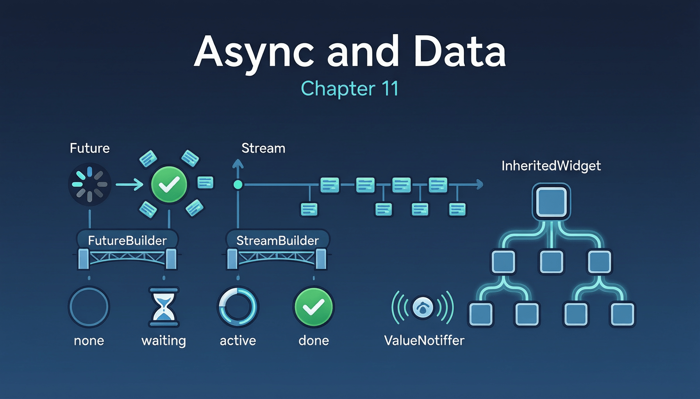

# 第十一章：异步与数据 Widget



在移动应用中，数据获取几乎都是异步的。Flutter 提供了 `FutureBuilder` 和 `StreamBuilder` 将异步数据流与 UI 构建无缝衔接，`InheritedWidget` 则提供了高效的跨层级数据传递机制。

## 11.1 FutureBuilder

**完整示例：**

```dart
import 'package:flutter/material.dart';

void main() => runApp(const FutureBuilderDemoApp());

class FutureBuilderDemoApp extends StatelessWidget {
  const FutureBuilderDemoApp({super.key});

  @override
  Widget build(BuildContext context) {
    return MaterialApp(
      title: 'FutureBuilder Demo',
      home: const FutureBuilderDemoPage(),
    );
  }
}

class FutureBuilderDemoPage extends StatefulWidget {
  const FutureBuilderDemoPage({super.key});

  @override
  State<FutureBuilderDemoPage> createState() => _FutureBuilderDemoPageState();
}

class _FutureBuilderDemoPageState extends State<FutureBuilderDemoPage> {
  late Future<List<String>> _dataFuture;

  @override
  void initState() {
    super.initState();
    // 关键：在 initState 中创建 Future，而非 build 方法中
    _dataFuture = _fetchData();
  }

  Future<List<String>> _fetchData() async {
    await Future.delayed(const Duration(seconds: 2));
    // 模拟网络请求，取消注释下面一行可测试错误场景
    // throw Exception('网络请求失败');
    return ['Flutter', 'Dart', 'Firebase', 'GoRouter', 'Riverpod'];
  }

  void _refresh() {
    setState(() {
      _dataFuture = _fetchData();
    });
  }

  @override
  Widget build(BuildContext context) {
    return Scaffold(
      appBar: AppBar(
        title: const Text('FutureBuilder Demo'),
        actions: [
          IconButton(icon: const Icon(Icons.refresh), onPressed: _refresh),
        ],
      ),
      body: FutureBuilder<List<String>>(
        future: _dataFuture,
        builder: (context, snapshot) {
          if (snapshot.connectionState == ConnectionState.waiting) {
            return const Center(child: CircularProgressIndicator());
          }
          if (snapshot.hasError) {
            return Center(
              child: Column(
                mainAxisAlignment: MainAxisAlignment.center,
                children: [
                  const Icon(Icons.error, color: Colors.red, size: 48),
                  const SizedBox(height: 12),
                  Text('错误: ${snapshot.error}'),
                  const SizedBox(height: 12),
                  ElevatedButton(
                    onPressed: _refresh,
                    child: const Text('重试'),
                  ),
                ],
              ),
            );
          }
          if (snapshot.hasData) {
            final data = snapshot.data!;
            return ListView.builder(
              itemCount: data.length,
              itemBuilder: (context, index) {
                return ListTile(
                  leading: CircleAvatar(child: Text('${index + 1}')),
                  title: Text(data[index]),
                );
              },
            );
          }
          return const Center(child: Text('暂无数据'));
        },
      ),
    );
  }
}
```

**原理解析：**

`FutureBuilder` 是一个 `StatefulWidget`。在 `initState` 中，它通过 `_subscribe()` 方法将内部回调绑定到传入的 `Future`：

```dart
// 伪代码，展示 FutureBuilder 内部逻辑
void _subscribe() {
  if (widget.future != null) {
    _activeCallbackIdentity = callbackIdentity;
    widget.future!.then<void>((T data) {
      if (_activeCallbackIdentity == callbackIdentity) {
        setState(() {
          _snapshot = AsyncSnapshot.withData(ConnectionState.done, data);
        });
      }
    }, onError: (Object error, StackTrace stackTrace) {
      if (_activeCallbackIdentity == callbackIdentity) {
        setState(() {
          _snapshot = AsyncSnapshot.withError(ConnectionState.done, error, stackTrace);
        });
      }
    });
  }
}
```

`_activeCallbackIdentity` 机制确保当 `future` 被替换（如 `didUpdateWidget` 时）后，旧的 Future 完成后不会覆盖新的状态。

**常见陷阱**：在 `build()` 中创建 Future（如 `future: fetchData()`）会导致每次 rebuild 都创建新的 Future 并重新执行请求。正确做法是在 `initState` 或某个事件回调中创建 Future 并保存为成员变量。

## 11.2 StreamBuilder

**完整示例：**

```dart
import 'dart:async';
import 'package:flutter/material.dart';

void main() => runApp(const StreamBuilderDemoApp());

class StreamBuilderDemoApp extends StatelessWidget {
  const StreamBuilderDemoApp({super.key});

  @override
  Widget build(BuildContext context) {
    return MaterialApp(
      title: 'StreamBuilder Demo',
      home: const StreamBuilderDemoPage(),
    );
  }
}

class StreamBuilderDemoPage extends StatefulWidget {
  const StreamBuilderDemoPage({super.key});

  @override
  State<StreamBuilderDemoPage> createState() => _StreamBuilderDemoPageState();
}

class _StreamBuilderDemoPageState extends State<StreamBuilderDemoPage> {
  late Stream<int> _counterStream;

  @override
  void initState() {
    super.initState();
    _counterStream = _createCounterStream();
  }

  Stream<int> _createCounterStream() async* {
    for (int i = 0; i <= 10; i++) {
      await Future.delayed(const Duration(seconds: 1));
      yield i;
    }
  }

  @override
  Widget build(BuildContext context) {
    return Scaffold(
      appBar: AppBar(title: const Text('StreamBuilder Demo')),
      body: Center(
        child: StreamBuilder<int>(
          stream: _counterStream,
          initialData: 0,
          builder: (context, snapshot) {
            debugPrint('ConnectionState: ${snapshot.connectionState}');

            if (snapshot.connectionState == ConnectionState.waiting) {
              return Column(
                mainAxisAlignment: MainAxisAlignment.center,
                children: [
                  const CircularProgressIndicator(),
                  const SizedBox(height: 12),
                  Text('当前值: ${snapshot.data ?? 0}'),
                ],
              );
            }

            if (snapshot.connectionState == ConnectionState.active) {
              return Column(
                mainAxisAlignment: MainAxisAlignment.center,
                children: [
                  Text(
                    '${snapshot.data}',
                    style: const TextStyle(fontSize: 72, fontWeight: FontWeight.bold),
                  ),
                  const SizedBox(height: 12),
                  const Text('Stream 正在推送数据...',
                      style: TextStyle(color: Colors.grey)),
                ],
              );
            }

            if (snapshot.connectionState == ConnectionState.done) {
              return Column(
                mainAxisAlignment: MainAxisAlignment.center,
                children: [
                  Text(
                    '完成: ${snapshot.data}',
                    style: const TextStyle(fontSize: 48, color: Colors.green),
                  ),
                  const SizedBox(height: 12),
                  ElevatedButton(
                    onPressed: () {
                      setState(() {
                        _counterStream = _createCounterStream();
                      });
                    },
                    child: const Text('重新开始'),
                  ),
                ],
              );
            }

            return const Text('None');
          },
        ),
      ),
    );
  }
}
```

**原理解析：**

`StreamBuilder` 与 `FutureBuilder` 共享同一个基类 `_StreamBuilderBase`，核心差异在于订阅机制。`StreamBuilder` 在 `initState` 中调用 `stream.listen()`，返回 `StreamSubscription`，并在 `dispose` 中调用 `subscription.cancel()` 取消订阅，防止内存泄漏。

`AsyncSnapshot` 的 `connectionState` 生命周期：

- `ConnectionState.none`：未设置 stream/future
- `ConnectionState.waiting`：已订阅但尚未收到数据
- `ConnectionState.active`：Stream 正在推送数据（仅 StreamBuilder 有此状态）
- `ConnectionState.done`：Future 已完成 / Stream 已关闭

**StreamBuilder vs FutureBuilder 的本质区别**：Future 只产生一个值（成功或失败），对应一次 `setState`；Stream 可产生多个值，每次 `onData` 回调都会触发 `setState`，实现 UI 的持续更新。这使得 `StreamBuilder` 适合 WebSocket、传感器数据、倒计时等持续变化的场景。

## 11.3 InheritedWidget / InheritedNotifier

`InheritedWidget` 是 Flutter 中数据自上而下传递的核心机制，也是几乎所有状态管理方案的底层基石。

**完整示例：**

```dart
import 'package:flutter/material.dart';

void main() => runApp(const InheritedWidgetDemoApp());

// 自定义 InheritedWidget
class CounterScope extends InheritedWidget {
  final int count;
  final VoidCallback onIncrement;

  const CounterScope({
    super.key,
    required this.count,
    required this.onIncrement,
    required super.child,
  });

  // 定义判断是否需要通知依赖者的逻辑
  @override
  bool updateShouldNotify(CounterScope oldWidget) {
    return count != oldWidget.count;
  }

  // 提供便捷的静态访问方法
  static CounterScope of(BuildContext context) {
    final result = context.dependOnInheritedWidgetOfExactType<CounterScope>();
    assert(result != null, 'No CounterScope found in context');
    return result!;
  }

  // 不注册依赖的访问方式
  static CounterScope? maybeOf(BuildContext context) {
    return context.getInheritedWidgetOfExactType<CounterScope>();
  }
}

class InheritedWidgetDemoApp extends StatefulWidget {
  const InheritedWidgetDemoApp({super.key});

  @override
  State<InheritedWidgetDemoApp> createState() => _InheritedWidgetDemoAppState();
}

class _InheritedWidgetDemoAppState extends State<InheritedWidgetDemoApp> {
  int _count = 0;

  void _increment() {
    setState(() => _count++);
  }

  @override
  Widget build(BuildContext context) {
    return MaterialApp(
      home: CounterScope(
        count: _count,
        onIncrement: _increment,
        child: Scaffold(
          appBar: AppBar(title: const Text('InheritedWidget Demo')),
          body: const Center(
            child: Column(
              mainAxisAlignment: MainAxisAlignment.center,
              children: [
                _DisplayWidget(),
                SizedBox(height: 20),
                _ButtonWidget(),
                SizedBox(height: 20),
                _UnrelatedWidget(), // 不会因 count 变化而 rebuild
              ],
            ),
          ),
        ),
      ),
    );
  }
}

class _DisplayWidget extends StatelessWidget {
  const _DisplayWidget();

  @override
  Widget build(BuildContext context) {
    debugPrint('_DisplayWidget rebuild');
    final count = CounterScope.of(context).count;
    return Text('计数: $count', style: const TextStyle(fontSize: 32));
  }
}

class _ButtonWidget extends StatelessWidget {
  const _ButtonWidget();

  @override
  Widget build(BuildContext context) {
    debugPrint('_ButtonWidget rebuild');
    return ElevatedButton(
      onPressed: CounterScope.of(context).onIncrement,
      child: const Text('+1'),
    );
  }
}

class _UnrelatedWidget extends StatelessWidget {
  const _UnrelatedWidget();

  @override
  Widget build(BuildContext context) {
    debugPrint('_UnrelatedWidget rebuild');
    return const Text('我不依赖 count，不会因此重建');
  }
}
```

**原理解析：**

`InheritedWidget` 的工作机制涉及三棵树（Widget / Element / RenderObject）中的 Element 树。核心数据结构：

1. **`Element._inheritedWidgets`**：一个 `HashMap<Type, InheritedElement>`，存储从根到当前 Element 路径上所有的 `InheritedElement`。当 `InheritedWidget` 被挂载到 Element 树时，其对应的 `InheritedElement` 会被注册到这个 Map 中。

2. **依赖注册**：当子 Widget 调用 `context.dependOnInheritedWidgetOfExactType<T>()` 时，Flutter 在 `_inheritedWidgets` Map 中查找类型 `T` 对应的 `InheritedElement`，然后调用 `InheritedElement._dependents.add(currentElement)` 注册依赖关系。

3. **通知机制**：当 `InheritedWidget` 被替换（父 Widget rebuild 时），`InheritedElement.update()` 调用新 Widget 的 `updateShouldNotify()`。如果返回 `true`，则遍历 `_dependents` 列表，对每个依赖者调用 `dependant.didChangeDependencies()`，进而触发依赖者的 `rebuild`。

**`dependOnInheritedWidgetOfExactType` vs `getInheritedWidgetOfExactType`**：前者注册依赖（后续变化会触发 rebuild），后者仅读取当前值不注册依赖。性能敏感场景中，如果只是读取一次性的配置信息，应使用 `getInheritedWidgetOfExactType`。

Flutter 框架中广泛使用 `InheritedWidget`：`Theme`、`MediaQuery`、`Navigator`、`Localizations`、`Directionality`、`DefaultTextStyle`、`DefaultSelectionStyle` 等都是 `InheritedWidget` 的子类。

## 11.4 ValueListenableBuilder

**完整示例：**

```dart
import 'package:flutter/material.dart';

void main() => runApp(const ValueListenableDemoApp());

class ValueListenableDemoApp extends StatelessWidget {
  const ValueListenableDemoApp({super.key});

  @override
  Widget build(BuildContext context) {
    return MaterialApp(
      title: 'ValueListenableBuilder',
      home: const ValueListenableDemoPage(),
    );
  }
}

class ValueListenableDemoPage extends StatefulWidget {
  const ValueListenableDemoPage({super.key});

  @override
  State<ValueListenableDemoPage> createState() =>
      _ValueListenableDemoPageState();
}

class _ValueListenableDemoPageState extends State<ValueListenableDemoPage> {
  final ValueNotifier<int> _counter = ValueNotifier<int>(0);
  final ValueNotifier<Color> _color = ValueNotifier<Color>(Colors.blue);

  @override
  void dispose() {
    _counter.dispose();
    _color.dispose();
    super.dispose();
  }

  @override
  Widget build(BuildContext context) {
    return Scaffold(
      appBar: AppBar(title: const Text('ValueListenableBuilder')),
      body: Center(
        child: Column(
          mainAxisAlignment: MainAxisAlignment.center,
          children: [
            ValueListenableBuilder<int>(
              valueListenable: _counter,
              builder: (context, value, child) {
                return Text(
                  '计数: $value',
                  style: const TextStyle(fontSize: 32),
                );
              },
              child: const Text('此 child 不会重建'),
            ),
            const SizedBox(height: 20),
            ValueListenableBuilder<Color>(
              valueListenable: _color,
              builder: (context, color, _) {
                return Container(
                  width: 100,
                  height: 100,
                  decoration: BoxDecoration(
                    color: color,
                    borderRadius: BorderRadius.circular(12),
                  ),
                );
              },
            ),
            const SizedBox(height: 24),
            Row(
              mainAxisAlignment: MainAxisAlignment.center,
              children: [
                ElevatedButton(
                  onPressed: () => _counter.value++,
                  child: const Text('+1'),
                ),
                const SizedBox(width: 16),
                ElevatedButton(
                  onPressed: () {
                    _color.value = _color.value == Colors.blue
                        ? Colors.red
                        : Colors.blue;
                  },
                  child: const Text('切换颜色'),
                ),
              ],
            ),
          ],
        ),
      ),
    );
  }
}
```

**原理解析：**

`ValueListenableBuilder` 内部是一个 `StatefulWidget`，在 `initState` 中对 `valueListenable` 调用 `addListener(_valueChanged)`，当 `ValueNotifier.value` 被赋值时，`ChangeNotifier` 通知所有监听者，`_valueChanged` 回调触发 `setState` 重建 `builder`。

`child` 参数是一个性能优化：它是 `builder` 的第三个参数，在值变化时不会重建。适合放置静态的、不依赖监听值的子 Widget。

**与 StreamBuilder 的区别**：`ValueListenable` 是同步的——设置 `value` 后立即通知，不涉及异步事件循环；`Stream` 是异步的——数据通过事件队列传递。`ValueListenable` 始终保存最新值（可直接读取 `.value`），`Stream` 则不保存历史值。因此 `ValueListenableBuilder` 适合轻量级的局部状态更新，不需要 `AsyncSnapshot` 的连接状态管理。

---
