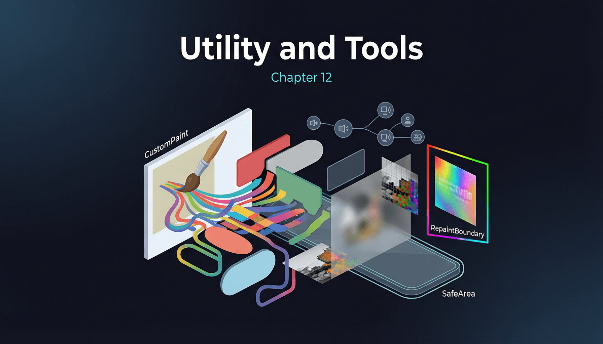

# 第十二章：工具与辅助 Widget



这些 Widget 不提供直接的视觉表现，而是为其他 Widget 提供行为增强、性能优化或辅助功能支持。它们往往是构建高质量应用的关键工具。

## 12.1 SafeArea

**完整示例：**

```dart
import 'package:flutter/material.dart';

void main() => runApp(const SafeAreaDemoApp());

class SafeAreaDemoApp extends StatelessWidget {
  const SafeAreaDemoApp({super.key});

  @override
  Widget build(BuildContext context) {
    return MaterialApp(
      title: 'SafeArea Demo',
      home: Scaffold(
        body: SafeArea(
          top: true,
          bottom: true,
          left: true,
          right: true,
          minimum: const EdgeInsets.all(8),
          child: Container(
            color: Colors.blue.shade100,
            child: const Center(
              child: Text(
                'SafeArea 确保内容不被刘海、\n底部手势条等遮挡',
                textAlign: TextAlign.center,
                style: TextStyle(fontSize: 18),
              ),
            ),
          ),
        ),
      ),
    );
  }
}
```

**原理解析：**

`SafeArea` 内部读取 `MediaQuery.of(context).padding`（平台安全区域内边距），然后根据 `top`、`bottom`、`left`、`right` 参数选择性地将对应方向的 padding 添加到子 Widget 上。`minimum` 参数确保即使平台报告的安全区域内边距为 0，也至少保留指定的最小边距。

`maintainBottomViewPadding` 控制当虚拟键盘弹出时（此时 `viewInsets.bottom > 0`），是否保持 `viewPadding.bottom` 而非将其归零。这在键盘覆盖场景下防止 `SafeArea` 的底部 padding 突然消失。

## 12.2 Builder

**完整示例：**

```dart
import 'package:flutter/material.dart';

void main() => runApp(const BuilderDemoApp());

class BuilderDemoApp extends StatelessWidget {
  const BuilderDemoApp({super.key});

  @override
  Widget build(BuildContext context) {
    return MaterialApp(
      home: Scaffold(
        appBar: AppBar(title: const Text('Builder Demo')),
        // 不使用 Builder 时，body 的 context 找不到 Scaffold
        // 因为 context 属于 MaterialApp 而非 Scaffold 的子树
        body: Builder(
          builder: (innerContext) {
            // innerContext 在 Scaffold 的子树中，
            // 可以正确查找到 Scaffold 和 ScaffoldMessenger
            return Center(
              child: ElevatedButton(
                onPressed: () {
                  ScaffoldMessenger.of(innerContext).showSnackBar(
                    const SnackBar(
                      content: Text('Hello from Builder!'),
                      duration: Duration(seconds: 2),
                    ),
                  );
                },
                child: const Text('显示 SnackBar'),
              ),
            );
          },
        ),
      ),
    );
  }
}
```

**原理解析：**

`Builder` 是一个极其简单的 `StatelessWidget`，其 `build` 方法直接调用传入的 `builder` 回调，并将自身对应的 `BuildContext` 作为参数传出。它的唯一作用是创建一个新的 `BuildContext` 节点。

这在以下场景至关重要：当你在同一个 `build` 方法中创建了一个 Widget（如 `Scaffold`）并立即需要在其子树中使用 `Scaffold.of(context)` 时，外层的 `context` 位于 `Scaffold` 之上，无法找到它。`Builder` 提供的 `innerContext` 位于 `Scaffold` 之下，可以正确查找到 `Scaffold`。

## 12.3 RepaintBoundary

**完整示例：**

```dart
import 'package:flutter/material.dart';

void main() {
  // 启用重绘彩虹调试，可视化重绘区域
  debugRepaintRainbowEnabled = true;
  runApp(const RepaintBoundaryDemoApp());
}

class RepaintBoundaryDemoApp extends StatelessWidget {
  const RepaintBoundaryDemoApp({super.key});

  @override
  Widget build(BuildContext context) {
    return MaterialApp(
      title: 'RepaintBoundary Demo',
      home: Scaffold(
        appBar: AppBar(title: const Text('RepaintBoundary')),
        body: Center(
          child: Column(
            mainAxisAlignment: MainAxisAlignment.center,
            children: [
              // 有 RepaintBoundary：动画重绘不影响外部
              RepaintBoundary(
                child: Container(
                  padding: const EdgeInsets.all(16),
                  color: Colors.blue.shade50,
                  child: const _RotatingWidget(),
                ),
              ),
              const SizedBox(height: 40),
              // 无 RepaintBoundary：动画重绘可能导致外部也重绘
              Container(
                padding: const EdgeInsets.all(16),
                color: Colors.red.shade50,
                child: const _RotatingWidget(),
              ),
              const SizedBox(height: 40),
              const Text('上方蓝色区域有 RepaintBoundary 包裹'),
              const Text('下方红色区域没有 RepaintBoundary'),
              const Text('开启 debugRepaintRainbowEnabled 观察差异'),
            ],
          ),
        ),
      ),
    );
  }
}

class _RotatingWidget extends StatefulWidget {
  const _RotatingWidget();

  @override
  State<_RotatingWidget> createState() => _RotatingWidgetState();
}

class _RotatingWidgetState extends State<_RotatingWidget>
    with SingleTickerProviderStateMixin {
  late final AnimationController _controller;

  @override
  void initState() {
    super.initState();
    _controller = AnimationController(
      duration: const Duration(seconds: 2),
      vsync: this,
    )..repeat();
  }

  @override
  void dispose() {
    _controller.dispose();
    super.dispose();
  }

  @override
  Widget build(BuildContext context) {
    return AnimatedBuilder(
      animation: _controller,
      builder: (context, child) {
        return Transform.rotate(
          angle: _controller.value * 2 * 3.14159,
          child: child,
        );
      },
      child: Container(
        width: 60,
        height: 60,
        color: Colors.orange,
        child: const Icon(Icons.star, color: Colors.white, size: 32),
      ),
    );
  }
}
```

**原理解析：**

`RepaintBoundary` 在渲染树中创建一个新的 `OffsetLayer`（离屏层）。正常情况下，当一个 `RenderObject` 需要重绘时，它的 `markNeedsPaint()` 会沿父链向上传播，直到遇到最近的 `RepaintBoundary` 才停止。

没有 `RepaintBoundary` 时，一个频繁重绘的子 Widget（如动画）会导致其所有祖先都被标记为需要重绘，造成不必要的性能开销。包裹 `RepaintBoundary` 后，重绘被限制在该 Layer 内部，父 Layer 不受影响。

但 `RepaintBoundary` 也有开销：它需要额外的 GPU 内存来存储离屏缓冲区。因此不应滥用——只在确实有频繁重绘的子树（动画、视频播放器、`CustomPainter` 频繁重绘场景）外层使用。

`debugRepaintRainbowEnabled = true` 会在每个重绘区域显示彩色边框，是诊断重绘范围的利器。

## 12.4 FittedBox / ShaderMask / ColorFiltered / BackdropFilter / ImageFiltered

**完整示例：**

```dart
import 'dart:ui';
import 'package:flutter/material.dart';

void main() => runApp(const FilterDemoApp());

class FilterDemoApp extends StatelessWidget {
  const FilterDemoApp({super.key});

  @override
  Widget build(BuildContext context) {
    return MaterialApp(
      title: 'Filter Demo',
      home: Scaffold(
        appBar: AppBar(title: const Text('视觉效果 Widget')),
        body: SingleChildScrollView(
          padding: const EdgeInsets.all(16),
          child: Column(
            crossAxisAlignment: CrossAxisAlignment.start,
            children: [
              const Text('ShaderMask（渐变文字）',
                  style: TextStyle(fontWeight: FontWeight.bold)),
              const SizedBox(height: 8),
              ShaderMask(
                shaderCallback: (bounds) => const LinearGradient(
                  colors: [Colors.red, Colors.blue, Colors.green],
                ).createShader(bounds),
                blendMode: BlendMode.srcIn,
                child: const Text(
                  'Flutter 渐变文字效果',
                  style: TextStyle(fontSize: 28, fontWeight: FontWeight.bold),
                ),
              ),
              const SizedBox(height: 32),

              const Text('ColorFiltered（灰度效果）',
                  style: TextStyle(fontWeight: FontWeight.bold)),
              const SizedBox(height: 8),
              ColorFiltered(
                colorFilter: const ColorFilter.matrix(<double>[
                  0.2126, 0.7152, 0.0722, 0, 0,
                  0.2126, 0.7152, 0.0722, 0, 0,
                  0.2126, 0.7152, 0.0722, 0, 0,
                  0,      0,      0,      1, 0,
                ]),
                child: Container(
                  height: 80,
                  color: Colors.blue,
                  child: const Center(
                    child: Text('灰度效果',
                        style: TextStyle(fontSize: 20, color: Colors.white)),
                  ),
                ),
              ),
              const SizedBox(height: 32),

              const Text('BackdropFilter（毛玻璃效果）',
                  style: TextStyle(fontWeight: FontWeight.bold)),
              const SizedBox(height: 8),
              Stack(
                children: [
                  // 底层内容
                  Container(
                    height: 200,
                    decoration: const BoxDecoration(
                      gradient: LinearGradient(
                        colors: [Colors.purple, Colors.orange],
                        begin: Alignment.topLeft,
                        end: Alignment.bottomRight,
                      ),
                    ),
                    child: const Center(
                      child: Text('底层内容',
                          style: TextStyle(fontSize: 24, color: Colors.white)),
                    ),
                  ),
                  // 毛玻璃层
                  ClipRect(
                    child: BackdropFilter(
                      filter: ImageFilter.blur(sigmaX: 10, sigmaY: 10),
                      child: Container(
                        height: 200,
                        color: Colors.white.withOpacity(0.1),
                        child: const Center(
                          child: Text(
                            '毛玻璃效果',
                            style: TextStyle(fontSize: 24, color: Colors.white),
                          ),
                        ),
                      ),
                    ),
                  ),
                ],
              ),
              const SizedBox(height: 32),

              const Text('ImageFiltered（模糊）',
                  style: TextStyle(fontWeight: FontWeight.bold)),
              const SizedBox(height: 8),
              ImageFiltered(
                imageFilter: ImageFilter.blur(sigmaX: 5, sigmaY: 5),
                child: Container(
                  height: 80,
                  color: Colors.green,
                  child: const Center(
                    child: Text('整体模糊',
                        style: TextStyle(fontSize: 20, color: Colors.white)),
                  ),
                ),
              ),
            ],
          ),
        ),
      ),
    );
  }
}
```

**原理解析：**

这些 Widget 都通过 Flutter 的 Layer 系统实现：

- **`ShaderMask`** → `ShaderMaskLayer`：对子 Widget 的渲染结果应用 `Shader`，通过 `blendMode` 控制混合方式
- **`ColorFiltered`** → `ColorFilterLayer`：对子 Widget 应用颜色矩阵变换，可实现灰度、反色、色调调整等效果
- **`BackdropFilter`** → `ImageFilterLayer`：对子 Widget **背后** 的内容应用滤镜（注意：不是对子 Widget 本身），因此必须在 `Stack` 中使用
- **`ImageFiltered`** → `ImageFilterLayer`：对子 Widget **本身** 应用滤镜（模糊、矩阵变换等）

**`BackdropFilter` 的性能警告**：它需要对整个背景区域进行离屏采样并应用滤镜，开销较大。务必配合 `ClipRect` 使用以限制作用范围，否则会对整个屏幕进行模糊处理。

`BackdropFilter` vs `ImageFiltered` 的关键区别：`BackdropFilter` 作用于其背后的已渲染内容（"看穿"自己，模糊后面的东西）；`ImageFiltered` 作用于自己的子 Widget（模糊自己的内容）。

## 12.5 Semantics / ExcludeSemantics / MergeSemantics

**完整示例：**

```dart
import 'package:flutter/material.dart';

void main() => runApp(const SemanticsDemoApp());

class SemanticsDemoApp extends StatelessWidget {
  const SemanticsDemoApp({super.key});

  @override
  Widget build(BuildContext context) {
    return MaterialApp(
      title: 'Semantics Demo',
      home: Scaffold(
        appBar: AppBar(title: const Text('无障碍 Widget')),
        body: Padding(
          padding: const EdgeInsets.all(24),
          child: Column(
            crossAxisAlignment: CrossAxisAlignment.start,
            children: [
              // 自定义语义信息
              Semantics(
                label: '用户头像',
                hint: '双击查看详情',
                button: true,
                enabled: true,
                child: GestureDetector(
                  onTap: () {},
                  child: const CircleAvatar(
                    radius: 30,
                    child: Icon(Icons.person, size: 32),
                  ),
                ),
              ),
              const SizedBox(height: 24),

              // 排除子树的语义信息
              ExcludeSemantics(
                child: Container(
                  padding: const EdgeInsets.all(12),
                  color: Colors.grey.shade200,
                  child: const Text('此区域的文字不会被 TalkBack 读出'),
                ),
              ),
              const SizedBox(height: 24),

              // 合并子树语义为一个节点
              MergeSemantics(
                child: Column(
                  crossAxisAlignment: CrossAxisAlignment.start,
                  children: [
                    const Text('商品名称',
                        style: TextStyle(fontWeight: FontWeight.bold)),
                    const Text('价格: ¥99.00'),
                    const Text('库存: 剩余 5 件'),
                    ElevatedButton(
                      onPressed: () {},
                      child: const Text('购买'),
                    ),
                  ],
                ),
              ),
              const SizedBox(height: 24),

              // 使用 Semantics 为图标按钮添加无障碍描述
              Semantics(
                label: '删除此项',
                button: true,
                child: IconButton(
                  icon: const Icon(Icons.delete),
                  onPressed: () {},
                ),
              ),
            ],
          ),
        ),
      ),
    );
  }
}
```

**原理解析：**

Flutter 维护一棵独立于 Widget/Element/RenderObject 树的 **语义树（Semantics Tree）**。每个 `Semantics` Widget 对应一个 `SemanticsNode`，存储 `label`、`value`、`hint`、`actions`（如 `onTap`）等属性。

平台无障碍服务（Android 的 TalkBack、iOS 的 VoiceOver）读取这棵语义树，将 UI 信息转化为语音或触觉反馈。`SemanticsNode` 的 `actions` 映射到平台的无障碍手势（双击 = 点击，滑动 = 焦点切换等）。

`ExcludeSemantics` 将子树的语义节点从语义树中移除（`alwaysExclude: true`），适用于纯装饰性内容（如分隔线、装饰图标）。`MergeSemantics` 将子树的多个语义节点合并为一个节点，VoiceOver 会连续读出所有文本而非逐个聚焦，提升用户体验。

## 12.6 NotificationListener

**完整示例：**

```dart
import 'package:flutter/material.dart';

void main() => runApp(const NotificationDemoApp());

class NotificationDemoApp extends StatelessWidget {
  const NotificationDemoApp({super.key});

  @override
  Widget build(BuildContext context) {
    return MaterialApp(
      title: 'NotificationListener Demo',
      home: const NotificationDemoPage(),
    );
  }
}

class NotificationDemoPage extends StatefulWidget {
  const NotificationDemoPage({super.key});

  @override
  State<NotificationDemoPage> createState() => _NotificationDemoPageState();
}

class _NotificationDemoPageState extends State<NotificationDemoPage> {
  String _scrollInfo = '等待滚动...';
  bool _isAtTop = true;

  @override
  Widget build(BuildContext context) {
    return Scaffold(
      appBar: AppBar(title: const Text('NotificationListener')),
      body: Column(
        children: [
          Container(
            padding: const EdgeInsets.all(12),
            color: _isAtTop ? Colors.green.shade100 : Colors.orange.shade100,
            child: Row(
              mainAxisAlignment: MainAxisAlignment.center,
              children: [
                Icon(_isAtTop ? Icons.arrow_upward : Icons.arrow_downward),
                const SizedBox(width: 8),
                Text(_scrollInfo),
              ],
            ),
          ),
          Expanded(
            child: NotificationListener<ScrollNotification>(
              onNotification: (notification) {
                if (notification is ScrollStartNotification) {
                  setState(() => _scrollInfo = '开始滚动');
                } else if (notification is ScrollUpdateNotification) {
                  final metrics = notification.metrics;
                  setState(() {
                    _scrollInfo =
                        '偏移: ${metrics.pixels.toStringAsFixed(1)}, '
                        '进度: ${(metrics.pixels / metrics.maxScrollExtent * 100).toStringAsFixed(0)}%';
                    _isAtTop = metrics.pixels < 10;
                  });
                } else if (notification is ScrollEndNotification) {
                  setState(() => _scrollInfo = '停止滚动');
                } else if (notification is OverscrollNotification) {
                  setState(() =>
                      _scrollInfo = '过度滚动: ${notification.overscroll}');
                }
                return false; // 不消费通知，允许继续冒泡
              },
              child: ListView.builder(
                itemCount: 50,
                itemBuilder: (context, index) => ListTile(
                  leading: CircleAvatar(child: Text('$index')),
                  title: Text('列表项 $index'),
                  subtitle: Text('描述文本 $index'),
                ),
              ),
            ),
          ),
        ],
      ),
    );
  }
}
```

**原理解析：**

`Notification` 的传播方向与 `InheritedWidget` 相反——**自下而上（Bubble Up）**。当子 Widget 分派（`dispatch`）一个 Notification 时，该 Notification 沿 Element 树向上传播，依次经过每个祖先 Element。如果某个祖先是匹配类型的 `NotificationListener`，其 `onNotification` 回调被调用。

`onNotification` 返回 `true` 表示"消费"该通知，阻止继续冒泡；返回 `false` 则通知继续向更高层传播。这与 Android 的事件传递机制（`onTouchEvent` 返回 `true` 拦截）类似。

`ScrollNotification` 是 `Notification` 最常见的子类，由 `Scrollable` 在滚动过程中自动分派，包含四种子类：`ScrollStartNotification`、`ScrollUpdateNotification`、`ScrollEndNotification`、`OverscrollNotification`。`notification.metrics` 提供了完整的滚动度量信息（`pixels`、`maxScrollExtent`、`viewportDimension` 等）。

## 12.7 CustomPaint / CustomPainter

**完整示例：**

```dart
import 'dart:math';
import 'package:flutter/material.dart';

void main() => runApp(const CustomPaintDemoApp());

class CustomPaintDemoApp extends StatelessWidget {
  const CustomPaintDemoApp({super.key});

  @override
  Widget build(BuildContext context) {
    return MaterialApp(
      title: 'CustomPaint Demo',
      home: Scaffold(
        appBar: AppBar(title: const Text('CustomPaint')),
        body: Center(
          child: CustomPaint(
            size: const Size(300, 300),
            painter: _ShapePainter(),
            foregroundPainter: _OverlayPainter(),
          ),
        ),
      ),
    );
  }
}

class _ShapePainter extends CustomPainter {
  @override
  void paint(Canvas canvas, Size size) {
    final center = Offset(size.width / 2, size.height / 2);
    final radius = min(size.width, size.height) / 2;

    // 绘制背景圆
    final bgPaint = Paint()
      ..color = Colors.blue.shade100
      ..style = PaintingStyle.fill;
    canvas.drawCircle(center, radius, bgPaint);

    // 绘制边框
    final borderPaint = Paint()
      ..color = Colors.blue
      ..style = PaintingStyle.stroke
      ..strokeWidth = 3;
    canvas.drawCircle(center, radius, borderPaint);

    // 绘制五角星路径
    final starPath = Path();
    final starRadius = radius * 0.6;
    for (int i = 0; i < 5; i++) {
      final angle = (i * 72 - 90) * pi / 180;
      final innerAngle = ((i * 72) + 36 - 90) * pi / 180;
      final outerPoint = Offset(
        center.dx + starRadius * cos(angle),
        center.dy + starRadius * sin(angle),
      );
      final innerPoint = Offset(
        center.dx + starRadius * 0.4 * cos(innerAngle),
        center.dy + starRadius * 0.4 * sin(innerAngle),
      );
      if (i == 0) {
        starPath.moveTo(outerPoint.dx, outerPoint.dy);
      } else {
        starPath.lineTo(outerPoint.dx, outerPoint.dy);
      }
      starPath.lineTo(innerPoint.dx, innerPoint.dy);
    }
    starPath.close();

    final starPaint = Paint()
      ..color = Colors.amber
      ..style = PaintingStyle.fill;
    canvas.drawPath(starPath, starPaint);

    // 绘制带渐变的矩形
    canvas.save();
    canvas.translate(20, size.height - 50);
    final rectPaint = Paint()
      ..shader = const LinearGradient(
        colors: [Colors.red, Colors.purple],
      ).createShader(const Rect.fromLTWH(0, 0, 100, 30));
    canvas.drawRRect(
      RRect.fromRectAndRadius(
        const Rect.fromLTWH(0, 0, 100, 30),
        const Radius.circular(8),
      ),
      rectPaint,
    );
    canvas.restore();
  }

  @override
  bool shouldRepaint(covariant CustomPainter oldDelegate) => false;
}

class _OverlayPainter extends CustomPainter {
  @override
  void paint(Canvas canvas, Size size) {
    // foregroundPainter 绘制在子 Widget 之上
    final paint = Paint()
      ..color = Colors.black.withOpacity(0.5)
      ..style = PaintingStyle.stroke
      ..strokeWidth = 1;

    // 绘制对角线
    canvas.drawLine(
      const Offset(0, 0),
      Offset(size.width, size.height),
      paint,
    );
    canvas.drawLine(
      Offset(size.width, 0),
      Offset(0, size.height),
      paint,
    );
  }

  @override
  bool shouldRepaint(covariant CustomPainter oldDelegate) => false;
}
```

**原理解析：**

`CustomPaint` 对应 `RenderCustomPaint`，它在渲染流水线的 `paint` 阶段被调用。绘制顺序为：

1. `painter`（背景层）
2. 子 Widget（如果有 `child` 参数）
3. `foregroundPainter`（前景层）

`Canvas` 对象实际上是 `PaintingContext` 内部封装的 `dart:ui` 层的 `Canvas`。所有绘制操作（`drawLine`、`drawRect`、`drawPath`、`drawText`）最终转换为 GPU 渲染指令（Skia 或 Impeller）。

`shouldRepaint` 决定 Widget 重建时是否重新执行 `paint()`。如果绘制内容不变（静态图形），返回 `false` 可以避免每帧重绘。如果绘制依赖外部数据（如动画值），应返回 `true` 或比较新旧数据。

`isComplex = true` 提示渲染引擎该绘制操作较重，建议使用 `RasterCache` 缓存绘制结果为位图，后续帧直接复用。`willChangeRepaint = true` 则表示绘制内容频繁变化，引擎会避免缓存（因为缓存很快就会失效）。

`Paint` 对象封装了 Skia 的 `SkPaint` 属性，包括 `shader`（着色器，用于渐变）、`maskFilter`（模糊蒙版）、`colorFilter`（颜色滤镜）等高级属性。

## 12.8 ClipRect / ClipRRect / ClipOval / ClipPath

**完整示例：**

```dart
import 'package:flutter/material.dart';

void main() => runApp(const ClipDemoApp());

class ClipDemoApp extends StatelessWidget {
  const ClipDemoApp({super.key});

  @override
  Widget build(BuildContext context) {
    return MaterialApp(
      title: 'Clip Demo',
      home: Scaffold(
        appBar: AppBar(title: const Text('裁剪 Widget')),
        body: SingleChildScrollView(
          padding: const EdgeInsets.all(24),
          child: Column(
            children: [
              // ClipRRect - 圆角矩形裁剪
              ClipRRect(
                borderRadius: BorderRadius.circular(20),
                clipBehavior: Clip.antiAlias,
                child: Container(
                  width: 200,
                  height: 200,
                  color: Colors.blue,
                  child: const Center(
                    child: Text('ClipRRect', style: TextStyle(color: Colors.white, fontSize: 18)),
                  ),
                ),
              ),
              const SizedBox(height: 24),

              // ClipOval - 椭圆/圆形裁剪
              ClipOval(
                child: Container(
                  width: 150,
                  height: 150,
                  color: Colors.green,
                  child: const Center(
                    child: Text('ClipOval', style: TextStyle(color: Colors.white)),
                  ),
                ),
              ),
              const SizedBox(height: 24),

              // ClipPath - 自定义路径裁剪
              ClipPath(
                clipper: _TriangleClipper(),
                child: Container(
                  width: 200,
                  height: 150,
                  color: Colors.orange,
                  child: const Center(
                    child: Text('ClipPath', style: TextStyle(color: Colors.white)),
                  ),
                ),
              ),
              const SizedBox(height: 24),

              // ClipRect - 矩形裁剪（常用于只显示一半）
              ClipRect(
                clipper: const _HalfClipper(),
                child: Container(
                  width: 200,
                  height: 100,
                  color: Colors.purple,
                  child: const Center(
                    child: Text('ClipRect 只显示上半部分',
                        style: TextStyle(color: Colors.white)),
                  ),
                ),
              ),
              const SizedBox(height: 24),

              // clipBehavior 对比
              Row(
                mainAxisAlignment: MainAxisAlignment.spaceAround,
                children: [
                  _ClipComparison(behavior: Clip.none, label: 'none'),
                  _ClipComparison(behavior: Clip.hardEdge, label: 'hardEdge'),
                  _ClipComparison(behavior: Clip.antiAlias, label: 'antiAlias'),
                  _ClipComparison(
                      behavior: Clip.antiAliasWithSaveLayer,
                      label: 'antiAlias+\nSaveLayer'),
                ],
              ),
            ],
          ),
        ),
      ),
    );
  }
}

class _TriangleClipper extends CustomClipper<Path> {
  @override
  Path getClip(Size size) {
    return Path()
      ..moveTo(size.width / 2, 0)
      ..lineTo(size.width, size.height)
      ..lineTo(0, size.height)
      ..close();
  }

  @override
  bool shouldReclip(covariant CustomClipper<Path> oldClipper) => false;
}

class _HalfClipper extends CustomClipper<Rect> {
  const _HalfClipper();

  @override
  Rect getClip(Size size) {
    return Rect.fromLTWH(0, 0, size.width, size.height / 2);
  }

  @override
  bool shouldReclip(covariant CustomClipper<Rect> oldClipper) => false;
}

class _ClipComparison extends StatelessWidget {
  final Clip behavior;
  final String label;

  const _ClipComparison({required this.behavior, required this.label});

  @override
  Widget build(BuildContext context) {
    return Column(
      children: [
        ClipRRect(
          borderRadius: BorderRadius.circular(20),
          clipBehavior: behavior,
          child: Container(
            width: 60,
            height: 60,
            color: Colors.red,
          ),
        ),
        const SizedBox(height: 4),
        Text(label, style: const TextStyle(fontSize: 10), textAlign: TextAlign.center),
      ],
    );
  }
}
```

**原理解析：**

裁剪 Widget 在 `RenderObject` 的 `paint()` 方法中，先调用 `canvas.clipRect/clipRRect/clipPath` 设置裁剪区域，然后绘制子 Widget。此后所有绘制操作（包括子 Widget 的绘制）都被限制在裁剪区域内。

`clipBehavior` 控制裁剪边缘的处理方式，性能从高到低：

- **`Clip.none`**：不裁剪，性能最好
- **`Clip.hardEdge`**：硬裁剪，边缘有锯齿，但不需要额外 GPU 开销
- **`Clip.antiAlias`**：抗锯齿裁剪，边缘平滑，通过多重采样实现
- **`Clip.antiAliasWithSaveLayer`**：抗锯齿 + 离屏渲染（SaveLayer），适用于子 Widget 有半透明重叠的场景。开销最大，因为需要将整个子树渲染到离屏缓冲区，再合成回主画布

实际使用中，大多数场景用 `Clip.antiAlias` 即可。只有当子 Widget 包含半透明内容（如 `Opacity`、`Gradient`）且裁剪边缘出现色带时才需要 `antiAliasWithSaveLayer`。

`CustomClipper` 允许定义任意裁剪路径。`shouldReclip` 返回 `false` 表示裁剪路径不变，引擎可以缓存裁剪结果，避免每帧重新计算路径。

---
