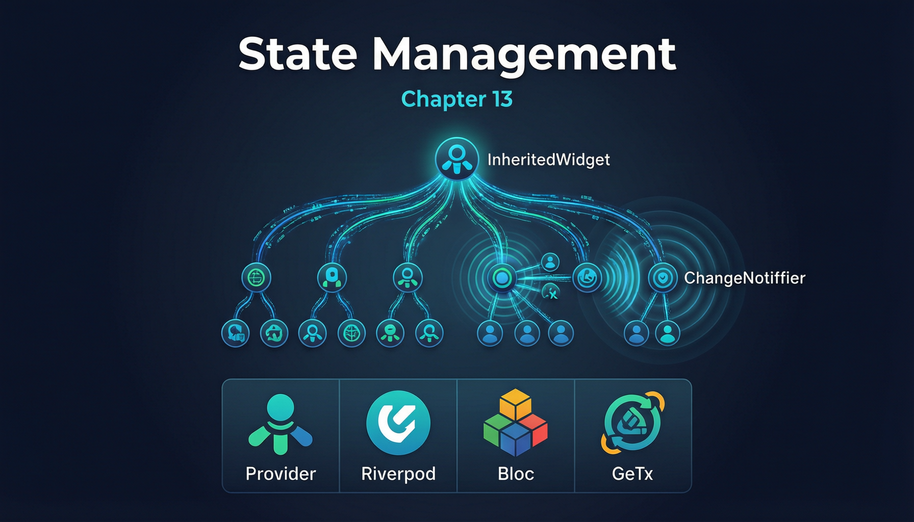

# 第十三章：状态管理与 InheritedWidget 原理



状态管理是 Flutter 开发中最受关注的话题之一。本章从 `InheritedWidget` 的底层机制出发，解析 Provider 等状态管理库的工作原理，并对主流方案进行原理级对比。

## 13.1 InheritedWidget 深入

在第十一章我们介绍了 `InheritedWidget` 的基本用法，本节深入其内部机制。

**依赖注册与通知的完整流程：**

```
1. Widget 树构建阶段:
   InheritedWidget → InheritedElement
   Element.mount() 时:
   → _inheritedWidgets[type] = this InheritedElement

2. 子 Widget 注册依赖:
   context.dependOnInheritedWidgetOfExactType<T>()
   → Element._inheritedWidgets[T] 查找
   → InheritedElement._dependents.add(this Element)
   → Element._dependencies.add(InheritedElement)
   → 返回 InheritedWidget 实例

3. 数据变化 → 通知:
   父 Widget rebuild → InheritedWidget.update(newWidget)
   → updateShouldNotify(oldWidget) 返回 true
   → notifyClients(oldWidget)
   → 遍历 _dependents:
     → dependant.didChangeDependencies()
     → dependant.markNeedsBuild()
     → 下一帧 rebuild
```

**`updateShouldNotify` 的设计哲学：**

这个方法让 `InheritedWidget` 的创建者决定"什么变化值得通知"。例如 `Theme` 的 `updateShouldNotify` 比较整个 `ThemeData`，而一个精细设计的 InheritedWidget 可以只比较特定字段。这是 Flutter "精确重建"理念的体现——只重建真正需要更新的 Widget。

**何时使用 InheritedWidget：**

Flutter 框架自身大量使用 `InheritedWidget`：

- `Theme` — 主题数据传递
- `MediaQuery` — 屏幕尺寸、安全区域、文字缩放因子
- `Navigator` — 导航器实例
- `Localizations` — 国际化资源
- `Directionality` — 文字方向（LTR/RTL）
- `DefaultTextStyle` — 默认文字样式
- `DefaultSelectionStyle` — 文本选择样式

当你需要跨多层级传递数据，且不想通过构造函数逐层传递（"prop drilling"），自定义 `InheritedWidget` 是最轻量的方案。但如果状态逻辑复杂（多个值联动、异步操作），建议使用 Provider 或其他上层库。

**自定义 InheritedWidget 最佳实践示例：**

```dart
import 'package:flutter/material.dart';

/// 使用 InheritedNotifier 简化通知逻辑
class UserScope extends InheritedNotifier<UserModel> {
  const UserScope({
    super.key,
    required UserModel userModel,
    required super.child,
  }) : super(notifier: userModel);

  static UserModel of(BuildContext context) {
    final scope = context.dependOnInheritedWidgetOfExactType<UserScope>();
    assert(scope != null, 'No UserScope found');
    return scope!.notifier!;
  }

  static UserModel? read(BuildContext context) {
    final scope = context.getInheritedWidgetOfExactType<UserScope>();
    return scope?.notifier;
  }
}

class UserModel extends ChangeNotifier {
  String _name = '张三';
  int _level = 1;

  String get name => _name;
  int get level => _level;

  void setName(String name) {
    _name = name;
    notifyListeners();
  }

  void levelUp() {
    _level++;
    notifyListeners();
  }
}

void main() => runApp(const InheritedNotifierDemo());

class InheritedNotifierDemo extends StatefulWidget {
  const InheritedNotifierDemo({super.key});

  @override
  State<InheritedNotifierDemo> createState() => _InheritedNotifierDemoState();
}

class _InheritedNotifierDemoState extends State<InheritedNotifierDemo> {
  final UserModel _userModel = UserModel();

  @override
  void dispose() {
    _userModel.dispose();
    super.dispose();
  }

  @override
  Widget build(BuildContext context) {
    return MaterialApp(
      home: UserScope(
        userModel: _userModel,
        child: Scaffold(
          appBar: AppBar(title: const Text('InheritedNotifier Demo')),
          body: const Center(
            child: Column(
              mainAxisAlignment: MainAxisAlignment.center,
              children: [
                _UserNameDisplay(),
                SizedBox(height: 12),
                _UserLevelDisplay(),
                SizedBox(height: 24),
                _ControlButtons(),
              ],
            ),
          ),
        ),
      ),
    );
  }
}

class _UserNameDisplay extends StatelessWidget {
  const _UserNameDisplay();

  @override
  Widget build(BuildContext context) {
    final user = UserScope.of(context);
    return Text('姓名: ${user.name}', style: const TextStyle(fontSize: 24));
  }
}

class _UserLevelDisplay extends StatelessWidget {
  const _UserLevelDisplay();

  @override
  Widget build(BuildContext context) {
    final user = UserScope.of(context);
    return Text('等级: ${user.level}', style: const TextStyle(fontSize: 20));
  }
}

class _ControlButtons extends StatelessWidget {
  const _ControlButtons();

  @override
  Widget build(BuildContext context) {
    // 使用 read() 不注册依赖，按钮本身不因 UserModel 变化而重建
    final user = UserScope.read(context)!;
    return Row(
      mainAxisAlignment: MainAxisAlignment.center,
      children: [
        ElevatedButton(
          onPressed: () => user.setName('李四'),
          child: const Text('改名'),
        ),
        const SizedBox(width: 16),
        ElevatedButton(
          onPressed: () => user.levelUp(),
          child: const Text('升级'),
        ),
      ],
    );
  }
}
```

`InheritedNotifier<T extends Listenable>` 是 `InheritedWidget` 的子类，它自动监听 `notifier` 的变化（通过 `addListener`），当 `notifyListeners()` 被调用时自动触发依赖者的重建。这消除了手动调用 `setState` 的需要，是 Provider 中 `ChangeNotifierProvider` 的底层实现原理。

## 13.2 Provider 模式

Provider 是 Flutter 官方推荐的状态管理方案，本质上是对 `InheritedWidget` 的封装和增强。

**完整示例（需要添加 `provider` 依赖）：**

```dart
import 'package:flutter/material.dart';
import 'package:provider/provider.dart';

void main() => runApp(const ProviderDemoApp());

// 数据模型
class CartModel extends ChangeNotifier {
  final List<String> _items = [];

  List<String> get items => List.unmodifiable(_items);
  int get itemCount => _items.length;
  double get totalPrice => _items.length * 10.0;

  void addItem(String item) {
    _items.add(item);
    notifyListeners();
  }

  void removeItem(String item) {
    _items.remove(item);
    notifyListeners();
  }
}

class CounterModel extends ChangeNotifier {
  int _count = 0;
  int get count => _count;

  void increment() {
    _count++;
    notifyListeners();
  }
}

class ProviderDemoApp extends StatelessWidget {
  const ProviderDemoApp({super.key});

  @override
  Widget build(BuildContext context) {
    return MultiProvider(
      providers: [
        ChangeNotifierProvider(create: (_) => CartModel()),
        ChangeNotifierProvider(create: (_) => CounterModel()),
      ],
      child: MaterialApp(
        title: 'Provider Demo',
        home: const _HomePage(),
      ),
    );
  }
}

class _HomePage extends StatelessWidget {
  const _HomePage();

  @override
  Widget build(BuildContext context) {
    return Scaffold(
      appBar: AppBar(
        title: const Text('Provider Demo'),
        actions: [
          // 使用 Consumer 监听 CartModel
          Consumer<CartModel>(
            builder: (context, cart, child) {
              return Badge(
                label: Text('${cart.itemCount}'),
                child: const Icon(Icons.shopping_cart),
              );
            },
          ),
          const SizedBox(width: 16),
        ],
      ),
      body: Center(
        child: Column(
          mainAxisAlignment: MainAxisAlignment.center,
          children: [
            // context.watch 监听并重建
            Text(
              '购物车商品数: ${context.watch<CartModel>().itemCount}',
              style: const TextStyle(fontSize: 20),
            ),
            const SizedBox(height: 12),

            // Selector 精确订阅特定属性
            Selector<CartModel, double>(
              selector: (_, cart) => cart.totalPrice,
              builder: (context, totalPrice, _) {
                return Text(
                  '总价: ¥$totalPrice',
                  style: const TextStyle(fontSize: 18, color: Colors.red),
                );
              },
            ),
            const SizedBox(height: 12),

            // context.read 不监听，仅读取
            ElevatedButton(
              onPressed: () {
                context.read<CartModel>().addItem('商品 ${DateTime.now().second}');
              },
              child: const Text('添加商品'),
            ),
            const SizedBox(height: 12),

            // 另一个独立的 Model
            Text(
              '计数器: ${context.watch<CounterModel>().count}',
              style: const TextStyle(fontSize: 20),
            ),
            ElevatedButton(
              onPressed: () => context.read<CounterModel>().increment(),
              child: const Text('+1'),
            ),
          ],
        ),
      ),
    );
  }
}
```

**原理解析：**

Provider 的核心是 `InheritedProvider<T>`，它继承自 `InheritedWidget`（更准确地说是 `SingleChildStatelessWidget` + `InheritedElement` 的组合）。`ChangeNotifierProvider` 的工作流程：

1. **创建**：`create` 回调被调用一次（在 `initState` 时机），创建 `ChangeNotifier` 实例
2. **注入**：`InheritedProvider` 将实例存入 Element 树的 `_inheritedWidgets` Map
3. **监听**：`context.watch<T>()` / `Consumer<T>` 内部调用 `dependOnInheritedWidgetOfExactType` 注册依赖，同时调用 `notifier.addListener(rebuildCallback)` 监听变化
4. **通知**：当 `ChangeNotifier` 调用 `notifyListeners()` 时，`rebuildCallback` 被触发，调用 `setState` → `markNeedsBuild` → 下一帧 rebuild
5. **清理**：`dispose` 时调用 `removeListener` 和 `ChangeNotifier.dispose`

**`Selector` 的精确订阅**：`Selector<CartModel, double>` 只在选择器返回的 `double`（`totalPrice`）发生变化时才重建。内部通过 `_shouldRebuild` 方法比较新旧选择值（使用 `==` 运算符），只有不相等时才触发重建。这避免了 `CartModel` 中其他属性（如 `_items` 列表引用）变化导致的不必要重建。

**`context.watch` vs `context.read`**：

- `watch` 等价于 `dependOnInheritedWidgetOfExactType`，注册依赖并在值变化时重建
- `read` 等价于 `getInheritedWidgetOfExactType`，仅读取当前值，不注册依赖

## 13.3 ValueNotifier / ChangeNotifier

`ValueNotifier` 和 `ChangeNotifier` 是 Flutter 内置的观察者模式实现，是状态管理的最小构建单元。

**完整示例：**

```dart
import 'package:flutter/material.dart';

void main() => runApp(const NotifierDemoApp());

class NotifierDemoApp extends StatelessWidget {
  const NotifierDemoApp({super.key});

  @override
  Widget build(BuildContext context) {
    return MaterialApp(
      title: 'Notifier Demo',
      home: const NotifierDemoPage(),
    );
  }
}

class NotifierDemoPage extends StatefulWidget {
  const NotifierDemoPage({super.key});

  @override
  State<NotifierDemoPage> createState() => _NotifierDemoPageState();
}

class _NotifierDemoPageState extends State<NotifierDemoPage> {
  // ValueNotifier: 单一值的简化版 ChangeNotifier
  final ValueNotifier<int> _counter = ValueNotifier(0);

  // ChangeNotifier: 更灵活，可包含多个字段和复杂逻辑
  late final _FormModel _formModel;

  // Listenable.merge: 合并多个 Listenable
  late final Listenable _mergedListenable;

  @override
  void initState() {
    super.initState();
    _formModel = _FormModel();
    _mergedListenable = Listenable.merge([_counter, _formModel]);
  }

  @override
  void dispose() {
    _counter.dispose();
    _formModel.dispose();
    super.dispose();
  }

  @override
  Widget build(BuildContext context) {
    return Scaffold(
      appBar: AppBar(title: const Text('Notifier Demo')),
      body: Center(
        child: Column(
          mainAxisAlignment: MainAxisAlignment.center,
          children: [
            // ValueListenableBuilder 监听 ValueNotifier
            ValueListenableBuilder<int>(
              valueListenable: _counter,
              builder: (_, value, __) {
                return Text('计数器: $value',
                    style: const TextStyle(fontSize: 24));
              },
            ),
            const SizedBox(height: 16),

            // AnimatedBuilder 监听 ChangeNotifier
            AnimatedBuilder(
              animation: _formModel,
              builder: (_, __) {
                return Column(
                  children: [
                    Text('姓名: ${_formModel.name}'),
                    Text('邮箱: ${_formModel.email}'),
                    Text('有效: ${_formModel.isValid}',
                        style: TextStyle(
                          color: _formModel.isValid ? Colors.green : Colors.red,
                        )),
                  ],
                );
              },
            ),
            const SizedBox(height: 16),

            // 监听合并后的 Listenable
            AnimatedBuilder(
              animation: _mergedListenable,
              builder: (_, __) {
                return Text(
                  '合并监听 → 计数: ${_counter.value}, '
                  '表单有效: ${_formModel.isValid}',
                  style: const TextStyle(fontSize: 14),
                );
              },
            ),
            const SizedBox(height: 24),

            Row(
              mainAxisAlignment: MainAxisAlignment.center,
              children: [
                ElevatedButton(
                  onPressed: () => _counter.value++,
                  child: const Text('计数+1'),
                ),
                const SizedBox(width: 16),
                ElevatedButton(
                  onPressed: () => _formModel.setName('用户${_counter.value}'),
                  child: const Text('更新姓名'),
                ),
                const SizedBox(width: 16),
                ElevatedButton(
                  onPressed: () =>
                      _formModel.setEmail('user${_counter.value}@test.com'),
                  child: const Text('更新邮箱'),
                ),
              ],
            ),
          ],
        ),
      ),
    );
  }
}

class _FormModel extends ChangeNotifier {
  String _name = '';
  String _email = '';

  String get name => _name;
  String get email => _email;
  bool get isValid => _name.isNotEmpty && _email.contains('@');

  void setName(String name) {
    _name = name;
    notifyListeners();
  }

  void setEmail(String email) {
    _email = email;
    notifyListeners();
  }
}
```

**原理解析：**

`ChangeNotifier` 内部维护一个 `_ListenerEntry` 链表（非 `List`，选择链表是为了高效的插入和删除操作）。`addListener` 创建新的 `_ListenerEntry` 并追加到链表尾部；`removeListener` 遍历链表找到匹配项并移除；`notifyListeners` 遍历整个链表，依次调用每个回调。

```dart
// ChangeNotifier 内部简化实现
class ChangeNotifier implements Listenable {
  _ListenerEntry? _head;
  int _count = 0;
  bool _notificationCallStackDepth = 0;

  void addListener(VoidCallback listener) {
    _head = _ListenerEntry(listener, _head);
    _count++;
  }

  void notifyListeners() {
    if (_count == 0) return;
    _notificationCallStackDepth++;
    _ListenerEntry? entry = _head;
    while (entry != null) {
      // 防止在通知过程中添加的监听器被立即调用
      if (entry.counter < _notificationCallStackDepth) {
        entry.listener();
      }
      entry = entry.next;
    }
    _notificationCallStackDepth--;
  }
}
```

`ValueNotifier<T>` 继承自 `ChangeNotifier`，增加了一个 `value` 属性，其 setter 自动调用 `notifyListeners()`：

```dart
class ValueNotifier<T> extends ChangeNotifier implements ValueListenable<T> {
  T _value;
  ValueNotifier(this._value);

  @override
  T get value => _value;
  set value(T newValue) {
    if (_value == newValue) return; // 短路优化
    _value = newValue;
    notifyListeners();
  }
}
```

`Listenable.merge` 创建一个 `_MergingListenable`，它内部持有多个 `Listenable`，为每个都注册监听器，当任一源 `Listenable` 触发时，`_MergingListenable` 也触发。这在需要同时监听多个独立状态源的场景中非常有用（如同时监听动画控制器和表单状态）。

## 13.4 ScopedModel / ScopedModelDescendant（简要介绍）

`ScopedModel` 是 Flutter 早期的官方推荐状态管理方案（在 Provider 出现之前），由 Brian Egan 开发。它的核心思想与 Provider 高度相似——通过 `InheritedWidget` 向下传递数据模型。

**核心 API：**

- `ScopedModel<T extends Model>`：将 Model 注入 Widget 树（等价于 `Provider<T>`）
- `ScopedModelDescendant<T>`：获取 Model 并重建（等价于 `Consumer<T>`）
- `Model`：基类，提供 `notifyListeners()` 方法（等价于 `ChangeNotifier`）

**与 Provider 的关系：**

`Provider` 的作者在开发 Provider 时参考了 `ScopedModel` 的设计。两者的核心区别：

- `ScopedModel` 的 `Model` 是自定义基类，与 Flutter 框架耦合度较高
- `Provider` 直接使用 Flutter 内置的 `ChangeNotifier`，更通用
- `Provider` 提供了更多高级特性（`Selector`、`MultiProvider`、`FutureProvider`、`StreamProvider`）

自 2019 年 Provider 发布后，`ScopedModel` 已不再维护。现有项目中已基本被 Provider 或 Riverpod 替代。

## 13.5 全局状态管理方案概览

所有 Flutter 状态管理方案最终都基于 `InheritedWidget` 的数据传递机制。以下是主流方案的原理级对比：

| 方案 | 核心思想 | 与 InheritedWidget 的关系 | 适用场景 |
|------|----------|---------------------------|----------|
| **Provider** | `ChangeNotifier` + `InheritedWidget` 封装 | 直接使用 `InheritedProvider<T>`（InheritedWidget 子类） | 中小型项目，快速开发 |
| **Riverpod** | Provider 的"精神续作"，编译时安全，不依赖 BuildContext | 底层仍使用 `InheritedWidget`（`UncontrolledProviderScope`） | 中大型项目，需要更好的可测试性 |
| **Bloc/Cubit** | 事件驱动 + 状态流（Stream），严格的单向数据流 | `BlocProvider` 基于 `InheritedWidget` 传递 Bloc 实例 | 大型企业应用，复杂业务逻辑 |
| **GetX** | 响应式 + 依赖注入 + 路由，全家桶方案 | `GetBuilder` 使用自定义的 `InheritedWidget` | 快速原型开发，小型项目 |
| **Redux** | 单一 Store + 纯函数 Reducer，不可变状态 | `StoreProvider` 使用 `InheritedWidget` 传递 Store | 有 Redux 背景的 Web 开发者 |

**深入对比：Provider vs Riverpod vs Bloc**

**Provider** 的问题：

- 依赖 `BuildContext` 查找 Provider，在某些场景（如 `initState` 中）不方便
- 运行时错误（Provider 未找到时崩溃）
- `MultiProvider` 嵌套层级深时可读性下降

**Riverpod** 的改进：

- Provider 声明为全局变量，不依赖 `BuildContext`
- 编译时类型安全
- 支持 `autoDispose`（自动清理未使用的状态）和 `family`（参数化 Provider）
- 底层使用 `ProviderScope`（InheritedWidget）+ `ProviderContainer`（独立的依赖容器）

**Bloc** 的特点：

- 将 UI 事件映射为 Event 对象，Bloc 处理 Event 并产出 State
- `Stream` 驱动，天然支持异步操作（`debounce`、`throttle` 等）
- `BlocBuilder` / `BlocListener` / `BlocConsumer` 提供精细的 UI 响应控制
- `BlocProvider` 底层使用 `InheritedProvider<Bloc>`

**核心洞察**：无论选择哪种方案，数据从顶层流向底层 Widget 的通道始终是 `InheritedWidget`。各方案的区别在于：如何创建和管理状态（ChangeNotifier / Stream / Reducer），以及如何让 Widget 订阅状态变化（依赖注册 + 通知回调的具体实现）。理解 `InheritedWidget` 的机制，是理解和选择任何状态管理方案的基础。

---

*全文完。*
