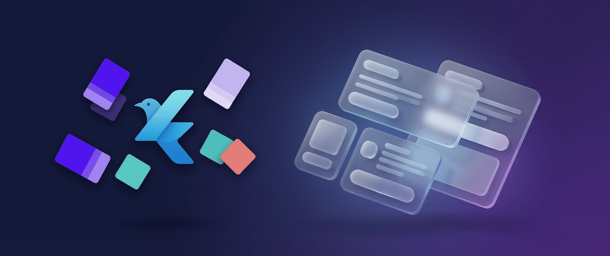
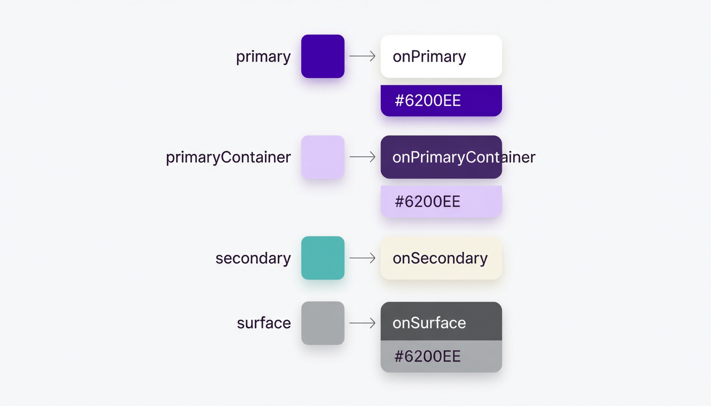
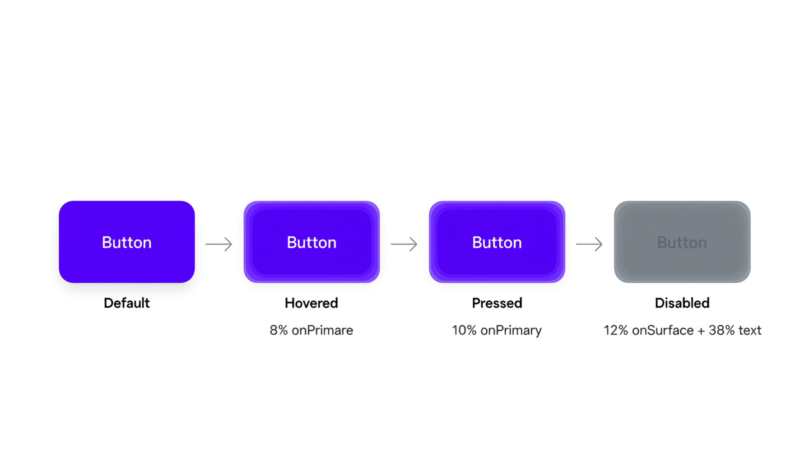
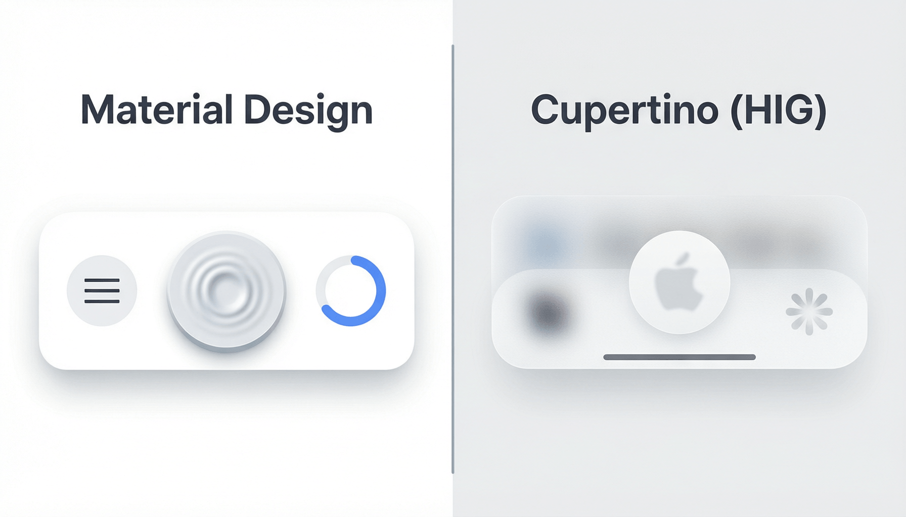
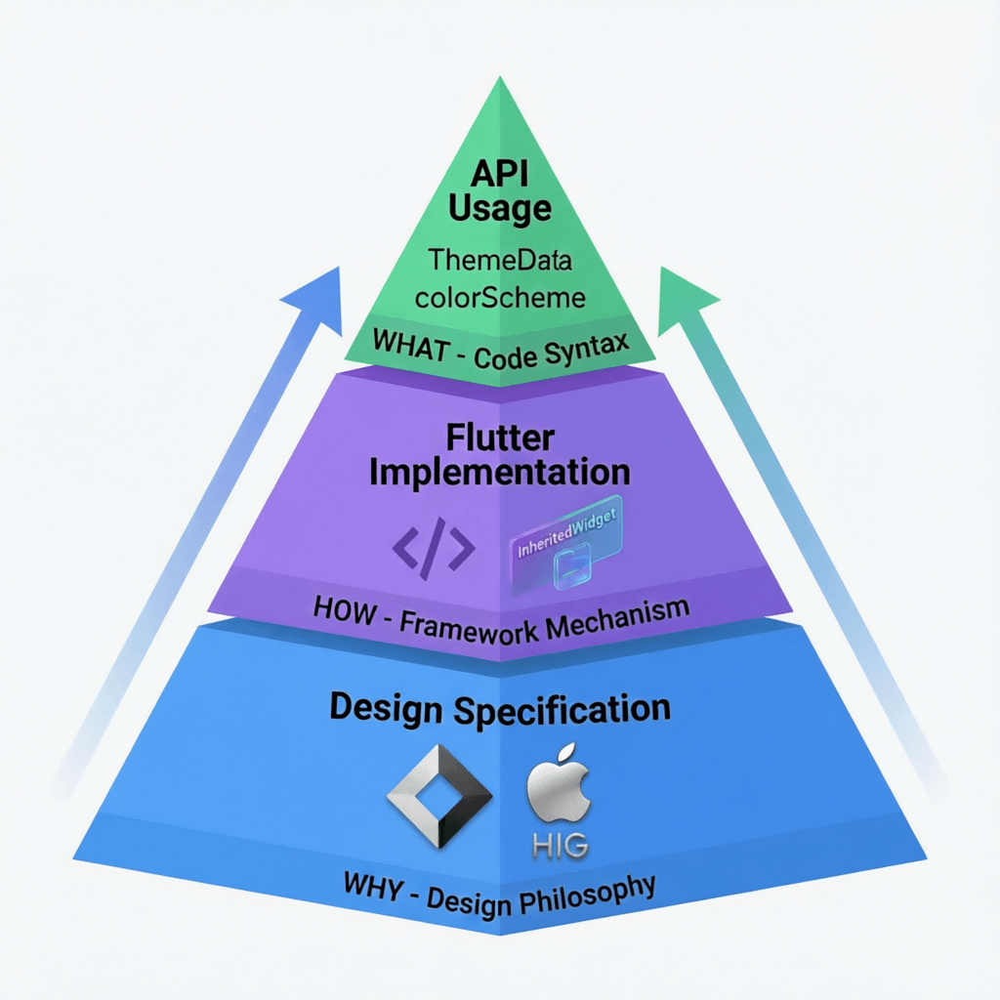

# 深入理解 Flutter 主题系统：从 API 到设计哲学



Flutter 的主题系统远不止是"定义几个颜色变量"那么简单。它的背后是 Material Design 3 和 Human Interface Guidelines 两套完整设计规范的工程化实现。本文将从表层 API 出发，逐步深入到设计规范层面，帮助你建立对 Flutter 主题系统的完整认知。

---

## 一、主题的本质：InheritedWidget 驱动的响应式配置

Flutter 中主题通过 `MaterialApp` 的 `theme` 参数注入：

```dart
MaterialApp(
  theme: ThemeData(
    useMaterial3: true,
    colorScheme: ColorScheme.fromSeed(seedColor: Colors.deepPurple),
  ),
  darkTheme: ThemeData(
    useMaterial3: true,
    colorScheme: ColorScheme.fromSeed(
      seedColor: Colors.deepPurple,
      brightness: Brightness.dark,
    ),
  ),
  themeMode: ThemeMode.system,
  home: MyHomePage(),
)
```

为什么必须通过 `MaterialApp.theme` 注入，而不是直接引用一个全局静态对象？原因只有一个：**Flutter 的 Material 组件源码里硬编码了 `Theme.of(context)`**。

`ElevatedButton` 内部读 `Theme.of(context).colorScheme.primary`，`AppBar` 内部读 `Theme.of(context).appBarTheme`，`Card` 内部读 `Theme.of(context).cardTheme`——这些都是框架代码，你改不了。`MaterialApp.theme` 不是"最佳实践"，而是"框架接口"，是 Material 组件读取主题的唯一入口。

当然，从纯粹的响应式角度看，`Theme.of(context)` 底层就是 InheritedWidget，和你用 Provider/Riverpod 管理一个全局对象并无本质区别。它的不可替代性不在于响应式能力，而在于框架内部硬编码从这个通道读取配置。

---

## 二、ColorScheme：语义化的颜色角色体系

### 什么是"语义化颜色角色"

这是 Material 3 设计体系的核心创新。传统方案用"零散的颜色变量"命名：

```dart
// 传统方案：描述"是什么颜色"或"用在哪里"
Color buttonColor = Color(0xFF6200EE);
Color buttonTextColor = Colors.white;
Color buttonHoverColor = Color(0xFF7C3AED);
Color buttonDisabledColor = Color(0xFFE0E0E0);
```

M3 的 `ColorScheme` 转而定义**颜色在设计系统中承担的角色**：

```dart
// M3 方案：描述"这个颜色扮演什么角色"
colorScheme.primary          // 品牌主色，最重要的操作
colorScheme.onPrimary        // 放在 primary 之上的内容色
colorScheme.primaryContainer // 主色的柔和容器变体
colorScheme.onPrimaryContainer // 放在容器上的内容色
```



### on* 配对机制的精妙设计

`ColorScheme` 最核心的设计是：**任何可以作为背景的颜色，都有一个对应的 `on*` 版本**。你不需要关心 `primary` 是深紫还是浅蓝，只要背景用了 `primary`，前景就用 `onPrimary`，对比度一定达标。

```dart
Container(
  color: colorScheme.primary,
  child: Text(
    'Click me',
    style: TextStyle(color: colorScheme.onPrimary), // 保证可读性
  ),
)

Container(
  color: colorScheme.errorContainer,
  child: Icon(
    Icons.warning,
    color: colorScheme.onErrorContainer, // 保证对比度
  ),
)
```

这个配对关系是 M3 通过 **HCT 色彩空间**算法保证的，符合 WCAG 无障碍规范。

### fromSeed 的价值

`ColorScheme.fromSeed` 的核心价值是：根据一个种子色，自动生成一整套协调的、符合 M3 规范的 30+ 颜色角色：

```dart
// 一行代码，生成完整调色板
ColorScheme.fromSeed(seedColor: Color(0xFF6200EE))
```

同一个种子色在亮暗模式下生成的 `primary` 值**完全不同**——亮色模式可能是深紫 `#6200EE`，暗色模式会自动"提亮"为 `#D0BCFF`。这是 M3 的设计意图：暗色背景下 primary 需要更浅，才能从深色中"浮"出来。

---

## 三、State Layer：用算法替代变量爆炸

### 传统方案的痛点

一个按钮需要多少颜色变量？默认色、文字色、hover 色、pressed 色、focused 色、disabled 背景色、disabled 文字色……一个按钮就要 7+ 个变量，暗色模式翻倍变 14 个。应用里有多少组件？颜色变量轻松膨胀到上百个。

### M3 的解法：状态层

M3 不再为每个状态定义独立颜色，而是引入**状态层（State Layer）**——在原有颜色上叠加一层半透明的覆盖色：

| 状态 | 叠加层透明度 |
|------|:---:|
| Hovered | 8% |
| Focused | 10% |
| Pressed | 10% |
| Dragged | 16% |



一个 Filled Button 的 hover 效果：在 `primary` 背景上叠加 `onPrimary` 的 8% 透明层。视觉上按钮微微"亮"了一点，这就是 hover 反馈。你不需要定义 `buttonHoverColor`——它是算法生成的。

**变量数量从 16 降到 3**（`primary` + `onPrimary` + disabled 时的 `onSurface`），且所有组件的 hover/pressed 效果都遵循同一套规则，视觉一致性天然保证。

### Disabled 状态的规范化

M3 对 disabled 状态有全局统一规范：

- 背景：`onSurface` 的 **12%** 透明度
- 文字/图标：`onSurface` 的 **38%** 透明度

这条规则适用于所有可禁用组件，记住这一条就够了。

---

## 四、文章内容的颜色层级

### 颜色管"角色"，TextTheme 管"层级"

M3 把文字视觉分为两个正交维度：颜色维度由 `ColorScheme` 的角色决定，字号字重维度由 `TextTheme` 的 15 个预设样式决定。

文章场景的核心颜色映射：

| 角色 | 用途 |
|------|------|
| `onSurface` | 正文主要文字、各级标题 |
| `onSurfaceVariant` | 次要文字、说明文字、元信息 |
| `primary` | 链接、强调、可交互文字 |
| `outline` | 极弱文字、分隔线 |
| `onSecondaryContainer` | Note 提示框内文字 |
| `onTertiaryContainer` | Tip 提示框内文字 |
| `onErrorContainer` | Warning/Error 提示内文字 |

**重要**：M3 不再用透明度区分主次文字（这是 M2 的做法，如 `black.withOpacity(0.6)`）。而是通过独立角色 `onSurface` 和 `onSurfaceVariant` 区分，暗色模式自动切换。

### 各级标题

标题层级靠**字号和字重**区分，颜色统一用 `onSurface`：

```dart
// H1 → H5 递进：字号递减，颜色不变
Text('大标题', style: tt.headlineLarge?.copyWith(color: cs.onSurface, fontWeight: FontWeight.w700))
Text('二级标题', style: tt.headlineMedium?.copyWith(color: cs.onSurface))
Text('三级标题', style: tt.titleLarge?.copyWith(color: cs.onSurface))
Text('四级标题', style: tt.titleMedium?.copyWith(color: cs.onSurface))
```

### 减少显式引用的技巧

并非每个组件都需要显式写 `style`。Material 组件自带默认样式决议——`ListTile` 的 title 自动用 bodyLarge + onSurface，subtitle 自动用 bodyMedium + onSurfaceVariant。

对于自定义布局，可以用 `DefaultTextStyle` 设置区域默认，或封装语义化组件：

```dart
class ArticleCaption extends StatelessWidget {
  final String text;
  const ArticleCaption(this.text, {super.key});

  @override
  Widget build(BuildContext context) {
    final theme = Theme.of(context);
    return Text(
      text,
      style: theme.textTheme.labelMedium?.copyWith(
        color: theme.colorScheme.onSurfaceVariant,
      ),
    );
  }
}

// 使用时极其干净
ArticleCaption('张三 · 2026-07-07 · 阅读 3 分钟')
```

---

## 五、UI 稿与 seedColor 的冲突解决

### 问题本质

设计师给的是精确 hex 值，M3 的 seedColor 要自动生成——两者哲学冲突。

### 推荐方案：种子色 + 精确覆盖关键角色

```dart
static ColorScheme _buildColorScheme(Brightness brightness) {
  // 先用种子色生成基础调色板
  final base = ColorScheme.fromSeed(
    seedColor: AppColors.brandPrimary,
    brightness: brightness,
  );
  
  // 覆盖设计稿明确指定的关键颜色（成对覆盖！）
  return base.copyWith(
    primary: brightness == Brightness.light
        ? const Color(0xFF6200EE)
        : const Color(0xFFBB86FC),    // 暗色模式必须单独指定
    onPrimary: brightness == Brightness.light
        ? Colors.white
        : const Color(0xFF1F0A4D),
    // 其余角色保留 fromSeed 生成的结果
  );
}
```

关键原则：

1. **成对覆盖**：覆盖 `primary` 就必须覆盖 `onPrimary`
2. **暗色单独校对**：亮色下好用的颜色暗色下大概率不好用
3. **保留派生角色**：设计稿未指定的让算法生成，保持协调
4. **业务专属色用 ThemeExtension**：VIP 金色、活动荧光色不应污染 ColorScheme

---

## 六、Material Design 与 Cupertino（HIG）：两种设计哲学

Flutter 同时实现了 Google 的 Material Design 和 Apple 的 Human Interface Guidelines 两套规范，分别对应 `material.dart` 和 `cupertino.dart` 两个组件库。



### 设计哲学根本分歧

**Material Design** 的隐喻是"纸和墨水"——界面元素像不同高度的纸片堆叠，通过阴影和表面色彩表达层次。倾向于**表达性**，鼓励大胆的颜色、醒目的动画。

**Cupertino（HIG）** 的隐喻是"透明玻璃"——界面元素像半透明磨砂玻璃层叠，通过模糊和透明度表达深度。倾向于**克制**，追求内容优先、让界面"消失"。

一句话：Material 说"看看我的设计多精彩"，Cupertino 说"别看我，看内容"。

### 关键差异速览

| 维度 | Material Design 3 | Cupertino (HIG) |
|------|-------------------|-----------------|
| 层次表达 | 阴影 + surface tint | 模糊 + 半透明 |
| 点击反馈 | Ripple 水波纹扩散 | 透明度降低 |
| 颜色体系 | 30+ 语义角色 + 种子色算法 | 少量系统色 + 四档灰度 |
| 按钮类型 | 5 种（Filled/Tonal/Elevated/Outlined/Text） | 2 种（普通/填充） |
| 选择器 | 日历网格/圆盘拨针 | 滚轮（Picker） |
| 导航 | NavigationBar/Drawer | TabBar + Push 导航 |
| 加载指示 | CircularProgressIndicator | 菊花转 ActivityIndicator |
| 滚动边界 | 发光效果（Glow） | 弹性回弹（Bounce） |

### 它们和 Flutter 的关系

**Material Design 和 HIG 本身只是设计规范文档**——定义颜色怎么用、按钮长什么样、动画怎么做，跟具体技术无关。

**Flutter 做的事情是用 Dart 代码把这两套规范各实现了一遍**。Android 用 Java/Kotlin + View 系统实现了 Material，iOS 用 UIKit/SwiftUI 实现了 HIG，Flutter 用自绘引擎又各实现了一遍。

不过 Flutter 对 Material 的实现比 Cupertino 完整得多——Material 几乎覆盖了规范里的所有组件（Google 官方维护），而 Cupertino 只实现了最常用的部分。这也是为什么很多跨平台应用最终选择统一用 Material。

---

## 七、学习路径：三层认知模型



### 底层：设计规范（WHY）

理解 M3 为什么把颜色分成这些角色、为什么状态用叠加层、为什么按钮分五种类型。这决定了你**做正确的设计决策**。

### 中层：Flutter 实现机制（HOW）

InheritedWidget 怎么传递主题、组件内部怎么读默认值、fromSeed 怎么生成色板。这决定了你**写正确的代码**。

### 表层：API 用法（WHAT）

ThemeData 有哪些字段、copyWith 怎么用、组件主题怎么配。这只是最终落笔的动作。

大多数教程只教表层，遇到问题就没有判断力。**从"怎么写"推到"为什么这么设计"**——理解了设计意图，之后任何主题相关的问题都能从设计规范出发推导出正确做法，而不是靠背 API。

---

## 八、实战代码：符合 M3 规范的主题定义

```dart
class AppTheme {
  AppTheme._();

  static const _brandSeed = Color(0xFF6200EE);

  static ThemeData _buildTheme(Brightness brightness) {
    final colorScheme = ColorScheme.fromSeed(
      seedColor: _brandSeed,
      brightness: brightness,
    );

    return ThemeData(
      useMaterial3: true,
      colorScheme: colorScheme,
      // 不设置 scaffoldBackgroundColor，自动用 surface

      appBarTheme: const AppBarTheme(
        centerTitle: true,
        // 不设置颜色，M3 默认 surface + onSurface
      ),

      filledButtonTheme: FilledButtonThemeData(
        style: FilledButton.styleFrom(
          minimumSize: const Size(double.infinity, 48),
        ),
      ),

      inputDecorationTheme: InputDecorationTheme(
        filled: true,
        border: OutlineInputBorder(
          borderRadius: BorderRadius.circular(8),
          borderSide: BorderSide.none,
        ),
        focusedBorder: OutlineInputBorder(
          borderRadius: BorderRadius.circular(8),
          borderSide: BorderSide(color: colorScheme.primary, width: 2),
        ),
        errorBorder: OutlineInputBorder(
          borderRadius: BorderRadius.circular(8),
          borderSide: BorderSide(color: colorScheme.error),
        ),
        contentPadding: const EdgeInsets.symmetric(horizontal: 16, vertical: 14),
      ),

      cardTheme: CardThemeData(
        elevation: 1,
        shape: RoundedRectangleBorder(borderRadius: BorderRadius.circular(12)),
      ),
    );
  }

  static ThemeData get lightTheme => _buildTheme(Brightness.light);
  static ThemeData get darkTheme => _buildTheme(Brightness.dark);
}
```

核心要点：所有颜色来自 ColorScheme，不引用具体颜色常量；亮色和暗色共用一套构建逻辑；充分信任 M3 默认值，只在必要时覆盖。

---

## 总结

Flutter 主题系统的价值不在于"能设置颜色"，而在于它把一整套经过严格推敲的设计规范（Material Design 3）编码为了可执行的 Dart 代码。当你用 `ColorScheme.fromSeed` 生成调色板时，背后是 HCT 色彩空间算法保证的无障碍对比度；当你放一个 ElevatedButton 时，hover/pressed/disabled 的所有状态层效果自动正确。

**最重要的心法是：把"每一个 hex 都不能变"的强需求，转化为"每一个语义角色都要符合设计意图"的软需求**——这一步转化完成，M3 就能真正为你所用。

学习主题，浅层是定义和使用的过程，深层是 Material Design 和 HIG 两套设计哲学。代码只是载体，设计规范才是灵魂。
