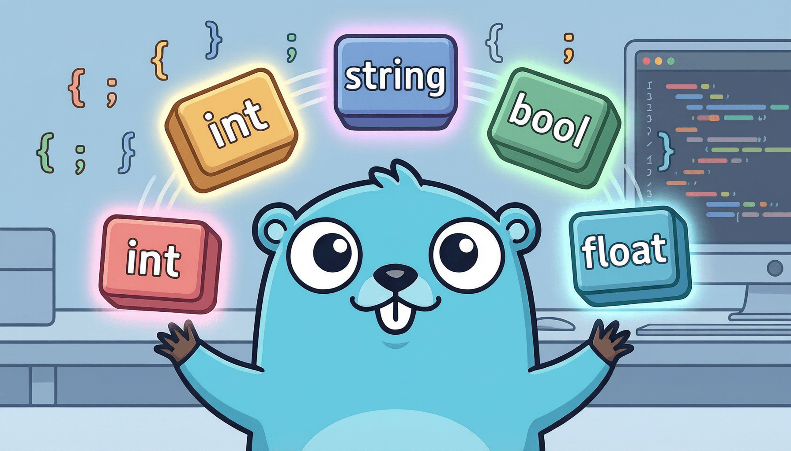

# 第二章 变量、类型与基础语法



在上一章中，我们已经成功搭建了 Go 的开发环境并运行了第一个程序。现在，让我们正式踏入 Go 语言的世界，从最基础也最重要的概念开始——变量、类型与控制流。

如果把写程序比作"烹饪"，那么变量就是盛放食材的"碗"，数据类型决定了碗的大小和形状，而控制流则是你做菜的"步骤"——先放什么、后放什么、要不要重复某个动作。掌握了这些，你就能看懂绝大多数 Go 代码了。

---

## 2.1 变量：给数据一个名字

变量，本质上就是一段内存空间的"别名"。当你写下 `age := 25`，你其实是在告诉计算机："请给我一块内存，把 25 放进去，以后我叫 `age` 的时候你就知道我在说它。"

Go 提供了三种声明变量的方式，每一种都有它存在的理由：

```go
package main

import "fmt"

func main() {
    // 方式一：显式指定类型
    // 这种写法最"完整"，明确告诉编译器变量的类型
    var name string = "张三"
    var age int = 25

    // 方式二：省略类型，由编译器自动推断
    // 编译器看到 "李四" 是字符串，就自动把 name2 推断为 string 类型
    var name2 = "李四"
    var age2 = 30 // 推断为 int

    // 方式三：短声明（short variable declaration）
    // 这是日常写代码最常用的方式，简洁明了
    // 注意：:= 只能在函数内部使用
    name3 := "王五"
    age3 := 35

    fmt.Println(name, age)
    fmt.Println(name2, age2)
    fmt.Println(name3, age3)
}
```

**为什么有三种方式？** 这不是 Go 故意制造复杂性，而是每种方式服务于不同场景。方式一适合"我要声明一个变量，但现在还不想赋值"的情况；方式二是方式一的简化；方式三则是"我既想声明又想立刻赋值"时的最佳选择。

### 零值（Zero Value）

Go 有一个重要的设计理念：**所有未显式初始化的变量，都会被自动赋予一个"零值"**。这不是 bug，而是有意为之。

```go
package main

import "fmt"

func main() {
    // 没有赋值？没关系，Go 会给你零值
    var a int       // 零值是 0
    var b float64   // 零值是 0.0
    var c string    // 零值是 ""（空字符串）
    var d bool      // 零值是 false
    var e *int      // 指针的零值是 nil

    fmt.Printf("a=%d, b=%f, c=%q, d=%t, e=%v\n", a, b, c, d, e)
    // 输出：a=0, b=0.000000, c="", d=false, e=<nil>
}
```

很多语言（如 Java）要求变量必须先初始化才能使用，否则编译器会报错。Go 为什么不这样做？因为 Go 的设计者认为：**一个被赋予零值的变量，至少是"可用"的**。一个值为 0 的计数器、值为空字符串的名称字段，在程序刚启动时是完全合理的状态。这避免了大量的 `= 0`、`= ""`、`= false` 的样板代码。

### 变量遮蔽（Variable Shadowing）

这是新手常踩的坑。当内层作用域声明了一个与外层同名的变量时，内层变量会"遮蔽"外层变量：

```go
package main

import "fmt"

func main() {
    x := 10 // 外层 x

    if true {
        x := 20 // 这里声明了一个新的 x，遮蔽了外层的 x
        // 注意是 := 而不是 =，这意味着"声明并赋值一个新的变量"
        fmt.Println("内层 x =", x) // 输出 20
    }

    fmt.Println("外层 x =", x) // 输出 10，外层的 x 从未被改变！
}
```

**避坑指南：** 如果你本意是修改外层变量，应该用 `=` 赋值，而不是用 `:=` 重新声明。Go 的编译器工具 `go vet` 可以帮你检测变量遮蔽问题，建议养成运行 `go vet ./...` 的习惯。

---

## 2.2 常量与 iota：Go 的枚举之道

常量是在编译时就能确定值、且运行期间不可改变的数据。你可以把常量理解为"刻在石头上的数字"——程序运行后就不能再改了。

```go
package main

import "fmt"

func main() {
    // 常量的定义
    const Pi = 3.14159265358979
    const Language = "Go"

    // 常量不支持取地址操作（&Language 会报错）
    // 因为常量可能根本不占内存，它更像是编译期的"文本替换"

    // iota：自增常量生成器
    const (
        Sunday    = iota // 0
        Monday           // 1
        Tuesday          // 2
        Wednesday        // 3
        Thursday         // 4
        Friday           // 5
        Saturday         // 6
    )

    fmt.Println(Sunday, Monday, Saturday) // 输出：0 1 6
}
```

`iota` 是 Go 中一个非常精巧的设计。它从 0 开始，在每个 `const` 声明行自动加 1。当遇到新的 `const (...)` 块时，iota 重置为 0。这让你无需手动给每个枚举值编号，也避免了编号错误。

### iota 的进阶用法

iota 远不止"从 0 自增"那么简单，它还能配合表达式创造出强大的模式：

```go
package main

import "fmt"

func main() {
    // 用法一：位掩码（bitmask）
    // 在权限控制、状态标记等场景中非常实用
    const (
        Read    = 1 << iota // 1 << 0 = 1   (二进制: 0001)
        Write               // 1 << 1 = 2   (二进制: 0010)
        Execute             // 1 << 2 = 4   (二进制: 0100)
    )
    // 可以用位运算组合权限
    const ReadWrite = Read | Write // 3 (二进制: 0011)
    fmt.Println(Read, Write, Execute, ReadWrite) // 1 2 4 3

    // 用法二：跳值
    const (
        _      = iota // 用 _ 跳过 0
        KB            // 1
        MB            // 2
        GB            // 3
    )
    // 不过更常见的是用位移来表示存储单位：
    const (
        _   = iota          // 忽略 0
        KiB = 1 << (10 * iota) // 1 << 10  = 1024
        MiB = 1 << (10 * iota) // 1 << 20  = 1048576
        GiB = 1 << (10 * iota) // 1 << 30  = 1073741824
    )
    fmt.Println(KiB, MiB, GiB)
}
```

**为什么 Go 用 iota 而不是传统的 `enum` 关键字？** C 和 Java 等语言有专门的 `enum` 关键字来定义枚举。Go 的设计者认为 `enum` 本质上是"一组相关常量的集合"，用 `const + iota` 已经能完美表达这个意图，而且更加灵活（可以配合任意表达式）。与其增加一个关键字，不如用已有的机制组合出相同的能力——这正是 Go"少即是多"哲学的体现。

---

## 2.3 基本数据类型全解

Go 的类型系统是强类型的，这意味着每个变量都有明确的类型，不同类型之间不能随意混用。这看似"麻烦"，实则是帮你把错误拦截在编译期。

### 整数类型

Go 提供了丰富的整数类型，分为有符号（`int`）和无符号（`uint`）两大类：

| 类型 | 大小 | 范围 |
|------|------|------|
| int8 / uint8 | 1 字节 | -128~127 / 0~255 |
| int16 / uint16 | 2 字节 | -32768~32767 / 0~65535 |
| int32 / uint32 | 4 字节 | 约 ±21 亿 / 0~约 42 亿 |
| int64 / uint64 | 8 字节 | 约 ±922 亿亿 / 0~约 1844 亿亿 |
| int / uint | 平台相关 | 32 位系统=4 字节，64 位系统=8 字节 |

日常开发中，除非有特殊的内存或协议要求，一般直接使用 `int` 就好。

### 浮点类型

`float32` 和 `float64` 分别对应 IEEE 754 标准的单精度和双精度浮点数。**永远不要用浮点数做精确比较：**

```go
package main

import "fmt"

func main() {
    a := 0.1
    b := 0.2
    c := a + b

    // 这不是 Go 的问题，是所有使用 IEEE 754 浮点数标准的语言共同的问题
    fmt.Println(c == 0.3)           // false! 实际值约为 0.30000000000000004
    fmt.Printf("c = %.20f\n", c)   // 看清它的真面目

    // 正确做法：用差值比较
    diff := c - 0.3
    if diff < 0 {
        diff = -diff
    }
    if diff < 1e-9 {
        fmt.Println("近似相等")
    }
}
```

### 字符串：不可变与 UTF-8

Go 的字符串是**不可变的字节序列**，默认采用 UTF-8 编码。"不可变"意味着一旦创建，你就不能修改字符串中的某个字符——你只能创建一个全新的字符串。这个设计让字符串在并发场景下天然安全，也便于内存优化（比如字符串共享）。

```go
package main

import "fmt"

func main() {
    s := "你好，Go！"

    // len() 返回的是字节数，不是字符数！
    // "你好，Go！" 中每个中文字符占 3 个字节，英文和感叹号占 1 个字节
    fmt.Println("字节数:", len(s)) // 输出取决于具体编码

    // 用 rune 来正确遍历 Unicode 字符
    // rune 是 int32 的别名，代表一个 Unicode 码点
    for i, r := range s {
        fmt.Printf("索引 %d: %c (Unicode: U+%04X)\n", i, r, r)
    }

    // 字符串拼接产生新字符串，原字符串不变
    s2 := s + " 真棒！"
    fmt.Println(s)  // 原值不变
    fmt.Println(s2) // 新的字符串
}
```

理解 `byte` 和 `rune` 的关系非常重要：`byte`（即 `uint8`）是处理原始字节的最小单位，而 `rune`（即 `int32`）代表一个完整的 Unicode 字符。对于纯英文文本，两者没有区别；但处理中文、日文、emoji 等多字节字符时，必须使用 `rune`。

### 类型转换：Go 的严格规则

Go 不允许隐式类型转换。想把 `int` 变成 `float64`？你必须显式写出来：

```go
package main

import "fmt"

func main() {
    var a int = 42
    // var b float64 = a       // 编译错误！不允许隐式转换
    var b float64 = float64(a) // 必须显式转换

    var c int32 = 100
    // var d int = c           // 编译错误！即使 int 和 int32 在你的机器上大小一样也不行
    var d int = int(c)         // 必须显式转换

    fmt.Println(a, b, c, d)
}
```

**这种"严格"是一种哲学选择。** C/C++ 的隐式转换虽然方便，却导致了无数难以排查的 bug——一个 `int` 悄悄变成 `float` 丢失了精度，一个 `int64` 隐式窄化为 `int32` 发生了溢出。Go 宁愿你多写几个字，也不愿让你在凌晨三点调试一个类型转换引发的幽灵 bug。

---

## 2.4 运算符

Go 的运算符大体与其他 C 系语言一致，但有几个值得特别注意的点。

**算术运算符：** `+`、`-`、`*`、`/`、`%`（取余）。注意 Go **没有** `++` 和 `--` 作为表达式——它们是语句。这意味着你不能写 `a = b++`，只能单独写一行 `b++`。这同样是 Go 为了减少歧义和副作用而做的设计选择。

**比较运算符：** `==`、`!=`、`<`、`<=`、`>`、`>=`。

**逻辑运算符：** `&&`（与）、`||`（或）、`!`（非），支持短路求值。

**位运算符：** `&`（按位与）、`|`（按位或）、`^`（按位异或）、`&^`（按位清除，Go 独有）、`<<`、`>>`。

```go
package main

import "fmt"

func main() {
    // 算术运算
    fmt.Println(10 / 3)   // 3（整数除法，截断小数部分）
    fmt.Println(10.0 / 3) // 3.3333333333333335（浮点除法）
    fmt.Println(10 % 3)   // 1（取余）

    // Go 独有的 &^ 运算符（bit clear）
    // a &^ b 的含义：把 a 中对应 b 为 1 的位清零
    a := 0b1111 // 15
    b := 0b0101 // 5
    fmt.Printf("a &^ b = %04b\n", a&^b) // 1010（第 0 位和第 2 位被清除）
}
```

**运算符优先级**（从高到低）：`*` `/` `%` `<<` `>>` `&` `&^` → `+` `-` `|` `^` → `==` `!=` `<` `<=` `>` `>=` → `&&` → `||`。拿不准的时候，加括号永远不会错。

---

## 2.5 控制流：if 的智慧

Go 的 `if` 语句有两个显著特点：**不需要括号**，以及**支持初始化语句**。

```go
package main

import "fmt"

func main() {
    score := 85

    // 基本 if-else，注意条件不需要括号
    if score >= 90 {
        fmt.Println("优秀")
    } else if score >= 60 {
        fmt.Println("及格")
    } else {
        fmt.Println("不及格")
    }

    // if 的初始化语句：在判断条件之前执行一条语句
    // err 的作用域仅限于这个 if-else 块，外部无法访问
    // 这个设计极大地减少了变量泄漏到外部作用域的风险
    if result := calculate(10); result > 0 {
        fmt.Println("结果是正数:", result)
    } else {
        fmt.Println("结果不是正数:", result)
    }
    // fmt.Println(result) // 编译错误！result 在这个作用域不存在
}

func calculate(x int) int {
    return x * x - 50
}
```

**为什么不需要括号？** 在 C/Java 中，`if (x > 0)` 的括号是语法要求，但它们对编译器来说其实是冗余信息——花括号 `{}` 已经明确标记了代码块的边界。Go 的设计者 Rob Pike 认为去掉括号能减少视觉噪音，让代码更加清爽。同时，这也消除了"忘记加括号"导致的经典 bug（比如 `if (x = 5)` 误用赋值代替比较的问题在 Go 中不会发生，因为 Go 的条件必须是 `bool` 类型）。

---

## 2.6 控制流：for 的万能

Go 没有 `while`，没有 `do-while`，没有 `foreach`——它只有一个 `for`，但 `for` 能以四种形态出现，覆盖所有循环场景。

```go
package main

import "fmt"

func main() {
    // 形态一：经典三段式（等同于 C 的 for）
    for i := 0; i < 5; i++ {
        fmt.Printf("经典循环: %d ", i)
    }
    fmt.Println()

    // 形态二：条件循环（替代 while）
    n := 10
    for n > 0 {
        n = n / 2
        fmt.Printf("减半: %d ", n)
    }
    fmt.Println()

    // 形态三：无限循环
    // for {
    //     // 永远执行，除非遇到 break 或 return
    // }

    // 形态四：for range（遍历集合）
    fruits := []string{"苹果", "香蕉", "橙子"}
    for index, value := range fruits {
        fmt.Printf("[%d] = %s ", index, value)
    }
    fmt.Println()

    // 遍历字符串时，range 按 rune 遍历（正确处理多字节字符）
    for i, ch := range "你好Go" {
        fmt.Printf("(%d, %c) ", i, ch)
    }
    fmt.Println()
}
```

### break、continue 与 label

当你需要从嵌套循环中跳出时，普通的 `break` 只能跳出最内层循环。Go 提供了**标签（label）** 来解决这个问题：

```go
package main

import "fmt"

func main() {
    // 使用标签从多层循环中直接跳出
outer:
    for i := 0; i < 3; i++ {
        for j := 0; j < 3; j++ {
            if i == 1 && j == 1 {
                fmt.Println("在 i=1, j=1 时跳出外层循环")
                break outer // 直接跳出标记为 outer 的循环
            }
            fmt.Printf("i=%d, j=%d  ", i, j)
        }
    }
    fmt.Println("循环结束")
}
```

**为什么 Go 只保留一个循环关键字？** Rob Pike 曾解释说：在 C 语言中，`for`、`while`、`do-while` 三种循环本质上可以互相转换，它们的存在增加了语言的复杂度却没有增加表达力。Go 只保留 `for`，配合不同的写法就能覆盖所有场景。这不是功能的削减，而是认知的简化——你只需要记住一个关键字。

---

## 2.7 控制流：switch 的灵活

Go 的 `switch` 相比 C/Java 有几个重要的改进：**默认自动 break**（不需要每个 case 后写 `break`）、**case 后可以是任意表达式**、**switch 后可以不写条件**。

```go
package main

import "fmt"

func main() {
    // 基本 switch
    day := "周三"
    switch day {
    case "周一", "周二", "周三", "周四", "周五":
        // 多值匹配：用逗号分隔多个值
        fmt.Println(day, "是工作日")
    case "周六", "周日":
        fmt.Println(day, "是休息日")
    default:
        fmt.Println("未知的一天")
    }
    // 注意：匹配到 case 后自动跳出，不会"贯穿"到下一个 case

    // 无条件 switch：switch 后面不写表达式
    // 此时每个 case 是一个完整的布尔表达式
    // 这种写法比一连串的 if-else 更加整洁
    score := 75
    switch {
    case score >= 90:
        fmt.Println("A")
    case score >= 80:
        fmt.Println("B")
    case score >= 70:
        fmt.Println("C")
    case score >= 60:
        fmt.Println("D")
    default:
        fmt.Println("F")
    }

    // fallthrough：强制"贯穿"到下一个 case
    // 很少使用，但在某些需要累积处理的场景中有用
    num := 5
    switch num {
    case 5:
        fmt.Println("num 是 5")
        fallthrough // 继续执行下一个 case 的代码
    case 10:
        fmt.Println("这行也会被打印")
        // 注意：fallthrough 不能用在 switch 的最后一个 case 中
    }
}
```

Go 还提供了 **type switch**，用于判断接口值的实际类型。这是 Go 类型系统中非常重要的一环，我们将在后面的接口章节详细讲解。这里仅做预告：

```go
// type switch 预告（完整讲解见接口章节）
// 可以根据接口变量的实际类型执行不同分支
// switch v := x.(type) {
// case int:
//     fmt.Println("x 是整数:", v)
// case string:
//     fmt.Println("x 是字符串:", v)
// default:
//     fmt.Println("未知类型")
// }
```

---

## 2.8 本章小结

让我们回顾一下本章的核心要点：

**变量与常量**

- Go 提供三种变量声明方式（`var` 指定类型、`var` 自动推断、`:=` 短声明），适应不同场景。
- 零值机制让未初始化的变量也有一个合理的默认值，减少了样板代码。
- `iota` 配合 `const` 提供了灵活的枚举生成能力，是 Go "组合优于专用语法"理念的典型体现。

**类型系统**

- Go 是强类型语言，不支持隐式类型转换——这是为了安全，不是为了麻烦。
- 字符串不可变且默认 UTF-8 编码，处理多语言文本时注意 `byte` 和 `rune` 的区别。

**控制流**

- `if` 不需要括号，支持初始化语句——减少噪音、限制变量作用域。
- `for` 是唯一的循环关键字，四种形态覆盖所有场景。
- `switch` 默认自动 break，支持多值匹配和无条件写法。

**设计一致性**

如果你仔细观察本章的每个语法设计，会发现一条贯穿始终的主线：**Go 倾向于用最少的语法元素表达最多的意图**。没有 `enum`，用 `const + iota` 代替；没有 `while`，用 `for` 代替；没有隐式转换，用显式转换保证安全。每一个"缺失"的特性背后，都有一个更简洁的替代方案。

这种一致性让 Go 的学习曲线非常平缓——你需要记住的关键字很少，但每个关键字的能力都很强。在下一章中，我们将进入 Go 最核心的数据结构：数组、切片与 map，去体验 Go 在集合类型上的精巧设计。
