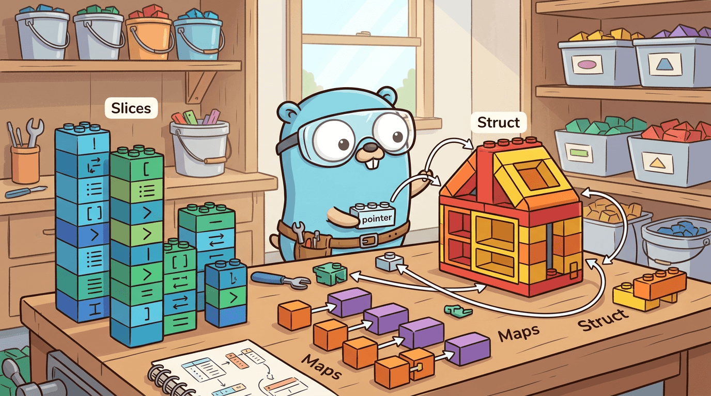

# 第四章 复合类型——数据组织之道



在上一章中，我们学习了 Go 的基本数据类型——整数、浮点数、字符串、布尔值。它们就像积木中最小的单元：一块砖、一根梁、一片瓦。但真实世界的程序不可能只用"单块积木"来描述复杂信息。想象你要管理一个班级的学生成绩，难道要用一百个独立的变量 `student1Score`、`student2Score`……吗？

复合类型就是 Go 提供给你的"组合积木"的方式。它们让你把多个值组织在一起，形成更有意义的数据结构。Go 在这方面的设计哲学极其克制——只给你四种核心复合类型：**数组、切片、Map、结构体**，再加上**指针**这个底层工具。没有继承、没有泛型容器库（Go 1.18 之前的漫长岁月里）、没有花样繁多的集合框架。这种"少而精"的设计，正是 Go 的魅力所在：每一种类型都有明确的用武之地，选择成本极低。

让我们逐一拆解。

---

## 4.1 数组：最简单也最受限的容器

**什么是数组？**

数组就像一排固定数量的储物柜。你在建造时就说好了有多少个格子，之后不能加也不能减。每个格子放同一种类型的东西，通过编号（索引）来访问。

**定义和初始化**

```go
package main

import "fmt"

func main() {
    // 方式一：声明一个长度为 5 的整型数组，未显式初始化的元素自动为零值（0）
    var scores [5]int
    scores[0] = 90
    scores[1] = 85
    fmt.Println(scores) // 输出：[90 85 0 0 0]

    // 方式二：声明时直接初始化所有元素
    primes := [5]int{2, 3, 5, 7, 11}
    fmt.Println(primes) // 输出：[2 3 5 7 11]

    // 方式三：用 "..." 让编译器自动计算长度
    vowels := [...]string{"a", "e", "i", "o", "u"}
    fmt.Println(len(vowels)) // 输出：5
}
```

**数组是值类型——这是关键**

在 Go 中，数组是**值类型**。这意味着当你把数组赋值给另一个变量，或者传递给函数时，Go 会把整个数组**完整复制**一份。这和 C/Java 中"传递数组引用"的行为截然不同。

```go
package main

import "fmt"

// 函数接收数组的拷贝，修改不会影响原数组
func doubleAll(arr [3]int) {
    for i := range arr {
        arr[i] *= 2
    }
    fmt.Println("函数内部：", arr) // [2 4 6]
}

func main() {
    nums := [3]int{1, 2, 3}
    doubleAll(nums)
    fmt.Println("原始数组：", nums) // [1 2 3] —— 没有被修改！

    // 赋值也是拷贝
    copy := nums
    copy[0] = 999
    fmt.Println("原始：", nums)  // [1 2 3]
    fmt.Println("副本：", copy)  // [999 2 3]
}
```

**数组的局限性**

数组的长度是类型的一部分。`[3]int` 和 `[5]int` 是两种**完全不同的类型**，不能互相赋值。这意味着你写一个函数只能处理长度为 3 的整型数组，长度为 4 的就不行。这种刚性在实际开发中几乎不可接受——你很难提前知道数据的精确数量。

正因如此，**日常开发中极少直接使用数组**。它们更多出现在底层实现中（比如切片的底层存储、密码学中的固定长度哈希值 `[32]byte`），而不是业务代码里。真正承担"可变长度集合"重任的，是下一节的主角——切片。

---

## 4.2 切片（Slice）：Go 最强大的数据结构

如果说数组是固定大小的储物柜，那么切片就是**一个指向储物柜的智能遥控器**。它本身不存储数据，但它知道：数据从哪里开始、当前有多少个元素、最多能扩展到多少个。

**定义和创建**

```go
package main

import "fmt"

func main() {
    // 方式一：切片字面量（看起来像数组，但没有指定长度）
    // 编译器会在底层创建一个数组，然后返回指向它的切片
    fruits := []string{"苹果", "香蕉", "橘子"}
    fmt.Println(fruits) // [苹果 香蕉 橘子]

    // 方式二：使用 make 函数，显式指定长度和容量
    // make([]T, length, capacity)
    buf := make([]int, 5, 10) // 长度5，容量10
    fmt.Println(len(buf), cap(buf)) // 5 10

    // 方式三：从已有数组上"切割"出来
    arr := [6]int{10, 20, 30, 40, 50, 60}
    slice := arr[1:4] // 取索引 1、2、3 的元素（左闭右开）
    fmt.Println(slice) // [20 30 40]
}
```

**切片的底层结构——必须理解的核心**

这是本章最重要的知识点。每一个切片在内存中由三个部分组成：

```
┌─────────────────────────────────────────┐
│  切片变量（Slice Header）                 │
│  ┌───────────┬──────────┬──────────┐    │
│  │  指针 ptr  │ 长度 len │ 容量 cap │    │
│  │  (8 字节)  │ (8 字节) │ (8 字节) │    │
│  └─────┬─────┴──────────┴──────────┘    │
│        │                                 │
│        ▼                                 │
│  ┌──────────────────────────────────┐    │
│  │  底层数组（真正的数据存储）        │    │
│  │  [10] [20] [30] [40] [50] [  ]  │    │
│  │        ↑                 ↑       │    │
│  │     ptr 指向这里    cap 到这里结束  │    │
│  └──────────────────────────────────┘    │
└─────────────────────────────────────────┘
```

- **指针（ptr）**：指向底层数组中第一个元素的位置
- **长度（len）**：切片当前有多少个可用元素
- **容量（cap）**：从指针位置到底层数组末尾的总空间

**理解了这个结构，切片的所有行为都能解释。**

**扩容策略：append 的工作原理**

`append` 是操作切片最常用的函数。当向切片追加元素时，如果长度还没超过容量，直接在底层数组的下一个位置写入即可——极其高效。但如果容量已满，Go 就必须分配一块更大的新数组，把旧数据复制过去。

```go
package main

import "fmt"

func main() {
    // 创建一个容量为 3 的切片
    s := make([]int, 0, 3)

    // 追加元素，观察 len 和 cap 的变化
    for i := 1; i <= 10; i++ {
        s = append(s, i*10)
        fmt.Printf("追加 %d 后: len=%d, cap=%d, 内容=%v\n",
            i*10, len(s), cap(s), s)
    }
    // 输出类似：
    // 追加 10 后: len=1, cap=3, 内容=[10]
    // 追加 20 后: len=2, cap=3, 内容=[10 20]
    // 追加 30 后: len=3, cap=3, 内容=[10 20 30]
    // 追加 40 后: len=4, cap=6, 内容=[10 20 30 40]    ← 容量翻倍！
    // 追加 50 后: len=5, cap=6, 内容=[10 20 30 40 50]
    // 追加 60 后: len=6, cap=6, 内容=[10 20 30 40 50 60]
    // 追加 70 后: len=7, cap=12, 内容=[10 20 30 40 50 60 70] ← 再次翻倍！
    // ...
}
```

Go 的扩容规则（Go 1.18+ 简化后）：当容量不足时，若当前容量小于 256，则新容量为旧容量的 **2 倍**；否则新容量约为旧容量的 **1.25 倍**（更精确地说，是按 `newcap += (newcap + 3*threshold) / 4` 的公式平滑增长，其中 threshold 为 256）。这个设计很精巧：小切片快速翻倍减少扩容次数，大切片小幅增长避免浪费内存。

**共享底层数组的陷阱**

这是新手最容易踩的坑。因为切片只是指向底层数组的"窗口"，多个切片可能共享同一段内存：

```go
package main

import "fmt"

func main() {
    // 原始切片
    original := []int{1, 2, 3, 4, 5}

    // 从 original 截取一个子切片
    sub := original[1:3] // [2, 3]

    // 修改子切片，原切片也会被影响！因为它们共享底层数组
    sub[0] = 999
    fmt.Println(original) // [1 999 3 4 5] —— 原切片被修改了！

    // append 也可能导致意外覆盖
    a := []int{1, 2, 3, 4, 5}
    b := a[1:3]          // b = [2, 3]，cap 为 4（从索引1到数组末尾）
    b = append(b, 100)   // 写入底层数组的索引3位置
    fmt.Println(a)        // [1 2 3 100 5] —— a[3] 被覆盖了！
}
```

**如何避免？** 当你需要一个独立的副本时，使用 `copy` 函数或"完整切片表达式" `s[low:high:max]`（第三个参数限制容量，使 append 无法越界写入）：

```go
package main

import "fmt"

func main() {
    original := []int{1, 2, 3, 4, 5}

    // 方法一：使用 copy 创建独立副本
    independent := make([]int, len(original[1:3]))
    copy(independent, original[1:3])
    independent[0] = 999
    fmt.Println(original)    // [1 2 3 4 5] —— 没有被影响
    fmt.Println(independent) // [999 3]

    // 方法二：使用完整切片表达式限制容量
    // s[low:high:max] 使 cap = max - low
    safe := original[1:3:3] // cap = 3 - 1 = 2，append 时会分配新数组
    safe = append(safe, 100)
    fmt.Println(original) // [1 2 3 4 5] —— 没有被影响
}
```

**切片的删除操作**

Go 没有内置的 `delete` 关键字用于切片（`delete` 是给 map 用的）。传统做法是用 `append` 拼接前后两段。从 Go 1.21 起，标准库 `slices` 包提供了更优雅的 `slices.Delete`：

```go
package main

import (
    "fmt"
    "slices"
)

func main() {
    nums := []int{10, 20, 30, 40, 50}

    // 传统方式：删除索引 2 的元素（30）
    // 将索引 3 之后的元素前移，覆盖索引 2
    removed := append(nums[:2], nums[3:]...)
    fmt.Println(removed) // [10 20 40 50]

    // Go 1.21+：使用 slices.Delete
    nums2 := []int{10, 20, 30, 40, 50}
    result := slices.Delete(nums2, 2, 3) // 删除索引 [2, 3) 范围的元素
    fmt.Println(result) // [10 20 40 50]
}
```

**为什么切片被设计成这样？**

理解了切片的底层结构，你可能会问：为什么不直接用一个"会自动增长的数组"？答案是**性能与灵活的平衡**。底层数组保证了数据的连续存储（CPU 缓存友好），而切片的"窗口"特性让你可以零拷贝地共享数据、截取子序列。当需要增长时，`append` 的扩容策略已经足够高效。这个设计让 Go 的切片在表达力上接近 Python 的 list，在性能上接近 C 的动态数组。

---

## 4.3 Map：键值对的艺术

Map（映射）是一种**键值对**数据结构，类似于 Python 的字典或 Java 的 HashMap。你可以把它想象一本通讯录——通过名字（键）查找电话号码（值），而不需要翻遍整本书。

```go
package main

import "fmt"

func main() {
    // 方式一：字面量初始化
    ages := map[string]int{
        "Alice": 28,
        "Bob":   35,
        "Carol": 22,
    }
    fmt.Println(ages) // map[Alice:28 Bob:35 Carol:22]

    // 方式二：make 创建空 map，然后逐个添加
    scores := make(map[string]float64)
    scores["数学"] = 92.5
    scores["英语"] = 88.0

    // 查找（读取值）
    fmt.Println(ages["Alice"]) // 28

    // 查找不存在的键，返回值类型的零值
    fmt.Println(ages["Dave"]) // 0（int 的零值）

    // 删除
    delete(ages, "Bob")
    fmt.Println(ages) // map[Alice:28 Carol:22]
}
```

**判断键是否存在——comma ok 模式**

上面代码有一个隐患：当 `ages["Dave"]` 返回 `0` 时，你不知道是"Dave 的年龄是 0"还是"Dave 根本不在 map 里"。Go 提供了一个优雅的解决方案：

```go
package main

import "fmt"

func main() {
    ages := map[string]int{"Alice": 28, "Bob": 0}

    // 使用 "值, ok" 模式判断键是否存在
    if age, ok := ages["Bob"]; ok {
        fmt.Printf("Bob 存在，年龄是 %d\n", age) // Bob 存在，年龄是 0
    }

    if _, ok := ages["Dave"]; !ok {
        fmt.Println("Dave 不在 map 中")
    }
}
```

**遍历 map——顺序是随机的！**

```go
package main

import "fmt"

func main() {
    config := map[string]string{
        "host": "localhost",
        "port": "8080",
        "env":  "development",
    }

    // 每次运行程序，遍历顺序都可能不同！
    for key, value := range config {
        fmt.Printf("%s = %s\n", key, value)
    }
}
```

这不是 bug，而是**有意为之**。Go 团队刻意将 map 的遍历顺序随机化，目的是防止开发者依赖遍历顺序编写代码——因为哈希表的内部结构在扩容时会发生变化，依赖顺序是危险的。如果你需要有序遍历，必须先把键取出来排序：

```go
package main

import (
    "fmt"
    "sort"
)

func main() {
    config := map[string]string{
        "host": "localhost",
        "port": "8080",
        "env":  "development",
    }

    // 提取所有键并排序
    keys := make([]string, 0, len(config))
    for k := range config {
        keys = append(keys, k)
    }
    sort.Strings(keys)

    // 按键的字母顺序遍历
    for _, k := range keys {
        fmt.Printf("%s = %s\n", k, config[k])
    }
}
```

**map 的底层实现简述**

Map 的底层是一个**哈希表**。Go 的实现将数据组织成多个"桶"（bucket），每个桶最多存放 8 个键值对。查找时，先通过哈希函数算出键属于哪个桶，再在桶内线性比对。当数据量增大时，Go 会自动触发渐进式扩容——不是一次性搬迁所有数据，而是每次操作搬迁一部分，避免一次性停顿。

**map 为什么不是线程安全的？**

在 Go 中，如果多个 goroutine 同时读写同一个 map，程序会直接崩溃（panic）。这是因为 Go 的设计哲学是**"简单优先"**：线程安全需要加锁，加锁有性能开销。与其让所有 map 操作都默默承担锁的代价，不如把选择权交给开发者——需要并发安全时，使用 `sync.RWMutex` 加锁，或者使用 `sync.Map`。这种"不为少数场景牺牲多数场景性能"的理念，贯穿 Go 的设计始终。

---

## 4.4 Struct：自定义类型的基石

当内置类型和集合类型都无法表达你的数据时，你需要**结构体（struct）**——一种把不同类型的字段组合在一起的方式。它就像一张表格：每一行是一个字段，每个字段有自己的名字和类型。

```go
package main

import "fmt"

// 定义一个结构体类型
type User struct {
    Name  string
    Age   int
    Email string
}

func main() {
    // 方式一：按字段名初始化（推荐，字段顺序无关，清晰明了）
    u1 := User{Name: "Alice", Age: 28, Email: "alice@example.com"}

    // 方式二：省略字段名，但必须按定义顺序提供所有字段（不推荐，易出错）
    u2 := User{"Bob", 35, "bob@example.com"}

    // 方式三：部分初始化，未指定的字段为零值
    u3 := User{Name: "Carol"}
    fmt.Println(u3) // {Carol 0 } —— Age 为 0，Email 为空字符串

    // 方式四：使用 new 创建，返回指针，所有字段为零值
    u4 := new(User)
    u4.Name = "Dave" // Go 允许通过指针直接访问字段（自动解引用）
    fmt.Println(u4)   // &{Dave 0 }

    fmt.Println(u1.Name) // Alice
}
```

**结构体的比较**

结构体能否用 `==` 比较，取决于它的所有字段是否都是"可比较类型"。如果结构体中包含切片、map 或函数类型的字段，就不能直接用 `==` 比较，否则编译器会报错。

```go
package main

import "fmt"

type Point struct {
    X, Y int
}

type FormData struct {
    Name   string
    Tags   []string // 切片不可比较！
}

func main() {
    p1 := Point{1, 2}
    p2 := Point{1, 2}
    p3 := Point{3, 4}

    fmt.Println(p1 == p2) // true —— 所有字段都相等
    fmt.Println(p1 == p3) // false

    // 下面的代码会编译错误：
    // f1 := FormData{Name: "test", Tags: []string{"a"}}
    // f2 := FormData{Name: "test", Tags: []string{"a"}}
    // fmt.Println(f1 == f2) // 编译错误：cannot compare FormData
}
```

**匿名字段（嵌入）**

Go 允许在结构体中嵌入其他结构体，不指定字段名。嵌入后，外层结构体可以直接访问内层的字段，看起来就像继承一样（但本质上不是继承，而是组合）：

```go
package main

import "fmt"

type Address struct {
    City    string
    Country string
}

type Person struct {
    Name string
    Address        // 匿名字段（嵌入），没有写字段名
}

func main() {
    p := Person{
        Name:    "Alice",
        Address: Address{City: "Beijing", Country: "China"},
    }

    // 可以直接访问嵌入结构体的字段，无需写 p.Address.City
    fmt.Println(p.City)    // Beijing
    fmt.Println(p.Country) // China

    // 当然也可以显式写完整路径
    fmt.Println(p.Address.City) // Beijing
}
```

**结构体标签（Struct Tags）**

你可能在开源项目中见过这种写法——在字段类型后面跟一个反引号包裹的字符串。这就是结构体标签，它不影响程序逻辑，但可以被**反射（reflection）机制**在运行时读取：

```go
package main

import (
    "encoding/json"
    "fmt"
)

type Product struct {
    // `json:"xxx"` 告诉 JSON 序列化器：在 JSON 中使用这个字段名
    Name  string  `json:"name"`
    Price float64 `json:"price"`
    // `json:"-"` 表示序列化时忽略这个字段
    InternalCode string `json:"-"`
}

func main() {
    p := Product{Name: "Go 教程", Price: 49.9, InternalCode: "SECRET-001"}

    // 序列化为 JSON
    data, _ := json.Marshal(p)
    fmt.Println(string(data))
    // 输出：{"name":"Go 教程","price":49.9}
    // 注意：字段名变成了小写，InternalCode 被忽略了
}
```

**深入理解：struct 是 Go 面向对象编程的基础**

Go 没有 `class` 关键字，没有继承，没有虚函数。但 Go 有结构体和方法——你可以为任何结构体（甚至任何自定义类型）定义方法（我们将在第七章详述）。组合（嵌入）替代了继承，接口替代了多态。这种设计让代码组合更加显式和可控，避免了深层继承带来的"类爆炸"问题。结构体就是这个体系的基石。

---

## 4.5 指针：Go 为什么保留了指针

很多现代语言（Java、Python、JavaScript）都刻意回避"指针"这个词，但 Go 选择保留它——同时大幅简化它。理解指针，是理解 Go 内存模型的关键一步。

**什么是指针？**

变量存储在内存的某个位置，指针就是这个位置的**地址**。如果把内存想象成一条长长的街道，每个变量是一栋房子，那么指针就是房子的门牌号。有了门牌号，你就可以直接找到那栋房子，而不需要复制一栋一模一样的。

```go
package main

import "fmt"

func main() {
    x := 42

    // & 取地址运算符：获取变量 x 的内存地址
    p := &x
    fmt.Printf("x 的值: %d\n", x)         // 42
    fmt.Printf("x 的地址: %p\n", p)       // 0xc000014088（每次运行不同）
    fmt.Printf("通过指针读取: %d\n", *p)  // 42 —— * 解引用运算符

    // 通过指针修改值
    *p = 100
    fmt.Println(x) // 100 —— x 的值被修改了！
}
```

**Go 指针 vs C 指针**

C 语言的指针可以做算术运算（`p++`、`p + 3`），这虽然强大，但极其危险——一不小心就越界访问了不属于你的内存。Go 的设计者决定：**保留指针的"指向"能力，砍掉指针的"算术"能力。** 在 Go 中，你不能对指针做加减法，不能像 C 那样用指针遍历数组。这让 Go 的指针既保留了"直接操作内存"的效率，又避免了 C 语言中最常见的内存错误。

**指针的实用场景**

指针最常见的两个用途：**在函数内部修改调用者的变量**和**避免大结构体的拷贝开销**。

```go
package main

import "fmt"

// 不用指针：函数接收的是值的拷贝，修改无效
func addTen(n int) {
    n += 10
}

// 使用指针：函数接收的是地址，通过解引用修改原值
func addTenPtr(n *int) {
    *n += 10
}

// 大结构体的传递：传指针避免拷贝整个结构体
type BigStruct struct {
    Data [10000]int
}

// 传值：每次调用都拷贝 10000 个 int（约 80KB），很慢
func processByValue(b BigStruct) int {
    return b.Data[0]
}

// 传指针：只拷贝一个地址（8 字节），很快
func processByPointer(b *BigStruct) int {
    return b.Data[0]
}

func main() {
    x := 5
    addTen(x)
    fmt.Println(x) // 5 —— 没有变化

    addTenPtr(&x)
    fmt.Println(x) // 15 —— 被修改了

    big := BigStruct{}
    big.Data[0] = 42
    fmt.Println(processByPointer(&big)) // 42
}
```

**深入理解：安全和性能之间的平衡**

Go 保留指针，是因为它在系统编程中不可或缺——修改外部变量、避免大对象拷贝、构建链表/树等数据结构都需要它。同时，Go 限制指针（禁止算术运算、不允许不同类型的指针转换），并将内存管理交给垃圾回收器（GC），让你不需要手动 `free`。这是 Go 在 C 的"完全控制"和 Java 的"完全隐藏"之间找到的平衡点。

---

## 4.6 值类型 vs 引用类型：一个重要的心智模型

理解 Go 中"值传递"的本质，是写出正确代码的基础。让我们建立一个清晰的心智模型。

**值类型**——赋值和传参时**拷贝数据本身**：

| 类型 | 示例 |
|------|------|
| 基本类型 | `int`, `float64`, `string`, `bool` |
| 数组 | `[5]int` |
| 结构体 | `struct{...}` |

**表现得像引用类型**——变量本身存储的是一个"引用"（内部包含指针），赋值和传参拷贝的是这个引用，而不是底层数据：

| 类型 | 内部本质 |
|------|----------|
| 切片 | Slice Header（含指针） |
| Map | 指向哈希表的指针 |
| Channel | 指向通道内部结构的指针 |
| 指针 | 本身就是地址 |
| 函数 | 函数指针 |

**传值和传引用的实际效果对比**

```go
package main

import "fmt"

// 结构体是值类型：函数拿到的是完整拷贝
type Config struct {
    Timeout int
    Retries int
}

func modifyConfig(c Config) {
    c.Timeout = 999 // 修改的是拷贝，不影响原始变量
}

// 切片内部含指针：函数拿到的是 Slice Header 的拷贝，
// 但拷贝中的指针仍然指向同一个底层数组
func modifySlice(s []int) {
    s[0] = 999 // 修改底层数组，原切片可见
}

func main() {
    cfg := Config{Timeout: 30, Retries: 3}
    modifyConfig(cfg)
    fmt.Println(cfg.Timeout) // 30 —— 没有被修改

    nums := []int{1, 2, 3}
    modifySlice(nums)
    fmt.Println(nums[0]) // 999 —— 被修改了！
}
```

**深入理解：Go 没有真正的"引用传递"**

严格来说，**Go 中一切参数传递都是值传递**。当你把一个切片传给函数时，Go 拷贝的是 Slice Header（指针 + len + cap，共 24 字节），而不是整个底层数组。这个拷贝里的指针和原切片里的指针指向同一块内存，所以修改元素内容双方都能看到。

这就是为什么很多人误以为 Go 有"引用传递"——其实不是。Go 只是把"引用"本身作为值来传递。理解这一点，所有关于"为什么函数里修改了切片，外面的切片也变了"或"为什么 append 在函数里扩容了，外面看不到"的困惑都会迎刃而解。

```go
package main

import "fmt"

// 在函数内 append，如果触发了扩容，会创建新的底层数组
// 新数组的地址只存在于函数内部的切片拷贝中
func appendInside(s []int) {
    s = append(s, 100) // 如果 cap 不够，s 指向新数组；原切片不受影响
    fmt.Println("函数内:", s)
}

func main() {
    // 容量刚好够，不会扩容
    a := make([]int, 0, 5)
    a = append(a, 1, 2, 3)
    appendInside(a)
    fmt.Println("函数外:", a) // [1 2 3] —— 没变！因为 append 没有改变原切片

    // 如果你想让函数能修改切片本身（包括长度），
    // 应该返回新切片或传入切片的指针
}
```

---

## 4.7 本章小结

**复合类型的选择指南**

面对一个数据组织需求时，你可以按照以下思路选择：

- **数量固定、类型相同？** → 数组（极少用，通常用切片替代）
- **数量可变、类型相同？** → **切片**（日常最常用的集合类型）
- **通过键快速查找？** → **Map**（无序的键值对集合）
- **将不同类型的属性组合为一个实体？** → **结构体**（自定义数据类型）
- **需要在函数中修改外部变量或避免拷贝？** → **指针**

**Go 数据结构的"少而精"设计哲学**

Go 只提供了这几种核心数据结构，没有内置链表、栈、队列、集合（Set）等类型。这不是偷懒，而是深思熟虑的设计决策：

1. **切片覆盖了绝大多数"序列"需求**——它的底层连续存储在 CPU 缓存层面极其高效，大多数场景下比链表更快。
2. **Map 覆盖了绝大多数"查找"需求**——哈希表的平均 O(1) 查找性能几乎无人能敌。
3. **结构体 + 组合替代了复杂的继承体系**——代码更加显式、可预测。

当确实需要更复杂的数据结构时（如优先队列、红黑树），Go 标准库的 `container` 包和泛型（Go 1.18+）提供了扩展能力。但 Go 的核心信念是：**最常用的工具应该直接内置，而不是让开发者从庞大的类库中挑选。** 这种克制，让 Go 的学习曲线平缓而清晰——你只需要掌握这几种类型，就足以应对绝大多数编程场景。

在下一章中，我们将学习 Go 的流程控制——条件判断、循环和 switch，让程序真正"动"起来。
