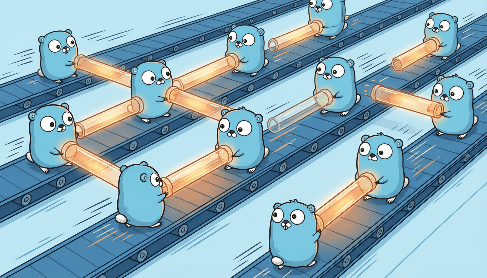

# 第六章 并发编程——Go 的王牌特性



如果说 Go 语言只有一张王牌，那一定是并发编程。

在大多数编程语言中，并发编程是一件让人头疼的事：Java 的线程沉重且难以管理，Python 受限于全局解释器锁（GIL），C++ 则需要手动处理各种底层同步原语。而 Go 从诞生之初就将并发作为一等公民——它不是标准库的附加模块，而是语言本身的核心基因。

Rob Pike（Go 的联合创始人）曾说过一句话：

> *"Concurrency is about dealing with lots of things at once. Parallelism is about doing lots of things at once."*
> *（并发是关于同时处理多件事。并行是关于同时执行多件事。）*

这句话浓缩了 Go 并发哲学的精华。本章将带你从零开始，深入理解 Go 的并发模型，掌握 goroutine、channel、select 等核心机制，最终能够编写出既高效又安全的并发程序。

---

## 6.1 并发与并行：先搞清楚我们在说什么

在正式写代码之前，我们必须先厘清两个容易混淆的概念：**并发（Concurrency）** 和 **并行（Parallelism）**。

### 餐厅厨房类比

想象你是一家餐厅的厨师长，今晚有 10 桌客人同时点餐。

**并发**的做法是：你一个人在厨房里忙碌。你先切第一桌的菜，切到一半跑去查看第二桌锅里炖的汤，然后又跑回来继续切菜，再去看看第三桌烤箱里的鱼……你在多道菜之间快速切换，看起来同时在做好几件事，但任何时刻其实只有你一个人在干活。

**并行**的做法是：你雇了 10 个厨师，每人负责一桌。10 个人真的在同一时刻各自炒菜——这才是真正的"同时执行"。

```text
并发（Concurrency）          并行（Parallelism）
┌──────────────┐            ┌─────┐ ┌─────┐ ┌─────┐
│   厨师 A      │            │厨师A │ │厨师B │ │厨师C │
│ 任务1→任务2   │            │任务1 │ │任务2 │ │任务3 │
│  →任务3→任务1 │            │      │ │      │ │      │
│  （快速切换）  │            │（同时执行）│
└──────────────┘            └─────┘ └─────┘ └─────┘
```

用计算机科学的话说：
- **并发** = 程序的结构设计，使多个任务可以独立地交替推进（强调**任务分解与协调**）
- **并行** = 多个任务在同一时刻物理上同时执行（强调**利用多核 CPU**）

### 为什么并发如此重要？

原因有两个：

1. **多核时代**：现代 CPU 动辄 8 核、16 核甚至更多。如果你的程序只能单线程运行，那大部分算力都被浪费了。
2. **IO 密集场景**：Web 服务器需要同时处理成千上万的请求，每个请求可能都在等待数据库响应或网络 IO。并发让你在等待一个请求返回时去处理另一个请求，极大提升吞吐量。

Go 的天才之处在于：**它提供了极低的并发成本，让你可以轻松创建数万个并发任务，而运行时会自动将它们调度到可用的 CPU 核心上——既实现了并发，也实现了并行。**

---

## 6.2 Goroutine：比线程更轻量的并发单元

Goroutine 是 Go 并发的基本执行单元。你只需要在函数调用前加一个 `go` 关键字，就能启动一个新的 goroutine。

```go
package main

import (
	"fmt"
	"time"
)

func sayHello(name string) {
	// 这个函数将在独立的 goroutine 中执行
	fmt.Printf("Hello, %s!\n", name)
}

func main() {
	// 启动一个 goroutine，函数前加 go 关键字即可
	go sayHello("Alice")
	go sayHello("Bob")
	go sayHello("Charlie")

	// 注意：main 函数本身也是一个 goroutine
	// 如果 main 结束了，所有 goroutine 都会被强制终止
	// 这里用 Sleep 等待一下，让上面的 goroutine 有机会执行
	time.Sleep(100 * time.Millisecond)
}
```

就这么简单——一个 `go` 关键字就启动了一个并发任务。但这份简洁背后有着深刻的工程设计。

### 创建成本：KB vs MB

传统的操作系统线程（如 Java、C++ 中的线程）需要向操作系统申请资源：
- **栈空间**：线程默认栈通常为 1~8 MB
- **创建开销**：涉及系统调用，耗时约 1 微秒
- **切换开销**：线程切换需要保存和恢复完整的寄存器状态，涉及内核态切换

而 goroutine 是**用户态线程**，由 Go 运行时自己管理：
- **栈空间**：初始仅 2 KB（仅为线程的千分之一），且能按需动态伸缩
- **创建开销**：纯用户态操作，约 0.2 微秒
- **切换开销**：只需保存少量寄存器，不涉及内核态切换

这意味着你可以轻松创建 **10 万个** goroutine，内存占用也不过几百 MB；而创建 10 万个系统线程？那几乎一定会导致系统崩溃。

### GMP 调度模型

Go 如何把成千上万的 goroutine 高效地调度到少量 CPU 核心上？答案是 **GMP 模型**：

```text
    G (Goroutine)      你的并发任务
    ↓
    M (Machine/Thread) 操作系统线程（由运行时创建和管理）
    ↓
    P (Processor)      逻辑处理器（每个 CPU 核心对应一个 P）
```

- **G**：Goroutine 本身，包含执行栈、状态、任务函数等
- **M**：操作系统线程，是真正执行代码的实体
- **P**：逻辑处理器，维护一个本地 goroutine 队列。P 的数量默认等于 CPU 核心数（由 `GOMAXPROCS` 控制）

运行时的工作流程：M 必须绑定一个 P 才能执行 G。当 M 执行完一个 G（或 G 发生阻塞），M 就从 P 的本地队列取下一个 G。如果本地队列为空，P 会从其他 P 的队列中"偷"一半任务过来——这就是著名的 **work stealing** 机制，确保所有核心都不闲置。

### Goroutine 泄漏

创建 goroutine 如此廉价，开发者容易犯一个错误：**启动了 goroutine 却忘记让它退出**。

```go
package main

import "fmt"

func leakyFunction() {
	// 这个 goroutine 永远阻塞在 channel 接收上
	// 因为没有人向 ch 发送数据
	ch := make(chan int)
	<-ch // 永久阻塞！
	fmt.Println("这行永远不会被执行")
}

func main() {
	go leakyFunction() // 启动了一个泄漏的 goroutine
	// 程序继续运行，但那个 goroutine 永远不会结束
	// 它占用的内存也不会被释放
	fmt.Println("main 结束")
}
```

Goroutine 泄漏是 Go 中最常见的资源泄漏之一。后面我们会学到如何用 `context` 和 `channel` 来正确管理 goroutine 的生命周期。

### 深入理解：为什么 goroutine 是"杀手级特性"？

其他语言也有协程（coroutine），如 Python 的 asyncio、Kotlin 的 coroutine。但 Go 的 goroutine 有两个独特优势：

1. **极简的 API**：一个 `go` 关键字，无需 async/await、无需 Future/Promise、无需回调链。
2. **运行时的深度集成**：Go 运行时能感知 goroutine 的阻塞（网络 IO、channel 操作、系统调用等），并自动将底层的 M 切换去执行其他 G，这种"阻塞不阻塞线程"的能力是其他用户态协程库难以做到的。

---

## 6.3 Channel：goroutine 之间的通信管道

Goroutine 之间需要通信和同步。Go 提供的答案是 **Channel**——一个类型安全的并发通信管道。

你可以把 channel 想象成一根水管：一端往里灌水（发送），另一端接水（接收）。水在水管里流动是线程安全的——Go 运行时帮你处理了所有的同步细节。

### 创建与基本操作

```go
package main

import "fmt"

func main() {
	// 使用 make 创建一个 channel，指定传输的数据类型为 int
	ch := make(chan int)

	// 启动一个 goroutine 向 channel 发送数据
	go func() {
		ch <- 42 // 发送操作：把 42 放入 channel
	}()

	// 在主 goroutine 中从 channel 接收数据
	value := <-ch // 接收操作：从 channel 取出数据
	fmt.Println("接收到的值:", value) // 输出: 接收到的值: 42
}
```

`<-` 操作符的方向很直观：
- `ch <- 42`：箭头指向 ch，表示"往 ch 里发送 42"
- `<-ch`：箭头从 ch 指向外，表示"从 ch 里接收"

### 无缓冲 vs 有缓冲

Channel 分为两种：

```go
// 无缓冲 channel：发送和接收必须同时就绪（同步握手）
// 就像打电话——双方必须同时在线才能通话
unbuffered := make(chan int)

// 有缓冲 channel：有一个"仓库"，发送时仓库未满即可不阻塞
// 就像发短信——你发出去就行，对方可以稍后查看
buffered := make(chan int, 3) // 缓冲区容量为 3
```

这个区别至关重要：

```go
package main

import "fmt"

func main() {
	// ===== 有缓冲 channel 示例 =====
	ch := make(chan string, 2) // 缓冲区大小为 2

	// 可以发送 2 个值而不需要接收者在场
	ch <- "hello"
	ch <- "world"
	// ch <- "!" // 如果取消注释，这里会阻塞——缓冲区已满

	fmt.Println(<-ch) // 输出: hello（先进先出）
	fmt.Println(<-ch) // 输出: world
}
```

**无缓冲 channel** 的发送和接收是同步的——发送方会阻塞，直到有接收方准备好接收。这使得无缓冲 channel 天然具备同步能力。

**有缓冲 channel** 的发送只在缓冲区满时才阻塞，接收只在缓冲区空时才阻塞。它更像是一个线程安全的队列。

### 关闭与遍历

```go
package main

import "fmt"

func main() {
	ch := make(chan int, 5)

	// 向 channel 发送数据
	for i := 1; i <= 5; i++ {
		ch <- i
	}

	// 关闭 channel，表示不再发送新数据
	// 注意：关闭后可以继续接收已发送的数据
	close(ch)

	// 使用 for-range 遍历 channel
	// 当 channel 被关闭且所有数据都被接收后，循环自动结束
	for value := range ch {
		fmt.Println("收到:", value)
	}
	// 输出: 收到: 1  收到: 2  收到: 3  收到: 4  收到: 5
}
```

关于 `close` 的几个重要规则：
- 只能由发送方关闭 channel，接收方不应关闭
- 向已关闭的 channel 发送数据会 panic
- 从已关闭的 channel 接收数据会得到该类型的零值
- 重复关闭同一个 channel 会 panic

### 单向 Channel

有时你希望限制一个函数只能发送或只能接收：

```go
package main

import "fmt"

// producer 只能向 channel 发送数据（发送端）
func producer(ch chan<- int) {
	for i := 0; i < 5; i++ {
		ch <- i * 10
	}
	close(ch) // 生产完毕，关闭 channel
}

// consumer 只能从 channel 接收数据（接收端）
func consumer(ch <-chan int) {
	for value := range ch {
		fmt.Println("消费:", value)
	}
}

func main() {
	ch := make(chan int)
	// 双向 channel 可以隐式转换为单向 channel
	go producer(ch)
	consumer(ch)
}
```

`chan<-` 表示"只能发送"，`<-chan` 表示"只能接收"。这是一种编译期的类型安全机制——如果你试图从一个只读 channel 发送数据，编译器会直接报错。

### 深入理解：通信优于共享内存

Go 社区有一句著名的格言：

> *"Do not communicate by sharing memory; instead, share memory by communicating."*
> *（不要通过共享内存来通信，而是通过通信来共享内存。）*

传统并发模型（Java、C++）的做法是：多个线程共享一块内存（比如一个全局变量），然后用锁（mutex）来保证同一时刻只有一个线程修改它。这种模式下，程序员需要时刻警惕：哪些数据是共享的？锁的粒度对不对？会不会死锁？

Go 的做法是：每个 goroutine 独立持有自己的数据，通过 channel 传递消息来协调。数据的所有权通过 channel 转移，任何时刻只有一个 goroutine "拥有"这份数据。这从根本上减少了数据竞争的可能性。

当然，Go 并不强制你只用 channel。在某些场景下（比如简单的计数器），用锁可能更合适。Go 的态度是：**给你两种工具，让你根据场景选择最合适的**。

---

## 6.4 Select：多路复用

当一个 goroutine 需要同时关注多个 channel 时怎么办？Go 提供了 `select` 语句——你可以把它理解为 channel 的 `switch`。

```go
package main

import (
	"fmt"
	"time"
)

func main() {
	ch1 := make(chan string)
	ch2 := make(chan string)

	// 模拟两个异步任务
	go func() {
		time.Sleep(1 * time.Second)
		ch1 <- "任务一完成"
	}()

	go func() {
		time.Sleep(2 * time.Second)
		ch2 <- "任务二完成"
	}()

	// 使用 select 同时监听两个 channel
	// 哪个 channel 先就绪，就执行对应的 case
	for i := 0; i < 2; i++ {
		select {
		case msg1 := <-ch1:
			fmt.Println(msg1)
		case msg2 := <-ch2:
			fmt.Println(msg2)
		}
	}
}
```

### 随机选择

如果多个 case 同时就绪，`select` 会**随机**选择一个执行（而不是按顺序）。这是有意的设计——防止总是优先执行某个 case 导致其他 case 被"饿死"。

### 超时控制

`select` 最常见的用法之一是给操作加上超时：

```go
package main

import (
	"fmt"
	"time"
)

func slowOperation() chan string {
	ch := make(chan string)
	go func() {
		time.Sleep(5 * time.Second) // 模拟一个很慢的操作
		ch <- "操作完成"
	}()
	return ch
}

func main() {
	ch := slowOperation()

	select {
	case result := <-ch:
		fmt.Println(result)
	case <-time.After(2 * time.Second):
		// time.After 返回一个 channel，在指定时间后发送一个值
		// 如果 2 秒内操作没有完成，就走这个分支
		fmt.Println("操作超时！")
	}
	// 输出: 操作超时！
}
```

这个模式在实际项目中极其常用——调用外部 API、查询数据库，都需要设置超时以避免无限等待。

### 心跳机制

`select` 还可以实现心跳（heartbeat）——定期检查一个长时间运行的 goroutine 是否还活着：

```go
package main

import (
	"fmt"
	"time"
)

// 模拟一个长时间运行的任务，每隔一段时间发送心跳
func longRunningTask() (<-chan string, <-chan struct{}) {
	resultCh := make(chan string)
	heartbeat := make(chan struct{})

	go func() {
		defer close(resultCh)
		defer close(heartbeat)

		for i := 1; i <= 3; i++ {
			// 每处理一步就发一次心跳
			heartbeat <- struct{}{}
			time.Sleep(1 * time.Second) // 模拟耗时操作
		}
		resultCh <- "任务完成"
	}()

	return resultCh, heartbeat
}

func main() {
	resultCh, heartbeat := longRunningTask()

	for {
		select {
		case _, ok := <-heartbeat:
			if !ok {
				// heartbeat 已关闭
				return
			}
			fmt.Println("💓 心跳：任务仍在运行...")
		case result, ok := <-resultCh:
			if ok {
				fmt.Println("结果:", result)
			}
			return
		}
	}
}
```

### 深入理解：select 让异步编程变得可控

在基于回调的异步模型（如 JavaScript）中，处理多个并发事件往往导致"回调地狱"。在基于 Future/Promise 的模型中，处理超时和取消也需要复杂的组合子。

Go 的 `select` 以一种近乎优雅的方式解决了这个问题：它让你用**同步的代码风格**处理多个异步事件，代码的可读性和可维护性远胜于回调链。

---

## 6.5 sync 包：传统同步工具

虽然 Go 推崇 channel，但它也提供了传统的同步原语——`sync` 包。在某些场景下，锁比 channel 更合适。

### sync.WaitGroup

WaitGroup 用于等待一组 goroutine 完成：

```go
package main

import (
	"fmt"
	"sync"
)

func worker(id int, wg *sync.WaitGroup) {
	// 关键：函数结束时调用 Done，表示当前 goroutine 已完成
	defer wg.Done()
	fmt.Printf("Worker %d 开始工作\n", id)
	// 模拟工作...
	fmt.Printf("Worker %d 完成工作\n", id)
}

func main() {
	var wg sync.WaitGroup

	// 启动 5 个 worker
	for i := 1; i <= 5; i++ {
		wg.Add(1) // 每启动一个 goroutine，计数器加 1
		go worker(i, &wg)
	}

	// 阻塞等待，直到计数器归零
	wg.Wait()
	fmt.Println("所有 worker 都已完成")
}
```

WaitGroup 的三个方法语义清晰：`Add(n)` 增加计数，`Done()` 减少计数（等价于 `Add(-1)`），`Wait()` 阻塞直到计数归零。

### sync.Mutex

当多个 goroutine 需要读写同一份数据时，互斥锁保护共享状态：

```go
package main

import (
	"fmt"
	"sync"
)

// Counter 线程安全的计数器
type Counter struct {
	mu    sync.Mutex // 互斥锁，保护 value 字段
	value int
}

func (c *Counter) Increment() {
	c.mu.Lock()         // 加锁：同一时刻只有一个 goroutine 能进入
	defer c.mu.Unlock() // 解锁：函数返回时自动释放
	c.value++
}

func (c *Counter) Value() int {
	c.mu.Lock()
	defer c.mu.Unlock()
	return c.value
}

func main() {
	counter := &Counter{}
	var wg sync.WaitGroup

	// 启动 1000 个 goroutine 同时递增
	for i := 0; i < 1000; i++ {
		wg.Add(1)
		go func() {
			defer wg.Done()
			counter.Increment()
		}()
	}

	wg.Wait()
	fmt.Println("最终计数:", counter.Value()) // 输出: 最终计数: 1000
}
```

如果没有锁，多个 goroutine 同时对 `value` 执行 `++` 操作会产生数据竞争，最终结果可能远小于 1000。

### sync.RWMutex

读多写少时，读写锁比互斥锁性能更好——它允许多个读者同时持有锁：

```go
package main

import (
	"fmt"
	"sync"
)

type Cache struct {
	mu   sync.RWMutex
	data map[string]string
}

func (c *Cache) Get(key string) (string, bool) {
	c.mu.RLock()         // 读锁：多个 goroutine 可以同时持有
	defer c.mu.RUnlock()
	return c.data[key], c.data[key] != ""
}

func (c *Cache) Set(key, value string) {
	c.mu.Lock()          // 写锁：独占，此时不能有其他读者或写者
	defer c.mu.Unlock()
	c.data[key] = value
}

func main() {
	cache := &Cache{data: make(map[string]string)}
	cache.Set("name", "Go")

	val, _ := cache.Get("name")
	fmt.Println("name =", val)
}
```

### sync.Once

确保某个初始化操作只执行一次（比如单例模式、加载配置等）：

```go
package main

import (
	"fmt"
	"sync"
)

var once sync.Once

func initSystem() {
	fmt.Println("系统初始化...（只会执行一次）")
}

func main() {
	var wg sync.WaitGroup

	for i := 0; i < 10; i++ {
		wg.Add(1)
		go func(id int) {
			defer wg.Done()
			// 即使 10 个 goroutine 都调用 Once.Do
			// initSystem 也只会被执行一次
			once.Do(initSystem)
			fmt.Printf("Goroutine %d 完成\n", id)
		}(i)
	}

	wg.Wait()
}
// "系统初始化..." 只会打印一次
```

### sync.Pool

sync.Pool 是一个临时的对象池，用于复用那些创建成本较高的对象（如数据库连接、字节缓冲区等）。垃圾回收时，Pool 中的对象会被自动清理：

```go
package main

import (
	"bytes"
	"fmt"
	"sync"
)

// 创建一个 Buffer 对象池
var bufPool = sync.Pool{
	New: func() interface{} {
		// 当池中没有可用对象时，调用 New 创建新对象
		return new(bytes.Buffer)
	},
}

func main() {
	// 从池中获取一个 Buffer（可能是复用的，也可能是新创建的）
	buf := bufPool.Get().(*bytes.Buffer)

	buf.WriteString("Hello, Pool!")
	fmt.Println(buf.String())

	// 使用完毕后归还到池中，供下次复用
	buf.Reset() // 注意归还前重置状态
	bufPool.Put(buf)
}
```

### 深入理解：Channel vs Mutex——什么时候用哪个？

| 场景 | 推荐方案 | 原因 |
|------|----------|------|
| 传递数据的所有权 | Channel | 数据通过 channel 流转，天然避免共享 |
| 保护内部状态（如计数器） | Mutex | 简单的临界区保护，锁更直观 |
| 协调多个 goroutine 的执行顺序 | Channel | channel 的阻塞特性天然适合协调 |
| 读多写少的缓存 | RWMutex | 读写锁的性能优势明显 |
| 分发任务给多个 worker | Channel | 工作队列用 channel 最自然 |
| 一次性初始化 | sync.Once | 语义最清晰 |

一个实用的判断标准：**如果你发现自己在用 channel 仅仅为了保护一个变量的读写，那可能用 mutex 更合适；如果你在 mutex 保护的临界区里做了复杂的逻辑，考虑是否可以用 channel 重新设计。**

---

## 6.6 常见并发模式

掌握了基本工具之后，我们来看几种在生产环境中反复出现的并发模式。

### Worker Pool 模式（工作池）

Worker Pool 是最常用的并发模式：启动固定数量的 worker goroutine，通过 channel 分发任务，避免创建过多 goroutine。

```go
package main

import (
	"fmt"
	"sync"
)

// 工作函数：处理一个任务
func worker(id int, jobs <-chan int, results chan<- int, wg *sync.WaitGroup) {
	defer wg.Done()
	for job := range jobs {
		// 模拟处理任务
		fmt.Printf("Worker %d 正在处理任务 %d\n", id, job)
		results <- job * 2 // 结果是输入的两倍
	}
}

func main() {
	const numJobs = 10
	const numWorkers = 3

	jobs := make(chan int, numJobs)
	results := make(chan int, numJobs)
	var wg sync.WaitGroup

	// 启动 worker 池
	for w := 1; w <= numWorkers; w++ {
		wg.Add(1)
		go worker(w, jobs, results, &wg)
	}

	// 发送任务
	for j := 1; j <= numJobs; j++ {
		jobs <- j
	}
	close(jobs) // 任务发送完毕，关闭 jobs channel

	// 等待所有 worker 完成后关闭 results channel
	go func() {
		wg.Wait()
		close(results)
	}()

	// 收集结果
	for result := range results {
		fmt.Println("结果:", result)
	}
}
```

Worker Pool 的核心思想：**限制并发数量**。就像餐厅不会同时接待无限多的客人，worker pool 确保系统资源不会被耗尽。

### Fan-in / Fan-out 模式（扇入扇出）

- **Fan-out**：一个输入 channel 被多个 goroutine 同时消费
- **Fan-in**：多个输入 channel 的结果汇入一个输出 channel

```go
package main

import (
	"fmt"
	"sync"
)

// fanIn 将多个 channel 的结果汇聚到一个 channel
func fanIn(channels ...<-chan int) <-chan int {
	var wg sync.WaitGroup
	out := make(chan int)

	// 为每个输入 channel 启动一个 goroutine
	for _, ch := range channels {
		wg.Add(1)
		go func(c <-chan int) {
			defer wg.Done()
			for val := range c {
				out <- val
			}
		}(ch)
	}

	// 所有输入 channel 读完后关闭输出 channel
	go func() {
		wg.Wait()
		close(out)
	}()

	return out
}

func main() {
	// 创建 3 个输入 channel
	ch1 := make(chan int, 3)
	ch2 := make(chan int, 3)
	ch3 := make(chan int, 3)

	// 分别填充数据
	go func() { ch1 <- 1; ch1 <- 2; ch1 <- 3; close(ch1) }()
	go func() { ch2 <- 4; ch2 <- 5; ch2 <- 6; close(ch2) }()
	go func() { ch3 <- 7; ch3 <- 8; ch3 <- 9; close(ch3) }()

	// 汇聚所有结果
	merged := fanIn(ch1, ch2, ch3)
	for val := range merged {
		fmt.Printf("收到: %d\n", val)
	}
}
```

### Pipeline 模式（管道）

Pipeline 将数据处理拆分为多个阶段，每个阶段由一组 goroutine 负责，阶段之间通过 channel 连接：

```go
package main

import "fmt"

// 第一阶段：生成数字序列
func generate(nums ...int) <-chan int {
	out := make(chan int)
	go func() {
		for _, n := range nums {
			out <- n
		}
		close(out)
	}()
	return out
}

// 第二阶段：对每个数字求平方
func square(in <-chan int) <-chan int {
	out := make(chan int)
	go func() {
		for n := range in {
			out <- n * n
		}
		close(out)
	}()
	return out
}

// 第三阶段：过滤偶数
func filterEven(in <-chan int) <-chan int {
	out := make(chan int)
	go func() {
		for n := range in {
			if n%2 == 0 {
				out <- n
			}
		}
		close(out)
	}()
	return out
}

func main() {
	// 构建管道：生成 → 求平方 → 过滤偶数
	pipeline := filterEven(square(generate(1, 2, 3, 4, 5, 6, 7, 8)))

	for result := range pipeline {
		fmt.Println(result)
	}
	// 1²=1(奇), 2²=4(偶✓), 3²=9(奇), 4²=16(偶✓),
	// 5²=25(奇), 6²=36(偶✓), 7²=49(奇), 8²=64(偶✓)
	// 输出: 4, 16, 36, 64
}
```

### Context 包：取消和超时控制

`context` 包是管理 goroutine 生命周期的标准工具。它提供了一种在 goroutine 树中传递取消信号和超时的机制。

```go
package main

import (
	"context"
	"fmt"
	"time"
)

func doWork(ctx context.Context) {
	for i := 0; ; i++ {
		select {
		case <-ctx.Done():
			// 收到取消信号，清理并退出
			fmt.Println("收到取消信号，退出工作:", ctx.Err())
			return
		default:
			fmt.Printf("正在工作... 第 %d 步\n", i)
			time.Sleep(500 * time.Millisecond)
		}
	}
}

func main() {
	// 创建一个带超时的 context（3 秒后自动取消）
	ctx, cancel := context.WithTimeout(context.Background(), 3*time.Second)
	defer cancel() // 确保资源被释放，即使提前退出

	fmt.Println("启动工作...")
	doWork(ctx)
	fmt.Println("工作已停止")
}
```

Context 的几种创建方式：
- `context.Background()`：根 context，通常用于 main 函数
- `context.WithCancel(parent)`：手动取消
- `context.WithTimeout(parent, duration)`：超时自动取消
- `context.WithDeadline(parent, time)`：到指定时间点取消

### 深入理解：CSP 理论与 Go 并发设计的渊源

Go 的并发模型深受 **CSP（Communicating Sequential Processes）** 理论的启发。CSP 由 Tony Hoare 在 1978 年提出，核心思想是：

1. 并发进程之间不共享状态
2. 进程之间通过**通道（channel）** 进行通信
3. 通信是同步的——发送和接收必须同时就绪

Go 的 channel 和 goroutine 就是 CSP 的工程化实现。但 Go 并没有完全遵循 CSP——它也提供了 mutex 等共享内存工具。Rob Pike 的务实态度是：**CSP 提供了更好的默认思维模式，但在实际工程中，不必教条式地排斥锁。**

这种务实的设计哲学，使得 Go 既能在大多数场景下享受 CSP 带来的简洁和安全，也不会在少数需要高性能共享内存的场景中束手束脚。

---

## 6.7 数据竞争与竞态检测

并发编程中最可怕的敌人是 **数据竞争（Data Race）**。

### 什么是数据竞争

当两个或更多 goroutine **同时访问同一个变量**，且至少有一个是**写操作**时，就发生了数据竞争。数据竞争的后果是**不确定的**——程序可能运行一万次都正确，第一万零一次就崩溃了。

```go
package main

import (
	"fmt"
	"sync"
)

func main() {
	count := 0 // 这个变量将被多个 goroutine 同时修改
	var wg sync.WaitGroup

	for i := 0; i < 1000; i++ {
		wg.Add(1)
		go func() {
			defer wg.Done()
			count++ // 数据竞争！++ 不是原子操作
			// 它实际上是三步：读取 → 加一 → 写回
			// 两个 goroutine 可能同时读取相同的值
		}()
	}

	wg.Wait()
	fmt.Println("count =", count)
	// 期望输出 1000，但实际可能小于 1000
	// 每次运行的结果都可能不同！
}
```

### 竞态检测器

Go 内置了竞态检测器——用 `-race` 标志运行程序：

```bash
go run -race main.go
```

检测器会在运行时监控所有内存访问，一旦发现数据竞争就会立即报告：

```text
WARNING: DATA RACE
Read at 0x00c000124010 by goroutine 8:
  main.main.func1()
      /path/to/main.go:14 +0x4e

Previous write at 0x00c000124010 by goroutine 7:
  main.main.func1()
      /path/to/main.go:14 +0x67
```

**建议在开发环境和 CI 流水线中始终使用 `-race` 标志。** 它的性能开销大约是正常运行时的 10 倍，所以生产环境不建议开启，但在测试阶段它能帮你揪出隐藏的并发 bug。

### 避免数据竞争的最佳实践

1. **不要共享变量**：尽量让每个 goroutine 拥有自己的数据副本，通过 channel 传递结果
2. **使用锁保护共享状态**：如果必须共享，用 `sync.Mutex` 或 `sync.RWMutex` 保护
3. **使用原子操作**：对于简单的计数器，`sync/atomic` 包提供了无锁的原子操作
4. **使用 `-race` 检测器**：在测试阶段始终开启
5. **避免 goroutine 泄漏**：确保每个 goroutine 都有明确的退出路径

```go
package main

import (
	"fmt"
	"sync"
	"sync/atomic"
)

func main() {
	// 方法一：使用原子操作（适合简单计数器）
	var count int64
	var wg sync.WaitGroup

	for i := 0; i < 1000; i++ {
		wg.Add(1)
		go func() {
			defer wg.Done()
			atomic.AddInt64(&count, 1) // 原子操作，线程安全
		}()
	}

	wg.Wait()
	fmt.Println("atomic count =", count) // 稳定输出 1000
}
```

### 深入理解：为什么并发 bug 是最难调试的 bug？

并发 bug 有三个让人痛苦的特征：

1. **不确定性（Non-deterministic）**：同样的输入，同样的代码，有时正确有时错误。你无法简单地"重新跑一次"来复现问题。
2. **难以复现（Hard to reproduce）**：bug 可能在开发环境从不出现，却在生产环境的高负载下频繁触发。
3. **难以定位（Hard to locate）**：错误可能在数据竞争发生很久之后才表现出来，报错的位置离真正的 bug 位置相隔甚远。

这就是为什么 Go 提供了 `-race` 检测器，也为什么社区反复强调"通过通信来共享内存"——**从架构层面避免共享状态，远比事后修复数据竞争要明智得多。**

---

## 6.8 本章小结

### 并发编程的核心原则

1. **并发的本质是任务分解与协调**，而并行是同时执行。Go 的运行时帮你把并发自动映射到多核并行上。

2. **Goroutine 是极轻量的并发单元**：2 KB 初始栈、用户态调度、一键创建（`go` 关键字）。但要警惕 goroutine 泄漏。

3. **Channel 是 goroutine 之间的通信管道**：无缓冲 channel 实现同步握手，有缓冲 channel 实现异步队列。优先使用通信而非共享内存。

4. **Select 是多路复用的利器**：同时监听多个 channel，实现超时控制、心跳检测等实用模式。

5. **Mutex 在保护共享状态时更合适**：简单的临界区保护、读多写少的缓存、一次性初始化——这些场景用锁比 channel 更直接。

6. **数据竞争是并发编程的头号杀手**：始终使用 `-race` 检测器，尽量从架构上避免共享状态。

### Go 并发模型的独特优势

Go 的并发设计之所以被称为"王牌"，不是因为它发明了什么全新的理论，而是因为它在**工程实用性**上做到了极致：

- **简洁的 API**：`go` 关键字、`<-` 操作符、`select` 语句——学习曲线远低于其他语言的并发模型。
- **低廉的成本**：goroutine 的创建和切换成本比系统线程低 1~2 个数量级，使得并发编程不再"奢侈"。
- **务实的哲学**：CSP 提供了优雅的默认范式，但也不排斥 mutex 等工具——选择最适合当前场景的方案。
- **完善的工具链**：竞态检测器、pprof 性能分析、goroutine 堆栈 dump——让并发程序的调试和优化有据可依。

掌握了并发编程，你就掌握了 Go 最核心的能力。在接下来的章节中，我们将看到这些并发模式如何在真实项目中发挥作用。
