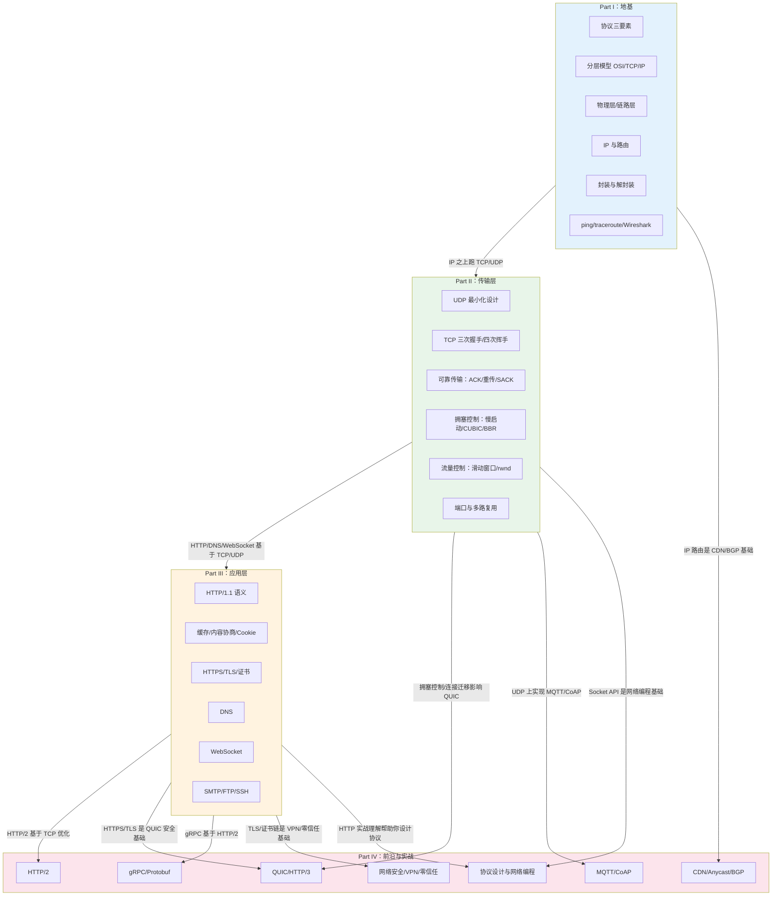

# 网络协议 完全教程

## 目录

### Part I（第1-6章）：地基——协议基础与分层模型

- 第1章：协议是什么——通信的本质问题
- 第2章：为什么要分层——OSI 与 TCP/IP 模型
- 第3章 比特如何上路——物理层与数据链路层
- 第4章：IP——让数据包穿越互联网
- 第5章：封装的艺术——数据从应用到网线的旅程
- 第6章：网络诊断工具箱

### Part II（第7-12章）：可靠传输——TCP 与 UDP

- 第7章：UDP——最小化的传输层
- 第8章：TCP 基础——建立连接与可靠传输
- 第9章：TCP 的可靠性机制——序号、确认与重传
- 第10章：TCP 拥塞控制——网络的自我保护
- 第11章：流量控制与 TCP 进阶特性
- 第12章：端口与多路复用——传输层的寻址

### Part III（第13-18章）：应用层——HTTP、DNS 与 Web 协议

- 第13章：HTTP 基础——Web 的基石
- 第14章：HTTP 深入——缓存、内容协商与 Cookie
- 第15章：HTTPS 与 TLS——给 HTTP 穿上铠甲
- 第16章：DNS——互联网的通讯录
- 第17章：WebSocket——全双工实时通信
- 第18章：其他应用层协议——SMTP、FTP、SSH

### Part IV（第19-25章）：前沿与实战——现代协议与网络编程

- 第19章：HTTP/2——HTTP 的大修
- 第20章：QUIC 与 HTTP/3——从 TCP 到 UDP 的跨越
- 第21章：gRPC 与 Protobuf——高效的 RPC 协议
- 第22章：网络安全协议——防火墙、VPN 与零信任
- 第23章：CDN、Anycast 与大规模网络协议
- 第24章：IoT 协议——MQTT、CoAP 与低功耗网络
- 第25章：网络编程实战与协议设计

## 各章节之间的关系

流程图把 25 章内容按四个 Part 分组，并用箭头标出依赖关系：

蓝色 Part I → 绿色 Part II：地基层支撑传输层
绿色 Part II → 橙色 Part III：TCP/UDP 支撑 HTTP、DNS、WebSocket 等应用协议
橙色 Part III → 粉色 Part IV：HTTP/2、QUIC、gRPC、CDN 等现代协议都是对应用层和传输层的改进或扩展
关键的跨层依赖也都标出来了，比如 IP 路由是 CDN/BGP 的基础、UDP 是 MQTT/CoAP 的载体、TLS 是 VPN/零信任的安全基础。这样一眼就能看出每一章在整个知识体系中的位置。

这四个 Part 的关系，本质上就是从底层到上层、从为什么到怎么用、从原理到实战的递进。

Part I 是地基，回答「协议到底是什么」。它不讲具体某个协议怎么用，而是先建立整体认知：协议为什么存在、为什么要分层、比特怎么变成信号、IP 怎么找到目的地、数据包怎么一层层封装起来。如果没有 Part I，后面学 TCP、HTTP 时会觉得是一堆孤立的知识点；有了它，你才会明白每个协议设计选择背后的理由。

Part II 是在地基上建管道，回答「数据如何可靠传输」。TCP 和 UDP 都运行在 IP 之上，它们解决的是同一个问题：如何把数据从一台主机的进程，送到另一台主机的进程。UDP 选择最小化、不可靠；TCP 选择可靠、有序、流量受控。Part II 的拥塞控制、滑动窗口、三次握手这些概念，是理解后面 HTTP 性能瓶颈的前提。

Part III 是在管道里跑应用，回答「我们平时用的 Web 服务是怎么工作的」。HTTP、HTTPS、DNS、WebSocket、SMTP 这些协议都依赖 Part II 的 TCP/UDP。学完 Part II 你才会真正理解：为什么 HTTP 要 keep-alive、为什么 HTTPS 握手慢、为什么 DNS 查询通常用 UDP、为什么 WebSocket 要借 HTTP 做一次 Upgrade。Part III 把抽象的网络层和日常开发连接起来。

Part IV 是现代化改造，回答「这些协议在当今工程里怎么演进」。HTTP/2 和 QUIC 是为了解决 HTTP/1.1 和 TCP 的固有缺陷；gRPC 是基于 HTTP/2 的 RPC 框架；CDN 和 BGP 是为了解决大规模分发；IoT 协议是为了低功耗场景。这些高级话题全部建立在前三部分之上：你只有理解了 TCP 的队头阻塞，才能理解 QUIC 为什么选 UDP；理解了 TLS，才能理解 HTTPS/3 的 0-RTT 握手。

简单来说，四个 Part 的关系就是：

Part I 解决「为什么」→ Part II 解决「怎么传」→ Part III 解决「日常怎么用」→ Part IV 解决「现代系统怎么优化」

对读者来说，正确的阅读顺序最好不要跳。尤其是从 Part II 到 Part III 的过渡：如果不懂 TCP，HTTP 的很多行为（如队头阻塞、连接复用、慢启动影响首屏时间）看起来就会像黑魔法。
