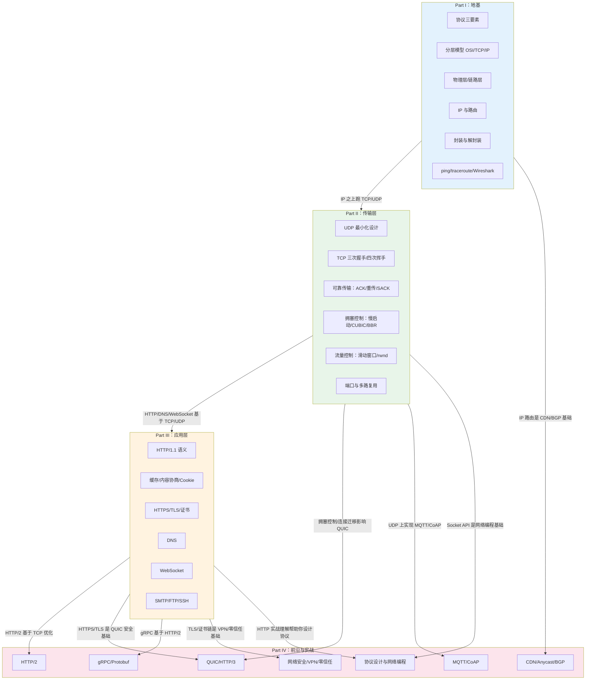
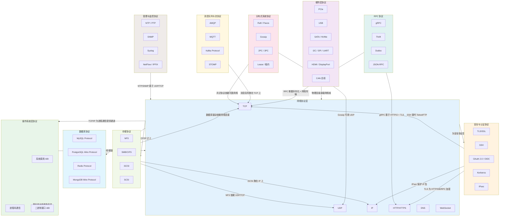

# 网络协议 完全教程

所有协议的通用概括可以用一句话说：

> [!TIP] 提示
> 协议是一套形式化的约定，让原本独立设计、独立演进的组件，能够互相理解、协同工作。

它们共同解决的核心问题是互操作性（Interoperability）。

如果没有协议，计算机世界里每个组件都要为其他每个组件单独定制接口。你的浏览器要知道每一个网站的内部实现才能访问它；你的 SSD 要适配每一块主板；你的程序要和操作系统深度绑定。协议把这个问题拆解成两层：

1. 对接口的规定：只要双方都遵守同一套协议，内部实现可以完全不同
2. 对边界的划定：协议规定了责任的终点，你可以把黑盒当积木来用

具体到一个协议，它通常规定四件事：

1. 格式：信息怎么编码、怎么分组、字段顺序是什么
2. 语义：某个字段或某个动作是什么意思
3. 时序：谁先发起、谁回应、什么情况下重试、什么时候结束
4. 错误处理：出错了怎么发现、怎么恢复、谁负责兜底

无论是 PCIe、TCP、HTTP、OAuth 还是 Raft，本质都是在回答这四个问题，只是服务的场景不同。

所以协议真正的价值不是通信本身，而是「解耦」。它让硬件厂商、操作系统开发者、数据库开发者、前端工程师、安全工程师可以在各自领域独立创新，同时通过协议这个公共契约保证大家仍然能拼在一起工作。协议是工程协作的通用语言。

协议是两个或多个「独立实体」之间的形式化约定

## 目录

### Part I（第1-6章）：地基——协议基础与分层模型

- 第1章：协议是什么——通信的本质问题
- 第2章：为什么要分层——OSI 与 TCP/IP 模型
- 第3章 比特如何上路——物理层与数据链路层
- 第4章：IP——让数据包穿越互联网
- 第5章：封装的艺术——数据从应用到网线的旅程
- 第6章：网络诊断工具箱

### Part II（第7-12章）：可靠传输——TCP 与 UDP

- 第7章：UDP——最小化的传输层
- 第8章：TCP 基础——建立连接与可靠传输
- 第9章：TCP 的可靠性机制——序号、确认与重传
- 第10章：TCP 拥塞控制——网络的自我保护
- 第11章：流量控制与 TCP 进阶特性
- 第12章：端口与多路复用——传输层的寻址

### Part III（第13-18章）：应用层——HTTP、DNS 与 Web 协议

- 第13章：HTTP 基础——Web 的基石
- 第14章：HTTP 深入——缓存、内容协商与 Cookie
- 第15章：HTTPS 与 TLS——给 HTTP 穿上铠甲
- 第16章：DNS——互联网的通讯录
- 第17章：WebSocket——全双工实时通信
- 第18章：其他应用层协议——SMTP、FTP、SSH

### Part IV（第19-25章）：前沿与实战——现代协议与网络编程

- 第19章：HTTP/2——HTTP 的大修
- 第20章：QUIC 与 HTTP/3——从 TCP 到 UDP 的跨越
- 第21章：gRPC 与 Protobuf——高效的 RPC 协议
- 第22章：网络安全协议——防火墙、VPN 与零信任
- 第23章：CDN、Anycast 与大规模网络协议
- 第24章：IoT 协议——MQTT、CoAP 与低功耗网络
- 第25章：网络编程实战与协议设计

## 各章节之间的关系

流程图把 25 章内容按四个 Part 分组，并用箭头标出依赖关系：

蓝色 Part I → 绿色 Part II：地基层支撑传输层
绿色 Part II → 橙色 Part III：TCP/UDP 支撑 HTTP、DNS、WebSocket 等应用协议
橙色 Part III → 粉色 Part IV：HTTP/2、QUIC、gRPC、CDN 等现代协议都是对应用层和传输层的改进或扩展
关键的跨层依赖也都标出来了，比如 IP 路由是 CDN/BGP 的基础、UDP 是 MQTT/CoAP 的载体、TLS 是 VPN/零信任的安全基础。这样一眼就能看出每一章在整个知识体系中的位置。

这四个 Part 的关系，本质上就是从底层到上层、从为什么到怎么用、从原理到实战的递进。

Part I 是地基，回答「协议到底是什么」。它不讲具体某个协议怎么用，而是先建立整体认知：协议为什么存在、为什么要分层、比特怎么变成信号、IP 怎么找到目的地、数据包怎么一层层封装起来。如果没有 Part I，后面学 TCP、HTTP 时会觉得是一堆孤立的知识点；有了它，你才会明白每个协议设计选择背后的理由。

Part II 是在地基上建管道，回答「数据如何可靠传输」。TCP 和 UDP 都运行在 IP 之上，它们解决的是同一个问题：如何把数据从一台主机的进程，送到另一台主机的进程。UDP 选择最小化、不可靠；TCP 选择可靠、有序、流量受控。Part II 的拥塞控制、滑动窗口、三次握手这些概念，是理解后面 HTTP 性能瓶颈的前提。

Part III 是在管道里跑应用，回答「我们平时用的 Web 服务是怎么工作的」。HTTP、HTTPS、DNS、WebSocket、SMTP 这些协议都依赖 Part II 的 TCP/UDP。学完 Part II 你才会真正理解：为什么 HTTP 要 keep-alive、为什么 HTTPS 握手慢、为什么 DNS 查询通常用 UDP、为什么 WebSocket 要借 HTTP 做一次 Upgrade。Part III 把抽象的网络层和日常开发连接起来。

Part IV 是现代化改造，回答「这些协议在当今工程里怎么演进」。HTTP/2 和 QUIC 是为了解决 HTTP/1.1 和 TCP 的固有缺陷；gRPC 是基于 HTTP/2 的 RPC 框架；CDN 和 BGP 是为了解决大规模分发；IoT 协议是为了低功耗场景。这些高级话题全部建立在前三部分之上：你只有理解了 TCP 的队头阻塞，才能理解 QUIC 为什么选 UDP；理解了 TLS，才能理解 HTTPS/3 的 0-RTT 握手。

简单来说，四个 Part 的关系就是：

Part I 解决「为什么」→ Part II 解决「怎么传」→ Part III 解决「日常怎么用」→ Part IV 解决「现代系统怎么优化」

对读者来说，正确的阅读顺序最好不要跳。尤其是从 Part II 到 Part III 的过渡：如果不懂 TCP，HTTP 的很多行为（如队头阻塞、连接复用、慢启动影响首屏时间）看起来就会像黑魔法。

## 计算机协议分类关系图

这张图把协议按层次和依赖关系组织：

紫色硬件层在最底部：PCIe、USB、SATA、I2C 等负责芯片和设备之间的物理通信
蓝色网络协议层是连接中枢：TCP/IP/UDP/HTTP/DNS 等把不同设备和进程连起来
绿色操作系统层：系统调用 ABI、进程间通信、二进制接口，依赖网络协议提供的通道
橙色安全协议层：TLS/SSH/OAuth 等，它们既依赖网络传输，又反过来为 HTTP、数据库、RPC 提供加密
其他彩色块代表各类应用层协议族：数据库、存储、RPC、消息队列、分布式共识、管理监控
箭头表示依赖关系。最核心的观察是：网络协议不是孤立的一类，而是几乎所有上层协议共同的承载层。

如果按更粗的维度归拢，可以总结成三层：硬件层协议（总线、存储接口）、系统层协议（OS ABI、进程通信）、应用层协议（数据库、安全、RPC、消息队列、分布式共识）。网络协议横在这三层之间，因为它既连接硬件，也连接系统，更连接应用。

## 硬件层协议和系统层协议的根本区别

在于它们服务的「通信双方」和所处的「抽象层次」不同。

硬件层协议：芯片与设备之间的对话

通信双方是物理实体：CPU 和内存、主板和硬盘、GPU 和显示器、微控制器和传感器
关注的是电信号、时序、电压、引脚定义、时钟同步
典型例子：PCIe、USB、SATA、I2C、SPI、HDMI、CAN 总线
作用范围：通常是同一台机器内部，或者通过线缆直接相连的两个设备
系统层协议：软件组件之间的对话

通信双方是逻辑实体：进程与操作系统、进程与进程、用户态程序与内核、函数调用者与实现者
关注的是接口约定、调用方式、数据格式、权限隔离、调度策略
典型例子：系统调用 ABI、进程间通信（管道/消息队列/共享内存）、动态链接 ABI
作用范围：同一台操作系统的内部
用一个具体例子对比：

> [!TIP] 提示
> NVMe 是硬件层协议：它定义了 CPU 如何通过 PCIe 总线向 SSD 发读写命令，包括命令队列格式、门铃机制、中断方式。
> read() 系统调用 是系统层协议：你的程序调用 read(fd, buf, n)，操作系统把这个调用翻译成对底层 SSD 的具体操作。程序不需要知道下面用的是 NVMe、SATA 还是 USB。

再比如：

| 维度 | 硬件层协议 | 系统层协议 |
| ---- | ---- | ---- |
| 双方在谈什么 | 电平、时钟、数据包、引脚 | 函数调用、消息、内存区域、权限 |
| 出错怎么办 | 重传、CRC 校验、总线仲裁 | 返回错误码、信号、异常、超时 |
| 谁来实现 | 硬件控制器、PHY 芯片、固件 | 操作系统内核、运行时库、编译器 |
| 更换成本 | 换主板、换线、换接口 | 换 API、重新编译、修改程序 |

它们之间的桥梁是驱动程序。驱动程序一方面懂硬件层协议（怎么跟 SSD 说话），另一方面给操作系统提供系统层接口（open/read/write/close）。所以当你调用 write() 时，看起来是在用系统层协议，实际上操作系统底层把它翻译成了硬件层协议。

一个容易混淆的边界：有些协议同时跨越两层。比如 DMA（直接内存访问） 本质上是硬件控制器和内存之间的数据传输协议，但它的启动、停止、权限控制由操作系统通过系统调用来管理。

## 协议的四个维度

#### 1. 格式：协议长什么样

格式是协议的语法层。它规定信息怎么编码、多长、字段怎么排列、哪些是定长、哪些是变长、对齐方式是什么。

举几个例子：
TCP 报头：固定 20 字节起，前 16 位是源端口，接下来 16 位是目的端口，然后 32 位序号、32 位确认号……每个字段占多少位、按什么顺序排列，都精确到 bit。
HTTP/1.1 请求：请求行 + 头部字段 + 空行 + 消息体。请求行里又是「方法 空格 URL 空格 版本 换行」。
USB 数据包：SYNC 字段 + PID（Packet ID）+ 地址/端点 + 数据 + CRC5/CRC16。
JSON：{ "key": value } 这种嵌套结构本身也是一种格式约定。

格式的核心作用：让接收方知道「我从第几个字节开始读、读多少、怎么切分」。没有格式，拿到的是一团二进制，无法解析。

常见陷阱：格式本身不告诉你这段数据是什么意思，只告诉你怎么读它。

---

#### 2. 语义：字段和动作是什么意思

语义是协议的含义层。同样的格式，不同的值，意思可能完全不同。

例子：
HTTP 方法：GET、POST、PUT、DELETE 格式上都是一串字符，但语义完全不同。GET 表示获取资源，POST 表示提交数据。
TCP 标志位：SYN、ACK、FIN、RST 都是 1 个 bit，格式上没区别，但语义分别是「请求建立连接」「确认」「请求关闭连接」「重置连接」。
DNS 记录类型：A 表示 IPv4 地址，AAAA 表示 IPv6 地址，CNAME 表示别名，MX 表示邮件服务器。
USB PID：IN、OUT、SETUP 这几个 PID 值格式上只占 4 位，但语义决定了这次传输是主机读设备、主机写设备，还是发起控制传输。

语义的核心作用：让双方对「这个字段代表什么、收到后该做什么」达成一致。

格式和语义的关系：格式是容器，语义是容器里的内容。比如 TCP 报头里的「32 位序号」是格式，「这个序号表示本报文段发送的第一个字节的编号」是语义。

---

#### 3. 时序：谁先动、谁回应、什么时候重试、什么时候结束

时序是协议的交互层。协议不是静态的数据格式，而是动态的状态机。时序规定了消息交换的顺序、状态转换条件、超时时间和终止条件。

例子：
TCP 三次握手：

  1. 客户端发送 SYN
  2. 服务器回复 SYN-ACK
  3. 客户端回复 ACK
  顺序不能乱，少了任何一步都不行。
HTTP/1.1 请求-响应：
  客户端先发请求，服务器后回响应。虽然有 keep-alive，但默认一个连接上请求和响应要按顺序配对。
TLS 1.3 握手：
  ClientHello → ServerHello/EncryptedExtensions/Certificate/Finished → Client Finished。整个过程有严格的状态推进。
两阶段提交 2PC：
  协调者先发 Prepare，所有参与者回复 Yes/No，协调者再发 Commit 或 Rollback。顺序错了事务就乱。
USB 事务：
  Token 阶段 → Data 阶段 → Handshake 阶段，每个阶段必须在规定时间内完成。

时序的核心作用：保证协议参与者处于一致的状态。没有时序，双方可能一个以为连接建立了，另一个还在等握手。

时序和错误处理的关系：时序里通常嵌入超时机制。比如 TCP 发了数据等 ACK，等多久算超时？超时了怎么办？这就是时序在触发错误处理。

---

#### 4. 错误处理：怎么发现错、怎么恢复、谁兜底

错误处理是协议的健壮性层。现实中的通信不可能完美：比特会翻转、包会丢、机器会宕机、网络会分区。协议必须规定出错时怎么办。

例子：
TCP 的错误处理：
发现错误：校验和检测数据损坏、ACK 机制检测丢包、序列号检测乱序
恢复错误：超时重传、快速重传、选择确认 SACK
谁兜底：发送方负责重传，接收方负责按序重组
HTTP 的错误处理：
发现错误：状态码。4xx 是客户端错了，5xx 是服务器错了。
恢复错误：客户端收到 500 可以重试，收到 404 通常不需要重试。
谁兜底：错误码本身就在划分责任。
USB 的错误处理：
发现错误：CRC 校验失败
恢复错误：主机重发，最多重试三次
谁兜底：主机通常负责发起重传
Raft 共识协议的错误处理：
发现错误：心跳超时、日志不一致
恢复错误：发起新一轮选举、 Leader 向 Follower 同步日志
谁兜底：集群多数派保证一致性

错误处理的核心作用：让协议在不可靠的底层之上提供可靠的抽象。

---

四者的交织：用一个 TCP 连接关闭说明

TCP 的四次挥手同时用到了这四个维度：
格式：FIN 标志位是 TCP 报头里的 1 个 bit，ACK 也是 1 个 bit。
语义：FIN 表示「我要关闭发送方向」，ACK 表示「我收到了你的 FIN」。
时序：主动关闭方先发 FIN → 被动方回 ACK → 被动方再发 FIN → 主动方回 ACK，进入 TIME_WAIT。
错误处理：如果 ACK 丢了怎么办？FIN 重发机制、TIME_WAIT 状态保留 2MSL 时间，就是为了处理延迟到达的报文和丢失的确认。

所以你看，单独看任何一个维度都不完整。格式告诉你这个包长什么样，语义告诉你 FIN 是什么意思，时序告诉你什么时候发 FIN，错误处理告诉你 FIN 丢了怎么办。四个合在一起，TCP 才能正确关闭一个连接。

---

一句话总结

| 维度 | 解决的问题 | 核心问句 |
| --- | --- | --- |
| 格式 | 怎么读 | 这个字段占几位？什么顺序？ |
| 语义 | 什么意思 | 这个字段/动作为什么重要？ |
| 时序 | 什么时候发生 | 谁先发起？下一步是什么？ |
| 错误处理 | 错了怎么办 | 怎么发现？怎么恢复？谁负责？ |

分析一个新协议时，就按这四个问题去问，基本能把它的骨架拆清楚。
