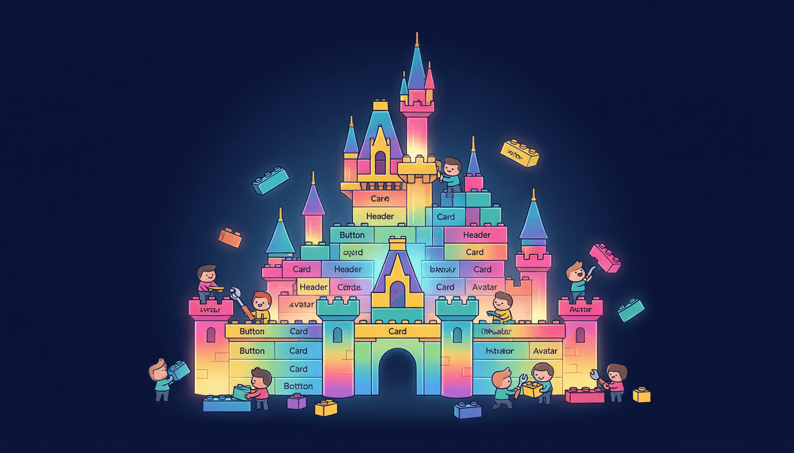

# 第4章：组件 — React 的乐高积木



> *"给我足够的乐高积木，我能拼出整个世界。" —— 每个 React 开发者的心声*

## 4.1 引言：从搭积木到写代码

你小时候玩过乐高积木吗？一块块五颜六色的小方块，单独看没什么特别的，但当你把它们按照自己的想法拼在一起——嘿，一座城堡、一辆汽车、甚至一个机器人就这么诞生了。

React 的组件就是这个理念。

**组件是 React 的核心。** 在 React 的世界里，你看到的每一个 UI 元素——一个按钮、一个导航栏、一个评论列表、一整个页面——都是一个组件。你可以把小组件拼成大组件，大组件拼成页面，页面拼成应用。

> **比喻时间：** 组件就像乐高积木——每块积木（组件）都有自己的形状和功能。你把一块块积木拼在一起，就变成了城堡。而且最棒的是，每块积木都可以拆下来单独使用，也可以在不同的城堡中重复使用。

## 4.2 函数组件：React 组件的基本写法

在现代 React 中，组件就是一个 **返回 JSX 的 JavaScript 函数**。就这么简单。

```jsx
// 这就是一个最简单的 React 组件！
function HelloWorld() {
  return <h1>你好，世界！</h1>;
}

// 导出组件，让其他文件可以使用
export default HelloWorld;
```

是的，一个函数 + 返回 JSX = 一个组件。

使用这个组件：

```jsx
import HelloWorld from './HelloWorld';

function App() {
  return (
    <div>
      {/* 像使用 HTML 标签一样使用组件 */}
      <HelloWorld />
      <HelloWorld />
      <HelloWorld />
    </div>
  );
}
```

看，我们用了三次 `<HelloWorld />`，页面上就会出现三个"你好，世界！"。这就是组件复用的威力——写一次，到处使用。

### 组件命名规范：PascalCase

React 组件的名称 **必须以大写字母开头**（PascalCase 风格）。这不是建议，而是硬性要求。

```jsx
// ❌ 错误：小写字母开头，React 会把它当成普通 HTML 标签
function myButton() {
  return <button>点我</button>;
}

// ✅ 正确：大写字母开头
function MyButton() {
  return <button>点我</button>;
}
```

**为什么？** 因为 React 通过首字母是否大写来区分"这是自定义组件"还是"这是原生 HTML 标签"。如果你写了 `<myButton />`，React 会去找一个叫 `mybutton` 的 HTML 标签——当然找不到。

> **Warning:** 如果你发现组件没有渲染，先检查组件名是否以大写字母开头！这是新手最常犯的错误之一。

## 4.3 组件的组合与嵌套

组件的真正威力在于 **组合**——你可以把多个小组件组合成一个大组件。

让我们从一个小例子开始，一步步构建一个"个人博客首页"：

```jsx
// ===== 小组件们 =====

// 头像组件
function Avatar({ src, name }) {
  return (
    
  );
}

// 标题组件
function Title({ text }) {
  return <h2 style={{ margin: '8px 0' }}>{text}</h2>;
}

// 日期组件
function DateText({ date }) {
  return <time style={{ color: 'gray', fontSize: '14px' }}>{date}</time>;
}

// 内容组件
function Content({ text }) {
  return <p style={{ lineHeight: 1.6 }}>{text}</p>;
}

// 标签组件
function Tag({ label }) {
  return (
    <span style={{
      padding: '2px 8px',
      backgroundColor: '#e3f2fd',
      borderRadius: '4px',
      fontSize: '12px',
      marginRight: '6px',
    }}>
      {label}
    </span>
  );
}

// ===== 用小组件组合成大组件 =====

// 文章卡片组件 —— 组合了上面所有的小组件
function ArticleCard({ article }) {
  return (
    <article style={{
      padding: '20px',
      marginBottom: '16px',
      borderRadius: '8px',
      border: '1px solid #eee',
    }}>
      <div style={{ display: 'flex', alignItems: 'center', gap: '12px' }}>
        <Avatar src={article.avatar} name={article.author} />
        <div>
          <Title text={article.title} />
          <DateText date={article.date} />
        </div>
      </div>
      <Content text={article.content} />
      <div>
        {article.tags.map(tag => <Tag key={tag} label={tag} />)}
      </div>
    </article>
  );
}

// 博客首页组件 —— 组合了文章卡片组件
function BlogHome() {
  // 模拟博客文章数据
  const articles = [
    {
      id: 1,
      title: '我的第一篇 React 博客',
      author: '小明',
      avatar: 'https://i.pravatar.cc/60?img=11',
      date: '2024-03-15',
      content: '今天我开始学习 React 了！组件化的思想让我眼前一亮，每个组件就像乐高积木一样……',
      tags: ['React', '前端', '学习笔记'],
    },
    {
      id: 2,
      title: 'JSX 让我重新认识了 JavaScript',
      author: '小明',
      avatar: 'https://i.pravatar.cc/60?img=11',
      date: '2024-03-20',
      content: 'JSX 是 JavaScript 的语法扩展，它让你在 JS 中写类似 HTML 的标签。一开始觉得奇怪，用习惯了就回不去了。',
      tags: ['JSX', 'JavaScript', '学习心得'],
    },
  ];

  return (
    <div style={{ maxWidth: '600px', margin: '0 auto', padding: '20px' }}>
      <h1>📝 小明的博客</h1>
      {/* 用 map 渲染文章列表 */}
      {articles.map(article => (
        <ArticleCard key={article.id} article={article} />
      ))}
    </div>
  );
}

export default BlogHome;
```

看到了吗？我们从最小的 `Avatar`、`Title`、`Tag` 开始，一步步组合成了 `ArticleCard`，最终组合成了 `BlogHome`。这就是 **自底向上** 的组件设计思路。

> **Tip:** 一个好的组件应该像乐高积木一样——**功能单一、边界清晰、可独立使用**。如果你发现一个组件的代码超过 200 行，那它可能该被拆成更小的组件了。

## 4.4 组件的文件组织

当组件变多以后，合理的文件组织就很重要了。推荐的组织方式：

```
src/
├── components/          ← 通用组件目录
│   ├── Button/
│   │   ├── Button.jsx
│   │   └── Button.css
│   ├── Card/
│   │   ├── Card.jsx
│   │   └── Card.css
│   └── Header/
│       ├── Header.jsx
│       └── Header.css
├── pages/               ← 页面组件目录
│   ├── Home.jsx
│   ├── About.jsx
│   └── Profile.jsx
├── App.jsx              ← 主组件
└── main.jsx             ← 入口文件
```

**基本原则：一个组件一个文件，相关文件放在一起。**

```jsx
// components/Button/Button.jsx
function Button({ text, onClick, variant = 'primary' }) {
  const styles = {
    primary: { backgroundColor: '#1976d2', color: 'white' },
    secondary: { backgroundColor: '#f5f5f5', color: '#333' },
    danger: { backgroundColor: '#d32f2f', color: 'white' },
  };

  return (
    <button
      onClick={onClick}
      style={{
        padding: '8px 16px',
        border: 'none',
        borderRadius: '6px',
        cursor: 'pointer',
        fontSize: '14px',
        ...styles[variant],
      }}
    >
      {text}
    </button>
  );
}

export default Button;
```

```jsx
// 在 App.jsx 中使用
import Button from './components/Button/Button';

function App() {
  return (
    <div>
      <Button text="主按钮" variant="primary" onClick={() => alert('点了主按钮')} />
      <Button text="次要按钮" variant="secondary" onClick={() => alert('点了次要按钮')} />
      <Button text="危险按钮" variant="danger" onClick={() => alert('点了危险按钮')} />
    </div>
  );
}
```

## 4.5 Props：给组件传数据

如果组件是乐高积木，那 **Props** 就是给积木选颜色、选形状的方式。

Props（properties 的缩写）是从父组件传递给子组件的数据。它就像函数的参数一样：

```jsx
// 函数的参数 → 决定函数的行为
function greet(name) {
  return `你好，${name}！`;
}

// 组件的 Props → 决定组件的展示
function Greeting({ name }) {
  return <p>你好，{name}！</p>;
}
```

### Props 的基本用法

```jsx
// 定义一个接受 props 的组件
function UserCard(props) {
  return (
    <div style={{
      padding: '16px',
      border: '1px solid #ddd',
      borderRadius: '8px',
      marginBottom: '12px',
    }}>
      <h3>{props.name}</h3>
      <p>年龄：{props.age}</p>
      <p>职业：{props.job}</p>
    </div>
  );
}

// 使用组件并传递 props
function App() {
  return (
    <div>
      {/* 字符串属性用引号，其他类型用 {} */}
      <UserCard name="张三" age={25} job="前端工程师" />
      <UserCard name="李四" age={30} job="产品经理" />
      <UserCard name="王五" age={22} job="UI 设计师" />
    </div>
  );
}
```

> **Tip:** 字符串类型的属性可以直接用 `属性名="值"`，其他所有类型（数字、布尔、对象、数组、函数）都需要用 `属性名={值}`。

### Props 的解构写法（推荐！）

每次都写 `props.name`、`props.age` 很啰嗦。我们可以用 JavaScript 的 **解构赋值** 来简化：

```jsx
// ❌ 啰嗦写法
function UserCard(props) {
  return <h3>{props.name}，{props.age}岁</h3>;
}

// ✅ 解构写法（推荐！）
function UserCard({ name, age }) {
  return <h3>{name}，{age}岁</h3>;
}

// ✅ 解构 + 重命名
function UserCard({ name: userName, age: userAge }) {
  return <h3>{userName}，{userAge}岁</h3>;
}
```

### 默认 Props

有时候某些属性是可选的，你希望给它们一个默认值：

```jsx
// 在解构时直接设置默认值
function Button({ text, color = 'blue', size = 'medium', disabled = false }) {
  const sizeStyles = {
    small: { padding: '4px 8px', fontSize: '12px' },
    medium: { padding: '8px 16px', fontSize: '14px' },
    large: { padding: '12px 24px', fontSize: '16px' },
  };

  return (
    <button
      disabled={disabled}
      style={{
        backgroundColor: color,
        color: 'white',
        border: 'none',
        borderRadius: '6px',
        cursor: disabled ? 'not-allowed' : 'pointer',
        opacity: disabled ? 0.6 : 1,
        ...sizeStyles[size],
      }}
    >
      {text}
    </button>
  );
}

// 使用：不传 color 和 size 就用默认值
function App() {
  return (
    <div>
      <Button text="默认蓝色中号" />
      <Button text="红色大号" color="red" size="large" />
      <Button text="禁用状态" disabled={true} />
    </div>
  );
}
```

### Props 的各种类型

Props 可以接受几乎所有 JavaScript 数据类型：

```jsx
function PropsDemo(props) {
  return <div>{/* 使用各种 props */}</div>;
}

// 使用组件时，传递不同类型的 props
<PropsDemo
  // 字符串
  name="小明"

  // 数字（注意要用 {}）
  age={18}

  // 布尔值
  isStudent={true}

  // 对象
  address={{ city: '北京', district: '海淀区' }}

  // 数组
  hobbies={['编程', '游戏', '读书']}

  // 函数
  onGreet={() => console.log('你好！')}

  // 甚至可以是另一个组件！
  icon={<span>⭐</span>}
/>
```

> **Warning:** 当传递对象或数组时，不要忘记用 `{}`。`hobbies="编程,游戏"` 传的是一个字符串，不是数组！正确写法是 `hobbies={['编程', '游戏']}`。

### `children` prop：组件的"夹心"

在 JSX 中，你可以像 HTML 标签一样，在组件标签之间放入内容。这些内容会自动通过 `children` prop 传递给子组件。

```jsx
// 一个使用 children 的卡片组件
function Card({ title, children }) {
  return (
    <div style={{
      border: '1px solid #ddd',
      borderRadius: '8px',
      overflow: 'hidden',
      marginBottom: '16px',
    }}>
      {/* 标题区域 */}
      <div style={{
        padding: '12px 16px',
        backgroundColor: '#f5f5f5',
        fontWeight: 'bold',
        borderBottom: '1px solid #ddd',
      }}>
        {title}
      </div>
      {/* 内容区域 —— 这里就是 children */}
      <div style={{ padding: '16px' }}>
        {children}
      </div>
    </div>
  );
}

// 使用 children
function App() {
  return (
    <div>
      {/* children 是一个段落 */}
      <Card title="关于我">
        <p>我是一名热爱编程的前端开发者。</p>
      </Card>

      {/* children 是多个元素 */}
      <Card title="我的技能">
        <ul>
          <li>React ⚛️</li>
          <li>JavaScript 📜</li>
          <li>CSS 🎨</li>
        </ul>
      </Card>

      {/* children 甚至可以嵌套另一个组件！ */}
      <Card title="推荐按钮">
        <Button text="点我" color="green" />
      </Card>
    </div>
  );
}
```

> **Tip:** `children` 是 React 组件组合的核心机制之一。它让你的组件变成一个"容器"——外部决定放什么内容，组件自己决定怎么展示。这种模式非常强大，在 UI 库（如 Material UI、Ant Design）中被广泛使用。

### Props 是只读的

这一点非常重要——**组件不能修改自己接收到的 props**。

```jsx
// ❌ 错误！不能修改 props
function BadComponent({ name }) {
  name = '新名字';  // 这会报错！
  return <p>{name}</p>;
}

// ✅ 正确：如果需要修改，用 state（下一章讲）
function GoodComponent({ name }) {
  const [displayName, setDisplayName] = useState(name);
  return (
    <div>
      <p>{displayName}</p>
      <button onClick={() => setDisplayName('新名字')}>改名</button>
    </div>
  );
}
```

> **Warning:** React 有一条铁律——**组件必须是"纯函数"**，即相同的输入（props）永远返回相同的输出（JSX）。如果你需要组件"记住"某些数据的变化，应该使用 **State**（状态），而不是修改 props。

## 4.6 Props 的传递链与组件通信

在实际项目中，组件之间经常需要传递数据。比如：爷爷组件 → 爸爸组件 → 儿子组件。

```jsx
// 爷爷组件 —— 数据的源头
function Grandpa() {
  const familyName = '张';
  const familyMotto = '勤劳致富';

  return (
    <div style={{ padding: '20px', border: '2px solid blue' }}>
      <h2>👴 爷爷（{familyName}家）</h2>
      <p>家训：{familyMotto}</p>
      {/* 把数据传给爸爸 */}
      <Father familyName={familyName} familyMotto={familyMotto} />
    </div>
  );
}

// 爸爸组件 —— 中间人
function Father({ familyName, familyMotto }) {
  return (
    <div style={{ padding: '20px', margin: '10px', border: '2px solid green' }}>
      <h3>👨 爸爸（{familyName}家）</h3>
      <p>我记得家训：{familyMotto}</p>
      {/* 继续传给儿子 */}
      <Son familyName={familyName} familyMotto={familyMotto} />
    </div>
  );
}

// 儿子组件 —— 最终接收者
function Son({ familyName, familyMotto }) {
  return (
    <div style={{ padding: '20px', margin: '10px', border: '2px solid orange' }}>
      <h4>👦 儿子（{familyName}家）</h4>
      <p>爷爷说家训是：{familyMotto}</p>
    </div>
  );
}
```

这种层层传递 props 的方式叫做 **"Props Drilling"（属性钻取）**。当组件层级很深时，它会变得很烦人——中间那些组件其实不需要这些数据，却不得不"搬运"它们。

> **Tip:** 别担心 Props Drilling，后面学到 **Context** 和状态管理（如 Zustand、Redux）时，我们有更好的解决方案。现在先理解基本的 props 传递就好。

## 4.7 组件的"反向通信"：子组件向父组件传数据

Props 是"自上而下"的单向数据流。但如果子组件想告诉父组件一些事情呢？答案是：**通过回调函数**。

```jsx
// 子组件：颜色选择器
function ColorPicker({ onSelectColor }) {
  const colors = ['红色', '橙色', '黄色', '绿色', '蓝色', '紫色'];
  const colorMap = {
    '红色': '#e74c3c', '橙色': '#e67e22', '黄色': '#f1c40f',
    '绿色': '#2ecc71', '蓝色': '#3498db', '紫色': '#9b59b6',
  };

  return (
    <div style={{ display: 'flex', gap: '8px', flexWrap: 'wrap' }}>
      {colors.map(color => (
        <button
          key={color}
          onClick={() => onSelectColor(colorMap[color])}
          style={{
            width: '40px',
            height: '40px',
            borderRadius: '50%',
            border: '2px solid #ddd',
            backgroundColor: colorMap[color],
            cursor: 'pointer',
          }}
          title={color}
        />
      ))}
    </div>
  );
}

// 父组件：使用颜色选择器
function App() {
  const [selectedColor, setSelectedColor] = useState('#333');

  return (
    <div style={{ padding: '20px' }}>
      <h2>选择你喜欢的颜色</h2>
      <ColorPicker onSelectColor={setSelectedColor} />
      {/* 根据选择的颜色显示效果 */}
      <div style={{
        marginTop: '20px',
        padding: '20px',
        backgroundColor: selectedColor,
        color: 'white',
        borderRadius: '8px',
        textAlign: 'center',
        fontSize: '18px',
      }}>
        当前颜色：{selectedColor}
      </div>
    </div>
  );
}
```

**关键点：**

1. 父组件定义一个函数（如 `setSelectedColor`）
2. 把这个函数作为 prop 传给子组件（如 `onSelectColor={setSelectedColor}`）
3. 子组件在合适的时候调用这个函数（如 `onSelectColor(colorMap[color])`）

这就是 React 中的 **"子向父通信"** 模式。记住：数据流永远是 **父 → 子**（通过 props），但 **子 → 父** 是通过父组件传下来的回调函数实现的。

## 4.8 组件设计最佳实践

### 1. 保持组件小巧

```jsx
// ❌ 太大！一个组件做了太多事
function Dashboard() {
  // 200 行代码...处理数据、渲染图表、处理用户交互...
}

// ✅ 拆成多个小组件
function Dashboard() {
  return (
    <div>
      <DashboardHeader />
      <SalesChart />
      <RecentOrders />
      <UserStats />
    </div>
  );
}
```

### 2. 组件名称要语义化

```jsx
// ❌ 名称不清楚
function Comp1() { ... }
function Item() { ... }

// ✅ 名称一目了然
function UserProfile() { ... }
function ShoppingCartItem() { ... }
```

### 3. Props 不要太多

```jsx
// ❌ props 太多（超过 5 个），说明组件可能太复杂了
function UserForm({ name, age, email, phone, address, city, zip, country, bio, avatar }) { ... }

// ✅ 把相关的 props 组合成对象
function UserForm({ user, onSubmit }) { ... }
// 使用：<UserForm user={userData} onSubmit={handleSubmit} />
```

### 4. 善用 children 做容器组件

```jsx
// 一个通用的布局容器
function PageLayout({ children }) {
  return (
    <div style={{ maxWidth: '1200px', margin: '0 auto', padding: '20px' }}>
      {children}
    </div>
  );
}

// 使用
<PageLayout>
  <Header />
  <MainContent />
  <Footer />
</PageLayout>
```

## 4.9 实战：构建一个"任务看板"组件

综合运用本章所有知识，我们来做一个小型的任务看板：

```jsx
import { useState } from 'react';

// ===== 基础组件 =====

// 任务卡片
function TaskCard({ task, onToggle, onDelete }) {
  return (
    <div style={{
      padding: '12px',
      marginBottom: '8px',
      borderRadius: '6px',
      backgroundColor: task.done ? '#e8f5e9' : '#fff',
      border: '1px solid #ddd',
      display: 'flex',
      justifyContent: 'space-between',
      alignItems: 'center',
    }}>
      <div>
        <span
          onClick={() => onToggle(task.id)}
          style={{
            textDecoration: task.done ? 'line-through' : 'none',
            cursor: 'pointer',
            marginRight: '8px',
          }}
        >
          {task.done ? '✅' : '⬜'} {task.text}
        </span>
        <span style={{ fontSize: '12px', color: '#999' }}>
          [{task.priority}]
        </span>
      </div>
      <button
        onClick={() => onDelete(task.id)}
        style={{
          background: 'none',
          border: 'none',
          color: '#e74c3c',
          cursor: 'pointer',
          fontSize: '16px',
        }}
      >
        ✕
      </button>
    </div>
  );
}

// 列标题
function ColumnTitle({ title, count, emoji }) {
  return (
    <h3 style={{ display: 'flex', alignItems: 'center', gap: '8px' }}>
      {emoji} {title}
      <span style={{
        backgroundColor: '#eee',
        padding: '2px 8px',
        borderRadius: '12px',
        fontSize: '12px',
      }}>
        {count}
      </span>
    </h3>
  );
}

// ===== 主组件 =====

function TaskBoard() {
  const [tasks, setTasks] = useState([
    { id: 1, text: '学习 React 组件', done: true, priority: '高' },
    { id: 2, text: '理解 Props 传递', done: true, priority: '高' },
    { id: 3, text: '写一个任务看板', done: false, priority: '中' },
    { id: 4, text: '学习 State Hook', done: false, priority: '高' },
    { id: 5, text: '做一个完整项目', done: false, priority: '低' },
  ]);

  // 切换任务完成状态
  function toggleTask(id) {
    setTasks(tasks.map(task =>
      task.id === id ? { ...task, done: !task.done } : task
    ));
  }

  // 删除任务
  function deleteTask(id) {
    setTasks(tasks.filter(task => task.id !== id));
  }

  // 分组
  const pendingTasks = tasks.filter(t => !t.done);
  const completedTasks = tasks.filter(t => t.done);

  return (
    <div style={{ maxWidth: '500px', margin: '20px auto', fontFamily: 'sans-serif' }}>
      <h1>📋 任务看板</h1>

      {/* 待完成区域 */}
      <div style={{ marginBottom: '24px' }}>
        <ColumnTitle title="待完成" count={pendingTasks.length} emoji="📌" />
        {pendingTasks.length === 0 && <p style={{ color: '#999' }}>太棒了，没有待完成的任务！</p>}
        {pendingTasks.map(task => (
          <TaskCard
            key={task.id}
            task={task}
            onToggle={toggleTask}
            onDelete={deleteTask}
          />
        ))}
      </div>

      {/* 已完成区域 */}
      <div>
        <ColumnTitle title="已完成" count={completedTasks.length} emoji="🎉" />
        {completedTasks.length === 0 && <p style={{ color: '#999' }}>还没有完成任何任务哦，加油！</p>}
        {completedTasks.map(task => (
          <TaskCard
            key={task.id}
            task={task}
            onToggle={toggleTask}
            onDelete={deleteTask}
          />
        ))}
      </div>

      {/* 统计 */}
      <p style={{ textAlign: 'center', color: '#666', marginTop: '20px' }}>
        总任务：{tasks.length} | 完成：{completedTasks.length} | 待做：{pendingTasks.length}
      </p>
    </div>
  );
}

export default TaskBoard;
```

这个例子用到了：组件拆分、props 传递、回调函数通信、列表渲染、条件渲染、children 等概念。如果你能理解这段代码的每一个部分，恭喜你——你已经掌握了 React 组件的基础！

## 本章小结

| 概念 | 要点 |
|------|------|
| **函数组件** | 返回 JSX 的 JavaScript 函数 |
| **命名规范** | 必须以大写字母开头（PascalCase） |
| **组合与嵌套** | 小组件拼成大组件，大组件拼成页面 |
| **文件组织** | 一个组件一个文件，相关文件放一起 |
| **Props** | 从父组件传递给子组件的数据 |
| **Props 解构** | `{ name, age }` 简化写法 |
| **默认 Props** | 解构时设默认值 `{ size = 'medium' }` |
| **children** | 组件标签之间的内容 |
| **Props 只读** | 组件不能修改自己接收到的 props |
| **子向父通信** | 通过父组件传下来的回调函数 |

## 小练习

1. **基础练习**：创建一个 `MovieCard` 组件，接受 `title`（电影名）、`director`（导演）、`rating`（评分）、`year`（年份）等 props，渲染一张电影信息卡片。然后在 `App` 中使用它渲染 3 部电影。

2. **进阶练习**：创建一个 `Accordion`（手风琴）组件，使用 `children` prop。要求：点击标题可以展开/折叠内容区域。

3. **综合练习**：构建一个"通讯录"应用，包含以下组件：
   - `ContactCard`：显示单个联系人的信息
   - `ContactList`：渲染联系人列表
   - `SearchBar`：搜索框，输入时过滤联系人
   - 实现搜索功能：在 SearchBar 中输入文字，ContactList 只显示匹配的联系人

4. **思考题**：Props Drilling（属性钻取）有什么问题？你觉得有什么好的解决方案？（预习下一章的内容会有帮助）

---

**下一章**：我们将学习 React 中最激动人心的部分——事件处理与状态管理。你的组件将不再只是静态的"摆设"，而是能对用户操作做出反应的"活物"！
