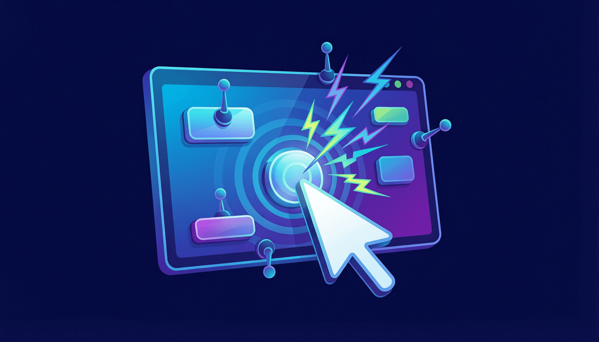

# 第5章：事件处理与条件渲染



> *"一个好的 UI 不只是好看，还得能'互动'。" —— 某位 UX 设计师*

## 5.1 引言：让组件"活"起来

前面几章，我们学会了创建组件、传递 Props、用 JSX 描述界面。但是，到目前为止，我们的组件都是"静态"的——它们展示内容，但不会对你的操作做出任何反应。

这就好比你做了一个精美的机器人模型，它看起来很酷，但按按钮没反应、拉操纵杆不动弹——它只是个摆设。

今天，我们要给组件装上"传感器"和"马达"——让它能感知用户的操作（点击、输入、滚动），并且做出反应（更新数据、改变界面、发送请求）。

> **比喻时间：** 事件处理就像给组件装了传感器——你点它，它就给你反应。就像你家的智能灯，你拍一下手（事件），它就亮了（响应）。而条件渲染则像一个聪明的管家，根据当前情况决定给你看什么——你登录了，它显示个人面板；你没登录，它显示登录按钮。

## 5.2 React 事件 vs 原生 DOM 事件

在写 React 事件之前，先了解一下它和原生 HTML/DOM 事件的区别：

| 特性 | 原生 HTML/DOM | React |
|------|-------------|-------|
| 事件命名 | 全小写：`onclick` | 驼峰命名：`onClick` |
| 事件处理函数 | 字符串：`onclick="handleClick()"` | 函数引用：`onClick={handleClick}` |
| 阻止默认行为 | `return false` | 必须显式调用 `e.preventDefault()` |
| 事件对象 | 原生 Event | SyntheticEvent（合成事件） |

来看具体对比：

```jsx
// ===== 原生 HTML 写法 =====
// <button onclick="alert('你点了我')">点我</button>

// ===== React 写法 =====
function ClickDemo() {
  // 定义事件处理函数
  function handleClick() {
    alert('你点了我！');
  }

  return (
    // 用驼峰命名 onClick，传函数引用（不加括号）
    <button onClick={handleClick}>点我</button>
  );
}
```

> [!WARNING] 注意
> 最常见的错误之一——`onClick={handleClick()}` 加了括号。这会在组件渲染时**立即执行**函数，而不是等用户点击。正确写法是 `onClick={handleClick}`（不带括号）。如果你需要传参数，看后面的"向事件处理函数传参"部分。

## 5.3 常用事件一览

React 支持的事件类型非常丰富，以下是最常用的：

### 鼠标事件

```jsx
function MouseEvents() {
  return (
    <div>
      {/* 点击 */}
      <button onClick={() => console.log('点击了')}>onClick</button>

      {/* 双击 */}
      <button onDoubleClick={() => console.log('双击了')}>onDoubleClick</button>

      {/* 鼠标进入 */}
      <div
        onMouseEnter={() => console.log('鼠标进入了')}
        onMouseLeave={() => console.log('鼠标离开了')}
        style={{ padding: '20px', border: '1px solid #ddd', marginTop: '10px' }}
      >
        把鼠标移到这里试试
      </div>
    </div>
  );
}
```

### 键盘事件

```jsx
function KeyboardEvents() {
  // 处理按键事件
  function handleKeyDown(e) {
    console.log(`按下了: ${e.key}, 键码: ${e.keyCode}`);
    if (e.key === 'Enter') {
      console.log('按下了回车键！');
    }
  }

  return (
    <div>
      {/* onKeyDown：按键按下时触发 */}
      <input
        onKeyDown={handleKeyDown}
        placeholder="在这里按任意键..."
        style={{ padding: '8px', fontSize: '16px' }}
      />
      <p style={{ color: 'gray', fontSize: '14px' }}>
        提示：试试在输入框里按各种键，打开控制台查看输出
      </p>
    </div>
  );
}
```

### 表单事件

```jsx
import { useState } from 'react';

function FormEvents() {
  const [text, setText] = useState('');
  const [selected, setSelected] = useState('react');

  return (
    <div>
      {/* onChange：输入变化时触发（最常用！） */}
      <input
        type="text"
        value={text}
        onChange={(e) => setText(e.target.value)}
        placeholder="输入一些文字..."
      />
      <p>你输入了：{text}</p>

      {/* select 的 onChange */}
      <select value={selected} onChange={(e) => setSelected(e.target.value)}>
        <option value="react">React</option>
        <option value="vue">Vue</option>
        <option value="angular">Angular</option>
      </select>
      <p>你选了：{selected}</p>

      {/* onSubmit：表单提交时触发 */}
      <form onSubmit={(e) => {
        e.preventDefault();  // 阻止表单的默认提交行为
        alert(`提交内容：${text}，框架：${selected}`);
      }}>
        <button type="submit">提交</button>
      </form>
    </div>
  );
}
```

> [!TIP] 提示
> `onChange` 在 React 中比在原生 HTML 中更好用——它在每次输入变化时都会触发（不仅是失焦时），这让实时响应输入变得非常容易。

### 焦点事件

```jsx
function FocusEvents() {
  return (
    <div>
      <input
        onFocus={() => console.log('输入框获得焦点')}
        onBlur={() => console.log('输入框失去焦点')}
        placeholder="点击这里，然后点击其他地方"
      />
    </div>
  );
}
```

## 5.4 事件处理函数的写法

在 React 中，事件处理函数有三种常见写法：

### 写法一：组件内定义函数（推荐）

```jsx
function MyComponent() {
  // 在组件内部定义处理函数
  function handleClick() {
    console.log('按钮被点击了！');
  }

  return <button onClick={handleClick}>点我</button>;
}
```

### 写法二：箭头函数（同样推荐）

```jsx
function MyComponent() {
  // 用箭头函数定义
  const handleClick = () => {
    console.log('按钮被点击了！');
  };

  return <button onClick={handleClick}>点我</button>;
}
```

### 写法三：内联函数（适合简单操作）

```jsx
function MyComponent() {
  return (
    <button onClick={() => console.log('点击了！')}>
      点我
    </button>
  );
}
```

> [!TIP] 提示
> 什么时候用哪种？简单原则——
>
> - 逻辑简单（1-2 行）→ 用内联函数
> - 逻辑复杂（3 行以上）→ 单独定义函数
> - 需要传给子组件 → 必须单独定义（内联函数每次渲染都是新引用，可能导致不必要的子组件重渲染）

## 5.5 向事件处理函数传参

这是新手经常困惑的问题：`onClick={handleClick}` 不带括号不能传参，带了括号又会立即执行。怎么办？

### 方法一：用箭头函数包装

```jsx
function ColorButtons() {
  // 处理函数接受一个参数
  function handleColorClick(color) {
    alert(`你选了 ${color}！`);
  }

  return (
    <div>
      {/* 用箭头函数包装，把参数传进去 */}
      <button onClick={() => handleColorClick('红色')}>红色</button>
      <button onClick={() => handleColorClick('蓝色')}>蓝色</button>
      <button onClick={() => handleColorClick('绿色')}>绿色</button>
    </div>
  );
}
```

### 方法二：通过 id 或 data 属性（适合列表场景）

```jsx
function ItemList() {
  const items = [
    { id: 1, name: '苹果' },
    { id: 2, name: '香蕉' },
    { id: 3, name: '橘子' },
  ];

  // 从事件对象中获取信息
  function handleItemClick(e) {
    const itemId = e.currentTarget.dataset.id;
    const itemName = e.currentTarget.dataset.name;
    alert(`你点击了：${itemName}（ID: ${itemId}）`);
  }

  return (
    <ul>
      {items.map(item => (
        <li
          key={item.id}
          data-id={item.id}
          data-name={item.name}
          onClick={handleItemClick}
          style={{ cursor: 'pointer', padding: '8px' }}
        >
          {item.name}
        </li>
      ))}
    </ul>
  );
}
```

> [!TIP] 提示
> 方法一更常用也更直观。方法二适合列表渲染的场景，避免了为每个列表项创建新的箭头函数。

## 5.6 事件对象（SyntheticEvent）

React 的事件处理函数会自动接收一个事件对象作为参数。这个对象和原生 DOM 的 Event 对象类似，但有一些区别——React 用的是 **合成事件（SyntheticEvent）**。

```jsx
function EventDemo() {
  function handleClick(e) {
    // 常用属性
    console.log('事件类型:', e.type);          // "click"
    console.log('目标元素:', e.target);         // 被点击的元素
    console.log('当前元素:', e.currentTarget);  // 绑定事件的元素
    console.log('鼠标位置:', e.clientX, e.clientY);
    console.log('是否按了 Ctrl:', e.ctrlKey);
    console.log('是否按了 Shift:', e.shiftKey);
  }

  function handleInput(e) {
    // 获取输入框的值
    console.log('输入的值:', e.target.value);
    console.log('输入框名称:', e.target.name);
  }

  function handleSubmit(e) {
    // 阻止表单默认提交
    e.preventDefault();
    console.log('表单已提交（但页面不会刷新）');
  }

  return (
    <div>
      <button onClick={handleClick}>点击查看详情</button>
      <input onChange={handleInput} name="username" placeholder="输入内容" />
      <form onSubmit={handleSubmit}>
        <button type="submit">提交表单</button>
      </form>
    </div>
  );
}
```

### `e.target` vs `e.currentTarget`

这两个属性经常被混淆：

- **`e.target`**：实际触发事件的元素（你点的那个东西）
- **`e.currentTarget`**：绑定事件处理函数的元素

```jsx
function TargetDemo() {
  function handleClick(e) {
    // 如果你点击了按钮里的 emoji，target 是 <span>，currentTarget 是 <button>
    console.log('target:', e.target.tagName);          // 可能是 SPAN
    console.log('currentTarget:', e.currentTarget.tagName); // 一定是 BUTTON
  }

  return (
    <button onClick={handleClick}>
      <span>🎉</span> 点我试试
    </button>
  );
}
```

> [!WARNING] 注意
> 如果你想获取"绑定事件的元素"的属性（如 `dataset`），请用 `e.currentTarget`，而不是 `e.target`。`e.target` 可能是事件冒泡上来的子元素。

## 5.7 阻止默认行为和事件冒泡

### 阻止默认行为

```jsx
function PreventDefaultDemo() {
  // 阻止链接跳转
  function handleLinkClick(e) {
    e.preventDefault();  // 阻止默认的跳转行为
    alert('链接被拦截了！不会跳转到百度。');
  }

  // 阻止表单提交
  function handleFormSubmit(e) {
    e.preventDefault();  // 阻止表单的默认提交（页面刷新）
    alert('表单提交了，但页面不会刷新！');
  }

  return (
    <div>
      <a href="https://baidu.com" onClick={handleLinkClick}>
        点击这个链接（不会跳转）
      </a>
      <form onSubmit={handleFormSubmit}>
        <button type="submit">提交表单（不会刷新）</button>
      </form>
    </div>
  );
}
```

> [!WARNING] 注意
> 在 React 中，你 **不能** 像原生 HTML 那样用 `return false` 来阻止默认行为。必须显式调用 `e.preventDefault()`。

### 阻止事件冒泡

```jsx
function StopPropagationDemo() {
  function handleOuterClick() {
    alert('外层 div 被点击了');
  }

  function handleInnerClick(e) {
    e.stopPropagation();  // 阻止事件冒泡到父元素
    alert('内层按钮被点击了（不会触发外层的点击事件）');
  }

  return (
    <div
      onClick={handleOuterClick}
      style={{ padding: '30px', border: '2px solid blue', cursor: 'pointer' }}
    >
      <p>外层区域（蓝色边框）</p>
      <button onClick={handleInnerClick}>
        内层按钮（点击不会触发外层事件）
      </button>
    </div>
  );
}
```

## 5.8 条件渲染深入

在第3章中我们简单介绍了条件渲染，这里我们来更深入地学习各种技巧。

### 5.8.1 用变量存储 JSX

当条件逻辑比较复杂时，可以把 JSX 提取到变量中，让代码更清晰：

```jsx
function Dashboard({ user }) {
  // 用变量存储不同状态下的 JSX
  let content;

  if (user.isLoading) {
    content = (
      <div className="loading">
        <p>⏳ 加载中，请稍候...</p>
      </div>
    );
  } else if (user.isError) {
    content = (
      <div className="error">
        <p>❌ 出错了：{user.errorMessage}</p>
        <button onClick={() => window.location.reload()}>重试</button>
      </div>
    );
  } else if (!user.isLoggedIn) {
    content = (
      <div className="login-prompt">
        <p>🔒 请先登录</p>
        <button>去登录</button>
      </div>
    );
  } else {
    content = (
      <div className="welcome">
        <h2>欢迎回来，{user.name}！</h2>
        <p>今天是个好日子 ☀️</p>
      </div>
    );
  }

  return (
    <div>
      <h1>控制面板</h1>
      {/* 渲染变量中的 JSX */}
      {content}
    </div>
  );
}
```

### 5.8.2 用对象映射替代多个 if/else

当条件是某个枚举值时，用对象映射比一堆 `if/else` 更优雅：

```jsx
function StatusBadge({ status }) {
  // 用对象映射不同状态对应的配置
  const statusConfig = {
    active: { label: '活跃', color: '#4caf50', emoji: '🟢' },
    inactive: { label: '未激活', color: '#9e9e9e', emoji: '⚪' },
    banned: { label: '已封禁', color: '#f44336', emoji: '🔴' },
    pending: { label: '待审核', color: '#ff9800', emoji: '🟡' },
  };

  // 获取配置，如果没有匹配的就用默认值
  const config = statusConfig[status] || { label: '未知', color: '#999', emoji: '❓' };

  return (
    <span style={{
      padding: '4px 12px',
      borderRadius: '20px',
      backgroundColor: config.color,
      color: 'white',
      fontSize: '14px',
    }}>
      {config.emoji} {config.label}
    </span>
  );
}

// 使用
function App() {
  return (
    <div>
      <StatusBadge status="active" />
      <StatusBadge status="banned" />
      <StatusBadge status="pending" />
      <StatusBadge status="unknown" />  {/* 显示"未知" */}
    </div>
  );
}
```

### 5.8.3 多个条件组合

当有多个独立条件需要同时判断时：

```jsx
function NotificationBar({ messages, isOnline, isMuted }) {
  return (
    <div style={{
      padding: '10px',
      backgroundColor: messages.length > 0 ? '#fff3e0' : '#e8f5e9',
      borderRadius: '6px',
    }}>
      {/* 在线 + 非静音 + 有消息 → 显示消息数 */}
      {isOnline && !isMuted && messages.length > 0 && (
        <p>📬 你有 {messages.length} 条新消息</p>
      )}

      {/* 在线 + 静音 → 提示静音 */}
      {isOnline && isMuted && (
        <p>🔕 消息已静音</p>
      )}

      {/* 不在线 */}
      {!isOnline && (
        <p>📡 你当前离线</p>
      )}

      {/* 在线 + 没消息 */}
      {isOnline && !isMuted && messages.length === 0 && (
        <p>✨ 暂无新消息</p>
      )}
    </div>
  );
}
```

> [!TIP] 提示
> 当条件组合变得复杂时（超过3个条件），考虑把组件拆分成更小的子组件，每个子组件只处理一部分逻辑。这样代码更容易理解和维护。

## 5.9 实战：点赞按钮组件

终于到了实战环节！让我们来做一个交互式的"点赞按钮"组件，综合运用事件处理和条件渲染。

```jsx
import { useState } from 'react';

// ===== 点赞按钮组件 =====
function LikeButton() {
  // 状态：是否已点赞 + 点赞数
  const [isLiked, setIsLiked] = useState(false);
  const [likeCount, setLikeCount] = useState(42);

  // 处理点赞点击
  function handleLike() {
    if (isLiked) {
      // 取消点赞
      setIsLiked(false);
      setLikeCount(likeCount - 1);
    } else {
      // 点赞
      setIsLiked(true);
      setLikeCount(likeCount + 1);
    }
  }

  return (
    <button
      onClick={handleLike}
      style={{
        padding: '10px 20px',
        fontSize: '16px',
        border: `2px solid ${isLiked ? '#e74c3c' : '#ddd'}`,
        borderRadius: '25px',
        backgroundColor: isLiked ? '#ffebee' : '#fff',
        color: isLiked ? '#e74c3c' : '#666',
        cursor: 'pointer',
        transition: 'all 0.2s ease',
        display: 'flex',
        alignItems: 'center',
        gap: '8px',
      }}
    >
      {/* 根据是否点赞显示不同图标 */}
      <span style={{ fontSize: '20px' }}>
        {isLiked ? '❤️' : '🤍'}
      </span>
      <span>{likeCount}</span>
    </button>
  );
}

// ===== 更丰富的版本：带多种反应 =====
function ReactionBar() {
  // 定义所有反应类型
  const reactions = [
    { id: 'like', emoji: '👍', label: '赞' },
    { id: 'love', emoji: '❤️', label: '喜爱' },
    { id: 'haha', emoji: '😂', label: '哈哈' },
    { id: 'wow', emoji: '😮', label: '哇' },
    { id: 'sad', emoji: '😢', label: '难过' },
  ];

  // 用对象记录每个反应的数量
  const [counts, setCounts] = useState({
    like: 128, love: 56, haha: 23, wow: 8, sad: 3,
  });

  // 记录用户选择了哪个反应
  const [selected, setSelected] = useState(null);

  // 处理反应点击
  function handleReaction(reactionId) {
    if (selected === reactionId) {
      // 取消选择
      setCounts({ ...counts, [reactionId]: counts[reactionId] - 1 });
      setSelected(null);
    } else {
      // 如果之前选过别的，先把旧的取消
      const newCounts = { ...counts };
      if (selected) {
        newCounts[selected] = newCounts[selected] - 1;
      }
      // 选择新的
      newCounts[reactionId] = newCounts[reactionId] + 1;
      setCounts(newCounts);
      setSelected(reactionId);
    }
  }

  return (
    <div style={{
      padding: '16px',
      border: '1px solid #eee',
      borderRadius: '12px',
      maxWidth: '400px',
      fontFamily: 'sans-serif',
    }}>
      <h3 style={{ margin: '0 0 12px' }}>你的反应是？</h3>

      {/* 反应按钮列表 */}
      <div style={{ display: 'flex', gap: '8px', flexWrap: 'wrap' }}>
        {reactions.map(reaction => (
          <button
            key={reaction.id}
            onClick={() => handleReaction(reaction.id)}
            style={{
              padding: '8px 16px',
              borderRadius: '20px',
              border: selected === reaction.id ? '2px solid #3498db' : '2px solid #eee',
              backgroundColor: selected === reaction.id ? '#e3f2fd' : '#fff',
              cursor: 'pointer',
              fontSize: '14px',
              display: 'flex',
              alignItems: 'center',
              gap: '4px',
              transition: 'all 0.2s',
            }}
          >
            <span style={{ fontSize: '18px' }}>{reaction.emoji}</span>
            <span>{counts[reaction.id]}</span>
          </button>
        ))}
      </div>

      {/* 底部统计 */}
      <p style={{ margin: '12px 0 0', color: '#999', fontSize: '13px' }}>
        共 {Object.values(counts).reduce((sum, n) => sum + n, 0)} 个反应
        {selected && (
          <span> · 你选择了：{reactions.find(r => r.id === selected)?.emoji} {reactions.find(r => r.id === selected)?.label}</span>
        )}
      </p>
    </div>
  );
}

// ===== 完整的 App =====
function App() {
  return (
    <div style={{ padding: '30px', fontFamily: 'sans-serif' }}>
      <h1>👍 事件处理实战</h1>

      {/* 简单点赞按钮 */}
      <section style={{ marginBottom: '30px' }}>
        <h2>简单点赞</h2>
        <LikeButton />
      </section>

      {/* 多种反应 */}
      <section>
        <h2>多种反应</h2>
        <ReactionBar />
      </section>
    </div>
  );
}

export default App;
```

把这段代码保存到 `App.jsx`，运行 `npm run dev`，试试在页面上点击各种按钮——你会看到状态在实时变化。这就是事件处理 + 条件渲染的威力！

## 5.10 受控组件：表单输入的正确姿势

在 React 中，表单元素（`<input>`、`<select>`、`<textarea>`）的状态应该由 React 来管理，而不是由 DOM 自己管理。这种模式叫做 **受控组件（Controlled Component）**。

```jsx
import { useState } from 'react';

function LoginForm() {
  // 用 state 管理表单数据
  const [formData, setFormData] = useState({
    username: '',
    password: '',
    remember: false,
  });

  // 通用的输入处理函数
  function handleChange(e) {
    const { name, value, type, checked } = e.target;
    setFormData(prev => ({
      ...prev,
      // 如果是 checkbox，用 checked；否则用 value
      [name]: type === 'checkbox' ? checked : value,
    }));
  }

  // 表单提交
  function handleSubmit(e) {
    e.preventDefault();
    console.log('提交的数据：', formData);
    alert(`用户名：${formData.username}\n记住我：${formData.remember ? '是' : '否'}`);
  }

  return (
    <form onSubmit={handleSubmit} style={{ maxWidth: '300px' }}>
      <h2>登录</h2>

      <div style={{ marginBottom: '12px' }}>
        <label>用户名：</label>
        <br />
        <input
          type="text"
          name="username"
          value={formData.username}
          onChange={handleChange}
          placeholder="请输入用户名"
          style={{ width: '100%', padding: '8px', marginTop: '4px' }}
        />
      </div>

      <div style={{ marginBottom: '12px' }}>
        <label>密码：</label>
        <br />
        <input
          type="password"
          name="password"
          value={formData.password}
          onChange={handleChange}
          placeholder="请输入密码"
          style={{ width: '100%', padding: '8px', marginTop: '4px' }}
        />
      </div>

      <div style={{ marginBottom: '12px' }}>
        <label>
          <input
            type="checkbox"
            name="remember"
            checked={formData.remember}
            onChange={handleChange}
          />
          {' '}记住我
        </label>
      </div>

      {/* 条件渲染：密码长度提示 */}
      {formData.password.length > 0 && formData.password.length < 6 && (
        <p style={{ color: 'red', fontSize: '12px' }}>密码至少需要 6 个字符</p>
      )}

      <button
        type="submit"
        disabled={!formData.username || formData.password.length < 6}
        style={{
          width: '100%',
          padding: '10px',
          backgroundColor: '#1976d2',
          color: 'white',
          border: 'none',
          borderRadius: '6px',
          cursor: 'pointer',
        }}
      >
        登录
      </button>
    </form>
  );
}
```

> [!TIP] 提示
> 受控组件的核心思想是——**React state 是数据的唯一来源（Single Source of Truth）**。DOM 中的 input 值永远跟随 state，而不是反过来。这让表单数据的管理变得非常可控和可预测。

## 5.11 常见的事件处理陷阱

让我帮你避开这些坑：

### 陷阱 1：在 onClick 中立即执行了函数

```jsx
// ❌ 页面一加载就弹 alert，因为 handleClick() 在渲染时就被调用了
<button onClick={handleClick()}>点我</button>

// ✅ 传递函数引用，点击时才执行
<button onClick={handleClick}>点我</button>

// ✅ 需要传参时，用箭头函数包装
<button onClick={() => handleClick('参数')}>点我</button>
```

### 陷阱 2：忘记 e.preventDefault()

```jsx
// ❌ 表单提交后页面会刷新（默认的表单行为）
function BadForm() {
  return (
    <form onSubmit={() => console.log('提交了')}>
      <button type="submit">提交</button>
    </form>
  );
}

// ✅ 阻止默认行为
function GoodForm() {
  return (
    <form onSubmit={(e) => {
      e.preventDefault();
      console.log('提交了，页面不会刷新');
    }}>
      <button type="submit">提交</button>
    </form>
  );
}
```

### 陷阱 3：异步中访问事件对象

```jsx
// ❌ React 的合成事件会被"回收"，异步访问时属性可能为 null
function BadAsync(e) {
  setTimeout(() => {
    console.log(e.target.value);  // 可能为 null！
  }, 1000);
}

// ✅ 先保存需要的值
function GoodAsync(e) {
  const value = e.target.value;  // 先取值
  setTimeout(() => {
    console.log(value);  // 正常使用
  }, 1000);
}
```

> [!WARNING] 注意
> React 的合成事件对象（SyntheticEvent）是"池化"的——事件处理函数执行完后，事件对象的属性会被清空以便复用。如果你需要在异步操作中访问事件信息，必须先提取需要的值。（注：React 17+ 已经取消了事件池机制，但养成先提取值的好习惯仍然有益。）

## 本章小结

| 概念 | 要点 |
|------|------|
| **React 事件命名** | 驼峰命名（`onClick`，不是 `onclick`） |
| **传递函数引用** | `onClick={handler}`，不要加括号 |
| **常用事件** | `onClick`、`onChange`、`onSubmit`、`onKeyDown` |
| **传参方式** | 箭头函数包装：`() => handler(arg)` |
| **事件对象** | SyntheticEvent，常用 `e.target`、`e.preventDefault()` |
| **条件渲染** | 三元运算符、`&&`、提前 return、变量提取 |
| **受控组件** | 表单值由 React state 管理 |
| **子向父通信** | 通过回调函数 prop |

## 小练习

1. **基础练习**：创建一个 `Counter` 组件，包含三个按钮："加1"、"减1"、"重置"，以及一个显示当前计数的数字。当数字为正数时显示绿色，负数时显示红色，零时显示灰色。

2. **表单练习**：创建一个 `RegistrationForm`（注册表单）组件，包含：
   - 用户名输入框（不能为空）
   - 邮箱输入框（必须包含 @）
   - 密码输入框（至少 8 位）
   - "同意条款"复选框
   - 提交按钮（所有字段都有效时才能点击）
   - 实时显示验证错误信息

3. **交互练习**：创建一个 `Tabs`（标签页）组件，实现多个标签的切换效果。要求：
   - 接受 `tabs` 数组 prop（每项包含 `label` 和 `content`）
   - 点击标签标题切换显示对应的内容
   - 当前选中的标签有高亮样式

4. **综合练习**：创建一个"猜数字"小游戏：
   - 程序随机生成 1-100 之间的数字
   - 用户通过输入框输入猜测的数字
   - 点击"猜"按钮后，显示"太大了"、"太小了"或"猜对了！"
   - 记录猜测次数
   - 猜对后可以重新开始

```jsx
// 猜数字游戏的参考框架
function GuessGame() {
  const [target] = useState(() => Math.floor(Math.random() * 100) + 1);
  const [guess, setGuess] = useState('');
  const [message, setMessage] = useState('');
  const [attempts, setAttempts] = useState(0);

  // 你来完成 handleGuess 函数...
}
```

---

**恭喜你完成了第一部分的学习！** 到这里，你已经掌握了 React 的核心基础概念：

- ✅ 理解了 React 是什么以及为什么选择它（第1章）
- ✅ 搭建了开发环境并创建了第一个项目（第2章）
- ✅ 掌握了 JSX 语法和条件/列表渲染（第3章）
- ✅ 学会了组件的创建、Props 传递和组件组合（第4章）
- ✅ 掌握了事件处理和表单控制（第5章）

在下一部分，我们将深入 React 的状态管理、Hooks、副作用处理等更高级的主题。你已经打下了坚实的基础，接下来的学习会更加精彩！
