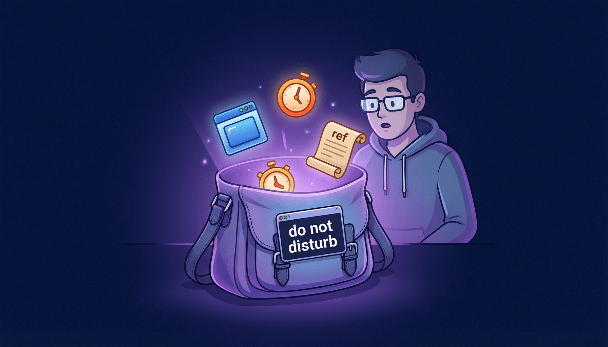

# 第9章：useRef 与 DOM 操作



## 9.1 引言：React 中也需要"直接动手"的时候

在前面的章节中，你学到了 React 的核心理念：**用 state 驱动渲染**。你几乎不需要直接操作 DOM——React 会帮你搞定一切。

但是，总有那么一些场景，你需要"亲自动手"：

- 页面加载后，让搜索框自动获取焦点
- 获取某个元素的滚动位置，实现"回到顶部"按钮
- 存储一个定时器 ID，用于在组件卸载时清除
- 记住某个值，但不希望它变化时触发重新渲染

这些场景都需要一个特殊的工具——**`useRef`**。

> **比喻**：`useRef` 就像一个秘密口袋。你可以往里面放东西、随时取出来，但别人看不到（不会触发渲染）。它有两个超能力：一是帮你"触摸"真实的 DOM 元素，二是帮你"悄悄记住"一些值。

---

## 9.2 useRef 是什么？

`useRef` 返回一个特殊的对象，叫做 **ref 对象**。这个对象只有一个有用的属性：`current`。

```jsx
import { useRef } from 'react';

function Demo() {
  // 创建一个 ref，初始值为 0
  const myRef = useRef(0);

  console.log(myRef);        // { current: 0 }
  console.log(myRef.current); // 0

  // 可以随时修改 current
  myRef.current = 42;
  console.log(myRef.current); // 42

  return <p>看看控制台</p>;
}
```

就这么简单？没错！`useRef` 的核心就是这么简单。但它的用途非常广泛，让我们逐一探索。

### useRef 的三大用途

```
┌─────────────────────────────────────────┐
│              useRef 的三大用途           │
├─────────────────────────────────────────┤
│ 1. 访问 DOM 元素（聚焦、滚动、测量等）    │
│ 2. 存储不触发渲染的值（定时器ID、旧值等）  │
│ 3. 配合 forwardRef 转发给子组件          │
└─────────────────────────────────────────┘
```

---

## 9.3 useRef vs useState：到底有什么区别？

这是初学者最常困惑的问题。它们都能"存东西"，但有一个关键区别：

| | useState | useRef |
|---|---------|--------|
| **修改后** | 触发重新渲染 | **不触发**重新渲染 |
| **值** | 每次渲染是"快照"（旧值不变） | 永远是最新值（`.current`） |
| **适用场景** | 需要显示在界面上的数据 | 不需要显示、不需要触发渲染的数据 |

用一个比喻来理解：

- **useState** 就像你的社交账号——你更新了头像（state 变了），所有好友都能看到变化（界面重新渲染）。
- **useRef** 就像你的日记本——你在里面写了什么（ref.current 变了），只有你自己知道，别人看不到（不触发渲染）。

来看一个对比示例：

```jsx
import { useState, useRef } from 'react';

function CompareDemo() {
  const [count, setCount] = useState(0);
  const refCount = useRef(0);

  const handleClick = () => {
    // useState：修改后触发重新渲染
    setCount(prev => prev + 1);

    // useRef：修改后不触发重新渲染
    refCount.current += 1;

    console.log(`useState count: ${count + 1}, useRef count: ${refCount.current}`);
  };

  return (
    <div>
      <p>useState 的 count: {count}</p>
      {/* refCount.current 显示的值可能不是最新的，因为没有触发重新渲染 */}
      <p>useRef 的 count: {refCount.current}（可能不是最新值！）</p>
      <button onClick={handleClick}>两个一起 +1</button>
      <p style={{ color: '#999', fontSize: '12px' }}>
        点击按钮后查看控制台。useState 每次都是最新值，useRef 的界面显示可能落后。
      </p>
    </div>
  );
}

export default CompareDemo;
```

> [!WARNING] 注意
>  不要在渲染过程中读取或写入 `ref.current`（除非是初始化）。因为 ref 不会触发重新渲染，你在 JSX 中读到的 `ref.current` 可能是上一次渲染时的旧值。ref 应该只在事件处理函数或 useEffect 中使用。

---

## 9.4 用 useRef 访问 DOM 元素

这是 `useRef` 最经典的用法——获取真实的 DOM 元素，然后对它做一些 React 不擅长的事。

### 基本用法：给元素添加 ref 属性

```jsx
import { useRef } from 'react';

function FocusInput() {
  // 创建一个 ref
  const inputRef = useRef(null);

  const handleFocus = () => {
    // 通过 ref.current 访问真实的 DOM 元素
    inputRef.current.focus();
  };

  const handleClear = () => {
    inputRef.current.value = '';
    inputRef.current.focus();
  };

  return (
    <div>
      <h2>DOM 操作示例</h2>

      {/* 把 ref 绑定到 input 元素上 */}
      <input ref={inputRef} placeholder="点击按钮让我聚焦" />

      <button onClick={handleFocus}>聚焦输入框</button>
      <button onClick={handleClear}>清空并聚焦</button>
    </div>
  );
}

export default FocusInput;
```

**工作流程**：

1. `useRef(null)` 创建一个 ref 对象，初始值为 `null`
2. `<input ref={inputRef}>` 告诉 React：把这个 DOM 元素的引用放到 `inputRef.current` 中
3. React 在渲染完成后，自动把真实的 DOM 元素赋值给 `inputRef.current`
4. 你就可以通过 `inputRef.current` 来操作这个 DOM 元素了

### 实用场景：滚动到某个位置

```jsx
import { useRef } from 'react';

function ScrollDemo() {
  const section1Ref = useRef(null);
  const section2Ref = useRef(null);
  const section3Ref = useRef(null);

  const scrollTo = (ref) => {
    ref.current.scrollIntoView({ behavior: 'smooth' });
  };

  return (
    <div>
      <h2>滚动导航示例</h2>

      {/* 导航按钮 */}
      <div style={{ position: 'sticky', top: 0, background: 'white', padding: '8px', zIndex: 1 }}>
        <button onClick={() => scrollTo(section1Ref)}>跳转到第一节</button>
        <button onClick={() => scrollTo(section2Ref)}>跳转到第二节</button>
        <button onClick={() => scrollTo(section3Ref)}>跳转到第三节</button>
      </div>

      {/* 内容区域 */}
      <div ref={section1Ref} style={{ height: '400px', background: '#e3f2fd', padding: '20px', margin: '10px 0' }}>
        <h3>第一节：React 简介</h3>
        <p>React 是一个用于构建用户界面的 JavaScript 库。它由 Facebook 开发和维护...</p>
        <p>（想象这里有更多内容）</p>
      </div>

      <div ref={section2Ref} style={{ height: '400px', background: '#e8f5e9', padding: '20px', margin: '10px 0' }}>
        <h3>第二节：组件化开发</h3>
        <p>React 的核心思想是将 UI 拆分为独立的、可复用的组件...</p>
        <p>（想象这里有更多内容）</p>
      </div>

      <div ref={section3Ref} style={{ height: '400px', background: '#fff3e0', padding: '20px', margin: '10px 0' }}>
        <h3>第三节：Hooks 入门</h3>
        <p>Hooks 是 React 16.8 引入的新特性，让你在函数组件中使用 state 和其他特性...</p>
        <p>（想象这里有更多内容）</p>
      </div>
    </div>
  );
}

export default ScrollDemo;
```

### 实用场景：获取元素尺寸

```jsx
import { useRef, useState, useEffect } from 'react';

function ElementSize() {
  const boxRef = useRef(null);
  const [size, setSize] = useState({ width: 0, height: 0 });

  useEffect(() => {
    // 组件渲染后，通过 ref 获取元素的尺寸
    if (boxRef.current) {
      const { offsetWidth, offsetHeight } = boxRef.current;
      setSize({ width: offsetWidth, height: offsetHeight });
    }
  }, []);

  return (
    <div>
      <h2>元素尺寸测量</h2>
      <div
        ref={boxRef}
        style={{
          width: '300px',
          height: '200px',
          background: '#bbdefb',
          display: 'flex',
          alignItems: 'center',
          justifyContent: 'center',
          borderRadius: '8px',
        }}
      >
        <div style={{ textAlign: 'center' }}>
          <p>我是一个盒子</p>
          <p><strong>宽度: {size.width}px</strong></p>
          <p><strong>高度: {size.height}px</strong></p>
        </div>
      </div>
    </div>
  );
}

export default ElementSize;
```

> [!TIP] 提示
> : 在 useEffect 中访问 ref 是安全的，因为 useEffect 在 DOM 渲染完成后才执行。此时 `ref.current` 已经被赋值了真实的 DOM 元素。

---

## 9.5 用 useRef 存储不触发渲染的值

`useRef` 的第二个超能力：**悄悄记住一些值，而不会触发重新渲染**。这在很多场景下非常有用。

### 场景一：存储定时器 ID

```jsx
import { useState, useRef, useEffect } from 'react';

function Stopwatch() {
  const [time, setTime] = useState(0);
  const [isRunning, setIsRunning] = useState(false);

  // 用 ref 存储定时器 ID（不需要触发渲染）
  const timerRef = useRef(null);

  const start = () => {
    if (!isRunning) {
      setIsRunning(true);
      timerRef.current = setInterval(() => {
        setTime(prev => prev + 10); // 每 10ms 更新一次
      }, 10);
    }
  };

  const stop = () => {
    setIsRunning(false);
    clearInterval(timerRef.current);
    timerRef.current = null;
  };

  const reset = () => {
    stop();
    setTime(0);
  };

  // 组件卸载时清除定时器
  useEffect(() => {
    return () => {
      if (timerRef.current) {
        clearInterval(timerRef.current);
      }
    };
  }, []);

  // 格式化时间
  const formatTime = (ms) => {
    const minutes = Math.floor(ms / 60000);
    const seconds = Math.floor((ms % 60000) / 1000);
    const centiseconds = Math.floor((ms % 1000) / 10);
    return `${String(minutes).padStart(2, '0')}:${String(seconds).padStart(2, '0')}.${String(centiseconds).padStart(2, '0')}`;
  };

  return (
    <div style={{ textAlign: 'center', padding: '20px' }}>
      <h2>⏱ 秒表</h2>
      <p style={{ fontSize: '3em', fontFamily: 'monospace' }}>
        {formatTime(time)}
      </p>
      <div style={{ display: 'flex', gap: '8px', justifyContent: 'center' }}>
        <button onClick={start} disabled={isRunning}>开始</button>
        <button onClick={stop} disabled={!isRunning}>暂停</button>
        <button onClick={reset}>重置</button>
      </div>
    </div>
  );
}

export default Stopwatch;
```

为什么用 `useRef` 而不是 `useState` 存储定时器 ID？因为：

1. 定时器 ID 不需要显示在界面上
2. 修改定时器 ID 不需要触发重新渲染
3. 在 `clearInterval` 时需要拿到最新值——ref 总是最新的

### 场景二：记住"上一次"的值

```jsx
import { useState, useRef, useEffect } from 'react';

function PreviousValue() {
  const [count, setCount] = useState(0);
  const prevCountRef = useRef(0);

  // 每次渲染后，更新 prevCountRef 为当前值
  // 这样在下一次渲染时，prevCountRef 就保存了"上一次"的值
  useEffect(() => {
    prevCountRef.current = count;
  }, [count]);

  const diff = count - prevCountRef.current;

  return (
    <div>
      <h2>记录上次的值</h2>
      <p>当前值: <strong>{count}</strong></p>
      <p>上一次的值: <strong>{prevCountRef.current}</strong></p>
      <p>
        变化: <strong style={{ color: diff > 0 ? 'green' : diff < 0 ? 'red' : 'gray' }}>
          {diff > 0 ? `+${diff}` : diff < 0 ? diff : '无变化'}
        </strong>
      </p>
      <div style={{ display: 'flex', gap: '8px' }}>
        <button onClick={() => setCount(c => c + 1)}>+1</button>
        <button onClick={() => setCount(c => c + 5)}>+5</button>
        <button onClick={() => setCount(c => c - 1)}>-1</button>
        <button onClick={() => setCount(0)}>重置</button>
      </div>
    </div>
  );
}

export default PreviousValue;
```

> [!TIP] 提示
> : "记住上一次的值"是一个常见需求，比如判断一个值是增加了还是减少了、比较 props 是否变化等。使用 useRef 存储上次的值，既不会触发额外的渲染，又能在需要时随时访问。

### 场景三：避免重复执行

```jsx
import { useRef } from 'react';

function OnlyOnce() {
  const hasLoggedIn = useRef(false);

  // 这个 log 只在组件第一次渲染时执行
  // 即使组件因为 state 变化重新渲染，也不会重复打印
  if (!hasLoggedIn.current) {
    console.log('组件首次渲染！执行初始化逻辑...');
    hasLoggedIn.current = true;
  }

  return <p>检查控制台——日志只打印一次</p>;
}

export default OnlyOnce;
```

> [!WARNING] 注意
>  虽然这个技巧有效，但在渲染阶段直接修改 ref 在严格模式下可能有问题（React 18 的 StrictMode 会双重调用组件函数）。更安全的做法是把这类逻辑放到 `useEffect(fn, [])` 中。

---

## 9.6 forwardRef 简介

有时候，你想让父组件能访问子组件内部的 DOM 元素。但 `ref` 不像普通 Props 那样可以直接传递——如果你把 `ref` 作为普通 prop 传下去，React 会报警告。

解决方案是使用 `forwardRef`，让子组件"转发" ref 给内部的 DOM 元素。

```jsx
import { useRef, forwardRef } from 'react';

// 使用 forwardRef 包装子组件
const FancyInput = forwardRef((props, ref) => {
  return (
    <div style={{ display: 'inline-block' }}>
      {props.label && <label style={{ display: 'block', marginBottom: '4px' }}>{props.label}</label>}
      <input
        ref={ref}   // 把父组件传来的 ref 绑定到 input 上
        style={{
          padding: '8px 12px',
          border: '2px solid #007bff',
          borderRadius: '6px',
          fontSize: '14px',
        }}
        placeholder={props.placeholder}
      />
    </div>
  );
});

// 给 forwardRef 组件起个显示名（方便调试）
FancyInput.displayName = 'FancyInput';

// 父组件
function App() {
  const inputRef = useRef(null);

  const handleClick = () => {
    // 父组件可以直接操作子组件内部的 input
    inputRef.current.focus();
  };

  return (
    <div>
      <h2>forwardRef 示例</h2>
      <FancyInput ref={inputRef} label="用户名" placeholder="请输入..." />
      <br /><br />
      <button onClick={handleClick}>聚焦输入框</button>
      <p style={{ color: '#666', fontSize: '14px' }}>
        父组件通过 forwardRef 获取了子组件内部 input 的引用
      </p>
    </div>
  );
}

export default App;
```

> [!TIP] 提示
> : `forwardRef` 在创建 UI 组件库时非常有用。比如你做了一个 `<Button>` 组件，使用者可能需要获取按钮的 DOM 来做动画或聚焦，这时就需要 forwardRef。在日常开发中用得较少，了解即可。

---

## 9.7 实战：自动聚焦的搜索框 + 倒计时器

让我们综合运用本章知识，做两个实用的组件。

### 实战一：自动聚焦的搜索框

```jsx
import { useRef, useState, useEffect } from 'react';

function SearchBox() {
  const inputRef = useRef(null);
  const [query, setQuery] = useState('');
  const [results, setResults] = useState([]);

  // 模拟的搜索数据
  const allItems = [
    'React', 'Vue', 'Angular', 'Svelte', 'Solid',
    'JavaScript', 'TypeScript', 'Python', 'Java', 'Go',
    'HTML', 'CSS', 'Tailwind', 'Bootstrap', 'Sass',
    'Node.js', 'Deno', 'Bun', 'Express', 'Next.js',
  ];

  // 组件挂载后自动聚焦
  useEffect(() => {
    inputRef.current.focus();
  }, []);

  // 搜索逻辑
  const handleSearch = (e) => {
    const value = e.target.value;
    setQuery(value);

    if (value.trim() === '') {
      setResults([]);
      return;
    }

    const filtered = allItems.filter(item =>
      item.toLowerCase().includes(value.toLowerCase())
    );
    setResults(filtered);
  };

  // 用 ref 记录搜索次数（不需要触发渲染）
  const searchCountRef = useRef(0);

  const handleSearchWithCount = (e) => {
    searchCountRef.current += 1;
    handleSearch(e);
  };

  return (
    <div style={{ maxWidth: '400px', margin: '0 auto', padding: '20px' }}>
      <h2>🔍 自动聚焦搜索框</h2>

      <div style={{ position: 'relative' }}>
        <input
          ref={inputRef}
          type="text"
          value={query}
          onChange={handleSearchWithCount}
          placeholder="搜索技术栈..."
          style={{
            width: '100%',
            padding: '12px 16px',
            fontSize: '16px',
            border: '2px solid #007bff',
            borderRadius: '8px',
            boxSizing: 'border-box',
            outline: 'none',
          }}
        />
        {query && (
          <button
            onClick={() => {
              setQuery('');
              setResults([]);
              inputRef.current.focus(); // 清空后重新聚焦
            }}
            style={{
              position: 'absolute',
              right: '8px',
              top: '50%',
              transform: 'translateY(-50%)',
              background: 'none',
              border: 'none',
              fontSize: '18px',
              cursor: 'pointer',
            }}
          >
            ✕
          </button>
        )}
      </div>

      {/* 搜索结果 */}
      {results.length > 0 && (
        <ul style={{
          listStyle: 'none',
          padding: 0,
          margin: '8px 0',
          border: '1px solid #ddd',
          borderRadius: '8px',
          maxHeight: '200px',
          overflowY: 'auto',
        }}>
          {results.map(item => (
            <li
              key={item}
              onClick={() => {
                setQuery(item);
                setResults([]);
                inputRef.current.focus();
              }}
              style={{
                padding: '8px 16px',
                cursor: 'pointer',
                borderBottom: '1px solid #eee',
              }}
              onMouseEnter={(e) => e.target.style.background = '#f0f7ff'}
              onMouseLeave={(e) => e.target.style.background = 'white'}
            >
              {item}
            </li>
          ))}
        </ul>
      )}

      {query && results.length === 0 && (
        <p style={{ color: '#999', textAlign: 'center', padding: '16px' }}>
          没有找到匹配的结果
        </p>
      )}

      <p style={{ color: '#666', fontSize: '12px' }}>
        已搜索 {searchCountRef.current} 次
        （这个数字只在页面重新渲染时更新，因为用的是 useRef）
      </p>
    </div>
  );
}

export default SearchBox;
```

### 实战二：倒计时器

```jsx
import { useState, useRef, useEffect } from 'react';

function CountdownTimer() {
  // 用户可以设置的总秒数
  const [totalSeconds, setTotalSeconds] = useState(60);
  // 剩余秒数
  const [remaining, setRemaining] = useState(60);
  // 是否正在运行
  const [isRunning, setIsRunning] = useState(false);

  // 用 ref 存储定时器 ID
  const timerRef = useRef(null);
  // 用 ref 存储精确的开始时间（避免 setInterval 的累积误差）
  const startTimeRef = useRef(null);
  // 用 ref 存储暂停时的剩余时间
  const pausedRemainingRef = useRef(null);

  // 开始倒计时
  const start = () => {
    if (isRunning) return;

    setIsRunning(true);
    // 记录开始时的剩余时间
    pausedRemainingRef.current = remaining;
    startTimeRef.current = Date.now();

    timerRef.current = setInterval(() => {
      // 用 Date.now() 计算精确的经过时间，避免 setInterval 的累积误差
      const elapsed = (Date.now() - startTimeRef.current) / 1000;
      const newRemaining = Math.max(0, pausedRemainingRef.current - elapsed);

      setRemaining(Math.ceil(newRemaining));

      if (newRemaining <= 0) {
        // 倒计时结束
        clearInterval(timerRef.current);
        timerRef.current = null;
        setIsRunning(false);
        setRemaining(0);
      }
    }, 100); // 每 100ms 更新一次，保证显示流畅
  };

  // 暂停
  const pause = () => {
    if (!isRunning) return;

    clearInterval(timerRef.current);
    timerRef.current = null;
    setIsRunning(false);

    // 精确计算暂停时的剩余时间
    const elapsed = (Date.now() - startTimeRef.current) / 1000;
    const exact = Math.max(0, pausedRemainingRef.current - elapsed);
    setRemaining(Math.ceil(exact));
    pausedRemainingRef.current = Math.ceil(exact);
  };

  // 重置
  const reset = () => {
    clearInterval(timerRef.current);
    timerRef.current = null;
    setIsRunning(false);
    setRemaining(totalSeconds);
    pausedRemainingRef.current = totalSeconds;
  };

  // 组件卸载时清除定时器
  useEffect(() => {
    return () => {
      if (timerRef.current) {
        clearInterval(timerRef.current);
      }
    };
  }, []);

  // 修改总时间（只在未运行时可修改）
  const handleTimeChange = (e) => {
    const value = Math.max(1, Math.min(3600, Number(e.target.value)));
    setTotalSeconds(value);
    if (!isRunning) {
      setRemaining(value);
    }
  };

  // 计算进度百分比
  const progress = ((totalSeconds - remaining) / totalSeconds) * 100;

  // 格式化时间显示
  const formatTime = (seconds) => {
    const mins = Math.floor(seconds / 60);
    const secs = seconds % 60;
    return `${String(mins).padStart(2, '0')}:${String(secs).padStart(2, '0')}`;
  };

  // 根据剩余时间改变颜色
  const getColor = () => {
    if (remaining <= 5) return '#dc3545';    // 红色：紧急
    if (remaining <= 15) return '#fd7e14';   // 橙色：警告
    if (remaining <= 30) return '#ffc107';   // 黄色：注意
    return '#28a745';                        // 绿色：正常
  };

  return (
    <div style={{
      maxWidth: '400px',
      margin: '20px auto',
      padding: '30px',
      textAlign: 'center',
      background: '#f8f9fa',
      borderRadius: '16px',
    }}>
      <h2>⏳ 倒计时器</h2>

      {/* 时间设置 */}
      <div style={{ marginBottom: '20px' }}>
        <label>设置时长（秒）：</label>
        <input
          type="number"
          value={totalSeconds}
          onChange={handleTimeChange}
          disabled={isRunning}
          min="1"
          max="3600"
          style={{
            width: '80px',
            padding: '4px 8px',
            textAlign: 'center',
            marginLeft: '8px',
          }}
        />
      </div>

      {/* 倒计时显示 */}
      <div style={{
        fontSize: '4em',
        fontFamily: 'monospace',
        fontWeight: 'bold',
        color: getColor(),
        marginBottom: '16px',
        transition: 'color 0.3s',
      }}>
        {formatTime(remaining)}
      </div>

      {/* 进度条 */}
      <div style={{
        height: '8px',
        background: '#e9ecef',
        borderRadius: '4px',
        overflow: 'hidden',
        marginBottom: '20px',
      }}>
        <div style={{
          width: `${progress}%`,
          height: '100%',
          background: getColor(),
          borderRadius: '4px',
          transition: 'width 0.1s linear, background 0.3s',
        }} />
      </div>

      {/* 控制按钮 */}
      <div style={{ display: 'flex', gap: '8px', justifyContent: 'center' }}>
        {!isRunning && remaining > 0 && (
          <button
            onClick={start}
            style={{
              padding: '10px 24px',
              background: '#28a745',
              color: 'white',
              border: 'none',
              borderRadius: '6px',
              fontSize: '16px',
              cursor: 'pointer',
            }}
          >
            {remaining === totalSeconds ? '开始' : '继续'}
          </button>
        )}

        {isRunning && (
          <button
            onClick={pause}
            style={{
              padding: '10px 24px',
              background: '#ffc107',
              color: '#333',
              border: 'none',
              borderRadius: '6px',
              fontSize: '16px',
              cursor: 'pointer',
            }}
          >
            暂停
          </button>
        )}

        <button
          onClick={reset}
          style={{
            padding: '10px 24px',
            background: '#6c757d',
            color: 'white',
            border: 'none',
            borderRadius: '6px',
            fontSize: '16px',
            cursor: 'pointer',
          }}
        >
          重置
        </button>
      </div>

      {/* 倒计时结束提示 */}
      {remaining === 0 && !isRunning && (
        <p style={{
          marginTop: '16px',
          color: '#dc3545',
          fontSize: '18px',
          fontWeight: 'bold',
        }}>
          🎉 时间到！
        </p>
      )}
    </div>
  );
}

export default CountdownTimer;
```

这个倒计时器展示了 useRef 的多个用途：

- `timerRef`：存储定时器 ID，用于清除定时器
- `startTimeRef`：存储精确的开始时间，避免 setInterval 的累积误差
- `pausedRemainingRef`：存储暂停时的剩余时间

> [!TIP] 提示
> : 注意我们用了 `Date.now()` 来计算精确时间，而不是简单地每秒减 1。这是因为 `setInterval` 并不保证精确的间隔时间——在高负载或浏览器后台标签页中，间隔可能会变长。通过记录开始时间并用 `Date.now()` 计算差值，我们得到了更精确的倒计时。

---

## 9.8 常见坑与避坑指南

### 坑 1：在渲染中读取 ref

```jsx
// ❌ 在渲染中读取 ref.current，可能拿到旧值
function Bad() {
  const ref = useRef(0);
  ref.current = Math.random(); // 渲染中修改 ref
  return <p>{ref.current}</p>; // 这个值可能不是最新的
}

// ✅ 在事件处理或 useEffect 中使用 ref
function Good() {
  const ref = useRef(0);

  useEffect(() => {
    ref.current = Math.random();
  }, []);

  return <p>Ref 已初始化</p>;
}
```

### 坑 2：ref 初始为 null 时未做检查

```jsx
// ❌ 直接访问可能报错
useEffect(() => {
  inputRef.current.focus(); // 如果 ref 还没绑定到 DOM，current 是 null！
}, []);

// ✅ 加上空值检查
useEffect(() => {
  if (inputRef.current) {
    inputRef.current.focus();
  }
}, []);
```

> [!TIP] 提示
> : 虽然 `useEffect(fn, [])` 在 DOM 渲染后执行，`ref.current` 通常已经有值了，但加上空值检查是一个好习惯，特别是在条件渲染的场景中（元素可能根本不存在）。

### 坑 3：把 ref 当 state 用

```jsx
// ❌ 错误：期望 ref 变化会更新界面
function BadCounter() {
  const count = useRef(0);

  const handleClick = () => {
    count.current += 1;
    // 界面不会更新！因为 useRef 不触发重新渲染
  };

  return <p>{count.current}</p>; // 永远是 0
}

// ✅ 需要显示在界面上的数据，应该用 useState
function GoodCounter() {
  const [count, setCount] = useState(0);

  const handleClick = () => {
    setCount(c => c + 1); // 触发重新渲染，界面更新
  };

  return <p>{count}</p>;
}
```

### 坑 4：忘记 forwardRef

```jsx
// ❌ 直接传 ref 作为 prop，React 会报警告
function MyInput({ ref }) {
  return <input ref={ref} />; // React 警告：ref 不是合法的 prop
}

// ✅ 使用 forwardRef
const MyInput = forwardRef((props, ref) => {
  return <input ref={ref} {...props} />;
});
```

---

## 9.9 useRef、useState、useEffect 三者对比

经过这4章的学习，你已经掌握了 React 最常用的三个 Hook。让我们来做一个总结对比：

| | useState | useRef | useEffect |
|---|---------|--------|-----------|
| **用途** | 管理需要渲染的数据 | 访问 DOM / 存储隐藏数据 | 处理副作用 |
| **修改后** | 触发重新渲染 | 不触发渲染 | 本身就是渲染后执行 |
| **值的特性** | 每次渲染是"快照" | 永远是最新的 `.current` | N/A |
| **典型场景** | 计数器、表单值、列表 | 聚焦输入框、定时器ID | 数据请求、事件监听 |
| **比喻** | 社交账号（公开的） | 日记本（私密的） | 忠实管家（安排任务） |

---

## 9.10 本章小结

`useRef` 是 React 中一个低调但非常实用的 Hook。让我们来回顾：

| 概念 | 核心要点 |
|------|---------|
| **useRef 是什么** | 返回一个 `{ current: 初始值 }` 的对象 |
| **不触发渲染** | 修改 `ref.current` 不会触发组件重新渲染 |
| **访问 DOM** | 通过 `ref` 属性绑定到元素，用 `ref.current` 操作 DOM |
| **存储隐藏值** | 定时器 ID、上次的值、是否执行过标记等 |
| **forwardRef** | 让子组件把 ref 转发给内部的 DOM 元素 |

**比喻回顾**：`useRef` 就像一个秘密口袋——你可以往里面放东西（设置 `.current`）、随时取出来（读取 `.current`），但别人看不到（不触发渲染）。它还能帮你直接"触摸"真实的 DOM 元素，做一些 React 渲染机制之外的事情。

---

## 9.11 小练习

1. **基础练习**：创建一个组件，有一个输入框和一个按钮。点击按钮时，输入框自动全选（使用 `inputRef.current.select()`）。
2. **进阶练习**：创建一个"点击计数器"，用 useState 显示点击次数，同时用 useRef 记录总点击次数（包括重置前的）。重置按钮只重置 useState 的值，不重置 useRef。
3. **挑战练习**：创建一个"图片懒加载"组件——用 useRef 获取图片元素的位置，配合 useEffect 和 `IntersectionObserver`，当图片滚动到可视区域时才加载图片。

> [!TIP] 提示
> : 恭喜你完成了第二部分的学习！你现在已经掌握了 React 中最重要的四个 Hook：useState、useEffect、useRef，以及受控组件的模式。这些知识足以应对大部分日常开发场景。接下来，如果你继续学习第三部分，我们将进入更高级的话题——自定义 Hook、Context、性能优化等。你已经打下了坚实的基础，继续前进吧！

---

**第二部分完结！** 🎉

你已经从 React 的"萌新"进化为"入门战士"。回顾一下你在这部分学到的核心能力：

1. **useState** — 让组件拥有自己的记忆
2. **useEffect** — 让组件能和外部世界互动
3. **受控组件** — 优雅地处理表单输入
4. **useRef** — 悄悄存储数据和直接操作 DOM

这些就是你日常 React 开发中使用频率最高的工具。多练习、多实践，你一定能成为一名出色的 React 开发者！
