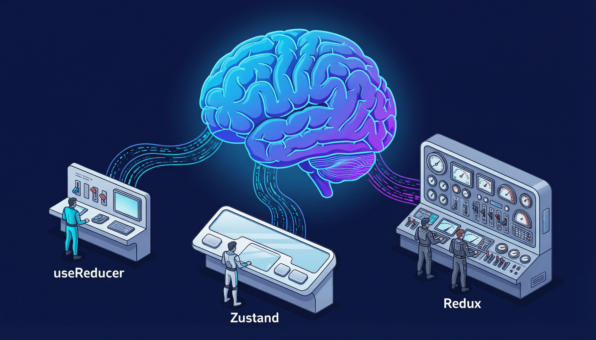

# 第16章：状态管理进阶 — 当 useState 不够用时



## 引言：你的状态是不是越来越乱了？

还记得我们刚开始学 `useState` 的时候吗？一个简单的计数器、一个输入框的值，`useState` 轻松搞定。但随着你的应用越来越复杂，你可能开始遇到这些头疼的问题：

- 一个组件里有 5、6 个 `useState`，它们之间还有复杂的关联关系
- 改一个状态，得同步更新另外 3 个状态，漏了一个就出 bug
- 多个组件需要共享同一份状态，props 传了十几层（prop drilling 噩梦）
- 状态更新逻辑散落在各个事件处理函数里，改起来像在大海里捞针

如果你正被这些问题困扰 — 别怕，这一章就是为你准备的！

我们将学习三种进阶的状态管理方案，从 React 内置的 `useReducer`，到轻量好用的 Zustand，再到业界老大哥 Redux Toolkit。

先来了解一下今天的三位主角：

- **useReducer** — 就像一个更聪明的管家，你告诉它"做什么动作"（action），它知道该怎么改状态（reducer）
- **Zustand** — 就像一个极简的共享白板，谁都能读写，而且不用走复杂流程
- **Redux** — 就像一个大型公司的管理制度，严谨但流程多

---

## 16.1 useReducer：复杂状态逻辑的救星

### 从 useState 到 useReducer 的演进

让我们从一个真实场景出发 — 构建一个购物车：

```jsx
// ❌ useState 版本 — 状态一多就开始混乱
function ShoppingCart() {
  const [items, setItems] = useState([]);
  const [isLoading, setIsLoading] = useState(false);
  const [error, setError] = useState(null);
  const [discount, setDiscount] = useState(0);

  // 添加商品 — 要同时管理多个状态
  const addItem = (product) => {
    setIsLoading(true);
    setError(null);
    // 模拟 API 调用
    setTimeout(() => {
      setItems(prev => {
        const existing = prev.find(i => i.id === product.id);
        if (existing) {
          return prev.map(i =>
            i.id === product.id ? { ...i, qty: i.qty + 1 } : i
          );
        }
        return [...prev, { ...product, qty: 1 }];
      });
      setIsLoading(false);
    }, 500);
  };

  // 删除商品
  const removeItem = (id) => {
    setItems(prev => prev.filter(i => i.id !== id));
  };

  // 修改数量
  const updateQty = (id, qty) => {
    if (qty <= 0) {
      removeItem(id);
      return;
    }
    setItems(prev => prev.map(i => i.id === id ? { ...i, qty } : i));
  };

  // 清空购物车
  const clearCart = () => {
    setItems([]);
    setDiscount(0);
    setError(null);
  };

  // 应用优惠券
  const applyCoupon = (code) => {
    if (code === 'SAVE20') {
      setDiscount(0.2);
    } else {
      setError('无效的优惠券代码');
    }
  };

  // ... 渲染部分省略
}
```

看到了吗？状态更新逻辑分散在各个函数里，每个函数都得记住要同步更新哪些状态。如果忘了设置 `setIsLoading(false)`，界面就一直显示加载中。这种代码写起来容易出错，改起来更痛苦。

**useReducer 的核心思想**：把所有状态更新逻辑集中到一个地方（reducer 函数），通过"动作"（action）来触发状态变化。

### useReducer 基本用法

```jsx
// ✅ useReducer 版本 — 清晰、集中、可预测

// 第一步：定义初始状态
const initialState = {
  items: [],
  isLoading: false,
  error: null,
  discount: 0,
};

// 第二步：定义 reducer 函数（状态更新的核心逻辑）
// reducer 接收当前状态和动作，返回新状态
function cartReducer(state, action) {
  switch (action.type) {
    case 'ADD_ITEM_START':
      return { ...state, isLoading: true, error: null };

    case 'ADD_ITEM_SUCCESS': {
      const { product } = action.payload;
      const existing = state.items.find(i => i.id === product.id);
      return {
        ...state,
        isLoading: false,
        items: existing
          ? state.items.map(i =>
              i.id === product.id ? { ...i, qty: i.qty + 1 } : i
            )
          : [...state.items, { ...product, qty: 1 }],
      };
    }

    case 'ADD_ITEM_ERROR':
      return { ...state, isLoading: false, error: action.payload };

    case 'REMOVE_ITEM':
      return {
        ...state,
        items: state.items.filter(i => i.id !== action.payload),
      };

    case 'UPDATE_QTY': {
      const { id, qty } = action.payload;
      if (qty <= 0) {
        return { ...state, items: state.items.filter(i => i.id !== id) };
      }
      return {
        ...state,
        items: state.items.map(i => (i.id === id ? { ...i, qty } : i)),
      };
    }

    case 'CLEAR_CART':
      return { ...initialState };

    case 'APPLY_COUPON':
      if (action.payload === 'SAVE20') {
        return { ...state, discount: 0.2, error: null };
      }
      return { ...state, error: '无效的优惠券代码' };

    default:
      return state; // 未知动作，返回当前状态
  }
}

// 第三步：在组件中使用
import { useReducer } from 'react';

function ShoppingCart() {
  const [state, dispatch] = useReducer(cartReducer, initialState);
  const { items, isLoading, error, discount } = state;

  // dispatch 发送"动作"，reducer 负责更新状态
  const addItem = (product) => {
    dispatch({ type: 'ADD_ITEM_START' });
    // 模拟 API 调用
    setTimeout(() => {
      dispatch({ type: 'ADD_ITEM_SUCCESS', payload: { product } });
    }, 500);
  };

  const removeItem = (id) => {
    dispatch({ type: 'REMOVE_ITEM', payload: id });
  };

  const updateQty = (id, qty) => {
    dispatch({ type: 'UPDATE_QTY', payload: { id, qty } });
  };

  const clearCart = () => {
    dispatch({ type: 'CLEAR_CART' });
  };

  const applyCoupon = (code) => {
    dispatch({ type: 'APPLY_COUPON', payload: code });
  };

  // 计算总价
  const total = items.reduce((sum, i) => sum + i.price * i.qty, 0);
  const finalTotal = total * (1 - discount);

  return (
    <div className="max-w-2xl mx-auto p-4">
      <h2 className="text-2xl font-bold mb-4">购物车</h2>

      {error && (
        <div className="bg-red-100 text-red-700 p-3 rounded mb-4">
          {error}
        </div>
      )}

      {isLoading && <div className="text-blue-500 mb-4">加载中...</div>}

      {items.length === 0 ? (
        <p className="text-gray-500">购物车是空的</p>
      ) : (
        <>
          <ul className="space-y-3">
            {items.map(item => (
              <li key={item.id} className="flex items-center gap-4 p-3 bg-gray-50 rounded">
                <span className="flex-1">{item.name}</span>
                <span>¥{item.price}</span>
                <input
                  type="number"
                  value={item.qty}
                  onChange={e => updateQty(item.id, Number(e.target.value))}
                  className="w-16 border rounded px-2 py-1"
                  min="0"
                />
                <button
                  onClick={() => removeItem(item.id)}
                  className="text-red-500 hover:text-red-700"
                >
                  删除
                </button>
              </li>
            ))}
          </ul>

          <div className="mt-4 p-4 bg-gray-100 rounded">
            <p>小计: ¥{total.toFixed(2)}</p>
            {discount > 0 && <p>折扣: -{(discount * 100).toFixed(0)}%</p>}
            <p className="text-xl font-bold">总计: ¥{finalTotal.toFixed(2)}</p>
          </div>

          <button
            onClick={clearCart}
            className="mt-4 bg-red-500 text-white px-4 py-2 rounded hover:bg-red-600"
          >
            清空购物车
          </button>
        </>
      )}
    </div>
  );
}
```

### useReducer 的好处

1. **状态逻辑集中**：所有更新逻辑都在 reducer 函数中，一目了然
2. **可预测**：相同的 state + action，永远产生相同的结果（纯函数）
3. **易测试**：reducer 是纯函数，不需要模拟 DOM 就能测试
4. **方便调试**：你可以轻松记录每次 action 和 state 变化

> 💡 **Tip**：什么时候从 `useState` 切换到 `useReducer`？当你发现：（1）一个组件有超过 3 个相互关联的 state；（2）状态更新逻辑复杂；（3）下一个 state 依赖前一个 state 的多个字段。

---

## 16.2 配合 useContext 实现"穷人版 Redux"

`useReducer` 解决了状态逻辑混乱的问题，但还没解决**状态共享**的问题。如果购物车的状态需要在 `Header`（显示购物车图标和数量）、`CartPage`（显示购物车详情）和 `CheckoutPage`（结算页面）之间共享呢？

答案是把 `useReducer` 和 `useContext` 组合起来！

```jsx
// store/CartContext.jsx
import { createContext, useContext, useReducer } from 'react';

// 初始状态
const initialState = {
  items: [],
  discount: 0,
};

// reducer
function cartReducer(state, action) {
  switch (action.type) {
    case 'ADD_ITEM': {
      const { product } = action.payload;
      const existing = state.items.find(i => i.id === product.id);
      return {
        ...state,
        items: existing
          ? state.items.map(i => i.id === product.id ? { ...i, qty: i.qty + 1 } : i)
          : [...state.items, { ...product, qty: 1 }],
      };
    }
    case 'REMOVE_ITEM':
      return { ...state, items: state.items.filter(i => i.id !== action.payload) };
    case 'CLEAR_CART':
      return { ...initialState };
    default:
      return state;
  }
}

// 创建两个 Context：一个给 state，一个给 dispatch
const CartStateContext = createContext(null);
const CartDispatchContext = createContext(null);

// Provider 组件
export function CartProvider({ children }) {
  const [state, dispatch] = useReducer(cartReducer, initialState);

  return (
    <CartStateContext.Provider value={state}>
      <CartDispatchContext.Provider value={dispatch}>
        {children}
      </CartDispatchContext.Provider>
    </CartStateContext.Provider>
  );
}

// 自定义 Hooks — 让消费者用起来更方便
export function useCart() {
  const context = useContext(CartStateContext);
  if (context === null) {
    throw new Error('useCart 必须在 CartProvider 内部使用');
  }
  return context;
}

export function useCartDispatch() {
  const context = useContext(CartDispatchContext);
  if (context === null) {
    throw new Error('useCartDispatch 必须在 CartProvider 内部使用');
  }
  return context;
}
```

```jsx
// App.jsx — 在顶层包裹 Provider
import { CartProvider } from './store/CartContext';

function App() {
  return (
    <CartProvider>
      <Header />
      <main>
        <ProductList />
        <CartPage />
      </main>
    </CartProvider>
  );
}
```

```jsx
// components/Header.jsx — 显示购物车数量
import { useCart } from '../store/CartContext';

function Header() {
  const { items } = useCart();
  const totalItems = items.reduce((sum, i) => sum + i.qty, 0);

  return (
    <header className="flex justify-between items-center p-4 bg-blue-600 text-white">
      <h1 className="text-xl font-bold">我的商城</h1>
      <div className="flex items-center gap-2">
        🛒 购物车
        {totalItems > 0 && (
          <span className="bg-red-500 rounded-full px-2 py-0.5 text-sm">
            {totalItems}
          </span>
        )}
      </div>
    </header>
  );
}
```

```jsx
// components/ProductList.jsx — 添加商品到购物车
import { useCartDispatch } from '../store/CartContext';

const products = [
  { id: 1, name: 'React 教程书', price: 59 },
  { id: 2, name: '机械键盘', price: 399 },
  { id: 3, name: '程序员咖啡杯', price: 49 },
];

function ProductList() {
  const dispatch = useCartDispatch();

  return (
    <div className="grid grid-cols-3 gap-4 p-4">
      {products.map(product => (
        <div key={product.id} className="border rounded p-4">
          <h3>{product.name}</h3>
          <p className="text-red-500 font-bold">¥{product.price}</p>
          <button
            onClick={() => dispatch({ type: 'ADD_ITEM', payload: { product } })}
            className="mt-2 bg-blue-500 text-white px-3 py-1 rounded hover:bg-blue-600"
          >
            加入购物车
          </button>
        </div>
      ))}
    </div>
  );
}
```

> 💡 **Tip**：把 state 和 dispatch 分成两个 Context 是个好习惯。这样当 dispatch 某个 action 时，只消费 dispatch 的组件不会重新渲染（dispatch 引用是稳定的）。

---

## 16.3 Zustand 入门：轻量级状态管理的王者

如果你觉得 Context + useReducer 的方案还是有点重（每次都要创建 Provider、写两个 Context、自定义 Hook……），那你一定会爱上 Zustand。

### 为什么选 Zustand？

- **极简**：不需要 Provider 包裹，直接创建 store 就能用
- **小巧**：gzip 后只有约 1KB（Redux 全家桶动辄 10KB+）
- **无 Boilerplate**：不需要 action、reducer 等一堆概念
- **灵活**：支持中间件、持久化、devtools 等高级功能
- **性能优秀**：内置选择器（selector），只在使用值变化时触发渲染

### 安装和基本用法

```bash
npm install zustand
```

```jsx
// store/useCartStore.js
import { create } from 'zustand';

// 就这么简单！一个 store 就创建好了
const useCartStore = create((set, get) => ({
  // 状态
  items: [],
  discount: 0,

  // 操作方法（直接在 store 上定义）
  addItem: (product) => {
    set((state) => {
      const existing = state.items.find(i => i.id === product.id);
      if (existing) {
        return {
          items: state.items.map(i =>
            i.id === product.id ? { ...i, qty: i.qty + 1 } : i
          ),
        };
      }
      return { items: [...state.items, { ...product, qty: 1 }] };
    });
  },

  removeItem: (id) => {
    set((state) => ({
      items: state.items.filter(i => i.id !== id),
    }));
  },

  updateQty: (id, qty) => {
    if (qty <= 0) {
      get().removeItem(id); // 用 get() 调用其他方法
      return;
    }
    set((state) => ({
      items: state.items.map(i => (i.id === id ? { ...i, qty } : i)),
    }));
  },

  clearCart: () => {
    set({ items: [], discount: 0 });
  },

  // 计算属性（getter）
  get totalPrice() {
    return get().items.reduce((sum, i) => sum + i.price * i.qty, 0);
  },

  get totalItems() {
    return get().items.reduce((sum, i) => sum + i.qty, 0);
  },
}));

export default useCartStore;
```

### 在组件中使用

```jsx
// components/CartBadge.jsx
import useCartStore from '../store/useCartStore';

function CartBadge() {
  // 使用选择器，只订阅 totalItems
  // 只有 totalItems 变化时，这个组件才会重新渲染！
  const totalItems = useCartStore((state) =>
    state.items.reduce((sum, i) => sum + i.qty, 0)
  );

  return (
    <span className="bg-red-500 text-white rounded-full px-2 py-0.5 text-sm">
      {totalItems}
    </span>
  );
}
```

```jsx
// components/CartPage.jsx
import useCartStore from '../store/useCartStore';

function CartPage() {
  // 选择需要的方法和状态
  const items = useCartStore((state) => state.items);
  const removeItem = useCartStore((state) => state.removeItem);
  const updateQty = useCartStore((state) => state.updateQty);
  const clearCart = useCartStore((state) => state.clearCart);

  const total = items.reduce((sum, i) => sum + i.price * i.qty, 0);

  return (
    <div className="max-w-2xl mx-auto p-4">
      <h2 className="text-2xl font-bold mb-4">购物车</h2>

      {items.length === 0 ? (
        <p className="text-gray-500">购物车是空的</p>
      ) : (
        <>
          <ul className="space-y-3">
            {items.map(item => (
              <li key={item.id} className="flex items-center gap-4 p-3 bg-gray-50 rounded">
                <span className="flex-1">{item.name}</span>
                <span>¥{item.price}</span>
                <input
                  type="number"
                  value={item.qty}
                  onChange={e => updateQty(item.id, Number(e.target.value))}
                  className="w-16 border rounded px-2 py-1"
                  min="0"
                />
                <button
                  onClick={() => removeItem(item.id)}
                  className="text-red-500 hover:text-red-700"
                >
                  删除
                </button>
              </li>
            ))}
          </ul>

          <div className="mt-4 p-4 bg-gray-100 rounded">
            <p className="text-xl font-bold">总计: ¥{total.toFixed(2)}</p>
          </div>

          <button
            onClick={clearCart}
            className="mt-4 bg-red-500 text-white px-4 py-2 rounded hover:bg-red-600"
          >
            清空购物车
          </button>
        </>
      )}
    </div>
  );
}
```

### Zustand 中间件

Zustand 支持中间件来扩展功能，最常用的是 **persist（持久化）** 和 **devtools**：

```jsx
// store/useSettingsStore.js
import { create } from 'zustand';
import { persist, devtools } from 'zustand/middleware';

const useSettingsStore = create(
  devtools(
    persist(
      (set) => ({
        // 状态
        theme: 'light',
        language: 'zh-CN',
        fontSize: 14,

        // 方法
        setTheme: (theme) => set({ theme }, false, 'theme/setTheme'),
        setLanguage: (language) => set({ language }, false, 'settings/setLanguage'),
        setFontSize: (fontSize) => set({ fontSize }, false, 'settings/setFontSize'),
        resetSettings: () => set({
          theme: 'light',
          language: 'zh-CN',
          fontSize: 14,
        }, false, 'settings/reset'),
      }),
      {
        name: 'app-settings', // localStorage 的 key
        // persist 会自动将状态保存到 localStorage
        // 页面刷新后自动恢复！
      }
    ),
    { name: 'SettingsStore' } // Redux DevTools 中显示的名字
  )
);

export default useSettingsStore;
```

> 💡 **Tip**：Zustand 的 `persist` 中间件简直是神器！它自动帮你把状态保存到 localStorage（也可以配置为 sessionStorage），页面刷新后自动恢复。想想以前要手动 `JSON.stringify` + `localStorage.setItem` 的日子……

---

## 16.4 Redux Toolkit 简介：业界老大哥

Redux 是 React 生态中最老牌的状态管理库。在 2018-2021 年间，几乎每个 React 项目都用 Redux。虽然近年来 Zustand 等轻量方案越来越流行，但 Redux 在大型项目中依然有一席之地。

### 为什么还要了解 Redux？

1. 大量老项目使用 Redux，你需要维护它们
2. Redux Toolkit 大幅简化了使用体验
3. Redux 的中间件生态（如 RTK Query）非常成熟

### 安装和基本用法

```bash
npm install @reduxjs/toolkit react-redux
```

```jsx
// store/cartSlice.js
import { createSlice } from '@reduxjs/toolkit';

// createSlice 一把搞定：初始状态、reducer、action 全部定义好
const cartSlice = createSlice({
  name: 'cart',
  initialState: {
    items: [],
    discount: 0,
  },
  reducers: {
    addItem: (state, action) => {
      const product = action.payload;
      const existing = state.items.find(i => i.id === product.id);
      if (existing) {
        existing.qty += 1; // Redux Toolkit 使用 Immer，可以直接"修改" state！
      } else {
        state.items.push({ ...product, qty: 1 });
      }
    },
    removeItem: (state, action) => {
      state.items = state.items.filter(i => i.id !== action.payload);
    },
    updateQty: (state, action) => {
      const { id, qty } = action.payload;
      const item = state.items.find(i => i.id === id);
      if (item) {
        if (qty <= 0) {
          state.items = state.items.filter(i => i.id !== id);
        } else {
          item.qty = qty;
        }
      }
    },
    clearCart: (state) => {
      state.items = [];
      state.discount = 0;
    },
  },
});

// 自动导出的 action creators
export const { addItem, removeItem, updateQty, clearCart } = cartSlice.actions;
export default cartSlice.reducer;
```

```jsx
// store/index.js
import { configureStore } from '@reduxjs/toolkit';
import cartReducer from './cartSlice';

const store = configureStore({
  reducer: {
    cart: cartReducer,
    // 可以轻松添加更多 slice
    // settings: settingsReducer,
    // user: userReducer,
  },
});

export default store;
```

```jsx
// main.jsx — 在顶层包裹 Provider
import { Provider } from 'react-redux';
import store from './store';

function Main() {
  return (
    <Provider store={store}>
      <App />
    </Provider>
  );
}
```

```jsx
// components/CartPage.jsx — 在组件中使用
import { useSelector, useDispatch } from 'react-redux';
import { addItem, removeItem, updateQty, clearCart } from '../store/cartSlice';

function CartPage() {
  // useSelector 选择需要的状态
  const items = useSelector((state) => state.cart.items);
  // useDispatch 获取 dispatch 方法
  const dispatch = useDispatch();

  return (
    <div className="max-w-2xl mx-auto p-4">
      <h2 className="text-2xl font-bold mb-4">购物车</h2>
      <ul className="space-y-3">
        {items.map(item => (
          <li key={item.id} className="flex items-center gap-4 p-3 bg-gray-50 rounded">
            <span className="flex-1">{item.name}</span>
            <span>¥{item.price} x {item.qty}</span>
            <button
              onClick={() => dispatch(removeItem(item.id))}
              className="text-red-500"
            >
              删除
            </button>
          </li>
        ))}
      </ul>
      <button
        onClick={() => dispatch(clearCart())}
        className="mt-4 bg-red-500 text-white px-4 py-2 rounded"
      >
        清空购物车
      </button>
    </div>
  );
}
```

### Redux vs Zustand：为什么很多人转向 Zustand？

| 方面 | Redux Toolkit | Zustand |
|------|--------------|---------|
| 学习曲线 | 中等（需理解 store/slice/action/reducer） | 低（就是创建一个对象） |
| 代码量 | 较多（需要 Provider、slice、configureStore） | 很少（create 一步到位） |
| Bundle Size | ~10KB+（含 react-redux） | ~1KB |
| DevTools | 原生 Redux DevTools 支持 | 通过中间件支持 |
| 中间件生态 | 非常丰富（thunk、saga、RTK Query） | 够用（persist、devtools、immer） |
| 适合场景 | 大型企业级应用、需要严格数据流 | 中小型应用、追求开发效率 |

---

## 16.5 三种方案的对比与选型建议

| 场景 | 推荐方案 | 理由 |
|------|---------|------|
| 组件内部的 2-3 个简单状态 | `useState` | 最简单，不需要杀鸡用牛刀 |
| 组件内部复杂的状态逻辑 | `useReducer` | 集中管理状态更新逻辑 |
| 跨组件共享状态（少量） | `useReducer + useContext` | React 内置，无需额外依赖 |
| 中型应用的全局状态 | **Zustand** | 简单、高效、学习成本低 |
| 大型企业级应用 | Redux Toolkit | 成熟的中间件生态、严格的数据流 |
| 需要服务端数据缓存 | RTK Query / TanStack Query | 专为服务端状态设计 |

### 决策流程图

```
你的状态只在单个组件内使用吗？
├── 是 → 状态逻辑简单吗？
│         ├── 是 → useState
│         └── 否 → useReducer
└── 否 → 需要共享状态的地方多吗？
          ├── 不多（2-3个组件）→ useReducer + useContext
          └── 很多 → 项目规模大吗？
                     ├── 中小型 → Zustand ✅（大多数情况选这个）
                     └── 大型企业级 → Redux Toolkit
```

> ⚠️ **Warning**：不要看到 Redux 有名就无脑用！很多项目根本不需要 Redux，用 Zustand 甚至 useReducer + useContext 就够了。选最合适的，不要选最"有名"的。

---

## 16.6 实战：用 Zustand 重构应用状态管理

让我们用一个实际的例子来体验 Zustand 的威力 — 构建一个简单的"笔记应用"，包含以下功能：

- 创建、编辑、删除笔记
- 搜索过滤
- 标签分类
- 暗色模式
- 数据持久化（刷新不丢失）

### 创建 Store

```jsx
// store/useNoteStore.js
import { create } from 'zustand';
import { persist } from 'zustand/middleware';

const useNoteStore = create(
  persist(
    (set, get) => ({
      // === 状态 ===
      notes: [],
      searchQuery: '',
      selectedTag: 'all',
      theme: 'light',
      editingNote: null, // 当前正在编辑的笔记

      // === 笔记操作 ===
      addNote: (title, content, tags = []) => {
        const newNote = {
          id: Date.now().toString(),
          title,
          content,
          tags,
          createdAt: new Date().toISOString(),
          updatedAt: new Date().toISOString(),
        };
        set((state) => ({ notes: [newNote, ...state.notes] }));
      },

      updateNote: (id, updates) => {
        set((state) => ({
          notes: state.notes.map(note =>
            note.id === id
              ? { ...note, ...updates, updatedAt: new Date().toISOString() }
              : note
          ),
        }));
      },

      deleteNote: (id) => {
        set((state) => ({
          notes: state.notes.filter(note => note.id !== id),
          editingNote: state.editingNote?.id === id ? null : state.editingNote,
        }));
      },

      // === UI 操作 ===
      setSearchQuery: (query) => set({ searchQuery: query }),
      setSelectedTag: (tag) => set({ selectedTag: tag }),
      toggleTheme: () => set((state) => ({
        theme: state.theme === 'light' ? 'dark' : 'light',
      })),
      setEditingNote: (note) => set({ editingNote: note }),

      // === 派生数据（计算属性）===
      getFilteredNotes: () => {
        const { notes, searchQuery, selectedTag } = get();
        let filtered = notes;

        // 按标签筛选
        if (selectedTag !== 'all') {
          filtered = filtered.filter(note => note.tags.includes(selectedTag));
        }

        // 按搜索词筛选
        if (searchQuery) {
          const query = searchQuery.toLowerCase();
          filtered = filtered.filter(note =>
            note.title.toLowerCase().includes(query) ||
            note.content.toLowerCase().includes(query)
          );
        }

        return filtered;
      },

      getAllTags: () => {
        const { notes } = get();
        const tagSet = new Set();
        notes.forEach(note => note.tags.forEach(tag => tagSet.add(tag)));
        return ['all', ...Array.from(tagSet)];
      },
    }),
    {
      name: 'notes-app-storage', // localStorage key
      partialize: (state) => ({
        // 只持久化这些数据，UI 状态（searchQuery 等）不持久化
        notes: state.notes,
        theme: state.theme,
      }),
    }
  )
);

export default useNoteStore;
```

### 应用组件

```jsx
// App.jsx
import useNoteStore from './store/useNoteStore';
import NoteEditor from './components/NoteEditor';
import NoteList from './components/NoteList';
import SearchBar from './components/SearchBar';
import TagFilter from './components/TagFilter';
import ThemeToggle from './components/ThemeToggle';

function App() {
  const theme = useNoteStore((state) => state.theme);

  return (
    <div className={`min-h-screen ${theme === 'dark' ? 'bg-gray-900 text-white' : 'bg-gray-50 text-gray-900'}`}>
      <header className="flex justify-between items-center p-4 border-b">
        <h1 className="text-2xl font-bold">📝 我的笔记</h1>
        <ThemeToggle />
      </header>

      <div className="max-w-4xl mx-auto p-4">
        <div className="flex gap-4 mb-4">
          <SearchBar />
          <NoteEditor />
        </div>
        <TagFilter />
        <NoteList />
      </div>
    </div>
  );
}

export default App;
```

```jsx
// components/NoteList.jsx
import useNoteStore from '../store/useNoteStore';

function NoteList() {
  const notes = useNoteStore((state) => state.getFilteredNotes());
  const deleteNote = useNoteStore((state) => state.deleteNote);
  const setEditingNote = useNoteStore((state) => state.setEditingNote);

  if (notes.length === 0) {
    return <p className="text-gray-500 text-center mt-8">没有笔记</p>;
  }

  return (
    <div className="grid grid-cols-1 md:grid-cols-2 gap-4 mt-4">
      {notes.map(note => (
        <div
          key={note.id}
          className="border rounded-lg p-4 shadow-sm hover:shadow-md transition-shadow"
        >
          <h3 className="font-bold text-lg mb-2">{note.title}</h3>
          <p className="text-gray-600 text-sm mb-3 line-clamp-3">{note.content}</p>

          <div className="flex flex-wrap gap-1 mb-3">
            {note.tags.map(tag => (
              <span key={tag} className="bg-blue-100 text-blue-700 px-2 py-0.5 rounded text-xs">
                {tag}
              </span>
            ))}
          </div>

          <div className="flex justify-between items-center text-sm text-gray-400">
            <span>{new Date(note.updatedAt).toLocaleDateString()}</span>
            <div className="flex gap-2">
              <button
                onClick={() => setEditingNote(note)}
                className="text-blue-500 hover:underline"
              >
                编辑
              </button>
              <button
                onClick={() => deleteNote(note.id)}
                className="text-red-500 hover:underline"
              >
                删除
              </button>
            </div>
          </div>
        </div>
      ))}
    </div>
  );
}

export default NoteList;
```

---

## 本章小结

这一章我们学习了三种进阶的状态管理方案：

1. **useReducer** — React 内置，适合组件内部的复杂状态逻辑。配合 useContext 可以实现跨组件状态共享。
2. **Zustand** — 极简的外部状态管理库，大多数中小型项目的最佳选择。
3. **Redux Toolkit** — 业界老大哥，适合需要严格数据流和丰富中间件的大型项目。

**选型原则**：从简单到复杂，够用就好。不要为了"未来可能需要"而提前引入复杂度。

---

## 小练习

### 练习 1：useReducer 实战

用 `useReducer` 实现一个"待办事项"组件，支持：添加、删除、标记完成、全部标记完成。

### 练习 2：Zustand 升级

把练习 1 的待办事项用 Zustand 重构，添加 `persist` 中间件实现数据持久化。

### 练习 3：思考题

下面这个场景，你会选择哪种状态管理方案？为什么？

> 一个团队协作工具，有 20+ 个页面，需要管理用户认证、项目列表、任务详情、实时通知等状态。团队有 10 个前端开发者。

<details>

<summary>点击查看答案</summary>

推荐 **Zustand**（或 Redux Toolkit）。理由是：

- 20+ 个页面意味着大量的全局状态共享
- 用户认证、实时通知等需要跨多个组件/页面共享
- 10 个开发者需要清晰的代码组织方式
- Zustand 的 store 按功能拆分（authStore、projectStore、notificationStore）就够用了
- 如果团队对 Redux 更熟悉，Redux Toolkit 也是好选择

</details>

---

> 🎉 **你已经掌握了 React 状态管理的进阶知识！** 下一章，我们将进入本书的高潮 — 从零构建一个完整的 React 应用！系好安全带，准备出发！

---
