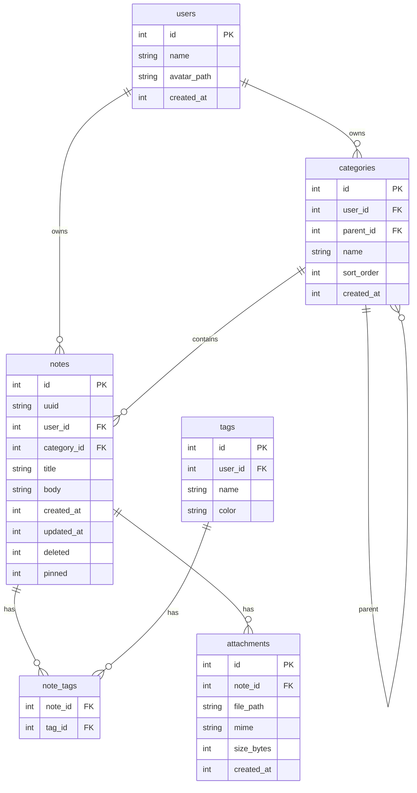

# 第 22 章：实战——Flutter 笔记应用完整项目

## 22.1 引言：把所有知识串起来

前面 21 章，我们从 SQL 基础讲到 B-Tree 原理，从 FTS5 全文搜索讲到 Turso 云同步。现在到了收官时刻——**造一个完整的应用**。

我们要做的项目叫 **"NoteQ"**（谐音 Note Cue，笔记提词器），一个本地优先的笔记应用。功能：

- 用户管理（本地 Profile）
- 笔记 CRUD（Markdown 编辑）
- 多级分类（用递归 CTE 查树）
- 标签系统（多对多）
- 全文搜索（FTS5）
- 附件（图片/文件，路径存储）
- 回收站（软删除 + 恢复）
- 导入导出（JSON 备份）
- 云同步（可选，接 Turso）

技术栈：**Flutter 3.x + drift 2.x + Riverpod 2.x**。

这一章会长，坐稳了。

---

## 22.2 需求梳理

### 22.2.1 用户故事

作为一个笔记应用用户，我希望：

1. 打开应用立刻能写笔记（无需登录，本地存储）
2. 给笔记打标签、放分类
3. 全文搜索，快速找到过去的内容
4. 附加图片
5. 删了能后悔（回收站）
6. 备份/恢复我的数据
7. 多设备同步（可选）

### 22.2.2 非功能需求

- 冷启动 < 2 秒
- 列表滚动 60 FPS
- 支持 10 万条笔记不卡
- 数据加密（本地文件）
- 兼容 iOS/Android/macOS/Windows

---

## 22.3 数据库设计

### 22.3.1 ER 图（Mermaid）



### 22.3.2 Schema DDL

```sql
CREATE TABLE users(
  id INTEGER PRIMARY KEY AUTOINCREMENT,
  name TEXT NOT NULL,
  avatar_path TEXT,
  created_at INTEGER NOT NULL
);

CREATE TABLE categories(
  id INTEGER PRIMARY KEY AUTOINCREMENT,
  user_id INTEGER NOT NULL REFERENCES users(id) ON DELETE CASCADE,
  parent_id INTEGER REFERENCES categories(id) ON DELETE CASCADE,
  name TEXT NOT NULL,
  sort_order INTEGER NOT NULL DEFAULT 0,
  created_at INTEGER NOT NULL
);
CREATE INDEX idx_categories_parent ON categories(parent_id);
CREATE INDEX idx_categories_user ON categories(user_id);

CREATE TABLE notes(
  id INTEGER PRIMARY KEY AUTOINCREMENT,
  uuid TEXT NOT NULL UNIQUE,     -- 云同步用
  user_id INTEGER NOT NULL REFERENCES users(id) ON DELETE CASCADE,
  category_id INTEGER REFERENCES categories(id) ON DELETE SET NULL,
  title TEXT NOT NULL,
  body TEXT NOT NULL DEFAULT '',
  created_at INTEGER NOT NULL,
  updated_at INTEGER NOT NULL,
  deleted INTEGER NOT NULL DEFAULT 0,
  pinned INTEGER NOT NULL DEFAULT 0
);
-- 关键索引：活跃笔记按更新时间倒序（列表页最常用）
CREATE INDEX idx_notes_active_updated ON notes(updated_at DESC) WHERE deleted = 0;
CREATE INDEX idx_notes_category ON notes(category_id) WHERE deleted = 0;
CREATE INDEX idx_notes_pinned ON notes(pinned, updated_at DESC) WHERE deleted = 0;
CREATE INDEX idx_notes_deleted ON notes(updated_at) WHERE deleted = 1;  -- 回收站

CREATE TABLE tags(
  id INTEGER PRIMARY KEY AUTOINCREMENT,
  user_id INTEGER NOT NULL REFERENCES users(id) ON DELETE CASCADE,
  name TEXT NOT NULL,
  color TEXT NOT NULL DEFAULT '#888',
  UNIQUE(user_id, name)
);

CREATE TABLE note_tags(
  note_id INTEGER NOT NULL REFERENCES notes(id) ON DELETE CASCADE,
  tag_id INTEGER NOT NULL REFERENCES tags(id) ON DELETE CASCADE,
  PRIMARY KEY (note_id, tag_id)
);
CREATE INDEX idx_note_tags_tag ON note_tags(tag_id);

CREATE TABLE attachments(
  id INTEGER PRIMARY KEY AUTOINCREMENT,
  note_id INTEGER NOT NULL REFERENCES notes(id) ON DELETE CASCADE,
  file_path TEXT NOT NULL,
  mime TEXT NOT NULL,
  size_bytes INTEGER NOT NULL,
  created_at INTEGER NOT NULL
);
CREATE INDEX idx_attachments_note ON attachments(note_id);

-- FTS5 虚拟表：标题+正文
CREATE VIRTUAL TABLE notes_fts USING fts5(
  title, body,
  content='notes', content_rowid='id',
  tokenize='unicode61 remove_diacritics 2'
);

-- 触发器：保持 FTS 与 notes 同步
CREATE TRIGGER notes_ai AFTER INSERT ON notes BEGIN
  INSERT INTO notes_fts(rowid, title, body) VALUES (new.id, new.title, new.body);
END;
CREATE TRIGGER notes_ad AFTER DELETE ON notes BEGIN
  INSERT INTO notes_fts(notes_fts, rowid, title, body) VALUES('delete', old.id, old.title, old.body);
END;
CREATE TRIGGER notes_au AFTER UPDATE ON notes BEGIN
  INSERT INTO notes_fts(notes_fts, rowid, title, body) VALUES('delete', old.id, old.title, old.body);
  INSERT INTO notes_fts(rowid, title, body) VALUES (new.id, new.title, new.body);
END;
```

设计要点：

- 所有表都有 `user_id`，方便未来多用户
- `notes.uuid` 为云同步准备
- 用 **部分索引** 加速活跃笔记查询、回收站查询
- FTS5 用触发器同步，不用手动维护
- 附件存路径，不存 BLOB

---

## 22.4 项目结构

推荐的目录树（feature-first 分层）：

```
lib/
├── main.dart
├── app.dart                       # MaterialApp + Router
│
├── core/
│   ├── theme.dart                 # 主题
│   ├── constants.dart
│   └── utils/
│       ├── date.dart
│       ├── uuid.dart
│       └── file.dart
│
├── data/
│   ├── db/
│   │   ├── database.dart          # drift Database 主类
│   │   ├── tables/                # Table 定义
│   │   │   ├── users.dart
│   │   │   ├── notes.dart
│   │   │   ├── categories.dart
│   │   │   ├── tags.dart
│   │   │   ├── note_tags.dart
│   │   │   └── attachments.dart
│   │   ├── migrations.dart        # 版本迁移
│   │   └── database.g.dart        # drift 生成的代码
│   └── repositories/
│       ├── notes_repository.dart
│       ├── categories_repository.dart
│       ├── tags_repository.dart
│       └── search_repository.dart
│
├── domain/
│   └── models/
│       ├── note.dart
│       ├── category.dart
│       └── tag.dart
│
├── features/
│   ├── notes/
│   │   ├── notes_list_screen.dart
│   │   ├── note_editor_screen.dart
│   │   ├── widgets/
│   │   │   ├── note_card.dart
│   │   │   └── tag_chip.dart
│   │   └── providers.dart         # Riverpod providers
│   ├── categories/
│   │   ├── category_tree_screen.dart
│   │   └── providers.dart
│   ├── search/
│   │   ├── search_screen.dart
│   │   └── providers.dart
│   ├── trash/
│   │   └── trash_screen.dart
│   └── settings/
│       ├── settings_screen.dart
│       ├── backup_screen.dart
│       └── sync_screen.dart
│
└── sync/
    └── turso_client.dart          # 可选云同步
```

---

## 22.5 依赖配置

```yaml
# pubspec.yaml
name: noteq
description: A local-first notes app with SQLite
version: 1.0.0

environment:
  sdk: '>=3.0.0 <4.0.0'
  flutter: '>=3.16.0'

dependencies:
  flutter:
    sdk: flutter

  # 数据库
  drift: ^2.14.0
  sqlite3_flutter_libs: ^0.5.0
  path_provider: ^2.1.0
  path: ^1.8.0

  # 状态管理
  flutter_riverpod: ^2.4.0
  riverpod_annotation: ^2.3.0

  # UI
  flutter_markdown: ^0.6.0
  intl: ^0.19.0
  file_picker: ^6.0.0

  # 工具
  uuid: ^4.0.0
  crypto: ^3.0.0
  flutter_secure_storage: ^9.0.0

  # 可选云同步
  # libsql_dart: ^0.4.0

dev_dependencies:
  flutter_test:
    sdk: flutter
  build_runner: ^2.4.0
  drift_dev: ^2.14.0
  riverpod_generator: ^2.3.0
  custom_lint: ^0.5.0
  riverpod_lint: ^2.3.0
```

---

## 22.6 数据库层：drift 实现

### 22.6.1 Table 定义

**`lib/data/db/tables/users.dart`**：

```dart
import 'package:drift/drift.dart';

class Users extends Table {
  IntColumn get id => integer().autoIncrement()();
  TextColumn get name => text().withLength(min: 1, max: 100)();
  TextColumn get avatarPath => text().nullable()();
  IntColumn get createdAt => integer()();
}
```

**`lib/data/db/tables/categories.dart`**：

```dart
import 'package:drift/drift.dart';
import 'users.dart';

class Categories extends Table {
  IntColumn get id => integer().autoIncrement()();
  IntColumn get userId => integer().references(Users, #id, onDelete: KeyAction.cascade)();
  IntColumn get parentId => integer().nullable().references(Categories, #id, onDelete: KeyAction.cascade)();
  TextColumn get name => text().withLength(min: 1, max: 100)();
  IntColumn get sortOrder => integer().withDefault(const Constant(0))();
  IntColumn get createdAt => integer()();
}
```

**`lib/data/db/tables/notes.dart`**：

```dart
import 'package:drift/drift.dart';
import 'users.dart';
import 'categories.dart';

class Notes extends Table {
  IntColumn get id => integer().autoIncrement()();
  TextColumn get uuid => text().unique()();
  IntColumn get userId => integer().references(Users, #id, onDelete: KeyAction.cascade)();
  IntColumn get categoryId => integer().nullable().references(Categories, #id, onDelete: KeyAction.setNull)();
  TextColumn get title => text().withLength(min: 0, max: 200)();
  TextColumn get body => text().withDefault(const Constant(''))();
  IntColumn get createdAt => integer()();
  IntColumn get updatedAt => integer()();
  BoolColumn get deleted => boolean().withDefault(const Constant(false))();
  BoolColumn get pinned => boolean().withDefault(const Constant(false))();
}
```

**`lib/data/db/tables/tags.dart`**：

```dart
import 'package:drift/drift.dart';
import 'users.dart';

class Tags extends Table {
  IntColumn get id => integer().autoIncrement()();
  IntColumn get userId => integer().references(Users, #id, onDelete: KeyAction.cascade)();
  TextColumn get name => text().withLength(min: 1, max: 50)();
  TextColumn get color => text().withDefault(const Constant('#888'))();

  @override
  List<Set<Column>> get uniqueKeys => [
    {userId, name}
  ];
}
```

**`lib/data/db/tables/note_tags.dart`**：

```dart
import 'package:drift/drift.dart';
import 'notes.dart';
import 'tags.dart';

class NoteTags extends Table {
  IntColumn get noteId => integer().references(Notes, #id, onDelete: KeyAction.cascade)();
  IntColumn get tagId => integer().references(Tags, #id, onDelete: KeyAction.cascade)();

  @override
  Set<Column> get primaryKey => {noteId, tagId};
}
```

**`lib/data/db/tables/attachments.dart`**：

```dart
import 'package:drift/drift.dart';
import 'notes.dart';

class Attachments extends Table {
  IntColumn get id => integer().autoIncrement()();
  IntColumn get noteId => integer().references(Notes, #id, onDelete: KeyAction.cascade)();
  TextColumn get filePath => text()();
  TextColumn get mime => text()();
  IntColumn get sizeBytes => integer()();
  IntColumn get createdAt => integer()();
}
```

### 22.6.2 Database 主类

**`lib/data/db/database.dart`**：

```dart
import 'dart:io';
import 'package:drift/drift.dart';
import 'package:drift/native.dart';
import 'package:path/path.dart' as p;
import 'package:path_provider/path_provider.dart';

import 'tables/users.dart';
import 'tables/categories.dart';
import 'tables/notes.dart';
import 'tables/tags.dart';
import 'tables/note_tags.dart';
import 'tables/attachments.dart';
import 'migrations.dart';

part 'database.g.dart';

@DriftDatabase(tables: [
  Users, Categories, Notes, Tags, NoteTags, Attachments,
])
class AppDatabase extends _$AppDatabase {
  AppDatabase() : super(_openConnection());

  @override
  int get schemaVersion => 3;

  @override
  MigrationStrategy get migration => MigrationStrategy(
        onCreate: (m) async {
          await m.createAll();

          // FTS5 虚拟表
          await customStatement('''
            CREATE VIRTUAL TABLE notes_fts USING fts5(
              title, body,
              content='notes', content_rowid='id',
              tokenize='unicode61 remove_diacritics 2'
            )
          ''');

          // 触发器
          await customStatement('''
            CREATE TRIGGER notes_ai AFTER INSERT ON notes BEGIN
              INSERT INTO notes_fts(rowid, title, body) VALUES (new.id, new.title, new.body);
            END
          ''');
          await customStatement('''
            CREATE TRIGGER notes_ad AFTER DELETE ON notes BEGIN
              INSERT INTO notes_fts(notes_fts, rowid, title, body) VALUES('delete', old.id, old.title, old.body);
            END
          ''');
          await customStatement('''
            CREATE TRIGGER notes_au AFTER UPDATE ON notes BEGIN
              INSERT INTO notes_fts(notes_fts, rowid, title, body) VALUES('delete', old.id, old.title, old.body);
              INSERT INTO notes_fts(rowid, title, body) VALUES (new.id, new.title, new.body);
            END
          ''');

          // 部分索引
          await customStatement('CREATE INDEX idx_notes_active_updated ON notes(updated_at DESC) WHERE deleted = 0');
          await customStatement('CREATE INDEX idx_notes_category ON notes(category_id) WHERE deleted = 0');
          await customStatement('CREATE INDEX idx_notes_pinned ON notes(pinned, updated_at DESC) WHERE deleted = 0');
          await customStatement('CREATE INDEX idx_notes_deleted ON notes(updated_at) WHERE deleted = 1');
          await customStatement('CREATE INDEX idx_categories_parent ON categories(parent_id)');
          await customStatement('CREATE INDEX idx_note_tags_tag ON note_tags(tag_id)');
        },
        onUpgrade: stepByStep(
          from1To2: (m, schema) async {
            // v2: 加了 pinned 字段
            await m.addColumn(notes, notes.pinned);
            await customStatement('CREATE INDEX idx_notes_pinned ON notes(pinned, updated_at DESC) WHERE deleted = 0');
          },
          from2To3: (m, schema) async {
            // v3: 加了附件表
            await m.createTable(attachments);
            await customStatement('CREATE INDEX idx_attachments_note ON attachments(note_id)');
          },
        ),
        beforeOpen: (details) async {
          // PRAGMA 设置：每次打开都要执行（大部分是 per-connection）
          await customStatement('PRAGMA foreign_keys = ON');
          await customStatement('PRAGMA journal_mode = WAL');
          await customStatement('PRAGMA synchronous = NORMAL');
          await customStatement('PRAGMA cache_size = -8000');
          await customStatement('PRAGMA temp_store = MEMORY');
          await customStatement('PRAGMA busy_timeout = 5000');
          await customStatement('PRAGMA mmap_size = 134217728');
        },
      );
}

LazyDatabase _openConnection() {
  return LazyDatabase(() async {
    final dbFolder = await getApplicationDocumentsDirectory();
    final file = File(p.join(dbFolder.path, 'noteq.db'));
    return NativeDatabase.createInBackground(file);
  });
}
```

### 22.6.3 迁移辅助：stepByStep

drift 2.11+ 提供了 `stepByStep` 迁移助手：

**`lib/data/db/migrations.dart`**：

```dart
import 'package:drift/drift.dart';
// 由 drift 自动生成，包含 Schema1、Schema2、Schema3 类
// 需要跑 `dart run drift_dev schema dump lib/data/db/database.dart drift_schemas`
// 然后 `dart run drift_dev schema steps drift_schemas lib/data/db/schema_versions.dart`
```

（这一段视你的项目版本演进而定。demo 阶段可以直接把迁移逻辑写在 database.dart 的 onUpgrade 里。）

### 22.6.4 生成代码

跑一次代码生成：

```bash
dart run build_runner build --delete-conflicting-outputs
```

会生成 `database.g.dart`，包含 `_$AppDatabase`、`Note`、`NotesCompanion` 等类。

---

## 22.7 Repository 层

Repository 层封装所有 SQL 查询，供上层业务逻辑调用。

### 22.7.1 NotesRepository

**`lib/data/repositories/notes_repository.dart`**：

```dart
import 'package:drift/drift.dart';
import 'package:uuid/uuid.dart';
import '../db/database.dart';

class NotesRepository {
  final AppDatabase db;
  NotesRepository(this.db);

  /// 列出活跃笔记（未删除）
  Stream<List<Note>> watchActiveNotes({int? categoryId, int limit = 100}) {
    final query = db.select(db.notes)
      ..where((t) => t.deleted.equals(false));
    if (categoryId != null) {
      query.where((t) => t.categoryId.equals(categoryId));
    }
    query
      ..orderBy([
        (t) => OrderingTerm(expression: t.pinned, mode: OrderingMode.desc),
        (t) => OrderingTerm(expression: t.updatedAt, mode: OrderingMode.desc),
      ])
      ..limit(limit);
    return query.watch();
  }

  /// 获取回收站中的笔记
  Stream<List<Note>> watchTrashedNotes() {
    return (db.select(db.notes)
          ..where((t) => t.deleted.equals(true))
          ..orderBy([(t) => OrderingTerm.desc(t.updatedAt)]))
        .watch();
  }

  Future<Note?> findById(int id) {
    return (db.select(db.notes)..where((t) => t.id.equals(id))).getSingleOrNull();
  }

  Future<int> createNote({
    required int userId,
    int? categoryId,
    required String title,
    String body = '',
  }) async {
    final now = DateTime.now().millisecondsSinceEpoch;
    return db.into(db.notes).insert(NotesCompanion.insert(
      uuid: const Uuid().v4(),
      userId: userId,
      categoryId: Value(categoryId),
      title: title,
      body: Value(body),
      createdAt: now,
      updatedAt: now,
    ));
  }

  Future<void> updateNote({
    required int id,
    String? title,
    String? body,
    int? categoryId,
    bool? pinned,
  }) async {
    final now = DateTime.now().millisecondsSinceEpoch;
    await (db.update(db.notes)..where((t) => t.id.equals(id))).write(
      NotesCompanion(
        title: title == null ? const Value.absent() : Value(title),
        body: body == null ? const Value.absent() : Value(body),
        categoryId: categoryId == null ? const Value.absent() : Value(categoryId),
        pinned: pinned == null ? const Value.absent() : Value(pinned),
        updatedAt: Value(now),
      ),
    );
  }

  /// 软删除
  Future<void> moveToTrash(int id) async {
    final now = DateTime.now().millisecondsSinceEpoch;
    await (db.update(db.notes)..where((t) => t.id.equals(id))).write(
      NotesCompanion(deleted: const Value(true), updatedAt: Value(now)),
    );
  }

  Future<void> restore(int id) async {
    final now = DateTime.now().millisecondsSinceEpoch;
    await (db.update(db.notes)..where((t) => t.id.equals(id))).write(
      NotesCompanion(deleted: const Value(false), updatedAt: Value(now)),
    );
  }

  /// 彻底删除
  Future<void> deleteForever(int id) async {
    await (db.delete(db.notes)..where((t) => t.id.equals(id))).go();
  }

  /// 清空回收站
  Future<int> emptyTrash() async {
    return (db.delete(db.notes)..where((t) => t.deleted.equals(true))).go();
  }

  /// 批量设置标签（覆盖）
  Future<void> setTags(int noteId, List<int> tagIds) async {
    await db.transaction(() async {
      await (db.delete(db.noteTags)..where((t) => t.noteId.equals(noteId))).go();
      if (tagIds.isNotEmpty) {
        await db.batch((b) {
          for (final tagId in tagIds) {
            b.insert(db.noteTags, NoteTagsCompanion.insert(
              noteId: noteId,
              tagId: tagId,
            ));
          }
        });
      }
    });
  }

  /// 列出某条笔记的所有标签
  Future<List<Tag>> tagsForNote(int noteId) async {
    final query = db.select(db.tags).join([
      innerJoin(db.noteTags, db.noteTags.tagId.equalsExp(db.tags.id))
    ])
      ..where(db.noteTags.noteId.equals(noteId));
    return (await query.get()).map((row) => row.readTable(db.tags)).toList();
  }
}
```

### 22.7.2 CategoriesRepository：递归 CTE 显威力

**`lib/data/repositories/categories_repository.dart`**：

```dart
import 'package:drift/drift.dart';
import '../db/database.dart';

class CategoryNode {
  final Category category;
  final int depth;
  final List<CategoryNode> children;
  final int noteCount;

  CategoryNode({
    required this.category,
    required this.depth,
    List<CategoryNode>? children,
    this.noteCount = 0,
  }) : children = children ?? [];
}

class CategoriesRepository {
  final AppDatabase db;
  CategoriesRepository(this.db);

  /// 用递归 CTE 一次查询整棵分类树 + 每节点笔记数
  Future<List<CategoryNode>> loadTree(int userId) async {
    final rows = await db.customSelect(
      '''
      WITH RECURSIVE tree AS (
        SELECT c.*, 0 AS depth
        FROM categories c
        WHERE c.user_id = :uid AND c.parent_id IS NULL
        UNION ALL
        SELECT c.*, t.depth + 1
        FROM categories c
        JOIN tree t ON c.parent_id = t.id
        WHERE c.user_id = :uid
      )
      SELECT tree.*,
             (SELECT COUNT(*) FROM notes n
              WHERE n.category_id = tree.id AND n.deleted = 0) AS note_count
      FROM tree
      ORDER BY depth, sort_order, name
      ''',
      variables: [Variable.withInt(userId)],
      readsFrom: {db.categories, db.notes},
    ).get();

    // 把扁平结果重建成树
    final nodesById = <int, CategoryNode>{};
    final roots = <CategoryNode>[];

    for (final row in rows) {
      final cat = Category(
        id: row.read<int>('id'),
        userId: row.read<int>('user_id'),
        parentId: row.readNullable<int>('parent_id'),
        name: row.read<String>('name'),
        sortOrder: row.read<int>('sort_order'),
        createdAt: row.read<int>('created_at'),
      );
      final node = CategoryNode(
        category: cat,
        depth: row.read<int>('depth'),
        noteCount: row.read<int>('note_count'),
      );
      nodesById[cat.id] = node;
      if (cat.parentId == null) {
        roots.add(node);
      } else {
        nodesById[cat.parentId!]?.children.add(node);
      }
    }

    return roots;
  }

  Future<int> create({
    required int userId,
    int? parentId,
    required String name,
  }) {
    return db.into(db.categories).insert(CategoriesCompanion.insert(
      userId: userId,
      parentId: Value(parentId),
      name: name,
      createdAt: DateTime.now().millisecondsSinceEpoch,
    ));
  }

  Future<void> rename(int id, String name) async {
    await (db.update(db.categories)..where((t) => t.id.equals(id))).write(
      CategoriesCompanion(name: Value(name)),
    );
  }

  Future<void> delete(int id) async {
    // ON DELETE CASCADE 会级联删子分类，笔记的 category_id 会 SET NULL
    await (db.delete(db.categories)..where((t) => t.id.equals(id))).go();
  }
}
```

### 22.7.3 SearchRepository：FTS5 实战

**`lib/data/repositories/search_repository.dart`**：

```dart
import 'package:drift/drift.dart';
import '../db/database.dart';

class SearchResult {
  final Note note;
  final String snippet;
  SearchResult(this.note, this.snippet);
}

class SearchRepository {
  final AppDatabase db;
  SearchRepository(this.db);

  Future<List<SearchResult>> search(String query, {int limit = 50}) async {
    if (query.trim().isEmpty) return [];
    // FTS5 语法：加通配符做前缀匹配
    final ftsQuery = query.split(RegExp(r'\s+')).map((w) => '$w*').join(' ');

    final rows = await db.customSelect(
      '''
      SELECT n.*, snippet(notes_fts, 1, '<b>', '</b>', '...', 32) AS snip
      FROM notes n
      JOIN notes_fts ON notes_fts.rowid = n.id
      WHERE notes_fts MATCH :q
        AND n.deleted = 0
      ORDER BY rank
      LIMIT :lim
      ''',
      variables: [Variable.withString(ftsQuery), Variable.withInt(limit)],
      readsFrom: {db.notes},
    ).get();

    return rows.map((row) {
      final note = Note(
        id: row.read<int>('id'),
        uuid: row.read<String>('uuid'),
        userId: row.read<int>('user_id'),
        categoryId: row.readNullable<int>('category_id'),
        title: row.read<String>('title'),
        body: row.read<String>('body'),
        createdAt: row.read<int>('created_at'),
        updatedAt: row.read<int>('updated_at'),
        deleted: row.read<bool>('deleted'),
        pinned: row.read<bool>('pinned'),
      );
      return SearchResult(note, row.read<String>('snip'));
    }).toList();
  }
}
```

### 22.7.4 TagsRepository

**`lib/data/repositories/tags_repository.dart`**：

```dart
import 'package:drift/drift.dart';
import '../db/database.dart';

class TagsRepository {
  final AppDatabase db;
  TagsRepository(this.db);

  Stream<List<Tag>> watchAll(int userId) {
    return (db.select(db.tags)
          ..where((t) => t.userId.equals(userId))
          ..orderBy([(t) => OrderingTerm.asc(t.name)]))
        .watch();
  }

  Future<int> upsert(int userId, String name, {String color = '#888'}) async {
    // 先查再插，保证 UNIQUE
    final existing = await (db.select(db.tags)
          ..where((t) => t.userId.equals(userId) & t.name.equals(name)))
        .getSingleOrNull();
    if (existing != null) return existing.id;
    return db.into(db.tags).insert(TagsCompanion.insert(
      userId: userId,
      name: name,
      color: Value(color),
    ));
  }

  Future<void> delete(int id) async {
    await (db.delete(db.tags)..where((t) => t.id.equals(id))).go();
  }
}
```

---

## 22.8 Riverpod 状态层

### 22.8.1 Provider 定义

**`lib/features/notes/providers.dart`**：

```dart
import 'package:flutter_riverpod/flutter_riverpod.dart';
import 'package:riverpod_annotation/riverpod_annotation.dart';
import '../../data/db/database.dart';
import '../../data/repositories/notes_repository.dart';

part 'providers.g.dart';

@Riverpod(keepAlive: true)
AppDatabase appDatabase(AppDatabaseRef ref) {
  final db = AppDatabase();
  ref.onDispose(() => db.close());
  return db;
}

@Riverpod(keepAlive: true)
NotesRepository notesRepository(NotesRepositoryRef ref) {
  return NotesRepository(ref.watch(appDatabaseProvider));
}

/// 当前选中的分类 ID（null 表示全部）
@riverpod
class SelectedCategory extends _$SelectedCategory {
  @override
  int? build() => null;

  void set(int? id) => state = id;
}

/// 活跃笔记列表（响应式）
@riverpod
Stream<List<Note>> activeNotes(ActiveNotesRef ref) {
  final categoryId = ref.watch(selectedCategoryProvider);
  return ref.watch(notesRepositoryProvider).watchActiveNotes(categoryId: categoryId);
}

/// 回收站笔记
@riverpod
Stream<List<Note>> trashedNotes(TrashedNotesRef ref) {
  return ref.watch(notesRepositoryProvider).watchTrashedNotes();
}
```

跑 `build_runner`：

```bash
dart run build_runner build --delete-conflicting-outputs
```

### 22.8.2 搜索 Provider

**`lib/features/search/providers.dart`**：

```dart
import 'package:riverpod_annotation/riverpod_annotation.dart';
import '../../data/repositories/search_repository.dart';
import '../notes/providers.dart';

part 'providers.g.dart';

@riverpod
SearchRepository searchRepository(SearchRepositoryRef ref) {
  return SearchRepository(ref.watch(appDatabaseProvider));
}

@riverpod
Future<List<SearchResult>> searchResults(SearchResultsRef ref, String query) async {
  if (query.trim().isEmpty) return [];
  // 输入防抖：等 300ms
  await Future.delayed(const Duration(milliseconds: 300));
  // 如果 provider 被重新触发，前一个会被取消
  return ref.watch(searchRepositoryProvider).search(query);
}
```

---

## 22.9 UI 层：主要屏幕

### 22.9.1 main.dart

```dart
import 'package:flutter/material.dart';
import 'package:flutter_riverpod/flutter_riverpod.dart';
import 'app.dart';

void main() {
  runApp(const ProviderScope(child: NoteQApp()));
}
```

### 22.9.2 app.dart

```dart
import 'package:flutter/material.dart';
import 'features/notes/notes_list_screen.dart';

class NoteQApp extends StatelessWidget {
  const NoteQApp({super.key});

  @override
  Widget build(BuildContext context) {
    return MaterialApp(
      title: 'NoteQ',
      theme: ThemeData(
        colorScheme: ColorScheme.fromSeed(seedColor: Colors.indigo),
        useMaterial3: true,
      ),
      home: const NotesListScreen(),
    );
  }
}
```

### 22.9.3 笔记列表页

**`lib/features/notes/notes_list_screen.dart`**：

```dart
import 'package:flutter/material.dart';
import 'package:flutter_riverpod/flutter_riverpod.dart';
import 'package:intl/intl.dart';
import '../../data/db/database.dart';
import 'providers.dart';
import 'note_editor_screen.dart';
import '../search/search_screen.dart';

class NotesListScreen extends ConsumerWidget {
  const NotesListScreen({super.key});

  @override
  Widget build(BuildContext context, WidgetRef ref) {
    final notesAsync = ref.watch(activeNotesProvider);

    return Scaffold(
      appBar: AppBar(
        title: const Text('NoteQ'),
        actions: [
          IconButton(
            icon: const Icon(Icons.search),
            onPressed: () => Navigator.push(
              context,
              MaterialPageRoute(builder: (_) => const SearchScreen()),
            ),
          ),
        ],
      ),
      body: notesAsync.when(
        data: (notes) {
          if (notes.isEmpty) {
            return const Center(child: Text('还没有笔记，点右下角新建 →'));
          }
          return ListView.builder(
            itemCount: notes.length,
            itemBuilder: (context, i) => _NoteTile(note: notes[i]),
          );
        },
        loading: () => const Center(child: CircularProgressIndicator()),
        error: (e, _) => Center(child: Text('加载失败: $e')),
      ),
      floatingActionButton: FloatingActionButton(
        onPressed: () async {
          final noteId = await ref.read(notesRepositoryProvider).createNote(
            userId: 1, // demo：写死
            title: '未命名',
          );
          if (context.mounted) {
            Navigator.push(context, MaterialPageRoute(
              builder: (_) => NoteEditorScreen(noteId: noteId),
            ));
          }
        },
        child: const Icon(Icons.add),
      ),
    );
  }
}

class _NoteTile extends ConsumerWidget {
  final Note note;
  const _NoteTile({required this.note});

  @override
  Widget build(BuildContext context, WidgetRef ref) {
    final date = DateTime.fromMillisecondsSinceEpoch(note.updatedAt);
    final dateStr = DateFormat('MM-dd HH:mm').format(date);

    return Dismissible(
      key: ValueKey(note.id),
      background: Container(
        color: Colors.red,
        alignment: Alignment.centerRight,
        padding: const EdgeInsets.only(right: 24),
        child: const Icon(Icons.delete, color: Colors.white),
      ),
      direction: DismissDirection.endToStart,
      onDismissed: (_) {
        ref.read(notesRepositoryProvider).moveToTrash(note.id);
      },
      child: ListTile(
        leading: note.pinned
            ? const Icon(Icons.push_pin, size: 18)
            : const Icon(Icons.note_outlined, size: 20),
        title: Text(
          note.title.isEmpty ? '（无标题）' : note.title,
          maxLines: 1, overflow: TextOverflow.ellipsis,
        ),
        subtitle: Text(
          note.body.replaceAll('\n', ' '),
          maxLines: 1, overflow: TextOverflow.ellipsis,
        ),
        trailing: Text(dateStr, style: const TextStyle(fontSize: 12)),
        onTap: () => Navigator.push(context, MaterialPageRoute(
          builder: (_) => NoteEditorScreen(noteId: note.id),
        )),
      ),
    );
  }
}
```

### 22.9.4 编辑页

**`lib/features/notes/note_editor_screen.dart`**：

```dart
import 'dart:async';
import 'package:flutter/material.dart';
import 'package:flutter_riverpod/flutter_riverpod.dart';
import 'providers.dart';

class NoteEditorScreen extends ConsumerStatefulWidget {
  final int noteId;
  const NoteEditorScreen({super.key, required this.noteId});

  @override
  ConsumerState<NoteEditorScreen> createState() => _NoteEditorScreenState();
}

class _NoteEditorScreenState extends ConsumerState<NoteEditorScreen> {
  final _titleCtrl = TextEditingController();
  final _bodyCtrl = TextEditingController();
  Timer? _debounce;
  bool _initialized = false;

  @override
  void dispose() {
    _debounce?.cancel();
    _titleCtrl.dispose();
    _bodyCtrl.dispose();
    super.dispose();
  }

  void _onChanged() {
    _debounce?.cancel();
    _debounce = Timer(const Duration(milliseconds: 400), () {
      ref.read(notesRepositoryProvider).updateNote(
        id: widget.noteId,
        title: _titleCtrl.text,
        body: _bodyCtrl.text,
      );
    });
  }

  Future<void> _loadInitial() async {
    if (_initialized) return;
    final note = await ref.read(notesRepositoryProvider).findById(widget.noteId);
    if (note != null) {
      _titleCtrl.text = note.title;
      _bodyCtrl.text = note.body;
    }
    _initialized = true;
  }

  @override
  Widget build(BuildContext context) {
    return FutureBuilder(
      future: _loadInitial(),
      builder: (ctx, snap) {
        return Scaffold(
          appBar: AppBar(title: const Text('编辑笔记')),
          body: Padding(
            padding: const EdgeInsets.all(16),
            child: Column(
              children: [
                TextField(
                  controller: _titleCtrl,
                  onChanged: (_) => _onChanged(),
                  decoration: const InputDecoration(
                    hintText: '标题',
                    border: InputBorder.none,
                  ),
                  style: const TextStyle(fontSize: 22, fontWeight: FontWeight.bold),
                ),
                const Divider(),
                Expanded(
                  child: TextField(
                    controller: _bodyCtrl,
                    onChanged: (_) => _onChanged(),
                    maxLines: null,
                    expands: true,
                    decoration: const InputDecoration(
                      hintText: '在这里写点什么...',
                      border: InputBorder.none,
                    ),
                  ),
                ),
              ],
            ),
          ),
        );
      },
    );
  }
}
```

### 22.9.5 搜索页

**`lib/features/search/search_screen.dart`**：

```dart
import 'package:flutter/material.dart';
import 'package:flutter_riverpod/flutter_riverpod.dart';
import 'providers.dart';

class SearchScreen extends ConsumerStatefulWidget {
  const SearchScreen({super.key});

  @override
  ConsumerState<SearchScreen> createState() => _SearchScreenState();
}

class _SearchScreenState extends ConsumerState<SearchScreen> {
  final _ctrl = TextEditingController();
  String _query = '';

  @override
  Widget build(BuildContext context) {
    final resultsAsync = ref.watch(searchResultsProvider(_query));
    return Scaffold(
      appBar: AppBar(
        title: TextField(
          controller: _ctrl,
          autofocus: true,
          decoration: const InputDecoration(
            hintText: '搜索笔记...',
            border: InputBorder.none,
          ),
          onChanged: (v) => setState(() => _query = v),
        ),
      ),
      body: resultsAsync.when(
        data: (results) {
          if (_query.isEmpty) {
            return const Center(child: Text('输入关键字搜索'));
          }
          if (results.isEmpty) {
            return const Center(child: Text('没有匹配的结果'));
          }
          return ListView.builder(
            itemCount: results.length,
            itemBuilder: (ctx, i) {
              final r = results[i];
              return ListTile(
                title: Text(r.note.title),
                // snippet 里有 <b></b> 标签，简单展示原文
                subtitle: Text(r.snippet.replaceAll(RegExp(r'</?b>'), '')),
              );
            },
          );
        },
        loading: () => const Center(child: CircularProgressIndicator()),
        error: (e, _) => Center(child: Text('搜索失败: $e')),
      ),
    );
  }
}
```

### 22.9.6 回收站

**`lib/features/trash/trash_screen.dart`**：

```dart
import 'package:flutter/material.dart';
import 'package:flutter_riverpod/flutter_riverpod.dart';
import '../notes/providers.dart';

class TrashScreen extends ConsumerWidget {
  const TrashScreen({super.key});

  @override
  Widget build(BuildContext context, WidgetRef ref) {
    final trashedAsync = ref.watch(trashedNotesProvider);
    return Scaffold(
      appBar: AppBar(
        title: const Text('回收站'),
        actions: [
          IconButton(
            icon: const Icon(Icons.delete_forever),
            onPressed: () async {
              final ok = await showDialog<bool>(context: context, builder: (_) =>
                AlertDialog(
                  title: const Text('清空回收站？'),
                  actions: [
                    TextButton(onPressed: () => Navigator.pop(context, false), child: const Text('取消')),
                    TextButton(onPressed: () => Navigator.pop(context, true), child: const Text('确定')),
                  ],
                ),
              );
              if (ok == true) {
                await ref.read(notesRepositoryProvider).emptyTrash();
              }
            },
          ),
        ],
      ),
      body: trashedAsync.when(
        data: (notes) => ListView.builder(
          itemCount: notes.length,
          itemBuilder: (ctx, i) {
            final n = notes[i];
            return ListTile(
              title: Text(n.title.isEmpty ? '（无标题）' : n.title),
              subtitle: Text(n.body, maxLines: 1, overflow: TextOverflow.ellipsis),
              trailing: Row(mainAxisSize: MainAxisSize.min, children: [
                IconButton(
                  icon: const Icon(Icons.restore),
                  onPressed: () => ref.read(notesRepositoryProvider).restore(n.id),
                ),
                IconButton(
                  icon: const Icon(Icons.delete),
                  onPressed: () => ref.read(notesRepositoryProvider).deleteForever(n.id),
                ),
              ]),
            );
          },
        ),
        loading: () => const Center(child: CircularProgressIndicator()),
        error: (e, _) => Center(child: Text('错误：$e')),
      ),
    );
  }
}
```

---

## 22.10 导入导出：JSON 备份

**`lib/features/settings/backup_screen.dart`**：

```dart
import 'dart:convert';
import 'dart:io';
import 'package:file_picker/file_picker.dart';
import 'package:flutter/material.dart';
import 'package:flutter_riverpod/flutter_riverpod.dart';
import 'package:path_provider/path_provider.dart';
import '../notes/providers.dart';

class BackupScreen extends ConsumerWidget {
  const BackupScreen({super.key});

  Future<void> _export(BuildContext context, WidgetRef ref) async {
    final db = ref.read(appDatabaseProvider);
    final notes = await db.select(db.notes).get();
    final cats = await db.select(db.categories).get();
    final tags = await db.select(db.tags).get();
    final noteTags = await db.select(db.noteTags).get();

    final data = {
      'version': 1,
      'exported_at': DateTime.now().toIso8601String(),
      'notes': notes.map((n) => n.toJson()).toList(),
      'categories': cats.map((c) => c.toJson()).toList(),
      'tags': tags.map((t) => t.toJson()).toList(),
      'note_tags': noteTags.map((nt) => nt.toJson()).toList(),
    };

    final dir = await getApplicationDocumentsDirectory();
    final file = File('${dir.path}/noteq-backup-${DateTime.now().millisecondsSinceEpoch}.json');
    await file.writeAsString(jsonEncode(data));

    if (context.mounted) {
      ScaffoldMessenger.of(context).showSnackBar(
        SnackBar(content: Text('已导出到 ${file.path}')),
      );
    }
  }

  Future<void> _import(BuildContext context, WidgetRef ref) async {
    final result = await FilePicker.platform.pickFiles(
      type: FileType.custom,
      allowedExtensions: ['json'],
    );
    if (result == null) return;

    final content = await File(result.files.single.path!).readAsString();
    final data = jsonDecode(content) as Map<String, dynamic>;

    final db = ref.read(appDatabaseProvider);
    await db.transaction(() async {
      // 简化版：只导入 notes（不处理冲突）
      for (final n in (data['notes'] as List)) {
        await db.into(db.notes).insertOnConflictUpdate(
          Note.fromJson(n as Map<String, dynamic>).toCompanion(true),
        );
      }
    });

    if (context.mounted) {
      ScaffoldMessenger.of(context).showSnackBar(
        const SnackBar(content: Text('导入完成')),
      );
    }
  }

  @override
  Widget build(BuildContext context, WidgetRef ref) {
    return Scaffold(
      appBar: AppBar(title: const Text('备份与恢复')),
      body: ListView(
        children: [
          ListTile(
            leading: const Icon(Icons.file_upload),
            title: const Text('导出 JSON'),
            onTap: () => _export(context, ref),
          ),
          ListTile(
            leading: const Icon(Icons.file_download),
            title: const Text('导入 JSON'),
            onTap: () => _import(context, ref),
          ),
        ],
      ),
    );
  }
}
```

---

## 22.11 可选：接入 Turso 云同步

**`lib/sync/turso_client.dart`**（示例代码，实际集成需要 libsql_dart）：

```dart
// 伪代码示例，说明思路
class SyncManager {
  final AppDatabase db;
  // final LibsqlClient turso;

  SyncManager(this.db);

  /// 上传本地变更（updated_at > last_sync）
  Future<void> push(int since) async {
    final changed = await (db.select(db.notes)
          ..where((t) => t.updatedAt.isBiggerThanValue(since)))
        .get();
    for (final n in changed) {
      // await turso.execute('INSERT OR REPLACE INTO notes(...) VALUES(...)', [...]);
    }
  }

  /// 下载云端变更
  Future<void> pull(int since) async {
    // final rows = await turso.query('SELECT * FROM notes WHERE updated_at > ?', [since]);
    // 应用到本地
  }

  /// 完整同步循环
  Future<void> sync() async {
    final lastSync = 0; // 从 SharedPreferences 读
    await push(lastSync);
    await pull(lastSync);
    // 更新 lastSync
  }
}
```

生产实现要处理：

- 冲突检测（uuid + updated_at 比较）
- 增量同步（不要一次拉全量）
- 网络失败重试
- 队列化写操作

---

## 22.12 性能优化清单

上线前检查：

- [x] `PRAGMA journal_mode = WAL`
- [x] `PRAGMA synchronous = NORMAL`
- [x] 部分索引（活跃笔记、回收站）
- [x] FTS5 触发器同步
- [x] 事务包裹批量操作
- [x] 分页加载（LIMIT/OFFSET 或 keyset）
- [x] 图片存文件系统（不存 BLOB）
- [x] Riverpod 的 `watch` 用于响应式 UI，减少手动刷新
- [x] 编辑器的自动保存加防抖（400ms）
- [x] 应用退出前 `PRAGMA wal_checkpoint(TRUNCATE)`

---

## 22.13 打包与部署

### 22.13.1 iOS

`ios/Podfile` 里确认 `platform :ios, '12.0'` 及以上。

```bash
flutter build ios --release
```

TestFlight / App Store。

### 22.13.2 Android

`android/app/build.gradle`：`minSdkVersion 21`。

```bash
flutter build appbundle --release
```

上传 Google Play。

### 22.13.3 macOS

```bash
flutter build macos --release
```

Xcode 用 Archive 打包，公证后分发。

### 22.13.4 Windows

```bash
flutter build windows --release
```

打包 MSIX：

```bash
flutter pub run msix:create
```

### 22.13.5 Linux（bonus）

```bash
flutter build linux --release
```

用 snap/flatpak 打包。

**注意**：`sqlite3_flutter_libs` 会自动为各平台带上 SQLite 静态库，你不用操心。

---

## 22.14 完整项目目录树

跑完所有代码生成后：

```
noteq/
├── android/
├── ios/
├── macos/
├── windows/
├── linux/
├── lib/
│   ├── main.dart
│   ├── app.dart
│   ├── core/
│   │   ├── theme.dart
│   │   ├── constants.dart
│   │   └── utils/
│   │       ├── date.dart
│   │       ├── uuid.dart
│   │       └── file.dart
│   ├── data/
│   │   ├── db/
│   │   │   ├── database.dart
│   │   │   ├── database.g.dart          ← 生成
│   │   │   ├── migrations.dart
│   │   │   └── tables/
│   │   │       ├── users.dart
│   │   │       ├── categories.dart
│   │   │       ├── notes.dart
│   │   │       ├── tags.dart
│   │   │       ├── note_tags.dart
│   │   │       └── attachments.dart
│   │   └── repositories/
│   │       ├── notes_repository.dart
│   │       ├── categories_repository.dart
│   │       ├── tags_repository.dart
│   │       └── search_repository.dart
│   ├── domain/
│   │   └── models/
│   │       ├── note.dart
│   │       ├── category.dart
│   │       └── tag.dart
│   ├── features/
│   │   ├── notes/
│   │   │   ├── notes_list_screen.dart
│   │   │   ├── note_editor_screen.dart
│   │   │   ├── providers.dart
│   │   │   ├── providers.g.dart         ← 生成
│   │   │   └── widgets/
│   │   │       ├── note_card.dart
│   │   │       └── tag_chip.dart
│   │   ├── categories/
│   │   │   ├── category_tree_screen.dart
│   │   │   └── providers.dart
│   │   ├── search/
│   │   │   ├── search_screen.dart
│   │   │   ├── providers.dart
│   │   │   └── providers.g.dart         ← 生成
│   │   ├── trash/
│   │   │   └── trash_screen.dart
│   │   └── settings/
│   │       ├── settings_screen.dart
│   │       ├── backup_screen.dart
│   │       └── sync_screen.dart
│   └── sync/
│       └── turso_client.dart
├── test/
│   ├── notes_repository_test.dart
│   └── search_test.dart
├── pubspec.yaml
├── README.md
└── analysis_options.yaml
```

---

## 22.15 单元测试（例）

**`test/notes_repository_test.dart`**：

```dart
import 'package:drift/native.dart';
import 'package:flutter_test/flutter_test.dart';
import 'package:noteq/data/db/database.dart';
import 'package:noteq/data/repositories/notes_repository.dart';

void main() {
  late AppDatabase db;
  late NotesRepository repo;

  setUp(() {
    db = AppDatabase.forTesting(NativeDatabase.memory());
    repo = NotesRepository(db);
  });

  tearDown(() => db.close());

  test('创建并读取笔记', () async {
    // 先建一个 user
    await db.into(db.users).insert(UsersCompanion.insert(
      name: 'test',
      createdAt: 0,
    ));

    final id = await repo.createNote(
      userId: 1,
      title: 'Hello',
      body: 'World',
    );
    expect(id, greaterThan(0));

    final note = await repo.findById(id);
    expect(note?.title, 'Hello');
    expect(note?.body, 'World');
  });

  test('软删除后不出现在活跃列表', () async {
    await db.into(db.users).insert(UsersCompanion.insert(name: 't', createdAt: 0));
    final id = await repo.createNote(userId: 1, title: 'A');
    await repo.moveToTrash(id);

    final active = await repo.watchActiveNotes().first;
    expect(active.where((n) => n.id == id), isEmpty);

    final trashed = await repo.watchTrashedNotes().first;
    expect(trashed.where((n) => n.id == id), isNotEmpty);
  });
}
```

**注意**：需要在 `AppDatabase` 里加个测试构造函数：

```dart
class AppDatabase extends _$AppDatabase {
  AppDatabase() : super(_openConnection());
  AppDatabase.forTesting(QueryExecutor e) : super(e);
  // ...
}
```

---

## 22.16 后续扩展方向

到这里，NoteQ 已经是一个可以上线的 MVP。想更进一步？

### 22.16.1 AI 摘要

- 集成 OpenAI/Claude API
- 长笔记自动生成 tl;dr
- 智能推荐标签

### 22.16.2 协同编辑

- 上 CRDT（Yjs / Automerge / cr-sqlite）
- 服务端用 Turso/rqlite
- WebSocket 实时同步

### 22.16.3 多设备同步

- Turso 嵌入式副本（前面讲过）
- 冲突解决界面（当自动解决不够时）
- 端到端加密：本地加密后上传，云端只存密文

### 22.16.4 富文本

- 从 Markdown 升级到 Delta（Quill 格式）
- 用 `flutter_quill` 实现所见即所得

### 22.16.5 附件云存储

- 附件不同步（只本地）
- 或上传到 S3/R2，DB 存 URL

### 22.16.6 提醒/日程

- 加 reminders 表
- 用 `flutter_local_notifications` 推送
- 甚至加 iCloud/Google Calendar 集成

### 22.16.7 分享

- 单条笔记生成公开链接（写到 Turso 云端）
- 只读页面用 HTML 静态生成

### 22.16.8 插件系统

- 用 Dart 的 mirror 或代码生成
- 允许社区扩展

---

## 22.17 常见坑点回顾

### 坑 1：build_runner 报错

**症状**：`part 'database.g.dart'` 找不到。

**解决**：先跑一次 `dart run build_runner build`。任何 `@DriftDatabase`、`@riverpod`、`@Riverpod` 注解修改后都要重新跑。

推荐用 watch 模式：

```bash
dart run build_runner watch
```

### 坑 2：外键没生效

**症状**：删了 category，笔记的 category_id 还是老值。

**解决**：`PRAGMA foreign_keys = ON` 每个连接都要设。drift 的 `beforeOpen` 里已经处理了。

### 坑 3：FTS5 查询没结果

**症状**：明明有数据，`notes_fts MATCH 'xxx'` 什么都没返回。

**排查清单**：

- 检查触发器是否正确
- 直接查 `SELECT * FROM notes_fts`，看看有没有数据
- 试试通配符：`notes_fts MATCH 'xxx*'`
- 中文分词：需要 `tokenize='unicode61'` 或 `simple`，某些复杂分词需要外部扩展

### 坑 4：WAL 文件很大

前面第 19 章讲过。应用退出时 `PRAGMA wal_checkpoint(TRUNCATE)`。

### 坑 5：Stream 一直不更新

**症状**：改了数据，UI 不刷新。

**原因**：drift 的 `.watch()` 只在检测到"影响的表"改动时才刷新。你如果用了 `customSelect`，要显式告诉它哪些表：

```dart
db.customSelect('...', readsFrom: {db.notes})  // 加上 readsFrom!
```

### 坑 6：drift 生成的类和你自己的 model 冲突

**症状**：`Note` 名字被用了两次。

**解决**：把 domain model 放在 `domain/models/`，用不同名字（如 `NoteVM` 或 `NoteEntity`）。或者直接用 drift 生成的类，不额外定义。

### 坑 7：iOS 上 sqlite 版本太低

**症状**：使用 FTS5 或 JSON 函数报错。

**原因**：iOS 系统自带的 SQLite 版本可能落后。

**解决**：`sqlite3_flutter_libs` 会自动集成新版 SQLite，覆盖系统版本。确认依赖里有这个包。

---

## 22.18 教程完结寄语

不知不觉，我们从 Part 1 的 "Hello SQLite" 走到了 Part 4 的 "完整应用"。回顾这 22 章的旅程：

- **Part 1**：入门与基础——你学会了 SQL 的语法，能建库建表
- **Part 2**：进阶查询与优化——你会写复杂的 JOIN、CTE、窗口函数
- **Part 3**：Flutter 集成——你会在移动端优雅地用 SQLite
- **Part 4**：原理、调优、生态——你懂了 B-Tree、WAL、云生态，能造完整应用

**你已经不是"能用 SQLite" 的水平，而是"懂 SQLite" 的水平了。**

SQLite 的美，在于它的克制——**"只做数据库该做的事"**。它没有网络协议、没有权限系统、没有存储引擎选择。就一个 C 库，一个文件。但就是这样极简的设计，撑起了这个星球上运行最多的数据库实例（几百亿？没人数得清）。

你手机里的每一个 App，几乎都有它。Chrome、Firefox、iOS、Android、微信、支付宝……它们都在用 SQLite 存数据。你写的 App 加入这个行列，是件很酷的事。

**几点忠告，送给未来的你**：

1. **默认用 SQLite**：想上 Postgres/MongoDB 前，先问自己 "SQLite 不够用吗？" 90% 情况答案是"够用"
2. **测试驱动**：数据库层的单元测试便宜又有效，写就完了
3. **持续学习**：SQLite 每半年一个大版本，关注 changelog
4. **回馈社区**：发现 bug 上报，写好项目开源，分享你的经验

最后一个 SQLite 梗留给你：

> Q: What's the best database?
>
> A: The one you actually use.

也许你的下一个项目，就该用 SQLite 了。

---

**完。**

感谢一路陪伴。愿你的应用运行如飞，数据永不丢失。

—— 老朋友，SQLite 教程作者
