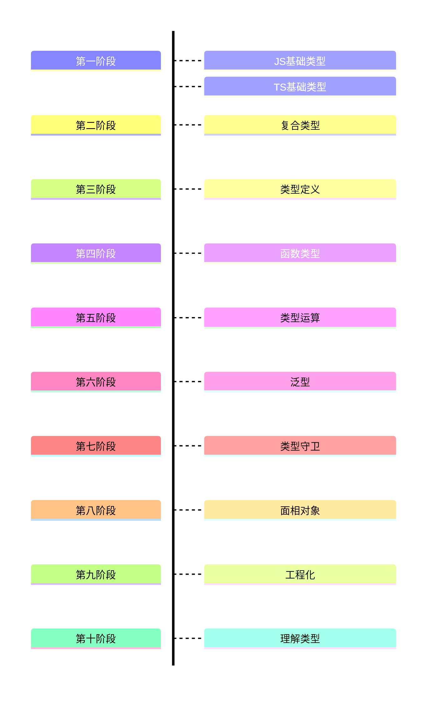

# TypeScript 入门到进阶：从"能跑就行"到"类型安全"的修行之路

## 写在前面：TypeScript 不是来为难你的

很多前端开发者第一次接触 TypeScript 时，内心戏大概是这样的：

> "我写 JavaScript 写得好好的，为什么要在变量后面加个冒号和类型？这不是徒增工作量吗？"

> "类型报错好烦啊，我明明运行的时候没问题。"

> "TS 代码写起来好慢，我还是用 JS 吧。"

这些感受非常真实。但如果你坚持用过一段时间 TypeScript，再回头写纯 JavaScript，很可能会产生一种奇妙的戒断反应：

> "这个变量到底是什么类型？这个函数返回什么？这个对象的字段有哪些？"

当你开始频繁问这些问题的时候，就说明 TypeScript 已经悄悄改变了你思考代码的方式。

TypeScript 本质上不是一门新语言，而是 JavaScript 的"超集"——它给 JavaScript 加上了一套**静态类型系统**。你的 TS 代码最终还是会编译成 JS 代码运行。类型系统不会让你的程序跑得更快，也不会让它在浏览器里多出一些神奇能力。它的价值在于：**在代码运行之前，帮你发现大量本可以在写代码时就避免的错误**。

这篇文章面向已经熟悉 JavaScript、但还没系统学过 TypeScript 的开发者。我们会从基础类型讲起，逐步深入到泛型、类型守卫、类型兼容性、工程化配置等进阶话题。文章有点长，但我保证：读完之后，你会对 TypeScript 有一个完整的认识，而不是只会写几个 `: string` 和 `: number`。

## 学习路径

### 第一阶段：单个值的类型

基础类型
string、number、boolean 等原始类型
any、unknown、void、null、undefined、never
类型推断与类型注解
这是整个类型系统的地基。先搞清楚"一个变量可以是什么"，才能讨论更复杂的结构。

### 第二阶段：把值组合起来

复合类型（容器类型）
数组 T[]
元组 [T, U]
对象类型 { name: string }
数组、元组、对象类型都是在回答同一个问题：多个值怎么组织在一起。数组是同构集合，元组是固定长度的异构序列，对象是键值对映射。

### 第三阶段：给复合类型起名字、做抽象

接口 interface 与类型别名 type
interface 描述对象形状
type 描述更灵活的类型
两者的区别与选择
学会用 interface 和 type 复用类型定义，避免到处写重复的对象结构。

### 第四阶段：代码的行为单元

函数类型
参数类型与返回值类型
可选参数、默认参数、剩余参数
函数类型表达式与高阶函数
函数是代码的行为单元。前面已经会描述"数据长什么样"，现在要学会描述"函数对数据做什么"。

### 第五阶段：类型之间的运算

类型组合
联合类型 A | B（或）
交叉类型 A & B（且）
索引签名与索引访问类型
到这一步，类型不再是静态标签，而是可以像集合一样做并、交、投影运算。联合类型为后面的"类型收窄"埋下伏笔。

### 第六阶段：类型参数化

泛型 T
泛型函数
泛型接口与泛型类
泛型约束 extends
泛型本质上是"类型的函数"。它依赖于前面已经理解的函数、接口、类型组合，把具体类型延迟到调用时再确定。

### 第七阶段：处理不确定的类型

类型守卫与类型收窄
typeof、instanceof、in
自定义类型守卫 is
可辨识联合
联合类型让我们能表达"可能是 A，也可能是 B"，但使用时必须收窄。没有第五阶段的联合类型，就很难理解为什么要收窄。

### 第八阶段：面向对象编程

类与面向对象
类、构造函数、访问修饰符
implements 接口
抽象类
类是对数据和行为的封装。它依赖接口（第三阶段）和函数类型（第四阶段），是另一种组织代码的方式。

### 第九阶段：工程化与大型项目

模块系统与声明文件
ES Module / CommonJS
import type / export type
.d.ts 声明文件与 declare
当项目变大，代码必须拆成模块。声明文件则解决"怎么用没有类型的 JS 库"的问题。

tsconfig.json 工程化配置
编译目标、模块系统、严格模式
路径别名
tsc --noEmit 与构建工具的配合
这是从"写 TypeScript"到"用 TypeScript 做项目"的分水岭。

### 第十阶段：理解类型的本质

类型兼容性与结构类型系统
结构类型 vs 名义类型
对象与函数的兼容性规则
理解为什么"看起来一样的类型就是一样的"，解释很多类型报错的底层逻辑。

类型体操入门
映射类型
条件类型
infer
这是前面所有工具的组合运用：泛型 + 索引类型 + 条件判断。放在最后，因为它需要前面所有概念作为前置。

| 顺序 | 逻辑 |
| --- | --- |
| 基础类型 -> 复合类型 | 先学"原子"，再学"分子" |
| 复合类型 → interface/type | 先写具体结构，再抽象复用 |
| 类型组合 → 泛型 | 先会手动组合类型，再学参数化组合 |
| 联合类型 → 类型收窄 | 先有"或"类型，才需要判断到底是哪个 |
| 接口 → 类 | 类是接口的实现载体之一 |
| 模块/tsconfig → 类型兼容性/体操 | 先能写项目，再深入原理和高级技巧 |
